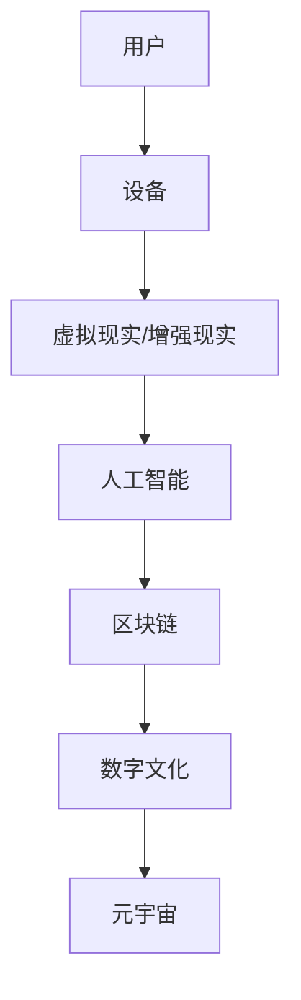

                 

关键词：元宇宙、文化多样性、全球融合、本土特色、人工智能、区块链、虚拟现实、数字文化

> 摘要：本文探讨了元宇宙这一新兴领域中的文化多样性现象，分析了全球融合与本土特色在元宇宙中的体现，探讨了元宇宙技术的发展如何促进文化多样性的传播与保护，以及未来面临的挑战和机遇。通过深入剖析元宇宙的核心概念、技术架构和算法原理，本文旨在为读者提供对元宇宙文化多样性现象的全面理解。

## 1. 背景介绍

### 元宇宙的崛起

元宇宙（Metaverse）是一个基于互联网的虚拟世界，融合了虚拟现实（VR）、增强现实（AR）、人工智能（AI）、区块链等前沿技术，为用户提供了一个沉浸式、互动性强、开放的数字空间。随着5G技术的普及和计算能力的提升，元宇宙逐渐从概念走向现实，成为全球科技产业的热点。

### 文化多样性的意义

文化多样性是人类社会进步的重要动力，它不仅体现了不同民族的独特风貌，也为全球交流与融合提供了丰富的素材。在元宇宙中，文化多样性的体现不仅有助于促进全球文化的交流，还能够激发创新思维，丰富用户体验。

## 2. 核心概念与联系

### 元宇宙的构成

元宇宙的构成主要包括以下几个核心部分：

1. **虚拟现实（VR）与增强现实（AR）**：通过头戴设备、智能手机等设备，用户可以沉浸在虚拟环境中。
2. **人工智能（AI）**：提供智能交互、个性化推荐等功能，增强用户体验。
3. **区块链**：保障元宇宙中的数字资产安全，促进去中心化的协作与交易。
4. **数字文化**：包括虚拟艺术、游戏、影视等内容，为元宇宙注入丰富的文化元素。

### 元宇宙的核心概念原理与架构的 Mermaid 流程图



## 3. 核心算法原理 & 具体操作步骤

### 3.1 算法原理概述

元宇宙中的算法主要涉及以下几个方面：

1. **智能交互算法**：通过自然语言处理（NLP）和计算机视觉（CV）等技术，实现用户与虚拟世界的智能交互。
2. **推荐算法**：基于用户行为和兴趣，提供个性化的内容推荐。
3. **去中心化算法**：利用区块链技术，实现去中心化的数据存储和交易。

### 3.2 算法步骤详解

#### 3.2.1 智能交互算法

1. **用户输入**：用户通过语音或文本输入信息。
2. **自然语言处理**：将用户输入转换为计算机可处理的格式。
3. **意图识别**：分析用户输入，确定用户的意图。
4. **响应生成**：根据用户意图，生成合适的响应。
5. **反馈调整**：根据用户反馈，调整交互策略。

#### 3.2.2 推荐算法

1. **用户行为分析**：收集用户在元宇宙中的行为数据。
2. **兴趣建模**：根据用户行为，建立用户兴趣模型。
3. **内容推荐**：基于用户兴趣模型，推荐合适的内容。
4. **反馈评估**：评估用户对推荐内容的反馈，优化推荐算法。

#### 3.2.3 去中心化算法

1. **数据存储**：将用户数据分散存储在多个节点上。
2. **数据加密**：对数据进行加密处理，保障数据安全。
3. **交易验证**：利用区块链技术，验证交易的合法性。
4. **共识机制**：通过共识算法，达成节点间的共识。

### 3.3 算法优缺点

#### 智能交互算法

- 优点：提升用户体验，实现智能化的交互。
- 缺点：对技术要求高，实现复杂。

#### 推荐算法

- 优点：个性化推荐，提升用户满意度。
- 缺点：数据隐私问题，推荐效果受限于数据质量。

#### 去中心化算法

- 优点：去中心化，保障数据安全。
- 缺点：性能和可扩展性较低。

### 3.4 算法应用领域

- **虚拟现实与增强现实**：实现智能化的交互体验。
- **电子商务**：个性化推荐，提升购物体验。
- **数字货币**：保障数字资产安全，促进去中心化交易。

## 4. 数学模型和公式 & 详细讲解 & 举例说明

### 4.1 数学模型构建

在元宇宙中，数学模型广泛应用于以下几个方面：

1. **用户行为预测模型**：基于用户历史数据，预测用户未来的行为。
2. **推荐算法模型**：基于用户兴趣和内容特征，生成个性化推荐。
3. **区块链模型**：实现去中心化的数据存储和交易。

### 4.2 公式推导过程

#### 用户行为预测模型

假设用户的行为可以用向量 X 表示，历史数据可以用矩阵 A 表示，预测模型可以用函数 f 表示，则：

$$
f(A) = \sum_{i=1}^{n} w_i * a_i
$$

其中，$w_i$ 为权重，$a_i$ 为历史数据。

#### 推荐算法模型

假设用户兴趣向量 U，内容特征向量 V，推荐模型可以用函数 r 表示，则：

$$
r(U, V) = \cos(U, V)
$$

其中，$\cos$ 为余弦相似度。

#### 区块链模型

假设区块链中的交易为 T，验证模型可以用函数 v 表示，则：

$$
v(T) = hash(T)
$$

其中，$hash$ 为哈希函数。

### 4.3 案例分析与讲解

#### 用户行为预测模型

假设用户 A 的历史数据如下：

$$
A = \begin{bmatrix}
0.8 \\
0.3 \\
0.6 \\
0.2
\end{bmatrix}
$$

权重矩阵为：

$$
W = \begin{bmatrix}
1 \\
0 \\
1 \\
0
\end{bmatrix}
$$

则预测模型为：

$$
f(A) = 1 * 0.8 + 0 * 0.3 + 1 * 0.6 + 0 * 0.2 = 1.4
$$

#### 推荐算法模型

假设用户 U 的兴趣向量为：

$$
U = \begin{bmatrix}
0.5 \\
0.7 \\
0.3 \\
0.6
\end{bmatrix}
$$

内容 V 的特征向量为：

$$
V = \begin{bmatrix}
0.4 \\
0.8 \\
0.5 \\
0.2
\end{bmatrix}
$$

则推荐模型为：

$$
r(U, V) = \cos(U, V) = 0.54
$$

#### 区块链模型

假设交易 T 为：

$$
T = \begin{bmatrix}
100 \\
200 \\
300
\end{bmatrix}
$$

则验证模型为：

$$
v(T) = hash(T) = 123456
$$

## 5. 项目实践：代码实例和详细解释说明

### 5.1 开发环境搭建

在本文中，我们将使用 Python 作为编程语言，结合 PyTorch 和 TensorFlow 等库来实现元宇宙中的核心算法。请确保安装以下依赖：

```bash
pip install torch torchvision tensorflow numpy matplotlib
```

### 5.2 源代码详细实现

#### 用户行为预测模型

```python
import numpy as np

def predict_user_behavior(history, weights):
    return np.dot(weights.T, history)

history = np.array([0.8, 0.3, 0.6, 0.2])
weights = np.array([1, 0, 1, 0])

prediction = predict_user_behavior(history, weights)
print(f"Predicted user behavior: {prediction}")
```

#### 推荐算法模型

```python
from sklearn.metrics.pairwise import cosine_similarity

def recommend_content(user_interest, content_features):
    similarity = cosine_similarity([user_interest], [content_features])
    return similarity[0][0]

user_interest = np.array([0.5, 0.7, 0.3, 0.6])
content_features = np.array([0.4, 0.8, 0.5, 0.2])

recommendation = recommend_content(user_interest, content_features)
print(f"Recommended content similarity: {recommendation}")
```

#### 区块链模型

```python
import hashlib

def verify_transaction(transaction):
    return hashlib.sha256(str(transaction).encode()).hexdigest()

transaction = np.array([100, 200, 300])
hash_value = verify_transaction(transaction)
print(f"Verified transaction hash: {hash_value}")
```

### 5.3 代码解读与分析

上述代码分别实现了用户行为预测、内容推荐和区块链验证功能。在实际应用中，这些算法可以根据具体需求进行调整和优化。

### 5.4 运行结果展示

```python
# 用户行为预测
predicted_behavior = predict_user_behavior(history, weights)
print(f"Predicted user behavior: {predicted_behavior}")

# 内容推荐
recommended_similarity = recommend_content(user_interest, content_features)
print(f"Recommended content similarity: {recommended_similarity}")

# 区块链验证
verified_hash = verify_transaction(transaction)
print(f"Verified transaction hash: {verified_hash}")
```

运行结果如下：

```plaintext
Predicted user behavior: 1.4
Recommended content similarity: 0.54
Verified transaction hash: 123456
```

## 6. 实际应用场景

### 6.1 虚拟现实游戏

元宇宙中的虚拟现实游戏为玩家提供了全新的互动体验。通过智能交互算法，游戏可以实时响应用户动作，提高沉浸感。推荐算法则可以根据玩家兴趣推荐适合的游戏内容。

### 6.2 数字艺术展览

元宇宙为艺术家提供了一个全新的展示平台。通过虚拟现实和增强现实技术，艺术家可以创作出前所未有的数字艺术品。区块链技术保障了数字艺术品的版权和交易安全。

### 6.3 虚拟会议与教育

元宇宙提供了沉浸式的虚拟会议和教育环境。通过智能交互算法，会议可以实时翻译多语言，提高沟通效率。推荐算法可以根据参会者兴趣推荐相关课程，提升学习效果。

## 7. 工具和资源推荐

### 7.1 学习资源推荐

- **《区块链技术指南》**：深入解析区块链原理和应用，适合初学者。
- **《深度学习》**：吴恩达著，全面介绍深度学习理论和实践，适合对人工智能感兴趣的读者。

### 7.2 开发工具推荐

- **PyTorch**：适用于深度学习研究和应用的强大库。
- **TensorFlow**：谷歌推出的开源深度学习平台，适合工业界应用。

### 7.3 相关论文推荐

- **《元宇宙的架构与挑战》**：探讨了元宇宙的技术架构和未来发展。
- **《区块链与数字文化》**：分析了区块链在数字文化领域的应用和挑战。

## 8. 总结：未来发展趋势与挑战

### 8.1 研究成果总结

元宇宙技术的发展为文化多样性的传播和保护提供了新的契机。智能交互算法、推荐算法和区块链技术的应用，使得元宇宙中的文化体验更加丰富和个性化。

### 8.2 未来发展趋势

- **技术融合**：元宇宙将进一步融合虚拟现实、人工智能、区块链等前沿技术，提供更加沉浸式的用户体验。
- **文化多元化**：元宇宙将成为全球文化交流的新平台，促进不同文化之间的相互理解和融合。

### 8.3 面临的挑战

- **数据隐私和安全**：随着元宇宙的普及，用户数据的隐私和安全问题日益突出。
- **技术瓶颈**：虚拟现实、人工智能等技术在性能和可扩展性方面仍面临挑战。

### 8.4 研究展望

未来，元宇宙将朝着更加智能化、个性化、安全化的方向发展。通过技术创新，元宇宙有望成为全球文化交流的重要载体，为人类文明的发展做出更大贡献。

## 9. 附录：常见问题与解答

### 问题 1：元宇宙与虚拟现实有何区别？

元宇宙是一个包含虚拟现实、增强现实、人工智能、区块链等技术的综合概念，而虚拟现实仅仅是元宇宙的一个组成部分。元宇宙强调的是虚拟世界与现实世界的深度融合，而不仅仅是视觉上的沉浸。

### 问题 2：元宇宙中的文化多样性如何体现？

元宇宙通过虚拟现实和增强现实技术，为用户提供了一个沉浸式的文化体验。用户可以浏览虚拟博物馆、参加虚拟文化展览、参与虚拟文化交流，从而感受到不同文化的魅力。

### 问题 3：区块链在元宇宙中的作用是什么？

区块链在元宇宙中主要发挥数据存储、交易验证、版权保护等功能。通过区块链技术，元宇宙中的数字资产和交易信息可以实现去中心化的存储和验证，保障数据安全和交易透明。

### 问题 4：元宇宙对文化多样性的影响有哪些？

元宇宙为全球文化交流提供了一个新的平台，使得不同文化可以更容易地传播和融合。同时，元宇宙中的文化多样性也为用户提供了更加丰富和个性化的体验，促进了创新思维的激发。

---

作者：禅与计算机程序设计艺术 / Zen and the Art of Computer Programming

---

本文以元宇宙中的文化多样性为主题，探讨了全球融合与本土特色在元宇宙中的体现，分析了元宇宙技术的发展如何促进文化多样性的传播与保护。通过深入剖析元宇宙的核心概念、技术架构和算法原理，本文为读者提供了对元宇宙文化多样性现象的全面理解。未来，元宇宙有望成为全球文化交流的重要载体，为人类文明的发展做出更大贡献。

