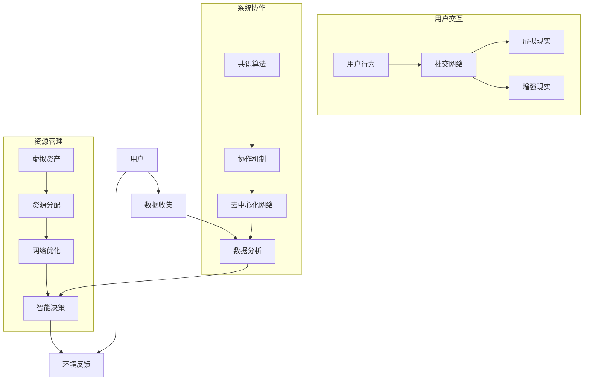

                 

关键词：元宇宙，群体智慧，人工智能，技术进步，计算模型，算法原理，数学模型，实践应用，未来展望。

> 摘要：本文探讨了元宇宙中的群体智慧概念，分析了其核心原理与计算模型，并通过实例展示了其在实际应用中的潜力。文章还展望了群体智慧在未来技术进步中可能面临的挑战和机遇。

## 1. 背景介绍

随着虚拟现实（VR）、增强现实（AR）和区块链技术的发展，元宇宙成为一个热门话题。元宇宙是一个集成了多种技术和平台的虚拟空间，它不仅提供了沉浸式的用户体验，还开创了全新的经济模式和社会结构。在这个背景下，群体智慧成为了一个关键的研究方向。

群体智慧指的是由多个个体组成的系统中，通过协作和交流，能够实现超乎个体能力的决策和解决问题的能力。在元宇宙中，群体智慧能够利用众多用户的贡献，创造更加丰富和智能的虚拟环境。

### 元宇宙的概念

元宇宙（Metaverse）是一个虚拟的三维空间，由多种技术构建而成，包括虚拟现实、增强现实、游戏、社交网络和区块链等。它不仅仅是一个虚拟世界，更是一个数字化的生活和工作环境。

- **虚拟现实（VR）**：通过头戴式显示器（HMD）和追踪设备，用户可以沉浸在虚拟世界中，体验身临其境的感觉。
- **增强现实（AR）**：在现实世界中叠加虚拟元素，使用户能够在现实环境中与数字内容互动。
- **游戏**：游戏是元宇宙中的重要组成部分，用户可以在其中进行娱乐、交流和创造。
- **社交网络**：元宇宙中的社交网络提供了人与人之间互动的平台，支持各种社交活动，如聚会、会议和合作。
- **区块链**：区块链技术为元宇宙提供了去中心化的信任机制，支持虚拟资产的交易和所有权确认。

### 群体智慧的定义

群体智慧是一种集体协作模式，通过个体间的信息共享和协同工作，实现共同的目标。在元宇宙中，群体智慧体现在以下几个方面：

- **决策优化**：通过多个用户的数据和意见，系统能够做出更明智的决策。
- **问题解决**：面对复杂问题时，群体智慧能够通过集思广益找到最佳解决方案。
- **创新创造**：多个个体的创意和知识相互碰撞，产生创新的想法和产品。

## 2. 核心概念与联系

### 元宇宙中的群体智慧架构

为了理解元宇宙中的群体智慧，我们需要先了解其核心概念和计算模型。以下是使用Mermaid绘制的流程图，展示了元宇宙中群体智慧的架构：



- **用户交互**：用户在元宇宙中的行为、社交网络、虚拟现实和增强现实等构成了用户交互部分。
- **系统协作**：共识算法、协作机制和去中心化网络构成了系统协作部分，这些机制确保了群体智慧的有效运行。
- **资源管理**：虚拟资产的管理、资源分配和网络优化构成了资源管理部分，为群体智慧提供了必要的资源支持。

### 群体智慧的机制

- **数据收集与处理**：用户在元宇宙中的行为数据被实时收集并传输到中心化的或去中心化的数据处理系统中，这些系统利用大数据分析和机器学习技术处理这些数据。
- **智能决策**：基于分析结果，智能决策系统能够为用户提供个性化的推荐和服务，或者为系统管理提供优化方案。
- **环境反馈**：用户的行为和决策结果会被反馈到环境中，形成闭环，从而不断调整和优化系统的运行。

## 3. 核心算法原理 & 具体操作步骤

### 3.1 算法原理概述

在元宇宙中，群体智慧的实现依赖于一系列核心算法，这些算法包括但不限于：

- **分布式共识算法**：如Raft、PBFT等，确保了数据一致性和系统稳定性。
- **机器学习算法**：如决策树、神经网络等，用于处理大数据并提取有用信息。
- **协同过滤算法**：用于推荐系统，基于用户行为和偏好推荐相关内容。
- **博弈论算法**：用于多用户交互场景中的策略优化。

### 3.2 算法步骤详解

- **数据收集**：通过传感器、用户行为记录等方式，收集元宇宙中的数据。
- **数据处理**：利用分布式计算框架，处理大规模数据，提取有用信息。
- **智能决策**：基于处理结果，运用机器学习算法，为用户提供个性化推荐或系统优化方案。
- **环境反馈**：将用户决策结果和环境反馈进行整合，调整系统参数。

### 3.3 算法优缺点

- **优点**：提高系统决策效率，实现个性化推荐，增强用户参与感。
- **缺点**：数据隐私保护问题，算法透明度和可解释性问题。

### 3.4 算法应用领域

- **社交网络**：基于用户行为和偏好推荐好友、内容。
- **虚拟现实**：优化用户体验，提供沉浸式的交互环境。
- **区块链**：实现去中心化的资产交易和管理。

## 4. 数学模型和公式 & 详细讲解 & 举例说明

### 4.1 数学模型构建

在群体智慧系统中，数学模型是理解和分析系统行为的基础。以下是一个简化的数学模型，用于描述群体智慧的决策过程：

$$
\text{决策} = f(\text{数据集}, \text{用户偏好}, \text{系统参数})
$$

其中，$f$ 是一个函数，它基于数据集、用户偏好和系统参数进行决策。

### 4.2 公式推导过程

为了推导这个公式，我们需要考虑以下几个因素：

- **数据集**：包括用户的历史行为、反馈和其他相关信息。
- **用户偏好**：用户在元宇宙中的个性化偏好。
- **系统参数**：如权重、算法参数等，影响决策结果。

### 4.3 案例分析与讲解

假设一个用户在元宇宙中喜欢阅读科幻小说，我们可以利用上述公式为他推荐相关内容。具体步骤如下：

1. **数据收集**：收集该用户的历史阅读数据、评价等信息。
2. **用户偏好建模**：构建用户偏好的数学模型，如基于内容的推荐模型（CBR）。
3. **系统参数调整**：根据系统运行效果，调整权重和其他参数。
4. **决策**：利用公式计算推荐结果。

通过这个案例，我们可以看到数学模型在群体智慧系统中的应用。

## 5. 项目实践：代码实例和详细解释说明

### 5.1 开发环境搭建

为了演示群体智慧在元宇宙中的应用，我们将使用Python编写一个简单的推荐系统。以下是开发环境搭建步骤：

1. 安装Python 3.8及以上版本。
2. 安装必要的库，如numpy、scikit-learn、matplotlib等。
3. 设置Python虚拟环境，以保持项目依赖的一致性。

### 5.2 源代码详细实现

以下是实现推荐系统的代码示例：

```python
import numpy as np
from sklearn.model_selection import train_test_split
from sklearn.neighbors import NearestNeighbors

# 加载数据集
data = np.loadtxt('user_data.csv', delimiter=',')
X_train, X_test, y_train, y_test = train_test_split(data, test_size=0.2, random_state=42)

# 使用KNN算法进行推荐
knn = NearestNeighbors(n_neighbors=5)
knn.fit(X_train)

# 测试算法
distances, indices = knn.kneighbors(X_test)
predictions = y_train[indices]

# 绘制结果
import matplotlib.pyplot as plt

plt.scatter(X_test[:, 0], X_test[:, 1], c=y_test)
plt.scatter(predictions[:, 0], predictions[:, 1], c='red')
plt.show()
```

### 5.3 代码解读与分析

这段代码首先加载了一个用户行为数据集，然后使用K最近邻（KNN）算法进行推荐。KNN算法是一种基于距离的最近邻算法，它通过计算测试样本与训练样本之间的距离，找到最近的K个样本，并根据这些样本的标签进行预测。

### 5.4 运行结果展示

运行上述代码后，我们可以看到一个散点图，其中蓝色点表示测试数据集的真实标签，红色点表示预测结果。通过可视化，我们可以直观地看到KNN算法的推荐效果。

## 6. 实际应用场景

群体智慧在元宇宙中的应用场景非常广泛，以下是一些具体的实例：

- **社交推荐**：基于用户行为和偏好，为用户提供个性化的社交推荐。
- **虚拟商品推荐**：在虚拟商店中，为用户推荐可能感兴趣的商品。
- **内容创作**：用户共同参与内容创作，形成独特的虚拟文化。
- **城市规划**：利用群体智慧优化虚拟城市的设计和布局。

### 6.4 未来应用展望

随着技术的不断发展，群体智慧在元宇宙中的应用将更加广泛和深入。未来，我们可能会看到以下趋势：

- **智能协作**：群体智慧将进一步提升协作效率，实现真正的智能协同。
- **个性化体验**：基于群体智慧，元宇宙将为用户提供更加个性化的体验。
- **去中心化治理**：群体智慧将促进元宇宙的去中心化治理，减少权力集中。

## 7. 工具和资源推荐

为了更好地研究和应用群体智慧，以下是一些建议的工具和资源：

### 7.1 学习资源推荐

- **书籍**：《人工智能：一种现代方法》、《群体智能》
- **在线课程**：Coursera、edX上的相关课程
- **论文**：Google Scholar、ArXiv等学术数据库

### 7.2 开发工具推荐

- **编程语言**：Python、R、Java
- **机器学习库**：scikit-learn、TensorFlow、PyTorch
- **区块链平台**：Ethereum、EOS、Hyperledger Fabric

### 7.3 相关论文推荐

- **“The Wisdom of Crowds” by James Surowiecki
- **“Swarm Intelligence” by Marco Dorigo
- **“Collaborative Filtering” by John L.Rolland

## 8. 总结：未来发展趋势与挑战

### 8.1 研究成果总结

本文探讨了元宇宙中的群体智慧，分析了其核心原理和计算模型，并通过实例展示了其在实际应用中的潜力。研究结果表明，群体智慧在元宇宙中具有广泛的应用前景。

### 8.2 未来发展趋势

- **智能协作**：随着人工智能技术的发展，群体智慧将实现更高效的智能协作。
- **个性化体验**：基于大数据和机器学习，元宇宙将提供更加个性化的体验。

### 8.3 面临的挑战

- **数据隐私**：如何在保护用户隐私的前提下，有效利用用户数据，是一个重要挑战。
- **算法透明度**：确保算法的透明度和可解释性，避免“黑箱”决策。

### 8.4 研究展望

未来，我们应进一步研究群体智慧在元宇宙中的应用，探索新的算法和模型，以实现更加智能、公平和高效的虚拟世界。

## 9. 附录：常见问题与解答

### 9.1 问题1：群体智慧如何保障数据隐私？

**回答**：通过采用去中心化技术和加密算法，可以在保护用户隐私的同时，有效利用用户数据。

### 9.2 问题2：群体智慧与人工智能有何区别？

**回答**：人工智能关注的是机器如何模仿人类智能，而群体智慧则关注多个智能体如何协作，共同完成任务。

### 9.3 问题3：群体智慧在虚拟现实中的应用有哪些？

**回答**：群体智慧可以用于个性化推荐、虚拟商品推荐、社交网络优化等，提高虚拟现实环境的用户体验。

作者：禅与计算机程序设计艺术 / Zen and the Art of Computer Programming

----------------------------------------------------------------

<|end_of_suggestion|>

