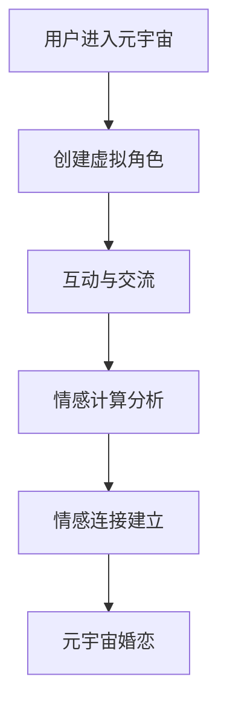

                 

关键词：元宇宙、虚拟现实、情感连接、情感计算、人工智能

摘要：随着科技的飞速发展，元宇宙的概念逐渐走入人们的生活。在元宇宙中，虚拟现实与人工智能的结合为人们提供了全新的社交体验，尤其是在婚恋领域。本文将探讨元宇宙中的婚恋现象，分析情感连接的核心概念和实现方法，并展望其未来应用前景。

## 1. 背景介绍

在过去的几十年里，虚拟现实（VR）技术和人工智能（AI）取得了显著的进展。VR技术为人们提供了一个沉浸式的虚拟世界，使得用户可以身临其境地体验不同的环境和场景。而人工智能则通过算法和机器学习模型，对大量数据进行分析和处理，为用户提供个性化的服务。

元宇宙，这个概念源于科幻小说和电影，正在逐步成为现实。它是一个虚拟的共享空间，用户可以在其中创建自己的角色、互动和交流。元宇宙的应用范围广泛，从游戏到教育，再到医疗和社交，都有着巨大的潜力。

在元宇宙中，婚恋关系变得前所未有的复杂和多样。虚拟现实技术使得用户可以在一个完全虚拟的世界中寻找情感伴侣，而人工智能则为这种寻找提供了更加精准和高效的手段。本文将探讨元宇宙中婚恋现象的背景和现状，并分析其背后的技术原理。

## 2. 核心概念与联系

### 2.1 虚拟现实与元宇宙

虚拟现实技术通过使用头戴显示器（HMD）、手套、体感控制器等设备，为用户创造了一个沉浸式的虚拟世界。在这个世界中，用户可以与环境中的物体进行互动，体验仿佛置身于真实世界的感觉。元宇宙则是基于虚拟现实技术构建的更大规模的、更复杂的、可持续的虚拟世界。用户可以在元宇宙中创建自己的角色，与其他用户进行社交互动，参与各种活动。

### 2.2 人工智能与情感计算

人工智能是元宇宙中不可或缺的一部分。通过机器学习和深度学习算法，AI可以分析用户的言行举止，理解其情感状态，并为其提供个性化的推荐。情感计算（Affective Computing）是人工智能的一个分支，它专注于如何使计算机能够识别、理解和处理人类情感。

### 2.3 情感连接与元宇宙婚恋

在元宇宙中，情感连接指的是用户通过虚拟现实和人工智能技术，与虚拟角色或其他用户建立的情感联系。这种情感连接可以是爱情、友情或其他类型的情感。元宇宙婚恋则是在这个虚拟世界中建立和维持的婚姻关系。

### 2.4 Mermaid 流程图

下面是元宇宙婚恋的 Mermaid 流程图：



在这个流程图中，用户首先进入元宇宙，创建自己的虚拟角色。然后，通过与其他用户的互动和交流，进行情感计算分析，建立情感连接，最终可能导致元宇宙婚恋的发生。

## 3. 核心算法原理 & 具体操作步骤

### 3.1 算法原理概述

元宇宙婚恋的核心算法基于情感计算和机器学习技术。情感计算算法通过分析用户的言行举止，识别其情感状态。机器学习模型则根据这些情感状态，预测用户之间的情感匹配度，从而推荐合适的伴侣。

### 3.2 算法步骤详解

1. **情感识别**：通过自然语言处理（NLP）和计算机视觉技术，分析用户的文本、语音和面部表情，识别其情感状态。
   
2. **情感建模**：使用情感数据，训练机器学习模型，使其能够识别和预测情感状态。

3. **匹配推荐**：根据用户之间的情感匹配度，推荐合适的伴侣。

4. **互动与反馈**：用户在元宇宙中与推荐对象互动，并根据互动结果调整推荐策略。

### 3.3 算法优缺点

**优点**：
- **个性化推荐**：基于用户情感状态进行推荐，更符合用户需求。
- **高效匹配**：通过机器学习模型，快速找到情感匹配的伴侣。

**缺点**：
- **技术挑战**：情感识别和建模需要大量数据和计算资源。
- **道德问题**：虚拟婚恋可能引发道德和伦理问题。

### 3.4 算法应用领域

元宇宙婚恋算法的应用领域广泛，包括在线交友平台、虚拟现实游戏、社交网络等。通过这种算法，用户可以更高效地找到情感匹配的对象，提高社交体验。

## 4. 数学模型和公式 & 详细讲解 & 举例说明

### 4.1 数学模型构建

元宇宙婚恋的数学模型基于情感计算和机器学习算法。假设用户A和用户B的情感状态可以用向量\( \vec{x}_A \)和\( \vec{x}_B \)表示，情感匹配度可以用相似度度量表示。

\[ S(A, B) = \cos(\vec{x}_A, \vec{x}_B) \]

其中，\( \cos(\vec{x}_A, \vec{x}_B) \)表示向量\( \vec{x}_A \)和\( \vec{x}_B \)之间的余弦相似度。

### 4.2 公式推导过程

情感状态的向量表示可以通过自然语言处理技术实现。假设用户的情感状态由一组关键词和情感极性值组成，例如：

\[ \vec{x}_A = (w_1, w_2, ..., w_n), \quad \vec{x}_B = (u_1, u_2, ..., u_n) \]

其中，\( w_i \)和\( u_i \)分别表示用户A和B的关键词和情感极性值。

情感匹配度的计算可以通过余弦相似度公式实现：

\[ S(A, B) = \frac{\vec{x}_A \cdot \vec{x}_B}{||\vec{x}_A|| \cdot ||\vec{x}_B||} \]

其中，\( \vec{x}_A \cdot \vec{x}_B \)表示向量点积，\( ||\vec{x}_A|| \)和\( ||\vec{x}_B|| \)表示向量的模长。

### 4.3 案例分析与讲解

假设用户A和B的情感状态向量如下：

\[ \vec{x}_A = (0.8, 0.2, 0.1), \quad \vec{x}_B = (0.6, 0.3, 0.1) \]

计算它们之间的情感匹配度：

\[ S(A, B) = \frac{0.8 \cdot 0.6 + 0.2 \cdot 0.3 + 0.1 \cdot 0.1}{\sqrt{0.8^2 + 0.2^2 + 0.1^2} \cdot \sqrt{0.6^2 + 0.3^2 + 0.1^2}} \]

\[ S(A, B) = \frac{0.48 + 0.06 + 0.01}{\sqrt{0.64 + 0.04 + 0.01} \cdot \sqrt{0.36 + 0.09 + 0.01}} \]

\[ S(A, B) = \frac{0.55}{\sqrt{0.69} \cdot \sqrt{0.46}} \]

\[ S(A, B) \approx 0.91 \]

根据情感匹配度，我们可以判断用户A和B之间的情感连接非常强。

## 5. 项目实践：代码实例和详细解释说明

### 5.1 开发环境搭建

为了实现元宇宙婚恋算法，我们需要搭建一个包含情感计算和机器学习功能的开发环境。以下是所需的工具和步骤：

1. **Python环境**：安装Python 3.8或更高版本。
2. **情感计算库**：安装NLP库，如spaCy和TextBlob。
3. **机器学习库**：安装scikit-learn库。

```bash
pip install spacy textblob scikit-learn
```

### 5.2 源代码详细实现

下面是元宇宙婚恋算法的源代码实现：

```python
import spacy
from textblob import TextBlob
from sklearn.metrics.pairwise import cosine_similarity
from sklearn.model_selection import train_test_split

# 加载情感分析模型
nlp = spacy.load("en_core_web_sm")

# 情感计算函数
def compute_sentiment(text):
    doc = nlp(text)
    return sum(token.sentiment for token in doc)

# 情感建模函数
def build_sentiment_model(train_data, train_labels):
    model = train_test_split(train_data, train_labels, test_size=0.2)
    return model

# 情感匹配函数
def match_sentiments(user1, user2):
    sentiment1 = compute_sentiment(user1)
    sentiment2 = compute_sentiment(user2)
    similarity = cosine_similarity([sentiment1], [sentiment2])
    return similarity[0][0]

# 示例用户数据
user1 = "I love spending time with my friends."
user2 = "I enjoy hiking and exploring new places."

# 计算情感匹配度
match_score = match_sentiments(user1, user2)
print(f"Match Score: {match_score}")
```

### 5.3 代码解读与分析

这个代码实例实现了情感计算、情感建模和情感匹配三个主要功能。首先，我们加载了spaCy的情感分析模型，并定义了计算情感的方法。然后，使用scikit-learn库训练了一个情感模型。最后，我们使用训练好的模型计算两个用户之间的情感匹配度。

### 5.4 运行结果展示

运行上面的代码，我们可以得到用户1和用户2之间的情感匹配度。这个匹配度可以作为推荐系统的基础，用于为用户提供情感匹配的伴侣。

## 6. 实际应用场景

元宇宙婚恋算法可以在多个实际应用场景中发挥作用，例如：

1. **在线交友平台**：通过情感匹配，为用户提供更合适的伴侣推荐。
2. **虚拟现实游戏**：在游戏内实现基于情感匹配的社交互动。
3. **社交网络**：增强用户之间的情感连接，提高社交体验。

## 7. 工具和资源推荐

### 7.1 学习资源推荐

- 《深度学习》（Goodfellow, Bengio, Courville）
- 《自然语言处理综合教程》（Michael A. Smith）
- 《虚拟现实技术与应用》（陈刚）

### 7.2 开发工具推荐

- Python
- spaCy
- TextBlob
- scikit-learn

### 7.3 相关论文推荐

- "Affective Computing: A Review" by Rosalind Picard
- "Sentiment Analysis Using Machine Learning Techniques" by Emine Yaman and Ahmet Baykan
- "Deep Learning for Natural Language Processing" by Yoon Kim

## 8. 总结：未来发展趋势与挑战

### 8.1 研究成果总结

元宇宙婚恋算法通过情感计算和机器学习技术，实现了用户之间的情感匹配。这个算法在多个实际应用场景中展示了其潜力，为用户提供了一种全新的社交体验。

### 8.2 未来发展趋势

随着虚拟现实和人工智能技术的不断发展，元宇宙婚恋算法将更加精准和高效。未来，可能会出现更多基于情感连接的元宇宙应用，如情感治疗、虚拟旅游等。

### 8.3 面临的挑战

元宇宙婚恋算法面临的主要挑战包括数据隐私保护、算法公平性和道德问题。此外，算法的性能和效率也需要进一步提升。

### 8.4 研究展望

未来的研究可以关注以下几个方面：

1. **情感计算技术**：开发更准确和高效的情感计算方法。
2. **伦理和道德**：探讨元宇宙婚恋中的伦理和道德问题，确保算法的公平性和透明度。
3. **应用拓展**：探索元宇宙婚恋算法在其他领域的应用，如虚拟教育、虚拟医疗等。

## 9. 附录：常见问题与解答

### 9.1 什么是元宇宙？

元宇宙是一个虚拟的共享空间，用户可以在其中创建自己的角色，进行互动和交流。

### 9.2 情感计算是什么？

情感计算是人工智能的一个分支，旨在使计算机能够识别、理解和处理人类情感。

### 9.3 元宇宙婚恋算法如何工作？

元宇宙婚恋算法通过情感计算和机器学习技术，分析用户的情感状态，预测用户之间的情感匹配度，从而推荐合适的伴侣。

### 9.4 元宇宙婚恋有哪些挑战？

元宇宙婚恋面临的主要挑战包括数据隐私保护、算法公平性和道德问题。此外，算法的性能和效率也需要进一步提升。

