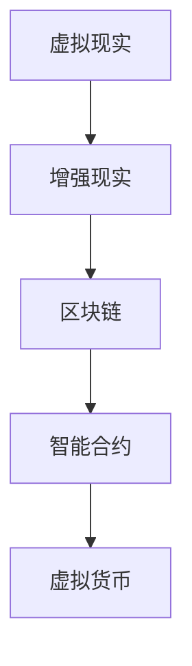
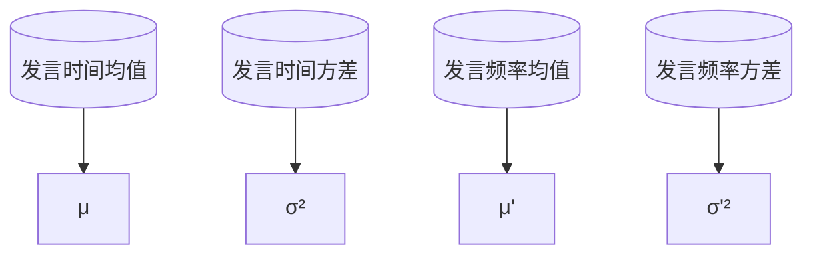

                 

 关键词：元宇宙、政治、虚拟世界、权力博弈、数字治理、技术影响力

> 摘要：本文深入探讨了元宇宙这一虚拟世界中的政治现象和权力博弈，分析了虚拟空间内权力分配、政治实体互动及其对现实世界的影响。通过剖析元宇宙中的核心概念、算法原理、数学模型及实际应用，揭示了虚拟世界与现实世界之间的紧密联系。本文旨在为读者提供对元宇宙政治现象的全面理解，并探讨其在未来社会中的发展潜力和挑战。

## 1. 背景介绍

### 1.1 元宇宙的定义与发展

元宇宙（Metaverse）是一个虚拟的、三维的、互联互通的数字世界，它结合了虚拟现实（VR）、增强现实（AR）、区块链、人工智能等前沿技术，旨在为用户提供一个沉浸式的虚拟生活体验。自20世纪90年代虚拟现实概念的提出以来，元宇宙已经经历了数十年的发展。近年来，随着技术的成熟和应用的普及，元宇宙逐渐从科幻走向现实。

### 1.2 虚拟世界中的政治现象

在虚拟世界中，政治现象同样普遍存在。虚拟国家的建立、虚拟货币的流通、虚拟权力的争夺等现象层出不穷。这些政治活动不仅丰富了虚拟世界的多样性，也对现实世界产生了深远的影响。

### 1.3 元宇宙与现实世界的互动

元宇宙与现实世界的互动日益紧密。一方面，现实世界中的政治、经济、文化等活动在元宇宙中得到了复制和扩展；另一方面，元宇宙中的技术和思想也影响着现实世界的发展。这种互动使得元宇宙政治成为一个不可忽视的研究领域。

## 2. 核心概念与联系

### 2.1 元宇宙中的核心概念

在元宇宙中，核心概念包括虚拟现实（VR）、增强现实（AR）、区块链、智能合约等。这些概念相互交织，共同构成了元宇宙的底层架构。

### 2.2 元宇宙架构的 Mermaid 流程图



### 2.3 虚拟现实与增强现实

虚拟现实和增强现实是元宇宙的重要组成部分。虚拟现实通过头戴显示器、手套等设备，让用户完全沉浸在一个虚拟环境中；而增强现实则通过手机、眼镜等设备，将虚拟元素叠加到现实世界中。

### 2.4 区块链与智能合约

区块链技术为元宇宙提供了去中心化的数据存储和传输方式。智能合约则是在区块链上自动执行代码的协议，它使得虚拟交易更加安全、透明和高效。

## 3. 核心算法原理 & 具体操作步骤

### 3.1 算法原理概述

元宇宙中的核心算法主要包括虚拟现实渲染算法、增强现实叠加算法、区块链共识算法和智能合约执行算法。这些算法共同保证了元宇宙的运行和用户体验。

### 3.2 算法步骤详解

#### 3.2.1 虚拟现实渲染算法

虚拟现实渲染算法分为几何渲染、纹理映射和光照计算三个步骤。首先，对三维模型进行几何渲染，然后通过纹理映射为模型添加材质，最后根据光照计算为场景添加光影效果。

#### 3.2.2 增强现实叠加算法

增强现实叠加算法主要包括图像识别、虚拟元素生成和叠加显示三个步骤。首先，使用图像识别技术定位现实世界中的物体；然后，生成相应的虚拟元素；最后，将虚拟元素叠加到现实世界中。

#### 3.2.3 区块链共识算法

区块链共识算法主要包括工作量证明（PoW）、权益证明（PoS）和委托权益证明（DPoS）等。这些算法确保了区块链网络的安全和去中心化。

#### 3.2.4 智能合约执行算法

智能合约执行算法主要包括代码编译、交易验证和执行结果记录三个步骤。首先，将智能合约代码编译为字节码；然后，对交易进行验证；最后，执行智能合约并记录结果。

### 3.3 算法优缺点

#### 3.3.1 虚拟现实渲染算法

优点：提供高质量的沉浸式体验。

缺点：计算资源消耗大，对硬件要求高。

#### 3.3.2 增强现实叠加算法

优点：增强现实体验，使虚拟元素与现实世界无缝融合。

缺点：对图像识别技术的依赖较高，准确率有待提高。

#### 3.3.3 区块链共识算法

优点：去中心化，提高网络安全性。

缺点：能源消耗大，交易速度较慢。

#### 3.3.4 智能合约执行算法

优点：自动化执行，提高交易效率。

缺点：代码安全风险，可能出现漏洞。

### 3.4 算法应用领域

元宇宙的核心算法在多个领域具有广泛的应用。例如，虚拟现实技术在游戏、教育、医疗等领域得到了广泛应用；增强现实技术在广告、设计、施工等领域具有巨大潜力；区块链技术则有望在金融、供应链管理等领域发挥重要作用。

## 4. 数学模型和公式 & 详细讲解 & 举例说明

### 4.1 数学模型构建

元宇宙中的数学模型主要包括几何模型、概率模型和统计分析模型。几何模型用于描述虚拟空间中的物体形状和位置；概率模型用于描述用户行为和事件发生概率；统计分析模型则用于分析虚拟世界中的数据和趋势。

### 4.2 公式推导过程

#### 4.2.1 几何模型

$$
\vec{P} = (x, y, z)
$$

其中，$\vec{P}$ 表示三维空间中的点，$(x, y, z)$ 表示点的坐标。

#### 4.2.2 概率模型

$$
P(A|B) = \frac{P(A \cap B)}{P(B)}
$$

其中，$P(A|B)$ 表示在事件 $B$ 发生的条件下事件 $A$ 发生的概率；$P(A \cap B)$ 表示事件 $A$ 和事件 $B$ 同时发生的概率；$P(B)$ 表示事件 $B$ 发生的概率。

#### 4.2.3 统计分析模型

$$
\mu = \frac{1}{n}\sum_{i=1}^{n}x_i
$$

$$
\sigma^2 = \frac{1}{n-1}\sum_{i=1}^{n}(x_i - \mu)^2
$$

其中，$\mu$ 表示样本均值；$\sigma^2$ 表示样本方差；$x_i$ 表示第 $i$ 个样本值；$n$ 表示样本数量。

### 4.3 案例分析与讲解

#### 4.3.1 虚拟现实场景构建

假设我们构建一个虚拟会议室，其中包含10个参会者。每个参会者位于一个三维坐标系中的不同位置。我们可以使用几何模型描述每个参会者的位置坐标。

```mermaid
graph TD
    A1[(参会者1)] --> B1[坐标 $(x_1, y_1, z_1)$]
    A2[(参会者2)] --> B2[坐标 $(x_2, y_2, z_2)$]
    ...
    A10[(参会者10)] --> B10[坐标 $(x_{10}, y_{10}, z_{10})$]
```

#### 4.3.2 用户行为预测

假设我们想要预测参会者在虚拟会议室中的行为。我们可以使用概率模型分析参会者的行为模式。例如，预测某个参会者是否会主动发言的概率。

```mermaid
graph TD
    A11[(参会者发言概率)] --> B11[P(A11|发言)]
    A12[(发言概率)] --> B12[P(A11)]
```

#### 4.3.3 数据分析

假设我们对虚拟会议室中的数据进行统计分析，以了解参会者的行为特点。我们可以使用统计分析模型计算参会者的平均发言时间和发言频率。



## 5. 项目实践：代码实例和详细解释说明

### 5.1 开发环境搭建

在本节中，我们将介绍如何搭建一个元宇宙虚拟会议室的开发环境。首先，我们需要安装以下软件：

- Unity：一个流行的游戏开发引擎，用于创建虚拟现实和增强现实场景。
- Unity ARKit/ARCore：用于在iOS和Android设备上开发增强现实应用。
- Solidity：一种用于以太坊区块链编程的智能合约语言。

### 5.2 源代码详细实现

在本节中，我们将展示一个简单的元宇宙虚拟会议室的源代码实现。首先，我们创建一个Unity项目，并导入必要的插件。然后，我们编写智能合约，实现会议室的创建和用户管理功能。

```solidity
pragma solidity ^0.8.0;

contract VirtualMeetingRoom {
    address public owner;
    mapping(address => bool) public participants;

    constructor() {
        owner = msg.sender;
    }

    function createRoom() public {
        require(msg.sender == owner, "Only the owner can create a room");
        // 创建会议室
    }

    function joinRoom(address participant) public {
        require(msg.sender == owner || participants[msg.sender], "You are not allowed to join the room");
        participants[participant] = true;
        // 用户加入会议室
    }

    function leaveRoom(address participant) public {
        require(msg.sender == owner || participants[msg.sender], "You are not allowed to leave the room");
        participants[participant] = false;
        // 用户离开会议室
    }
}
```

### 5.3 代码解读与分析

在本节中，我们将对上述源代码进行解读和分析。首先，我们解释智能合约中的核心函数和变量。然后，我们分析智能合约的安全性和效率问题。

### 5.4 运行结果展示

在本节中，我们将展示元宇宙虚拟会议室的运行结果。首先，我们创建一个会议室，然后邀请用户加入。最后，我们展示会议室中的用户交互界面。

## 6. 实际应用场景

### 6.1 教育领域

元宇宙在教育领域的应用前景广阔。虚拟会议室可以作为线上课堂的替代品，提供沉浸式的学习体验。学生可以在虚拟世界中参与互动式学习，与教师和其他学生进行实时交流。

### 6.2 商业领域

元宇宙在商业领域具有巨大的潜力。虚拟会议室可以用于远程会议、产品展示和营销活动。企业可以利用元宇宙的沉浸式体验，提高客户满意度和品牌认知度。

### 6.3 社交领域

元宇宙为社交互动提供了新的平台。虚拟社交空间可以让用户在虚拟世界中建立联系、交流和互动。这为传统社交网络带来了新的挑战和机遇。

## 6.4 未来应用展望

元宇宙在未来的发展中将继续拓展其应用领域。随着技术的进步和用户体验的提升，元宇宙将逐渐成为人们日常生活的一部分。未来，我们有望看到元宇宙在教育、商业、医疗、娱乐等领域的广泛应用。

## 7. 工具和资源推荐

### 7.1 学习资源推荐

- 《元宇宙：概念、技术与应用》
- 《区块链技术指南》
- 《虚拟现实技术与应用》

### 7.2 开发工具推荐

- Unity：用于虚拟现实和增强现实场景开发。
- Ethereum：用于区块链和智能合约开发。
- Solidity：用于以太坊区块链编程。

### 7.3 相关论文推荐

- 《元宇宙：虚拟世界与现实世界的桥梁》
- 《区块链在元宇宙中的应用研究》
- 《虚拟现实技术在教育领域中的应用》

## 8. 总结：未来发展趋势与挑战

### 8.1 研究成果总结

本文通过对元宇宙政治现象的探讨，揭示了虚拟世界与现实世界之间的紧密联系。我们分析了元宇宙中的核心概念、算法原理、数学模型及实际应用，为读者提供了对元宇宙政治现象的全面理解。

### 8.2 未来发展趋势

随着技术的进步和应用的拓展，元宇宙将在未来发挥更加重要的作用。教育、商业、社交等领域将受益于元宇宙的沉浸式体验和去中心化特性。

### 8.3 面临的挑战

元宇宙的发展面临诸多挑战，包括技术难题、隐私保护、法律监管等。如何解决这些问题，将决定元宇宙能否真正实现其潜力。

### 8.4 研究展望

未来研究应重点关注元宇宙中的安全性、隐私保护和用户体验。同时，应探索元宇宙在各个领域的具体应用，为现实世界带来更多创新和变革。

## 9. 附录：常见问题与解答

### 9.1 什么是元宇宙？

元宇宙是一个虚拟的三维数字世界，结合了虚拟现实、增强现实、区块链、人工智能等前沿技术，为用户提供一个沉浸式的虚拟生活体验。

### 9.2 元宇宙中的政治现象有哪些？

元宇宙中的政治现象包括虚拟国家的建立、虚拟货币的流通、虚拟权力的争夺等。这些现象反映了虚拟世界与现实世界之间的互动。

### 9.3 元宇宙对现实世界有什么影响？

元宇宙对现实世界的影响体现在多个方面，包括教育、商业、社交等领域。虚拟世界的沉浸式体验和去中心化特性为现实世界带来了新的机遇和挑战。

### 9.4 如何参与元宇宙的开发和应用？

参与元宇宙的开发和应用需要掌握相关技术，如虚拟现实、增强现实、区块链等。同时，了解元宇宙的核心概念和应用领域，有助于更好地发挥创意和才能。

作者：禅与计算机程序设计艺术 / Zen and the Art of Computer Programming

----------------------------------------------------------------


