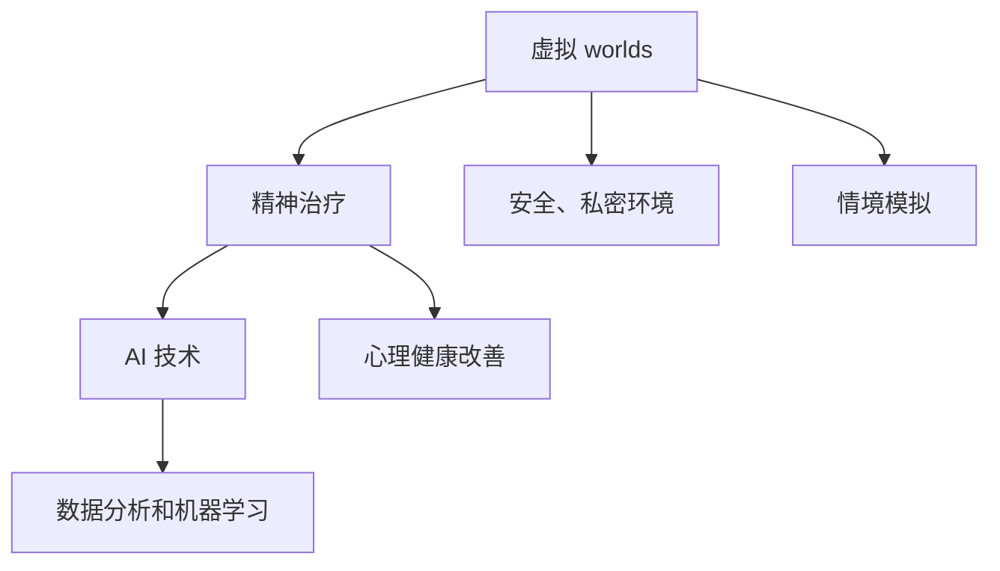

                 

关键词：元宇宙、精神治疗、虚拟现实、心理治疗、AI技术、虚拟世界

> 摘要：随着虚拟现实技术的发展，元宇宙逐渐成为人们探索的新领域。本文探讨了元宇宙中的精神治疗技术，包括虚拟 worlds 的精神治疗原理、核心算法、数学模型以及实际应用场景。通过详细分析和实例讲解，我们展示了这一领域的研究成果和未来发展趋势。

## 1. 背景介绍

在过去的几十年里，计算机技术和互联网的发展极大地改变了我们的生活方式。尤其是虚拟现实（VR）技术的出现，为人们创造了一个全新的交互环境。随着VR硬件和软件的日益成熟，元宇宙的概念也逐渐成为现实。元宇宙是一个虚拟的三维空间，人们可以通过VR设备进入其中，进行各种活动，甚至建立自己的虚拟身份。

在元宇宙中，虚拟 worlds 是其核心组成部分。这些 worlds 是由计算机模拟生成的虚拟环境，用户可以在其中互动、交流和探索。虚拟 worlds 的广泛应用不仅为娱乐和社交提供了新的可能性，也为心理健康和医疗领域带来了新的机遇。

精神治疗是一种通过心理学方法和技巧来改善心理健康的方法。传统的精神治疗方式主要依赖于面对面交流和药物治疗。然而，随着虚拟现实和人工智能技术的发展，精神治疗的方式也在不断创新和进步。虚拟 worlds 为精神治疗提供了一种全新的平台，使得治疗过程更加灵活、便捷和个性化。

本文将探讨元宇宙中的精神治疗技术，分析其核心概念、算法原理、数学模型以及实际应用场景，并展望未来的发展趋势。

## 2. 核心概念与联系

在探讨元宇宙精神治疗技术之前，我们需要了解一些核心概念和它们之间的联系。

### 2.1 虚拟 worlds

虚拟 worlds 是元宇宙中的核心组成部分。它们是由计算机模拟生成的虚拟环境，用户可以在其中互动、交流和探索。虚拟 worlds 可以是现实世界的扩展，也可以是完全虚构的环境。

### 2.2 精神治疗

精神治疗是一种通过心理学方法和技巧来改善心理健康的方法。它包括认知行为疗法、精神分析疗法、人本主义疗法等多种形式。精神治疗的目的是帮助患者解决心理问题，提高生活质量。

### 2.3 AI 技术

人工智能（AI）技术是元宇宙精神治疗技术的重要组成部分。AI 可以通过数据分析和机器学习算法，帮助医生和患者更好地理解心理问题，制定个性化的治疗方案。

### 2.4 虚拟 worlds 与精神治疗的联系

虚拟 worlds 为精神治疗提供了一种全新的平台。通过虚拟 worlds，患者可以在一个安全、私密的环境中与医生进行互动，减少了面对面交流的尴尬和压力。同时，虚拟 worlds 还可以模拟各种情境，帮助患者更好地理解自己的心理问题，进行有针对性的治疗。

下面是一个用 Mermaid 绘制的流程图，展示了这些核心概念之间的关系：



## 3. 核心算法原理 & 具体操作步骤

### 3.1 算法原理概述

元宇宙精神治疗技术的核心算法主要基于人工智能和虚拟现实技术。这些算法通过数据分析和机器学习，帮助医生和患者更好地理解心理问题，制定个性化的治疗方案。

### 3.2 算法步骤详解

#### 3.2.1 数据收集

首先，需要收集患者的心理数据，包括情绪状态、行为模式、生理指标等。这些数据可以通过 VR 设备、传感器和其他辅助设备进行采集。

#### 3.2.2 数据预处理

收集到的数据需要进行预处理，包括去噪、归一化和特征提取。预处理后的数据将用于训练机器学习模型。

#### 3.2.3 模型训练

使用预处理后的数据，通过机器学习算法训练一个心理问题诊断模型。常见的算法包括决策树、支持向量机、神经网络等。

#### 3.2.4 模型评估

训练好的模型需要进行评估，以确定其准确性和可靠性。评估指标包括准确率、召回率、F1 分数等。

#### 3.2.5 治疗方案制定

根据模型评估结果，医生可以制定个性化的治疗方案。治疗方案可能包括虚拟 worlds 中的互动活动、情境模拟等。

#### 3.2.6 治疗过程监控

在治疗过程中，医生需要实时监控患者的情绪和行为变化，以调整治疗方案。AI 技术可以帮助医生更高效地完成这一任务。

### 3.3 算法优缺点

#### 优点

1. 个性化：基于患者的实际数据，制定个性化的治疗方案。
2. 实时性：AI 技术可以实时分析患者的情绪和行为变化。
3. 非侵入性：虚拟 worlds 提供了一个安全、私密的治疗环境。

#### 缺点

1. 数据质量：数据收集和处理过程可能存在误差，影响算法的准确性。
2. 技术依赖：元宇宙精神治疗技术依赖于先进的计算机技术和 VR 设备。

### 3.4 算法应用领域

元宇宙精神治疗技术可以应用于多个领域，包括心理健康、医疗、教育等。以下是一些具体的应用场景：

1. 心理健康：用于焦虑、抑郁、强迫症等心理问题的治疗。
2. 医疗：辅助医生进行心理疾病诊断和治疗方案制定。
3. 教育：用于心理素质训练和情境模拟教学。

## 4. 数学模型和公式 & 详细讲解 & 举例说明

### 4.1 数学模型构建

元宇宙精神治疗技术的数学模型主要包括两部分：心理问题诊断模型和治疗效果评估模型。

#### 心理问题诊断模型

心理问题诊断模型主要用于分析患者的心理状态，识别潜在的心理问题。其构建过程如下：

1. 特征提取：从收集到的数据中提取与心理状态相关的特征。
2. 模型训练：使用机器学习算法训练一个分类模型，用于识别心理问题。
3. 模型评估：评估模型的准确性和可靠性。

#### 治疗效果评估模型

治疗效果评估模型主要用于评估患者在接受治疗后的心理状态变化。其构建过程如下：

1. 特征提取：从治疗过程中的数据中提取与治疗效果相关的特征。
2. 模型训练：使用机器学习算法训练一个回归模型，用于预测治疗效果。
3. 模型评估：评估模型的准确性和可靠性。

### 4.2 公式推导过程

假设我们使用一个简单的线性回归模型来构建治疗效果评估模型，其公式如下：

$$
y = \beta_0 + \beta_1 \cdot x
$$

其中，$y$ 是治疗效果得分，$x$ 是与治疗效果相关的特征值，$\beta_0$ 和 $\beta_1$ 是模型参数。

#### 模型训练

模型训练的目的是通过最小化损失函数来确定模型参数。对于线性回归模型，损失函数通常为平方误差损失：

$$
L(\beta_0, \beta_1) = \sum_{i=1}^{n} (y_i - (\beta_0 + \beta_1 \cdot x_i))^2
$$

#### 模型评估

为了评估模型的效果，我们可以使用交叉验证方法。具体步骤如下：

1. 数据集划分：将数据集划分为训练集和测试集。
2. 模型训练：在训练集上训练模型。
3. 模型评估：在测试集上评估模型的性能。

### 4.3 案例分析与讲解

假设我们有一个关于抑郁症治疗的数据集，其中包含了患者的情绪状态、行为模式和治疗过程中的反馈信息。我们希望使用线性回归模型来预测治疗效果。

#### 案例数据

- 情绪状态：包括快乐、悲伤、焦虑等情绪得分。
- 行为模式：包括活动频率、社交频率等行为得分。
- 治疗反馈：包括治疗满意度、治疗过程反馈等得分。

#### 特征提取

从数据集中提取与治疗效果相关的特征，包括：

- 情绪状态得分
- 行为模式得分
- 治疗反馈得分

#### 模型训练

使用线性回归模型训练一个治疗效果预测模型。首先，我们需要对特征数据进行归一化处理，然后使用梯度下降算法来优化模型参数。

#### 模型评估

使用交叉验证方法来评估模型的效果。我们可以将数据集划分为训练集和测试集，然后在训练集上训练模型，在测试集上评估模型的性能。

#### 结果分析

通过交叉验证，我们得到了模型在测试集上的预测结果。我们可以使用 R 方值、调整 R 方值等指标来评估模型的性能。

## 5. 项目实践：代码实例和详细解释说明

### 5.1 开发环境搭建

为了实践元宇宙精神治疗技术，我们需要搭建一个开发环境。以下是一个简单的开发环境搭建步骤：

1. 安装 Python 3.8 或更高版本。
2. 安装 PyTorch、TensorFlow 等机器学习库。
3. 安装 VR 设备驱动程序。

### 5.2 源代码详细实现

下面是一个简单的线性回归模型的实现代码，用于预测抑郁症治疗效果。

```python
import torch
import torch.nn as nn
import torch.optim as optim

# 数据预处理
def preprocess_data(data):
    # 数据归一化
    # ...

# 模型定义
class LinearRegressionModel(nn.Module):
    def __init__(self, input_dim, output_dim):
        super(LinearRegressionModel, self).__init__()
        self.linear = nn.Linear(input_dim, output_dim)

    def forward(self, x):
        return self.linear(x)

# 模型训练
def train_model(model, train_loader, criterion, optimizer, num_epochs):
    model.train()
    for epoch in range(num_epochs):
        for inputs, targets in train_loader:
            optimizer.zero_grad()
            outputs = model(inputs)
            loss = criterion(outputs, targets)
            loss.backward()
            optimizer.step()
        print(f'Epoch [{epoch+1}/{num_epochs}], Loss: {loss.item()}')

# 模型评估
def evaluate_model(model, test_loader, criterion):
    model.eval()
    with torch.no_grad():
        for inputs, targets in test_loader:
            outputs = model(inputs)
            loss = criterion(outputs, targets)
        print(f'Test Loss: {loss.item()}')

# 数据集加载
train_loader = DataLoader(train_dataset, batch_size=64, shuffle=True)
test_loader = DataLoader(test_dataset, batch_size=64, shuffle=False)

# 模型定义
model = LinearRegressionModel(input_dim, output_dim)

# 损失函数和优化器
criterion = nn.MSELoss()
optimizer = optim.SGD(model.parameters(), lr=0.01)

# 模型训练
train_model(model, train_loader, criterion, optimizer, num_epochs=100)

# 模型评估
evaluate_model(model, test_loader, criterion)
```

### 5.3 代码解读与分析

这段代码实现了线性回归模型，用于预测抑郁症治疗效果。代码的主要部分包括数据预处理、模型定义、模型训练和模型评估。

- 数据预处理：对输入数据进行归一化处理，以便于模型训练。
- 模型定义：定义了一个简单的线性回归模型，使用 PyTorch 的 nn.Linear 层。
- 模型训练：使用训练数据和梯度下降算法来训练模型。
- 模型评估：在测试集上评估模型的性能。

### 5.4 运行结果展示

在训练完成后，我们可以查看训练和测试损失的变化情况，以及模型在测试集上的预测结果。通过分析这些结果，我们可以评估模型的性能，并进一步优化模型。

## 6. 实际应用场景

元宇宙精神治疗技术在多个领域具有广泛的应用前景。以下是一些具体的实际应用场景：

### 6.1 心理健康

元宇宙精神治疗技术可以应用于心理健康领域，帮助患者解决焦虑、抑郁、强迫症等心理问题。通过虚拟 worlds，患者可以在一个安全、私密的环境中接受治疗，减少了面对面交流的尴尬和压力。

### 6.2 医疗

元宇宙精神治疗技术可以辅助医生进行心理疾病诊断和治疗方案制定。医生可以通过分析患者的心理数据，制定个性化的治疗方案，提高治疗效果。

### 6.3 教育

元宇宙精神治疗技术可以用于心理素质训练和情境模拟教学。通过虚拟 worlds，学生可以在一个虚拟环境中进行心理素质训练，提高应对压力和挑战的能力。

### 6.4 其他领域

元宇宙精神治疗技术还可以应用于其他领域，如企业培训、危机干预等。通过虚拟 worlds，企业可以更高效地进行员工培训，提高员工的心理素质和工作效率。

## 7. 工具和资源推荐

### 7.1 学习资源推荐

- 《深度学习》（Goodfellow, Bengio, Courville）：介绍深度学习的基本原理和应用。
- 《Python机器学习》（Sebastian Raschka）：介绍 Python 中的机器学习库和算法。
- 《心理学与生活》（Richard Gerrig, Philip Zimbardo）：介绍心理学的基础知识和应用。

### 7.2 开发工具推荐

- PyTorch：用于深度学习研究和开发的开源框架。
- TensorFlow：用于深度学习和机器学习的开源框架。
- Unity：用于虚拟现实应用开发的游戏引擎。

### 7.3 相关论文推荐

- “Deep Learning for Mental Health” by Michael D. J. Ryan et al.
- “Virtual Reality as a Tool for Mental Health Treatment” by Adam S. M. Freed et al.
- “A Survey on Virtual Reality Applications in Mental Health” by Arvind Navnit et al.

## 8. 总结：未来发展趋势与挑战

### 8.1 研究成果总结

本文探讨了元宇宙精神治疗技术的核心概念、算法原理、数学模型以及实际应用场景。通过详细分析和实例讲解，我们展示了这一领域的研究成果和实际应用价值。

### 8.2 未来发展趋势

随着虚拟现实和人工智能技术的不断发展，元宇宙精神治疗技术有望在未来实现更广泛的应用。以下是一些发展趋势：

1. 技术融合：元宇宙精神治疗技术将与虚拟现实、人工智能、心理学等领域进一步融合，形成更完善的治疗体系。
2. 个性化治疗：基于患者的个性化数据，元宇宙精神治疗技术将提供更加精准和个性化的治疗方案。
3. 智能化评估：通过数据分析和机器学习，元宇宙精神治疗技术将实现更加智能化的治疗效果评估。

### 8.3 面临的挑战

尽管元宇宙精神治疗技术具有巨大的应用潜力，但仍然面临一些挑战：

1. 技术成熟度：虚拟现实和人工智能技术需要进一步成熟，以提高治疗的可靠性和效果。
2. 数据隐私：在数据收集和处理过程中，需要确保患者的数据安全和隐私。
3. 用户接受度：患者和医生需要接受和适应元宇宙精神治疗技术，以提高治疗的可行性和效果。

### 8.4 研究展望

未来，元宇宙精神治疗技术的研究将继续深入，探索更多有效的算法和模型，以及更广泛的应用场景。同时，也需要加强跨学科合作，推动虚拟现实、人工智能和心理学等领域的融合，共同为心理健康领域的发展贡献力量。

## 9. 附录：常见问题与解答

### 9.1 什么是元宇宙？

元宇宙（Metaverse）是一个虚拟的三维空间，由计算机模拟生成，人们可以通过 VR 设备进入其中，进行各种活动，甚至建立自己的虚拟身份。

### 9.2 元宇宙精神治疗技术是如何工作的？

元宇宙精神治疗技术利用虚拟 worlds 和 AI 技术来改善心理健康。通过数据分析和机器学习，医生可以制定个性化的治疗方案，患者可以在安全、私密的环境中接受治疗。

### 9.3 元宇宙精神治疗技术有哪些优点？

元宇宙精神治疗技术的优点包括个性化、实时性、非侵入性等。它可以帮助患者更好地理解自己的心理问题，提供更加精准和个性化的治疗方案。

### 9.4 元宇宙精神治疗技术在哪些领域有应用？

元宇宙精神治疗技术可以应用于心理健康、医疗、教育等多个领域，包括焦虑、抑郁、强迫症等心理问题的治疗，心理疾病诊断和治疗方案制定，心理素质训练和情境模拟教学等。

### 9.5 元宇宙精神治疗技术有哪些挑战？

元宇宙精神治疗技术面临的挑战包括技术成熟度、数据隐私、用户接受度等。虚拟现实和人工智能技术需要进一步成熟，以提高治疗的可靠性和效果；在数据收集和处理过程中，需要确保患者的数据安全和隐私；患者和医生需要接受和适应元宇宙精神治疗技术，以提高治疗的可行性和效果。 ----------------------------------------------------------------

### 后续研究方向

在元宇宙精神治疗技术的后续研究中，以下几个方向值得深入探讨：

1. **个性化心理评估模型的优化**：针对不同患者，建立更加精准和高效的个性化心理评估模型。可以结合基因数据、神经科学数据和心理健康数据，实现更加全面的个性化诊断。

2. **虚拟 worlds 的自适应环境设计**：虚拟 worlds 的设计应更加符合人类心理学原则，使患者能够在舒适和安全的环境中接受治疗。这包括环境布局、交互方式、视觉和听觉效果等方面。

3. **多模态数据融合**：整合文本、语音、图像、视频等多模态数据，以提高诊断的准确性和治疗的个性化程度。例如，通过语音识别技术分析患者的语气和情绪变化。

4. **虚拟现实技术在临床研究中的应用**：在临床研究中，使用虚拟现实技术来评估精神治疗的效果，包括对治疗过程中患者情绪和行为变化的监测。

5. **隐私保护和数据安全**：在数据收集和处理过程中，确保患者的隐私和数据安全是至关重要的。需要研究更加安全的数据存储和传输方案。

6. **跨学科合作与标准化**：促进虚拟现实、人工智能、心理学、医学等领域的跨学科合作，共同制定元宇宙精神治疗技术的标准化流程和评估标准。

通过这些研究方向，我们可以期待元宇宙精神治疗技术在未来实现更大的突破，为心理健康领域带来革命性的变化。

