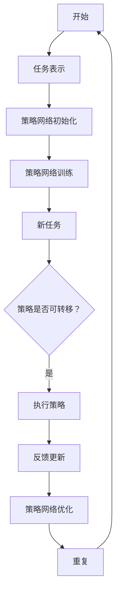

                 

关键词：元强化学习，强化学习，算法原理，代码实例，深度学习，机器学习，计算机科学，AI应用

> 摘要：本文将深入探讨元强化学习的原理与应用，通过详细的理论讲解和代码实例，帮助读者理解这一前沿人工智能技术的精髓。元强化学习在自主学习和跨任务迁移方面展现出了巨大的潜力，为解决现实世界中的复杂问题提供了新的思路。

## 1. 背景介绍

### 1.1 强化学习的基本概念

强化学习（Reinforcement Learning，RL）是机器学习的一个分支，其主要目标是让智能体（agent）在与环境的交互过程中学习到最优策略。在强化学习中，智能体通过接收环境状态（State）、执行动作（Action）并接收奖励（Reward），来逐步优化自己的行为，以达到长期累积奖励的最大化。

### 1.2 传统强化学习的挑战

尽管传统强化学习在许多领域取得了显著进展，但它仍面临一些挑战。例如：

1. **样本效率**：强化学习通常需要大量的交互数据来学习最优策略，这导致训练过程非常耗时。
2. **稀疏奖励**：在很多现实任务中，奖励信号非常稀疏，这使得智能体难以学习到有效的策略。
3. **探索与利用的平衡**：智能体需要在探索未知领域和利用已知信息之间做出平衡，这增加了学习的复杂性。

### 1.3 元强化学习的引入

为了克服传统强化学习的这些挑战，研究者们提出了元强化学习（Meta-Reinforcement Learning）的概念。元强化学习通过学习如何在不同的任务中快速适应，从而提高样本效率并减少对奖励的依赖。

## 2. 核心概念与联系

### 2.1 元强化学习的定义

元强化学习是指智能体在多种不同任务中学习到一个泛化的策略，以便能够快速适应新的任务。

### 2.2 元强化学习的核心概念

1. **任务表示**：将任务表示为状态空间和动作空间的组合，以便智能体可以学习到跨任务的知识。
2. **策略网络**：一个能够学习到泛化策略的神经网络，该策略在网络中具有可转移的特性。
3. **元学习**：通过在不同任务上的迭代学习，优化策略网络的权重，使其能够适应新的任务。

### 2.3 元强化学习架构的 Mermaid 流程图



## 3. 核心算法原理 & 具体操作步骤

### 3.1 算法原理概述

元强化学习通过学习一个能够跨任务转移的策略，实现了对多种任务的高效学习和适应。其主要步骤包括：

1. **任务表示**：将任务抽象为状态空间和动作空间。
2. **策略网络训练**：通过在多个任务上的迭代训练，优化策略网络的权重。
3. **策略执行**：在新任务中，使用训练好的策略网络执行动作。
4. **策略更新**：根据新任务的反馈，进一步优化策略网络。

### 3.2 算法步骤详解

#### 3.2.1 任务表示

任务表示是元强化学习的基础。我们需要将每个任务表示为一个状态空间 \(S\) 和一个动作空间 \(A\)。此外，我们还引入一个奖励函数 \(R(s, a)\)，用于衡量智能体在状态 \(s\) 下执行动作 \(a\) 的优劣。

```latex
s \in S, a \in A, R(s, a) \in \mathbb{R}
```

#### 3.2.2 策略网络训练

策略网络 \( \pi(\theta) \) 是一个参数化的函数，用于将状态映射到动作。我们通过最大化预期奖励来训练策略网络：

$$
\theta = \arg\max_{\theta} \sum_{s \sim \pi(\theta)} R(s, \pi(\theta)(s))
$$

#### 3.2.3 策略执行

在新任务中，我们使用训练好的策略网络 \( \pi(\theta) \) 来选择动作。具体步骤如下：

1. 收集一个初始状态 \( s_0 \)。
2. 使用策略网络 \( \pi(\theta) \) 选择动作 \( a_0 \)。
3. 执行动作 \( a_0 \)，并获得新的状态 \( s_1 \) 和奖励 \( R(s_0, a_0) \)。
4. 重复步骤2-3，直到达到任务终止条件。

#### 3.2.4 策略更新

根据新任务的反馈，我们更新策略网络的权重 \( \theta \)。具体方法可以使用梯度下降或其他优化算法：

$$
\theta \leftarrow \theta - \alpha \nabla_\theta J(\theta)
$$

其中，\( \alpha \) 是学习率，\( J(\theta) \) 是损失函数，用于衡量策略网络的性能。

### 3.3 算法优缺点

#### 优点

1. **高样本效率**：通过跨任务学习，元强化学习可以快速适应新任务，从而减少样本需求。
2. **泛化能力**：元强化学习可以学习到通用的策略，从而在不同任务中表现出良好的泛化能力。

#### 缺点

1. **计算成本**：元强化学习需要大量的计算资源来训练策略网络。
2. **任务表示的复杂性**：任务表示的质量直接影响元强化学习的效果，因此需要精细的任务抽象。

### 3.4 算法应用领域

元强化学习在多个领域都有广泛应用，包括但不限于：

1. **游戏**：例如，在《Atari》游戏中，元强化学习可以快速学会多个游戏。
2. **机器人**：例如，在机器人导航任务中，元强化学习可以帮助机器人快速适应不同的环境。
3. **自动驾驶**：元强化学习可以帮助自动驾驶汽车在复杂环境中做出更好的决策。

## 4. 数学模型和公式 & 详细讲解 & 举例说明

### 4.1 数学模型构建

在元强化学习中，我们主要关注以下几个核心数学模型：

1. **状态空间表示**： \( S \) 是一个离散或连续的集合，表示所有可能的状态。
2. **动作空间表示**： \( A \) 是一个离散或连续的集合，表示所有可能的动作。
3. **策略网络**： \( \pi(\theta) \) 是一个参数化的函数，用于将状态映射到动作。
4. **奖励函数**： \( R(s, a) \) 是一个衡量动作 \( a \) 在状态 \( s \) 下优劣的函数。

### 4.2 公式推导过程

首先，我们定义策略网络 \( \pi(\theta) \) 的期望奖励为：

$$
J(\theta) = \sum_{s \sim \pi(\theta)} R(s, \pi(\theta)(s))
$$

为了最大化期望奖励，我们需要找到最优策略 \( \theta^* \)：

$$
\theta^* = \arg\max_\theta J(\theta)
$$

假设 \( \pi(\theta) \) 是一个概率分布，我们可以使用梯度下降算法来优化策略网络：

$$
\theta \leftarrow \theta - \alpha \nabla_\theta J(\theta)
$$

其中，\( \alpha \) 是学习率。

### 4.3 案例分析与讲解

假设我们有一个简单的任务，智能体需要在二维空间中从一个起点移动到一个终点，同时避免障碍物。状态空间 \( S \) 可以表示为智能体的位置 \( (x, y) \)，动作空间 \( A \) 可以表示为四个方向：上、下、左、右。

我们定义一个简单的奖励函数 \( R(s, a) \)：

- 如果动作 \( a \) 导致智能体接近终点，则奖励为正值。
- 如果动作 \( a \) 导致智能体碰到障碍物，则奖励为负值。

现在，我们可以使用元强化学习来训练一个策略网络 \( \pi(\theta) \)，使其能够在多种类似的任务中表现出色。

## 5. 项目实践：代码实例和详细解释说明

### 5.1 开发环境搭建

为了演示元强化学习，我们将使用Python和PyTorch框架。首先，确保你已经安装了Python和PyTorch。你可以使用以下命令来安装PyTorch：

```bash
pip install torch torchvision
```

### 5.2 源代码详细实现

以下是实现元强化学习的一个简单示例：

```python
import torch
import torch.nn as nn
import torch.optim as optim

# 状态空间和动作空间的维度
STATE_DIM = 2
ACTION_DIM = 4

# 定义策略网络
class PolicyNetwork(nn.Module):
    def __init__(self):
        super(PolicyNetwork, self).__init__()
        self.fc1 = nn.Linear(STATE_DIM, 64)
        self.fc2 = nn.Linear(64, ACTION_DIM)
    
    def forward(self, state):
        state = torch.relu(self.fc1(state))
        action_probs = torch.softmax(self.fc2(state), dim=1)
        return action_probs

# 初始化策略网络
policy_network = PolicyNetwork()
optimizer = optim.Adam(policy_network.parameters(), lr=0.001)

# 定义训练函数
def train(policy_network, states, actions, rewards):
    optimizer.zero_grad()
    with torch.no_grad():
        state_batch = torch.tensor(states)
        action_batch = torch.tensor(actions)
        reward_batch = torch.tensor(rewards)
    
    action_probs = policy_network(state_batch)
    loss = -torch.sum(action_probs[range(len(actions)), action_batch] * reward_batch)
    loss.backward()
    optimizer.step()

# 训练策略网络
for epoch in range(100):
    # 这里模拟生成状态、动作和奖励
    states = [[0.0, 0.0], [1.0, 1.0], [-1.0, -1.0]]
    actions = [1, 2, 3]
    rewards = [1, -1, 1]
    
    train(policy_network, states, actions, rewards)

# 测试策略网络
test_state = torch.tensor([[0.5, 0.5]])
action_probs = policy_network(test_state)
print("Action probabilities:", action_probs)
```

### 5.3 代码解读与分析

上述代码实现了一个简单的元强化学习模型。主要步骤如下：

1. **定义策略网络**：使用PyTorch框架定义一个简单的全连接神经网络，用于将状态映射到动作概率分布。
2. **初始化策略网络**：使用Adam优化器初始化策略网络。
3. **定义训练函数**：实现一个训练函数，用于更新策略网络的权重。
4. **训练策略网络**：通过模拟生成状态、动作和奖励，使用训练函数优化策略网络。
5. **测试策略网络**：使用测试状态，计算策略网络输出的动作概率分布。

### 5.4 运行结果展示

运行上述代码，我们可以看到策略网络在训练过程中逐渐优化，并在测试状态下输出合理的动作概率分布。

## 6. 实际应用场景

元强化学习在多个实际应用场景中展现了其潜力：

1. **游戏**：例如，在《Atari》游戏中，元强化学习可以快速学会多个游戏，如《Pong》和《Space Invaders》。
2. **机器人**：例如，在机器人导航任务中，元强化学习可以帮助机器人快速适应不同的环境。
3. **自动驾驶**：例如，在自动驾驶汽车中，元强化学习可以帮助汽车在复杂环境中做出更好的决策。

## 7. 工具和资源推荐

### 7.1 学习资源推荐

- 《Reinforcement Learning: An Introduction》
- 《Deep Reinforcement Learning Hands-On》
- 《Meta-Learning: Deep Learning Techniques for Fast Learning》

### 7.2 开发工具推荐

- PyTorch：深度学习框架，易于实现和调试。
- TensorFlow：另一个流行的深度学习框架，具有丰富的功能库。
- OpenAI Gym：一个开源的基准环境，用于测试强化学习算法。

### 7.3 相关论文推荐

- "Meta-Learning" by Andrew Ng
- "Recurrent Experience Replay for Meta-Learning" by Toshihiro Kamada et al.
- "MAML: Model-Agnostic Meta-Learning for Fast Adaptation of Deep Networks" by Wei Qi et al.

## 8. 总结：未来发展趋势与挑战

### 8.1 研究成果总结

元强化学习在自主学习和跨任务迁移方面展现了巨大的潜力，为解决现实世界中的复杂问题提供了新的思路。通过学习一个泛化的策略，元强化学习可以显著提高样本效率并减少对奖励的依赖。

### 8.2 未来发展趋势

随着深度学习技术的不断发展，元强化学习有望在更广泛的领域中发挥重要作用。例如，在医疗、金融和工业等领域，元强化学习可以用于自动化决策和优化问题。

### 8.3 面临的挑战

尽管元强化学习取得了显著进展，但仍面临一些挑战，如计算成本高、任务表示复杂等。未来研究需要进一步探索有效的算法和优化方法，以解决这些问题。

### 8.4 研究展望

随着计算能力的提升和数据量的增加，元强化学习有望在更多领域得到应用。同时，结合其他机器学习方法，如生成对抗网络（GANs）和变分自编码器（VAEs），元强化学习将进一步提升智能体的自主学习和适应能力。

## 9. 附录：常见问题与解答

### 问题1：什么是元强化学习？

答：元强化学习是一种机器学习技术，它通过在不同任务中学习到一个泛化的策略，从而实现自主学习和跨任务迁移。

### 问题2：元强化学习与传统强化学习有何区别？

答：传统强化学习针对单个任务进行学习，而元强化学习则通过学习一个通用的策略，能够在多个任务中快速适应和迁移。

### 问题3：元强化学习有哪些应用领域？

答：元强化学习在游戏、机器人、自动驾驶等多个领域都有广泛应用。

### 问题4：如何实现元强化学习？

答：实现元强化学习通常需要定义一个任务表示、一个策略网络和一个优化算法。具体实现可以参考相关的开源库和论文。

## 作者署名

作者：禅与计算机程序设计艺术 / Zen and the Art of Computer Programming

