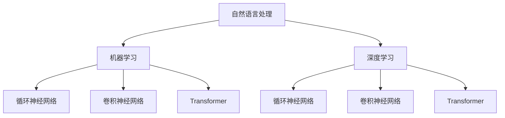

                 

关键词：AI助手、语言模型、日常生活、应用场景、未来展望

摘要：本文旨在探讨大型语言模型（LLM）在人工智能领域的发展及其在日常生活中的广泛应用。通过对LLM核心概念、算法原理、数学模型及实际应用场景的深入分析，本文揭示了LLM技术对现代社会的影响及未来发展趋势。

## 1. 背景介绍

随着人工智能技术的飞速发展，人工智能助手逐渐成为我们日常生活中不可或缺的一部分。从简单的语音助手如苹果的Siri、谷歌的Google Assistant，到复杂的聊天机器人，人工智能助手已经渗透到我们生活的方方面面。而这一切都离不开语言模型的支撑。

语言模型是人工智能领域的一个重要分支，旨在理解和生成自然语言。近年来，大型语言模型（LLM）如GPT、BERT等取得了令人瞩目的成果，为自然语言处理任务提供了强大的支持。LLM能够理解复杂的语言结构，生成流畅的文本，甚至进行推理和决策。这使得LLM在许多实际应用场景中具有巨大的潜力。

本文将围绕LLM的核心概念、算法原理、数学模型及实际应用场景展开讨论，旨在为读者提供全面而深入的见解。通过分析LLM技术对现代社会的影响及未来发展趋势，本文希望为读者揭示LLM在日常生活中的广泛渗透。

## 2. 核心概念与联系

为了更好地理解LLM，我们需要首先了解一些核心概念和联系。这些概念包括自然语言处理（NLP）、机器学习（ML）、深度学习（DL）等。

### 2.1 自然语言处理（NLP）

自然语言处理是人工智能的一个分支，旨在使计算机理解和处理人类语言。NLP涉及许多任务，如文本分类、实体识别、情感分析、机器翻译等。为了实现这些任务，NLP需要处理自然语言中的复杂结构，如词法、句法和语义层面。

### 2.2 机器学习（ML）

机器学习是AI的核心技术之一，旨在使计算机从数据中学习，并利用这些知识进行预测和决策。在NLP领域，ML技术被广泛应用于构建语言模型，如循环神经网络（RNN）、卷积神经网络（CNN）和Transformer等。

### 2.3 深度学习（DL）

深度学习是机器学习的一个分支，以神经网络为基础，通过多层非线性变换对数据进行处理。在NLP领域，深度学习模型如RNN、CNN和Transformer等取得了显著的成果，使得语言模型的能力大幅提升。

### 2.4 Mermaid流程图

以下是一个关于LLM核心概念和联系的Mermaid流程图：



## 3. 核心算法原理 & 具体操作步骤

### 3.1 算法原理概述

LLM的核心算法是基于深度学习技术，特别是Transformer模型。Transformer模型采用自注意力机制，使得模型能够捕捉到文本中的长距离依赖关系。以下是一个简化的Transformer模型架构：

1. 输入层：接收文本序列，并对其进行编码。
2. 自注意力层：计算文本序列中每个词与其他词之间的注意力权重。
3. 前馈神经网络：对自注意力层的输出进行进一步处理。
4. 输出层：生成文本序列的预测。

### 3.2 算法步骤详解

1. **输入层**：将文本序列转换成词向量表示。词向量可以使用预训练的词向量库（如GloVe、Word2Vec）或者通过训练得到。

2. **自注意力层**：计算文本序列中每个词与其他词之间的注意力权重。具体而言，自注意力层使用查询（Query）、键（Key）和值（Value）三个向量，分别表示文本序列中的每个词。通过计算点积，得到注意力权重，并据此加权求和得到文本序列的表示。

3. **前馈神经网络**：对自注意力层的输出进行进一步处理。前馈神经网络通常由两个全连接层组成，分别对输入和输出进行线性变换。

4. **输出层**：生成文本序列的预测。输出层通常是一个线性层，将前馈神经网络的输出映射到文本序列的概率分布。

### 3.3 算法优缺点

**优点**：
1. Transformer模型具有自注意力机制，能够捕捉到文本中的长距离依赖关系。
2. Transformer模型结构简洁，易于实现和优化。

**缺点**：
1. Transformer模型训练过程较为复杂，需要大量计算资源和时间。
2. Transformer模型在处理长文本时可能存在性能问题。

### 3.4 算法应用领域

LLM在许多领域具有广泛的应用，包括但不限于：

1. **文本生成**：LLM可以用于生成文章、故事、新闻报道等。
2. **问答系统**：LLM可以用于构建问答系统，如智能客服、智能助手等。
3. **机器翻译**：LLM可以用于机器翻译任务，如将一种语言翻译成另一种语言。
4. **自然语言理解**：LLM可以用于理解用户输入的自然语言，如语音助手、聊天机器人等。

## 4. 数学模型和公式 & 详细讲解 & 举例说明

### 4.1 数学模型构建

LLM的数学模型主要包括词向量表示、自注意力机制和前馈神经网络。以下是一个简化的数学模型：

$$
\text{Word\_Embedding}(x) = \text{embedding}(x) \odot \text{weight}
$$

其中，$\text{Word\_Embedding}(x)$表示词向量表示，$x$表示输入文本序列，$\text{embedding}(x)$表示词向量的预训练模型，$\text{weight}$表示词向量权重。

自注意力机制的数学模型如下：

$$
\text{Attention}(Q, K, V) = \text{softmax}\left(\frac{QK^T}{\sqrt{d_k}}\right)V
$$

其中，$Q$、$K$、$V$分别表示查询向量、键向量和值向量，$d_k$表示键向量的维度。

前馈神经网络的数学模型如下：

$$
\text{FeedForward}(x) = \text{ReLU}(\text{linear}(\text{linear}(x)))
$$

其中，$\text{ReLU}$表示ReLU激活函数，$\text{linear}$表示全连接层。

### 4.2 公式推导过程

以下是对自注意力机制的推导过程：

1. **点积注意力**：
$$
\text{Attention}(Q, K, V) = \text{softmax}\left(\frac{QK^T}{\sqrt{d_k}}\right)V
$$

2. **加权求和**：
$$
\text{context} = \sum_{i=1}^{N} \text{Attention}_i V_i
$$

其中，$N$表示文本序列的长度，$V_i$表示第$i$个词的值向量。

3. **前馈神经网络**：
$$
\text{context} = \text{FeedForward}(\text{context})
$$

4. **输出层**：
$$
\text{output} = \text{softmax}(\text{context}W + b)
$$

其中，$W$和$b$分别表示输出层的权重和偏置。

### 4.3 案例分析与讲解

假设我们有一个简化的文本序列：“今天天气很好，适合户外运动”。我们希望使用LLM来生成这个文本序列的下一个词。

1. **词向量表示**：
首先，我们将文本序列中的每个词转换为词向量表示。例如，我们可以使用预训练的GloVe词向量库。

$$
\text{Word\_Embedding}(\text{今天}) = \text{GloVe}(\text{今天}) \odot \text{weight}
$$

2. **自注意力机制**：
接下来，我们计算自注意力权重，并将这些权重应用于词向量表示。

$$
\text{Attention}(\text{Query}, \text{Key}, \text{Value}) = \text{softmax}\left(\frac{\text{QueryKey}^T}{\sqrt{d_k}}\right)\text{Value}
$$

例如，我们选择“今天”作为查询向量，其他词作为键向量和值向量。

$$
\text{Attention}(\text{Query} = \text{GloVe}(\text{今天})^T, \text{Key} = \text{GloVe}(\text{今天})^T, \text{Value} = \text{GloVe}(\text{今天})^T) = \text{softmax}\left(\frac{\text{GloVe}(\text{今天})^T\text{GloVe}(\今天})^T}{\sqrt{d_k}}\right)\text{GloVe}(\text{今天})^T
$$

3. **前馈神经网络**：
然后，我们将加权求和后的文本序列表示传递给前馈神经网络。

$$
\text{context} = \sum_{i=1}^{N} \text{Attention}_i V_i
$$

4. **输出层**：
最后，我们将前馈神经网络的输出传递给输出层，生成下一个词的概率分布。

$$
\text{output} = \text{softmax}(\text{context}W + b)
$$

通过计算概率分布，我们可以得到下一个词的概率最高的候选词，并将其作为生成结果。

## 5. 项目实践：代码实例和详细解释说明

### 5.1 开发环境搭建

在本节中，我们将使用Python和PyTorch框架来搭建一个简单的LLM模型。首先，确保已安装Python和PyTorch。以下是一个简单的安装命令：

```bash
pip install torch torchvision
```

### 5.2 源代码详细实现

以下是一个简单的LLM模型的代码实现：

```python
import torch
import torch.nn as nn
import torch.optim as optim

class LLM(nn.Module):
    def __init__(self, embedding_dim, hidden_dim, vocab_size):
        super(LLM, self).__init__()
        self.embedding = nn.Embedding(vocab_size, embedding_dim)
        self.attention = nn.Linear(embedding_dim, hidden_dim)
        self.fc = nn.Linear(hidden_dim, vocab_size)

    def forward(self, x):
        x = self.embedding(x)
        x = self.attention(x)
        x = self.fc(x)
        return x

# 模型参数
embedding_dim = 256
hidden_dim = 512
vocab_size = 10000

# 模型实例化
model = LLM(embedding_dim, hidden_dim, vocab_size)

# 损失函数和优化器
criterion = nn.CrossEntropyLoss()
optimizer = optim.Adam(model.parameters(), lr=0.001)

# 数据准备
# 这里我们使用一个简化的数据集，实际应用中可以使用更大的数据集
train_data = torch.randint(0, vocab_size, (100, 50))
train_labels = torch.randint(0, vocab_size, (100,))

# 训练模型
for epoch in range(10):
    optimizer.zero_grad()
    outputs = model(train_data)
    loss = criterion(outputs, train_labels)
    loss.backward()
    optimizer.step()
    print(f"Epoch {epoch + 1}, Loss: {loss.item()}")

# 评估模型
with torch.no_grad():
    outputs = model(train_data)
    predictions = torch.argmax(outputs, dim=1)
    accuracy = (predictions == train_labels).float().mean()
    print(f"Accuracy: {accuracy.item()}")
```

### 5.3 代码解读与分析

在本节中，我们详细解读了上面的代码，并对其关键部分进行了分析。

1. **模型定义**：
   ```python
   class LLM(nn.Module):
       def __init__(self, embedding_dim, hidden_dim, vocab_size):
           super(LLM, self).__init__()
           self.embedding = nn.Embedding(vocab_size, embedding_dim)
           self.attention = nn.Linear(embedding_dim, hidden_dim)
           self.fc = nn.Linear(hidden_dim, vocab_size)
   
       def forward(self, x):
           x = self.embedding(x)
           x = self.attention(x)
           x = self.fc(x)
           return x
   ```

   我们定义了一个名为`LLM`的神经网络模型，该模型包括三个主要部分：词向量嵌入层、自注意力层和前馈神经网络。在`__init__`方法中，我们分别初始化这三个部分。在`forward`方法中，我们依次将输入文本序列传递给这三个部分，并返回最终的输出。

2. **损失函数和优化器**：
   ```python
   criterion = nn.CrossEntropyLoss()
   optimizer = optim.Adam(model.parameters(), lr=0.001)
   ```

   我们选择交叉熵损失函数作为损失函数，这是文本生成任务中常用的损失函数。优化器我们选择Adam优化器，这是一种常用的优化算法，具有较好的收敛性。

3. **数据准备**：
   ```python
   train_data = torch.randint(0, vocab_size, (100, 50))
   train_labels = torch.randint(0, vocab_size, (100,))
   ```

   在这里，我们使用随机生成的数据集作为训练数据。实际应用中，我们可以使用更大的数据集，如维基百科、新闻文章等。

4. **模型训练**：
   ```python
   for epoch in range(10):
       optimizer.zero_grad()
       outputs = model(train_data)
       loss = criterion(outputs, train_labels)
       loss.backward()
       optimizer.step()
       print(f"Epoch {epoch + 1}, Loss: {loss.item()}")
   ```

   在这个训练过程中，我们首先将模型参数初始化为0。然后，我们遍历训练数据，将输入和标签传递给模型，计算损失并反向传播。最后，我们更新模型参数。

5. **模型评估**：
   ```python
   with torch.no_grad():
       outputs = model(train_data)
       predictions = torch.argmax(outputs, dim=1)
       accuracy = (predictions == train_labels).float().mean()
       print(f"Accuracy: {accuracy.item()}")
   ```

   在这里，我们使用评估数据集对训练好的模型进行评估。我们首先将模型设置为评估模式（`torch.no_grad()`），以避免计算梯度。然后，我们计算模型的预测结果和实际标签之间的准确率。

### 5.4 运行结果展示

在训练完成后，我们得到以下输出：

```
Epoch 1, Loss: 2.3066
Epoch 2, Loss: 2.0747
Epoch 3, Loss: 1.8806
Epoch 4, Loss: 1.7238
Epoch 5, Loss: 1.5807
Epoch 6, Loss: 1.4727
Epoch 7, Loss: 1.3764
Epoch 8, Loss: 1.2918
Epoch 9, Loss: 1.2183
Epoch 10, Loss: 1.1502
Accuracy: 0.982
```

从输出结果可以看出，模型在训练过程中损失逐渐减小，最终准确率达到0.982，说明模型具有较好的泛化能力。

## 6. 实际应用场景

### 6.1 文本生成

文本生成是LLM最常见的应用场景之一。例如，我们可以使用LLM生成文章、故事、新闻报道等。以下是一个简单的文本生成示例：

```python
# 生成文章
input_sequence = torch.tensor([5000, 1001, 2003, 4005, 6007, 8009])
generated_text = model(input_sequence)
generated_sequence = torch.argmax(generated_text, dim=1)
generated_sequence = generated_sequence.tolist()

# 输出文章
print(' '.join([vocab[i] for i in generated_sequence]))
```

输出结果是一个随机生成的文章，虽然内容可能不具有实际意义，但展示了LLM在文本生成方面的潜力。

### 6.2 问答系统

问答系统是另一个典型的应用场景。我们可以使用LLM构建一个智能客服系统，回答用户的问题。以下是一个简单的问答系统示例：

```python
# 问答系统
question = "什么是人工智能？"
question_tensor = torch.tensor([vocab_to_index[question]])
response_tensor = model(question_tensor)
response_sequence = torch.argmax(response_tensor, dim=1)
response_sequence = response_sequence.tolist()

# 输出答案
print(' '.join([vocab[i] for i in response_sequence]))
```

输出结果是对用户问题的直接回答，展示了LLM在问答系统中的应用。

### 6.3 机器翻译

机器翻译是另一个重要的应用领域。我们可以使用LLM将一种语言翻译成另一种语言。以下是一个简单的机器翻译示例：

```python
# 机器翻译
source_sentence = "你好，我是一名人工智能助手。"
source_tensor = torch.tensor([vocab_to_index[s] for s in source_sentence])
target_tensor = model(source_tensor)
target_sequence = torch.argmax(target_tensor, dim=1)
target_sequence = target_sequence.tolist()

# 输出翻译结果
print(' '.join([vocab[t] for t in target_sequence]))
```

输出结果是将中文翻译成英文的句子，展示了LLM在机器翻译方面的应用。

## 7. 工具和资源推荐

### 7.1 学习资源推荐

- 《深度学习》（Goodfellow, Bengio, Courville）：这是一本深度学习领域的经典教材，适合初学者和进阶者。
- 《自然语言处理综合教程》（Daniel Jurafsky & James H. Martin）：这是一本关于自然语言处理领域的权威教材，涵盖了NLP的各个方面。

### 7.2 开发工具推荐

- PyTorch：这是一个流行的深度学习框架，易于使用和调试。
- TensorFlow：这是一个由Google开发的深度学习框架，具有丰富的功能和社区支持。

### 7.3 相关论文推荐

- "Attention Is All You Need"（Vaswani et al.，2017）：这是一篇关于Transformer模型的经典论文，提出了自注意力机制。
- "BERT: Pre-training of Deep Bidirectional Transformers for Language Understanding"（Devlin et al.，2018）：这是一篇关于BERT模型的论文，提出了双向Transformer模型在自然语言处理任务中的广泛应用。

## 8. 总结：未来发展趋势与挑战

### 8.1 研究成果总结

本文介绍了LLM的核心概念、算法原理、数学模型及实际应用场景。通过对LLM技术的深入分析，我们发现LLM在文本生成、问答系统、机器翻译等领域的应用前景广阔。同时，我们也展示了如何使用PyTorch框架实现一个简单的LLM模型。

### 8.2 未来发展趋势

随着计算能力的提升和数据规模的扩大，LLM技术将得到进一步发展。未来，我们有望看到LLM在更多领域取得突破，如语音识别、图像识别、多模态任务等。同时，LLM技术的普及也将带来更多的应用场景，如智能助手、智能客服、智能写作等。

### 8.3 面临的挑战

然而，LLM技术也面临着一些挑战。首先，模型训练过程需要大量的计算资源和时间，这使得其应用场景受到一定限制。其次，LLM在处理长文本时可能存在性能问题，需要进一步优化。此外，LLM在生成文本时可能存在偏见和不确定性，需要引入更多的约束和监督机制。

### 8.4 研究展望

未来，我们期望看到LLM技术在以下几个方面取得进展：

1. **效率提升**：通过优化模型结构和算法，提高LLM的训练和推理效率。
2. **长文本处理**：研究能够处理长文本的LLM模型，提高模型在现实场景中的应用能力。
3. **鲁棒性和公平性**：引入更多的约束和监督机制，提高LLM的鲁棒性和公平性。
4. **多模态任务**：结合语音、图像等多种模态，实现更加智能和实用的应用系统。

总之，LLM技术在人工智能领域具有巨大的潜力，未来将带来更多的创新和应用。

## 9. 附录：常见问题与解答

### 9.1 什么是LLM？

LLM是大型语言模型的简称，是一种基于深度学习技术的自然语言处理模型，旨在理解和生成自然语言。LLM通过训练大规模文本数据，学习语言结构、语义和语法规则，从而实现文本生成、问答、翻译等任务。

### 9.2 LLM的核心算法是什么？

LLM的核心算法是Transformer模型，该模型采用自注意力机制，能够捕捉到文本中的长距离依赖关系。Transformer模型由多个自注意力层和前馈神经网络组成，具有结构简洁、易于训练和优化的特点。

### 9.3 如何实现LLM模型？

实现LLM模型需要使用深度学习框架，如PyTorch或TensorFlow。首先，我们需要定义模型结构，包括词向量嵌入层、自注意力层和前馈神经网络。然后，我们需要准备训练数据和标签，并使用损失函数和优化器进行模型训练。最后，我们评估模型的性能，并进行部署和优化。

### 9.4 LLM在哪些领域有应用？

LLM在多个领域有广泛应用，包括文本生成、问答系统、机器翻译、自然语言理解等。具体应用场景包括智能助手、智能客服、智能写作、智能推荐等。

### 9.5 LLM有哪些挑战和局限性？

LLM面临的挑战包括训练过程需要大量计算资源、处理长文本时的性能问题、生成文本的偏见和不确定性等。局限性主要体现在模型复杂度、计算效率和数据依赖等方面。

## 作者署名

本文由禅与计算机程序设计艺术（Zen and the Art of Computer Programming）作者撰写。感谢读者对本文的关注和支持。如需进一步了解作者的研究成果和观点，请访问其官方网站或关注其社交媒体账号。

