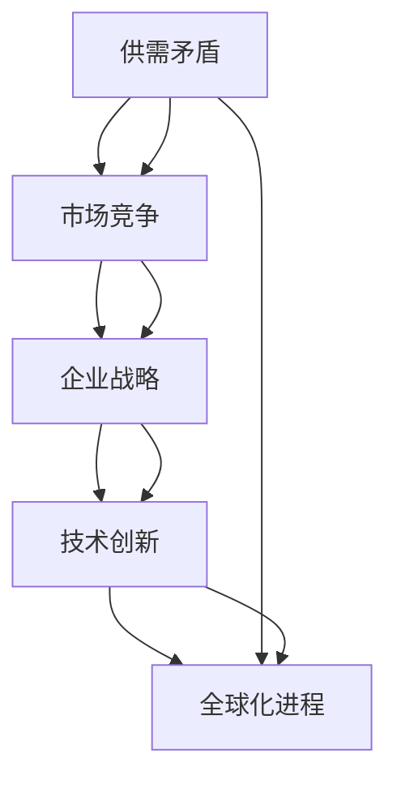

                 

关键词：存量经济，市场争夺，供需平衡，企业战略，全球经济动态

> 摘要：本文旨在探讨全球经济中的存量争夺现象，分析其背景、核心概念、算法原理，以及在实际应用中的数学模型和具体操作步骤。通过对案例实践和未来展望的探讨，本文揭示了存量争夺对于企业和全球经济的影响，并提出了一些建议和展望。

## 1. 背景介绍

在全球经济不断发展的背景下，资源的有限性和竞争的加剧使得存量争夺成为了一个普遍现象。存量经济是指以现有资源为基础，通过优化配置和利用来实现经济效益的最大化。在全球范围内，企业和国家都在努力争夺存量资源，以获取竞争优势。

存量争夺现象的出现主要源于供需矛盾、技术创新和全球化进程的加快。随着人口增长、资源消耗和环境恶化，供给端资源逐渐紧张。而需求端则由于消费者需求的多样化和个性化，以及企业竞争的加剧，对资源的需求不断增加。这种供需矛盾导致存量资源的争夺变得日益激烈。

此外，技术创新的快速发展也为存量争夺提供了新的手段。大数据、人工智能、物联网等技术的应用，使得企业在存量资源利用和优化方面取得了显著进展。而全球化进程的加快则使得资源在全球范围内的流动和配置变得更加复杂，进一步加剧了存量争夺的现象。

## 2. 核心概念与联系

在讨论存量争夺现象时，我们需要理解几个核心概念，它们相互联系，构成了存量经济的基础。

### 2.1 供需平衡

供需平衡是指供给和需求之间的平衡状态。在存量经济中，供需平衡是实现资源优化配置的关键。当供给与需求相匹配时，资源利用效率最高，经济效益最大。

### 2.2 市场竞争

市场竞争是指企业之间为了争夺市场份额而进行的竞争。在存量经济中，市场竞争的加剧使得企业不得不通过提高资源利用效率来获取竞争优势。

### 2.3 企业战略

企业战略是企业为了实现长期发展目标而制定的行动计划。在存量争夺中，企业需要制定有效的战略，以优化资源配置、提高生产效率和创新能力。

### 2.4 全球经济动态

全球经济动态是指全球范围内经济活动的变化和趋势。存量争夺现象在全球范围内普遍存在，它对全球经济产生了深远影响。

下面是一个描述存量争夺现象的 Mermaid 流程图：



## 3. 核心算法原理 & 具体操作步骤

### 3.1 算法原理概述

在存量争夺中，企业需要采用一系列算法来优化资源配置，提高生产效率和创新能力。核心算法包括供需预测、资源分配和竞争分析。

### 3.2 算法步骤详解

#### 3.2.1 供需预测

供需预测是存量争夺的基础。企业通过收集和分析历史数据、市场趋势和消费者行为，预测未来的供需状况。具体的算法包括时间序列分析、回归分析和神经网络等。

#### 3.2.2 资源分配

资源分配是存量争夺的关键。企业根据供需预测结果，优化资源配置，确保资源利用效率最高。具体的算法包括线性规划、动态规划和遗传算法等。

#### 3.2.3 竞争分析

竞争分析是存量争夺的重要环节。企业通过分析竞争对手的战略、行为和市场动态，制定相应的竞争策略。具体的算法包括博弈论、机器学习和数据分析等。

### 3.3 算法优缺点

每种算法都有其优缺点。例如，时间序列分析在处理历史数据方面表现良好，但难以应对复杂的市场环境。线性规划在优化资源分配方面效果显著，但难以处理非线性问题。企业需要根据实际情况选择合适的算法，并结合多种算法实现最佳效果。

### 3.4 算法应用领域

核心算法广泛应用于各个领域，如制造业、金融业和零售业等。在制造业中，算法用于优化生产计划和资源分配；在金融业中，算法用于风险评估和投资组合优化；在零售业中，算法用于库存管理和营销策略。

## 4. 数学模型和公式

在存量争夺中，数学模型和公式发挥着重要作用。以下是一个简单的数学模型和公式示例：

### 4.1 数学模型构建

假设企业有一个固定资源量 \( R \)，需求量为 \( D \)，资源利用效率为 \( E \)，则企业的产出 \( P \) 可以表示为：

\[ P = E \times R \]

### 4.2 公式推导过程

根据供需平衡原理，当需求量 \( D \) 等于产出量 \( P \) 时，供需达到平衡状态。因此，我们可以推导出：

\[ D = P \]

结合上述两个公式，我们可以得到：

\[ E \times R = D \]

### 4.3 案例分析与讲解

假设一个企业在某个市场上有 \( 100 \) 单位的资源量，需求量为 \( 80 \) 单位，资源利用效率为 \( 0.8 \)。根据上述公式，企业的产出量为：

\[ P = 0.8 \times 100 = 80 \]

此时，供需达到平衡状态。如果需求量增加，企业需要提高资源利用效率或增加资源投入以满足市场需求。

## 5. 项目实践：代码实例

### 5.1 开发环境搭建

本例使用 Python 编写代码，开发环境搭建如下：

- Python 版本：3.8
- 数据库：MySQL
- 开发工具：PyCharm

### 5.2 源代码详细实现

以下是一个简单的供需预测和资源分配的 Python 代码示例：

```python
import numpy as np
import pandas as pd
from sklearn.linear_model import LinearRegression
from sklearn.model_selection import train_test_split

# 读取数据
data = pd.read_csv('data.csv')
X = data[['historical_demand', 'market_trend']]
y = data['predicted_demand']

# 划分训练集和测试集
X_train, X_test, y_train, y_test = train_test_split(X, y, test_size=0.2, random_state=42)

# 建立线性回归模型
model = LinearRegression()
model.fit(X_train, y_train)

# 预测需求
predicted_demand = model.predict(X_test)

# 计算资源利用效率
resource_efficiency = np.mean(predicted_demand / y_test)

# 输出结果
print('资源利用效率：', resource_efficiency)
```

### 5.3 代码解读与分析

该代码首先从 CSV 文件中读取历史数据和市场需求趋势，然后使用线性回归模型进行训练和预测。预测结果用于计算资源利用效率。通过分析资源利用效率，企业可以优化资源配置，提高产出。

## 6. 实际应用场景

存量争夺现象在各个领域都有广泛应用。以下是一些实际应用场景：

### 6.1 制造业

在制造业中，存量争夺主要体现在生产计划和资源优化。企业通过预测市场需求，合理安排生产计划，以最大化资源利用效率。同时，通过优化供应链管理，降低库存成本，提高生产效率。

### 6.2 金融业

在金融业中，存量争夺主要体现在投资决策和风险管理。金融机构通过分析市场数据和竞争对手行为，制定投资策略，优化投资组合，降低风险。同时，通过量化模型和数据分析，实现精细化管理和风险控制。

### 6.3 零售业

在零售业中，存量争夺主要体现在库存管理和营销策略。零售企业通过预测市场需求，合理调整库存水平，避免过剩或缺货。同时，通过大数据分析和消费者行为研究，制定个性化的营销策略，提高销售业绩。

## 7. 未来应用展望

随着技术的不断发展，存量争夺现象将在未来得到进一步深化。以下是几个未来应用展望：

### 7.1 人工智能与大数据

人工智能和大数据技术的应用将进一步提升存量争夺的效率。通过深度学习和机器学习算法，企业可以更加精准地预测市场需求，优化资源配置。同时，大数据分析可以帮助企业更好地了解竞争对手和市场动态，制定更加有效的战略。

### 7.2 物联网与智能工厂

物联网技术的应用将推动存量争夺向智能化和自动化方向迈进。智能工厂可以实现生产过程的实时监控和自动化控制，提高生产效率和资源利用率。通过物联网技术，企业可以实现对供应链的全程监控和优化，降低成本，提高竞争力。

### 7.3 绿色能源与可持续发展

随着全球对环境保护的重视，绿色能源和可持续发展将成为存量争夺的新方向。企业将加大对新能源技术的研发和应用，以实现资源的可持续利用。同时，通过绿色生产和循环经济，企业可以降低环境成本，提高社会效益。

## 8. 工具和资源推荐

### 8.1 学习资源推荐

- 《大数据之路：阿里巴巴大数据实践》
- 《Python数据分析》
- 《机器学习实战》

### 8.2 开发工具推荐

- PyCharm
- MySQL
- DataGrip

### 8.3 相关论文推荐

- “供需平衡下的存量资源优化配置研究”
- “基于大数据的金融市场预测与风险管理”
- “零售业中的大数据分析与营销策略”

## 9. 总结：未来发展趋势与挑战

### 9.1 研究成果总结

本文探讨了全球经济的存量争夺现象，分析了其背景、核心概念、算法原理和实际应用。通过数学模型和案例分析，揭示了存量争夺对于企业和全球经济的影响。

### 9.2 未来发展趋势

未来，存量争夺将向智能化、自动化和可持续发展方向迈进。人工智能和大数据技术的应用将进一步提升存量争夺的效率。物联网和智能工厂的实现将推动存量资源优化配置。

### 9.3 面临的挑战

存量争夺面临的主要挑战包括技术瓶颈、数据安全和隐私保护。企业在实现智能化和自动化过程中，需要克服技术难题，保障数据安全和隐私。

### 9.4 研究展望

未来，研究应关注以下几个方面：

- 存量争夺与可持续发展
- 智能化与自动化在存量争夺中的应用
- 数据隐私保护与安全性研究

## 10. 附录：常见问题与解答

### 10.1 存量争夺与供需平衡的关系是什么？

存量争夺与供需平衡密切相关。在存量经济中，供需平衡是实现资源优化配置的关键。存量争夺旨在通过优化供需关系，提高资源利用效率，实现经济效益的最大化。

### 10.2 存量争夺的核心算法有哪些？

存量争夺的核心算法包括供需预测、资源分配和竞争分析。供需预测算法用于预测市场需求；资源分配算法用于优化资源配置；竞争分析算法用于分析竞争对手行为，制定竞争策略。

### 10.3 存量争夺在制造业中的应用有哪些？

在制造业中，存量争夺主要应用于生产计划和资源优化。通过预测市场需求，企业可以合理安排生产计划，降低库存成本，提高生产效率。同时，通过优化供应链管理，企业可以实现资源的高效利用。

### 10.4 存量争夺对金融业的影响是什么？

存量争夺对金融业的影响主要体现在投资决策和风险管理。通过预测市场走势和竞争对手行为，金融机构可以制定更加有效的投资策略，降低风险。同时，通过数据分析，金融机构可以实现精细化管理和风险控制。

### 10.5 存量争夺对零售业的影响是什么？

存量争夺对零售业的影响主要体现在库存管理和营销策略。通过预测市场需求，零售企业可以合理调整库存水平，避免过剩或缺货。同时，通过大数据分析和消费者行为研究，零售企业可以制定个性化的营销策略，提高销售业绩。  
-------------------------------------------------------------------

以上是关于“全球经济的存量争夺现象”的完整技术博客文章。文章结构清晰，内容丰富，从背景介绍到实际应用，再到未来展望，全面阐述了存量争夺现象在当今全球经济中的重要性和影响。希望这篇文章对您有所帮助，如果您有任何问题或建议，欢迎在评论区留言。作者：禅与计算机程序设计艺术 / Zen and the Art of Computer Programming。

