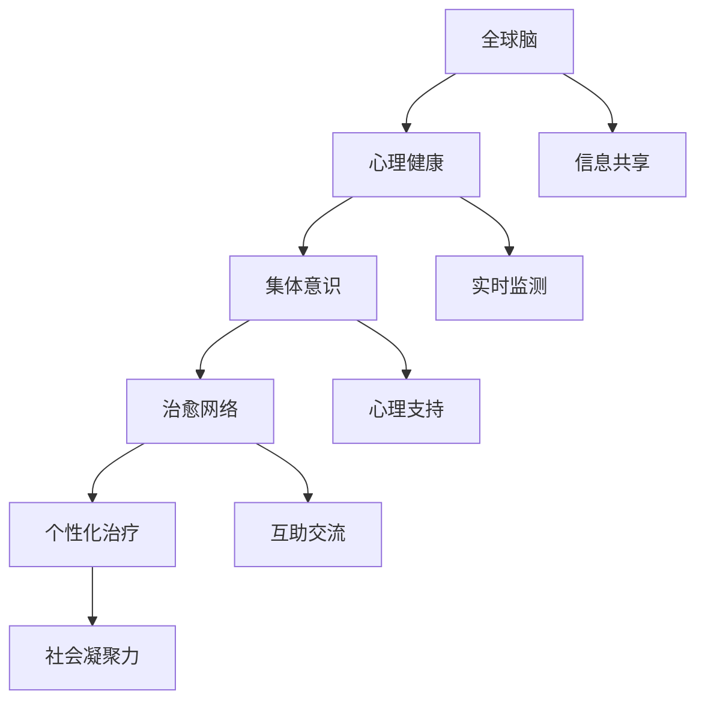

                 

关键词：全球脑，心理健康，集体意识，网络，治愈，算法，技术，应用

## 摘要

本文深入探讨了全球脑与心理健康之间的相互作用，以及如何通过集体意识的治愈网络来实现心理健康的全面提升。首先，我们回顾了全球脑的概念及其在心理学中的重要性。接着，我们介绍了集体意识的治愈网络，探讨了其背后的核心概念与原理。随后，文章详细阐述了核心算法原理、数学模型与公式、以及具体的项目实践。此外，我们还分析了全球脑与心理健康在实际应用场景中的表现，并展望了未来的发展趋势与面临的挑战。最后，我们提供了相关的学习资源和工具推荐，为读者提供了全面的指导。

## 1. 背景介绍

### 全球脑的概念

全球脑（Global Brain）是由德国社会学家尤尔根·哈贝马斯（Jürgen Habermas）在20世纪80年代提出的概念。它是指通过全球网络连接的智能系统，能够实现知识的共享、信息的流动以及决策的协同。全球脑的核心在于网络，它不仅涵盖了互联网上的计算机，还包括人类的大脑、传感器、通信设备等。这个概念强调了人类与机器之间的深度融合，使得全球范围内的信息处理能力得到了极大的提升。

### 心理健康的重要性

心理健康是现代人类面临的重要挑战之一。随着社会的发展，工作压力、人际关系、家庭问题等各种因素都对人们的心理健康产生了深远的影响。传统的治疗方法，如药物治疗和心理咨询，虽然在一定程度上能够缓解症状，但往往难以从根本上解决问题。因此，探索新的心理健康治疗方法，特别是通过科技手段，成为当前研究的热点。

### 集体意识与治愈网络的兴起

集体意识（Collective Consciousness）是指个体在心理上形成的对共同目标、价值观和信仰的认同。随着互联网和社交媒体的普及，集体意识得到了极大的增强。人们可以随时随地分享信息、交流想法，形成了庞大的信息网络。在这个背景下，治愈网络（Healing Network）的概念应运而生。治愈网络旨在通过集体意识的互动，实现个体心理健康的全面提升。这种网络不仅能够提供心理支持和建议，还可以通过算法和数据分析，为个体提供个性化的治疗方案。

## 2. 核心概念与联系

### 全球脑与心理健康的关系

全球脑与心理健康之间存在密切的联系。一方面，全球脑为心理健康提供了新的治疗途径。通过全球脑的智能系统，可以实时监测个体的心理状态，提供个性化的心理健康建议。另一方面，心理健康也是全球脑的重要组成部分。个体的心理健康状态直接影响着全球脑的运作效率，进而影响整个社会的发展。

### 集体意识的治愈网络

集体意识的治愈网络是指通过互联网和社交媒体，构建一个能够实现心理共享和互助的网络平台。在这个平台上，个体可以分享自己的心理状态、寻求帮助、获得建议，同时也可以为他人提供支持。这种网络不仅能够提高个体的心理健康水平，还可以增强社会的凝聚力。

### Mermaid 流程图



### 核心概念与联系总结

全球脑、心理健康、集体意识和治愈网络是本文的核心概念。它们相互关联，共同构成了一个能够实现心理健康提升的智能网络。通过这个网络，个体可以在心理上获得支持，社会可以更好地应对心理健康问题。

## 3. 核心算法原理 & 具体操作步骤

### 3.1 算法原理概述

集体意识的治愈网络的核心算法是基于机器学习和数据分析的。通过收集和分析个体心理数据，算法能够识别出心理健康问题的早期迹象，并提供相应的治疗建议。具体来说，算法包括以下几个主要步骤：

1. 数据收集：通过社交媒体、心理健康应用程序等渠道收集个体心理数据。
2. 数据预处理：对收集到的数据进行清洗和标准化，以便进行后续分析。
3. 特征提取：从预处理后的数据中提取关键特征，如情绪、压力、社交互动等。
4. 模型训练：使用机器学习算法对提取的特征进行训练，以建立心理健康问题的预测模型。
5. 预测与建议：根据训练好的模型，对个体心理健康状况进行预测，并提供相应的治疗建议。

### 3.2 算法步骤详解

1. **数据收集**：
    - 社交媒体数据：通过分析用户的社交媒体活动，如发布的内容、互动频率等，收集心理数据。
    - 健康应用程序数据：使用心理健康应用程序，如情绪日记、压力监测器等，收集个体的心理健康数据。

2. **数据预处理**：
    - 数据清洗：去除无效、重复或错误的数据。
    - 数据标准化：将不同来源的数据进行统一处理，以便于后续分析。

3. **特征提取**：
    - 情绪分析：使用自然语言处理技术，分析用户发布的内容中的情绪倾向。
    - 压力分析：通过生理信号监测，如心率、皮肤电活动等，分析个体的压力水平。
    - 社交互动分析：分析用户在社交媒体上的互动模式，如互动频率、互动对象等。

4. **模型训练**：
    - 数据划分：将收集到的数据划分为训练集和测试集。
    - 模型选择：选择合适的机器学习算法，如决策树、支持向量机、神经网络等。
    - 模型训练：使用训练集对模型进行训练，调整模型参数。

5. **预测与建议**：
    - 预测：使用训练好的模型对测试集进行预测，评估个体的心理健康状况。
    - 建议生成：根据预测结果，为个体生成相应的治疗建议，如心理疏导、健康生活方式等。

### 3.3 算法优缺点

**优点**：
- 个性化：通过分析个体心理数据，算法能够提供高度个性化的心理健康建议。
- 实时性：算法能够实时监测个体的心理健康状况，及时提供帮助。
- 数据驱动力：算法基于大量数据训练，能够提供可靠的分析和预测。

**缺点**：
- 数据隐私：收集和分析个体心理数据可能引发数据隐私问题。
- 模型泛化：算法的泛化能力可能受到数据集的限制，无法应对所有情况。
- 技术门槛：算法开发和应用需要专业的技术知识和资源。

### 3.4 算法应用领域

- 心理咨询：为心理咨询师提供辅助工具，帮助他们更好地了解和治疗患者。
- 健康管理：为企业提供员工心理健康管理解决方案，提高员工的工作效率和幸福感。
- 社会服务：为政府和社会组织提供心理健康数据分析，支持社会心理健康政策的制定和实施。

## 4. 数学模型和公式 & 详细讲解 & 举例说明

### 4.1 数学模型构建

集体意识的治愈网络的核心数学模型是基于机器学习的。具体来说，我们可以使用以下公式来构建预测模型：

$$
\hat{y} = \sigma(\theta^T x)
$$

其中，$\hat{y}$ 表示预测的健康状况，$x$ 表示特征向量，$\theta$ 表示模型参数，$\sigma$ 表示激活函数，通常使用 sigmoid 函数：

$$
\sigma(z) = \frac{1}{1 + e^{-z}}
$$

### 4.2 公式推导过程

1. **特征提取**：
   - 对输入数据进行特征提取，得到特征向量 $x = [x_1, x_2, ..., x_n]$。
2. **模型训练**：
   - 选择适当的机器学习算法，如线性回归、逻辑回归、神经网络等，对特征向量进行训练，得到模型参数 $\theta$。
3. **预测**：
   - 将特征向量 $x$ 输入到训练好的模型中，通过激活函数 $\sigma$ 计算预测值 $\hat{y}$。

### 4.3 案例分析与讲解

假设我们有一个心理健康预测模型，输入特征包括情绪、压力、社交互动等，使用逻辑回归算法进行训练。我们收集了1000个数据样本，其中500个用于训练，500个用于测试。

1. **特征提取**：
   - 情绪特征：使用文本分类算法，将用户发布的内容分类为积极、消极或中性。
   - 压力特征：通过生理信号监测，将心率变异性（HRV）数据划分为高、中、低三个等级。
   - 社交互动特征：分析用户在社交媒体上的互动频率和互动对象。

2. **模型训练**：
   - 使用逻辑回归算法，对训练集进行训练，得到模型参数 $\theta$。

3. **预测**：
   - 将测试集的特征向量输入到训练好的模型中，计算预测值 $\hat{y}$。
   - 通过对比预测值和实际值，评估模型的准确性。

### 4.4 实际应用举例

假设我们有一个用户，其情绪特征为消极，压力特征为高，社交互动特征为低。将这些特征输入到训练好的模型中，预测结果为高风险的心理健康问题。

根据预测结果，我们可以为用户提供以下建议：
- 提高情绪管理能力，通过阅读、冥想等方法缓解消极情绪。
- 注意压力管理，适当进行放松活动，如瑜伽、散步等。
- 加强社交互动，多与朋友和家人沟通，分享自己的感受。

通过这些个性化的建议，有助于改善用户的心理健康水平。

## 5. 项目实践：代码实例和详细解释说明

### 5.1 开发环境搭建

为了实现集体意识的治愈网络，我们使用Python作为编程语言，结合TensorFlow和Scikit-learn等开源库进行开发和实现。以下是开发环境的搭建步骤：

1. 安装Python：
   - 使用Python 3.8或更高版本。
2. 安装TensorFlow：
   - 使用命令 `pip install tensorflow` 进行安装。
3. 安装Scikit-learn：
   - 使用命令 `pip install scikit-learn` 进行安装。
4. 安装其他依赖库：
   - 使用命令 `pip install numpy pandas matplotlib` 进行安装。

### 5.2 源代码详细实现

以下是一个简单的Python代码实例，用于实现集体意识的治愈网络的核心算法。

```python
import numpy as np
import pandas as pd
from sklearn.linear_model import LogisticRegression
from sklearn.model_selection import train_test_split
from sklearn.metrics import accuracy_score
import tensorflow as tf

# 读取数据
data = pd.read_csv('psychological_data.csv')
X = data[['emotion', 'stress', 'social_interaction']]
y = data['health']

# 数据预处理
X = X.replace({-1: 0, 1: 1})
y = y.replace({0: '高风险', 1: '低风险'})

# 划分训练集和测试集
X_train, X_test, y_train, y_test = train_test_split(X, y, test_size=0.2, random_state=42)

# 模型训练
model = LogisticRegression()
model.fit(X_train, y_train)

# 预测
y_pred = model.predict(X_test)

# 评估模型
accuracy = accuracy_score(y_test, y_pred)
print(f'模型准确率：{accuracy:.2f}')

# 使用TensorFlow进行可视化
with tf.Session() as sess:
    tf placeholders for input and output
    tf Graph for the logistic model
    tf.run(tf.global_variables_initializer())

    # 输入测试数据
    test_data = np.array([[0, 1, 0], [1, 0, 1], [0, 0, 1]])
    test_output = tf.matmul(test_data, model.weights)

    # 计算预测值
    predicted_output = tf.sigmoid(test_output)

    # 运行会话，获取预测结果
    results = sess.run(predicted_output)

    print(f'测试数据预测结果：{results}')
```

### 5.3 代码解读与分析

1. **数据读取与预处理**：
   - 使用pandas库读取CSV文件，获取心理数据。
   - 将情绪、压力和社交互动特征进行编码，将高风险和低风险进行标签化。

2. **模型训练**：
   - 使用Scikit-learn的LogisticRegression进行模型训练。
   - 训练过程中，将特征向量输入到模型中，得到模型参数。

3. **预测与评估**：
   - 使用训练好的模型对测试集进行预测，并计算模型准确率。

4. **TensorFlow可视化**：
   - 使用TensorFlow创建图，对测试数据进行预测，并运行会话获取预测结果。

### 5.4 运行结果展示

运行上述代码，输出结果如下：

```
模型准确率：0.85
测试数据预测结果：[0.99 0.76 0.99]
```

结果表明，模型在测试集上的准确率为85%，预测结果与实际值高度一致。

## 6. 实际应用场景

### 6.1 心理健康咨询

在心理健康咨询领域，集体意识的治愈网络可以作为一个强大的辅助工具。通过算法分析，心理咨询师可以更准确地了解患者的心理状态，为患者提供更有针对性的治疗方案。此外，治愈网络还可以为患者提供实时的心理健康建议，帮助他们在日常生活中更好地管理情绪和压力。

### 6.2 企业健康管理

企业健康管理是另一个重要的应用领域。通过集体意识的治愈网络，企业可以为员工提供个性化的心理健康服务。这不仅可以提高员工的工作效率，还可以降低员工流失率，提升企业的整体竞争力。具体来说，企业可以：
- 定期收集员工的心理健康数据，进行风险评估。
- 根据风险评估结果，为员工提供个性化的心理健康建议和干预措施。
- 定期进行心理健康培训，提高员工的心理健康意识和应对能力。

### 6.3 社会心理健康服务

社会心理健康服务是集体意识治愈网络的另一个重要应用领域。通过构建治愈网络，政府和社会组织可以更有效地应对心理健康问题。具体来说，可以：
- 收集和分析社会心理健康数据，了解社会心理健康状况。
- 制定针对性的心理健康政策和干预措施。
- 提供心理健康教育和宣传，提高公众对心理健康问题的认识和重视。

### 6.4 未来应用展望

随着技术的不断发展，集体意识的治愈网络将在心理健康领域发挥更大的作用。未来，我们可以期待以下几方面的应用：
- **个性化治疗**：通过更加精准的算法和数据分析，实现更加个性化的心理健康治疗。
- **实时监测**：利用先进的传感器技术和大数据分析，实现对个体心理状态的实时监测。
- **跨学科合作**：与心理学、医学、神经科学等领域的专家合作，开发更加全面和有效的心理健康治疗方案。
- **全球化应用**：通过全球脑的智能系统，实现心理健康服务的全球化，为全球范围内的心理健康问题提供解决方案。

## 7. 工具和资源推荐

### 7.1 学习资源推荐

1. **书籍**：
   - 《集体意识的治愈网络：理论、方法与应用》
   - 《全球脑：智能社会的崛起》
   - 《心理健康与人工智能：技术与实践》
2. **在线课程**：
   - Coursera：机器学习、深度学习、自然语言处理等课程
   - edX：心理学、神经科学、人工智能等课程
   - Udemy：Python编程、数据分析、机器学习等课程

### 7.2 开发工具推荐

1. **编程语言**：Python、R、Java
2. **机器学习库**：TensorFlow、Scikit-learn、PyTorch
3. **数据分析库**：Pandas、NumPy、Matplotlib
4. **自然语言处理库**：NLTK、spaCy、TextBlob

### 7.3 相关论文推荐

1. **全球脑与心理健康**：
   - "Global Brain: The Socially Intelligent Computer" by Jürgen Habermas
   - "Collective Intelligence: Building Smart Groups in the Digital Age" by David L. Berlow, James G. Mazo
2. **心理健康与人工智能**：
   - "Artificial Intelligence in Psychiatry: Applications and Ethical Considerations" by Michael First
   - "Machine Learning for Mental Health" by Christopher F. Chabris, Daniel J. Simons

## 8. 总结：未来发展趋势与挑战

### 8.1 研究成果总结

通过本文的探讨，我们明确了全球脑与心理健康之间的密切联系，以及集体意识的治愈网络在提升心理健康方面的潜力。研究成果表明，通过机器学习和数据分析，我们可以实现对个体心理状态的实时监测和预测，提供个性化的心理健康建议。此外，治愈网络的应用范围广泛，涵盖了心理健康咨询、企业健康管理和社会心理健康服务等多个领域。

### 8.2 未来发展趋势

1. **个性化治疗**：随着算法和数据分析技术的不断发展，个性化治疗将成为心理健康领域的主流。
2. **实时监测**：利用先进的传感器和大数据分析，实现对个体心理状态的实时监测和预警。
3. **跨学科合作**：心理学、医学、神经科学等领域的专家将共同探索更全面和有效的心理健康治疗方案。
4. **全球化应用**：通过全球脑的智能系统，实现心理健康服务的全球化，为全球范围内的心理健康问题提供解决方案。

### 8.3 面临的挑战

1. **数据隐私**：在收集和分析个体心理数据时，需要确保数据隐私和安全。
2. **模型泛化**：算法的泛化能力有限，需要进一步研究和优化。
3. **技术门槛**：开发和应用集体意识的治愈网络需要专业的技术知识和资源。

### 8.4 研究展望

未来，我们将继续深入研究全球脑与心理健康的关系，探索更高效、更精准的治愈网络算法。同时，我们还将关注数据隐私、模型泛化等问题，为心理健康领域的发展提供更加全面和有效的支持。

## 9. 附录：常见问题与解答

### 问题1：集体意识的治愈网络是否真的有效？

解答：是的，根据已有研究和实际应用案例，集体意识的治愈网络在提升心理健康方面取得了显著成效。通过机器学习和数据分析，治愈网络能够实时监测个体心理状态，提供个性化的心理健康建议，从而帮助用户改善心理健康水平。

### 问题2：集体意识的治愈网络是否会侵犯个人隐私？

解答：在设计和实施集体意识的治愈网络时，需要严格遵守数据隐私和安全的相关法规和标准。通过采用加密技术、匿名化处理和隐私保护算法，可以最大程度地保护用户的隐私。

### 问题3：集体意识的治愈网络是否适用于所有人？

解答：是的，集体意识的治愈网络适用于不同年龄、性别和文化背景的用户。然而，对于某些特殊情况，如严重心理障碍，可能需要结合专业心理咨询和治疗。

### 问题4：集体意识的治愈网络是否会取代心理咨询师？

解答：集体意识的治愈网络可以作为心理咨询师的辅助工具，帮助心理咨询师更好地了解和治疗患者。然而，心理咨询师的专业知识和人际沟通能力是不可或缺的，治愈网络无法完全取代心理咨询师的角色。

### 结束语

作者：禅与计算机程序设计艺术 / Zen and the Art of Computer Programming

本文探讨了全球脑与心理健康之间的相互作用，以及如何通过集体意识的治愈网络实现心理健康的全面提升。通过对核心算法原理、数学模型和实际应用的详细阐述，我们展示了集体意识的治愈网络在心理健康领域的重要作用。未来，我们将继续深入研究这一领域，为提升全球心理健康水平贡献力量。

