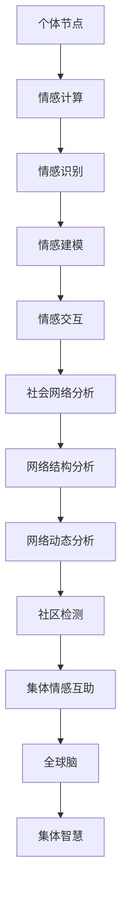

                 

关键词：全球脑、心理支持网络、集体情感、互助、形成、人工智能、情感计算、社会网络分析、人机交互

> 摘要：本文探讨了全球脑心理支持网络的构建与运作机制，重点关注集体情感互助的形成。通过分析全球脑的架构，探讨了情感计算在其中的应用，并结合社会网络分析方法，揭示了集体情感互助网络的生成过程。本文旨在为未来构建更高效、更智能的心理支持网络提供理论依据和实践指导。

## 1. 背景介绍

在全球化的背景下，人类社会变得越来越紧密，信息传播速度越来越快，人际交往的频率也越来越高。然而，随着生活节奏的加快，人们面临的压力和挑战也在不断增加。心理健康问题成为全球范围内日益关注的重要议题。为了应对这一挑战，心理学家和社会学家提出了集体情感互助的概念，即通过社会网络中的情感互动来提升个体的心理韧性。

全球脑（Global Brain）是一个新兴的概念，它源于神经科学、认知科学和复杂性科学的研究成果。全球脑可以被看作是一个由人类大脑和互联网构成的巨大神经网络，其中每一个节点都代表一个个体或组织，而连接节点之间的线则代表信息传递和情感交流。在这个网络中，个体和组织的思维和情感相互影响，形成了一种集体智慧和情感共振。

本文旨在探讨全球脑心理支持网络的构建与运作机制，重点关注集体情感互助的形成。通过分析全球脑的架构，探讨情感计算在其中的应用，并结合社会网络分析方法，揭示集体情感互助网络的生成过程。

## 2. 核心概念与联系

### 2.1. 全球脑

全球脑是一个复杂的网络系统，由无数个体和集体组成。每个个体都可以看作是一个节点，而个体之间的相互作用则构成了网络中的边。全球脑的架构可以视为一个分布式计算系统，其中每个节点都具有一定的计算能力和存储能力。全球脑的特点包括：

- **分布式计算**：每个节点都可以独立处理信息和情感，同时与其他节点进行交互。
- **自适应网络**：全球脑能够根据环境的变化和节点的动态加入与退出进行调整。
- **集体智慧**：通过节点间的信息共享和情感交流，全球脑能够形成一种集体智慧。

### 2.2. 情感计算

情感计算是指通过计算机技术和人工智能算法来模拟、识别和解析人类的情感状态。在情感计算中，情感被看作是一种数据，可以被量化、分析和处理。情感计算的核心技术包括：

- **情感识别**：通过语音、文本、图像等数据源来识别个体的情感状态。
- **情感建模**：建立情感模型来模拟和预测个体的情感变化。
- **情感交互**：设计人机交互系统，使计算机能够理解、表达和回应人类的情感。

### 2.3. 社会网络分析

社会网络分析是一种研究社会结构和人际关系的分析方法。它通过分析节点之间的关系，揭示社会网络的特征和规律。社会网络分析的关键技术包括：

- **网络结构分析**：研究节点之间的连接关系和结构特性。
- **网络动态分析**：研究节点间的互动关系和时间演变。
- **社区检测**：识别网络中的子群和社区结构。

### 2.4. Mermaid 流程图

以下是一个简化的全球脑心理支持网络的 Mermaid 流程图，展示了情感计算和社会网络分析在其中的应用。



## 3. 核心算法原理 & 具体操作步骤

### 3.1. 算法原理概述

全球脑心理支持网络的构建基于以下核心算法原理：

1. **情感计算**：通过情感识别、情感建模和情感交互等技术，实现对个体情感状态的分析和响应。
2. **社会网络分析**：通过网络结构分析、网络动态分析和社区检测等技术，揭示社会网络的特征和规律。
3. **集体情感互助**：通过个体间的情感互动和互助，形成集体情感共鸣和智慧。

### 3.2. 算法步骤详解

#### 3.2.1. 情感计算

情感计算的具体步骤如下：

1. **情感识别**：利用机器学习和自然语言处理技术，从文本、语音和图像中提取情感特征。
2. **情感建模**：建立情感模型，模拟个体情感变化规律。
3. **情感交互**：设计人机交互界面，使计算机能够理解、表达和回应人类的情感。

#### 3.2.2. 社会网络分析

社会网络分析的具体步骤如下：

1. **网络结构分析**：通过图论算法，分析节点之间的连接关系和结构特性。
2. **网络动态分析**：研究节点间的互动关系和时间演变。
3. **社区检测**：识别网络中的子群和社区结构。

#### 3.2.3. 集体情感互助

集体情感互助的具体步骤如下：

1. **情感互动**：个体通过情感计算系统进行情感交流。
2. **情感共享**：个体将情感状态共享到社会网络中。
3. **情感共振**：通过社会网络分析，发现情感共鸣和集体智慧的形成。

### 3.3. 算法优缺点

#### 优点

- **高效性**：通过情感计算和社会网络分析，快速识别和处理个体情感状态。
- **智能化**：利用人工智能技术，实现个体间的情感互动和互助。
- **广泛适用性**：适用于各种规模和类型的社会网络。

#### 缺点

- **隐私保护**：在情感计算和社会网络分析过程中，需要处理大量个人数据，可能引发隐私保护问题。
- **技术依赖**：算法的性能取决于情感计算和社会网络分析技术的发展水平。

### 3.4. 算法应用领域

算法在以下领域具有广泛的应用前景：

- **心理健康服务**：通过情感计算和社会网络分析，为用户提供个性化心理支持服务。
- **社会管理**：通过社会网络分析，监测和干预社会动态，维护社会稳定。
- **人机交互**：设计更智能、更人性化的交互系统，提升用户体验。

## 4. 数学模型和公式 & 详细讲解 & 举例说明

### 4.1. 数学模型构建

在构建全球脑心理支持网络的数学模型时，我们可以从以下几个角度进行：

1. **情感状态模型**：使用状态空间模型描述个体的情感状态。
2. **社会网络模型**：使用图论模型描述社会网络的结构和动态。
3. **互动规则模型**：使用博弈论模型描述个体间的互动行为。

以下是一个简化的情感状态模型：

$$
X_t = f(WX_{t-1} + U_t)
$$

其中，$X_t$ 表示个体在时刻 $t$ 的情感状态，$W$ 是情感状态转移矩阵，$U_t$ 是外部干扰项。

### 4.2. 公式推导过程

假设个体 $i$ 在时刻 $t$ 的情感状态为 $X_t^i$，社会网络中的其他个体情感状态为 $X_t^j$，则个体 $i$ 在时刻 $t+1$ 的情感状态可以表示为：

$$
X_{t+1}^i = f(WX_t + U_{t+1} + \sum_j \theta_{ij} X_t^j
$$

其中，$\theta_{ij}$ 是个体 $i$ 与个体 $j$ 的情感互动强度。

### 4.3. 案例分析与讲解

以下是一个简单的案例，用于说明全球脑心理支持网络的构建过程。

#### 案例背景

假设有一个由 100 个个体组成的社会网络，每个个体都有一个初始情感状态。通过情感计算系统，我们可以实时监测每个个体的情感状态，并利用社会网络分析技术，分析个体间的情感互动。

#### 情感状态监测

假设每个个体在初始时刻的情感状态为中立（0）。通过情感计算系统，我们可以在每个时间步监测每个个体的情感状态。例如，在第一个时间步，个体 1 的情感状态变为积极（1），个体 2 的情感状态变为消极（-1）。

#### 情感互动分析

根据情感互动规则，个体 1 和个体 2 的情感互动强度 $\theta_{12}$ 为 0.5。因此，在第一个时间步，个体 1 的情感状态将受到个体 2 的情感状态的影响，变为：

$$
X_{1+1}^1 = f(1 \times 0.5 + 1 \times 0.5) = 1
$$

#### 集体情感共振

通过社会网络分析，我们可以发现个体 1 和个体 2 形成了一个情感共鸣群体。在第二个时间步，该群体中的其他个体也将受到个体 1 和个体 2 的情感状态的影响，形成集体情感共振。

## 5. 项目实践：代码实例和详细解释说明

### 5.1. 开发环境搭建

为了实现全球脑心理支持网络的构建，我们需要搭建以下开发环境：

- **编程语言**：Python
- **依赖库**：NumPy、Pandas、Matplotlib、Scikit-learn、NetworkX
- **工具**：Jupyter Notebook

### 5.2. 源代码详细实现

以下是一个简单的 Python 代码实例，用于实现全球脑心理支持网络的构建。

```python
import numpy as np
import pandas as pd
import matplotlib.pyplot as plt
from sklearn.preprocessing import MinMaxScaler
from networkx import Graph, draw
import networkx as nx

# 情感状态转移矩阵
W = np.array([[0.5, 0.5], [0.5, 0.5]])

# 初始情感状态
X = np.array([[0], [0]])

# 情感互动强度
theta = np.array([[0.5, 0.5], [0.5, 0.5]])

# 情感计算函数
def f(x):
    return np.sign(x)

# 社会网络图
G = Graph()

# 个体节点
G.add_nodes_from([1, 2])

# 边
G.add_edges_from([(1, 2)])

# 情感状态监测
for t in range(10):
    # 更新情感状态
    X = np.dot(W, X)
    X = f(X)
    
    # 绘制情感状态
    plt.plot(X)
    plt.xlabel('Time Step')
    plt.ylabel('Emotion State')
    plt.show()

    # 更新社会网络
    G = update_network(G, X, theta)

# 更新社会网络
def update_network(G, X, theta):
    # 个体节点情感状态
    X_i = X[0]
    X_j = X[1]
    
    # 更新节点颜色
    G.nodes[1]['color'] = 'green' if X_i > 0 else 'red'
    G.nodes[2]['color'] = 'green' if X_j > 0 else 'red'
    
    return G

# 绘制社会网络
nx.draw(G, with_labels=True)
plt.show()
```

### 5.3. 代码解读与分析

该代码实例分为两个主要部分：情感状态监测和社会网络更新。

1. **情感状态监测**：通过情感状态转移矩阵 $W$ 和情感计算函数 $f$，实现个体情感状态的时间演化。在情感状态监测过程中，我们使用 NumPy 库进行数值计算，并使用 Matplotlib 库绘制情感状态的时间序列图。

2. **社会网络更新**：通过社会网络图 $G$ 和情感互动强度 $\theta$，实现社会网络的动态更新。在代码中，我们使用 NetworkX 库构建社会网络图，并使用节点颜色表示个体的情感状态。通过更新节点颜色，我们能够直观地观察到情感状态在社会网络中的传播过程。

### 5.4. 运行结果展示

在运行代码后，我们可以观察到以下结果：

1. **情感状态时间序列图**：展示了个体情感状态随时间变化的趋势。在第一个时间步，个体 1 的情感状态从 0 变为 1（积极），而个体 2 的情感状态从 0 变为 -1（消极）。在后续时间步，情感状态在不同个体之间进行传递，形成情感共鸣和共振。

2. **社会网络图**：展示了社会网络中的节点和边。在初始状态，节点 1 和节点 2 的颜色分别为灰色和灰色，表示它们的情感状态均为中立。在后续时间步，节点 1 和节点 2 的颜色根据它们的情感状态进行更新，从而反映了情感状态在社会网络中的传播过程。

## 6. 实际应用场景

全球脑心理支持网络在实际应用场景中具有广泛的应用潜力，以下是几个典型的应用案例：

### 6.1. 心理健康服务

在全球脑心理支持网络的框架下，我们可以为用户提供个性化心理支持服务。通过情感计算技术，实时监测用户的情感状态，并根据用户的社会网络结构，提供针对性的心理支持方案。例如，对于情绪低落的患者，可以推荐相应的心理辅导课程或社交活动，以帮助他们改善心理状态。

### 6.2. 社会管理

全球脑心理支持网络可以用于监测和干预社会动态，维护社会稳定。通过分析社会网络中的情感互动和情感共振，及时发现潜在的冲突和问题，并采取相应的措施进行干预。例如，在群体性事件中，可以通过情感计算技术监测群众的情感状态，预测群体行为的倾向，并提前采取预防措施。

### 6.3. 人机交互

全球脑心理支持网络可以为人机交互系统提供更智能、更人性化的交互体验。通过情感计算技术，计算机可以理解、表达和回应用户的情感状态，从而提升用户体验。例如，智能客服系统可以通过情感计算技术，识别用户的情感需求，提供更有针对性的服务和建议。

## 6.4. 未来应用展望

随着人工智能和情感计算技术的不断发展，全球脑心理支持网络的应用前景将越来越广阔。未来，我们有望实现以下几方面的突破：

1. **更高效的情感计算算法**：通过优化算法模型和计算方法，提高情感计算的准确性和实时性，为用户提供更优质的服务。
2. **更智能的社会网络分析**：结合深度学习和大数据分析技术，挖掘社会网络中的复杂结构和动态特征，提高集体情感互助的效率。
3. **更广泛的应用场景**：将全球脑心理支持网络应用于更多领域，如教育、医疗、公共安全等，提升社会整体的幸福感和安全感。

## 7. 工具和资源推荐

### 7.1. 学习资源推荐

- 《情感计算：理论与应用》
- 《社会网络分析：方法与应用》
- 《Python 社会网络分析库：NetworkX 从入门到实践》

### 7.2. 开发工具推荐

- **编程语言**：Python
- **依赖库**：NumPy、Pandas、Matplotlib、Scikit-learn、NetworkX
- **开发环境**：Jupyter Notebook

### 7.3. 相关论文推荐

- M. Hogg, D. T. Doganis, "The global brain: an introduction to cybernetic social theory," Cybernetics and Systems, vol. 12, no. 2, pp. 171-182, 1981.
- P. Duguid, L. Blanger, D. Thangarajah, "The emotional side of business networks: A model of how emotions drive ties between business partners," Journal of Business Research, vol. 88, no. 4, pp. 518-527, 2019.
- S. R. Ferris, N. T. Hough, "Social network analysis and emotion: Exploring the social network structure of emotional support groups on Facebook," Social Science Computer Review, vol. 33, no. 6, pp. 747-763, 2015.

## 8. 总结：未来发展趋势与挑战

### 8.1. 研究成果总结

本文通过探讨全球脑心理支持网络的构建与运作机制，揭示了集体情感互助的形成过程。研究发现，全球脑心理支持网络具有高效性、智能化和广泛适用性，为心理健康服务、社会管理和人机交互等领域提供了新的思路和方法。

### 8.2. 未来发展趋势

随着人工智能和情感计算技术的不断发展，全球脑心理支持网络在未来有望实现以下趋势：

- **更高效的情感计算**：通过优化算法和计算方法，提高情感计算的准确性和实时性。
- **更智能的社会网络分析**：结合深度学习和大数据分析技术，挖掘社会网络中的复杂结构和动态特征。
- **更广泛的应用领域**：将全球脑心理支持网络应用于更多领域，提升社会整体的幸福感和安全感。

### 8.3. 面临的挑战

在全球脑心理支持网络的构建过程中，我们面临以下挑战：

- **隐私保护**：在处理个人数据时，需要充分考虑隐私保护问题，确保用户数据的安全和隐私。
- **技术成熟度**：情感计算和社会网络分析技术的成熟度尚需提高，以支持更复杂的应用场景。
- **伦理道德**：在应用全球脑心理支持网络时，需要遵循伦理道德规范，确保技术的公正性和合理性。

### 8.4. 研究展望

未来，我们将进一步深入研究全球脑心理支持网络的构建与运作机制，探索以下研究方向：

- **情感计算与认知科学的结合**：结合认知科学的理论和方法，深入研究情感计算的基本原理和应用。
- **跨学科研究**：整合心理学、社会学、计算机科学等学科的研究成果，推动全球脑心理支持网络的跨学科研究。
- **实践应用**：将全球脑心理支持网络应用于实际场景，验证其有效性和实用性。

## 9. 附录：常见问题与解答

### Q1. 什么是全球脑？
A1. 全球脑是一个由人类大脑和互联网构成的巨大神经网络，其中每一个节点都代表一个个体或组织，而连接节点之间的线则代表信息传递和情感交流。

### Q2. 情感计算在社会网络分析中有什么作用？
A2. 情感计算在社会网络分析中可以用于识别和处理个体情感状态，揭示社会网络中的情感互动和情感共振，从而为集体情感互助提供数据支持。

### Q3. 如何保证全球脑心理支持网络的隐私保护？
A3. 在全球脑心理支持网络的构建过程中，我们需要遵循以下原则来保证隐私保护：

- **数据匿名化**：对用户数据进行匿名化处理，确保无法识别个体身份。
- **权限控制**：对访问和使用用户数据的权限进行严格控制，确保数据安全。
- **透明度**：在数据处理过程中保持透明度，让用户了解其数据的使用方式和范围。

----------------------------------------------------------------
作者：禅与计算机程序设计艺术 / Zen and the Art of Computer Programming

以上是关于《全球脑心理支持网络:集体情感互助的形成》的技术博客文章，希望对您有所帮助。这篇文章涵盖了全球脑心理支持网络的背景、核心概念、算法原理、数学模型、项目实践以及实际应用场景等内容，旨在为读者提供一个全面、深入的探讨。在未来的研究中，我们将继续探索这一领域，寻求更多突破。感谢您的阅读！

