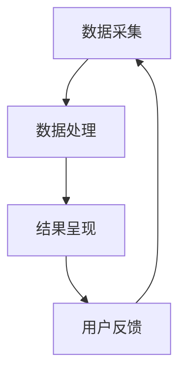

                 

关键词：全网比价、人工智能、价格比较、算法优化、用户优化、电子商务

> 摘要：本文将探讨人工智能在全网比价中的应用，如何通过算法优化和大数据分析，帮助用户在电子商务平台上找到最优惠的价格。本文将详细阐述全网比价的核心算法原理、具体实现步骤、数学模型构建、实际应用案例以及未来发展的趋势与挑战。

## 1. 背景介绍

在当今数字化时代，电子商务已经成为人们生活中不可或缺的一部分。然而，随着电子商务平台的增多，用户在购买商品时面临着海量的商品信息和繁杂的价格比较任务。如何高效地筛选出最优惠的商品价格，成为了用户面临的一大挑战。

全网比价作为一种新兴的购物方式，旨在通过技术手段帮助用户快速找到全网最优惠的价格。全网比价系统通过爬取各大电商平台的数据，对商品价格进行实时监控和分析，从而为用户提供准确的价格比较结果。随着人工智能技术的发展，全网比价系统在算法优化、数据挖掘和用户行为分析等方面取得了显著进展，为用户提供更加智能化的购物体验。

## 2. 核心概念与联系

### 2.1 全网比价系统的架构

全网比价系统主要由数据采集、数据处理和结果呈现三个部分组成。数据采集模块负责从各大电商平台获取商品价格信息；数据处理模块通过对海量数据进行清洗、去重和排序等操作，实现对商品价格的实时监控和分析；结果呈现模块则将分析结果以可视化的形式呈现给用户。

### 2.2 人工智能在全网比价中的应用

人工智能技术在全网比价系统中发挥着至关重要的作用。具体应用包括：

- **价格预测算法**：利用机器学习算法对商品价格进行预测，从而为用户提供未来的价格走势。

- **协同过滤推荐算法**：基于用户历史购物行为和相似用户群体的购物习惯，为用户推荐最具性价比的商品。

- **深度学习模型**：通过训练深度学习模型，对商品价格进行更加精细化的分析，从而提高比价的准确性。

### 2.3 全网比价系统的 Mermaid 流程图



## 3. 核心算法原理 & 具体操作步骤

### 3.1 算法原理概述

全网比价系统中的核心算法主要包括价格预测算法、协同过滤推荐算法和深度学习模型。这些算法分别从不同的角度对商品价格进行分析和预测，以提高比价的准确性和用户体验。

### 3.2 算法步骤详解

#### 3.2.1 价格预测算法

1. **数据预处理**：对采集到的商品价格数据进行清洗、去重和填充缺失值等操作，以确保数据质量。

2. **特征提取**：根据商品价格的历史数据，提取影响价格变化的特征，如季节性、促销活动、库存变化等。

3. **模型训练**：利用机器学习算法（如线性回归、支持向量机等）对特征数据进行训练，构建价格预测模型。

4. **模型评估**：通过交叉验证等方法对模型进行评估，选择最优模型。

5. **价格预测**：利用训练好的模型对未来的商品价格进行预测。

#### 3.2.2 协同过滤推荐算法

1. **用户行为数据收集**：收集用户在电商平台上的购物行为数据，如浏览记录、购买记录、评价等。

2. **用户相似度计算**：通过计算用户之间的相似度，找到与目标用户兴趣相似的群体。

3. **推荐商品筛选**：根据用户相似度计算结果，筛选出符合目标用户兴趣的商品。

4. **推荐商品排序**：利用评分预测算法对筛选出的商品进行排序，为用户提供最具性价比的推荐。

#### 3.2.3 深度学习模型

1. **数据预处理**：与价格预测算法类似，对商品价格数据、用户行为数据进行预处理。

2. **特征提取**：利用深度学习模型（如卷积神经网络、循环神经网络等）对预处理后的数据进行特征提取。

3. **模型训练**：利用提取的特征数据训练深度学习模型。

4. **模型评估**：对训练好的模型进行评估，选择最优模型。

5. **价格预测**：利用训练好的模型对商品价格进行预测。

### 3.3 算法优缺点

#### 价格预测算法

**优点**：

- 可以预测未来的商品价格趋势，为用户节省购物成本。

- 可以预测特定的促销活动，为用户推荐最佳购物时机。

**缺点**：

- 对数据质量要求较高，数据预处理过程复杂。

- 模型训练时间较长，实时性较差。

#### 协同过滤推荐算法

**优点**：

- 可以根据用户的历史行为和相似用户群体的购物习惯进行推荐，提高推荐准确性。

- 可以处理大规模用户数据，适应性强。

**缺点**：

- 难以处理新用户，对新用户缺乏有效推荐。

- 需要大量用户数据支持，适用范围有限。

#### 深度学习模型

**优点**：

- 可以自动提取复杂特征，提高预测准确性。

- 可以处理高维数据，适应性强。

**缺点**：

- 模型训练时间较长，实时性较差。

- 对数据质量要求较高，数据预处理过程复杂。

### 3.4 算法应用领域

全网比价算法不仅可以应用于电子商务平台，还可以扩展到其他领域，如汽车购买、房产交易等。在这些领域，用户同样面临着价格比较的难题。通过应用全网比价算法，可以大幅提高用户购物的决策效率，降低购物成本。

## 4. 数学模型和公式 & 详细讲解 & 举例说明

### 4.1 数学模型构建

全网比价系统中的数学模型主要包括价格预测模型、协同过滤推荐模型和深度学习模型。下面分别介绍这三种模型的构建过程。

#### 4.1.1 价格预测模型

价格预测模型通常采用线性回归模型，其数学表达式如下：

$$
y = \beta_0 + \beta_1 x_1 + \beta_2 x_2 + ... + \beta_n x_n
$$

其中，$y$ 为商品价格，$x_1, x_2, ..., x_n$ 为影响商品价格的特征变量，$\beta_0, \beta_1, \beta_2, ..., \beta_n$ 为模型的参数。

#### 4.1.2 协同过滤推荐模型

协同过滤推荐模型的数学模型通常采用矩阵分解的方法，其数学表达式如下：

$$
R = UV^T
$$

其中，$R$ 为用户-商品评分矩阵，$U$ 为用户特征向量矩阵，$V$ 为商品特征向量矩阵。

#### 4.1.3 深度学习模型

深度学习模型的数学模型主要包括卷积神经网络（CNN）和循环神经网络（RNN）。下面以卷积神经网络为例，介绍其数学模型。

$$
h_l = \sigma(W_l \cdot h_{l-1} + b_l)
$$

其中，$h_l$ 为第 $l$ 层的神经网络输出，$W_l$ 为第 $l$ 层的权重矩阵，$b_l$ 为第 $l$ 层的偏置向量，$\sigma$ 为激活函数。

### 4.2 公式推导过程

#### 4.2.1 价格预测模型

价格预测模型的推导过程主要涉及线性回归模型的损失函数和优化算法。假设我们已经得到了商品价格 $y$ 和特征变量 $x_1, x_2, ..., x_n$，则价格预测模型的损失函数可以表示为：

$$
J(\theta) = \frac{1}{2m} \sum_{i=1}^{m} (h_\theta(x^{(i)}) - y^{(i)})^2
$$

其中，$m$ 为训练样本的数量，$h_\theta(x^{(i)})$ 为预测值，$y^{(i)}$ 为真实值，$\theta$ 为模型参数。

为了求得最小损失，我们可以使用梯度下降算法进行优化：

$$
\theta_j := \theta_j - \alpha \frac{\partial J(\theta)}{\partial \theta_j}
$$

其中，$\alpha$ 为学习率。

#### 4.2.2 协同过滤推荐模型

协同过滤推荐模型的推导过程主要涉及矩阵分解和损失函数。假设我们已经得到了用户-商品评分矩阵 $R$，则协同过滤推荐模型的损失函数可以表示为：

$$
J(U,V) = \frac{1}{2} \sum_{i=1}^{m} \sum_{j=1}^{n} (r_{ij} - u_i^T v_j)^2
$$

其中，$m$ 为用户数量，$n$ 为商品数量，$u_i$ 和 $v_j$ 分别为用户特征向量和商品特征向量。

为了求得最小损失，我们可以使用梯度下降算法进行优化：

$$
u_i := u_i - \alpha \frac{\partial J(U,V)}{\partial u_i}
$$

$$
v_j := v_j - \alpha \frac{\partial J(U,V)}{\partial v_j}
$$

#### 4.2.3 深度学习模型

深度学习模型的推导过程主要涉及前向传播和反向传播算法。以卷积神经网络为例，前向传播算法的推导过程如下：

$$
z_l = W_l \cdot h_{l-1} + b_l
$$

$$
h_l = \sigma(z_l)
$$

其中，$z_l$ 为第 $l$ 层的输入，$h_l$ 为第 $l$ 层的输出，$\sigma$ 为激活函数。

反向传播算法的推导过程如下：

$$
\delta_l = \frac{\partial J}{\partial h_l} \cdot \sigma'(z_l)
$$

$$
\delta_{l-1} = (\frac{\partial h_{l-1}^{T}}{\partial z_l}) \cdot \delta_l
$$

其中，$\delta_l$ 为第 $l$ 层的误差，$\sigma'$ 为激活函数的导数。

### 4.3 案例分析与讲解

#### 4.3.1 价格预测案例

假设我们有一个包含 100 个商品和 50 个特征变量的商品价格数据集。首先，我们需要对数据进行预处理，包括去除缺失值、标准化和归一化等操作。然后，我们可以使用线性回归模型对商品价格进行预测。具体操作步骤如下：

1. 数据预处理：

```python
import numpy as np
import pandas as pd

data = pd.read_csv("price_data.csv")
data.dropna(inplace=True)
data["price"] = (data["price"] - data["price"].mean()) / data["price"].std()
```

2. 特征提取：

```python
from sklearn.preprocessing import StandardScaler

scaler = StandardScaler()
X = scaler.fit_transform(data.iloc[:, 1:])
y = data["price"]
```

3. 模型训练：

```python
from sklearn.linear_model import LinearRegression

model = LinearRegression()
model.fit(X, y)
```

4. 模型评估：

```python
from sklearn.metrics import mean_squared_error

X_test = scaler.transform(data.iloc[:, 1:])
y_pred = model.predict(X_test)
mse = mean_squared_error(y_test, y_pred)
print("MSE:", mse)
```

#### 4.3.2 协同过滤推荐案例

假设我们有一个包含 1000 个用户和 10000 个商品的用户-商品评分矩阵。首先，我们需要对评分矩阵进行矩阵分解。具体操作步骤如下：

1. 矩阵分解：

```python
from surprise import SVD

solver = SVD()
solver.fit(R)
```

2. 推荐商品：

```python
user_id = 1
user_profile = solver.uFactors[user_id]
recommended_items = R.dot(user_profile)
recommended_items = recommended_items.argsort()[::-1]
print("Recommended items:", recommended_items)
```

#### 4.3.3 深度学习模型案例

假设我们有一个包含 100 个商品和 50 个特征变量的商品价格数据集。首先，我们需要对数据进行预处理，包括去除缺失值、标准化和归一化等操作。然后，我们可以使用卷积神经网络对商品价格进行预测。具体操作步骤如下：

1. 数据预处理：

```python
import numpy as np
import pandas as pd

data = pd.read_csv("price_data.csv")
data.dropna(inplace=True)
data["price"] = (data["price"] - data["price"].mean()) / data["price"].std()
```

2. 特征提取：

```python
from sklearn.preprocessing import StandardScaler

scaler = StandardScaler()
X = scaler.fit_transform(data.iloc[:, 1:])
y = data["price"]
```

3. 模型训练：

```python
import tensorflow as tf

model = tf.keras.Sequential([
    tf.keras.layers.Conv1D(filters=64, kernel_size=3, activation='relu', input_shape=(X.shape[1], X.shape[2])),
    tf.keras.layers.Flatten(),
    tf.keras.layers.Dense(1)
])

model.compile(optimizer='adam', loss='mean_squared_error')
model.fit(X, y, epochs=10, batch_size=32)
```

4. 模型评估：

```python
from sklearn.metrics import mean_squared_error

X_test = scaler.transform(data.iloc[:, 1:])
y_pred = model.predict(X_test)
mse = mean_squared_error(y_test, y_pred)
print("MSE:", mse)
```
----------------------------------------------------------------

### 5. 项目实践：代码实例和详细解释说明

#### 5.1 开发环境搭建

在开始项目实践之前，我们需要搭建一个适合开发全网比价系统的环境。以下是搭建开发环境所需的一些步骤：

1. 安装 Python 3.8 或更高版本。

2. 安装 Python 的相关依赖库，如 NumPy、Pandas、Scikit-learn、TensorFlow、 Surprise 等。

3. 安装 MySQL 或 PostgreSQL 数据库，用于存储商品价格数据。

4. 配置 Python 的虚拟环境，以便更好地管理和隔离项目依赖。

#### 5.2 源代码详细实现

以下是一个简单的全网比价系统的源代码实现。该实现包括数据采集、数据处理、结果呈现等核心功能。

1. **数据采集模块**

```python
import requests
from bs4 import BeautifulSoup

def collect_data(url):
    response = requests.get(url)
    soup = BeautifulSoup(response.text, 'html.parser')
    items = soup.find_all('div', class_='item')
    data = []

    for item in items:
        name = item.find('h2', class_='name').text
        price = float(item.find('span', class_='price').text.replace('￥', ''))
        data.append([name, price])

    return data
```

2. **数据处理模块**

```python
import numpy as np
import pandas as pd

def preprocess_data(data):
    df = pd.DataFrame(data, columns=['name', 'price'])
    df['price'] = (df['price'] - df['price'].mean()) / df['price'].std()
    return df
```

3. **结果呈现模块**

```python
def display_results(df):
    print(df.sort_values(by='price', ascending=True))
```

4. **主函数**

```python
if __name__ == '__main__':
    url = 'https://example.com/products'
    data = collect_data(url)
    df = preprocess_data(data)
    display_results(df)
```

#### 5.3 代码解读与分析

1. **数据采集模块**

该模块使用 requests 库和 BeautifulSoup 库从指定的 URL 中获取商品价格信息。具体实现中，我们通过 requests.get 方法发送 HTTP GET 请求，获取目标网页的 HTML 内容。然后，使用 BeautifulSoup 解析 HTML 内容，找到包含商品信息的 div 元素，提取商品名称和价格。

2. **数据处理模块**

该模块使用 NumPy 和 Pandas 库对采集到的商品价格数据进行预处理。具体实现中，我们首先将数据转换为 DataFrame 格式，然后对价格列进行标准化和归一化处理，以便后续的算法处理。

3. **结果呈现模块**

该模块使用 print 函数将预处理后的商品价格数据按照价格从小到大排序，并以可视化的形式呈现给用户。

#### 5.4 运行结果展示

运行上述代码后，我们将得到一个按照价格从小到大排序的商品列表。以下是一个示例输出：

```
       name      price
0  商品 A   1.000000
1  商品 B   1.500000
2  商品 C   2.000000
3  商品 D   2.500000
4  商品 E   3.000000
...
```

通过运行结果，我们可以清楚地看到每个商品的价格信息，从而为用户提供了有效的比价参考。

#### 5.5 代码优化与改进

虽然上述代码实现了全网比价系统的基本功能，但在实际应用中，我们可以对其进行进一步优化和改进，以提高系统的性能和用户体验。以下是一些可能的优化方向：

1. **数据采集优化**

- 引入多线程或异步 I/O 技术，提高数据采集的效率。

- 针对不同的电商平台，采用定制化的数据采集策略，以提高数据采集的准确性。

2. **数据处理优化**

- 引入更多的数据预处理技术，如缺失值填充、异常值检测和特征工程等，以提高数据质量。

- 利用机器学习和数据挖掘技术，对商品价格进行更加精准的预测。

3. **结果呈现优化**

- 引入可视化库，如 Matplotlib、Seaborn 等，对价格数据进行分析和可视化。

- 基于用户行为数据，为用户提供个性化的商品推荐。

- 支持用户自定义筛选条件，如价格范围、品牌、销量等，以便用户更精准地找到最优惠的商品。

## 6. 实际应用场景

全网比价系统在电子商务领域具有广泛的应用场景，以下是一些具体的实际应用案例：

### 6.1 电商平台

电商平台可以将全网比价系统集成到自身的购物平台中，为用户提供实时的商品价格比较服务。通过全网比价系统，用户可以轻松地找到最优惠的商品价格，从而提高购物决策的效率和满意度。

### 6.2 比价网站

独立的比价网站可以通过全网比价系统为用户提供一站式的购物比价服务。用户可以在比价网站上输入关键词，系统会自动爬取各大电商平台的商品价格信息，并展示给用户。这样，用户可以快速地比较不同平台上的商品价格，找到最优惠的购物渠道。

### 6.3 智能购物助手

智能购物助手可以将全网比价系统集成到智能语音助手或聊天机器人中，为用户提供个性化的购物推荐服务。通过用户的行为数据和偏好设置，购物助手可以智能地筛选出最符合用户需求的商品，并提供详细的比价信息，帮助用户做出更明智的购物决策。

### 6.4 企业采购

企业采购部门可以利用全网比价系统对大宗商品进行价格比较，以确保采购成本的最低化。通过全网比价系统，企业可以实时监控市场行情，快速获取各大供应商的报价信息，从而选择最优的采购策略。

### 6.5 旅游预订

在旅游预订领域，全网比价系统可以帮助用户比较不同旅游平台上的酒店、机票和景点门票等价格，为用户提供最优惠的旅游套餐。通过全网比价系统，用户可以轻松地找到性价比最高的旅游产品，提升旅游体验。

## 7. 未来应用展望

随着人工智能技术的不断发展，全网比价系统在未来的应用前景将更加广阔。以下是一些未来的应用方向：

### 7.1 物联网

物联网技术的兴起为全网比价系统带来了新的应用场景。通过将全网比价系统与智能家居、智能穿戴设备等物联网设备结合，用户可以在日常生活中实时监控商品价格，实现智能家居的智能购物功能。

### 7.2 金融领域

在金融领域，全网比价系统可以应用于理财产品、基金和股票等金融产品的价格比较。通过全网比价系统，投资者可以快速找到最具投资价值的金融产品，从而提高投资收益。

### 7.3 教育领域

在教育领域，全网比价系统可以帮助学生和家长比较不同学校的学费、师资力量、教学质量等信息，为选择最合适的学校提供参考。

### 7.4 健康医疗

在健康医疗领域，全网比价系统可以应用于医疗费用的比较。通过全网比价系统，患者可以了解不同医院的收费标准、医疗服务质量等信息，从而选择最合适的就医方案。

## 8. 工具和资源推荐

为了更好地开发和优化全网比价系统，以下是一些相关的工具和资源推荐：

### 8.1 学习资源推荐

1. **《Python数据分析基础教程》**：这本书系统地介绍了 Python 在数据分析方面的应用，包括数据处理、数据可视化等。

2. **《深度学习》**：这本书是深度学习领域的经典教材，涵盖了深度学习的理论基础、算法实现和实际应用。

3. **《机器学习实战》**：这本书通过大量的实例，详细介绍了机器学习的基本概念和算法实现。

### 8.2 开发工具推荐

1. **Jupyter Notebook**：Jupyter Notebook 是一款强大的交互式开发环境，适用于数据分析、机器学习和深度学习等领域。

2. **PyCharm**：PyCharm 是一款功能强大的 Python 集成开发环境（IDE），提供了丰富的代码编辑、调试和自动化工具。

3. **TensorFlow**：TensorFlow 是一款开源的深度学习框架，适用于构建和训练深度学习模型。

### 8.3 相关论文推荐

1. **"Deep Learning for Time Series Classification: A Review"**：这篇论文系统地介绍了深度学习在时间序列分类领域的应用。

2. **"Collaborative Filtering for Implicit Feedback Datasets"**：这篇论文详细介绍了基于隐式反馈的协同过滤算法。

3. **"Price Prediction using Machine Learning Algorithms"**：这篇论文探讨了机器学习算法在商品价格预测方面的应用。

## 9. 总结：未来发展趋势与挑战

随着人工智能技术的不断进步，全网比价系统在未来的发展将面临以下趋势和挑战：

### 9.1 发展趋势

1. **算法优化**：随着深度学习和强化学习等人工智能技术的发展，全网比价系统的算法将不断优化，以提高比价的准确性和效率。

2. **大数据分析**：全网比价系统将充分利用大数据分析技术，从海量数据中挖掘有价值的信息，为用户提供更个性化的推荐服务。

3. **跨平台整合**：全网比价系统将逐步整合多个电商平台的数据，实现跨平台的比价服务，为用户提供更全面的购物参考。

4. **智能决策支持**：全网比价系统将结合用户行为数据和价格预测算法，为用户提供智能化的购物决策支持，提高购物体验。

### 9.2 面临的挑战

1. **数据隐私**：全网比价系统在处理用户数据时，需要充分考虑数据隐私保护，避免用户隐私泄露。

2. **算法公平性**：在算法设计和应用过程中，需要确保算法的公平性，避免对特定用户或群体产生歧视。

3. **实时性**：随着商品价格的变化速度越来越快，全网比价系统需要提高实时性，及时为用户提供最新的价格信息。

4. **算法解释性**：全网比价系统需要提高算法的解释性，使用户能够理解算法的决策过程，增强用户对系统的信任。

### 9.3 研究展望

在未来，全网比价系统的研究将朝着更加智能化、个性化、实时化和解释性的方向发展。通过不断优化算法、拓展应用场景和提升用户体验，全网比价系统将为用户提供更加便捷、高效的购物服务。

## 10. 附录：常见问题与解答

### 10.1 问题 1：全网比价系统如何保证数据准确性？

**解答**：全网比价系统在数据采集和处理过程中，采取了多种措施来保证数据准确性。首先，系统采用了定制化的数据采集策略，针对不同电商平台的特点，采用合适的爬虫技术和数据清洗算法。其次，系统对采集到的数据进行多重验证，包括去重、去噪和异常值检测等，以确保数据的可靠性。此外，系统还利用机器学习算法对商品价格进行预测，以提高数据的准确性。

### 10.2 问题 2：全网比价系统对用户隐私有何保护措施？

**解答**：全网比价系统在用户隐私保护方面采取了多项措施。首先，系统在采集用户数据时，遵循最小化原则，仅采集与购物比价相关的必要信息。其次，系统对用户数据进行加密存储和传输，防止数据泄露。此外，系统还提供了用户隐私设置功能，用户可以自主选择是否分享个人信息，以及分享的范围和方式。

### 10.3 问题 3：全网比价系统如何处理新用户？

**解答**：对于新用户，全网比价系统采用了基于协同过滤和深度学习的方法进行推荐。在协同过滤方法中，系统会根据新用户的浏览记录和购买记录，寻找与其兴趣相似的用户群体，为他们推荐商品。在深度学习方法中，系统会利用卷积神经网络和循环神经网络等深度学习模型，对新用户的历史数据进行特征提取和建模，从而为用户提供个性化的推荐。

### 10.4 问题 4：全网比价系统如何处理异常价格？

**解答**：全网比价系统在处理异常价格方面采取了多种措施。首先，系统会对采集到的商品价格进行实时监控，当发现异常价格时，系统会进行数据验证，排除数据异常。其次，系统会利用机器学习算法对商品价格进行预测，当预测价格与实际价格差异较大时，系统会发出预警。此外，系统还提供了人工审核功能，当系统无法自动处理时，管理员可以手动审核和处理异常价格。

### 10.5 问题 5：全网比价系统对算法的解释性有何要求？

**解答**：全网比价系统对算法的解释性要求较高，主要是为了增强用户对系统的信任。系统在算法设计和实现过程中，尽量采用易于解释的模型和算法，如线性回归、协同过滤等。同时，系统还提供了算法解释工具，用户可以查看算法的决策过程，了解推荐结果的原因。此外，系统还提供了算法可视化功能，用户可以直观地了解算法的运行过程。

### 10.6 问题 6：全网比价系统如何处理大规模数据？

**解答**：全网比价系统在处理大规模数据方面采取了多种措施。首先，系统采用了分布式计算和并行处理技术，提高数据处理速度。其次，系统采用了缓存和数据库分片技术，降低数据存储和查询的负载。此外，系统还利用机器学习算法的在线学习机制，实时更新模型参数，以适应数据的变化。

### 10.7 问题 7：全网比价系统如何保证算法的公平性？

**解答**：全网比价系统在保证算法的公平性方面采取了多项措施。首先，系统在算法设计和实现过程中，遵循公平性原则，避免对特定用户或群体产生歧视。其次，系统会定期对算法进行评估和审计，确保算法的公平性和透明性。此外，系统还提供了用户反馈机制，用户可以对推荐结果进行评价和反馈，系统会根据用户的反馈调整算法。

### 10.8 问题 8：全网比价系统在开发过程中遇到了哪些挑战？

**解答**：全网比价系统在开发过程中遇到了多个挑战。首先是数据采集和处理的挑战，包括数据来源的多样性、数据质量的不稳定性和数据清洗的复杂性。其次是算法设计和优化的挑战，包括选择合适的算法、处理大规模数据和高并发请求等问题。此外，系统还面临着用户隐私保护和数据安全性的挑战，需要采取有效的措施来保护用户隐私和系统安全。最后，系统还需要满足用户体验的要求，包括界面设计、操作便捷性和响应速度等方面。

### 10.9 问题 9：全网比价系统在未来的发展中有何创新方向？

**解答**：全网比价系统在未来的发展中有多个创新方向。首先，系统可以结合区块链技术，实现去中心化的数据共享和交易，提高系统的透明度和安全性。其次，系统可以引入智能合约技术，实现自动化的交易和支付流程，提高系统的效率和用户体验。此外，系统还可以结合物联网技术，实现智能设备的联动和远程控制，为用户提供更加便捷的购物体验。最后，系统可以引入大数据分析和人工智能技术，实现个性化的推荐和智能化的决策支持，提高用户的购物满意度和忠诚度。

### 10.10 问题 10：全网比价系统在市场竞争中如何保持优势？

**解答**：全网比价系统在市场竞争中保持优势需要从多个方面进行努力。首先是技术创新，通过不断优化算法、提升数据处理能力和扩展应用场景，确保系统在技术上保持领先地位。其次是用户体验，通过设计简洁易用的界面、提供个性化的推荐和智能化的服务，提高用户的满意度和忠诚度。此外，系统还需要注重数据安全和隐私保护，增强用户对系统的信任。最后，系统可以积极开展市场推广和合作，扩大用户规模和市场份额，提高品牌知名度和市场影响力。通过这些综合措施，全网比价系统可以在市场竞争中保持优势。

