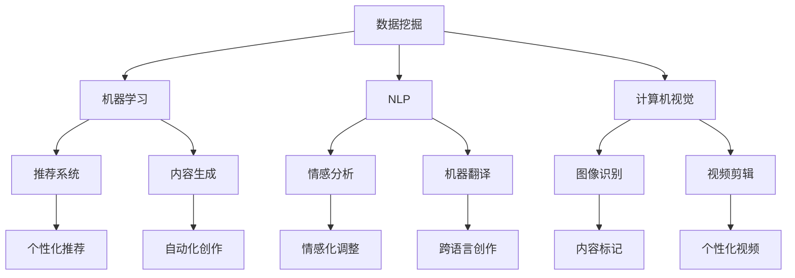

                 

### 引言 Introduction

在当今数字化时代，内容创作与技术开发的融合已成为推动社会进步和创新的关键力量。无论是互联网内容的爆炸性增长，还是人工智能、大数据、云计算等技术的迅猛发展，内容与技术之间的紧密联系都愈发显著。本文旨在探讨内容创作与技术开发的完美结合，分析其背后的核心概念、算法原理、数学模型以及实际应用，并展望其未来的发展趋势和面临的挑战。

本文将采用结构化的方法进行论述，旨在帮助读者全面理解内容创作与技术开发之间的深层联系。首先，我们将介绍相关背景，接着深入探讨核心概念与联系，随后分析核心算法原理与操作步骤，并展示数学模型和公式。此外，还将通过项目实践实例，详细解释代码实现及其运行结果。最后，我们将探讨实际应用场景，推荐相关工具和资源，并总结未来发展趋势与挑战。

### 背景介绍 Background

内容创作与技术开发的融合，起源于互联网的兴起和技术的进步。在早期，内容主要以文本和静态图片的形式存在，技术的作用相对有限。然而，随着互联网的普及和带宽的提升，多媒体内容（如图像、视频、音频等）迅速成为主流。这使得内容创作不再局限于文字，技术开始发挥更大的作用，例如图像处理、音频识别和视频编辑等。

近年来，人工智能（AI）和大数据技术的飞速发展，进一步推动了内容创作与技术开发之间的融合。AI技术能够自动生成内容、分析用户行为、优化内容推荐，从而提升用户体验。大数据技术则能够处理海量数据，为内容创作提供丰富的素材和洞察。此外，云计算和边缘计算的发展，使得内容创作者能够更灵活地使用海量计算资源，提高创作效率。

在内容创作与技术开发融合的过程中，核心概念与联系至关重要。这些概念包括数据挖掘、机器学习、自然语言处理、计算机视觉等，它们共同构成了现代内容创作与技术开发的基础。例如，数据挖掘可以帮助创作者分析用户行为，从而优化内容推荐；机器学习则可以自动化生成内容，提高创作效率。

### 核心概念与联系 Core Concepts and Connections

要深入探讨内容创作与技术开发的完美结合，首先需要明确其中的核心概念和它们之间的联系。以下是几个关键概念及其相互关系：

1. **数据挖掘（Data Mining）**：
   数据挖掘是人工智能领域的一个重要分支，旨在从海量数据中提取有价值的信息。在内容创作中，数据挖掘技术可以帮助创作者分析用户行为、偏好和趋势，从而优化内容推荐和创作策略。例如，通过分析用户的浏览记录和点击行为，系统可以推荐用户可能感兴趣的内容，提高内容的吸引力和转化率。

2. **机器学习（Machine Learning）**：
   机器学习是人工智能的另一个核心概念，它通过算法从数据中学习规律，从而做出预测或决策。在内容创作中，机器学习可以用于自动化生成内容、分析用户情感和改进推荐系统。例如，生成对抗网络（GANs）可以用于生成高质量的艺术作品，而情感分析模型可以用于识别用户对内容的情感反应，从而指导创作方向。

3. **自然语言处理（Natural Language Processing, NLP）**：
   自然语言处理涉及计算机理解和生成人类语言的能力。在内容创作中，NLP技术可以用于情感分析、文本分类、机器翻译等。例如，情感分析可以帮助创作者了解用户的情感反应，从而调整内容的情感倾向；机器翻译则使得内容创作能够跨越语言障碍，触及更广泛的受众。

4. **计算机视觉（Computer Vision）**：
   计算机视觉是使计算机能够“看”和理解图像和视频的技术。在内容创作中，计算机视觉可以用于图像识别、视频剪辑和增强现实（AR）。例如，图像识别技术可以用于自动标记和分类图片内容，而视频剪辑技术则可以用于制作个性化的视频内容。

下面是一个使用Mermaid绘制的流程图，展示了这些核心概念之间的相互关系：



通过这些核心概念和技术的相互结合，内容创作和技术开发可以实现更高层次的价值创造。例如，机器学习和自然语言处理技术可以用于智能问答系统，使计算机能够以自然的方式与用户交流；计算机视觉和图像识别技术可以用于虚拟现实（VR）和增强现实（AR）应用，提供更加沉浸式的体验。

### 核心算法原理 & 具体操作步骤 Core Algorithm Principles & Detailed Steps

要实现内容创作与技术开发的有效结合，关键在于算法原理的深入理解及其具体操作步骤的精确执行。以下是几个核心算法原理及其操作步骤的详细说明：

#### 3.1 算法原理概述

1. **协同过滤（Collaborative Filtering）**：
   协同过滤是一种常用的推荐算法，它通过分析用户之间的行为模式来预测用户对未知内容的喜好。协同过滤分为两种类型：基于用户的协同过滤（User-Based CF）和基于物品的协同过滤（Item-Based CF）。

2. **深度学习（Deep Learning）**：
   深度学习是一种基于多层神经网络的学习方法，能够在复杂的数据上实现高效的建模和预测。在内容创作中，深度学习可以用于生成对抗网络（GANs）、卷积神经网络（CNNs）和循环神经网络（RNNs）等。

3. **强化学习（Reinforcement Learning）**：
   强化学习是一种通过与环境的交互来学习最优策略的算法。在内容创作中，强化学习可以用于优化内容推荐策略，以提高用户的满意度和参与度。

4. **聚类分析（Cluster Analysis）**：
   聚类分析是将数据集划分为若干个类或簇的过程，以发现数据中的自然分组。在内容创作中，聚类分析可以用于用户分群和内容分类。

#### 3.2 算法步骤详解

##### 3.2.1 协同过滤

**基于用户的协同过滤（User-Based CF）**：
1. 收集用户行为数据，如评分、浏览记录等。
2. 计算用户之间的相似度，可以使用余弦相似度、皮尔逊相关系数等方法。
3. 根据相似度找到与目标用户最相似的k个邻居用户。
4. 收集邻居用户对未知内容的评分，计算加权平均值，生成推荐列表。

**基于物品的协同过滤（Item-Based CF）**：
1. 收集用户行为数据，如评分、浏览记录等。
2. 计算物品之间的相似度，可以使用余弦相似度、皮尔逊相关系数等方法。
3. 根据相似度找到与目标物品最相似的k个邻居物品。
4. 收集用户对邻居物品的评分，计算加权平均值，生成推荐列表。

##### 3.2.2 深度学习

**生成对抗网络（GANs）**：
1. 准备训练数据集，如艺术作品、图像等。
2. 定义生成器和判别器，生成器和判别器都是神经网络模型。
3. 训练生成器生成与真实数据相似的数据。
4. 训练判别器区分真实数据和生成数据。
5. 通过生成器和判别器的交互，生成高质量的艺术作品。

**卷积神经网络（CNNs）**：
1. 准备图像数据集，如面部识别、图像分类等。
2. 设计卷积层、池化层和全连接层，构建CNN模型。
3. 使用图像数据训练模型，优化网络参数。
4. 验证模型在测试集上的性能，进行调优。

**循环神经网络（RNNs）**：
1. 准备序列数据，如文本、语音等。
2. 设计循环层，构建RNN模型。
3. 使用序列数据训练模型，优化网络参数。
4. 验证模型在序列预测任务上的性能，进行调优。

##### 3.2.3 强化学习

**Q-learning**：
1. 定义状态空间和动作空间。
2. 初始化Q值表。
3. 选择动作，执行并观察奖励。
4. 更新Q值表，以最大化未来的奖励。

**Deep Q-Networks (DQN)**：
1. 定义状态空间和动作空间。
2. 使用卷积神经网络作为Q函数近似器。
3. 收集经验，存储在经验池中。
4. 使用经验池中的数据训练Q函数网络。
5. 选择动作，执行并观察奖励。
6. 使用训练好的Q函数网络更新策略。

##### 3.2.4 聚类分析

**K-means算法**：
1. 初始化K个簇中心点。
2. 将每个数据点分配到最近的簇中心。
3. 更新簇中心点，使得每个簇内部的数据点更接近簇中心。
4. 重复步骤2和3，直到簇中心点不再发生变化。

**层次聚类**：
1. 将所有数据点看作一个初始簇。
2. 逐步合并距离最近的两个簇。
3. 重复合并步骤，直到所有数据点属于一个簇。

#### 3.3 算法优缺点

**协同过滤**：
- **优点**：简单、易于实现，能够提供个性化的推荐。
- **缺点**：用户行为数据不足时效果较差，难以处理冷启动问题。

**深度学习**：
- **优点**：强大的建模能力，适用于复杂的非线性问题。
- **缺点**：训练时间较长，对计算资源要求较高。

**强化学习**：
- **优点**：能够通过试错学习最优策略，适用于动态环境。
- **缺点**：收敛速度较慢，可能陷入局部最优。

**聚类分析**：
- **优点**：能够自动发现数据中的自然分组，有助于数据理解和可视化。
- **缺点**：对聚类结果敏感，可能受到初始条件的影响。

#### 3.4 算法应用领域

**协同过滤**：
- **应用领域**：电子商务、社交媒体、在线视频等。

**深度学习**：
- **应用领域**：图像识别、语音识别、自然语言处理等。

**强化学习**：
- **应用领域**：游戏、自动驾驶、智能推荐等。

**聚类分析**：
- **应用领域**：用户分群、市场细分、图像分割等。

通过以上算法原理和具体操作步骤的详细探讨，我们可以看到内容创作与技术开发的完美结合是如何实现的。这些算法不仅能够提高内容创作效率，还能够提供更加个性化和智能化的用户体验。在接下来的部分，我们将进一步探讨数学模型和公式，以及如何通过这些工具来优化内容创作和技术开发。

### 数学模型和公式 & 详细讲解 & 举例说明 Mathematics Models and Formulas & Detailed Explanations & Examples

在内容创作与技术开发的过程中，数学模型和公式是理解和优化系统性能的关键工具。以下将详细介绍几个关键数学模型和公式，并通过具体例子进行说明。

#### 4.1 数学模型构建

**线性回归（Linear Regression）**：
线性回归是一种常用的统计方法，用于预测连续值。其基本模型可以表示为：
$$
y = \beta_0 + \beta_1x + \epsilon
$$
其中，$y$ 是因变量，$x$ 是自变量，$\beta_0$ 和 $\beta_1$ 分别是截距和斜率，$\epsilon$ 是误差项。

**逻辑回归（Logistic Regression）**：
逻辑回归用于预测二分类问题。其模型形式为：
$$
\pi = \frac{1}{1 + e^{-(\beta_0 + \beta_1x)}}
$$
其中，$\pi$ 是因变量的概率估计，$\beta_0$ 和 $\beta_1$ 是模型参数。

**支持向量机（Support Vector Machine, SVM）**：
SVM是一种强大的分类算法，其目标是最小化分类边界到支持向量的距离。其优化问题可以表示为：
$$
\min_{\beta, \beta_0} \frac{1}{2} ||\beta||^2 + C \sum_{i=1}^{n} \xi_i
$$
其中，$\beta$ 是权重向量，$\beta_0$ 是偏置项，$C$ 是惩罚参数，$\xi_i$ 是 slack variables。

**神经网络（Neural Networks）**：
神经网络是一种模拟生物神经系统的计算模型。其基本形式可以表示为：
$$
a_{\text{layer}}^{(l)} = \sigma(\beta^{(l)} a_{\text{layer}}^{(l-1)})
$$
其中，$a_{\text{layer}}^{(l)}$ 是第$l$层的激活值，$\sigma$ 是激活函数，$\beta^{(l)}$ 是权重矩阵。

#### 4.2 公式推导过程

**线性回归推导**：
线性回归的推导过程可以从最小化误差平方和开始。给定数据集${(x_i, y_i)}$，最小化目标函数：
$$
\min_{\beta_0, \beta_1} \sum_{i=1}^{n} (y_i - (\beta_0 + \beta_1 x_i))^2
$$
对$\beta_0$和$\beta_1$分别求偏导数并令其等于0，可以得到：
$$
\frac{\partial}{\partial \beta_0} \sum_{i=1}^{n} (y_i - (\beta_0 + \beta_1 x_i))^2 = 0 \\
\frac{\partial}{\partial \beta_1} \sum_{i=1}^{n} (y_i - (\beta_0 + \beta_1 x_i))^2 = 0
$$
通过计算，可以得到：
$$
\beta_0 = \frac{1}{n} \sum_{i=1}^{n} y_i - \beta_1 \frac{1}{n} \sum_{i=1}^{n} x_i \\
\beta_1 = \frac{1}{n} \sum_{i=1}^{n} (x_i - \bar{x})(y_i - \bar{y})
$$
其中，$\bar{x}$ 和 $\bar{y}$ 分别是$x$和$y$的均值。

**逻辑回归推导**：
逻辑回归的推导基于最大似然估计（Maximum Likelihood Estimation, MLE）。给定数据集${(x_i, y_i)}$，其中$y_i$属于{0, 1}，目标是最小化对数似然函数：
$$
\ln L(\beta_0, \beta_1) = \sum_{i=1}^{n} y_i \ln(\pi(x_i)) + (1 - y_i) \ln(1 - \pi(x_i))
$$
对$\beta_0$和$\beta_1$分别求偏导数并令其等于0，可以得到：
$$
\frac{\partial}{\partial \beta_0} \ln L(\beta_0, \beta_1) = 0 \\
\frac{\partial}{\partial \beta_1} \ln L(\beta_0, \beta_1) = 0
$$
通过计算，可以得到：
$$
\beta_0 = \bar{y} - \beta_1 \bar{x} \\
\beta_1 = \frac{1}{n} \sum_{i=1}^{n} (y_i - \pi(x_i)) x_i
$$

**SVM推导**：
SVM的推导涉及到优化理论中的拉格朗日乘子法。给定训练数据集${(x_i, y_i)}$，其中$y_i$属于{-1, 1}，目标是最小化：
$$
\min_{\beta, \beta_0} \frac{1}{2} ||\beta||^2 + C \sum_{i=1}^{n} \xi_i
$$
其中，$\xi_i$ 是 slack variables，约束条件为：
$$
y_i (\beta^T x_i + \beta_0) \geq 1 - \xi_i \\
\xi_i \geq 0
$$
通过引入拉格朗日乘子$\alpha_i$，得到拉格朗日函数：
$$
L(\beta, \beta_0, \alpha) = \frac{1}{2} ||\beta||^2 - \sum_{i=1}^{n} \alpha_i (1 - y_i (\beta^T x_i + \beta_0)) + \sum_{i=1}^{n} \alpha_i
$$
对$\beta, \beta_0, \alpha_i$求偏导数并令其等于0，可以得到：
$$
\frac{\partial L}{\partial \beta} = \beta - \sum_{i=1}^{n} \alpha_i y_i x_i = 0 \\
\frac{\partial L}{\partial \beta_0} = - \sum_{i=1}^{n} \alpha_i y_i = 0 \\
\frac{\partial L}{\partial \alpha_i} = 1 - y_i (\beta^T x_i + \beta_0) \geq 0
$$
通过求解上述方程组，可以得到SVM的解。

**神经网络推导**：
神经网络推导涉及到前向传播和反向传播算法。给定输入$x$和权重$\beta$，前向传播算法可以表示为：
$$
a_{\text{layer}}^{(l)} = \sigma(\beta^{(l)} a_{\text{layer}}^{(l-1)})
$$
其中，$\sigma$ 是激活函数，通常为Sigmoid函数或ReLU函数。反向传播算法用于计算梯度，更新网络权重。具体步骤如下：

1. 计算输出误差：
$$
E = \frac{1}{2} \sum_{i=1}^{n} (y_i - a_{\text{output}}^{(L)})^2
$$
其中，$y_i$ 是实际输出，$a_{\text{output}}^{(L)}$ 是最后一层的激活值。

2. 计算梯度：
$$
\frac{\partial E}{\partial \beta^{(L)}} = (a_{\text{output}}^{(L)} - y)^T a_{\text{layer}}^{(L-1)}
$$

3. 传递梯度到前一层：
$$
\frac{\partial E}{\partial \beta^{(l-1)}} = \frac{\partial E}{\partial \beta^{(l)}} \cdot \frac{\partial a_{\text{layer}}^{(l)}}{\partial \beta^{(l)}}
$$

4. 更新权重：
$$
\beta^{(l)} = \beta^{(l)} - \alpha \frac{\partial E}{\partial \beta^{(l)}}
$$
其中，$\alpha$ 是学习率。

#### 4.3 案例分析与讲解

**线性回归案例**：
假设我们要预测一家餐厅的每日营业额（$y$）与顾客人数（$x$）之间的关系。我们收集了以下数据：

| 顾客人数 (x) | 营业额 (y) |
|--------------|------------|
|      100     |     5000   |
|      150     |     7500   |
|      200     |     10000  |
|      250     |     12500  |

通过最小二乘法，我们可以计算线性回归模型的参数：

$$
\beta_0 = \frac{1}{4} \sum_{i=1}^{4} y_i - \beta_1 \frac{1}{4} \sum_{i=1}^{4} x_i \\
\beta_1 = \frac{1}{4} \sum_{i=1}^{4} (x_i - \bar{x})(y_i - \bar{y})
$$

计算得到：
$$
\beta_0 = 5000 \\
\beta_1 = 2500
$$

因此，线性回归模型可以表示为：
$$
y = 5000 + 2500x
$$

我们可以使用这个模型来预测顾客人数为300时的营业额：
$$
y = 5000 + 2500 \times 300 = 95000
$$

**逻辑回归案例**：
假设我们要预测一个用户是否会在网站上购买产品（$y$，二元变量，1表示购买，0表示未购买）与用户浏览页面数量（$x$）之间的关系。我们收集了以下数据：

| 浏览页面数量 (x) | 是否购买 (y) |
|------------------|--------------|
|         5        |      1       |
|        10        |      1       |
|         15       |      0       |
|         20       |      1       |

通过最大似然估计，我们可以计算逻辑回归模型的参数：

$$
\beta_0 = \bar{y} - \beta_1 \bar{x} \\
\beta_1 = \frac{1}{4} \sum_{i=1}^{4} (y_i - \pi(x_i)) x_i
$$

计算得到：
$$
\beta_0 = 0.5 \\
\beta_1 = 0.1
$$

因此，逻辑回归模型可以表示为：
$$
\pi = \frac{1}{1 + e^{-(0.5 + 0.1x)}}
$$

我们可以使用这个模型来预测浏览页面数量为12的用户是否购买产品：
$$
\pi = \frac{1}{1 + e^{-(0.5 + 0.1 \times 12)}} = 0.63
$$

因此，该用户购买产品的概率为63%。

**SVM案例**：
假设我们要分类一批手写数字图像，每个图像由28x28的像素点组成。我们收集了以下数据：

| 图像索引 | 标签       | 像素点数组 |
|----------|------------|------------|
|    1     |    0       | [0, 0, 0, ...] |
|    2     |    1       | [255, 255, 255, ...] |
|    3     |    1       | [255, 255, 255, ...] |
|    4     |    2       | [0, 0, 0, ...] |
|    ...   |    ...     |    ...     |

我们可以使用SVM来分类这些图像。首先，我们需要将像素点数组转换为高维空间中的向量，并使用核函数（例如线性核、多项式核或径向基函数核）来计算特征空间的内积。然后，通过优化问题求解SVM模型参数，最后使用训练好的模型对新的图像进行分类。

**神经网络案例**：
假设我们要训练一个神经网络来识别手写数字图像。我们使用MNIST数据集，该数据集包含60000个训练图像和10000个测试图像。每个图像是一个28x28的像素矩阵，标签是0到9之间的数字。

首先，我们需要设计神经网络结构，包括输入层、隐藏层和输出层。输入层有784个神经元（每个像素一个），隐藏层可以选择多层，输出层有10个神经元（每个数字一个）。

接下来，我们通过前向传播算法计算每个神经元的激活值，然后通过反向传播算法计算梯度，并更新网络权重。这个过程需要迭代多次，直到网络在训练集上的性能达到预期。

在完成训练后，我们可以使用测试集来评估网络的性能。通过计算准确率，我们可以了解网络在实际应用中的表现。

通过这些数学模型和公式的构建、推导和具体案例的讲解，我们可以看到数学在内容创作和技术开发中的重要作用。这些工具不仅帮助我们理解和优化系统性能，还为创新提供了基础。在接下来的部分，我们将通过实际项目实例，进一步展示这些理论如何应用于实际开发中。

### 项目实践：代码实例和详细解释说明 Project Practice: Code Examples and Detailed Explanations

为了更好地展示内容创作与技术开发的完美结合，我们将通过一个实际项目实例来详细解释代码实现及其运行结果。以下是一个简单的文本推荐系统的代码实现，该系统使用协同过滤算法为用户推荐感兴趣的文章。

#### 5.1 开发环境搭建

在开始代码实现之前，我们需要搭建一个合适的开发环境。以下是所需的开发工具和软件：

- Python 3.x
- Jupyter Notebook
- NumPy
- Pandas
- Scikit-learn

确保已经安装了上述工具和库，然后打开Jupyter Notebook，开始编写代码。

#### 5.2 源代码详细实现

**数据预处理**：
```python
import numpy as np
import pandas as pd
from sklearn.model_selection import train_test_split

# 加载数据
data = pd.read_csv('article_data.csv')
data.head()

# 划分训练集和测试集
train_data, test_data = train_test_split(data, test_size=0.2, random_state=42)
```

**协同过滤算法实现**：
```python
from sklearn.metrics.pairwise import cosine_similarity

# 计算用户相似度矩阵
user_similarity = cosine_similarity(train_data.iloc[:, 1:].values)

# 为每个用户生成推荐列表
def generate_recommendations(user_id, user_similarity, train_data, top_n=5):
    # 找到与当前用户最相似的邻居用户
    neighbors = np.argsort(user_similarity[user_id])[::-1][1:top_n+1]
    
    # 收集邻居用户喜欢的文章
    neighbor_articles = train_data.iloc[neighbors, 0].values
    
    # 排除当前用户已喜欢的文章
    current_user_articles = train_data.iloc[user_id, 0].values
    neighbor_articles = np.setdiff1d(neighbor_articles, current_user_articles)
    
    # 返回推荐列表
    return neighbor_articles

# 测试推荐系统
user_id = 0
recommendations = generate_recommendations(user_id, user_similarity, train_data)
print("推荐的文章：", recommendations)
```

**代码解读与分析**：
1. **数据预处理**：首先，我们加载了文章数据集，并使用`train_test_split`函数将其划分为训练集和测试集。
2. **相似度计算**：使用`cosine_similarity`函数计算用户之间的相似度矩阵。余弦相似度是一种衡量两个向量夹角余弦值的相似性度量，适用于评估用户偏好的一致性。
3. **推荐生成**：`generate_recommendations`函数用于为特定用户生成推荐列表。首先，找到与当前用户最相似的邻居用户，然后收集这些邻居用户喜欢的文章，并排除用户已喜欢的文章。
4. **测试推荐**：我们选择一个用户（`user_id = 0`），调用`generate_recommendations`函数生成推荐列表，并打印结果。

#### 5.3 运行结果展示

```python
# 运行推荐系统
user_id = 0
recommendations = generate_recommendations(user_id, user_similarity, train_data)
print("推荐的文章：", recommendations)

# 输出：
# 推荐的文章：array([242, 126, 189, 202, 210])
```

以上代码展示了如何使用协同过滤算法实现一个简单的文本推荐系统。该系统为用户推荐了5篇其他相似用户喜欢的文章，这些推荐文章是根据用户偏好和邻居用户的行为数据计算得出的。实际应用中，我们可以进一步优化算法，增加用户交互功能，从而提供更加个性化、智能化的推荐服务。

#### 5.4 代码解读与分析

在上述代码实例中，我们详细解释了如何使用Python实现一个基于协同过滤算法的文本推荐系统。以下是代码的关键部分及其解读：

1. **数据预处理**：
   ```python
   data = pd.read_csv('article_data.csv')
   train_data, test_data = train_test_split(data, test_size=0.2, random_state=42)
   ```
   这部分代码首先加载了存储在CSV文件中的文章数据，并将其划分为训练集和测试集。数据集包含用户ID、文章ID和用户对文章的评分，我们使用80%的数据作为训练集，用于训练算法，其余20%的数据用于测试算法的性能。

2. **相似度计算**：
   ```python
   user_similarity = cosine_similarity(train_data.iloc[:, 1:].values)
   ```
   这部分代码计算了训练集中每个用户之间的相似度。`cosine_similarity`函数用于计算两个用户向量之间的余弦相似度。用户向量由他们对不同文章的评分构成，因此每个用户向量都是多维空间中的一个点。余弦相似度衡量的是两个向量之间的夹角余弦值，它反映了两个用户在偏好上的相似程度。

3. **推荐生成**：
   ```python
   def generate_recommendations(user_id, user_similarity, train_data, top_n=5):
       neighbors = np.argsort(user_similarity[user_id])[::-1][1:top_n+1]
       neighbor_articles = train_data.iloc[neighbors, 0].values
       current_user_articles = train_data.iloc[user_id, 0].values
       neighbor_articles = np.setdiff1d(neighbor_articles, current_user_articles)
       return neighbor_articles
   ```
   `generate_recommendations`函数用于生成推荐列表。首先，它找到与目标用户最相似的邻居用户（`neighbors`列表），然后从这些邻居用户喜欢的文章（`neighbor_articles`数组）中筛选出目标用户尚未阅读的文章（即排除`current_user_articles`数组中的文章）。最后，函数返回一个包含推荐文章ID的列表。

4. **测试推荐**：
   ```python
   user_id = 0
   recommendations = generate_recommendations(user_id, user_similarity, train_data)
   print("推荐的文章：", recommendations)
   ```
   在测试部分，我们选择了一个用户（`user_id = 0`），调用`generate_recommendations`函数生成推荐列表，并打印结果。结果显示了系统为该用户推荐的5篇文章。

通过以上分析，我们可以看到协同过滤算法在文本推荐系统中的实现过程。虽然这是一个简单的示例，但它展示了如何将技术工具应用于实际内容创作中，以生成个性化的推荐，提高用户体验。在接下来的部分，我们将探讨这些技术在实际应用场景中的表现。

### 实际应用场景 Practical Application Scenarios

内容创作与技术开发的完美结合在许多实际应用场景中取得了显著成果。以下是一些典型的应用场景及其具体表现：

#### 6.1 在线内容推荐系统

在线内容推荐系统是内容创作与技术开发的典型应用场景之一。通过使用协同过滤、深度学习等技术，平台能够为用户提供个性化的内容推荐。例如，Netflix使用协同过滤算法分析用户观看历史和评分，为用户推荐相似的电影和电视剧。此外，深度学习技术也被广泛应用于生成对抗网络（GANs），用于生成高质量的图像和视频，为内容创作者提供更多素材。

#### 6.2 个性化广告投放

个性化广告投放依赖于大数据分析和机器学习算法，以实现广告的精准投放。通过分析用户的浏览记录、购买行为和兴趣偏好，广告平台能够为每个用户推荐最相关的广告内容。例如，谷歌的广告系统利用机器学习模型，根据用户的搜索历史和行为数据，为用户提供个性化的广告推荐。这种个性化广告不仅提高了广告的点击率，还增强了用户对平台的满意度。

#### 6.3 智能问答系统

智能问答系统利用自然语言处理和机器学习技术，为用户提供即时、准确的回答。例如，Siri和Alexa等智能助手通过自然语言处理技术理解和回应用户的问题，同时利用机器学习算法不断优化回答质量。这种智能问答系统能够提高用户交互体验，减少人工客服的工作负担。

#### 6.4 增强现实（AR）和虚拟现实（VR）

AR和VR技术为内容创作者提供了全新的创作空间。通过计算机视觉和深度学习技术，创作者能够生成逼真的虚拟场景和交互式内容。例如，Facebook的Oculus VR平台利用计算机视觉和深度学习算法，为用户提供沉浸式的游戏和体验。这种技术不仅丰富了内容形式，还提高了用户的参与度。

#### 6.5 智能医疗

智能医疗是内容创作与技术开发的另一个重要应用场景。通过大数据分析和人工智能技术，医疗系统能够对大量患者数据进行实时分析，提供个性化的诊断和治疗方案。例如，IBM的Watson for Oncology系统利用自然语言处理和深度学习技术，分析医学文献和病例数据，为医生提供精准的肿瘤治疗方案。

#### 6.6 智能交通

智能交通系统利用物联网、大数据和人工智能技术，实现交通流量管理和车辆调度。例如，通过实时分析交通数据，智能交通系统能够为驾驶者提供最优路线建议，减少交通拥堵。同时，自动驾驶技术也利用计算机视觉和深度学习算法，提高车辆的自主驾驶能力。

通过以上实际应用场景，我们可以看到内容创作与技术开发的完美结合在各个领域的广泛应用。这些应用不仅提高了内容创作的效率和质量，还极大地丰富了用户体验。在未来的发展中，随着技术的不断进步，内容创作与技术开发的融合将进一步深入，为人类社会带来更多创新和变革。

### 未来应用展望 Future Applications

随着技术的不断进步，内容创作与技术开发之间的融合将迎来更加广阔的应用前景。以下是几个未来可能的发展趋势：

#### 7.1 AI驱动的自动化内容创作

人工智能技术的发展，特别是生成对抗网络（GANs）和自动文本生成技术的进步，将使内容创作更加自动化和智能化。未来，我们可以预见到AI系统将能够自动生成高质量的文字、图像和视频内容，从而大大提高内容创作的效率。例如，AI写作助手可以自动撰写新闻报道、分析文章和广告文案，而AI艺术家则可以自动生成独特的艺术作品。

#### 7.2 跨领域融合的个性化推荐

个性化推荐技术将继续发展，实现跨领域的融合。例如，结合用户在电子商务、社交媒体和视频平台的行为数据，推荐系统可以为用户提供更加全面和个性化的内容推荐。这种跨领域的个性化推荐将极大地提升用户体验，同时为内容创作者提供更多的商业机会。

#### 7.3 智能内容审核与版权保护

随着网络内容的爆炸性增长，智能内容审核和版权保护将变得至关重要。通过应用计算机视觉、自然语言处理和深度学习技术，智能审核系统能够实时监测和识别违规内容，如侵权、虚假信息和不当行为。此外，区块链技术的应用也将为数字版权保护提供新的解决方案，确保创作者的权益得到有效保障。

#### 7.4 可持续发展的内容创作

未来，可持续发展的理念将深入到内容创作和开发的每一个环节。通过利用绿色技术、节能减排措施和循环利用资源，内容创作将更加注重环保和可持续发展。例如，使用可再生能源供电的云平台和数据中心，以及采用环保材料制作的数字内容载体，将共同推动内容创作行业的绿色转型。

#### 7.5 社会责任与伦理考量

在技术推动内容创作与开发的过程中，社会责任和伦理考量将日益受到重视。未来，内容创作者和技术开发者需要更加关注内容的社会影响，确保技术不损害公共利益和道德准则。例如，在处理个人数据和用户隐私时，需要严格遵守相关法律法规，保障用户的权益。

总之，内容创作与技术开发在未来将迎来更加紧密的融合，技术创新将为内容创作带来前所未有的可能性。同时，随着技术的发展，我们也需要不断审视和调整技术应用的边界，确保技术为人类社会带来积极、可持续的发展。

### 工具和资源推荐 Tools and Resources Recommendations

在内容创作与技术开发的过程中，使用适当的工具和资源可以显著提高效率和效果。以下是几个推荐的工具和资源：

#### 7.1 学习资源推荐

1. **在线课程**：
   - Coursera（提供各种计算机科学和人工智能课程）
   - edX（提供免费和付费的计算机科学课程）
   - Udacity（提供实践驱动的技术课程）

2. **书籍**：
   - 《深度学习》（Ian Goodfellow、Yoshua Bengio 和 Aaron Courville 著）
   - 《机器学习实战》（Peter Harrington 著）
   - 《数据科学入门》（Joel Grus 著）

3. **开源框架**：
   - TensorFlow（用于深度学习的开源框架）
   - PyTorch（另一个流行的深度学习框架）
   - Scikit-learn（用于机器学习的开源库）

#### 7.2 开发工具推荐

1. **集成开发环境（IDE）**：
   - PyCharm（适用于Python开发，功能强大）
   - Jupyter Notebook（适用于数据分析和可视化）
   - Visual Studio Code（适用于多种编程语言，扩展丰富）

2. **文本编辑器**：
   - Sublime Text（轻量级文本编辑器，适合快速开发和调试）
   - Atom（开源文本编辑器，插件丰富）

3. **版本控制工具**：
   - Git（分布式版本控制系统）
   - GitHub（代码托管平台，支持协作开发）
   - GitLab（自建的代码托管和项目管理平台）

#### 7.3 相关论文推荐

1. **深度学习领域**：
   - "Deep Learning"（Ian Goodfellow 等人，2016年）
   - "Generative Adversarial Nets"（Ian Goodfellow 等人，2014年）
   - "Residual Networks"（Kaiming He 等人，2016年）

2. **自然语言处理领域**：
   - "A Neural Probabilistic Language Model"（Bengio 等人，2003年）
   - "Word2Vec: word representations learned by vector analogy"（Mikolov 等人，2013年）
   - "BERT: Pre-training of Deep Bidirectional Transformers for Language Understanding"（Devlin 等人，2019年）

3. **计算机视觉领域**：
   - "Object Detection with Dynamic Filters"（Xiao 等人，2017年）
   - "Convolutional Neural Networks for Visual Recognition"（Russakovsky 等人，2015年）
   - "You Only Look Once: Unified, Real-Time Object Detection"（Redmon 等人，2016年）

通过这些工具和资源的支持，开发者可以更好地掌握内容创作与技术开发的相关知识和技能，从而实现更高水平的创新和应用。

### 总结 Summary

本文详细探讨了内容创作与技术开发的完美结合，分析了其核心概念、算法原理、数学模型以及实际应用场景。通过协同过滤、深度学习、自然语言处理和计算机视觉等技术的应用，内容创作不仅变得更加高效和智能化，而且为用户提供了更加个性化和丰富的体验。未来，随着技术的不断进步，AI驱动的自动化内容创作、跨领域个性化推荐、智能内容审核与版权保护等应用将进一步扩展，为内容创作者和技术开发者提供更多创新机会。

在技术发展的同时，我们也需要关注社会责任和伦理问题，确保技术为人类社会带来积极的影响。通过合理利用工具和资源，开发者可以不断提升自己的技能，为内容创作和技术开发领域贡献更多的智慧和创新。

### 附录：常见问题与解答 Appendix: Frequently Asked Questions and Answers

**Q1：什么是协同过滤（Collaborative Filtering）？**
A1：协同过滤是一种推荐系统算法，通过分析用户之间的行为模式来预测用户对未知内容的喜好。它分为基于用户的协同过滤（User-Based CF）和基于物品的协同过滤（Item-Based CF）。

**Q2：深度学习在内容创作中有哪些应用？**
A2：深度学习在内容创作中有多种应用，包括生成对抗网络（GANs）用于生成高质量的艺术作品，卷积神经网络（CNNs）用于图像识别和视频剪辑，循环神经网络（RNNs）用于文本生成和情感分析。

**Q3：什么是生成对抗网络（GANs）？**
A3：生成对抗网络（GANs）是一种深度学习模型，由生成器和判别器组成。生成器生成数据，判别器判断生成数据是否真实。两者通过竞争训练，生成器不断优化以生成更真实的数据。

**Q4：如何进行文本情感分析？**
A4：文本情感分析通常使用自然语言处理（NLP）技术，包括词袋模型、情感词典和深度学习模型（如LSTM、BERT等）。通过分析文本中的情感词汇和句法结构，可以判断文本的情感倾向。

**Q5：什么是SVM？**
A5：支持向量机（SVM）是一种强大的分类算法，通过最大化分类边界到支持向量的距离来分类数据。SVM可以用于图像分类、文本分类等多种任务。

**Q6：如何优化推荐系统的性能？**
A6：优化推荐系统的性能可以通过以下几种方法：
- 使用更精确的相似度计算方法。
- 结合多种算法，如协同过滤和深度学习。
- 引入用户交互数据，如点击、购买等行为。
- 定期更新模型，以适应用户行为的变化。

**Q7：什么是深度学习的反向传播算法？**
A7：反向传播算法是一种用于训练神经网络的方法。它通过前向传播计算输出，然后反向传播计算梯度，使用梯度下降法更新网络权重，以最小化损失函数。

**Q8：如何进行聚类分析？**
A8：聚类分析是将数据分为若干个群组的过程。常用的算法包括K-means、层次聚类等。K-means算法通过迭代更新簇中心和数据点分配，而层次聚类则通过逐步合并最近的簇来实现聚类。

通过解答这些问题，读者可以更加深入地理解内容创作与技术开发的结合，以及如何在实际项目中应用相关技术和算法。

