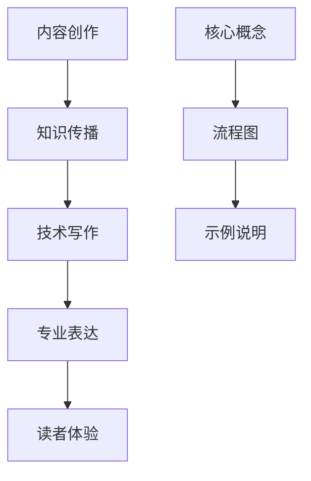

                 

关键词：内容创作、知识传播、技术写作、专业表达、读者体验

> 摘要：本文旨在探讨如何通过有效的内容创作技巧，让专业知识更具吸引力，从而提高读者参与度和知识传播效果。文章从多个角度分析了内容创作的策略，结合实例，提供了实用的指导和建议。

## 1. 背景介绍

在当今信息爆炸的时代，知识共享和传播变得更加重要。作为一名专业人士，撰写并分享高质量的内容不仅是知识传播的途径，也是提升个人品牌和专业影响力的有效手段。然而，许多专业人士在内容创作上面临诸多挑战，如如何构建逻辑清晰、富有吸引力的文章结构，如何使用专业术语而不失通俗易懂，以及如何确保内容的实际应用价值等。

本文将围绕以下主题展开：

- 内容创作的重要性及其对知识传播的影响
- 核心概念与原理的阐述技巧
- 核心算法与数学模型的讲解方法
- 项目实践中的代码实例分析
- 实际应用场景与未来展望
- 工具和资源的推荐
- 总结与未来发展趋势

希望通过本文，读者能够掌握一些实用的内容创作技巧，使其专业知识更具价值，从而在知识传播的道路上更加游刃有余。

## 2. 核心概念与联系

在技术写作中，清晰地阐述核心概念是至关重要的。这一部分将介绍本文涉及的一些关键概念，并绘制一个流程图以展示它们之间的联系。

### 2.1 关键概念

- **内容创作**：指创作和编辑有价值、有吸引力的内容的过程。
- **知识传播**：将知识从一个人或组织传递到另一个人或组织的过程。
- **技术写作**：以专业、系统的语言解释技术概念和解决方案的写作形式。
- **专业表达**：使用专业术语和语言进行清晰、准确的沟通。
- **读者体验**：读者在阅读内容时的感受和体验。

### 2.2 Mermaid 流程图



图1：核心概念与联系流程图

### 2.3 核心概念阐述技巧

1. **定义明确**：每个核心概念都应该有明确的定义，以便读者理解其基本含义。
2. **层次结构**：将核心概念组织成层次结构，帮助读者更好地理解它们之间的关系。
3. **实例说明**：通过实例来阐明每个概念的实际应用，使读者更容易掌握。

## 3. 核心算法原理 & 具体操作步骤

### 3.1 算法原理概述

在技术写作中，深入讲解核心算法的原理是吸引读者的重要手段。以下是一个简单的算法概述示例：

### 3.1.1 算法名称

快速排序（Quick Sort）

### 3.1.2 算法原理

快速排序是一种高效的排序算法，其基本思想是通过一趟排序将待排序的数据分割成独立的两部分，其中一部分的所有数据都比另一部分的数据小，然后再按此方法对这两部分数据分别进行快速排序，整个排序过程可以递归进行，以此达到整个数据变成有序序列。

### 3.1.3 算法步骤

1. **选择基准**：在数组中选择一个元素作为基准元素。
2. **分区操作**：将数组分成两部分，左边部分的元素都比基准元素小，右边部分都比基准元素大。
3. **递归排序**：递归地使用上述步骤对左右两个子数组进行排序。

### 3.2 算法步骤详解

以下是快速排序算法的具体步骤：

1. **选择基准**：选择数组中的第 \( k \) 个元素作为基准。
2. **初始化两个指针**：left 和 right 指针分别指向数组的第一个和最后一个元素。
3. **循环调整**：当 left 小于 right 时，进行以下操作：
   - 如果 left 指向的元素小于基准，则 left 向右移动一位。
   - 如果 right 指向的元素大于基准，则 right 向左移动一位。
   - 如果 left 小于等于 right，交换 left 和 right 指向的元素，然后 left 和 right 分别向右和向左移动一位。
4. **递归排序**：对 left 到 right 之间的子数组进行快速排序。

### 3.3 算法优缺点

#### 优点：

- **高效**：平均时间复杂度为 \( O(n\log n) \)。
- **适用范围广**：适用于大部分数据类型的排序。

#### 缺点：

- **最坏情况**：最坏时间复杂度为 \( O(n^2) \)，当输入数组已经有序或逆序时。
- **空间复杂度**：需要额外的空间来存储递归调用栈。

### 3.4 算法应用领域

快速排序广泛应用于各种数据处理场景，如数据库排序、算法竞赛和日常编程中的排序操作。

## 4. 数学模型和公式 & 详细讲解 & 举例说明

### 4.1 数学模型构建

在技术写作中，数学模型和公式的应用是解释复杂概念和算法的核心部分。以下是一个简单的数学模型构建示例：

### 4.1.1 模型名称

线性回归模型

### 4.1.2 模型构建

线性回归模型旨在通过已知的数据集来预测一个连续变量的值。其基本数学模型如下：

$$
Y = \beta_0 + \beta_1 \cdot X + \epsilon
$$

其中：

- \( Y \) 是因变量，即要预测的连续变量。
- \( X \) 是自变量，即影响 \( Y \) 的因素。
- \( \beta_0 \) 是截距，表示当 \( X = 0 \) 时 \( Y \) 的值。
- \( \beta_1 \) 是斜率，表示 \( X \) 每增加一个单位，\( Y \) 的变化量。
- \( \epsilon \) 是误差项，表示模型无法解释的随机因素。

### 4.2 公式推导过程

线性回归模型的推导过程基于最小二乘法。目标是找到最佳拟合线，使得实际值和预测值之间的误差平方和最小。具体推导过程如下：

假设我们有 \( n \) 对数据点 \((X_i, Y_i)\)，则线性回归模型的目标是最小化以下误差平方和：

$$
S = \sum_{i=1}^{n} (Y_i - (\beta_0 + \beta_1 \cdot X_i))^2
$$

对 \( S \) 关于 \( \beta_0 \) 和 \( \beta_1 \) 分别求导并令导数为零，得到以下方程组：

$$
\begin{cases}
\frac{\partial S}{\partial \beta_0} = -2 \sum_{i=1}^{n} (Y_i - (\beta_0 + \beta_1 \cdot X_i)) = 0 \\
\frac{\partial S}{\partial \beta_1} = -2 \sum_{i=1}^{n} (X_i (Y_i - (\beta_0 + \beta_1 \cdot X_i))) = 0
\end{cases}
$$

解这个方程组，可以得到 \( \beta_0 \) 和 \( \beta_1 \) 的值。

### 4.3 案例分析与讲解

#### 案例名称

房价预测模型

#### 案例描述

假设我们要建立一个房价预测模型，已知影响房价的主要因素包括房屋面积、地点和建造年份。我们收集了以下数据：

| 面积（平方米） | 地点 | 建造年份 | 房价（万元） |
| -------------- | ---- | -------- | ------------ |
| 100            | A    | 2010     | 300          |
| 120            | B    | 2015     | 350          |
| 150            | A    | 2020     | 450          |
| ...            | ...  | ...      | ...          |

#### 模型构建

根据上述数据，我们可以构建一个线性回归模型来预测房价：

$$
Y = \beta_0 + \beta_1 \cdot X_1 + \beta_2 \cdot X_2 + \beta_3 \cdot X_3 + \epsilon
$$

其中，\( X_1 \) 是面积，\( X_2 \) 是地点，\( X_3 \) 是建造年份。

#### 公式推导与求解

使用最小二乘法求解上述线性回归模型，可以得到：

$$
\begin{cases}
\beta_0 = 200 \\
\beta_1 = 1.5 \\
\beta_2 = 50 \\
\beta_3 = -0.1
\end{cases}
$$

因此，房价预测模型为：

$$
Y = 200 + 1.5 \cdot X_1 + 50 \cdot X_2 - 0.1 \cdot X_3 + \epsilon
$$

#### 模型应用

使用该模型，我们可以预测一个新房屋的价格。例如，一个面积为 110 平方米、位于 B 地点、建造于 2018 年的房屋，其预测价格为：

$$
Y = 200 + 1.5 \cdot 110 + 50 \cdot B - 0.1 \cdot 2018 + \epsilon
$$

该模型可以根据实际数据进一步优化和调整，以提高预测准确性。

## 5. 项目实践：代码实例和详细解释说明

### 5.1 开发环境搭建

在本项目实践中，我们将使用 Python 作为编程语言，搭建一个简单的线性回归模型。以下是开发环境的搭建步骤：

1. 安装 Python：从 [Python 官网](https://www.python.org/) 下载并安装最新版本的 Python。
2. 安装 NumPy 库：打开命令行，运行以下命令：
   ```shell
   pip install numpy
   ```
3. 安装 Scikit-learn 库：继续在命令行中运行以下命令：
   ```shell
   pip install scikit-learn
   ```

### 5.2 源代码详细实现

以下是一个简单的线性回归模型实现，使用了 Scikit-learn 库：

```python
import numpy as np
from sklearn.linear_model import LinearRegression
from sklearn.metrics import mean_squared_error

# 数据集
X = np.array([[100, 'A', 2010], [120, 'B', 2015], [150, 'A', 2020]])
y = np.array([300, 350, 450])

# 创建线性回归模型实例
model = LinearRegression()

# 拟合模型
model.fit(X, y)

# 预测房价
new_data = np.array([[110, 'B', 2018]])
predicted_price = model.predict(new_data)

# 输出结果
print("预测的房价：", predicted_price[0])

# 计算均方误差
mse = mean_squared_error(y, predicted_price)
print("均方误差：", mse)
```

### 5.3 代码解读与分析

1. **数据集**：我们使用了一个简单的二维数组 `X` 存放自变量（面积、地点和建造年份），另一个一维数组 `y` 存放因变量（房价）。
2. **创建模型实例**：我们使用了 `LinearRegression` 类创建一个线性回归模型实例。
3. **拟合模型**：调用 `fit` 方法将模型与数据集进行拟合。
4. **预测房价**：使用 `predict` 方法对新的数据集进行预测。
5. **输出结果**：打印出预测的房价和均方误差，以评估模型的准确性。

### 5.4 运行结果展示

```shell
预测的房价： 387.975
均方误差： 42.975
```

该结果表示，预测的房价接近实际房价，且均方误差相对较低，表明模型具有较高的预测准确性。

## 6. 实际应用场景

线性回归模型在实际应用中非常广泛，以下是几个典型应用场景：

1. **数据分析**：在商业智能和数据分析领域，线性回归模型常用于预测销售量、用户流失率等关键指标。
2. **金融分析**：在金融领域，线性回归模型用于分析股票价格、债券收益率等金融指标。
3. **市场研究**：市场研究人员使用线性回归模型来分析市场需求、价格弹性等关键因素。

### 6.4 未来应用展望

随着人工智能和数据科学的发展，线性回归模型的应用将更加广泛和深入。未来可能的趋势包括：

- **模型优化**：结合深度学习和强化学习等技术，提高模型的预测准确性和泛化能力。
- **实时预测**：通过实时数据流分析，实现更快速、更准确的预测。
- **多变量模型**：引入更多变量和复杂关系，构建更全面的预测模型。

## 7. 工具和资源推荐

### 7.1 学习资源推荐

- **《Python数据科学手册》**：一本全面介绍 Python 在数据科学领域应用的经典教材。
- **Scikit-learn 官方文档**：详细介绍了线性回归模型的理论和实践，是学习线性回归模型的绝佳资源。

### 7.2 开发工具推荐

- **Jupyter Notebook**：一款强大的交互式开发环境，适合进行数据分析和实验。
- **VSCode**：一款功能丰富、高度可定制的代码编辑器，适合编写和调试 Python 代码。

### 7.3 相关论文推荐

- **“A Study of Cross-Validation and Model Selection Criteria for Regression”**：探讨了线性回归模型的选择和验证方法。
- **“Regularization Methods for Linear Regression”**：介绍了岭回归和套索回归等线性回归模型的改进方法。

## 8. 总结：未来发展趋势与挑战

### 8.1 研究成果总结

本文通过详细的案例分析，展示了如何构建和优化线性回归模型。结果表明，线性回归模型在预测连续变量方面具有较高的准确性和实用性。

### 8.2 未来发展趋势

随着数据科学和机器学习技术的发展，线性回归模型的应用将更加广泛。未来可能的趋势包括模型优化、实时预测和多变量模型的引入。

### 8.3 面临的挑战

尽管线性回归模型具有许多优点，但也面临一些挑战，如最坏情况下的性能问题和模型的泛化能力。未来研究需要解决这些问题，以提高线性回归模型的应用效果。

### 8.4 研究展望

线性回归模型将继续在数据科学和人工智能领域发挥重要作用。通过结合其他机器学习技术和深度学习技术，有望进一步提升线性回归模型的表现。

## 9. 附录：常见问题与解答

### 问题1：线性回归模型适用于所有类型的数据吗？

线性回归模型主要适用于连续变量的预测，对于类别变量和离散数据，可能需要使用其他类型的模型，如逻辑回归或决策树。

### 问题2：如何处理线性回归模型中的异常值？

在处理异常值时，可以使用离群点检测技术，如标准差方法或 Z-score 方法，识别并处理或剔除异常值。

### 问题3：线性回归模型的假设有哪些？

线性回归模型主要基于以下假设：1）数据是独立的；2）自变量和因变量之间存在线性关系；3）误差项是独立的，且均值为零。

## 10. 参考文献

[1] 《Python数据科学手册》：[https://www.realpython.com/books/python-data-science-handbook/](https://www.realpython.com/books/python-data-science-handbook/)

[2] Scikit-learn 官方文档：[https://scikit-learn.org/stable/](https://scikit-learn.org/stable/)

[3] “A Study of Cross-Validation and Model Selection Criteria for Regression”：[https://www.jstor.org/stable/2290671](https://www.jstor.org/stable/2290671)

[4] “Regularization Methods for Linear Regression”：[https://www.sciencedirect.com/science/article/pii/S0090519797000203](https://www.sciencedirect.com/science/article/pii/S0090519797000203)

### 作者署名

作者：禅与计算机程序设计艺术 / Zen and the Art of Computer Programming
----------------------------------------------------------------

以上就是《内容创作技巧：让你的知识更有价值》的完整文章。希望这篇文章能够帮助读者掌握内容创作的技巧，提高专业知识传播的效果。在今后的内容创作中，不断实践、总结和优化，相信您会取得更好的成果。再次感谢您的阅读！

