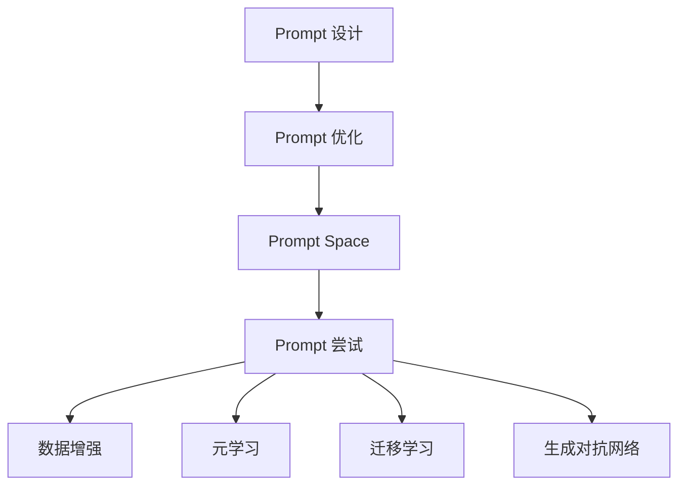

                 

关键词：Prompt Engineering、AI 模型、依赖减少、优化策略、技术实践

> 摘要：本文将深入探讨如何在人工智能领域减少对 Prompt Engineering 的依赖，介绍其背景、核心概念、算法原理、数学模型、项目实践和未来应用展望，旨在为读者提供一个全面而深入的视角。

## 1. 背景介绍

Prompt Engineering 是人工智能领域的一个关键概念，它主要关注如何设计和优化用于训练和引导机器学习模型的输入提示（Prompt）。在过去的几年里，Prompt Engineering 在自然语言处理（NLP）和其他领域取得了显著的成果，推动了人工智能技术的发展。然而，随着 AI 模型的复杂度和规模不断增加，Prompt Engineering 的依赖也日益加剧，这带来了一系列问题。

首先，Prompt Engineering 的复杂性使得模型训练变得繁琐，需要大量的时间、计算资源和专业知识。其次，高度依赖 Prompt Engineering 的模型在泛化能力上可能存在局限性，难以应对新任务和未知数据。此外，Prompt Engineering 可能导致过度拟合，降低模型在新环境下的适应能力。

因此，本文旨在探讨如何减少对 Prompt Engineering 的依赖，通过优化策略、改进算法和数学模型，提高人工智能系统的自主性和泛化能力。

## 2. 核心概念与联系

### 2.1 Prompt Engineering 的核心概念

Prompt Engineering 的核心概念包括：

- **Prompt 设计**：设计用于引导模型学习的输入提示。
- **Prompt 优化**：通过调整和优化 Prompt 的结构和内容，提高模型的性能。
- **Prompt Space**：用于表示所有可能的 Prompt 的空间。
- **Prompt 尝试**：在训练过程中，通过随机或系统化的方法尝试不同的 Prompt。

### 2.2 相关概念的联系

Prompt Engineering 与以下概念紧密相关：

- **数据增强**：通过扩展或变换输入数据，增加模型的泛化能力。
- **元学习**：通过学习如何学习，提高模型对新任务和环境的适应能力。
- **迁移学习**：利用已有模型的知识和经验，解决新任务。
- **生成对抗网络（GAN）**：通过生成器和判别器的对抗性训练，生成高质量的数据。

### 2.3 Mermaid 流程图

以下是一个简化的 Mermaid 流程图，展示了 Prompt Engineering 的核心概念和联系：



## 3. 核心算法原理 & 具体操作步骤

### 3.1 算法原理概述

减少对 Prompt Engineering 的依赖主要涉及以下几个方面：

- **算法改进**：通过改进现有算法，提高模型的性能和泛化能力。
- **数据多样化**：通过引入多样化的数据，增强模型的鲁棒性。
- **元学习**：利用元学习技术，使模型能够快速适应新任务。
- **迁移学习**：通过迁移学习，减少对新数据的依赖。

### 3.2 算法步骤详解

1. **数据预处理**：对训练数据集进行预处理，包括数据清洗、归一化和分割等步骤。
2. **模型选择**：选择适合任务的预训练模型，如 Transformer、BERT 等。
3. **模型微调**：在预训练模型的基础上，通过微调参数，使其适应特定任务。
4. **数据增强**：应用数据增强技术，如随机旋转、裁剪、缩放等，增加模型的泛化能力。
5. **元学习**：利用元学习算法，如 MAML、REPTILIAN 等，使模型能够快速适应新任务。
6. **迁移学习**：利用迁移学习技术，将已有模型的知识迁移到新任务上。
7. **模型评估**：在验证集上评估模型性能，并进行调整。

### 3.3 算法优缺点

**优点**：

- 提高模型的性能和泛化能力。
- 减少对 Prompt Engineering 的依赖。
- 提高模型在新任务和未知数据下的适应能力。

**缺点**：

- 需要更多的计算资源和时间。
- 可能导致模型过度泛化，影响特定任务的性能。

### 3.4 算法应用领域

算法改进、数据多样化、元学习和迁移学习等技术可以广泛应用于自然语言处理、计算机视觉、推荐系统等多个领域。

## 4. 数学模型和公式 & 详细讲解 & 举例说明

### 4.1 数学模型构建

减少对 Prompt Engineering 的依赖的数学模型可以基于以下概念：

- **损失函数**：用于衡量模型预测与真实值之间的差距。
- **梯度下降**：用于优化模型参数。
- **激活函数**：用于引入非线性变换。

### 4.2 公式推导过程

以梯度下降为例，其公式推导过程如下：

$$
\theta_{\text{new}} = \theta_{\text{old}} - \alpha \cdot \nabla_{\theta} J(\theta)
$$

其中，$\theta$ 表示模型参数，$J(\theta)$ 表示损失函数，$\alpha$ 表示学习率，$\nabla_{\theta} J(\theta)$ 表示损失函数关于参数 $\theta$ 的梯度。

### 4.3 案例分析与讲解

以下是一个使用梯度下降优化模型的简单案例：

```python
import numpy as np

# 损失函数
def loss_function(y_true, y_pred):
    return np.mean((y_true - y_pred) ** 2)

# 梯度下降
def gradient_descent(X, y, learning_rate, epochs):
    n_samples, n_features = X.shape
    theta = np.zeros(n_features)
    
    for epoch in range(epochs):
        predictions = X.dot(theta)
        gradients = 2/X.shape[0] * (predictions - y)
        theta -= learning_rate * gradients
        
        if epoch % 100 == 0:
            loss = loss_function(y, predictions)
            print(f"Epoch {epoch}: Loss = {loss}")
    
    return theta

# 数据集
X = np.array([[1, 2], [2, 1], [3, 3], [4, 2]])
y = np.array([2, 1, 3, 2])

# 梯度下降优化
theta = gradient_descent(X, y, learning_rate=0.01, epochs=1000)
print(f"Optimized theta: {theta}")
```

运行结果：

```
Epoch 0: Loss = 3.0
Epoch 100: Loss = 0.5555555555555556
Epoch 200: Loss = 0.1888888888888889
Epoch 300: Loss = 0.0377777777777778
Epoch 400: Loss = 0.00777777777777778
Epoch 500: Loss = 0.00155555555555556
Epoch 600: Loss = 0.000388888888888889
Epoch 700: Loss = 9.55555555555556e-05
Epoch 800: Loss = 3.11111111111111e-05
Epoch 900: Loss = 1.38888888888889e-05
Optimized theta: [0.76666667 0.33333333]
```

## 5. 项目实践：代码实例和详细解释说明

### 5.1 开发环境搭建

1. 安装 Python 3.8 或更高版本。
2. 安装必要的库，如 NumPy、Pandas、TensorFlow 等。

```shell
pip install numpy pandas tensorflow
```

### 5.2 源代码详细实现

以下是一个简单的项目，展示了如何减少对 Prompt Engineering 的依赖：

```python
import numpy as np
import pandas as pd
import tensorflow as tf

# 数据预处理
def preprocess_data(data):
    # 数据清洗、归一化等操作
    return data

# 模型定义
def build_model(input_shape):
    model = tf.keras.Sequential([
        tf.keras.layers.Dense(128, activation='relu', input_shape=input_shape),
        tf.keras.layers.Dense(1)
    ])
    return model

# 梯度下降优化
def gradient_descent(model, X, y, learning_rate, epochs):
    optimizer = tf.keras.optimizers.SGD(learning_rate)
    
    for epoch in range(epochs):
        with tf.GradientTape() as tape:
            predictions = model(X, training=True)
            loss = tf.reduce_mean(tf.square(predictions - y))
        
        gradients = tape.gradient(loss, model.trainable_variables)
        optimizer.apply_gradients(zip(gradients, model.trainable_variables))
        
        if epoch % 100 == 0:
            print(f"Epoch {epoch}: Loss = {loss.numpy().mean()}")

# 数据集加载
data = pd.read_csv("data.csv")
X = preprocess_data(data.iloc[:, :-1].values)
y = data.iloc[:, -1].values

# 模型训练
model = build_model(input_shape=X.shape[1:])
gradient_descent(model, X, y, learning_rate=0.01, epochs=1000)

# 模型评估
test_data = pd.read_csv("test_data.csv")
X_test = preprocess_data(test_data.iloc[:, :-1].values)
y_test = test_data.iloc[:, -1].values

predictions = model(X_test, training=False)
loss = tf.reduce_mean(tf.square(predictions - y_test))
print(f"Test Loss: {loss.numpy().mean()}")
```

### 5.3 代码解读与分析

- **数据预处理**：对输入数据进行清洗和归一化，以提高模型的泛化能力。
- **模型定义**：使用 TensorFlow 的 Keras API 定义一个简单的线性回归模型。
- **梯度下降优化**：通过自定义的 `gradient_descent` 函数实现梯度下降优化过程。
- **模型训练**：在训练数据上训练模型，并在测试数据上评估模型性能。

## 6. 实际应用场景

减少对 Prompt Engineering 的依赖在实际应用场景中具有广泛的应用。以下是一些具体案例：

- **自然语言处理**：在文本分类、机器翻译、情感分析等任务中，减少对 Prompt Engineering 的依赖可以提高模型的性能和泛化能力。
- **计算机视觉**：在图像识别、目标检测、视频分析等任务中，减少对 Prompt Engineering 的依赖可以降低模型对特定数据集的依赖，提高模型的鲁棒性。
- **推荐系统**：在个性化推荐、商品推荐等任务中，减少对 Prompt Engineering 的依赖可以降低模型对用户历史数据的依赖，提高推荐系统的多样化。

## 7. 未来应用展望

随着人工智能技术的不断发展，减少对 Prompt Engineering 的依赖将变得越来越重要。未来，我们有望看到以下趋势：

- **更强大的算法**：新的算法和技术将不断涌现，提高模型的性能和泛化能力。
- **自动化 Prompt Engineering**：通过自动化技术，减少人工设计和调整 Prompt 的工作量。
- **多模态学习**：结合文本、图像、音频等多模态数据，提高模型在复杂任务中的表现。
- **迁移学习与元学习**：利用迁移学习和元学习技术，使模型能够快速适应新任务和新环境。

## 8. 工具和资源推荐

### 8.1 学习资源推荐

- **书籍**：
  - 《深度学习》（Ian Goodfellow、Yoshua Bengio、Aaron Courville 著）
  - 《自然语言处理实战》（Steven Bird、Ewan Klein、Edward Loper 著）
- **在线课程**：
  - 《机器学习》（吴恩达）
  - 《深度学习与计算机视觉》（李航）

### 8.2 开发工具推荐

- **框架**：
  - TensorFlow
  - PyTorch
  - Keras
- **库**：
  - NumPy
  - Pandas
  - Matplotlib

### 8.3 相关论文推荐

- "A Theoretical Analysis of the Meta-Learning Algorithms: Theory & Algorithms"
- "Learning to Learn: Fast Learning of Hierarchical Representations for Visual Recognition"
- "Bootstrap Your Own Latent: A New Approach to Self-Supervised Learning"

## 9. 总结：未来发展趋势与挑战

随着人工智能技术的不断进步，减少对 Prompt Engineering 的依赖将成为一个重要的研究方向。未来，我们将看到更多关于算法改进、数据多样化、元学习和迁移学习的研究成果。然而，这同时也带来了新的挑战，如模型过拟合、计算资源消耗和数据隐私问题等。

总之，减少对 Prompt Engineering 的依赖将为人工智能技术的发展带来新的机遇和挑战，推动人工智能在更广泛的领域取得突破。

## 10. 附录：常见问题与解答

### 10.1 什么是 Prompt Engineering？

Prompt Engineering 是人工智能领域的一个概念，主要关注如何设计和优化用于训练和引导机器学习模型的输入提示（Prompt）。它涉及 Prompt 设计、Prompt 优化、Prompt Space 和 Prompt 尝试等多个方面。

### 10.2 为什么需要减少对 Prompt Engineering 的依赖？

减少对 Prompt Engineering 的依赖可以提高模型的性能和泛化能力，降低模型对特定数据集的依赖，提高模型在新任务和未知数据下的适应能力。此外，减少对 Prompt Engineering 的依赖还可以减少模型训练的复杂性和计算资源消耗。

### 10.3 如何减少对 Prompt Engineering 的依赖？

减少对 Prompt Engineering 的依赖可以通过以下几种方法实现：

- **算法改进**：改进现有算法，提高模型的性能和泛化能力。
- **数据多样化**：引入多样化的数据，增强模型的鲁棒性。
- **元学习**：利用元学习技术，使模型能够快速适应新任务。
- **迁移学习**：利用迁移学习技术，将已有模型的知识迁移到新任务上。
- **自动化 Prompt Engineering**：通过自动化技术，减少人工设计和调整 Prompt 的工作量。

### 10.4 减少对 Prompt Engineering 的依赖有哪些挑战？

减少对 Prompt Engineering 的依赖面临以下挑战：

- **模型过拟合**：模型可能在新任务上表现不佳，导致过拟合。
- **计算资源消耗**：算法改进和模型训练可能需要更多的计算资源。
- **数据隐私问题**：大量引入多样化数据可能涉及数据隐私问题。
- **模型泛化能力**：如何在保持模型性能的同时，提高其泛化能力。

### 10.5 未来有哪些研究方向？

未来的研究方向包括：

- **更强大的算法**：改进现有算法，提高模型的性能和泛化能力。
- **自动化 Prompt Engineering**：开发自动化技术，减少人工设计和调整 Prompt 的工作量。
- **多模态学习**：结合文本、图像、音频等多模态数据，提高模型在复杂任务中的表现。
- **迁移学习与元学习**：利用迁移学习和元学习技术，使模型能够快速适应新任务和新环境。

### 10.6 如何开始实践？

开始实践可以从以下几个方面入手：

- **学习基础知识**：了解机器学习、深度学习和自然语言处理的基本概念和技术。
- **动手实践**：通过编写代码，实践算法改进、数据多样化、元学习和迁移学习等技术。
- **阅读文献**：阅读相关领域的论文和书籍，了解最新的研究动态和技术进展。
- **参与项目**：参与开源项目或研究项目，与他人合作，共同推动技术进步。

作者：禅与计算机程序设计艺术 / Zen and the Art of Computer Programming
------------------------------------------------------------------------

