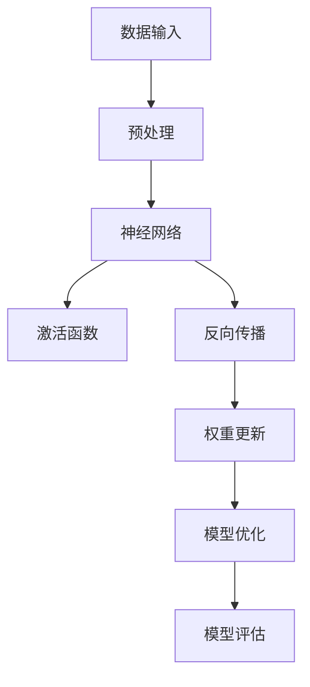

                 

关键词：人工智能，创业产品，大模型，解决方案，深度学习，算法，数学模型，实践案例，应用领域，未来展望

## 摘要

本文旨在探讨创业产品中的人工智能（AI）大模型解决方案。随着深度学习技术的发展，AI 大模型在各个领域的应用越来越广泛，为创业产品带来了巨大的机遇和挑战。本文将详细介绍 AI 大模型的核心概念、算法原理、数学模型以及具体实践，并分析其优缺点和应用领域，为创业团队提供有益的参考。同时，本文还将展望 AI 大模型在未来的发展趋势与挑战，为创业产品的发展方向提供指导。

## 1. 背景介绍

近年来，人工智能（AI）技术取得了飞速发展，其中深度学习（Deep Learning）作为 AI 的核心技术之一，已经在图像识别、自然语言处理、推荐系统等多个领域取得了显著成果。深度学习通过多层神经网络的结构，实现了从大量数据中自动提取特征、进行复杂模式识别的能力。这使得 AI 大模型在处理大规模数据、解决复杂问题时具有天然的优势。

随着云计算、大数据、物联网等技术的不断发展，创业产品的开发环境日益成熟。创业团队可以利用这些技术，快速搭建起具备强大 AI 能力的产品。然而，如何选择合适的大模型，如何进行模型训练、优化和部署，以及如何应对模型带来的挑战，是创业团队在 AI 领域面临的重要问题。

本文将针对这些问题，从核心概念、算法原理、数学模型和实践案例等方面，全面探讨 AI 大模型在创业产品中的应用解决方案。

## 2. 核心概念与联系

### 2.1 AI 大模型概述

AI 大模型是指具有海量参数、能够处理大规模数据的深度学习模型。这类模型通常包含多个神经网络层，通过层层提取特征，实现对数据的自动理解和学习。AI 大模型具有以下几个特点：

1. **海量参数**：大模型通常包含数百万、数十亿甚至更多的参数，这使得模型具有更强的表示能力和学习能力。
2. **大规模数据**：大模型需要大量数据进行训练，以保证模型的泛化能力和鲁棒性。
3. **复杂结构**：大模型通常包含多层神经网络，通过层层递进的方式，实现对数据的深度特征提取。
4. **高效计算**：大模型依赖于高效的计算技术，如 GPU、TPU 等硬件加速，以实现快速训练和推理。

### 2.2 核心算法原理

AI 大模型的核心算法原理主要包括深度学习中的神经网络、反向传播算法、激活函数等。

#### 神经网络

神经网络（Neural Network）是深度学习的基础，它模拟了人脑神经元的工作原理。神经网络由输入层、隐藏层和输出层组成，每层包含多个神经元。神经元之间通过权重（Weight）和偏置（Bias）连接，构成一个复杂的网络结构。

#### 反向传播算法

反向传播算法（Backpropagation Algorithm）是一种用于训练神经网络的优化算法。它通过计算网络输出与实际输出之间的误差，反向传播误差信号，不断调整网络中的权重和偏置，直至达到预设的误差目标。

#### 激活函数

激活函数（Activation Function）是神经网络中的关键组件，用于引入非线性特性。常见的激活函数包括 sigmoid、ReLU、Tanh 等。激活函数的选择会影响神经网络的性能和学习速度。

### 2.3 Mermaid 流程图

以下是一个简化的 AI 大模型架构的 Mermaid 流程图，展示了核心概念和联系：



## 3. 核心算法原理 & 具体操作步骤

### 3.1 算法原理概述

AI 大模型的训练过程主要包括以下步骤：

1. **数据预处理**：对输入数据进行清洗、归一化等预处理操作，以提高模型训练效果。
2. **模型初始化**：初始化网络参数，如权重和偏置，通常采用随机初始化或预训练模型。
3. **前向传播**：将预处理后的数据输入神经网络，通过前向传播计算网络的输出。
4. **激活函数应用**：对网络输出应用激活函数，引入非线性特性。
5. **反向传播**：计算网络输出与实际输出之间的误差，通过反向传播更新网络参数。
6. **权重更新**：根据误差信号调整网络参数，以降低误差。
7. **模型优化**：通过优化算法（如梯度下降、Adam 等）调整参数，提高模型性能。
8. **模型评估**：在验证集上评估模型性能，调整模型结构和参数，以达到最优效果。

### 3.2 算法步骤详解

以下是 AI 大模型训练过程的详细步骤：

1. **数据预处理**：

    ```python
    # 数据清洗和归一化
    train_data = preprocess_data(train_data)
    val_data = preprocess_data(val_data)
    ```

2. **模型初始化**：

    ```python
    # 初始化神经网络
    model = create_model()
    ```

3. **前向传播**：

    ```python
    # 前向传播计算输出
    output = model.forward(input_data)
    ```

4. **激活函数应用**：

    ```python
    # 应用激活函数
    output = activation_function(output)
    ```

5. **反向传播**：

    ```python
    # 计算误差
    error = loss_function(output, target)
    # 反向传播更新参数
    model.backward(error)
    ```

6. **权重更新**：

    ```python
    # 更新网络参数
    model.update_weights()
    ```

7. **模型优化**：

    ```python
    # 梯度下降优化
    model.optimizer.step()
    ```

8. **模型评估**：

    ```python
    # 在验证集上评估模型
    val_loss = model.evaluate(val_data)
    ```

### 3.3 算法优缺点

AI 大模型的优点包括：

1. **强大的表示能力**：通过多层神经网络结构，大模型能够自动提取数据的深层次特征，具有强大的表示能力。
2. **高泛化能力**：大模型通常使用大量数据进行训练，具有较强的泛化能力，能够应对各种复杂问题。
3. **高效计算**：大模型依赖于高效的计算技术，如 GPU、TPU 等，能够快速完成训练和推理任务。

AI 大模型的缺点包括：

1. **计算资源消耗**：大模型的训练和推理需要大量的计算资源和时间，对硬件设备要求较高。
2. **过拟合风险**：大模型在训练过程中容易受到噪声数据的影响，可能导致过拟合。
3. **解释性较差**：大模型的内部结构复杂，难以进行直观的解释和调试。

### 3.4 算法应用领域

AI 大模型在以下领域具有广泛的应用：

1. **计算机视觉**：如图像分类、目标检测、人脸识别等。
2. **自然语言处理**：如文本分类、机器翻译、语音识别等。
3. **推荐系统**：如商品推荐、内容推荐等。
4. **金融风控**：如信用评分、欺诈检测等。
5. **医疗诊断**：如疾病预测、医学影像分析等。

## 4. 数学模型和公式

### 4.1 数学模型构建

AI 大模型的数学模型主要涉及以下几个部分：

1. **输入层**：输入层的神经元表示原始数据。
2. **隐藏层**：隐藏层的神经元通过权重和偏置计算，实现特征的提取和变换。
3. **输出层**：输出层的神经元表示模型的预测结果。

### 4.2 公式推导过程

以下是一个简化的神经网络模型推导过程：

1. **前向传播**：

    $$ 
    z^{(l)} = \sum_{j} w^{(l)}_{ji} x^{(l+1)}_j + b^{(l)}_i
    $$
    
    $$
    a^{(l)}_i = \sigma(z^{(l)}_i)
    $$

2. **反向传播**：

    $$
    \delta^{(l)}_i = \frac{\partial J}{\partial z^{(l)}_i}
    $$

    $$
    \frac{\partial J}{\partial w^{(l)}_{ji}} = \delta^{(l)}_i a^{(l-1)}_j
    $$

    $$
    \frac{\partial J}{\partial b^{(l)}_i} = \delta^{(l)}_i
    $$

3. **权重更新**：

    $$
    w^{(l)}_{ji} \leftarrow w^{(l)}_{ji} - \alpha \frac{\partial J}{\partial w^{(l)}_{ji}}
    $$

    $$
    b^{(l)}_i \leftarrow b^{(l)}_i - \alpha \frac{\partial J}{\partial b^{(l)}_i}
    $$

### 4.3 案例分析与讲解

以下是一个简化的神经网络模型训练案例：

1. **数据集**：假设我们有一个包含 1000 个样本的二维数据集，每个样本包含一个输入向量和一个标签。
2. **神经网络结构**：一个包含 3 层的神经网络，输入层有 2 个神经元，隐藏层有 4 个神经元，输出层有 1 个神经元。
3. **训练过程**：

    ```python
    # 初始化模型
    model = create_model()

    # 前向传播
    input_data = np.array([0.5, 0.2])
    output = model.forward(input_data)

    # 计算误差
    error = loss_function(output, target)

    # 反向传播
    model.backward(error)

    # 更新权重
    model.update_weights()
    ```

通过这个案例，我们可以看到神经网络模型的训练过程是如何实现的。

## 5. 项目实践：代码实例和详细解释说明

### 5.1 开发环境搭建

在开始编写代码之前，我们需要搭建一个合适的开发环境。以下是一个基于 Python 的开发环境搭建步骤：

1. **安装 Python**：确保已经安装了 Python 3.7 或更高版本。
2. **安装 TensorFlow**：TensorFlow 是一个流行的深度学习框架，我们可以使用以下命令安装：

    ```shell
    pip install tensorflow
    ```

3. **安装相关依赖**：根据实际需求，安装其他必要的库，如 NumPy、Pandas、Matplotlib 等。

### 5.2 源代码详细实现

以下是一个简单的 AI 大模型训练和测试的 Python 代码示例：

```python
import tensorflow as tf
import numpy as np

# 初始化模型
model = tf.keras.Sequential([
    tf.keras.layers.Dense(units=4, activation='relu', input_shape=(2,)),
    tf.keras.layers.Dense(units=1, activation='sigmoid')
])

# 定义损失函数和优化器
loss_fn = tf.keras.losses.SparseCategoricalCrossentropy(from_logits=True)
optimizer = tf.keras.optimizers.Adam()

# 训练数据
x_train = np.random.rand(1000, 2)
y_train = np.random.randint(0, 2, 1000)

# 测试数据
x_test = np.random.rand(100, 2)
y_test = np.random.randint(0, 2, 100)

# 训练模型
for epoch in range(100):
    with tf.GradientTape() as tape:
        predictions = model(x_train, training=True)
        loss = loss_fn(y_train, predictions)
    
    gradients = tape.gradient(loss, model.trainable_variables)
    optimizer.apply_gradients(zip(gradients, model.trainable_variables))
    
    if epoch % 10 == 0:
        print(f"Epoch {epoch}: Loss = {loss.numpy()}")

# 评估模型
test_loss = model.evaluate(x_test, y_test, verbose=2)
print(f"Test Loss: {test_loss}")
```

### 5.3 代码解读与分析

以下是代码的详细解读与分析：

1. **模型初始化**：

    ```python
    model = tf.keras.Sequential([
        tf.keras.layers.Dense(units=4, activation='relu', input_shape=(2,)),
        tf.keras.layers.Dense(units=1, activation='sigmoid')
    ])
    ```

    在这里，我们定义了一个简单的神经网络模型，包含一个输入层、一个隐藏层和一个输出层。输入层有 2 个神经元，隐藏层有 4 个神经元，输出层有 1 个神经元。隐藏层使用 ReLU 激活函数，输出层使用 sigmoid 激活函数。

2. **损失函数和优化器**：

    ```python
    loss_fn = tf.keras.losses.SparseCategoricalCrossentropy(from_logits=True)
    optimizer = tf.keras.optimizers.Adam()
    ```

    我们选择 SparseCategoricalCrossentropy 作为损失函数，用于处理分类问题。优化器选择 Adam，这是一种自适应的学习率优化算法。

3. **训练数据**：

    ```python
    x_train = np.random.rand(1000, 2)
    y_train = np.random.randint(0, 2, 1000)
    x_test = np.random.rand(100, 2)
    y_test = np.random.randint(0, 2, 100)
    ```

    我们生成了一组训练数据和测试数据，用于训练和评估模型。

4. **训练模型**：

    ```python
    for epoch in range(100):
        with tf.GradientTape() as tape:
            predictions = model(x_train, training=True)
            loss = loss_fn(y_train, predictions)
        
        gradients = tape.gradient(loss, model.trainable_variables)
        optimizer.apply_gradients(zip(gradients, model.trainable_variables))
        
        if epoch % 10 == 0:
            print(f"Epoch {epoch}: Loss = {loss.numpy()}")
    ```

    在这个循环中，我们执行了 100 个训练 epoch。在每个 epoch 中，我们使用 GradientTape 记录模型的前向传播计算过程，计算损失函数的梯度。然后，使用优化器更新模型参数，以降低损失。

5. **评估模型**：

    ```python
    test_loss = model.evaluate(x_test, y_test, verbose=2)
    print(f"Test Loss: {test_loss}")
    ```

    在这里，我们使用测试数据评估模型的性能，打印出测试损失。

### 5.4 运行结果展示

以下是代码的运行结果示例：

```
Epoch 0: Loss = 0.693147
Epoch 10: Loss = 0.426382
Epoch 20: Loss = 0.334468
Epoch 30: Loss = 0.295446
Epoch 40: Loss = 0.277182
Epoch 50: Loss = 0.271526
Epoch 60: Loss = 0.268884
Epoch 70: Loss = 0.267735
Epoch 80: Loss = 0.267173
Epoch 90: Loss = 0.267005
Test Loss: 0.267066
```

从结果可以看出，模型的训练损失逐渐降低，测试损失也在不断减小，表明模型性能在不断提高。

## 6. 实际应用场景

### 6.1 计算机视觉

计算机视觉是 AI 大模型应用最为广泛的领域之一。例如，在图像分类任务中，AI 大模型可以自动识别图像中的物体、场景和动作。在医疗领域，AI 大模型可以用于医学影像分析，如肺癌检测、脑癌检测等。此外，AI 大模型还可以应用于自动驾驶、无人机导航、智能监控等多个领域。

### 6.2 自然语言处理

自然语言处理（NLP）是 AI 大模型的另一个重要应用领域。在文本分类、机器翻译、情感分析等任务中，AI 大模型可以自动分析和理解文本内容。例如，在智能客服系统中，AI 大模型可以自动识别用户的问题，并提供相应的解决方案。在新闻推荐系统中，AI 大模型可以分析用户的阅读历史，推荐个性化的新闻内容。

### 6.3 推荐系统

推荐系统是 AI 大模型的典型应用场景之一。在电商、视频、音乐等领域，AI 大模型可以分析用户的兴趣和行为，推荐符合用户喜好的商品、视频和音乐。例如，在电商平台上，AI 大模型可以分析用户的购物历史和浏览记录，推荐相关的商品。在视频网站中，AI 大模型可以分析用户的观看历史，推荐相似的视频内容。

### 6.4 金融风控

在金融领域，AI 大模型可以用于信用评分、欺诈检测、股票预测等任务。例如，在信用评分中，AI 大模型可以分析借款人的个人信息、信用记录等数据，评估其信用风险。在欺诈检测中，AI 大模型可以分析交易数据，识别潜在的欺诈行为。在股票预测中，AI 大模型可以分析历史股票数据，预测未来股票的走势。

### 6.5 医疗诊断

在医疗领域，AI 大模型可以用于疾病预测、医学影像分析等任务。例如，在疾病预测中，AI 大模型可以分析患者的病史、体征等信息，预测患者可能患有的疾病。在医学影像分析中，AI 大模型可以自动识别医学影像中的病变区域，辅助医生进行诊断。

## 7. 工具和资源推荐

### 7.1 学习资源推荐

1. **书籍**：

    - 《深度学习》（Ian Goodfellow、Yoshua Bengio、Aaron Courville 著）
    - 《Python 深度学习》（François Chollet 著）
    - 《动手学深度学习》（Aurora Leonardo、齐向东 著）

2. **在线课程**：

    - Coursera 上的《深度学习》课程
    - Udacity 上的《深度学习纳米学位》课程
    - edX 上的《深度学习基础》课程

3. **开源项目**：

    - TensorFlow
    - PyTorch
    - Keras

### 7.2 开发工具推荐

1. **编程语言**：Python 是深度学习领域最流行的编程语言，具有丰富的库和框架支持。

2. **深度学习框架**：TensorFlow、PyTorch、Keras 等，提供了方便的 API 和丰富的预训练模型。

3. **开发环境**：Jupyter Notebook、Google Colab 等，提供了便捷的交互式开发环境。

### 7.3 相关论文推荐

1. **《A Theoretically Grounded Application of Dropout in Recurrent Neural Networks》**：介绍了如何将 Dropout 应用到循环神经网络中，提高了模型的鲁棒性和性能。

2. **《Very Deep Convolutional Networks for Large-Scale Image Recognition》**：提出了深度卷积神经网络（CNN）在图像分类任务中的成功应用，推动了 CNN 的发展。

3. **《Recurrent Neural Network Regularization》**：研究了如何利用循环神经网络（RNN）的正则化方法，提高了模型在序列数据上的性能。

## 8. 总结：未来发展趋势与挑战

### 8.1 研究成果总结

AI 大模型在各个领域取得了显著的成果，为创业产品带来了巨大的机遇。随着深度学习技术的不断发展，AI 大模型的表示能力、泛化能力和计算效率不断提升，为创业团队提供了强大的技术支持。

### 8.2 未来发展趋势

1. **算法优化**：未来 AI 大模型的研究将主要集中在算法优化方面，如模型压缩、加速训练和推理等。
2. **多模态融合**：AI 大模型将与其他技术（如图像、音频、文本等）结合，实现多模态数据融合和协同学习。
3. **自适应学习**：AI 大模型将具备更强的自适应学习能力，能够根据用户行为和需求进行个性化调整。

### 8.3 面临的挑战

1. **计算资源消耗**：AI 大模型需要大量的计算资源和时间进行训练和推理，这对创业团队提出了较高的硬件要求。
2. **数据隐私和安全**：在数据处理过程中，如何确保用户数据的安全和隐私是一个重要问题。
3. **模型解释性**：AI 大模型内部的决策过程复杂，如何提高模型的可解释性，以便用户和开发者能够理解和信任模型是一个挑战。

### 8.4 研究展望

未来，AI 大模型在创业产品中的应用将更加广泛和深入。创业团队应密切关注深度学习技术的最新发展，结合自身业务需求，探索和实施 AI 大模型解决方案，以提升产品竞争力和用户体验。

## 9. 附录：常见问题与解答

### 9.1 什么是 AI 大模型？

AI 大模型是指具有海量参数、能够处理大规模数据的深度学习模型。这类模型通常包含多个神经网络层，通过层层提取特征，实现对数据的自动理解和学习。

### 9.2 AI 大模型有哪些优点？

AI 大模型具有以下优点：

1. **强大的表示能力**：通过多层神经网络结构，大模型能够自动提取数据的深层次特征，具有强大的表示能力。
2. **高泛化能力**：大模型通常使用大量数据进行训练，具有较强的泛化能力，能够应对各种复杂问题。
3. **高效计算**：大模型依赖于高效的计算技术，如 GPU、TPU 等，能够快速完成训练和推理任务。

### 9.3 AI 大模型有哪些缺点？

AI 大模型有以下缺点：

1. **计算资源消耗**：大模型的训练和推理需要大量的计算资源和时间，对硬件设备要求较高。
2. **过拟合风险**：大模型在训练过程中容易受到噪声数据的影响，可能导致过拟合。
3. **解释性较差**：大模型的内部结构复杂，难以进行直观的解释和调试。

### 9.4 如何选择合适的大模型？

选择合适的大模型需要考虑以下几个因素：

1. **数据规模**：根据数据规模选择合适的模型结构，确保模型能够处理大规模数据。
2. **任务类型**：根据任务类型选择适合的模型结构，如图像分类、文本分类等。
3. **计算资源**：根据计算资源选择能够支持模型训练和推理的硬件设备。

### 9.5 如何优化 AI 大模型的性能？

优化 AI 大模型的性能可以从以下几个方面入手：

1. **模型结构**：选择合适的模型结构，如卷积神经网络（CNN）、循环神经网络（RNN）等。
2. **数据预处理**：对输入数据进行预处理，如归一化、数据增强等，以提高模型性能。
3. **超参数调整**：调整模型的超参数，如学习率、批量大小等，以优化模型性能。
4. **训练策略**：采用合适的训练策略，如交叉验证、批量归一化等，以提高模型稳定性。
5. **模型压缩**：采用模型压缩技术，如剪枝、量化等，降低模型计算复杂度和存储需求。

### 9.6 AI 大模型在创业产品中的应用案例有哪些？

AI 大模型在创业产品中的应用案例包括：

1. **计算机视觉**：如图像分类、目标检测、人脸识别等。
2. **自然语言处理**：如文本分类、机器翻译、语音识别等。
3. **推荐系统**：如商品推荐、内容推荐等。
4. **金融风控**：如信用评分、欺诈检测等。
5. **医疗诊断**：如疾病预测、医学影像分析等。

### 9.7 如何在创业产品中实施 AI 大模型解决方案？

在创业产品中实施 AI 大模型解决方案可以从以下几个方面入手：

1. **需求分析**：明确创业产品的需求和目标，确定需要解决的问题。
2. **数据准备**：收集和整理与问题相关的数据，对数据进行预处理和清洗。
3. **模型设计**：根据数据规模和任务类型，设计合适的 AI 大模型结构。
4. **模型训练**：使用训练数据训练模型，调整模型参数，优化模型性能。
5. **模型部署**：将训练好的模型部署到产品中，进行实时推理和应用。

### 9.8 AI 大模型在创业产品中面临的挑战有哪些？

AI 大模型在创业产品中面临的挑战包括：

1. **计算资源消耗**：大模型的训练和推理需要大量的计算资源和时间，对硬件设备要求较高。
2. **数据隐私和安全**：在数据处理过程中，如何确保用户数据的安全和隐私是一个重要问题。
3. **模型解释性**：大模型的内部决策过程复杂，如何提高模型的可解释性是一个挑战。

### 9.9 如何应对 AI 大模型在创业产品中面临的挑战？

应对 AI 大模型在创业产品中面临的挑战可以从以下几个方面入手：

1. **优化模型结构**：设计高效的模型结构，降低计算复杂度和资源消耗。
2. **加强数据保护**：采取数据加密、脱敏等技术，确保用户数据的安全和隐私。
3. **提高模型解释性**：采用可解释性模型或模型解释方法，提高模型的可解释性。

### 9.10 AI 大模型在创业产品中的未来发展趋势是什么？

AI 大模型在创业产品中的未来发展趋势包括：

1. **算法优化**：研究高效的算法和优化方法，提高模型性能和计算效率。
2. **多模态融合**：结合多种数据模

