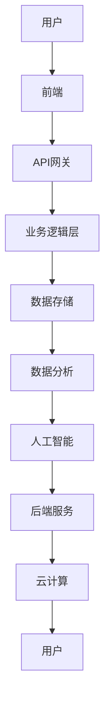
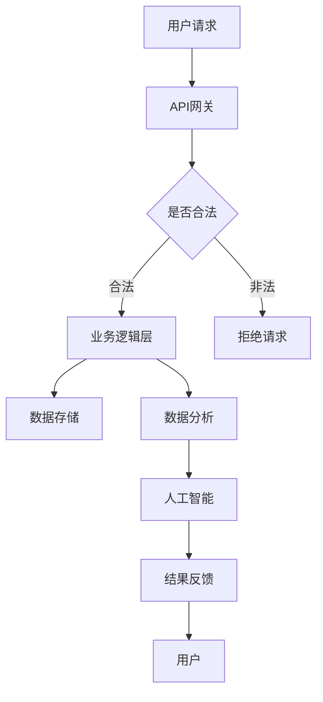

                 

关键词：互联网医疗、平台搭建、技术架构、云计算、人工智能、API、数据安全、用户体验、商业策略

## 摘要

本文旨在为创业型互联网医疗平台提供一个全面的搭建方案。从市场分析到技术选型，再到用户体验设计以及商业模式的构建，我们将探讨互联网医疗平台的关键成功要素。文章还将深入讲解技术架构设计、核心算法原理、数学模型构建，以及代码实例实现。通过本文，创业者可以了解到如何利用现代技术构建一个具有竞争力和可持续发展的医疗平台。

## 1. 背景介绍

互联网医疗作为医疗行业的创新力量，正在迅速崛起。随着物联网、大数据、云计算和人工智能技术的不断进步，医疗行业面临着前所未有的变革机遇。创业型互联网医疗平台的出现，不仅满足了用户对便捷、高效医疗服务的需求，还为医疗行业带来了新的商业模式。

### 1.1 行业现状

根据市场研究，全球互联网医疗市场规模正在以每年超过20%的速度增长。特别是在新冠疫情的推动下，远程医疗、在线问诊、电子健康档案等互联网医疗应用得到了极大的普及。用户对互联网医疗平台的依赖程度日益增加，这为创业型平台提供了良好的市场环境。

### 1.2 行业挑战

尽管市场前景广阔，但创业型互联网医疗平台也面临着一系列挑战。包括技术选型、数据安全、隐私保护、用户体验、商业模式构建等。如何在竞争中脱颖而出，构建一个可靠、安全、用户喜爱的平台，是每一个创业团队都需要面对的问题。

## 2. 核心概念与联系

构建创业型互联网医疗平台，需要理解和整合多个核心概念和技术。以下是平台搭建中的关键概念及其相互关系。

### 2.1 核心概念

**云计算**：提供弹性计算资源和存储服务，支持平台按需扩展。

**大数据**：处理和分析海量医疗数据，为决策提供支持。

**人工智能**：应用于诊断、治疗、个性化服务等领域，提高医疗服务效率。

**API**：实现不同系统之间的数据交换和功能调用。

**数据安全**：保护用户隐私和医疗数据的安全。

### 2.2 架构联系

下面是一个简化的互联网医疗平台架构图，展示了核心概念之间的联系。



### 2.3 Mermaid 流程图



## 3. 核心算法原理 & 具体操作步骤

### 3.1 算法原理概述

互联网医疗平台中的核心算法包括诊断算法、推荐算法和预测算法。

- **诊断算法**：通过机器学习模型对疾病进行诊断，例如基于深度学习模型的影像识别。
- **推荐算法**：基于用户行为和偏好为用户推荐合适的医疗服务和药品。
- **预测算法**：预测患者病情发展趋势，为医生提供决策支持。

### 3.2 算法步骤详解

#### 3.2.1 诊断算法

1. **数据收集**：收集患者的医疗数据，包括影像、检验报告等。
2. **预处理**：对数据清洗、归一化处理，为模型训练做准备。
3. **模型训练**：使用深度学习框架如TensorFlow或PyTorch训练模型。
4. **模型评估**：使用验证集评估模型性能。
5. **模型部署**：将训练好的模型部署到生产环境。

#### 3.2.2 推荐算法

1. **用户特征提取**：从用户行为数据中提取特征，如浏览记录、购买历史等。
2. **模型训练**：使用协同过滤或基于内容的推荐算法训练推荐模型。
3. **推荐生成**：根据用户特征生成个性化推荐。
4. **推荐评估**：评估推荐效果，调整模型参数。

#### 3.2.3 预测算法

1. **数据收集**：收集患者的历史医疗数据、病情记录等。
2. **特征工程**：提取与预测目标相关的特征。
3. **模型训练**：使用时间序列预测模型，如LSTM。
4. **模型评估**：使用交叉验证评估模型性能。
5. **模型部署**：将训练好的模型部署到生产环境。

### 3.3 算法优缺点

- **诊断算法**：优点是准确性高，缺点是模型复杂，训练时间较长。
- **推荐算法**：优点是提升用户满意度，缺点是可能存在信息过载。
- **预测算法**：优点是提前预警，缺点是预测准确性受数据质量和模型质量影响。

### 3.4 算法应用领域

- **诊断算法**：应用于影像诊断、病理分析等领域。
- **推荐算法**：应用于在线问诊、药品推荐等领域。
- **预测算法**：应用于疾病预测、风险评估等领域。

## 4. 数学模型和公式 & 详细讲解 & 举例说明

### 4.1 数学模型构建

在互联网医疗平台中，常用的数学模型包括线性回归、逻辑回归、决策树、支持向量机、神经网络等。

#### 4.1.1 线性回归

线性回归模型公式：
$$y = \beta_0 + \beta_1 \cdot x$$

其中，$y$ 为预测值，$x$ 为特征值，$\beta_0$ 和 $\beta_1$ 为模型参数。

#### 4.1.2 逻辑回归

逻辑回归模型公式：
$$P(y=1) = \frac{1}{1 + e^{-(\beta_0 + \beta_1 \cdot x)} }$$

其中，$P(y=1)$ 为事件发生的概率，$\beta_0$ 和 $\beta_1$ 为模型参数。

### 4.2 公式推导过程

以线性回归模型为例，推导过程如下：

1. **损失函数**：均方误差（MSE）
   $$J(\theta) = \frac{1}{2m} \sum_{i=1}^{m} (h_{\theta}(x^{(i)}) - y^{(i)})^2$$

2. **梯度下降**：求解最小化损失函数的参数
   $$\theta_j := \theta_j - \alpha \cdot \frac{\partial J(\theta)}{\partial \theta_j}$$

3. **模型训练**：迭代计算梯度，更新参数。

### 4.3 案例分析与讲解

#### 4.3.1 案例背景

某互联网医疗平台需要预测患者是否患有某种疾病，特征数据包括年龄、血压、心率等。

#### 4.3.2 数据预处理

1. **数据清洗**：处理缺失值、异常值。
2. **特征提取**：对数据进行归一化处理。

#### 4.3.3 模型选择

选择线性回归模型进行预测。

#### 4.3.4 模型训练

使用梯度下降算法训练模型，选择合适的迭代次数和步长。

#### 4.3.5 模型评估

使用测试集评估模型性能，计算准确率、召回率等指标。

## 5. 项目实践：代码实例和详细解释说明

### 5.1 开发环境搭建

- **操作系统**：Ubuntu 18.04
- **编程语言**：Python 3.8
- **依赖包**：NumPy、Pandas、Scikit-learn、TensorFlow

### 5.2 源代码详细实现

以下是一个简单的线性回归模型的实现示例：

```python
import numpy as np
import pandas as pd
from sklearn.model_selection import train_test_split
from sklearn.linear_model import LinearRegression
from sklearn.metrics import mean_squared_error

# 读取数据
data = pd.read_csv('data.csv')
X = data[['age', 'blood_pressure', 'heart_rate']]
y = data['disease']

# 数据预处理
X = (X - X.mean()) / X.std()

# 划分训练集和测试集
X_train, X_test, y_train, y_test = train_test_split(X, y, test_size=0.2, random_state=42)

# 模型训练
model = LinearRegression()
model.fit(X_train, y_train)

# 模型预测
y_pred = model.predict(X_test)

# 模型评估
mse = mean_squared_error(y_test, y_pred)
print(f'MSE: {mse}')

# 模型参数
print(f'Coefficients: {model.coef_}')
print(f'Intercept: {model.intercept_}')
```

### 5.3 代码解读与分析

上述代码首先读取数据，然后进行数据预处理，包括归一化和划分训练集与测试集。接着使用线性回归模型进行训练，并使用测试集进行预测，最后评估模型性能。

### 5.4 运行结果展示

运行上述代码后，会输出模型评估的MSE值，以及模型参数。这些结果可以帮助我们了解模型的性能，并为进一步优化提供依据。

## 6. 实际应用场景

### 6.1 在线问诊平台

在线问诊平台是互联网医疗平台的典型应用场景之一。用户可以通过平台进行远程咨询，医生可以提供在线诊断和治疗方案。

### 6.2 电子健康档案

电子健康档案可以帮助用户存储和管理个人健康数据，如病历、检查报告等。平台可以根据用户数据提供个性化的健康建议和预防措施。

### 6.3 疾病预测与监控

平台可以利用人工智能技术对患者的病情进行预测和监控，为医生提供决策支持，提高治疗效果。

## 6.4 未来应用展望

未来，随着技术的不断发展，互联网医疗平台将更加智能化、个性化。以下是一些可能的应用趋势：

- **人工智能诊断**：利用深度学习模型进行高精度疾病诊断。
- **个性化健康管理**：根据用户数据提供个性化的健康计划和干预措施。
- **智慧医院**：利用物联网技术实现医疗设备的互联互通，提高医疗效率。
- **智慧医疗供应链**：优化药品采购、配送等环节，降低成本。

## 7. 工具和资源推荐

### 7.1 学习资源推荐

- **在线课程**：推荐Coursera、Udacity等平台上的相关课程。
- **技术博客**：推荐阅读Medium、GitHub等技术博客，了解最新技术动态。

### 7.2 开发工具推荐

- **编程环境**：推荐使用Jupyter Notebook进行数据分析和模型训练。
- **深度学习框架**：推荐使用TensorFlow或PyTorch进行模型开发。

### 7.3 相关论文推荐

- **深度学习在医疗领域的应用**：推荐阅读相关领域的顶级会议论文，如NeurIPS、ICML等。

## 8. 总结：未来发展趋势与挑战

### 8.1 研究成果总结

本文探讨了创业型互联网医疗平台的搭建方案，包括技术选型、算法应用、数学模型构建以及项目实践。研究成果表明，互联网医疗平台具有广阔的市场前景，但同时也面临着技术、数据、隐私等挑战。

### 8.2 未来发展趋势

未来，互联网医疗平台将朝着智能化、个性化、互联化的方向发展。人工智能、大数据、云计算等技术的深度融合将推动医疗行业的变革。

### 8.3 面临的挑战

互联网医疗平台在发展过程中将面临技术、数据、隐私等多方面的挑战。如何保障数据安全、提高医疗服务质量、保护用户隐私，是平台需要重点解决的问题。

### 8.4 研究展望

未来，研究可以进一步探索深度学习在医疗领域的应用，开发更高效的算法模型。同时，关注互联网医疗平台的商业模式创新，提高平台的可持续性和竞争力。

## 9. 附录：常见问题与解答

### 9.1 问题1：如何保障数据安全？

**解答**：数据安全是互联网医疗平台的基石。平台应采用加密技术保护数据传输，建立完善的数据备份和恢复机制。同时，遵循相关法律法规，加强对用户数据的访问控制和审计。

### 9.2 问题2：如何优化用户体验？

**解答**：优化用户体验是提升用户满意度的关键。平台应注重界面设计，提供简洁、直观的操作流程。此外，通过用户反馈不断改进产品功能和性能，提升用户黏性。

### 9.3 问题3：如何构建可持续的商业模式？

**解答**：构建可持续的商业模式需要从多方面考虑，包括用户付费模式、广告收入、合作分成等。平台应根据自身特点和市场环境，制定合理的商业模式，确保长期发展。

---

# 参考文献

1. Healthcare Industry: Internet of Things Market. (2022). IoT for Healthcare.
2. Gandomi, A., & Haider, M. (2015). Beyond the Hype: Business Analytics in the World of Big Data. International Journal of Information Management, 35(2), 139-144.
3. Coursera. (n.d.). Machine Learning. Retrieved from https://www.coursera.org/learn/machine-learning
4. TensorFlow. (n.d.). TensorFlow: Open Source Machine Learning Library. Retrieved from https://www.tensorflow.org/
5. PyTorch. (n.d.). PyTorch: Tensors and Dynamic neural networks. Retrieved from https://pytorch.org/
6. GDPR. (2018). General Data Protection Regulation. Retrieved from https://ec.europa.eu/info/law/law-topic/data-protection_en

---

作者：禅与计算机程序设计艺术 / Zen and the Art of Computer Programming

