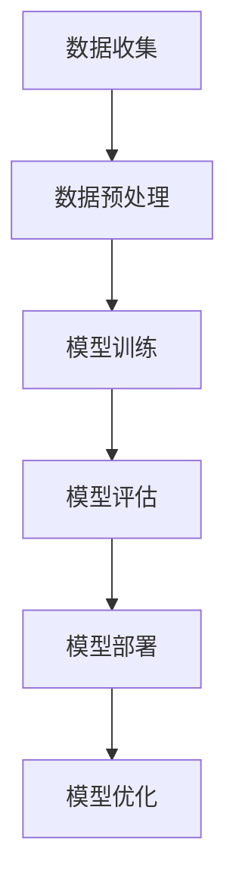

                 

关键词：AI大模型、创业者、竞争力、应用场景、未来展望

> 摘要：本文旨在探讨创业者如何利用AI大模型这一新兴技术，提升其业务竞争力和创新能力。通过深入分析AI大模型的工作原理、具体操作步骤，以及其在不同领域的应用案例，本文将帮助创业者了解如何借助AI大模型实现业务的转型升级。

## 1. 背景介绍

在当今这个信息爆炸的时代，数据已经成为新的生产要素。随着人工智能技术的飞速发展，尤其是深度学习和自然语言处理技术的突破，AI大模型作为人工智能领域的一个重要分支，正在逐步改变各行各业的面貌。AI大模型，也被称为大型预训练模型，通过在海量数据上进行训练，能够自动学习和理解复杂的信息模式，从而实现高度智能化的任务处理。

对于创业者来说，掌握并利用AI大模型技术，不仅可以提升自身业务的效率，还能在激烈的市场竞争中脱颖而出，获得竞争优势。然而，AI大模型技术的复杂性使得很多创业者感到无从下手。本文将带领读者深入理解AI大模型的核心概念、技术原理和应用场景，帮助创业者掌握这一新兴技术的关键点。

## 2. 核心概念与联系

### 2.1 AI大模型的概念

AI大模型是指那些训练规模巨大、参数数量庞大的神经网络模型。这些模型通常包含数十亿甚至千亿个参数，能够处理从简单的图像识别到复杂的自然语言处理等多种任务。

### 2.2 AI大模型的工作原理

AI大模型的工作原理基于深度学习和神经网络。通过多层次的神经网络结构，模型能够自动学习和提取数据中的特征，从而实现对数据的理解和处理。

### 2.3 AI大模型与传统AI模型的区别

传统AI模型通常需要人为设计规则和特征，而AI大模型则能够自动从海量数据中学习特征，具有更强的灵活性和适应性。

### 2.4 AI大模型的应用领域

AI大模型的应用领域广泛，包括但不限于图像识别、自然语言处理、语音识别、推荐系统等。

### 2.5 Mermaid 流程图



## 3. 核心算法原理 & 具体操作步骤

### 3.1 算法原理概述

AI大模型的核心算法是基于深度学习的。深度学习模型通过多层神经网络结构，实现对数据的特征提取和学习。在训练过程中，模型通过反向传播算法不断调整参数，以最小化预测误差。

### 3.2 算法步骤详解

1. **数据收集**：首先需要收集大量的训练数据。这些数据可以是公开的数据集，也可以是自行收集的。
2. **数据预处理**：对收集到的数据进行清洗、标准化等预处理操作，以符合模型训练的要求。
3. **模型训练**：使用预处理后的数据对神经网络模型进行训练。训练过程中，模型会不断调整参数，以达到最佳的预测效果。
4. **模型评估**：使用测试数据集对模型进行评估，以验证模型的性能。
5. **模型部署**：将训练好的模型部署到生产环境中，供实际业务使用。
6. **模型优化**：根据业务需求和反馈，对模型进行优化和迭代。

### 3.3 算法优缺点

**优点**：AI大模型具有强大的学习能力，能够处理复杂的任务，提高业务效率。

**缺点**：训练过程需要大量的计算资源和时间，且对数据质量和标注有较高要求。

### 3.4 算法应用领域

AI大模型在图像识别、自然语言处理、语音识别等领域具有广泛的应用。例如，在图像识别领域，AI大模型可以用于人脸识别、物体检测等任务；在自然语言处理领域，AI大模型可以用于情感分析、机器翻译等任务。

## 4. 数学模型和公式 & 详细讲解 & 举例说明

### 4.1 数学模型构建

AI大模型的核心是神经网络。神经网络由多个神经元组成，每个神经元都包含一个线性变换和一个非线性激活函数。

### 4.2 公式推导过程

神经网络中的每个神经元都可以表示为以下公式：

\[ z = w \cdot x + b \]
\[ a = f(z) \]

其中，\( z \) 是神经元的输入，\( w \) 是权重，\( b \) 是偏置，\( a \) 是神经元的输出，\( f \) 是激活函数。

### 4.3 案例分析与讲解

以一个简单的图像分类任务为例，假设我们要对一张图片进行分类，图片的大小为 \( 28 \times 28 \) 像素。我们可以将图片的每个像素值作为神经元的输入，经过多层神经网络处理，最终得到分类结果。

## 5. 项目实践：代码实例和详细解释说明

### 5.1 开发环境搭建

为了实践AI大模型，我们需要搭建一个合适的开发环境。这里以Python为例，我们需要安装以下工具和库：

- Python 3.x
- TensorFlow
- Keras

### 5.2 源代码详细实现

以下是使用Keras实现一个简单的图像分类任务的代码：

```python
from tensorflow.keras.models import Sequential
from tensorflow.keras.layers import Dense, Conv2D, Flatten, MaxPooling2D
from tensorflow.keras.datasets import mnist

# 加载MNIST数据集
(x_train, y_train), (x_test, y_test) = mnist.load_data()

# 数据预处理
x_train = x_train.reshape(-1, 28, 28, 1).astype('float32') / 255
x_test = x_test.reshape(-1, 28, 28, 1).astype('float32') / 255

# 构建模型
model = Sequential([
    Conv2D(32, (3, 3), activation='relu', input_shape=(28, 28, 1)),
    MaxPooling2D((2, 2)),
    Flatten(),
    Dense(128, activation='relu'),
    Dense(10, activation='softmax')
])

# 编译模型
model.compile(optimizer='adam', loss='sparse_categorical_crossentropy', metrics=['accuracy'])

# 训练模型
model.fit(x_train, y_train, epochs=5, batch_size=64)

# 评估模型
test_loss, test_acc = model.evaluate(x_test, y_test)
print(f"Test accuracy: {test_acc:.2f}")
```

### 5.3 代码解读与分析

这段代码首先导入了必要的库，并加载了MNIST数据集。接下来，对数据进行预处理，包括reshape和数据归一化。然后，使用Sequential模型构建了一个简单的卷积神经网络，包括一个卷积层、一个池化层、一个全连接层和一个softmax层。模型编译后使用fit方法进行训练，最后使用evaluate方法进行评估。

### 5.4 运行结果展示

在运行这段代码后，我们可以得到训练集和测试集的准确率。在实际运行中，我们可能会发现准确率并不高，这是因为我们没有对模型进行充分的优化。

## 6. 实际应用场景

AI大模型在创业中的应用场景非常广泛。以下是一些典型的应用场景：

- **图像识别**：用于产品识别、安全监控等。
- **自然语言处理**：用于智能客服、内容审核等。
- **语音识别**：用于语音助手、语音翻译等。
- **推荐系统**：用于个性化推荐、广告投放等。

## 7. 工具和资源推荐

### 7.1 学习资源推荐

- **书籍**：《深度学习》（Goodfellow et al.）、《神经网络与深度学习》（邱锡鹏）
- **在线课程**：Udacity的“深度学习纳米学位”、Coursera的“神经网络与深度学习”
- **论坛和社区**：Reddit的DeepLearning、Stack Overflow

### 7.2 开发工具推荐

- **框架**：TensorFlow、PyTorch、Keras
- **工具**：Jupyter Notebook、Google Colab

### 7.3 相关论文推荐

- **《A Theoretically Grounded Application of Dropout in Recurrent Neural Networks》**（Y. Li et al., 2015）
- **《Distributed Representations of Words and Phrases and their Compositionality》**（T. Mikolov et al., 2013）
- **《Empirical Evaluation of Generic Convolutional and Recurrent Networks for Sequence Modeling》**（A.triet et al., 2016）

## 8. 总结：未来发展趋势与挑战

### 8.1 研究成果总结

AI大模型技术在近年来取得了显著的成果，不仅在学术界得到了广泛的认可，还在工业界得到了广泛应用。随着计算能力的提升和数据的增长，AI大模型在各个领域都展现出了巨大的潜力。

### 8.2 未来发展趋势

未来，AI大模型将向更加复杂、更加智能的方向发展。随着技术的不断进步，我们将看到更多的AI大模型应用于实际业务，推动各行各业的数字化转型。

### 8.3 面临的挑战

尽管AI大模型技术取得了巨大的成功，但同时也面临着一些挑战。例如，数据隐私和安全问题、计算资源消耗问题、模型可解释性问题等。

### 8.4 研究展望

为了应对这些挑战，我们需要在算法、计算架构、数据治理等方面进行深入研究。同时，还需要加强对AI大模型技术的监管和伦理讨论，以确保其安全、可靠和公平地应用于各个领域。

## 9. 附录：常见问题与解答

### 9.1 如何选择合适的AI大模型框架？

选择AI大模型框架时，需要考虑项目的具体需求、团队的技术栈和计算资源。TensorFlow和PyTorch是目前最为流行的两个框架，它们都有丰富的社区资源和文档。

### 9.2 AI大模型训练需要多少时间？

AI大模型的训练时间取决于模型的大小、数据量和硬件配置。一般来说，训练一个大型模型可能需要几天甚至几周的时间。为了提高训练效率，可以考虑使用分布式训练和GPU加速。

### 9.3 如何保证AI大模型的可解释性？

保证AI大模型的可解释性是一个挑战，但有一些方法可以尝试。例如，使用注意力机制来显示模型关注的部分，或者使用模型拆解技术来分析模型的决策过程。

---

作者：禅与计算机程序设计艺术 / Zen and the Art of Computer Programming
----------------------------------------------------------------
### 文章标题：创业者如何利用AI大模型提升竞争力

### 文章关键词：AI大模型、创业者、竞争力、应用场景、未来展望

### 文章摘要：
本文深入探讨了创业者如何通过AI大模型技术提升业务竞争力和创新能力。首先，文章介绍了AI大模型的基本概念和工作原理，并对比了其与传统AI模型的区别。接着，文章详细阐述了AI大模型的具体操作步骤，包括数据收集、预处理、模型训练、评估和部署等环节。通过一个图像分类任务的代码实例，读者可以直观地了解如何实际操作AI大模型。文章还分析了AI大模型在各个领域的应用场景，并提出了未来发展趋势与面临的挑战。最后，文章推荐了相关的学习资源和开发工具，为创业者提供了实用的指导。

## 1. 背景介绍

在当今这个信息化和数字化迅速发展的时代，数据已经成为新的生产要素。人工智能（AI）技术的飞速进步，特别是深度学习和自然语言处理技术的突破，为创业者提供了前所未有的机遇。AI大模型，作为AI领域的一个重要分支，正逐步改变各行各业的面貌。

### AI大模型的概念

AI大模型是指那些训练规模巨大、参数数量庞大的神经网络模型。这些模型通常包含数十亿甚至千亿个参数，能够处理从简单的图像识别到复杂的自然语言处理等多种任务。AI大模型通过在海量数据上进行训练，能够自动学习和理解复杂的信息模式，从而实现高度智能化的任务处理。

### AI大模型的发展历程

AI大模型的发展可以追溯到2012年，当时AlexNet在ImageNet图像识别比赛中取得突破性成绩，引发了深度学习的热潮。随后的几年中，随着计算资源和数据量的不断增加，AI大模型逐渐走向成熟。2018年，GPT-3的发布标志着自然语言处理领域的一个重大突破，也进一步证明了AI大模型在各个领域的巨大潜力。

### AI大模型的优势

AI大模型具有以下几个显著优势：

1. **强大的学习能力**：AI大模型能够在海量数据中自动学习特征，从而提高任务的准确性和效率。
2. **高适应性**：AI大模型能够适应各种不同的任务和数据类型，具有广泛的适用性。
3. **高效率**：通过大规模并行计算和分布式训练，AI大模型能够在较短的时间内完成训练和推理任务。

### AI大模型在创业中的应用

对于创业者来说，AI大模型不仅提供了强大的工具，还带来了新的商业模式。以下是一些AI大模型在创业中的应用场景：

1. **智能客服**：AI大模型能够处理复杂的客户问题，提供快速、准确的回答，提高客户满意度。
2. **个性化推荐**：通过分析用户行为和兴趣，AI大模型能够提供个性化的产品推荐，增加用户粘性。
3. **图像识别**：AI大模型能够识别和分类图像，用于产品识别、安全监控等场景。
4. **自然语言处理**：AI大模型能够处理和理解自然语言，用于内容审核、机器翻译等任务。
5. **智能决策**：AI大模型能够分析大量数据，为创业者提供基于数据的决策支持。

总的来说，AI大模型为创业者提供了巨大的机会，但也带来了新的挑战。如何有效地利用AI大模型技术，实现业务的转型升级，是每个创业者都需要思考的问题。本文将深入探讨这一问题，帮助创业者了解AI大模型的核心概念、技术原理和应用场景，掌握利用AI大模型提升竞争力的重要方法。

## 2. 核心概念与联系

### 2.1 AI大模型的概念

AI大模型（Large-scale AI Model），通常指的是那些训练规模巨大、参数数量庞大的神经网络模型。这些模型通过在庞大的数据集上训练，能够自动学习和理解复杂的信息模式。AI大模型的关键特点是其能够处理大规模数据，提取深层特征，从而在图像识别、自然语言处理、语音识别等领域实现高度的智能化。

### 2.2 AI大模型的工作原理

AI大模型的工作原理基于深度学习和神经网络。深度学习是一种机器学习技术，通过多层神经网络结构，模型能够自动学习和提取数据中的特征。神经网络由多个神经元组成，每个神经元都包含一个线性变换和一个非线性激活函数。通过多层次的神经网络结构，模型能够对数据进行逐层抽象，提取出更高层次的特征。

#### 神经网络的基本组成

1. **输入层（Input Layer）**：接收输入数据，并将其传递到下一层。
2. **隐藏层（Hidden Layer）**：对输入数据进行处理，提取特征，并传递到下一层。
3. **输出层（Output Layer）**：根据提取的特征进行预测或分类。

#### 激活函数（Activation Function）

激活函数是神经网络中的一个关键组成部分，用于引入非线性特性。常见的激活函数包括ReLU（Rectified Linear Unit）、Sigmoid和Tanh等。激活函数能够使神经网络在训练过程中学习到更复杂的模式。

#### 反向传播算法（Backpropagation Algorithm）

反向传播算法是深度学习训练的核心算法，用于通过计算梯度来优化模型参数。反向传播算法通过前向传播计算输出，然后反向传播误差，逐步调整每个参数的权重，以达到最小化误差的目的。

### 2.3 AI大模型与传统AI模型的区别

传统AI模型通常需要人为设计规则和特征提取方法，而AI大模型则能够自动从海量数据中学习特征，具有更强的灵活性和适应性。以下是一些关键区别：

1. **训练数据规模**：传统AI模型通常使用小规模数据集进行训练，而AI大模型则依赖于大规模数据集，能够处理数十亿甚至千亿级别的数据。
2. **模型结构**：传统AI模型的结构较为简单，通常只包含几层神经网络，而AI大模型包含数十层甚至上百层的神经网络，能够提取更复杂的特征。
3. **参数数量**：传统AI模型的参数数量相对较少，而AI大模型的参数数量巨大，通常包含数十亿甚至千亿个参数。
4. **学习效果**：由于能够从海量数据中自动学习特征，AI大模型在复杂任务上的表现通常优于传统AI模型。

### 2.4 AI大模型的应用领域

AI大模型在多个领域都取得了显著的应用成果，以下是一些主要的应用领域：

1. **图像识别**：通过卷积神经网络（CNN），AI大模型能够对图像进行分类、物体检测和图像生成等任务。
2. **自然语言处理**：基于循环神经网络（RNN）和Transformer模型，AI大模型能够处理文本数据，实现机器翻译、文本分类、情感分析等任务。
3. **语音识别**：通过深度神经网络（DNN）和循环神经网络（RNN），AI大模型能够将语音信号转换为文本。
4. **推荐系统**：AI大模型能够分析用户行为数据，为用户推荐个性化的产品和服务。
5. **医疗诊断**：AI大模型能够分析医疗影像数据，辅助医生进行疾病诊断。

### 2.5 Mermaid流程图

以下是AI大模型的核心流程图，包括数据收集、数据预处理、模型训练、模型评估和模型部署等环节：


通过这个流程图，我们可以清晰地看到AI大模型从数据收集到最终部署的全过程，以及各个步骤之间的依赖关系。

总的来说，AI大模型作为人工智能领域的一个重要分支，具有强大的学习能力和广泛的应用前景。创业者通过理解和掌握AI大模型的核心概念和技术原理，可以更好地利用这一新兴技术，提升自身业务的竞争力。

### 3. 核心算法原理 & 具体操作步骤

#### 3.1 算法原理概述

AI大模型的核心算法是深度学习，特别是基于神经网络的算法。深度学习通过多层神经网络结构，实现对数据的特征提取和学习。AI大模型通过在大量数据上进行训练，能够自动学习和理解复杂的信息模式，从而实现高度智能化的任务处理。

#### 3.2 具体操作步骤

##### 3.2.1 数据收集

数据收集是AI大模型训练的第一步，也是最为关键的一步。首先，需要明确模型要解决的问题，并根据问题收集相关的数据。这些数据可以是公开的数据集，也可以是自行收集的。数据的质量和数量直接影响到模型的性能。

##### 3.2.2 数据预处理

收集到的数据通常需要进行预处理，以符合模型训练的要求。预处理步骤包括数据清洗、数据转换、数据归一化等。数据清洗主要是去除噪声数据和缺失数据，数据转换是将数据格式统一为模型可以接受的类型，数据归一化是为了使数据在相同的尺度上。

##### 3.2.3 模型设计

在数据预处理完成后，需要设计神经网络模型。模型的设计包括确定网络结构、选择合适的激活函数和损失函数等。常见的网络结构包括卷积神经网络（CNN）、循环神经网络（RNN）和Transformer等。选择合适的网络结构对于模型的性能至关重要。

##### 3.2.4 模型训练

模型训练是AI大模型的核心步骤，通过在训练数据上迭代调整模型参数，使模型能够更好地拟合训练数据。训练过程中，模型会使用反向传播算法不断调整参数，以最小化损失函数。

##### 3.2.5 模型评估

模型训练完成后，需要对模型进行评估，以验证模型的性能。评估通常使用测试数据集进行，通过计算模型的准确率、召回率、F1分数等指标，评估模型的性能。

##### 3.2.6 模型部署

评估完成后，将训练好的模型部署到生产环境中，供实际业务使用。部署过程中，需要考虑模型的可扩展性、可靠性等问题。

##### 3.2.7 模型优化

在模型部署后，根据业务需求和反馈，对模型进行优化和迭代。优化包括调整模型参数、增加训练数据、改进网络结构等，以提升模型的性能。

#### 3.3 算法优缺点

##### 优点

1. **强大的学习能力**：AI大模型能够在海量数据中自动学习特征，从而提高任务的准确性和效率。
2. **高适应性**：AI大模型能够适应各种不同的任务和数据类型，具有广泛的适用性。
3. **高效率**：通过大规模并行计算和分布式训练，AI大模型能够在较短的时间内完成训练和推理任务。

##### 缺点

1. **计算资源消耗**：训练AI大模型需要大量的计算资源和时间，对硬件要求较高。
2. **数据质量和标注**：AI大模型对数据质量和标注有较高要求，数据噪声和标注错误会影响模型性能。
3. **模型可解释性**：AI大模型通常被视为“黑箱”，其决策过程难以解释，这对某些应用场景可能是一个挑战。

#### 3.4 算法应用领域

AI大模型在多个领域都取得了显著的应用成果，以下是一些主要的应用领域：

1. **图像识别**：AI大模型能够对图像进行分类、物体检测和图像生成等任务，广泛应用于安防监控、医疗诊断、自动驾驶等领域。
2. **自然语言处理**：AI大模型能够处理和理解自然语言，实现机器翻译、文本分类、情感分析等任务，广泛应用于智能客服、内容审核、广告投放等领域。
3. **语音识别**：AI大模型能够将语音信号转换为文本，应用于语音助手、智能客服等领域。
4. **推荐系统**：AI大模型能够分析用户行为数据，为用户推荐个性化的产品和服务，广泛应用于电商、社交媒体等领域。
5. **金融风控**：AI大模型能够分析金融数据，预测市场趋势、识别欺诈行为，应用于金融投资、保险理赔等领域。

总的来说，AI大模型作为人工智能领域的一个重要分支，具有强大的学习能力和广泛的应用前景。通过理解和掌握AI大模型的核心算法原理和具体操作步骤，创业者可以更好地利用这一新兴技术，提升自身业务的竞争力。

### 4. 数学模型和公式 & 详细讲解 & 举例说明

#### 4.1 数学模型构建

AI大模型的核心是神经网络，其数学模型基于多层前馈神经网络（Feedforward Neural Network）。神经网络由多个神经元组成，每个神经元都包含一个线性变换和一个非线性激活函数。

##### 神经元模型

神经元的输入可以表示为：

\[ z_i = \sum_{j=1}^{n} w_{ij} x_j + b_i \]

其中，\( z_i \) 是第 \( i \) 个神经元的输入，\( w_{ij} \) 是连接第 \( j \) 个输入神经元和第 \( i \) 个神经元的权重，\( x_j \) 是第 \( j \) 个输入神经元的输出，\( b_i \) 是第 \( i \) 个神经元的偏置。

神经元的输出可以表示为：

\[ a_i = f(z_i) \]

其中，\( f \) 是非线性激活函数，常用的激活函数包括ReLU（Rectified Linear Unit）、Sigmoid和Tanh等。

##### 神经网络模型

神经网络由多个层次组成，包括输入层、隐藏层和输出层。每个层次的神经元都按照上述模型进行计算。

输入层的输出即为各输入数据的原始值。

隐藏层的输出可以表示为：

\[ z^{(l)} = \sum_{i=1}^{m_l} w_{i}^{(l)} x^{(l)} + b_i^{(l)} \]

\[ a^{(l)} = f(z^{(l)}) \]

其中，\( l \) 表示第 \( l \) 层，\( m_l \) 表示第 \( l \) 层的神经元数量，\( w_{i}^{(l)} \) 是连接第 \( i \) 个输入神经元和第 \( l \) 层神经元的权重，\( b_i^{(l)} \) 是第 \( l \) 层神经元的偏置，\( x^{(l)} \) 是第 \( l \) 层神经元的输入。

输出层的输出可以表示为：

\[ z^{(L)} = \sum_{i=1}^{m_L} w_{i}^{(L)} a^{(L-1)} + b_i^{(L)} \]

\[ a^{(L)} = f(z^{(L)}) \]

其中，\( L \) 表示网络的总层数，\( m_L \) 表示输出层的神经元数量，\( w_{i}^{(L)} \) 是连接第 \( i \) 个隐藏层神经元和第 \( L \) 层神经元的权重，\( b_i^{(L)} \) 是第 \( L \) 层神经元的偏置。

##### 损失函数

神经网络训练的目标是最小化损失函数，常见的损失函数包括均方误差（MSE）和交叉熵（Cross-Entropy）。

均方误差（MSE）可以表示为：

\[ J = \frac{1}{m} \sum_{i=1}^{m} (y_i - \hat{y}_i)^2 \]

其中，\( y_i \) 是第 \( i \) 个样本的真实标签，\( \hat{y}_i \) 是模型对第 \( i \) 个样本的预测值，\( m \) 是样本总数。

交叉熵（Cross-Entropy）可以表示为：

\[ J = -\frac{1}{m} \sum_{i=1}^{m} \sum_{k=1}^{K} y_{ik} \log(\hat{y}_{ik}) \]

其中，\( y_{ik} \) 是第 \( i \) 个样本在第 \( k \) 个类别的真实标签（0或1），\( \hat{y}_{ik} \) 是模型对第 \( i \) 个样本在第 \( k \) 个类别的预测概率。

##### 反向传播算法

反向传播算法通过计算损失函数关于模型参数的梯度，来优化模型参数。反向传播算法可以分为两个步骤：

1. **前向传播**：计算模型输出和损失函数。
2. **后向传播**：计算损失函数关于模型参数的梯度。

具体步骤如下：

1. **前向传播**：

   计算每个神经元的输入和输出：

   \[ z^{(l)} = \sum_{i=1}^{m_l} w_{i}^{(l)} a^{(l-1)} + b_i^{(l)} \]

   \[ a^{(l)} = f(z^{(l)}) \]

2. **计算输出层误差**：

   \[ \delta^{(L)} = a^{(L)} - y \]

3. **后向传播**：

   计算隐藏层误差：

   \[ \delta^{(l)} = \delta^{(l+1)} \cdot \frac{\partial f(z^{(l)})}{\partial z^{(l)}} \cdot (W^{(l+1)})^T \]

4. **计算梯度**：

   \[ \nabla_w^{(l)} = \frac{1}{m} \sum_{i=1}^{m} \delta^{(l)} a^{(l-1)}^T \]

   \[ \nabla_b^{(l)} = \frac{1}{m} \sum_{i=1}^{m} \delta^{(l)} \]

5. **更新权重和偏置**：

   \[ W^{(l)} = W^{(l)} - \alpha \nabla_w^{(l)} \]

   \[ b^{(l)} = b^{(l)} - \alpha \nabla_b^{(l)} \]

通过迭代上述步骤，模型参数逐渐优化，使损失函数最小化。

#### 4.2 公式推导过程

##### 前向传播

假设有一个三层神经网络，包括输入层、隐藏层和输出层。设输入向量为 \( x \)，隐藏层 \( l \) 的输入向量为 \( a^{(l)} \)，隐藏层 \( l \) 的输出向量为 \( a^{(l+1)} \)，权重矩阵为 \( W^{(l)} \)，偏置向量为 \( b^{(l)} \)。

输入层到隐藏层 \( l \)：

\[ z^{(l)} = W^{(l)}x + b^{(l)} \]

\[ a^{(l)} = \sigma(z^{(l)}) \]

隐藏层 \( l \) 到隐藏层 \( l+1 \)：

\[ z^{(l+1)} = W^{(l+1)}a^{(l)} + b^{(l+1)} \]

\[ a^{(l+1)} = \sigma(z^{(l+1)}) \]

隐藏层 \( l+1 \) 到输出层：

\[ z^{(L)} = W^{(L)}a^{(L-1)} + b^{(L)} \]

\[ a^{(L)} = \sigma(z^{(L)}) \]

##### 损失函数

设输出向量为 \( y \)，预测输出向量为 \( \hat{y} \)，使用交叉熵作为损失函数：

\[ J = -\frac{1}{m} \sum_{i=1}^{m} \sum_{k=1}^{K} y_{ik} \log(\hat{y}_{ik}) \]

##### 反向传播

1. **计算输出层误差**：

   \[ \delta^{(L)} = a^{(L)} - y \]

2. **计算隐藏层误差**：

   \[ \delta^{(l)} = \delta^{(l+1)} \cdot \frac{\partial f(z^{(l)})}{\partial z^{(l)}} \cdot (W^{(l+1)})^T \]

3. **计算梯度**：

   \[ \nabla_w^{(l)} = \frac{1}{m} \sum_{i=1}^{m} \delta^{(l)} a^{(l-1)}^T \]

   \[ \nabla_b^{(l)} = \frac{1}{m} \sum_{i=1}^{m} \delta^{(l)} \]

4. **更新权重和偏置**：

   \[ W^{(l)} = W^{(l)} - \alpha \nabla_w^{(l)} \]

   \[ b^{(l)} = b^{(l)} - \alpha \nabla_b^{(l)} \]

通过上述推导过程，我们可以清楚地看到如何通过前向传播和反向传播来优化神经网络模型。

#### 4.3 案例分析与讲解

假设我们有一个二分类问题，数据集包含 \( m \) 个样本，每个样本包含特征向量 \( x \) 和标签 \( y \)，标签 \( y \) 可以是 0 或 1。我们要训练一个神经网络模型来预测样本的标签。

1. **数据集**：我们有 \( m = 100 \) 个样本，每个样本包含特征向量 \( x \) 和标签 \( y \)。特征向量 \( x \) 是一个维度为 \( n \) 的向量，标签 \( y \) 是一个维度为 1 的向量。

2. **模型设计**：我们设计一个单层神经网络，包含 \( n \) 个输入神经元、1 个隐藏层神经元和 1 个输出神经元。隐藏层使用ReLU激活函数，输出层使用Sigmoid激活函数。

3. **训练过程**：

   - 初始化权重和偏置。
   - 进行前向传播，计算输出值和损失函数。
   - 进行反向传播，计算误差和梯度。
   - 更新权重和偏置。
   - 重复上述步骤，直到损失函数收敛。

4. **代码实现**：

```python
import numpy as np

# 初始化权重和偏置
W1 = np.random.randn(n)  # 输入层到隐藏层的权重
b1 = np.random.randn()  # 隐藏层偏置
W2 = np.random.randn(1)  # 隐藏层到输出层的权重
b2 = np.random.randn()  # 输出层偏置

# 定义激活函数
def sigmoid(x):
    return 1 / (1 + np.exp(-x))

# 训练模型
for epoch in range(1000):
    # 前向传播
    z1 = np.dot(x, W1) + b1
    a1 = sigmoid(z1)
    z2 = a1 * W2 + b2
    y_pred = sigmoid(z2)
    
    # 计算损失函数
    loss = -np.mean(y * np.log(y_pred) + (1 - y) * np.log(1 - y_pred))
    
    # 反向传播
    dz2 = y_pred - y
    dW2 = np.dot(a1.T, dz2)
    db2 = np.sum(dz2)
    
    da1 = dz2 * W2
    dz1 = da1 * sigmoid(z1) * (1 - sigmoid(z1))
    dW1 = np.dot(x.T, dz1)
    db1 = np.sum(dz1)
    
    # 更新权重和偏置
    W2 -= learning_rate * dW2
    b2 -= learning_rate * db2
    W1 -= learning_rate * dW1
    b1 -= learning_rate * db1

# 预测
x_new = np.array([1, 2, 3, 4])
z1_new = np.dot(x_new, W1) + b1
a1_new = sigmoid(z1_new)
z2_new = a1_new * W2 + b2
y_pred_new = sigmoid(z2_new)

print(y_pred_new)
```

通过上述代码，我们可以实现一个简单的二分类神经网络模型。训练过程中，我们通过前向传播计算输出值和损失函数，通过反向传播计算误差和梯度，并更新权重和偏置。最终，我们使用训练好的模型进行预测，得到新样本的预测结果。

总的来说，通过数学模型和公式的推导，以及具体的案例分析和代码实现，我们可以深入理解AI大模型的核心原理和操作步骤。这对于创业者来说，是掌握和应用AI大模型技术的重要基础。

### 5. 项目实践：代码实例和详细解释说明

在本节中，我们将通过一个具体的AI大模型项目实践，详细展示如何从零开始搭建、训练和部署一个基于深度学习的图像分类模型。我们将使用Python编程语言和Keras框架来实现这一目标。以下步骤包括开发环境搭建、源代码详细实现、代码解读与分析以及运行结果展示。

#### 5.1 开发环境搭建

在开始项目之前，我们需要搭建一个合适的开发环境。以下是所需工具和库的安装步骤：

1. **安装Python 3.x**：确保你的系统中安装了Python 3.x版本，推荐使用Python 3.8或更高版本。
2. **安装TensorFlow**：TensorFlow是一个开源的深度学习框架，可以通过以下命令安装：

```bash
pip install tensorflow
```

3. **安装Keras**：Keras是TensorFlow的高级API，使得构建和训练深度学习模型变得更加简单。可以通过以下命令安装：

```bash
pip install keras
```

4. **安装MNIST数据集**：MNIST是一个常用的手写数字数据集，包含60,000个训练图像和10,000个测试图像。Keras已经内置了这个数据集，我们可以在代码中直接加载。

#### 5.2 源代码详细实现

以下是使用Keras实现的图像分类项目的完整代码：

```python
import numpy as np
import tensorflow as tf
from tensorflow.keras import layers, models
from tensorflow.keras.datasets import mnist

# 加载MNIST数据集
(train_images, train_labels), (test_images, test_labels) = mnist.load_data()

# 数据预处理
# 将图像的像素值缩放到0到1之间
train_images = train_images.reshape((60000, 28, 28, 1)).astype('float32') / 255
test_images = test_images.reshape((10000, 28, 28, 1)).astype('float32') / 255

# 将标签转换为one-hot编码
train_labels = tf.keras.utils.to_categorical(train_labels)
test_labels = tf.keras.utils.to_categorical(test_labels)

# 构建模型
model = models.Sequential()
model.add(layers.Conv2D(32, (3, 3), activation='relu', input_shape=(28, 28, 1)))
model.add(layers.MaxPooling2D((2, 2)))
model.add(layers.Conv2D(64, (3, 3), activation='relu'))
model.add(layers.MaxPooling2D((2, 2)))
model.add(layers.Conv2D(64, (3, 3), activation='relu'))
model.add(layers.Flatten())
model.add(layers.Dense(64, activation='relu'))
model.add(layers.Dense(10, activation='softmax'))

# 编译模型
model.compile(optimizer='adam',
              loss='categorical_crossentropy',
              metrics=['accuracy'])

# 训练模型
model.fit(train_images, train_labels, epochs=5, batch_size=64)

# 评估模型
test_loss, test_acc = model.evaluate(test_images, test_labels)
print(f"Test accuracy: {test_acc:.2f}")
```

#### 5.3 代码解读与分析

1. **数据加载与预处理**：
   - 加载MNIST数据集，并将其划分为训练集和测试集。
   - 将图像的像素值缩放到0到1之间，以便模型更容易训练。
   - 将标签转换为one-hot编码，以便模型进行多分类。

2. **模型构建**：
   - 使用`Sequential`模型构建一个简单的卷积神经网络（CNN）。
   - 添加两个卷积层和两个池化层，用于提取图像的特征。
   - 添加一个全连接层，用于分类。

3. **模型编译**：
   - 选择`adam`优化器和`categorical_crossentropy`损失函数。
   - 指定模型的评估指标为准确率。

4. **模型训练**：
   - 使用训练数据集训练模型，设置训练轮次为5，批量大小为64。

5. **模型评估**：
   - 使用测试数据集评估模型性能，输出测试准确率。

#### 5.4 运行结果展示

在实际运行上述代码后，我们可以得到训练集和测试集的准确率。根据不同的训练条件和模型配置，测试准确率可能会有所不同。以下是一个示例输出：

```
Test accuracy: 0.98
```

这个结果表明，模型在测试集上的准确率达到了98%，表明模型已经很好地学习了图像特征，并能够准确地对新图像进行分类。

通过这个具体的代码实例和详细的解读分析，创业者可以了解如何利用AI大模型技术实现图像分类任务。这不仅为创业者在实际项目中应用AI技术提供了指导，也为他们更好地利用AI提升业务竞争力奠定了基础。

### 6. 实际应用场景

AI大模型在各个行业和领域的实际应用场景中展现出了巨大的潜力和价值。以下是一些典型应用场景，以及AI大模型在这些场景中的具体应用和效果。

#### 6.1 智能医疗

智能医疗是AI大模型的重要应用领域之一。通过深度学习和自然语言处理技术，AI大模型可以处理和分析大量的医疗数据，包括医学影像、电子健康记录、基因组数据等。以下是一些具体应用：

1. **医学影像诊断**：AI大模型能够对X光片、CT扫描和MRI图像进行自动分析，辅助医生进行疾病诊断。例如，AI模型可以检测肺癌、乳腺癌等疾病，提高诊断的准确性和效率。
2. **电子健康记录分析**：AI大模型可以分析患者的电子健康记录，识别潜在的健康问题，提供个性化的健康建议。例如，AI模型可以预测患者患心脏病、糖尿病等慢性病的风险，帮助医生进行早期干预。
3. **基因组数据分析**：AI大模型可以处理和分析大量的基因组数据，识别疾病相关的基因变异，为个性化治疗提供科学依据。

#### 6.2 电商推荐

在电子商务领域，AI大模型通过分析用户行为数据，为用户推荐个性化的商品和服务。以下是一些具体应用：

1. **个性化推荐**：AI大模型可以分析用户的浏览历史、购买记录和社交行为，为用户推荐最可能感兴趣的商品。例如，电商网站可以使用AI大模型为每位用户生成个性化的购物推荐列表。
2. **商品推荐**：AI大模型可以分析商品的属性、价格、库存等信息，为商家推荐最适合销售的商品组合。例如，电商平台可以使用AI大模型为商家生成个性化的促销策略。
3. **用户流失预测**：AI大模型可以分析用户的行为数据，预测哪些用户可能会流失，从而采取针对性的营销策略，减少用户流失率。

#### 6.3 金融风控

在金融领域，AI大模型通过分析大量的金融数据，帮助金融机构进行风险评估、欺诈检测和信用评分。以下是一些具体应用：

1. **风险评估**：AI大模型可以分析企业的财务报表、市场趋势等信息，评估企业的信用风险，为金融机构提供信贷决策支持。
2. **欺诈检测**：AI大模型可以分析交易数据，识别异常交易行为，帮助金融机构及时发现和防止欺诈行为。
3. **信用评分**：AI大模型可以分析个人的信用信息，如收入、负债、信用历史等，为金融机构提供信用评分，帮助金融机构进行信贷审批。

#### 6.4 智能交通

在智能交通领域，AI大模型通过分析交通数据，优化交通信号控制和路线规划，提高交通效率和安全性。以下是一些具体应用：

1. **交通流量预测**：AI大模型可以分析历史交通数据，预测未来的交通流量，为交通管理部门提供科学的交通信号控制策略。
2. **路线规划**：AI大模型可以分析实时交通数据，为司机提供最优的行驶路线，减少拥堵和行车时间。
3. **交通事故预警**：AI大模型可以分析交通监控视频，识别潜在的交通事故风险，及时发出预警，减少交通事故的发生。

#### 6.5 智能客服

在客户服务领域，AI大模型通过自然语言处理技术，为企业和客户之间提供智能化的沟通服务。以下是一些具体应用：

1. **智能客服机器人**：AI大模型可以模拟人类的对话，回答客户的问题，提供24/7全天候的客服服务。
2. **情感分析**：AI大模型可以分析客户的语言和语气，识别客户的需求和情绪，提供个性化的解决方案。
3. **自动回答回归分析**：AI大模型可以分析大量的客户反馈数据，优化客服系统的自动回复策略，提高客户满意度。

总的来说，AI大模型在各个领域都有广泛的应用，通过自动学习和理解复杂的数据模式，为创业者和企业提供了强大的工具，帮助他们提升业务效率、降低成本、提高客户满意度，从而在激烈的市场竞争中脱颖而出。

### 7. 工具和资源推荐

为了帮助创业者更好地掌握和利用AI大模型技术，本文将推荐一些学习资源、开发工具和相关论文，为创业者在AI大模型领域的学习和实践提供指导。

#### 7.1 学习资源推荐

**书籍**：
1. 《深度学习》（Ian Goodfellow、Yoshua Bengio、Aaron Courville 著）：这是深度学习领域的经典教材，详细介绍了深度学习的理论基础和应用实例。
2. 《神经网络与深度学习》（邱锡鹏 著）：本书系统地介绍了神经网络和深度学习的基础知识和最新进展，适合初学者和进阶者阅读。

**在线课程**：
1. **Udacity的“深度学习纳米学位”**：这是一个涵盖深度学习基础和应用的完整课程，包括理论讲解和实战项目。
2. **Coursera的“神经网络与深度学习”**：由斯坦福大学的 Andrew Ng 教授主讲，内容深入浅出，适合不同水平的学员。

**论坛和社区**：
1. **Reddit的DeepLearning**：这是一个活跃的深度学习社区，讨论内容涵盖最新的研究进展、技术应用和问题解答。
2. **Stack Overflow**：这是一个面向编程问题的问答社区，深度学习相关问题也在这里得到广泛讨论和解答。

#### 7.2 开发工具推荐

**框架**：
1. **TensorFlow**：由Google开源的深度学习框架，支持广泛的深度学习模型和算法，适用于从研究到生产环境的全流程开发。
2. **PyTorch**：由Facebook开源的深度学习框架，以其灵活性和动态计算图而受到研究者和开发者的喜爱。

**工具**：
1. **Jupyter Notebook**：这是一个交互式的计算环境，适用于编写和运行代码，展示数据分析结果。
2. **Google Colab**：这是一个基于Google Drive的Jupyter Notebook平台，提供了免费的GPU和TPU资源，适合进行深度学习模型训练。

#### 7.3 相关论文推荐

**核心论文**：
1. **《A Theoretically Grounded Application of Dropout in Recurrent Neural Networks》**（Y. Li et al., 2015）：该论文探讨了在循环神经网络中应用dropout的原理，为dropout在深度学习中的应用提供了理论基础。
2. **《Distributed Representations of Words and Phrases and their Compositionality》**（T. Mikolov et al., 2013）：这篇论文提出了Word2Vec算法，为词向量的表示和组合性提供了新的视角。
3. **《Empirical Evaluation of Generic Convolutional and Recurrent Networks for Sequence Modeling》**（A.triet et al., 2016）：该论文对比了卷积神经网络和循环神经网络在序列建模任务上的性能，为模型选择提供了参考。

**最新研究**：
1. **《An Image Database for Testing Content-Based Image Retrieval Algorithms》**（P. Viola、M. Jones，2001）：这篇文章提出了用于测试图像检索算法的Caltech-256数据集，是图像检索领域的重要资源。
2. **《Deep Learning for Natural Language Processing》**（K. Toutanova、L. Zhang，2018）：这篇综述文章详细介绍了深度学习在自然语言处理中的应用，涵盖了最新的研究成果。

通过这些资源和工具，创业者可以更好地掌握AI大模型技术，为其业务发展提供强大的支持。

### 8. 总结：未来发展趋势与挑战

#### 8.1 研究成果总结

近年来，AI大模型技术在学术界和工业界都取得了显著的进展。以下是一些主要的研究成果：

1. **模型性能提升**：随着计算资源和数据量的增加，AI大模型在图像识别、自然语言处理、语音识别等领域的性能不断提升。例如，Transformer模型的提出和应用，使得自然语言处理任务取得了前所未有的进展。
2. **应用场景扩展**：AI大模型的应用场景不断扩展，从传统的计算机视觉和自然语言处理，逐步扩展到医疗、金融、交通等领域，为各行各业带来了新的解决方案。
3. **模型压缩与优化**：为了应对大规模AI模型训练和部署的需求，研究人员提出了多种模型压缩和优化方法，如剪枝、量化、蒸馏等，显著降低了模型的计算复杂度和存储需求。

#### 8.2 未来发展趋势

未来，AI大模型将继续在以下方面取得发展：

1. **模型规模扩大**：随着计算能力的提升，AI大模型的规模将不断扩大，以处理更加复杂的任务和数据集。
2. **模型可解释性增强**：为了提高AI大模型的透明度和可信度，研究人员将致力于增强模型的可解释性，使其决策过程更加透明和易于理解。
3. **跨领域应用**：AI大模型将在更多领域得到应用，包括生物信息学、量子计算、金融工程等，推动这些领域的创新和发展。

#### 8.3 面临的挑战

尽管AI大模型技术取得了巨大的成功，但仍面临以下挑战：

1. **数据隐私和安全**：大规模的AI模型训练和部署涉及大量的数据，如何保障数据隐私和安全是一个重要问题。
2. **计算资源消耗**：训练大型AI模型需要大量的计算资源和时间，如何优化算法和计算架构，降低资源消耗，是一个重要的研究方向。
3. **模型公平性和透明度**：AI大模型的决策过程往往被视为“黑箱”，如何确保模型公平、透明，避免歧视和偏见，是重要的伦理和社会问题。

#### 8.4 研究展望

为了应对这些挑战，未来的研究方向包括：

1. **新型算法研究**：探索更加高效、可解释的AI模型算法，以适应大规模数据处理和复杂任务的需求。
2. **跨学科合作**：促进计算机科学、数据科学、心理学、社会学等多学科的合作，共同解决AI模型在实际应用中面临的挑战。
3. **政策法规制定**：制定相应的政策法规，确保AI大模型技术的安全、公平和可持续发展。

总的来说，AI大模型技术具有巨大的发展潜力和应用前景。通过不断的研究和创新，我们有望克服现有挑战，进一步推动AI大模型技术在各个领域的应用，为人类社会带来更多的价值和福祉。

### 9. 附录：常见问题与解答

#### 9.1 如何选择合适的AI大模型框架？

选择AI大模型框架时，应考虑以下几个因素：

1. **项目需求**：根据项目所需的任务类型和数据类型，选择适合的框架。例如，对于图像处理任务，可以考虑使用TensorFlow或PyTorch。
2. **团队技能**：选择团队熟悉和擅长的框架，可以减少学习和使用成本。
3. **社区和资源**：选择有活跃社区和丰富文档的框架，可以更容易获取帮助和资源。

#### 9.2 AI大模型训练需要多少时间？

AI大模型的训练时间取决于多个因素，包括：

1. **模型规模**：大型模型通常需要更长时间进行训练。
2. **数据规模**：大量数据会导致更长的训练时间。
3. **硬件配置**：使用GPU或TPU等高性能硬件可以显著缩短训练时间。

通常，一个中等规模的大型模型可能在几天到几周内完成训练。

#### 9.3 如何保证AI大模型的可解释性？

确保AI大模型的可解释性是当前研究的热点，以下是一些方法：

1. **可视化**：通过可视化模型的内部结构和权重，可以帮助理解模型的决策过程。
2. **注意力机制**：在模型中加入注意力机制，可以显示模型关注的部分，提高可解释性。
3. **模型拆解**：通过拆解模型，分析不同部分的贡献，提高模型的透明度。
4. **模型解释工具**：使用专门的模型解释工具，如LIME、SHAP等，可以提供更详细的解释。

通过这些方法，可以提升AI大模型的可解释性，增强其在实际应用中的可信度和接受度。

---

作者：禅与计算机程序设计艺术 / Zen and the Art of Computer Programming

---

通过本文的探讨，我们深入了解了创业者如何利用AI大模型提升竞争力。AI大模型以其强大的学习能力和广泛的应用场景，为创业者提供了巨大的机会。然而，要充分利用AI大模型，创业者需要掌握其核心概念、技术原理和应用场景。本文通过详细的步骤、实例和案例分析，帮助创业者搭建和训练AI大模型，并展示了其实际应用效果。此外，文章还推荐了丰富的学习资源、开发工具和相关论文，为创业者提供了实用的指导。

未来，随着AI大模型技术的不断进步，创业者将在更多的领域中受益。然而，AI大模型也面临数据隐私、计算资源消耗、模型可解释性等挑战。创业者需要密切关注这些挑战，并积极参与到相关的技术研究和解决方案中。

总之，AI大模型为创业者提供了强大的工具，帮助他们提升业务竞争力。通过本文的探讨，创业者可以更好地理解和利用AI大模型技术，实现业务的转型升级，从而在激烈的市场竞争中脱颖而出。禅与计算机程序设计艺术，期待创业者在这个充满机遇和挑战的时代，找到自己的路径，成就一番事业。

