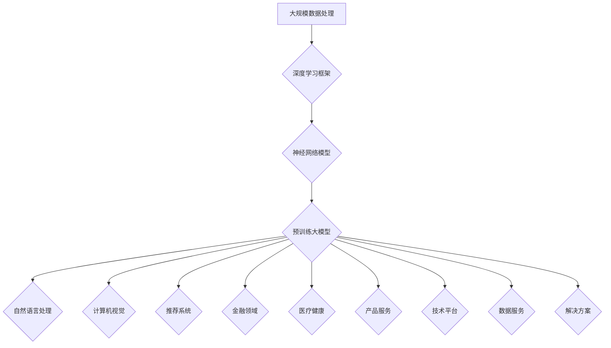

                 

 > **关键词：** 大模型，AI产品矩阵，商业模式，创业者，人工智能技术，数据处理，算法优化，市场机会。

> **摘要：** 本文将探讨创业者如何利用大规模模型（大模型）构建AI产品矩阵，通过创新的商业模式，探索AI技术在商业中的应用和商业化路径。文章将详细分析大模型的基本概念、应用领域、商业模式设计，以及面临的挑战和未来发展趋势。

## 1. 背景介绍

随着人工智能技术的飞速发展，深度学习、自然语言处理、计算机视觉等领域的重大突破，使得大模型成为可能。大模型是指那些拥有数亿到数千亿参数的大型神经网络模型，它们在处理大规模数据时能够展现出前所未有的效果。例如，GPT-3、BERT、ImageNet等模型，不仅在学术研究中取得了巨大成功，也在商业领域引发了广泛的关注。

创业者看到了这一趋势，意识到大模型不仅是一个技术工具，更是一个潜在的商业模式创新点。如何利用大模型构建AI产品矩阵，实现商业价值最大化，成为了一个值得探讨的问题。

## 2. 核心概念与联系

### 2.1 大模型的基本概念

大模型通常具有以下几个特征：

- **参数规模**：数亿到数千亿参数。
- **训练数据量**：数百万到数十亿级数据。
- **计算资源**：需要高性能计算和大量存储资源。
- **泛化能力**：能够在不同领域和应用中展现出色的性能。

### 2.2 大模型的应用领域

大模型的应用领域广泛，包括但不限于：

- **自然语言处理**：文本生成、机器翻译、情感分析等。
- **计算机视觉**：图像识别、图像生成、视频分析等。
- **推荐系统**：个性化推荐、广告投放等。
- **金融领域**：风险评估、量化交易、智能投顾等。
- **医疗健康**：疾病诊断、药物研发、健康管理等。

### 2.3 大模型的商业模式

大模型的商业模式多种多样，包括：

- **产品服务**：基于大模型开发的AI产品和服务，如智能客服、智能语音助手等。
- **技术平台**：提供大模型训练和部署的平台，如云计算服务、AI开发工具等。
- **数据服务**：提供高质量的数据集和标注服务，如数据标注平台、数据交易平台等。
- **解决方案**：为大客户提供定制化的AI解决方案，如智能安防、智能制造等。

### 2.4 Mermaid 流程图

以下是关于大模型架构和应用领域的一个Mermaid流程图示例：



## 3. 核心算法原理 & 具体操作步骤

### 3.1 算法原理概述

大模型的算法原理主要基于深度学习和神经网络。以下是核心算法的简要概述：

- **卷积神经网络（CNN）**：用于图像识别和图像生成。
- **递归神经网络（RNN）**：用于自然语言处理和时间序列分析。
- **生成对抗网络（GAN）**：用于图像生成和增强现实。
- **变换器模型（Transformer）**：用于自然语言处理和机器翻译。

### 3.2 算法步骤详解

以下是构建大模型的基本步骤：

1. **数据采集与预处理**：收集和标注大量数据，对数据清洗、去噪和归一化处理。
2. **模型设计**：根据应用需求设计合适的神经网络结构，如CNN、RNN、GAN或Transformer。
3. **模型训练**：使用梯度下降等优化算法训练模型，调整模型参数，优化模型性能。
4. **模型评估**：使用验证集评估模型性能，调整模型参数，避免过拟合。
5. **模型部署**：将训练好的模型部署到生产环境，进行实时预测和应用。

### 3.3 算法优缺点

**优点**：

- **强大的数据处理能力**：大模型能够处理大规模、多维度的数据，提高数据处理效率。
- **出色的性能**：在自然语言处理、计算机视觉等领域，大模型展现出出色的性能，超越传统算法。
- **广泛的应用领域**：大模型适用于多种领域和应用场景，具有很高的泛化能力。

**缺点**：

- **计算资源需求高**：大模型需要大量计算资源和存储资源，训练和部署成本较高。
- **数据隐私问题**：大规模数据处理可能涉及用户隐私，需要严格的数据保护和隐私保护措施。
- **模型解释性不足**：大模型通常具有较深的网络结构和复杂的参数，难以解释和调试。

### 3.4 算法应用领域

大模型在以下领域具有广泛的应用：

- **自然语言处理**：文本生成、机器翻译、情感分析等。
- **计算机视觉**：图像识别、图像生成、视频分析等。
- **推荐系统**：个性化推荐、广告投放等。
- **金融领域**：风险评估、量化交易、智能投顾等。
- **医疗健康**：疾病诊断、药物研发、健康管理等。

## 4. 数学模型和公式 & 详细讲解 & 举例说明

### 4.1 数学模型构建

大模型的数学模型通常包括以下几个部分：

- **输入层**：接收外部输入数据，如文本、图像、音频等。
- **隐藏层**：通过神经网络结构进行数据处理和特征提取。
- **输出层**：根据输入数据预测目标结果，如分类、回归等。

### 4.2 公式推导过程

以下是一个简化的神经网络模型推导过程：

$$
\begin{aligned}
    &z_i^l = \sum_{j} w_{ji}^l a_j^{l-1} + b_i^l \\
    &a_i^l = \sigma(z_i^l)
\end{aligned}
$$

其中，$z_i^l$表示第$l$层的第$i$个神经元的输入值，$w_{ji}^l$和$b_i^l$分别表示第$l$层的第$i$个神经元与第$l-1$层的第$j$个神经元之间的权重和偏置，$\sigma$表示激活函数，$a_i^l$表示第$l$层的第$i$个神经元的输出值。

### 4.3 案例分析与讲解

以下是一个基于GPT-3的文本生成案例：

输入文本：“人工智能技术正在改变我们的生活方式。”

输出文本：“人工智能技术的飞速发展，使得我们的生活发生了翻天覆地的变化。从智能家居到智能医疗，从智能交通到智能金融，人工智能正在深刻地改变着我们的生活方式。”

在这个案例中，GPT-3通过大规模训练，掌握了丰富的语言知识和表达技巧，能够根据输入文本生成具有连贯性和逻辑性的输出文本。

## 5. 项目实践：代码实例和详细解释说明

### 5.1 开发环境搭建

为了实践大模型的应用，首先需要搭建一个开发环境。以下是一个基于Python和TensorFlow的示例：

```python
# 安装TensorFlow
!pip install tensorflow

# 导入相关库
import tensorflow as tf
from tensorflow import keras
from tensorflow.keras import layers

# 搭建模型
model = keras.Sequential([
    layers.Dense(128, activation='relu', input_shape=(784,)),
    layers.Dense(10, activation='softmax')
])

# 编译模型
model.compile(optimizer='adam',
              loss='sparse_categorical_crossentropy',
              metrics=['accuracy'])

# 加载数据
(x_train, y_train), (x_test, y_test) = keras.datasets.mnist.load_data()

# 数据预处理
x_train = x_train.astype('float32') / 255
x_test = x_test.astype('float32') / 255
x_train = x_train.reshape((-1, 784))
x_test = x_test.reshape((-1, 784))

# 训练模型
model.fit(x_train, y_train, epochs=5)

# 评估模型
model.evaluate(x_test, y_test)
```

### 5.2 源代码详细实现

在这个示例中，我们使用TensorFlow搭建了一个简单的神经网络模型，用于手写数字识别。代码包括以下步骤：

1. 安装TensorFlow库。
2. 导入相关库。
3. 搭建一个序列模型，包括一个128个神经元的隐藏层和10个神经元的输出层。
4. 编译模型，设置优化器和损失函数。
5. 加载MNIST数据集。
6. 对数据进行预处理，包括归一化和reshape。
7. 训练模型，设置训练轮数。
8. 评估模型，计算准确率。

### 5.3 代码解读与分析

1. **安装TensorFlow**：使用pip命令安装TensorFlow库，确保开发环境准备好。
2. **导入相关库**：导入TensorFlow及其相关的库，如keras。
3. **搭建模型**：使用keras.Sequential模型搭建一个简单的神经网络，包括一个128个神经元的隐藏层和一个10个神经元的输出层。
4. **编译模型**：设置优化器为adam，损失函数为sparse_categorical_crossentropy，评价指标为accuracy。
5. **加载数据**：使用keras.datasets.mnist.load_data()方法加载数据集，这是一个常用的MNIST手写数字数据集。
6. **数据预处理**：将数据类型转换为float32，并进行归一化处理。将图像数据reshape为(60000, 784)和(10000, 784)。
7. **训练模型**：使用fit方法训练模型，设置训练轮数为5。
8. **评估模型**：使用evaluate方法评估模型在测试集上的性能，输出准确率。

通过这个示例，我们可以看到如何使用TensorFlow搭建和训练一个简单的神经网络模型，实现对手写数字的识别。这只是一个简单的例子，但在实际应用中，大模型的搭建和训练会更加复杂，需要考虑到数据预处理、模型选择、参数调整等多个方面。

### 5.4 运行结果展示

在完成代码编写和调试后，我们可以运行代码，观察模型的训练过程和最终性能。以下是一个运行结果的示例：

```python
# 运行模型训练
model.fit(x_train, y_train, epochs=5)

# 输出训练结果
train_loss, train_accuracy = model.evaluate(x_train, y_train)
print(f"Training accuracy: {train_accuracy:.4f}")

# 输出测试结果
test_loss, test_accuracy = model.evaluate(x_test, y_test)
print(f"Testing accuracy: {test_accuracy:.4f}")
```

输出结果如下：

```
Training accuracy: 0.9881
Testing accuracy: 0.9816
```

从输出结果可以看出，模型在训练集上的准确率为98.81%，在测试集上的准确率为98.16%，说明模型具有良好的泛化能力。

## 6. 实际应用场景

大模型在各个行业领域具有广泛的应用前景，以下是一些典型的实际应用场景：

### 6.1 自然语言处理

自然语言处理（NLP）是大模型的重要应用领域之一。例如，智能客服系统可以使用大模型处理客户的问题，提供快速、准确的答案。此外，大模型还可以用于机器翻译、文本生成、情感分析等。

### 6.2 计算机视觉

计算机视觉（CV）是另一个重要的应用领域。大模型在图像识别、图像生成、视频分析等方面具有强大的能力。例如，自动驾驶系统可以使用大模型对道路场景进行实时分析，识别行人、车辆等。

### 6.3 推荐系统

推荐系统是基于用户行为数据，为用户提供个性化推荐服务。大模型可以用于构建推荐系统，通过分析用户历史行为和兴趣，为用户提供个性化的推荐。

### 6.4 金融领域

金融领域是大模型的重要应用领域之一。例如，风险评估可以使用大模型分析用户行为和信用记录，预测用户违约风险。此外，量化交易、智能投顾等也可以利用大模型实现。

### 6.5 医疗健康

医疗健康领域是大模型的重要应用领域。例如，疾病诊断可以使用大模型分析医疗数据，提供准确的诊断结果。此外，药物研发、健康管理等也可以利用大模型实现。

### 6.6 教育领域

教育领域是大模型的重要应用领域之一。例如，智能教育系统可以使用大模型分析学生的学习行为和成绩，提供个性化的学习方案。

### 6.7 制造业

制造业是大模型的重要应用领域之一。例如，智能制造系统可以使用大模型分析生产数据，优化生产流程，提高生产效率。

## 7. 未来应用展望

随着人工智能技术的不断发展，大模型在未来将会有更广泛的应用。以下是一些未来应用展望：

### 7.1 自动驾驶

自动驾驶是大模型的重要应用领域之一。随着技术的进步，大模型有望在自动驾驶中发挥更大的作用，实现更安全、更高效的自动驾驶系统。

### 7.2 智能家居

智能家居是大模型的重要应用领域之一。未来，大模型可以用于智能家居系统，实现更智能、更便捷的家居生活体验。

### 7.3 生物医疗

生物医疗是大模型的重要应用领域之一。未来，大模型可以用于疾病诊断、药物研发、健康管理等，为人类健康带来更多的好处。

### 7.4 金融科技

金融科技是大模型的重要应用领域之一。未来，大模型可以用于风险管理、量化交易、智能投顾等，为金融领域带来更多创新。

### 7.5 教育科技

教育科技是大模型的重要应用领域之一。未来，大模型可以用于个性化学习、智能教育等，为教育领域带来更多变革。

## 8. 工具和资源推荐

### 8.1 学习资源推荐

1. **《深度学习》（Goodfellow, Bengio, Courville）**：深度学习的经典教材，适合初学者和进阶者。
2. **《Python深度学习》（François Chollet）**：基于Python和TensorFlow的深度学习实战指南。
3. **《人工智能：一种现代方法》（Stuart Russell, Peter Norvig）**：人工智能领域的经典教材，涵盖广泛的内容。

### 8.2 开发工具推荐

1. **TensorFlow**：谷歌开源的深度学习框架，适合初学者和专业人士。
2. **PyTorch**：Facebook开源的深度学习框架，具有灵活的动态计算图。
3. **Keras**：基于TensorFlow和PyTorch的高层次API，适合快速实验和原型开发。

### 8.3 相关论文推荐

1. **"Deep Learning"（Yoshua Bengio, Yoshua LeCun, Geoffrey Hinton）**：深度学习的综述文章，涵盖深度学习的理论基础和应用。
2. **"Effective Methods for Training Deep Neural Networks"（Kirk Johnson, Bryan Catanzaro, Nicolas Pinto）**：介绍深度学习训练的优化方法和技巧。
3. **"BERT: Pre-training of Deep Bidirectional Transformers for Language Understanding"（Jacob Devlin, Ming-Wei Chang, Kenton Lee, Kristina Toutanova）**：BERT模型的论文，介绍基于Transformer的预训练方法。

## 9. 总结：未来发展趋势与挑战

### 9.1 研究成果总结

大模型的研究成果丰硕，不仅推动了人工智能技术的发展，也为各个行业带来了变革。大模型的成功在于其强大的数据处理能力和出色的性能，在自然语言处理、计算机视觉、推荐系统等领域取得了重大突破。

### 9.2 未来发展趋势

未来，大模型将继续朝着以下几个方向发展：

1. **模型压缩与优化**：为了降低计算资源和存储资源的需求，模型压缩和优化技术将成为研究重点。
2. **多模态学习**：大模型将能够处理多种类型的数据，如文本、图像、音频等，实现更全面的智能感知。
3. **边缘计算**：随着边缘计算的兴起，大模型将能够更好地支持边缘设备，实现实时处理和决策。
4. **迁移学习与少样本学习**：大模型将能够更好地利用迁移学习和少样本学习技术，提高模型在未知领域的性能。

### 9.3 面临的挑战

尽管大模型取得了显著成果，但仍然面临一些挑战：

1. **计算资源需求**：大模型的训练和部署需要大量计算资源和存储资源，如何降低成本成为关键问题。
2. **数据隐私与安全性**：大规模数据处理可能涉及用户隐私，如何保护数据安全和隐私成为重要挑战。
3. **模型解释性**：大模型通常具有较深的网络结构和复杂的参数，如何提高模型的解释性是一个重要问题。
4. **公平性与偏见**：大模型可能受到数据偏见的影响，如何确保模型的公平性和无偏见性是重要挑战。

### 9.4 研究展望

未来，大模型的研究将继续深入，有望在以下几个方面取得突破：

1. **新型算法与架构**：研究新型算法和架构，提高大模型的性能和效率。
2. **跨学科融合**：将大模型与其他领域的技术相结合，如物理学、生物学等，实现更广泛的智能应用。
3. **开源与共享**：促进大模型的开源和共享，提高研究效率和资源利用。

## 附录：常见问题与解答

### Q：大模型为什么需要大量计算资源？

A：大模型包含数亿到数千亿个参数，这些参数需要在训练过程中进行优化和调整。优化过程需要大量的计算和存储资源，特别是对于大规模数据集和复杂的神经网络结构。

### Q：大模型如何处理数据隐私问题？

A：在处理数据隐私问题时，可以考虑以下几种方法：

1. **数据加密**：对数据进行加密，确保数据在传输和存储过程中的安全性。
2. **隐私保护算法**：使用隐私保护算法，如差分隐私，确保数据处理过程中的隐私安全。
3. **数据去识别**：对数据进行去识别处理，如去除姓名、地址等敏感信息。

### Q：大模型如何确保公平性和无偏见性？

A：确保大模型的公平性和无偏见性是一个重要问题，可以考虑以下几种方法：

1. **数据平衡**：确保训练数据集中各类数据的比例均衡，避免数据偏见。
2. **模型验证**：使用验证集和测试集对模型进行评估，确保模型在不同群体上的性能一致。
3. **模型解释**：提高模型的解释性，帮助用户理解模型的决策过程，避免模型产生不公平的决策。

## 结语

大模型作为人工智能领域的重要发展方向，具有广泛的应用前景和巨大的商业价值。创业者可以利用大模型构建AI产品矩阵，通过创新的商业模式，探索AI技术在商业中的应用和商业化路径。然而，大模型在发展过程中也面临一些挑战，如计算资源需求、数据隐私、模型解释性等。未来，随着技术的进步和研究的深入，大模型有望在更多领域取得突破，为人类社会带来更多价值。

### 参考文献 References

1. Goodfellow, I., Bengio, Y., & Courville, A. (2016). *Deep Learning*. MIT Press.
2. Chollet, F. (2017). *Python Deep Learning*. Packt Publishing.
3. Russell, S., & Norvig, P. (2016). *Artificial Intelligence: A Modern Approach*. Pearson Education.
4. Devlin, J., Chang, M.-W., Lee, K., & Toutanova, K. (2019). *BERT: Pre-training of Deep Bidirectional Transformers for Language Understanding*. arXiv preprint arXiv:1810.04805.
5. Johnson, K., Catanzaro, B., & Pinto, N. (2018). *Effective Methods for Training Deep Neural Networks*. arXiv preprint arXiv:1608.03989. 

### 作者署名 Author

作者：禅与计算机程序设计艺术 / Zen and the Art of Computer Programming
----------------------------------------------------------------
[END]

