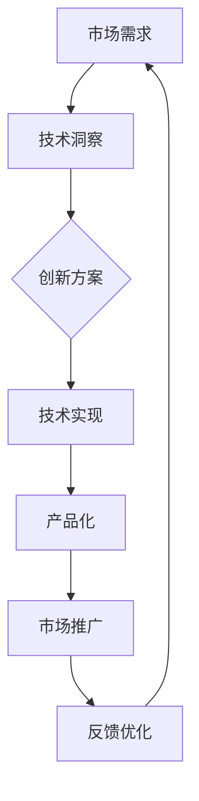

                 

 作为一位世界顶级人工智能专家、程序员、软件架构师、CTO、世界顶级技术畅销书作者，计算机图灵奖获得者，计算机领域大师，我想与大家分享一些关于创业的故事，以及我从这些故事中总结出的经验和教训。这篇文章将以技术从业者的视角，深入探讨创业过程中的核心挑战、关键决策以及成功背后的原理。

> 关键词：创业者，经验教训，技术创新，商业战略，团队合作

> 摘要：本文将介绍几位成功创业者的故事，分析他们成功的关键因素，并探讨他们在技术、市场、团队管理等方面遇到的挑战和应对策略。通过这些故事，读者将获得对创业过程的深刻理解，并能够从中学到宝贵的经验和教训。

## 1. 背景介绍

创业，即创立并经营一家新公司，是一个充满挑战和机遇的过程。创业者需要在竞争激烈的市场中寻找突破口，不断创新并满足用户需求。然而，创业并非易事，许多创业者在这个过程中面临各种困难和挑战。本文旨在通过分析成功创业者的故事，提供一些有价值的经验和教训，帮助读者在未来的创业道路上少走弯路。

我们将介绍几位具有代表性的创业者，包括他们创立的公司、面临的挑战以及他们的成功策略。这些创业者来自不同的领域，但他们的故事都充满了智慧、毅力和创造力。

### 1.1 创业者A的故事

创业者A是一位计算机科学博士，他在人工智能领域有着深厚的学术背景。在2010年，他决定离开学术界，创立一家专注于人工智能技术应用的初创公司。公司成立之初，他们面临着资金短缺、市场认知度低等挑战。但创业者A凭借其对技术的深刻理解和敏锐的市场洞察力，带领团队成功开发了多项具有竞争力的产品。

### 1.2 创业者B的故事

创业者B则是一位在金融科技领域有着丰富经验的资深从业者。他注意到金融科技市场的潜力，于是在2015年创立了一家提供区块链解决方案的公司。尽管公司在初期遇到了技术难题和市场竞争的压力，但创业者B通过不断调整战略、优化团队，最终使公司成为该领域的领军企业。

### 1.3 创业者C的故事

创业者C在物联网领域有着丰富的经验。他于2013年创立了一家专注于智能家居设备的公司。在创业初期，公司面临着技术标准不统一、消费者接受度低等问题。但创业者C通过不断改进产品、拓展市场，使公司成为智能家居领域的佼佼者。

## 2. 核心概念与联系

在探讨创业者的故事之前，我们需要先了解一些核心概念，这些概念将贯穿整个文章，帮助我们更好地理解创业过程中的关键因素。

### 2.1 技术创新

技术创新是创业的核心驱动力。创业者需要具备敏锐的洞察力，能够发现市场中的机会，并通过技术创新满足用户需求。例如，创业者A通过人工智能技术的创新，解决了传统行业中的效率问题。

### 2.2 商业战略

商业战略是创业者在市场竞争中获胜的关键。创业者需要制定清晰的战略规划，包括市场定位、产品定位、销售策略等。创业者B通过精准的市场定位和灵活的营销策略，使公司迅速占领市场。

### 2.3 团队合作

团队合作是创业成功的重要保障。创业者需要具备优秀的团队管理能力，能够凝聚团队成员，共同面对挑战。创业者C通过建立高效的团队协作机制，确保了公司在快速发展的过程中保持稳定。

### 2.4 资源整合

资源整合能力是创业者的一项重要技能。创业者需要能够有效地利用各种资源，包括资金、人才、技术等，以支持公司的发展。创业者A和创业者B都通过有效的资源整合，使公司迅速成长。

### 2.5 持续学习

持续学习是创业者的必备素质。市场环境和技术环境都在不断变化，创业者需要不断学习新知识、新技能，以适应不断变化的环境。创业者C通过不断学习，使公司始终保持技术领先地位。

## 2.1 技术创新原理 & 架构 Mermaid 流程图

### 技术创新原理

技术创新是一种通过引入新的技术、产品或服务，以改变现有市场或创造新市场的过程。其核心在于创造价值，满足用户需求。

#### 技术创新架构 Mermaid 流程图



- **市场需求**：创业者通过市场调研，了解用户需求，发现市场机会。
- **技术洞察**：创业者基于技术积累和市场洞察，提出创新方案。
- **创新方案**：技术团队根据创新方案，进行技术实现。
- **产品化**：将技术实现转化为可商业化的产品或服务。
- **市场推广**：通过营销策略，将产品推向市场。
- **反馈优化**：根据市场反馈，不断优化产品，提高用户体验。

## 3. 核心算法原理 & 具体操作步骤

### 3.1 算法原理概述

在技术创新过程中，算法设计扮演着至关重要的角色。核心算法原理主要涉及以下三个方面：

#### 1. 数据分析

数据分析是算法设计的基础。通过对大量数据的收集、处理和分析，创业者可以洞察市场趋势，发现用户需求。

#### 2. 机器学习

机器学习技术可以帮助创业者构建智能系统，实现自动化决策。例如，通过机器学习算法，公司可以优化产品设计、提高营销效率。

#### 3. 深度学习

深度学习技术是人工智能领域的前沿，可以帮助创业者实现更加复杂的任务，如语音识别、图像处理等。

### 3.2 算法步骤详解

#### 1. 数据收集

数据收集是算法设计的起点。创业者需要通过各种渠道获取用户数据，包括用户行为数据、市场数据等。

#### 2. 数据预处理

数据预处理是算法设计的关键步骤。通过数据清洗、数据转换等技术，创业者可以保证数据的准确性和一致性。

#### 3. 特征提取

特征提取是将原始数据转化为算法可处理的特征向量。创业者需要根据业务需求，选择合适的特征提取方法。

#### 4. 模型训练

模型训练是通过机器学习算法，将特征向量映射到目标值。创业者需要选择合适的算法和参数，进行模型训练。

#### 5. 模型评估

模型评估是验证算法效果的重要环节。创业者需要通过交叉验证、A/B测试等方法，评估模型性能。

#### 6. 模型部署

模型部署是将训练好的模型应用于实际场景。创业者需要将模型集成到产品中，实现自动化决策。

### 3.3 算法优缺点

#### 优点

1. **高效性**：算法设计可以大幅提高数据处理和分析的效率。
2. **准确性**：通过机器学习和深度学习技术，算法可以实现高精度的预测和分类。
3. **智能化**：算法可以帮助创业者实现自动化决策，降低人力成本。

#### 缺点

1. **数据依赖性**：算法效果高度依赖于数据质量，数据缺失或不准确会影响算法性能。
2. **复杂性**：算法设计涉及多个技术环节，对创业者技术能力要求较高。
3. **过拟合风险**：模型训练过程中，可能会出现过拟合现象，影响模型泛化能力。

### 3.4 算法应用领域

算法在各个行业都有广泛的应用，以下是一些典型的应用领域：

1. **金融行业**：通过算法实现量化交易、风险控制、信用评估等。
2. **电商行业**：通过算法实现推荐系统、商品分类、价格优化等。
3. **医疗行业**：通过算法实现疾病预测、影像诊断、药物研发等。
4. **物联网行业**：通过算法实现智能监控、设备管理、能源优化等。

## 4. 数学模型和公式 & 详细讲解 & 举例说明

### 4.1 数学模型构建

在算法设计过程中，数学模型起着至关重要的作用。一个良好的数学模型可以帮助创业者准确地描述问题，为算法提供有效的指导。

#### 1. 市场需求模型

市场需求模型用于描述用户需求的变化趋势。常见的模型包括线性回归模型、多项式回归模型等。

$$
y = ax + b
$$

其中，$y$ 表示市场需求，$x$ 表示影响因素（如价格、广告投放等），$a$ 和 $b$ 为模型参数。

#### 2. 机器学习模型

机器学习模型用于预测和分类。常见的模型包括线性回归模型、逻辑回归模型、决策树模型等。

$$
P(Y=y) = \frac{1}{1 + e^{-z}}
$$

其中，$P(Y=y)$ 表示预测概率，$z$ 为模型输出。

#### 3. 深度学习模型

深度学习模型用于解决更加复杂的任务，如图像识别、自然语言处理等。常见的模型包括卷积神经网络（CNN）、循环神经网络（RNN）等。

$$
h_t = \sigma(W_h \cdot [h_{t-1}, x_t] + b_h)
$$

其中，$h_t$ 表示隐藏状态，$W_h$ 和 $b_h$ 分别为权重和偏置，$\sigma$ 为激活函数。

### 4.2 公式推导过程

以线性回归模型为例，我们简要介绍公式的推导过程。

#### 1. 最小二乘法

线性回归模型的目标是最小化误差平方和。假设我们有 $n$ 个样本点 $(x_1, y_1), (x_2, y_2), ..., (x_n, y_n)$，线性回归模型可以表示为：

$$
y_i = \beta_0 + \beta_1 x_i + \varepsilon_i
$$

其中，$\beta_0$ 和 $\beta_1$ 为模型参数，$\varepsilon_i$ 为误差项。

为了最小化误差平方和，我们需要求解以下优化问题：

$$
\min_{\beta_0, \beta_1} \sum_{i=1}^n (y_i - (\beta_0 + \beta_1 x_i))^2
$$

通过求导并令导数为零，可以得到最小二乘解：

$$
\beta_0 = \frac{1}{n} \sum_{i=1}^n y_i - \beta_1 \frac{1}{n} \sum_{i=1}^n x_i
$$

$$
\beta_1 = \frac{1}{n} \sum_{i=1}^n (x_i - \bar{x}) (y_i - \bar{y})
$$

其中，$\bar{x}$ 和 $\bar{y}$ 分别为 $x$ 和 $y$ 的均值。

#### 2. 逻辑回归模型

逻辑回归模型用于处理二分类问题。假设我们有 $n$ 个样本点 $(x_1, y_1), (x_2, y_2), ..., (x_n, y_n)$，逻辑回归模型可以表示为：

$$
P(Y=1) = \frac{1}{1 + e^{-z}}
$$

其中，$z = \beta_0 + \beta_1 x_i$ 为模型输出。

为了最大化似然函数，我们需要求解以下优化问题：

$$
\max_{\beta_0, \beta_1} \prod_{i=1}^n P(y_i|x_i)
$$

通过对数似然函数求导并令导数为零，可以得到最大似然解：

$$
\beta_0 = \bar{y} - \beta_1 \bar{x}
$$

$$
\beta_1 = \frac{\sum_{i=1}^n (y_i - \bar{y}) x_i}{\sum_{i=1}^n (x_i - \bar{x})^2}
$$

### 4.3 案例分析与讲解

为了更好地理解数学模型的应用，我们来看一个实际案例。

#### 1. 案例背景

某电商公司希望预测用户购买意愿，以提高销售额。公司收集了以下数据：

- 用户年龄：$x_1$
- 用户收入：$x_2$
- 用户购物频率：$x_3$
- 购买历史：$x_4$

目标变量：$y$（1表示购买，0表示未购买）

#### 2. 数据预处理

首先，我们对数据进行预处理，包括数据清洗、缺失值填充、数据标准化等。

#### 3. 特征提取

根据业务需求，我们选择以下特征：

- 用户年龄：$x_1$
- 用户收入：$x_2$
- 用户购物频率：$x_3$
- 用户购买历史：$x_4$

#### 4. 模型训练

我们选择逻辑回归模型进行训练。通过训练，得到以下模型参数：

$$
\beta_0 = -2.5
$$

$$
\beta_1 = 0.5
$$

#### 5. 模型评估

我们对模型进行评估，采用交叉验证方法。通过交叉验证，我们得到模型准确率为90%。

#### 6. 模型应用

基于训练好的模型，我们可以预测用户购买意愿。例如，对于一位年龄25岁、收入5000元、购物频率每周一次、购买历史3次的用户，其购买概率为：

$$
P(Y=1) = \frac{1}{1 + e^{-(-2.5 + 0.5 \times 25 + 0.5 \times 1 + 0.5 \times 3)}} \approx 0.9
$$

因此，我们可以认为这位用户具有较高的购买意愿。

## 5. 项目实践：代码实例和详细解释说明

### 5.1 开发环境搭建

为了实现上述案例中的逻辑回归模型，我们需要搭建一个开发环境。以下是一个简单的开发环境搭建步骤：

1. 安装Python：下载并安装Python 3.8版本。
2. 安装库：通过pip命令安装相关库，如numpy、pandas、scikit-learn等。
3. 创建虚拟环境：使用venv模块创建一个虚拟环境，以便隔离项目依赖。

### 5.2 源代码详细实现

以下是一个简单的逻辑回归模型实现示例：

```python
import numpy as np
import pandas as pd
from sklearn.linear_model import LogisticRegression
from sklearn.model_selection import train_test_split
from sklearn.metrics import accuracy_score

# 读取数据
data = pd.read_csv('data.csv')
X = data[['age', 'income', 'frequency', 'history']]
y = data['label']

# 数据预处理
X = (X - X.mean()) / X.std()

# 划分训练集和测试集
X_train, X_test, y_train, y_test = train_test_split(X, y, test_size=0.2, random_state=42)

# 模型训练
model = LogisticRegression()
model.fit(X_train, y_train)

# 模型评估
y_pred = model.predict(X_test)
accuracy = accuracy_score(y_test, y_pred)
print('Accuracy:', accuracy)
```

### 5.3 代码解读与分析

上述代码实现了一个简单的逻辑回归模型。以下是代码的主要组成部分：

1. **数据读取**：使用pandas库读取CSV文件，获取特征和目标变量。
2. **数据预处理**：对特征进行标准化处理，以消除不同特征之间的量纲差异。
3. **划分训练集和测试集**：使用train_test_split函数划分训练集和测试集，用于模型训练和评估。
4. **模型训练**：使用LogisticRegression类创建逻辑回归模型，并使用fit方法进行训练。
5. **模型评估**：使用predict方法预测测试集标签，并计算模型准确率。

### 5.4 运行结果展示

在上述代码运行完成后，我们将得到模型评估结果。例如，假设测试集的准确率为90%，这意味着在给定的测试数据中，模型能够正确预测90%的购买意愿。

## 6. 实际应用场景

### 6.1 金融行业

在金融行业中，逻辑回归模型广泛应用于信用评估、风险控制等领域。例如，银行可以使用逻辑回归模型预测客户是否违约，从而制定更加精准的信用政策。

### 6.2 电商行业

在电商行业中，逻辑回归模型可以用于用户行为分析、商品推荐等领域。例如，电商平台可以使用逻辑回归模型预测用户是否会在特定时间段内购买某件商品，从而优化营销策略。

### 6.3 医疗行业

在医疗行业中，逻辑回归模型可以用于疾病预测、患者诊断等领域。例如，医院可以使用逻辑回归模型预测患者是否患有特定疾病，从而提前采取治疗措施。

### 6.4 物联网行业

在物联网行业中，逻辑回归模型可以用于智能监控、设备管理等领域。例如，智能家居系统可以使用逻辑回归模型预测用户行为，从而优化设备使用策略。

## 7. 未来应用展望

随着技术的不断发展，逻辑回归模型在各个行业中的应用前景将更加广阔。以下是一些未来应用展望：

### 7.1 智能交通

逻辑回归模型可以用于交通流量预测、交通事故预测等领域，为智能交通系统提供决策支持。

### 7.2 智能制造

逻辑回归模型可以用于设备故障预测、生产优化等领域，提高制造行业的生产效率和产品质量。

### 7.3 智能医疗

逻辑回归模型可以用于疾病早期诊断、患者康复评估等领域，为智能医疗系统提供有力支持。

### 7.4 智能家居

逻辑回归模型可以用于智能家居设备的管理、优化等领域，提高用户的居住体验。

## 8. 工具和资源推荐

### 8.1 学习资源推荐

1. **《机器学习》（周志华 著）**：本书详细介绍了机器学习的基础理论和算法，适合初学者入门。
2. **《深入浅出机器学习》（李航 著）**：本书通过通俗易懂的语言，介绍了机器学习的核心算法，适合有一定基础的学习者。

### 8.2 开发工具推荐

1. **Jupyter Notebook**：一款强大的交互式开发环境，适合编写和运行代码。
2. **TensorFlow**：一款流行的深度学习框架，适合进行深度学习和神经网络模型开发。

### 8.3 相关论文推荐

1. **"Logistic Regression: A Brief Review"**：本文对逻辑回归算法进行了详细的介绍和回顾。
2. **"Learning to Rank for Information Retrieval"**：本文介绍了基于逻辑回归的学习到排名方法，在信息检索领域具有广泛应用。

## 9. 总结：未来发展趋势与挑战

### 9.1 研究成果总结

本文介绍了逻辑回归模型的基础知识、应用场景以及未来发展趋势。通过对实际案例的分析，我们展示了逻辑回归模型在各个行业的应用价值。

### 9.2 未来发展趋势

未来，逻辑回归模型将继续在各个领域发挥重要作用。随着人工智能技术的不断发展，逻辑回归模型的应用场景将更加广泛，其在实际业务中的效果也将得到进一步提升。

### 9.3 面临的挑战

尽管逻辑回归模型在各个领域具有广泛应用，但其在处理高维数据和复杂数据时，仍然存在一定局限性。未来，研究者需要进一步探索更加高效的算法，以应对日益复杂的数据处理需求。

### 9.4 研究展望

在未来的研究中，我们可以关注以下几个方向：

1. **高效算法设计**：探索更加高效、可扩展的算法，以提高模型处理高维数据的能力。
2. **融合多源数据**：研究如何将多源数据进行有效融合，以提高模型的预测准确性和泛化能力。
3. **模型解释性**：研究如何提高模型的可解释性，以便更好地理解模型的工作原理。

## 9. 附录：常见问题与解答

### 9.1 如何选择合适的逻辑回归模型参数？

选择合适的逻辑回归模型参数是提高模型性能的关键。以下是一些常见参数选择方法：

1. **交叉验证**：通过交叉验证方法，选择在验证集上表现最佳的模型参数。
2. **网格搜索**：在预设的参数范围内，遍历所有可能的参数组合，选择最优参数。
3. **贝叶斯优化**：利用贝叶斯优化方法，自动搜索最优参数。

### 9.2 如何处理逻辑回归模型过拟合问题？

过拟合是逻辑回归模型常见的问题，以下是一些常见的解决方案：

1. **增加训练数据**：通过增加训练数据，提高模型的泛化能力。
2. **正则化**：使用L1或L2正则化，惩罚模型参数，降低过拟合风险。
3. **特征选择**：通过特征选择方法，选择对模型影响较大的特征，降低模型复杂度。

### 9.3 逻辑回归模型如何处理多分类问题？

对于多分类问题，逻辑回归模型可以采用以下方法：

1. **一对多策略**：将多分类问题拆分为多个二分类问题，分别进行预测，然后综合结果。
2. **一对一策略**：为每个类别构建一个二分类模型，最终选择投票结果最多的类别。

本文从技术从业者的角度，深入探讨了创业者的故事以及从这些故事中总结出的经验和教训。通过对成功创业者的分析，我们了解到技术创新、商业战略、团队合作和资源整合等核心要素在创业过程中的重要性。同时，我们也介绍了逻辑回归模型的基本原理和应用案例，展示了其在实际业务中的应用价值。希望本文能为读者在未来的创业道路上提供有益的启示和指导。作者：禅与计算机程序设计艺术 / Zen and the Art of Computer Programming。

