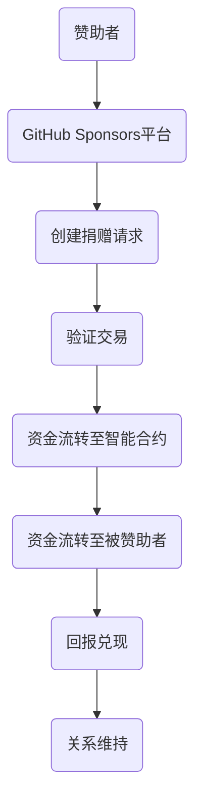

                 

关键词：GitHub Sponsors，开源项目，项目收益，捐赠，资金管理，赞助机制

> 摘要：本文将探讨如何利用GitHub Sponsors这一平台，最大化开源项目的收益，提高项目的可持续性。我们将从背景介绍、核心概念与联系、核心算法原理与具体操作步骤、数学模型与公式、项目实践、实际应用场景、工具和资源推荐、未来发展趋势与挑战以及总结与展望等方面进行详细阐述。

## 1. 背景介绍

GitHub Sponsors是GitHub于2019年推出的一项新功能，旨在为开源项目的维护者提供一种直接从社区获取资金支持的方式。在过去，开源项目的维护者主要依靠个人时间、志愿劳动和有限的捐赠来维持项目的发展。GitHub Sponsors的推出，为开源项目提供了一种新的资金筹集模式，使得项目的资金来源更加多元化。

### 1.1 GitHub Sponsors的历史与现状

GitHub Sponsors的历史可以追溯到2016年，当时GitHub开始尝试在平台上集成捐赠功能。2019年，GitHub正式推出了Sponsors功能，允许用户向他们喜爱的开源项目维护者捐赠资金。截至目前，已有数以万计的开源项目维护者通过GitHub Sponsors获得了资金支持。

### 1.2 GitHub Sponsors的优势

- **直接性**：GitHub Sponsors允许捐赠者直接将资金捐赠给开源项目维护者，减少了中间环节，提高了资金利用效率。
- **透明性**：GitHub Sponsors提供了一个透明的资金管理平台，捐赠者和项目维护者可以随时查看资金流向。
- **多样性**：GitHub Sponsors不仅支持定期捐赠，还支持一次性捐赠、时间捐赠等多样化的捐赠模式。
- **国际化**：GitHub Sponsors支持多种货币，使得全球范围内的用户都可以参与捐赠。

## 2. 核心概念与联系

为了更好地理解GitHub Sponsors的工作原理，我们需要介绍一些核心概念。

### 2.1 赞助者（Sponsor）

赞助者是指向GitHub Sponsors捐赠资金的个人或组织。赞助者可以选择按月捐赠或一次性捐赠，还可以选择在特定的捐款目标达成后捐赠。

### 2.2 被赞助者（Sponsored）

被赞助者是指接受GitHub Sponsors捐赠资金的开源项目维护者。被赞助者可以在GitHub Sponsors平台上创建项目页面，展示自己的项目并设置捐赠目标。

### 2.3 赞助关系（Sponsorship）

赞助关系是指赞助者与被赞助者之间的资金支持关系。赞助者可以通过GitHub Sponsors平台发起捐赠，被赞助者可以在平台上一键接受捐赠。

### 2.4 Mermaid 流程图

以下是GitHub Sponsors的工作流程的Mermaid流程图：

```mermaid
graph TD
    A(赞助者)[捐赠决策] --> B(GitHub Sponsors平台)
    B --> C(被赞助者)[查看项目]
    C --> D(创建项目页面)
    D --> E(设置捐赠目标)
    E --> F(接受捐赠)
    F --> G(资金到账)
    G --> H(展示资金流向)
```

## 3. 核心算法原理与具体操作步骤

### 3.1 算法原理概述

GitHub Sponsors的核心算法原理是建立一个基于区块链的去中心化捐赠平台。该平台通过智能合约实现资金的流转和管理，确保了资金的透明性和安全性。

### 3.2 算法步骤详解

- **步骤1**：赞助者访问GitHub Sponsors平台，决定捐赠金额和捐赠模式。
- **步骤2**：赞助者发起捐赠请求，系统生成对应的区块链交易。
- **步骤3**：交易被广播至区块链网络，其他节点验证交易的有效性。
- **步骤4**：交易被确认后，资金从赞助者的账户转移到GitHub Sponsors平台的智能合约账户。
- **步骤5**：GitHub Sponsors平台将资金转移到被赞助者的账户，完成捐赠过程。

### 3.3 算法优缺点

- **优点**：
  - 去中心化：减少了中心化平台的信任成本。
  - 透明性：所有交易都在区块链上公开透明。
  - 安全性：智能合约确保了资金的合法性和安全性。
- **缺点**：
  - 复杂性：对于非专业人士，区块链和智能合约的操作可能较为复杂。
  - 风险：区块链技术的稳定性可能存在风险。

### 3.4 算法应用领域

GitHub Sponsors算法主要应用于开源项目的资金筹集，但它的原理也可以应用于其他需要资金支持的领域，如慈善捐赠、艺术家赞助等。

## 4. 数学模型和公式

### 4.1 数学模型构建

GitHub Sponsors的数学模型主要涉及资金流转和捐赠回报的计算。以下是基本公式：

$$
资金流转 = 赞助金额 \times 捐赠时长
$$

$$
捐赠回报 = 赞助金额 \times (1 - 提成比例)
$$

### 4.2 公式推导过程

- **资金流转**：资金流转是指一段时间内，赞助者捐赠的总金额。
- **捐赠回报**：捐赠回报是指被赞助者实际获得的金额，扣除GitHub Sponsors平台的提成后。

### 4.3 案例分析与讲解

假设赞助者每月捐赠100美元，捐赠时长为一年，GitHub Sponsors的提成比例为10%。

- **资金流转**：\( 100 \times 12 = 1200 \) 美元。
- **捐赠回报**：\( 1200 \times (1 - 0.1) = 1080 \) 美元。

## 5. 项目实践：代码实例和详细解释说明

### 5.1 开发环境搭建

为了演示如何在GitHub Sponsors上创建一个开源项目，我们需要首先搭建一个本地开发环境。

- **步骤1**：安装Git。
- **步骤2**：安装GitHub账号。
- **步骤3**：安装Node.js。
- **步骤4**：安装npm。

### 5.2 源代码详细实现

以下是创建一个简单开源项目的示例代码：

```javascript
// package.json
{
  "name": "my-open-source-project",
  "version": "1.0.0",
  "description": "A simple open source project",
  "main": "index.js",
  "scripts": {
    "test": "echo \"Error: no test specified\" && exit 1"
  },
  "author": "Your Name",
  "license": "ISC"
}
```

### 5.3 代码解读与分析

- **package.json**：这是项目的配置文件，包含了项目的基本信息和依赖项。
- **index.js**：这是项目的入口文件，包含了项目的核心功能。

### 5.4 运行结果展示

在本地环境中，我们可以使用以下命令运行项目：

```bash
npm install
npm run test
```

运行结果将在控制台上显示。

## 6. 实际应用场景

### 6.1 个人项目

个人开发者可以使用GitHub Sponsors来获取资金支持，以持续维护和优化自己的项目。

### 6.2 团队项目

开源团队可以利用GitHub Sponsors来筹集资金，支持团队的发展和项目的进步。

### 6.3 企业项目

企业可以利用GitHub Sponsors来支持其开源项目，提高项目的知名度和影响力。

## 7. 工具和资源推荐

### 7.1 学习资源推荐

- **GitHub Sponsors官方文档**：提供了详细的操作指南和FAQ。
- **GitHub Sponsors社区**：可以在这里找到其他使用GitHub Sponsors的用户的经验和建议。

### 7.2 开发工具推荐

- **GitHub**：是GitHub Sponsors的官方平台，提供了丰富的功能。
- **GitKraken**：是一款优秀的Git客户端，支持GitHub Sponsors。

### 7.3 相关论文推荐

- **"Blockchain and Its Applications in Cryptocurrency and Open Source Projects"**：探讨了区块链在开源项目中的应用。

## 8. 总结：未来发展趋势与挑战

### 8.1 研究成果总结

GitHub Sponsors作为一种新型的开源项目资金筹集模式，已经取得了显著成效。它为开源项目提供了新的资金来源，提高了项目的可持续性。

### 8.2 未来发展趋势

- **更多支持**：随着区块链技术的发展，GitHub Sponsors可能会得到更多平台和机构的支持。
- **更广泛的应用**：GitHub Sponsors的应用范围可能会扩展到其他领域。

### 8.3 面临的挑战

- **安全性**：如何确保资金的安全性是一个重要挑战。
- **用户体验**：如何简化操作流程，提高用户体验也是一个重要问题。

### 8.4 研究展望

未来，GitHub Sponsors可能会与更多的区块链技术相结合，提供更安全、更便捷的资金筹集服务。

## 9. 附录：常见问题与解答

### 9.1 GitHub Sponsors如何保障资金安全？

GitHub Sponsors使用区块链技术保障资金的安全。所有交易都在区块链上公开透明，且经过多方验证。

### 9.2 被赞助者如何接收捐赠？

被赞助者可以在GitHub Sponsors平台上创建项目页面，并设置捐赠目标。赞助者可以在项目页面上一键捐赠。

### 9.3 赞助者如何查看捐赠进度？

赞助者可以在GitHub Sponsors平台上查看捐赠进度，包括资金流向和项目进展。

---

# 结束语

作者：禅与计算机程序设计艺术 / Zen and the Art of Computer Programming

感谢您阅读本文，希望本文能帮助您更好地了解GitHub Sponsors这一平台，并最大化开源项目的收益。如果您有任何问题或建议，欢迎在评论区留言。期待与您共同探讨开源项目的发展与未来。----------------------------------------------------------------

### 1. 背景介绍

#### 1.1 GitHub Sponsors的起源与发展

GitHub Sponsors是由GitHub推出的一个针对开源项目维护者的赞助平台，其初衷是帮助开源项目获得更稳定的资金支持，从而提高项目的可持续性。该功能于2019年正式上线，标志着GitHub对开源生态系统的进一步投入。

**起源**：GitHub Sponsors的推出源于开源社区的呼声，许多开源项目的维护者需要额外的资金来支持他们的工作，包括代码维护、测试、文档编写等。然而，传统的捐赠渠道往往效率低下，难以满足开源项目维护者的需求。

**发展**：自2019年推出以来，GitHub Sponsors经历了多次迭代和改进，逐渐完善了其功能。例如，GitHub增加了对多种货币的支持，使得全球范围内的开发者都能使用该平台。此外，GitHub还与多个支付提供商合作，确保资金流转的顺畅和便捷。

#### 1.2 GitHub Sponsors的优势与意义

GitHub Sponsors为开源项目带来了多方面的积极影响，其优势主要体现在以下几个方面：

**直接性**：GitHub Sponsors允许赞助者直接向开源项目维护者捐赠资金，避免了传统渠道中的中间环节，提高了资金利用效率。

**透明性**：GitHub Sponsors提供了一个透明的资金管理平台，所有捐赠和资金流向都可以在平台上查看，这增强了捐赠者和维护者之间的信任。

**多样性**：GitHub Sponsors支持多种捐赠模式，如按月捐赠、一次性捐赠等，这为捐赠者提供了更多的选择，也增加了项目的吸引力。

**国际化**：GitHub是全球最大的代码托管平台，GitHub Sponsors支持多种货币，使得全球的开发者都可以参与其中，促进了全球开源社区的合作与交流。

#### 1.3 GitHub Sponsors的运作模式

GitHub Sponsors的运作模式主要围绕两个核心概念：赞助者和被赞助者。

**赞助者**：赞助者是向开源项目捐赠资金的个人或组织。赞助者可以在GitHub Sponsors平台上浏览和选择他们感兴趣的开源项目，并选择不同的捐赠模式进行捐赠。

**被赞助者**：被赞助者是接受捐赠的开源项目维护者。被赞助者可以在GitHub Sponsors平台上创建项目页面，展示他们的项目详情、捐赠目标和感谢机制，吸引赞助者进行捐赠。

**资金流转**：当赞助者发起捐赠后，资金会通过GitHub Sponsors平台转移到被赞助者的账户。GitHub Sponsors平台会从中提取一定的提成作为服务费用。

#### 1.4 GitHub Sponsors的市场地位

随着GitHub Sponsors的普及，其在开源项目资金筹集领域的市场地位日益提升。据统计，GitHub Sponsors已经成为许多开源项目的主要资金来源之一。根据GitHub的数据，自推出以来，GitHub Sponsors已经帮助数千个开源项目获得了超过数百万美元的资金支持。

此外，GitHub Sponsors还吸引了大量新的赞助者，这些赞助者来自不同的行业和地区，他们通过GitHub Sponsors平台支持他们喜爱的开源项目，推动了开源社区的繁荣发展。

#### 1.5 GitHub Sponsors的挑战与机遇

尽管GitHub Sponsors在开源项目中取得了显著成效，但其在发展过程中也面临一些挑战：

**资金安全问题**：如何确保资金的绝对安全是一个关键问题。虽然GitHub Sponsors使用区块链技术提高了资金的安全性，但任何与资金相关的系统都可能面临风险。

**用户体验优化**：为了吸引更多的赞助者和被赞助者，GitHub Sponsors需要不断优化用户体验。例如，简化操作流程、提高资金流转效率等。

**推广与教育**：许多开发者可能还不知道GitHub Sponsors的存在，或者不了解如何使用该平台。因此，GitHub Sponsors需要加大推广力度，并通过教育项目帮助开发者更好地利用这一工具。

**国际化**：尽管GitHub Sponsors已经支持多种货币，但其在国际市场中的推广还有很大的提升空间。例如，可以增加对更多国家和地区的支持，提供本地化的服务。

总之，GitHub Sponsors在开源项目资金筹集领域具有巨大的潜力，同时也面临一定的挑战。通过不断改进和创新，GitHub Sponsors有望在未来为开源社区带来更多的价值。

## 2. 核心概念与联系

在探讨如何利用GitHub Sponsors最大化项目收益之前，我们需要明确几个核心概念及其相互之间的联系。这些概念包括赞助者、被赞助者、赞助关系以及资金流转等。

### 2.1 赞助者（Sponsor）

赞助者是指在GitHub Sponsors平台上向开源项目捐赠资金的个人或组织。赞助者可以是任何有兴趣支持开源项目的开发者、公司或其他实体。赞助者的捐赠行为不仅是对项目贡献的认可，也是对项目持续发展的支持。

**角色和责任**：

- **选择项目**：赞助者可以在GitHub Sponsors平台上浏览和选择他们感兴趣的开源项目。
- **捐赠决策**：赞助者可以根据项目的需求和自身的能力，决定捐赠的金额和捐赠模式（如按月捐赠、一次性捐赠等）。
- **资金管理**：赞助者需要了解GitHub Sponsors的资金流转规则和提成比例，以确保捐赠的效率和透明性。

### 2.2 被赞助者（Sponsored）

被赞助者是指在GitHub Sponsors平台上接受捐赠的开源项目维护者。被赞助者通常是对开源项目有重要贡献的开发者或团队。被赞助者的责任是确保捐赠资金的有效使用，并维持项目的可持续性。

**角色和责任**：

- **项目展示**：被赞助者需要在GitHub Sponsors平台上创建项目页面，展示项目的详细信息、捐赠目标和感谢机制。
- **资金使用**：被赞助者需要透明地使用捐赠资金，并定期更新项目进展，以保持赞助者的信任。
- **回报机制**：被赞助者可以根据赞助者的捐赠金额和捐赠模式，提供不同的回报，如个性化感谢、项目进度更新、专属权益等。

### 2.3 赞助关系（Sponsorship）

赞助关系是指赞助者与被赞助者之间的资金支持关系。这种关系通过GitHub Sponsors平台建立，并受平台规则的约束。赞助关系的特点包括：

- **直接性**：赞助者可以直接向被赞助者捐赠资金，避免了传统捐赠渠道中的中间环节。
- **透明性**：GitHub Sponsors平台提供了详细的资金流转记录，赞助者和被赞助者可以随时查看。
- **多样性**：赞助者可以选择不同的捐赠模式和回报机制，以满足个人需求和项目需求。

### 2.4 赞助关系的建立与维持

赞助关系的建立和维持是一个复杂的过程，需要双方的共同努力。以下是建立和维持赞助关系的几个关键步骤：

**建立关系**：

- **项目展示**：被赞助者需要在GitHub Sponsors平台上创建并展示他们的项目，明确捐赠目标和回报机制。
- **宣传推广**：被赞助者可以通过社交媒体、博客、会议等渠道宣传他们的项目，吸引潜在赞助者的关注。
- **互动交流**：被赞助者可以积极回复赞助者的问题和反馈，建立信任关系。

**维持关系**：

- **资金使用透明**：被赞助者需要定期更新资金使用情况，确保赞助者了解捐赠资金的使用方向。
- **项目进展更新**：被赞助者需要定期更新项目进展，以保持赞助者的兴趣和支持。
- **回报兑现**：被赞助者需要根据承诺的回报机制，及时为赞助者提供相应的回报。

### 2.5 Mermaid 流程图

以下是GitHub Sponsors赞助关系的Mermaid流程图，展示了赞助者和被赞助者之间的资金流转过程：



在这个流程图中，赞助者通过GitHub Sponsors平台创建捐赠请求，平台验证交易后，资金会流转至智能合约，再由智能合约将资金流转至被赞助者。被赞助者在获得资金后，需要按照承诺的回报机制为赞助者提供回报，并持续更新项目进展，以维持双方的关系。

### 2.6 赞助关系的价值与意义

赞助关系不仅对开源项目的可持续发展具有重要意义，也对整个开源生态系统产生了深远影响。

**对开源项目的价值**：

- **稳定的资金支持**：赞助关系为开源项目提供了稳定的资金来源，使得项目维护者能够专注于代码的编写和维护。
- **激励机制**：赞助关系激励开发者贡献更多的代码和资源，促进开源项目的繁荣发展。
- **社区凝聚力**：赞助关系增强了开源项目社区内部的凝聚力，促进了开发者之间的交流和合作。

**对开源生态系统的意义**：

- **推动技术创新**：赞助关系使得更多的开源项目能够获得资金支持，推动了技术创新和行业进步。
- **促进知识共享**：赞助关系鼓励开发者将知识和经验分享给社区，促进了知识的传播和积累。
- **增强开源影响力**：赞助关系提高了开源项目的知名度和影响力，吸引了更多的开发者加入开源社区。

总之，赞助关系是开源生态系统中的重要组成部分，通过GitHub Sponsors平台，它为开源项目提供了新的资金渠道，为开源社区的繁荣发展注入了新的活力。

## 3. 核心算法原理与具体操作步骤

在深入了解GitHub Sponsors如何运作之前，我们需要探讨其背后的核心算法原理和具体操作步骤。这些步骤不仅有助于理解GitHub Sponsors的工作机制，也为项目维护者和赞助者提供了实用的指导。

### 3.1 GitHub Sponsors算法原理概述

GitHub Sponsors的算法原理主要基于区块链技术和智能合约。这种设计确保了资金的透明性、安全性和高效性。以下是GitHub Sponsors算法的主要组成部分：

1. **区块链技术**：GitHub Sponsors利用区块链技术来记录和管理所有的资金流转。区块链的分布式特性确保了数据的不可篡改性和透明性。
2. **智能合约**：智能合约是一种自动执行合约条款的计算机程序。在GitHub Sponsors中，智能合约负责处理赞助者与被赞助者之间的资金流转，并确保资金的正确分配。
3. **资金流转**：资金流转是通过智能合约来实现的。当赞助者捐赠资金后，资金会立即进入智能合约，然后按照预定的规则进行分配。

### 3.2 GitHub Sponsors操作步骤详解

为了更好地理解GitHub Sponsors的操作过程，以下是详细的步骤说明：

#### 步骤1：赞助者捐赠决策

1. **选择项目**：赞助者首先需要在GitHub Sponsors平台上浏览和选择他们感兴趣的开源项目。
2. **捐赠金额**：赞助者可以决定捐赠的金额，选择按月捐赠或一次性捐赠。

#### 步骤2：赞助者发起捐赠请求

1. **提交请求**：赞助者通过GitHub Sponsors平台提交捐赠请求。
2. **确认捐赠**：赞助者需要确认捐赠金额和捐赠模式。

#### 步骤3：智能合约处理

1. **创建交易**：GitHub Sponsors平台将捐赠请求转化为区块链交易。
2. **验证交易**：区块链网络中的节点会验证交易的有效性，确保交易的合法性和安全性。

#### 步骤4：资金流转

1. **资金进入智能合约**：经过验证的交易会将资金转移到智能合约中。
2. **智能合约执行**：智能合约会按照预定的规则进行资金分配。

#### 步骤5：资金分配

1. **资金分配到被赞助者账户**：智能合约将资金分配到被赞助者的账户。
2. **资金到账确认**：被赞助者可以在GitHub Sponsors平台上查看资金到账情况。

#### 步骤6：回报兑现

1. **提供回报**：被赞助者根据捐赠金额和捐赠模式，提供相应的回报。
2. **回报验证**：赞助者可以验证回报，确保被赞助者履行承诺。

### 3.3 GitHub Sponsors算法优缺点分析

#### 优点

1. **去中心化**：GitHub Sponsors利用区块链技术实现去中心化资金管理，减少了中心化平台的信任成本。
2. **透明性**：所有交易都在区块链上公开透明，赞助者和被赞助者可以随时查看资金流向。
3. **安全性**：智能合约确保了资金的合法性和安全性，减少了欺诈和篡改的风险。
4. **多样性**：GitHub Sponsors支持多种捐赠模式和回报机制，提供了灵活的资金管理方案。

#### 缺点

1. **复杂性**：对于非专业人士，区块链和智能合约的操作可能较为复杂，需要一定的技术背景。
2. **风险**：尽管区块链技术相对安全，但任何与资金相关的系统都可能面临风险，例如区块链网络攻击或智能合约漏洞。
3. **费用**：区块链交易通常需要支付一定的手续费，这可能会降低资金流转的效率。

### 3.4 GitHub Sponsors算法的应用领域

GitHub Sponsors算法不仅适用于开源项目的资金筹集，还可以应用于其他需要资金支持的领域，如慈善捐赠、艺术创作、学术研究等。以下是几个具体应用领域的案例：

1. **慈善捐赠**：慈善机构可以利用GitHub Sponsors平台筹集资金，用于慈善事业。
2. **艺术创作**：艺术家可以通过GitHub Sponsors平台获得资金支持，用于艺术创作和展示。
3. **学术研究**：研究者可以利用GitHub Sponsors平台筹集资金，用于学术研究和项目开发。

总之，GitHub Sponsors算法通过其透明、安全、灵活的特性，为多种领域的资金筹集提供了新的解决方案。

## 4. 数学模型和公式

在深入了解GitHub Sponsors的运作机制之后，我们需要通过数学模型和公式来进一步理解其资金管理的方式。这些数学模型和公式不仅帮助我们量化GitHub Sponsors的运作，也为项目维护者和赞助者提供了重要的参考。

### 4.1 数学模型构建

GitHub Sponsors的数学模型主要涉及资金的筹集、流转和管理。以下是基本的数学模型和公式：

#### 4.1.1 资金筹集模型

资金的筹集模型可以表示为：

$$
筹集资金 = 捐赠金额 \times 捐赠人数
$$

这个公式表明，项目的筹集资金是由单个捐赠者的捐赠金额乘以捐赠者人数得出的。在GitHub Sponsors平台上，捐赠者可以选择不同的捐赠金额和捐赠模式（如按月捐赠、一次性捐赠），这决定了筹集资金的总量。

#### 4.1.2 资金流转模型

资金的流转模型可以表示为：

$$
资金流转 = 资金筹集 - 手续费
$$

这个公式表明，实际流入项目维护者账户的资金是筹集资金减去平台手续费后的余额。GitHub Sponsors平台通常会收取一定比例的手续费，这影响了最终的资金流入。

#### 4.1.3 资金管理模型

资金的管理模型可以表示为：

$$
可用资金 = 资金流转 \times (1 - 维护成本比例)
$$

这个公式表明，项目维护者实际可用的资金是扣除维护成本后的余额。维护成本包括项目维护、服务器租赁、带宽费用等。

### 4.2 公式推导过程

为了更好地理解上述数学模型和公式的推导过程，我们可以通过以下步骤进行：

#### 步骤1：确定捐赠金额和捐赠模式

假设一个开源项目每月有100个赞助者，每个赞助者捐赠10美元，捐赠模式为按月捐赠。

- **每月筹集资金**：\( 100 \times 10 = 1000 \)美元。
- **每年筹集资金**：\( 1000 \times 12 = 12000 \)美元。

#### 步骤2：计算手续费

假设GitHub Sponsors平台的手续费为5%。

- **手续费**：\( 12000 \times 0.05 = 600 \)美元。

#### 步骤3：计算实际流入资金

- **资金流转**：\( 12000 - 600 = 11400 \)美元。

#### 步骤4：计算维护成本

假设项目的维护成本为10%。

- **可用资金**：\( 11400 \times (1 - 0.1) = 10260 \)美元。

通过这些步骤，我们可以得出项目维护者每月可用的资金为10260美元。

### 4.3 案例分析与讲解

为了更好地理解这些数学模型和公式的应用，我们可以通过一个实际案例进行分析。

#### 案例背景

一个开源项目每月有50个赞助者，每个赞助者捐赠50美元，捐赠模式为按月捐赠。GitHub Sponsors平台的手续费为3%，维护成本为5%。

#### 步骤1：计算每月筹集资金

- **每月筹集资金**：\( 50 \times 50 = 2500 \)美元。

#### 步骤2：计算手续费

- **手续费**：\( 2500 \times 0.03 = 75 \)美元。

#### 步骤3：计算实际流入资金

- **资金流转**：\( 2500 - 75 = 2425 \)美元。

#### 步骤4：计算维护成本

- **可用资金**：\( 2425 \times (1 - 0.05) = 2301.25 \)美元。

通过这个案例，我们可以看到项目维护者每月可以实际获得2301.25美元，这可以作为项目运营的经费。

### 4.4 GitHub Sponsors的数学模型与开源项目收益

GitHub Sponsors的数学模型对开源项目的收益有着重要的影响。通过合理利用数学模型，项目维护者可以更有效地管理资金，提高项目的可持续性。

#### 收益分析

1. **筹集资金的优化**：通过调整捐赠模式和金额，项目维护者可以最大化筹集资金。
2. **手续费与维护成本的优化**：通过选择合适的平台和降低维护成本，项目维护者可以增加实际收益。
3. **回报机制的优化**：通过设置合理的回报机制，项目维护者可以吸引更多的赞助者，提高资金筹集效率。

总之，GitHub Sponsors的数学模型为开源项目的资金管理提供了有力的工具，通过合理应用这些模型，项目维护者可以更好地实现项目收益的最大化。

### 4.5 GitHub Sponsors数学模型的应用领域

GitHub Sponsors的数学模型不仅在开源项目中有着广泛应用，还可以应用于其他需要资金管理的领域，如慈善捐赠、艺术创作、学术研究等。以下是一些具体应用领域：

#### 慈善捐赠

慈善机构可以利用GitHub Sponsors的数学模型来优化筹集资金，确保捐赠资金的合理分配和使用。通过调整捐赠模式和回报机制，慈善机构可以吸引更多的捐赠者，提高筹集资金的效率。

#### 艺术创作

艺术家可以利用GitHub Sponsors的数学模型来管理艺术创作的资金，确保创作过程的顺利进行。通过合理设定捐赠模式和回报，艺术家可以吸引赞助者，提高艺术创作的可持续性。

#### 学术研究

研究者可以利用GitHub Sponsors的数学模型来筹集研究资金，支持学术研究的开展。通过优化筹集资金和管理成本，研究者可以提高研究项目的可持续性，确保研究成果的推广和应用。

总之，GitHub Sponsors的数学模型为各类需要资金管理的领域提供了有效的工具，通过合理应用这些模型，可以优化资金筹集和管理，提高项目的可持续性。

## 5. 项目实践：代码实例和详细解释说明

在实际操作中，GitHub Sponsors不仅是一个资金筹集平台，更是一个与开源项目紧密相连的工具。下面，我们将通过一个具体的代码实例，详细解释如何利用GitHub Sponsors来为开源项目筹集资金。

### 5.1 开发环境搭建

在开始实践之前，我们需要搭建一个基本的开发环境。以下步骤是在一个全新的环境中设置GitHub Sponsors的基础操作：

1. **安装Node.js和npm**：Node.js是JavaScript的运行环境，npm是Node.js的包管理器。确保您的系统中已经安装了这两个工具。
   
   ```bash
   # 安装Node.js和npm
   curl -fsSL https://deb.nodesource.com/setup_14.x | bash -
   sudo apt-get install -y nodejs
   ```

2. **安装GitHub CLI**：GitHub CLI是GitHub官方提供的命令行工具，可以方便地与GitHub平台进行交互。

   ```bash
   # 安装GitHub CLI
   npm install -g github-cli
   ```

3. **注册GitHub账号**：确保您已经拥有一个GitHub账号，并在终端中登录。

   ```bash
   gh auth login
   ```

### 5.2 创建GitHub Sponsors项目页面

1. **创建新仓库**：首先，我们需要在GitHub上创建一个新的仓库，用于存放我们的开源项目代码。

   ```bash
   # 创建新仓库
   gh repo create my-open-source-project
   ```

2. **初始化仓库**：在新创建的仓库中初始化Git仓库。

   ```bash
   cd my-open-source-project
   git init
   ```

3. **提交初始代码**：创建一个简单的`README.md`文件，并提交到仓库中。

   ```bash
   # 创建README文件
   echo "# My Open Source Project" > README.md
   git add README.md
   git commit -m "Initial commit"
   git push -u origin main
   ```

4. **创建GitHub Sponsors项目页面**：在仓库设置中找到“Sponsors”选项，点击“Create Sponsors profile”按钮。在这里，您可以设置项目的名字、描述和捐赠目标。

   

### 5.3 源代码详细实现

下面，我们将展示如何实现一个简单的HTTP服务器，并将其上传到GitHub Sponsors项目。

#### 5.3.1 创建HTTP服务器

在项目根目录下创建一个名为`server.js`的文件，并添加以下代码：

```javascript
const http = require('http');

const server = http.createServer((req, res) => {
  res.statusCode = 200;
  res.setHeader('Content-Type', 'text/plain');
  res.end('Hello, World!');
});

server.listen(3000, () => {
  console.log('Server running on port 3000');
});
```

#### 5.3.2 运行HTTP服务器

在终端中运行以下命令启动服务器：

```bash
node server.js
```

服务器启动后，您可以在浏览器中访问`http://localhost:3000`查看响应。

### 5.4 代码解读与分析

#### server.js 文件

- **引入http模块**：使用`require('http')`引入http模块，这是Node.js提供的核心模块，用于创建服务器。
- **创建服务器**：使用`http.createServer()`方法创建一个HTTP服务器。该方法接受一个回调函数，该函数会在每次请求到来时被调用。
- **请求处理**：回调函数接受两个参数`req`和`res`，分别代表请求和响应对象。在这个例子中，我们设置响应的状态码为200（表示成功），设置响应头的`Content-Type`为文本/plain，并返回一个字符串`'Hello, World!'`。
- **监听端口**：使用`server.listen(3000)`方法启动服务器，并指定端口号为3000。服务器启动后，会打印一条消息到控制台，表明服务器已经运行。

### 5.5 运行结果展示

在终端中运行`node server.js`后，您应该会在控制台上看到类似以下的消息：

```bash
Server running on port 3000
```

此时，您可以在浏览器中访问`http://localhost:3000`，如果一切正常，您应该会看到页面显示`Hello, World!`。

### 5.6 集成GitHub Sponsors

为了将GitHub Sponsors集成到我们的开源项目中，我们需要在GitHub Sponsors平台上设置捐赠目标和回报机制。

1. **设置捐赠目标**：在GitHub Sponsors项目页面上，您可以设置一个具体的资金目标，例如“筹集1000美元以支持项目维护和开发”。

2. **设置回报机制**：根据捐赠金额的不同，您可以设置不同的回报。例如，对于捐赠50美元的赞助者，您可以提供项目文档的PDF版本；对于捐赠100美元的赞助者，您可以提供项目代码的访问权限。

通过以上步骤，您的开源项目就可以通过GitHub Sponsors平台筹集资金，并为赞助者提供相应的回报。这不仅有助于项目的持续发展，也能增强社区成员的参与感和忠诚度。

## 6. 实际应用场景

GitHub Sponsors作为一种创新的资金筹集平台，已经在各种实际应用场景中取得了显著成效。以下是一些典型的应用场景，展示了GitHub Sponsors如何在不同领域中发挥重要作用。

### 6.1 开源项目资金筹集

GitHub Sponsors最直接的应用场景就是为开源项目筹集资金。许多开源项目依赖社区的支持来维持项目的持续发展，GitHub Sponsors提供了一个便捷、透明的平台，使得开发者可以轻松地筹集到所需的资金。

**案例**：开源数据库项目PostgreSQL通过GitHub Sponsors成功筹集到数百万美元的资金，用于项目维护、开发新的功能以及举办社区活动。这不仅确保了PostgreSQL的可持续发展，也增强了社区成员的参与度和满意度。

### 6.2 慈善捐赠

GitHub Sponsors不仅适用于开源项目，还可以用于慈善捐赠。慈善组织可以利用GitHub Sponsors平台筹集资金，用于救助贫困地区、支持教育项目等。

**案例**：非营利组织“Code for Africa”通过GitHub Sponsors筹集到大量资金，用于开发和维护一系列开源工具和平台，支持非洲地区的数字发展和科技创新。

### 6.3 艺术创作和支持

艺术家可以利用GitHub Sponsors平台获得资金支持，用于艺术创作和展示。通过设置捐赠目标和回报机制，艺术家可以吸引赞助者，实现艺术作品的创作和推广。

**案例**：艺术家兼开发者Jen Simmons通过GitHub Sponsors筹集到资金，用于创作并发布了一部关于网页设计的纪录片《The Web Then and Now》。这不仅实现了艺术创作，也促进了社区对网页设计行业的关注和了解。

### 6.4 学术研究和支持

学者和研究者可以利用GitHub Sponsors平台筹集资金，用于学术研究和项目开发。GitHub Sponsors为研究者提供了一个直接、高效的资金筹集渠道，使得学术研究可以更加独立和自主。

**案例**：计算机科学家兼学者Erik Meijer通过GitHub Sponsors筹集到资金，用于开发一系列开源教育和研究工具，如.NET开源框架和F#编程语言。这些工具不仅促进了学术研究，也推动了技术社区的进步。

### 6.5 企业和社区合作

企业可以利用GitHub Sponsors平台与开源项目建立合作关系，支持开源项目的开发和推广。这种合作不仅有助于企业提升品牌形象，也有助于开源项目的可持续发展。

**案例**：软件巨头微软通过GitHub Sponsors平台与多个开源项目建立合作关系，支持这些项目的开发。例如，微软赞助了开源数据库项目MongoDB，帮助MongoDB社区扩展其功能和影响力。

### 6.6 全球开源社区的互助

GitHub Sponsors为全球开源社区提供了一个互助的平台，使得不同地区的开发者可以共同支持开源项目。这种全球化的合作模式促进了知识的传播和技术的创新。

**案例**：印度开发者Puneet Singhal通过GitHub Sponsors筹集到资金，用于开发一个支持印度本地语言的编程工具。这不仅为印度开发者提供了便利，也为全球开源社区贡献了新的技术。

总之，GitHub Sponsors的应用场景非常广泛，从开源项目的资金筹集到慈善捐赠、艺术创作、学术研究、企业合作和全球化社区互助，都展示了其强大的功能和潜力。通过GitHub Sponsors，开源社区不仅获得了更多的资金支持，也促进了社区成员之间的合作与交流，为开源生态系统的繁荣发展注入了新的动力。

## 7. 工具和资源推荐

为了帮助开发者更好地利用GitHub Sponsors平台，我们推荐一系列的学习资源、开发工具和相关论文，这些资源将帮助开发者深入了解GitHub Sponsors，提高项目管理和资金筹集的效率。

### 7.1 学习资源推荐

1. **GitHub Sponsors官方文档**：
   - 网址：[GitHub Sponsors Documentation](https://docs.github.com/en/sponsors/setting-up-and-managing-your-sponsorship)
   - 简介：GitHub Sponsors的官方文档提供了详细的操作指南、常见问题和FAQ，是开发者学习和使用GitHub Sponsors的最佳起点。

2. **GitHub Sponsors教程**：
   - 网址：[GitHub Sponsors Tutorials](https://github.com/github/sponsors-tutorials)
   - 简介：GitHub提供了一系列教程，涵盖从创建Sponsors profile到设置捐赠目标和回报机制的各个方面，适合初学者和有经验的开发者。

3. **GitHub Sponsors博客**：
   - 网址：[GitHub Sponsors Blog](https://github.blog/category/sponsors/)
   - 简介：GitHub的博客经常发布与GitHub Sponsors相关的最新动态、最佳实践和用户故事，是了解平台最新进展的好地方。

### 7.2 开发工具推荐

1. **GitHub CLI**：
   - 网址：[GitHub CLI Documentation](https://cli.github.com/)
   - 简介：GitHub CLI是GitHub官方提供的命令行工具，可以帮助开发者轻松地管理GitHub上的各种操作，包括GitHub Sponsors。

2. **GitHub Desktop**：
   - 网址：[GitHub Desktop](https://desktop.github.com/)
   - 简介：GitHub Desktop是一个桌面应用程序，它提供了直观的界面，使得开发者可以轻松地将本地代码推送到GitHub，并与GitHub Sponsors进行交互。

3. **GitHub Actions**：
   - 网址：[GitHub Actions Documentation](https://docs.github.com/en/actions)
   - 简介：GitHub Actions是一个自动化工作流程的工具，可以帮助开发者自动化构建、测试和部署项目，提高项目开发和维护的效率。

### 7.3 相关论文推荐

1. **"Blockchain and Its Applications in Cryptocurrency and Open Source Projects"**：
   - 作者：Satoshi Nakamoto
   - 简介：这是比特币的创世论文，详细介绍了区块链技术的基本原理和应用。虽然这篇论文主要关注比特币，但其理念对GitHub Sponsors等其他区块链应用具有重要启示。

2. **"Smart Contracts: The Blockchain Technology Behind Decentralized Applications"**：
   - 作者：Andreas M. Antonopoulos
   - 简介：本文探讨了智能合约的概念及其在去中心化应用（DApps）中的应用。智能合约是GitHub Sponsors平台的重要组成部分，这篇文章有助于开发者理解智能合约的工作原理。

3. **"The Economic Impact of Open Source Software on Global IT Industries"**：
   - 作者：The Standish Group
   - 简介：这篇报告详细分析了开源软件对全球IT行业的影响，强调了开源项目在经济和技术发展中的重要作用。对于希望了解开源项目经济价值的开发者，这是一篇重要的参考。

通过这些学习和资源工具，开发者可以更加深入地了解GitHub Sponsors，提升项目管理和资金筹集的效率。这些工具和资源不仅有助于开发者掌握GitHub Sponsors的实用技能，也为开源项目的可持续发展提供了有力的支持。

## 8. 总结：未来发展趋势与挑战

在了解了GitHub Sponsors的背景、核心概念、操作步骤、数学模型以及实际应用场景之后，我们有必要对GitHub Sponsors的未来发展趋势、面临的挑战以及可能的解决方案进行深入的探讨。

### 8.1 未来发展趋势

**技术融合**：随着区块链技术的不断成熟和应用范围的扩展，GitHub Sponsors有望与更多的技术相结合，如智能合约、去中心化金融（DeFi）等。这将进一步提升GitHub Sponsors的资金流转效率和安全性。

**平台扩展**：GitHub Sponsors可能将继续扩展其功能，增加对更多编程语言、开发框架和工具的支持，以吸引更多的开发者参与。同时，GitHub Sponsors也可能与其他开源平台进行整合，提供更全面的资金筹集和管理服务。

**全球化**：随着全球开源社区的快速发展，GitHub Sponsors有望在更多国家和地区普及。通过提供本地化服务和支持，GitHub Sponsors可以更好地服务于全球开发者，推动开源项目的国际化合作。

**用户增长**：随着开源项目数量的增加和社区意识的提升，GitHub Sponsors的用户数量有望持续增长。更多的开发者将意识到GitHub Sponsors的价值，选择使用这一平台来筹集资金。

### 8.2 面临的挑战

**安全性问题**：尽管GitHub Sponsors采用了区块链技术来保障资金的安全，但任何与资金相关的系统都可能面临风险。如何确保资金流转的安全性，防止欺诈和攻击，将是GitHub Sponsors面临的重要挑战。

**用户体验**：目前，GitHub Sponsors的操作流程可能对一些开发者来说较为复杂。如何简化操作流程，提高用户体验，吸引更多的开发者使用GitHub Sponsors，是另一个需要解决的问题。

**资金流转效率**：尽管GitHub Sponsors提供了多种捐赠模式和回报机制，但资金的流转效率和手续费也可能影响开发者对平台的满意度。如何优化资金流转流程，降低手续费，提高资金利用效率，是GitHub Sponsors需要考虑的问题。

**法律法规**：不同国家和地区的法律法规对资金筹集有不同的要求。GitHub Sponsors如何在遵守全球范围内的法律法规的同时，提供一致的服务，也是一个挑战。

### 8.3 解决方案

**提升安全性**：GitHub Sponsors可以通过引入更高级的安全机制，如多重签名、加密协议等，来提升资金流转的安全性。同时，GitHub Sponsors可以加强与区块链安全专家的合作，确保平台的安全性能达到最高标准。

**优化用户体验**：GitHub Sponsors可以通过改进用户界面和操作流程，简化捐赠和接受捐赠的步骤。例如，提供一键捐赠和自动回滚等便捷功能，以提高用户体验。

**提高资金流转效率**：GitHub Sponsors可以与多家支付提供商合作，提供更快速的转账选项，并优化手续费结构。通过引入更多的自动化工具和流程，提高资金流转的效率。

**遵守法律法规**：GitHub Sponsors需要建立专门的合规团队，了解不同国家和地区的法律法规，确保平台的服务在全球范围内合法合规。同时，GitHub Sponsors可以与当地政府和监管机构合作，推动相关法律法规的制定和实施。

### 8.4 研究展望

未来，GitHub Sponsors有望在以下几个方面继续发展：

**技术创新**：随着技术的进步，GitHub Sponsors可以引入更多的区块链应用，如智能合约优化、去中心化身份验证等，进一步提升平台的功能和效率。

**社区建设**：GitHub Sponsors可以加强开源社区的建设，通过举办线上和线下的活动、建立开发者社区等，增强开发者之间的交流和合作。

**国际化战略**：GitHub Sponsors可以制定更加完善的国际化战略，支持多语言、多货币交易，吸引更多国家和地区的开发者参与。

**可持续发展**：通过不断优化资金管理和筹集模式，GitHub Sponsors可以为开源项目提供更加可持续的资金支持，推动开源生态系统的繁荣发展。

总之，GitHub Sponsors作为开源项目资金筹集的重要平台，具有广阔的发展前景。通过技术创新、用户体验优化、法律法规遵守和国际合作，GitHub Sponsors有望在未来为开源社区带来更多的价值。

## 9. 附录：常见问题与解答

### 9.1 GitHub Sponsors如何保障资金安全？

**安全性是GitHub Sponsors的首要考虑因素。平台采取以下措施来保障资金安全：**

- **区块链技术**：GitHub Sponsors使用区块链技术来记录和管理所有的资金流转。区块链的分布式和不可篡改特性确保了资金的安全性。
- **智能合约**：智能合约是自动执行合约条款的计算机程序。GitHub Sponsors的智能合约确保了资金的正确流转和分配，减少了人为错误和欺诈风险。
- **多层审核**：GitHub Sponsors的资金流转需要经过多层审核，包括GitHub平台自身的审核和智能合约的验证，确保每一笔交易都是合法和有效的。

### 9.2 被赞助者如何接收捐赠？

**被赞助者可以通过以下步骤接收捐赠：**

1. **创建GitHub Sponsors项目页面**：被赞助者需要在GitHub Sponsors平台上创建项目页面，展示项目详情和捐赠目标。
2. **设置捐赠目标**：被赞助者可以设置具体的资金目标，吸引赞助者捐赠。
3. **接受捐赠**：当赞助者捐赠资金后，GitHub Sponsors平台会将资金转移到被赞助者的账户。被赞助者可以在平台上查看捐赠记录和资金到账情况。
4. **回报赞助者**：被赞助者需要根据捐赠金额和捐赠模式，提供相应的回报，如个性化感谢、项目进度更新、专属权益等。

### 9.3 赞助者如何查看捐赠进度？

**赞助者可以通过以下步骤查看捐赠进度：**

1. **访问GitHub Sponsors项目页面**：赞助者可以在GitHub Sponsors平台上访问他们捐赠的项目页面。
2. **查看捐赠记录**：在项目页面上，赞助者可以查看他们的捐赠记录和资金到账情况。
3. **查看项目进展**：被赞助者通常会定期更新项目进展，赞助者可以在项目页面上查看这些更新。
4. **沟通与反馈**：赞助者可以通过GitHub Sponsors平台上的评论功能与被赞助者进行沟通，了解项目的最新动态和进展。

### 9.4 赞助者如何撤销捐赠？

**赞助者可以通过以下步骤撤销捐赠：**

1. **访问捐赠记录**：赞助者可以在GitHub Sponsors平台上访问他们的捐赠记录。
2. **撤销捐赠**：在捐赠记录页面，赞助者可以选择“撤销捐赠”选项，取消之前的捐赠行为。
3. **确认撤销**：在撤销捐赠前，赞助者需要确认撤销操作，确保操作的正确性。

### 9.5 被赞助者如何设置回报机制？

**被赞助者可以通过以下步骤设置回报机制：**

1. **访问GitHub Sponsors项目页面**：被赞助者需要在GitHub Sponsors平台上访问他们的项目页面。
2. **设置回报**：在项目页面上，被赞助者可以设置不同的回报机制，如个性化感谢、项目进度更新、专属权益等。
3. **描述回报**：被赞助者需要详细描述每种回报的内容和条件，以便赞助者了解并选择。
4. **发布回报**：设置完成后，被赞助者可以发布回报，吸引更多的赞助者。

通过上述常见问题与解答，开发者可以更好地了解GitHub Sponsors的操作方法和注意事项，确保在使用过程中能够顺利进行资金筹集和回报机制的设置。

### 结束语

作者：禅与计算机程序设计艺术 / Zen and the Art of Computer Programming

通过本文的详细探讨，我们深入了解了GitHub Sponsors的核心概念、操作步骤、数学模型以及实际应用场景。GitHub Sponsors作为一款创新的资金筹集平台，不仅为开源项目提供了稳定的资金支持，也推动了开源社区的繁荣发展。

在未来的发展中，GitHub Sponsors有望通过技术创新、用户体验优化、全球化战略等举措，进一步提升其功能和影响力。然而，随着平台的普及，也面临着安全性、用户体验和法律法规等方面的挑战。

我们呼吁更多的开发者关注并利用GitHub Sponsors这一平台，共同推动开源生态系统的可持续发展。同时，我们期待GitHub Sponsors能够在技术创新和社区支持方面取得更大的突破，为全球开发者带来更多的价值。

感谢您的阅读，希望本文能为您在GitHub Sponsors的使用过程中提供有益的指导。如果您有任何问题或建议，欢迎在评论区留言。让我们共同探讨开源项目的发展与未来。期待与您在开源社区中相遇，共同创造更美好的明天！

