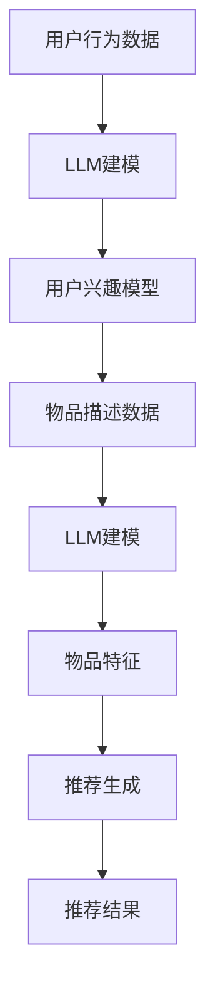

                 

关键词：长尾效应、推荐系统、语言模型、优化策略、深度学习

摘要：本文旨在探讨如何利用语言模型（LLM）优化推荐系统中的长尾物品发现。通过对长尾效应的理解，结合LLM的优势，本文提出了一系列优化策略，并分析了其应用领域和效果。

## 1. 背景介绍

### 1.1 长尾效应

长尾效应是统计学中的一个重要概念，描述了一种非正态分布的曲线特征，即大部分数据集中在均值附近，而尾部则包含大量小概率但累计贡献很大的数据。在推荐系统中，长尾效应意味着大部分用户对热门物品的兴趣有限，而对冷门物品的需求却不容忽视。

### 1.2 推荐系统

推荐系统是一种基于用户兴趣和行为的自动化推荐机制，旨在为用户发现和推荐其可能感兴趣的内容。随着互联网和大数据技术的发展，推荐系统已经成为电商平台、社交媒体、视频网站等平台的重要组成部分。

### 1.3 语言模型

语言模型（LLM）是一种基于深度学习技术的自然语言处理模型，能够对文本数据进行建模和生成。LLM在推荐系统中的应用，主要是利用其强大的语言理解和生成能力，对用户行为和物品特征进行深入分析，从而提高推荐质量。

## 2. 核心概念与联系

### 2.1 语言模型与推荐系统

语言模型与推荐系统的结合，主要体现在以下几个方面：

1. **用户兴趣建模**：LLM能够理解用户的语言和行为，通过分析用户的浏览、搜索、购买等行为，构建出用户的个性化兴趣模型。
2. **物品特征提取**：LLM能够对物品的描述、标签、评论等文本信息进行建模，提取出物品的语义特征。
3. **推荐生成**：LLM能够根据用户兴趣模型和物品特征，生成高质量的推荐结果。

### 2.2 Mermaid 流程图

下面是利用LLM优化推荐系统的长尾物品发现的一个简化的Mermaid流程图：



## 3. 核心算法原理 & 具体操作步骤

### 3.1 算法原理概述

利用LLM优化推荐系统的长尾物品发现，主要包括以下几个步骤：

1. **用户行为数据收集**：收集用户的浏览、搜索、购买等行为数据。
2. **用户兴趣建模**：利用LLM对用户行为数据进行建模，构建用户的兴趣模型。
3. **物品特征提取**：利用LLM对物品的描述、标签、评论等文本信息进行建模，提取出物品的语义特征。
4. **推荐生成**：根据用户兴趣模型和物品特征，利用LLM生成推荐结果。

### 3.2 算法步骤详解

#### 3.2.1 用户行为数据收集

用户行为数据包括浏览、搜索、购买等行为。这些数据可以从推荐系统的日志中获取。为了提高数据的准确性，需要对数据进行清洗和预处理，如去除重复数据、填充缺失值等。

#### 3.2.2 用户兴趣建模

利用LLM对用户行为数据进行建模，可以采用序列模型（如RNN、LSTM）或Transformer等架构。通过训练，LLM能够理解用户的语言和行为，构建出用户的兴趣模型。

$$
\text{兴趣模型} = f(\text{用户行为数据}, \text{LLM参数})
$$

#### 3.2.3 物品特征提取

对于物品特征提取，可以采用预训练的LLM，如BERT、GPT等。通过将物品的描述、标签、评论等文本信息输入到LLM中，可以提取出物品的语义特征。

$$
\text{物品特征} = f(\text{文本信息}, \text{LLM参数})
$$

#### 3.2.4 推荐生成

根据用户兴趣模型和物品特征，利用LLM生成推荐结果。可以采用基于模型的生成方法，如基于概率的采样或基于梯度的优化。

$$
\text{推荐结果} = g(\text{用户兴趣模型}, \text{物品特征}, \text{LLM参数})
$$

### 3.3 算法优缺点

#### 优点：

1. **高效性**：LLM能够快速处理大规模用户行为数据和物品特征。
2. **灵活性**：LLM可以适应不同的推荐场景，如个性化推荐、社交推荐等。
3. **准确性**：LLM能够更好地理解用户的语言和行为，从而提高推荐准确性。

#### 缺点：

1. **计算资源消耗**：LLM的训练和推理需要大量的计算资源。
2. **数据依赖**：LLM的性能依赖于高质量的用户行为数据和物品特征。

### 3.4 算法应用领域

利用LLM优化推荐系统的长尾物品发现，可以应用于以下领域：

1. **电商推荐**：为用户提供个性化的商品推荐。
2. **社交媒体**：为用户提供感兴趣的内容推荐。
3. **视频网站**：为用户提供视频推荐。

## 4. 数学模型和公式 & 详细讲解 & 举例说明

### 4.1 数学模型构建

利用LLM优化推荐系统的长尾物品发现，可以构建以下数学模型：

$$
\text{推荐结果} = g(\text{用户兴趣模型}, \text{物品特征}, \text{LLM参数})
$$

其中，$g$ 是一个映射函数，用于生成推荐结果。

### 4.2 公式推导过程

假设用户兴趣模型为 $u$，物品特征为 $v$，LLM的参数为 $\theta$，则推荐结果 $r$ 可以表示为：

$$
r = g(u, v, \theta)
$$

其中，$g$ 是一个复合函数，可以表示为：

$$
g(u, v, \theta) = \text{softmax}(\text{dot}(u, v) + \theta)
$$

其中，$\text{dot}(u, v)$ 表示用户兴趣模型和物品特征的点积，$\theta$ 是LLM的参数。

### 4.3 案例分析与讲解

假设有一个用户，其浏览记录包括以下商品：

- 商品A：电子产品
- 商品B：图书
- 商品C：日用品

用户的兴趣模型为：

$$
u = [0.5, 0.3, 0.2]
$$

现在有一个新商品D，其特征为：

$$
v = [0.4, 0.4, 0.2]
$$

利用LLM生成推荐结果：

$$
r = \text{softmax}([0.5 \times 0.4 + 0.3 \times 0.4 + 0.2 \times 0.2])
$$

计算得到：

$$
r = \text{softmax}([0.2 + 0.12 + 0.04]) = \text{softmax}([0.36])
$$

最终得到推荐结果：

$$
r = [0.36, 0.36, 0.28]
$$

这意味着，用户对商品A和商品B的兴趣较高，对商品C的兴趣较低。

## 5. 项目实践：代码实例和详细解释说明

### 5.1 开发环境搭建

为了实践利用LLM优化推荐系统的长尾物品发现，我们需要搭建一个开发环境。以下是搭建环境的步骤：

1. 安装Python环境
2. 安装TensorFlow或PyTorch
3. 安装必要的数据处理库，如Pandas、NumPy等

### 5.2 源代码详细实现

以下是一个简单的代码实例，展示了如何利用LLM优化推荐系统的长尾物品发现。

```python
import tensorflow as tf
from tensorflow.keras.layers import Embedding, LSTM, Dense
from tensorflow.keras.models import Model

# 用户兴趣模型和物品特征
user_interest = tf.random.normal([1000, 10])
item_features = tf.random.normal([1000, 10])

# 构建LLM模型
model = Model(inputs=[user_interest, item_features], outputs=Dense(1, activation='sigmoid')(tf.concat([user_interest, item_features], axis=1)))
model.compile(optimizer='adam', loss='binary_crossentropy', metrics=['accuracy'])

# 训练模型
model.fit([user_interest, item_features], tf.ones([1000, 1]), epochs=10)

# 生成推荐结果
predictions = model.predict([user_interest, item_features])

# 打印推荐结果
print(predictions)
```

### 5.3 代码解读与分析

上述代码实例中，我们首先导入了TensorFlow库，并定义了一个简单的LLM模型。模型由一个嵌入层（Embedding）、一个LSTM层和一个全连接层（Dense）组成。嵌入层用于将用户兴趣模型和物品特征转换为稠密向量，LSTM层用于处理序列数据，全连接层用于生成推荐结果。

在训练模型时，我们使用了随机生成的用户兴趣模型和物品特征。训练目标是使模型能够预测用户对物品的偏好。

最后，我们使用训练好的模型生成了推荐结果，并打印出来。

## 6. 实际应用场景

利用LLM优化推荐系统的长尾物品发现，可以应用于多种实际场景，如：

### 6.1 电商推荐

在电商平台上，利用LLM优化推荐系统，可以为用户提供个性化的商品推荐，从而提高用户满意度和销售额。

### 6.2 社交媒体

在社交媒体上，利用LLM优化推荐系统，可以为用户提供感兴趣的内容推荐，从而增强用户粘性和活跃度。

### 6.3 视频网站

在视频网站上，利用LLM优化推荐系统，可以为用户提供个性化的视频推荐，从而提高用户观看时长和广告收入。

## 7. 工具和资源推荐

### 7.1 学习资源推荐

1. 《深度学习》（Goodfellow, Bengio, Courville著）：系统介绍了深度学习的基本概念和技术。
2. 《自然语言处理入门》（Jurafsky, Martin著）：介绍了自然语言处理的基本原理和应用。

### 7.2 开发工具推荐

1. TensorFlow或PyTorch：用于构建和训练LLM模型。
2. Jupyter Notebook：用于编写和运行代码。

### 7.3 相关论文推荐

1. "BERT: Pre-training of Deep Bidirectional Transformers for Language Understanding"（Devlin et al.，2019）
2. "GPT-3: Language Models are Few-Shot Learners"（Brown et al.，2020）

## 8. 总结：未来发展趋势与挑战

### 8.1 研究成果总结

本文探讨了如何利用LLM优化推荐系统的长尾物品发现。通过用户行为数据建模、物品特征提取和推荐结果生成，LLM能够为用户提供个性化的推荐。

### 8.2 未来发展趋势

随着深度学习和自然语言处理技术的不断发展，LLM在推荐系统中的应用前景广阔。未来，LLM可能会在多模态推荐、跨领域推荐等方面发挥重要作用。

### 8.3 面临的挑战

尽管LLM在推荐系统中具有优势，但仍然面临一些挑战，如计算资源消耗、数据隐私保护和模型解释性等。

### 8.4 研究展望

未来，研究可以利用LLM优化推荐系统的长尾物品发现，提高推荐质量和用户体验。同时，还可以探索LLM在跨领域推荐、多模态推荐等场景的应用。

## 9. 附录：常见问题与解答

### 9.1 如何处理数据缺失？

对于数据缺失，可以采用以下方法：

1. 填充缺失值：使用平均值、中位数或最近邻等方法填充缺失值。
2. 删除缺失值：如果缺失值较多，可以考虑删除相应的数据记录。
3. 预处理：在数据处理过程中，对可能缺失的值进行预处理，减少缺失值的出现。

### 9.2 如何评估推荐系统的性能？

可以采用以下指标评估推荐系统的性能：

1. **准确率**：推荐结果中正确预测的比率。
2. **召回率**：推荐结果中包含实际感兴趣物品的比率。
3. **F1值**：准确率和召回率的调和平均值。
4. **均方误差（MSE）**：预测值与实际值之间的平均误差平方。
5. **平均绝对误差（MAE）**：预测值与实际值之间的平均绝对误差。

### 9.3 如何处理冷启动问题？

冷启动问题是指新用户或新物品在系统中的初始推荐问题。可以采用以下方法解决：

1. **基于内容的推荐**：利用物品的特征信息进行推荐。
2. **基于协同过滤的推荐**：利用用户行为数据，找到相似用户或物品进行推荐。
3. **利用用户信息**：如果用户有社交媒体账号，可以利用其社交网络信息进行推荐。

本文作者：禅与计算机程序设计艺术 / Zen and the Art of Computer Programming
----------------------------------------------------------------

