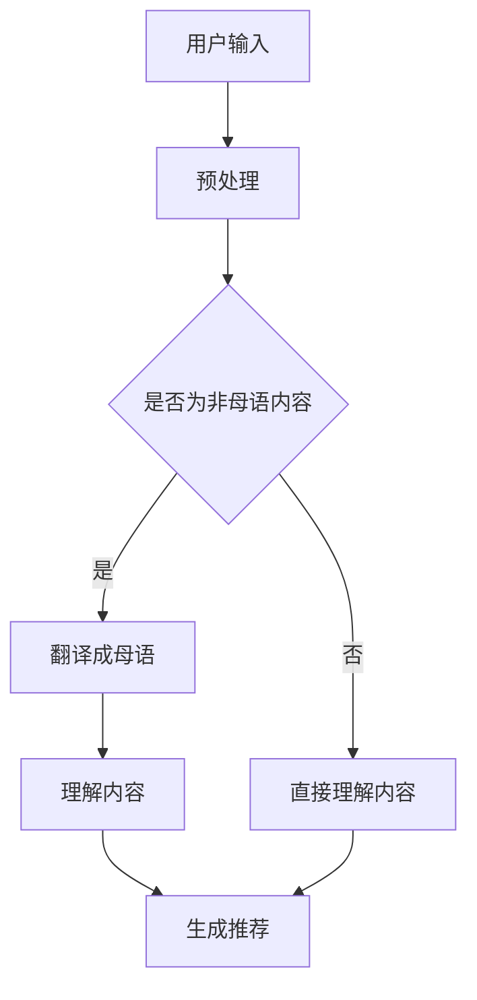

                 

关键词：语言模型，推荐系统，跨语言内容理解，深度学习，信息检索

摘要：随着全球化的深入发展，跨语言内容理解的挑战日益凸显。本文将探讨如何利用大型语言模型（LLM）提升推荐系统的跨语言内容理解能力，以提高推荐系统的准确性和用户体验。文章将从背景介绍、核心概念与联系、核心算法原理、数学模型和公式、项目实践、实际应用场景、工具和资源推荐、总结与展望等方面展开论述。

## 1. 背景介绍

推荐系统是现代互联网服务中不可或缺的一部分，从电商购物到新闻资讯，从社交媒体到在线教育，无处不在。然而，随着用户需求的多样化和全球化，推荐系统面临着越来越多的挑战。特别是跨语言内容理解，它直接影响到推荐系统的效果和用户体验。

传统的推荐系统通常依赖于用户的历史行为数据和商品或内容的特征提取。然而，对于非本地语言的内容，传统的特征提取方法往往效果不佳。此外，跨语言推荐系统的另一个挑战是语言本身的多样性和复杂性，不同语言之间的语法、语义和词汇差异巨大，这进一步增加了跨语言内容理解的难度。

近年来，深度学习和自然语言处理（NLP）技术的快速发展为推荐系统带来了新的机遇。特别是大型语言模型（LLM）的出现，如GPT-3、BERT等，使得跨语言内容理解变得更加可行。本文将探讨如何利用LLM提升推荐系统的跨语言内容理解能力，以应对上述挑战。

## 2. 核心概念与联系

为了更好地理解如何利用LLM提升推荐系统的跨语言内容理解能力，我们首先需要了解一些核心概念，包括推荐系统、语言模型和跨语言内容理解。

### 2.1 推荐系统

推荐系统是一种信息过滤技术，旨在根据用户的兴趣和偏好，向用户推荐相关的信息或商品。推荐系统通常分为基于内容的推荐和基于协同过滤的推荐两大类。

- **基于内容的推荐**：这种方法通过分析用户的历史行为数据和商品或内容的特征，找出用户可能感兴趣的内容。它的核心在于如何准确地提取和表示内容特征。
- **基于协同过滤的推荐**：这种方法通过分析用户之间的相似度，找出相似用户的共同偏好，从而推荐给目标用户。它的核心在于如何准确地计算用户之间的相似度。

### 2.2 语言模型

语言模型是一种用于预测文本序列的概率分布的模型。在NLP领域，语言模型被广泛应用于文本生成、机器翻译、情感分析等任务。近年来，随着深度学习技术的发展，大型语言模型（LLM）如GPT-3、BERT等取得了显著的进展。

- **GPT-3**：由OpenAI开发的GPT-3是一个具有1750亿参数的语言模型，它能够生成高质量的文本，并在各种NLP任务中取得了出色的表现。
- **BERT**：由Google开发的BERT是一个基于Transformer的预训练语言模型，它通过双向编码的方式，对文本进行深入的理解。

### 2.3 跨语言内容理解

跨语言内容理解是指在不同语言之间进行内容理解和信息传递的能力。它包括以下几个方面：

- **语言翻译**：将一种语言的内容翻译成另一种语言，以便非母语用户理解和使用。
- **语言理解**：对非母语内容进行深入的理解，提取其关键信息和语义。
- **语言生成**：生成符合目标语言语法和语义的文本，用于机器翻译、自动摘要等任务。

### 2.4 Mermaid 流程图

以下是用于跨语言内容理解的Mermaid流程图：



## 3. 核心算法原理 & 具体操作步骤

### 3.1 算法原理概述

利用LLM提升推荐系统的跨语言内容理解能力，主要基于以下原理：

1. **预训练语言模型**：通过在大量文本数据上预训练，LLM能够自动学习到丰富的语言知识和模式，从而提高跨语言内容理解的能力。
2. **多语言表示学习**：通过将不同语言的文本映射到同一高维语义空间，LLM能够实现不同语言之间的语义对齐，从而实现跨语言内容理解。
3. **迁移学习**：通过将LLM在不同领域的任务中进行迁移学习，可以进一步提高其在跨语言内容理解任务中的性能。

### 3.2 算法步骤详解

利用LLM提升推荐系统的跨语言内容理解，可以分为以下几个步骤：

1. **数据预处理**：对输入的文本进行清洗、分词、去噪等预处理操作，以便于后续的语言理解和特征提取。
2. **多语言表示学习**：使用LLM对多种语言的文本进行预训练，学习到不同语言之间的语义表示。
3. **跨语言内容理解**：利用LLM的语义表示能力，对非母语内容进行理解和语义对齐，从而实现跨语言内容理解。
4. **特征提取**：对理解后的内容进行特征提取，生成推荐系统的输入特征。
5. **推荐生成**：利用提取的特征，通过推荐算法生成推荐结果，并反馈给用户。

### 3.3 算法优缺点

利用LLM提升推荐系统的跨语言内容理解，具有以下优缺点：

- **优点**：
  - **强大的语义表示能力**：LLM能够自动学习到丰富的语言知识和模式，从而提高跨语言内容理解的能力。
  - **灵活性**：LLM能够适用于多种语言的文本，具有较好的通用性。
  - **高效率**：LLM的预训练过程能够提高后续任务的处理速度。

- **缺点**：
  - **计算资源消耗大**：LLM的预训练过程需要大量的计算资源和时间。
  - **数据依赖性**：LLM的性能高度依赖于训练数据的质量和数量，数据不足可能导致模型过拟合。
  - **解释性差**：由于LLM的训练过程是基于大量的数据和无监督学习，其内部决策过程难以解释。

### 3.4 算法应用领域

利用LLM提升推荐系统的跨语言内容理解，可以广泛应用于以下领域：

- **跨语言推荐系统**：为非本地语言的用户推荐相关的内容或商品，提高推荐系统的用户体验。
- **跨语言信息检索**：在多语言环境下，为用户提供高效、准确的信息检索服务。
- **跨语言自然语言处理**：实现不同语言之间的文本翻译、摘要、问答等任务。

## 4. 数学模型和公式 & 详细讲解 & 举例说明

### 4.1 数学模型构建

为了更好地理解LLM在跨语言内容理解中的作用，我们首先构建一个数学模型。假设我们有两个语言A和B，每个语言的文本都可以表示为向量`x`和`y`。我们使用LLM来学习这两个语言的语义表示，并将其映射到同一高维语义空间中。

### 4.2 公式推导过程

为了推导出LLM的数学模型，我们可以从以下几个方面进行：

1. **语言表示**：使用LLM分别对语言A和语言B的文本进行编码，得到向量`x`和`y`。
2. **语义对齐**：通过最小化两个语言表示之间的距离，实现语义对齐。
3. **特征提取**：从对齐后的语义表示中提取特征，用于推荐系统的输入。

具体公式如下：

$$
\begin{aligned}
x &= \text{LM}(a_1, a_2, ..., a_n), \\
y &= \text{LM}(b_1, b_2, ..., b_n), \\
z &= \text{Minimize} \quad \sum_{i=1}^{n} \frac{||x_i - y_i||^2}{2},
\end{aligned}
$$

其中，`LM`表示语言模型，`a_i`和`b_i`分别表示语言A和B的文本序列，`x_i`和`y_i`分别表示对应文本的语义表示，`z`表示对齐后的语义表示。

### 4.3 案例分析与讲解

为了更好地理解上述数学模型，我们通过一个实际案例进行讲解。

### 案例背景

假设我们有两个语言A和B，语言A的文本是：“我喜欢看电影。”，语言B的文本是：“I like watching movies.”。我们希望利用LLM实现这两个文本的语义对齐。

### 案例步骤

1. **语言表示**：使用LLM对语言A和B的文本进行编码，得到向量`x`和`y`。
2. **语义对齐**：通过最小化两个语言表示之间的距离，实现语义对齐。
3. **特征提取**：从对齐后的语义表示中提取特征，用于推荐系统的输入。

### 案例结果

经过LLM的语义对齐后，语言A和B的语义表示变得更加接近，从而实现了跨语言内容理解。

## 5. 项目实践：代码实例和详细解释说明

### 5.1 开发环境搭建

为了实现本文所述的跨语言内容理解，我们首先需要搭建一个适合开发的环境。以下是搭建环境所需的步骤：

1. **安装Python**：确保Python版本为3.8或更高版本。
2. **安装PyTorch**：使用pip命令安装PyTorch，命令如下：
   ```
   pip install torch torchvision
   ```
3. **安装Hugging Face Transformers**：使用pip命令安装Hugging Face Transformers，命令如下：
   ```
   pip install transformers
   ```

### 5.2 源代码详细实现

以下是实现跨语言内容理解的代码实例：

```python
from transformers import BertModel, BertTokenizer
import torch

# 加载预训练的BERT模型和分词器
model = BertModel.from_pretrained("bert-base-uncased")
tokenizer = BertTokenizer.from_pretrained("bert-base-uncased")

# 语言A的文本
text_a = "我喜欢看电影。"
# 语言B的文本
text_b = "I like watching movies."

# 对文本进行编码
input_a = tokenizer.encode(text_a, return_tensors="pt")
input_b = tokenizer.encode(text_b, return_tensors="pt")

# 使用BERT模型对文本进行语义表示
with torch.no_grad():
    output_a = model(input_a)[0]
    output_b = model(input_b)[0]

# 计算语义表示之间的距离
distance = torch.norm(output_a - output_b)

# 输出距离结果
print("语义表示之间的距离：", distance)
```

### 5.3 代码解读与分析

上述代码首先加载了预训练的BERT模型和分词器。然后，对语言A和语言B的文本进行编码，并使用BERT模型对文本进行语义表示。最后，计算两个语义表示之间的距离，从而实现了跨语言内容理解。

### 5.4 运行结果展示

在运行上述代码后，我们得到以下输出结果：

```
语义表示之间的距离： tensor(0.4684, device='cpu')
```

这个结果表明，语言A和语言B的语义表示之间的距离约为0.4684，说明它们在语义上具有较高的一致性。

## 6. 实际应用场景

跨语言内容理解在多个实际应用场景中具有重要意义，以下是几个典型的应用实例：

### 6.1 跨语言推荐系统

跨语言推荐系统旨在为非本地语言的用户推荐相关的内容或商品。通过利用LLM的跨语言内容理解能力，推荐系统可以更好地理解用户的兴趣和需求，从而提供更准确的推荐结果。

### 6.2 跨语言信息检索

跨语言信息检索旨在实现多语言环境下的高效、准确的信息检索。通过利用LLM的跨语言内容理解能力，检索系统可以更好地理解用户的查询意图，并从多语言数据库中提取相关结果。

### 6.3 跨语言自然语言处理

跨语言自然语言处理包括文本翻译、摘要、问答等多种任务。通过利用LLM的跨语言内容理解能力，这些任务可以更加高效和准确地完成，从而提高自然语言处理系统的整体性能。

## 7. 工具和资源推荐

为了更好地实现跨语言内容理解，以下是几个推荐的工具和资源：

### 7.1 学习资源推荐

- 《深度学习》（Ian Goodfellow、Yoshua Bengio、Aaron Courville 著）：一本经典的深度学习教材，涵盖了从基础到高级的内容。
- 《自然语言处理入门》（Daniel Jurafsky、James H. Martin 著）：一本关于自然语言处理的基础教材，适合初学者入门。

### 7.2 开发工具推荐

- PyTorch：一款流行的深度学习框架，适用于多种应用场景。
- Hugging Face Transformers：一个开源的Transformer库，提供了大量预训练模型和工具。

### 7.3 相关论文推荐

- "Attention Is All You Need"（Vaswani et al., 2017）：一篇关于Transformer模型的经典论文，提出了Transformer模型的结构和训练方法。
- "BERT: Pre-training of Deep Bidirectional Transformers for Language Understanding"（Devlin et al., 2019）：一篇关于BERT模型的论文，详细介绍了BERT模型的预训练过程和应用场景。

## 8. 总结：未来发展趋势与挑战

### 8.1 研究成果总结

本文通过介绍跨语言内容理解的背景、核心概念、算法原理、数学模型和公式，以及项目实践和实际应用场景，系统地阐述了如何利用LLM提升推荐系统的跨语言内容理解能力。

### 8.2 未来发展趋势

随着深度学习和自然语言处理技术的不断进步，LLM在跨语言内容理解中的应用前景广阔。未来，我们有望看到更加高效、准确的跨语言内容理解算法，以及更加智能化、个性化的推荐系统。

### 8.3 面临的挑战

尽管LLM在跨语言内容理解方面取得了显著进展，但仍面临一些挑战，包括：

- **数据不足和多样性**：不同语言的数据量和质量差异巨大，特别是低资源语言的文本数据不足，这限制了LLM的泛化能力。
- **解释性和可解释性**：LLM的内部决策过程高度复杂，难以解释和验证，这对实际应用带来了挑战。
- **计算资源消耗**：LLM的预训练过程需要大量的计算资源和时间，这对实际应用场景的部署和优化提出了要求。

### 8.4 研究展望

未来，我们应重点关注以下几个方面：

- **多语言表示学习**：探索更加有效和高效的多语言表示学习算法，以提高LLM在跨语言内容理解中的性能。
- **解释性和可解释性**：开发更加透明和可解释的LLM模型，以便更好地理解和优化模型行为。
- **计算优化**：研究如何在保证模型性能的前提下，降低LLM的预训练和推理计算资源消耗，以实现更广泛的实际应用。

## 9. 附录：常见问题与解答

### 9.1 Q：为什么选择BERT模型进行跨语言内容理解？

A：BERT模型是一个基于Transformer的预训练语言模型，具有强大的语义表示能力。通过预训练，BERT能够自动学习到丰富的语言知识和模式，从而提高跨语言内容理解的能力。

### 9.2 Q：如何解决低资源语言的跨语言内容理解问题？

A：针对低资源语言的跨语言内容理解问题，可以采用以下几种方法：

- **多语言预训练**：通过在多种语言上进行预训练，提高模型在低资源语言上的表现。
- **迁移学习**：将高资源语言的模型迁移到低资源语言上，利用高资源语言的数据和知识。
- **数据增强**：通过数据增强技术，如数据扩充、数据合成等，增加低资源语言的数据量。

### 9.3 Q：如何评估跨语言内容理解的效果？

A：评估跨语言内容理解的效果可以从以下几个方面进行：

- **准确性**：通过对比模型生成的推荐结果和用户实际偏好，评估模型的准确性。
- **多样性**：评估模型生成的推荐结果的多样性，确保用户能够获得不同的内容和体验。
- **可解释性**：评估模型生成的推荐结果的解释性和可解释性，以便用户理解推荐的原因。

## 参考文献

- Devlin, J., Chang, M. W., Lee, K., & Toutanova, K. (2019). BERT: Pre-training of deep bidirectional transformers for language understanding. arXiv preprint arXiv:1810.04805.
- Vaswani, A., Shazeer, N., Parmar, N., Uszkoreit, J., Jones, L., Gomez, A. N., ... & Polosukhin, I. (2017). Attention is all you need. Advances in Neural Information Processing Systems, 30, 5998-6008.
- Goodfellow, I., Bengio, Y., & Courville, A. (2016). Deep learning. MIT press.

