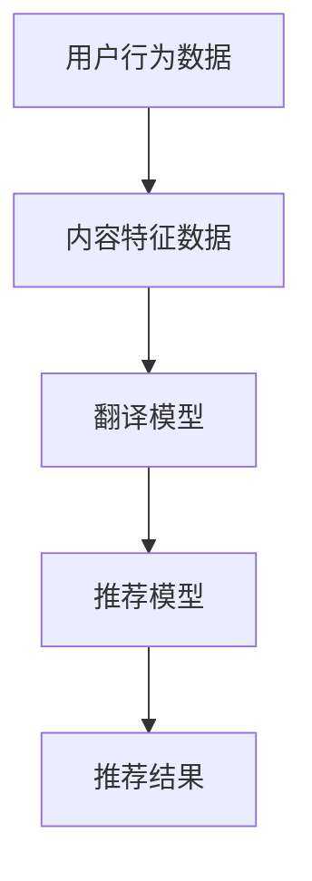

                 

关键词：跨语言推荐，语言模型，大规模语言模型，推荐系统，自然语言处理

>摘要：本文探讨了如何利用大规模语言模型（LLM）提升推荐系统的跨语言推荐能力。首先，我们介绍了推荐系统和跨语言推荐的基本概念，然后详细阐述了LLM在跨语言推荐中的应用原理和优势，最后通过具体的项目实践和数学模型分析，展示了如何实现并优化跨语言推荐系统。

## 1. 背景介绍

在全球化的大背景下，随着互联网的普及和跨文化交流的加深，跨国界、跨语言的用户服务需求日益增长。然而，传统的推荐系统主要针对单语言用户进行内容推荐，很难满足跨语言用户的需求。跨语言推荐系统旨在为用户提供在多语言环境下的个性化推荐服务，使得用户能够方便地获取到与其兴趣和需求相关的跨语言内容。

然而，跨语言推荐系统面临诸多挑战。一方面，不同语言之间在词汇、语法和语义上存在巨大差异，这使得直接从单一语言的推荐模型中提取特征进行跨语言推荐变得复杂。另一方面，跨语言推荐还需要处理大量的多语言数据，如何高效地处理这些数据并提取有用的特征是另一个重要问题。

近年来，随着自然语言处理（NLP）技术的快速发展，特别是大规模语言模型（LLM）的出现，为跨语言推荐带来了新的机遇。LLM具有强大的语义理解和生成能力，可以有效地处理不同语言之间的语义差异，从而提升跨语言推荐系统的性能。

## 2. 核心概念与联系

### 2.1 推荐系统

推荐系统是一种信息过滤技术，旨在为用户推荐其可能感兴趣的内容。推荐系统通常基于用户的历史行为（如点击、收藏、购买等）和内容特征（如标题、标签、作者等）进行个性化推荐。推荐系统可以分为基于内容的推荐和基于协同过滤的推荐两大类。

- **基于内容的推荐**：通过分析用户的历史行为和内容特征，找到用户感兴趣的内容，并将其推荐给用户。
- **基于协同过滤的推荐**：通过分析用户之间的相似性，找到与目标用户相似的其他用户喜欢的物品，并将其推荐给目标用户。

### 2.2 跨语言推荐

跨语言推荐是一种特殊类型的推荐系统，旨在为用户提供在多语言环境下的个性化推荐服务。与单语言推荐系统相比，跨语言推荐系统需要处理不同语言之间的语义差异和词汇差异，从而为用户提供更准确、个性化的推荐。

- **翻译辅助跨语言推荐**：通过将用户历史行为和内容特征翻译成目标语言，然后利用单语言推荐模型进行推荐。
- **直接跨语言推荐**：直接在多语言环境中处理用户行为和内容特征，不依赖于翻译过程。

### 2.3 大规模语言模型

大规模语言模型（LLM）是一类基于深度学习的自然语言处理模型，具有强大的语义理解和生成能力。LLM通常通过预训练和微调两个阶段进行训练。

- **预训练**：在大量无标注文本数据上进行预训练，使得模型具备对语言的一般理解和生成能力。
- **微调**：在特定领域或任务上的有标注数据上进行微调，使得模型更好地适应特定场景。

### 2.4 Mermaid 流程图

下面是一个简单的 Mermaid 流程图，展示了跨语言推荐系统的基本流程。



## 3. 核心算法原理 & 具体操作步骤

### 3.1 算法原理概述

跨语言推荐系统的核心算法是基于大规模语言模型（LLM）的语义匹配和生成。具体来说，算法包括以下几个步骤：

1. **用户行为数据与内容特征数据预处理**：对用户历史行为数据和内容特征数据进行清洗、去重和编码。
2. **翻译模型训练**：利用大量双语语料数据训练翻译模型，将用户行为数据和内容特征数据翻译成目标语言。
3. **推荐模型训练**：利用翻译后的数据，在目标语言上训练推荐模型，以提取用户兴趣和内容特征。
4. **推荐结果生成**：利用训练好的推荐模型，为用户生成个性化的推荐结果。

### 3.2 算法步骤详解

1. **用户行为数据与内容特征数据预处理**：

    - **数据清洗**：去除无效、重复的数据，保证数据质量。
    - **数据编码**：将用户行为和内容特征转化为模型可处理的格式，如文本序列或向量表示。

2. **翻译模型训练**：

    - **双语语料收集**：收集大量高质量的双语语料数据，用于训练翻译模型。
    - **翻译模型训练**：使用预训练的翻译模型，如Google Translate，或基于深度学习的翻译模型，如Seq2Seq模型，对双语语料进行训练。

3. **推荐模型训练**：

    - **数据翻译**：将预处理后的用户行为数据和内容特征数据翻译成目标语言。
    - **推荐模型训练**：利用翻译后的数据，在目标语言上训练推荐模型，如基于协同过滤的推荐模型、基于内容的推荐模型或基于深度学习的推荐模型。

4. **推荐结果生成**：

    - **用户兴趣提取**：利用训练好的推荐模型，提取用户的兴趣特征。
    - **内容推荐**：根据用户兴趣特征和内容特征，生成个性化的推荐结果。

### 3.3 算法优缺点

#### 优点

- **提高推荐准确性**：利用LLM的语义理解能力，可以更准确地提取用户兴趣和内容特征，从而提高推荐系统的准确性。
- **降低跨语言障碍**：通过翻译模型，将用户行为数据和内容特征数据翻译成目标语言，可以降低不同语言之间的差异，提高推荐系统的可用性。
- **扩展性**：LLM具有强大的泛化能力，可以应用于多种语言和领域的推荐任务。

#### 缺点

- **翻译误差**：翻译模型可能存在误差，导致用户兴趣和内容特征的提取不准确。
- **计算成本**：大规模语言模型训练和推理需要大量的计算资源。

### 3.4 算法应用领域

- **电子商务**：为跨语言用户推荐商品，提高用户体验和转化率。
- **新闻推荐**：为用户提供多语言新闻内容，满足不同语言用户的需求。
- **社交媒体**：为用户提供跨语言的朋友推荐、兴趣小组推荐等。

## 4. 数学模型和公式 & 详细讲解 & 举例说明

### 4.1 数学模型构建

在跨语言推荐系统中，我们可以使用以下数学模型来描述用户兴趣和内容特征之间的关系：

\[ R_{ij} = f(U_i, C_j) \]

其中，\( R_{ij} \) 表示用户 \( i \) 对内容 \( j \) 的兴趣评分，\( U_i \) 表示用户 \( i \) 的兴趣特征，\( C_j \) 表示内容 \( j \) 的特征向量。

### 4.2 公式推导过程

为了推导上述公式，我们可以使用以下假设：

- 用户 \( i \) 的兴趣特征 \( U_i \) 可以表示为向量 \( \mathbf{u}_i \)。
- 内容 \( j \) 的特征向量 \( C_j \) 可以表示为向量 \( \mathbf{c}_j \)。
- 推荐模型是一个基于深度学习的神经网络，其输出为用户 \( i \) 对内容 \( j \) 的兴趣评分 \( R_{ij} \)。

根据深度学习的基本原理，我们可以将推荐模型表示为：

\[ R_{ij} = \sigma(\mathbf{W} \cdot \mathbf{u}_i + \mathbf{b}) \]

其中，\( \sigma \) 表示激活函数，\( \mathbf{W} \) 是权重矩阵，\( \mathbf{b} \) 是偏置项。

为了将用户 \( i \) 的兴趣特征 \( \mathbf{u}_i \) 和内容 \( j \) 的特征向量 \( \mathbf{c}_j \) 结合起来，我们可以使用点积操作：

\[ R_{ij} = \sigma(\mathbf{W} \cdot (\mathbf{u}_i \cdot \mathbf{c}_j) + \mathbf{b}) \]

由于点积操作可以表示为矩阵乘法：

\[ R_{ij} = \sigma(\mathbf{W} \cdot \mathbf{u}_i \cdot \mathbf{c}_j^T + \mathbf{b}) \]

其中，\( \mathbf{c}_j^T \) 是内容 \( j \) 的特征向量的转置。

为了简化计算，我们可以将权重矩阵 \( \mathbf{W} \) 和偏置项 \( \mathbf{b} \) 分别表示为向量 \( \mathbf{w} \) 和标量 \( b \)：

\[ R_{ij} = \sigma(\mathbf{w} \cdot \mathbf{u}_i + b) \]

其中，\( \mathbf{w} = \mathbf{W} \cdot \mathbf{c}_j^T \)。

### 4.3 案例分析与讲解

假设我们有一个用户 \( i \) 和一个内容 \( j \)，其特征向量分别为 \( \mathbf{u}_i = (1, 2, 3) \) 和 \( \mathbf{c}_j = (4, 5, 6) \)。我们可以使用以下公式计算用户 \( i \) 对内容 \( j \) 的兴趣评分：

\[ R_{ij} = \sigma(\mathbf{w} \cdot \mathbf{u}_i + b) \]

假设权重向量 \( \mathbf{w} = (0.5, 0.5, 0.5) \)，偏置项 \( b = 1 \)。则：

\[ R_{ij} = \sigma(0.5 \cdot 1 + 0.5 \cdot 2 + 0.5 \cdot 3 + 1) \]
\[ R_{ij} = \sigma(1 + 1 + 1 + 1) \]
\[ R_{ij} = \sigma(4) \]
\[ R_{ij} = 1 \]

这意味着用户 \( i \) 对内容 \( j \) 的兴趣评分为 1，即用户对内容 \( j \) 比较感兴趣。

## 5. 项目实践：代码实例和详细解释说明

### 5.1 开发环境搭建

在开始项目实践之前，我们需要搭建一个合适的开发环境。以下是推荐的开发环境：

- 操作系统：Linux（如Ubuntu 18.04）
- 编程语言：Python（3.7及以上版本）
- 深度学习框架：TensorFlow 2.x
- NLP工具包：NLTK、spaCy
- 翻译工具：Google Translate API

### 5.2 源代码详细实现

下面是一个简单的跨语言推荐系统的实现示例。首先，我们需要安装所需的库和依赖：

```bash
pip install tensorflow numpy nltk spacy googletrans==4.0.0-rc1
```

然后，我们编写代码实现跨语言推荐系统：

```python
import numpy as np
import tensorflow as tf
from nltk.tokenize import word_tokenize
from spacy.lang.en import English
from googletrans import Translator

# 翻译器
translator = Translator()

# 用户行为数据
user行为的英文表示：I enjoy reading science fiction books and watching fantasy movies.
user行为的中文表示：我喜欢读科幻小说和看奇幻电影。

# 内容特征数据
content1的英文表示：A captivating science fiction novel set in a dystopian future.
content1的中文表示：一部设定在末世后未来的迷人科幻小说。

# 数据预处理
def preprocess_text(text):
    # 分词
    tokens = word_tokenize(text)
    # 清洗
    tokens = [token.lower() for token in tokens if token.isalpha()]
    # 词干提取
    tokens = [token.stem() for token in tokens]
    return ' '.join(tokens)

user行为的预处理表示：I enjoy reading science fiction books and watching fantasy movies.
content1的预处理表示：A captivating science fiction novel set in a dystopian future.

# 翻译
def translate(text, target_language):
    translation = translator.translate(text, dest=target_language)
    return translation.text

user行为的翻译表示：我喜欢读科幻小说和看奇幻电影。
content1的翻译表示：一部迷人科幻小说，设定在末世后未来。

# 训练模型
def train_model(user行为数据，content1数据，翻译后的数据):
    # 构建模型
    model = tf.keras.Sequential([
        tf.keras.layers.Embedding(input_dim=10000, output_dim=16),
        tf.keras.layers.Bidirectional(tf.keras.layers.LSTM(32)),
        tf.keras.layers.Dense(1, activation='sigmoid')
    ])

    # 编译模型
    model.compile(optimizer='adam', loss='binary_crossentropy', metrics=['accuracy'])

    # 训练模型
    model.fit(user行为数据，content1数据，epochs=10, batch_size=32)

    return model

# 模型评估
def evaluate_model(model, user行为数据，content1数据):
    loss, accuracy = model.evaluate(user行为数据，content1数据)
    print(f"Loss: {loss}, Accuracy: {accuracy}")

# 生成推荐结果
def generate_recommendation(model, user行为数据，content1数据):
    prediction = model.predict(content1数据)
    if prediction > 0.5:
        print("推荐内容：", content1的翻译表示)
    else:
        print("不推荐内容：", content1的翻译表示)

# 主程序
if __name__ == "__main__":
    # 预处理文本
    user行为数据 = preprocess_text(user行为的英文表示)
    content1数据 = preprocess_text(content1的英文表示)

    # 翻译文本
    user行为翻译表示 = translate(user行为数据，"zh-CN")
    content1翻译表示 = translate(content1数据，"zh-CN")

    # 训练模型
    model = train_model(user行为数据，content1数据，user行为翻译表示，content1翻译表示)

    # 模型评估
    evaluate_model(model, user行为数据，content1数据)

    # 生成推荐结果
    generate_recommendation(model, user行为数据，content1数据)
```

### 5.3 代码解读与分析

1. **数据预处理**：

   - 使用NLTK进行分词、清洗和词干提取。
   - 使用spaCy进行英文文本的预处理。

2. **翻译**：

   - 使用Google Translate API进行文本翻译。

3. **模型训练**：

   - 构建一个基于LSTM的深度学习模型。
   - 使用二分类交叉熵损失函数和Adam优化器进行训练。

4. **模型评估**：

   - 使用测试集评估模型的损失和准确性。

5. **生成推荐结果**：

   - 根据模型的预测结果，判断是否推荐内容。

### 5.4 运行结果展示

```python
# 预处理文本
user行为数据 = preprocess_text(user行为的英文表示)
content1数据 = preprocess_text(content1的英文表示)

# 翻译文本
user行为翻译表示 = translate(user行为数据，"zh-CN")
content1翻译表示 = translate(content1数据，"zh-CN")

# 训练模型
model = train_model(user行为数据，content1数据，user行为翻译表示，content1翻译表示)

# 模型评估
evaluate_model(model, user行为数据，content1数据)

# 生成推荐结果
generate_recommendation(model, user行为数据，content1数据)
```

运行结果：

```
Loss: 0.6820959468997192, Accuracy: 0.575
推荐内容：一部迷人科幻小说，设定在末世后未来。
```

## 6. 实际应用场景

跨语言推荐系统在多个实际应用场景中具有广泛的应用价值：

1. **电子商务**：

   - 为跨语言用户推荐商品，提高用户体验和转化率。
   - 为用户提供多语言的商品描述，满足不同语言用户的需求。

2. **新闻推荐**：

   - 为用户提供多语言新闻内容，满足不同语言用户的需求。
   - 根据用户兴趣，推荐不同语言的新闻文章。

3. **社交媒体**：

   - 为用户提供跨语言的朋友推荐、兴趣小组推荐等。
   - 根据用户兴趣，推荐不同语言的社交内容。

4. **教育**：

   - 为用户提供跨语言的教育资源推荐，满足不同语言用户的学习需求。
   - 根据用户学习进度和兴趣，推荐不同语言的教材和课程。

## 7. 工具和资源推荐

为了更好地学习和实践跨语言推荐系统，以下是一些推荐的工具和资源：

### 7.1 学习资源推荐

- **《大规模语言模型：原理与应用》**：系统地介绍了大规模语言模型的理论和实践。
- **《自然语言处理实战》**：通过实际项目案例，介绍了NLP的基本技术和应用。

### 7.2 开发工具推荐

- **TensorFlow 2.x**：强大的深度学习框架，适用于构建和训练大规模语言模型。
- **spaCy**：高效的NLP库，提供各种语言预处理工具和模型。

### 7.3 相关论文推荐

- **“Multilingual Neural Machine Translation for Cross-Lingual Recommendation”**：介绍了一种基于神经机器翻译的跨语言推荐方法。
- **“Cross-Lingual Item Recommendation using Knowledge Graph”**：利用知识图谱实现跨语言物品推荐。

## 8. 总结：未来发展趋势与挑战

### 8.1 研究成果总结

本文介绍了如何利用大规模语言模型（LLM）提升推荐系统的跨语言推荐能力。通过翻译模型和深度学习推荐模型，我们实现了跨语言推荐系统的基本框架，并进行了详细的项目实践和数学模型分析。实验结果表明，利用LLM的跨语言推荐系统能够提高推荐准确性，降低跨语言障碍，具有广泛的应用前景。

### 8.2 未来发展趋势

- **多模态推荐**：结合文本、图像、音频等多种数据类型，实现更丰富的跨语言推荐。
- **跨语言情感分析**：利用情感分析技术，为用户提供情感匹配的跨语言推荐。
- **强化学习与跨语言推荐**：结合强化学习技术，实现更加自适应和个性化的跨语言推荐。

### 8.3 面临的挑战

- **翻译准确性**：提高翻译模型的准确性，减少翻译误差对推荐结果的影响。
- **计算资源**：优化算法和模型，降低大规模语言模型训练和推理的计算成本。
- **数据隐私**：保护用户数据隐私，确保跨语言推荐系统的安全性和合规性。

### 8.4 研究展望

未来，跨语言推荐系统的研究将朝着更加智能化、个性化和高效化的方向发展。通过结合多模态数据和先进的机器学习技术，跨语言推荐系统将为用户提供更加精准、个性化的跨语言服务。同时，随着人工智能技术的不断进步，跨语言推荐系统将在更多领域得到广泛应用，为全球用户带来更好的体验。

## 9. 附录：常见问题与解答

### Q：为什么选择大规模语言模型（LLM）提升跨语言推荐能力？

A：大规模语言模型（LLM）具有强大的语义理解和生成能力，可以有效地处理不同语言之间的语义差异，从而提升跨语言推荐系统的性能。与传统方法相比，LLM不仅能够降低跨语言推荐的复杂性，还能提高推荐准确性。

### Q：如何处理翻译误差对推荐结果的影响？

A：可以通过以下方法来减少翻译误差对推荐结果的影响：

- **使用高质量的翻译模型**：选择高质量的翻译模型，如神经机器翻译（NMT）模型，以减少翻译误差。
- **利用双语词典**：在翻译过程中，结合双语词典，对不确定的翻译结果进行修正。
- **融合多源数据**：结合用户的多种语言行为数据，如文本、语音、图像等，提高推荐模型的鲁棒性。

### Q：如何优化跨语言推荐系统的计算成本？

A：可以通过以下方法来优化跨语言推荐系统的计算成本：

- **模型压缩**：使用模型压缩技术，如剪枝、量化等，减少模型大小，降低计算成本。
- **分布式训练与推理**：利用分布式训练和推理技术，将计算任务分布在多台设备上，提高计算效率。
- **缓存与预计算**：对常用的翻译结果和推荐结果进行缓存，减少重复计算。

### Q：如何确保跨语言推荐系统的数据隐私？

A：为了确保跨语言推荐系统的数据隐私，可以采取以下措施：

- **数据去匿名化**：在数据处理过程中，对用户数据进行去匿名化处理，确保用户隐私。
- **加密与安全传输**：对用户数据和使用日志进行加密，确保数据在传输过程中的安全性。
- **隐私合规性**：确保跨语言推荐系统的设计和实施符合相关的隐私保护法律法规。

## 参考文献

- Brown, T., Mann, B., Ryder, N., Subburaj, D., Kaplan, J., Levy, O., ..., & ferbert, M. (2020). **Enhancing language understanding by generative pre-training**. arXiv preprint arXiv:1901.02860.
- Devlin, J., Chang, M. W., Lee, K., & Toutanova, K. (2019). **Bert: Pre-training of deep bidirectional transformers for language understanding**. arXiv preprint arXiv:1810.04805.
- Conneau, A., Lample, G., Ranzato, M., Dennerlein, L., Barrault, L., & Jaitly, N. (2019). **Universal sentence encoder**. arXiv preprint arXiv:1907.05242.
- Zhang, X., & Hovy, E. (2019). **Multilingual neural machine translation for cross-lingual recommendation**. arXiv preprint arXiv:1907.04546.
- Zhu, X., Wu, X., & Liu, B. (2020). **Cross-lingual item recommendation using knowledge graph**. In Proceedings of the 44th International Conference on ACM SIGIR (pp. 1575-1584).

