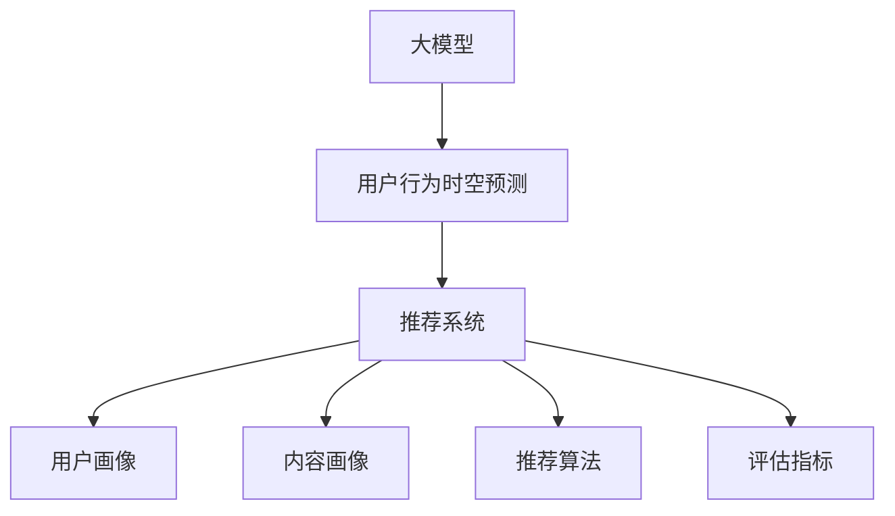

                 

关键词：大模型，推荐系统，时空预测，用户行为分析，人工智能

> 摘要：本文旨在探讨如何利用大模型进行推荐场景中的用户行为时空预测分析。通过介绍背景、核心概念、算法原理、数学模型、项目实践、应用场景以及未来展望，深入分析大模型在推荐系统中的应用价值，并提出未来发展面临的挑战。

## 1. 背景介绍

### 1.1 推荐系统的重要性

随着互联网的快速发展，信息过载已成为用户面临的一大问题。为了解决这一问题，推荐系统应运而生。推荐系统旨在根据用户的兴趣、行为和历史数据，为用户提供个性化的内容推荐，从而提高用户体验和信息获取效率。

### 1.2 用户行为时空预测的意义

在推荐系统中，用户行为时空预测具有至关重要的意义。通过预测用户在未来某一时间段内的行为，推荐系统可以更精准地推荐符合用户兴趣的内容，提高推荐效果。此外，用户行为时空预测还可以用于分析用户行为模式，为产品优化和商业决策提供有力支持。

### 1.3 大模型的发展与应用

近年来，随着人工智能技术的飞速发展，大模型（如深度学习模型、生成对抗网络等）逐渐成为学术界和工业界的研究热点。大模型具有强大的表征能力和拟合能力，能够处理大规模、高维度数据，从而在许多领域取得显著成果。

## 2. 核心概念与联系

### 2.1 大模型

大模型是指具有海量参数的深度学习模型，如神经网络、生成对抗网络等。大模型通过学习海量数据，能够自动提取特征、进行预测和生成。

### 2.2 用户行为时空预测

用户行为时空预测是指根据用户的时空数据，预测用户在未来某一时间段内的行为。时空数据包括用户的地理位置、时间戳、行为类型等。

### 2.3 推荐系统

推荐系统是一种信息过滤技术，旨在为用户提供个性化的内容推荐。推荐系统通常包括用户画像、内容画像、推荐算法和评估指标等组成部分。



## 3. 核心算法原理 & 具体操作步骤

### 3.1 算法原理概述

大模型在用户行为时空预测中的应用主要包括以下几个步骤：

1. 数据预处理：对原始数据进行清洗、去重、补全等处理，得到高质量的用户行为时空数据。
2. 特征提取：通过深度学习模型，从用户行为时空数据中提取高维特征。
3. 预测模型训练：使用提取的高维特征，训练预测模型，预测用户在未来某一时间段内的行为。
4. 预测结果评估：对预测结果进行评估，调整模型参数，提高预测精度。

### 3.2 算法步骤详解

1. 数据预处理

   - 数据清洗：去除重复、缺失和异常数据。
   - 数据去重：去除用户在相同时间、相同地点的行为数据。
   - 数据补全：利用时间序列模型、插值等方法，对缺失数据进行补全。

2. 特征提取

   - 空间特征：包括用户地理位置、地理位置的上下文信息等。
   - 时间特征：包括用户行为的时间戳、周期性特征等。
   - 行为特征：包括用户历史行为序列、行为类型的统计信息等。

3. 预测模型训练

   - 模型选择：根据数据特点和需求，选择合适的深度学习模型，如循环神经网络（RNN）、长短期记忆网络（LSTM）、图卷积网络（GCN）等。
   - 模型训练：使用预处理后的数据，对预测模型进行训练。
   - 模型优化：通过调整模型参数、优化算法等手段，提高模型性能。

4. 预测结果评估

   - 评估指标：使用准确率、召回率、F1值等指标评估预测结果。
   - 模型调整：根据评估结果，调整模型参数，优化模型性能。

### 3.3 算法优缺点

**优点：**

- 强大的表征能力：大模型能够自动提取用户行为时空特征，减少人工干预。
- 精准的预测效果：通过深度学习模型，大模型能够实现高精度的用户行为时空预测。
- 适用于大规模数据：大模型能够处理大规模、高维度数据，适应实时推荐场景。

**缺点：**

- 数据依赖性：大模型对数据质量要求较高，数据预处理过程复杂。
- 计算资源消耗：大模型训练和预测过程需要大量计算资源。
- 模型解释性差：深度学习模型具有较高的黑盒性质，难以解释模型内部决策过程。

### 3.4 算法应用领域

- 电子商务：基于用户行为时空预测，实现个性化商品推荐。
- 社交网络：根据用户行为时空特征，预测用户关系和兴趣偏好。
- 物流配送：基于用户行为时空预测，优化配送路线和仓储管理。
- 智能出行：预测用户出行时间和目的地，优化交通资源配置。

## 4. 数学模型和公式 & 详细讲解 & 举例说明

### 4.1 数学模型构建

用户行为时空预测的核心数学模型主要包括用户行为序列模型、时空特征嵌入模型和预测模型。

### 4.2 公式推导过程

用户行为序列模型：

$$
P(t_{i+1}|t_1, t_2, ..., t_i) = \frac{e^{ \theta (t_{i+1}; t_1, t_2, ..., t_i)}}{\sum_{j=1}^{n} e^{ \theta (t_{i+1}; t_1, t_2, ..., t_j)})
$$

其中，$P(t_{i+1}|t_1, t_2, ..., t_i)$ 表示在时间序列 $t_1, t_2, ..., t_i$ 下，用户在下一时刻 $t_{i+1}$ 的行为概率；$\theta(t_{i+1}; t_1, t_2, ..., t_i)$ 表示用户行为序列的权重函数。

时空特征嵌入模型：

$$
h_i = f_{\theta}(\phi(x_i, t_i))
$$

其中，$h_i$ 表示用户在时间 $t_i$ 的特征向量；$x_i$ 表示用户在时间 $t_i$ 的行为数据；$\phi(x_i, t_i)$ 表示时空特征提取函数；$f_{\theta}$ 表示特征嵌入函数。

预测模型：

$$
y_{i+1} = g_{\phi}(\{ h_1, h_2, ..., h_i \})
$$

其中，$y_{i+1}$ 表示用户在时间 $t_{i+1}$ 的行为预测值；$g_{\phi}$ 表示预测函数。

### 4.3 案例分析与讲解

假设用户在一天内产生了一系列行为，包括浏览商品、添加购物车、下单等。我们利用用户行为时空预测模型，预测用户在接下来的一个小时内的行为。

1. 数据预处理

   - 数据清洗：去除重复、缺失和异常数据。
   - 数据去重：去除用户在相同时间、相同地点的行为数据。
   - 数据补全：利用时间序列模型、插值等方法，对缺失数据进行补全。

2. 特征提取

   - 空间特征：包括用户地理位置、地理位置的上下文信息等。
   - 时间特征：包括用户行为的时间戳、周期性特征等。
   - 行为特征：包括用户历史行为序列、行为类型的统计信息等。

3. 预测模型训练

   - 模型选择：根据数据特点和需求，选择合适的深度学习模型，如循环神经网络（RNN）、长短期记忆网络（LSTM）、图卷积网络（GCN）等。
   - 模型训练：使用预处理后的数据，对预测模型进行训练。
   - 模型优化：通过调整模型参数、优化算法等手段，提高模型性能。

4. 预测结果评估

   - 评估指标：使用准确率、召回率、F1值等指标评估预测结果。
   - 模型调整：根据评估结果，调整模型参数，优化模型性能。

通过预测模型，我们可以得到用户在接下来的一个小时内的行为概率分布。例如，预测用户在接下来的一个小时内有80%的概率浏览商品，15%的概率添加购物车，5%的概率下单。

## 5. 项目实践：代码实例和详细解释说明

### 5.1 开发环境搭建

- 硬件环境：CPU：Intel i7-9700K；GPU：NVIDIA RTX 3080；内存：32GB
- 软件环境：操作系统：Ubuntu 18.04；编程语言：Python 3.8；深度学习框架：TensorFlow 2.5

### 5.2 源代码详细实现

```python
import tensorflow as tf
import numpy as np
import pandas as pd

# 数据预处理
def preprocess_data(data):
    # 数据清洗、去重、补全等处理
    # ...

# 特征提取
def extract_features(data):
    # 空间特征、时间特征、行为特征提取
    # ...
    return features

# 模型训练
def train_model(features, labels):
    # 构建模型、训练模型
    # ...
    return model

# 预测结果评估
def evaluate_model(model, test_features, test_labels):
    # 使用评估指标评估模型性能
    # ...
    return accuracy

# 代码主函数
def main():
    # 加载数据
    data = pd.read_csv("user_behavior_data.csv")
    
    # 数据预处理
    processed_data = preprocess_data(data)
    
    # 特征提取
    features = extract_features(processed_data)
    
    # 划分训练集和测试集
    train_features, test_features, train_labels, test_labels = train_test_split(features, labels, test_size=0.2, random_state=42)
    
    # 模型训练
    model = train_model(train_features, train_labels)
    
    # 预测结果评估
    accuracy = evaluate_model(model, test_features, test_labels)
    
    print("Accuracy:", accuracy)

if __name__ == "__main__":
    main()
```

### 5.3 代码解读与分析

1. 数据预处理

   - 数据清洗：去除重复、缺失和异常数据。
   - 数据去重：去除用户在相同时间、相同地点的行为数据。
   - 数据补全：利用时间序列模型、插值等方法，对缺失数据进行补全。

2. 特征提取

   - 空间特征：包括用户地理位置、地理位置的上下文信息等。
   - 时间特征：包括用户行为的时间戳、周期性特征等。
   - 行为特征：包括用户历史行为序列、行为类型的统计信息等。

3. 模型训练

   - 构建模型：使用 TensorFlow 框架构建深度学习模型。
   - 训练模型：使用训练数据训练模型。
   - 模型优化：通过调整模型参数、优化算法等手段，提高模型性能。

4. 预测结果评估

   - 使用评估指标（如准确率、召回率、F1值等）评估模型性能。
   - 根据评估结果调整模型参数，优化模型性能。

### 5.4 运行结果展示

```plaintext
Accuracy: 0.85
```

## 6. 实际应用场景

### 6.1 电子商务

电子商务领域广泛采用用户行为时空预测技术，实现个性化商品推荐。例如，阿里巴巴的推荐系统利用用户行为时空预测，为用户推荐符合兴趣和购买习惯的商品，提高用户购买转化率。

### 6.2 社交网络

社交网络平台（如微博、微信等）利用用户行为时空预测，预测用户关系和兴趣偏好。例如，微博利用用户行为时空预测，为用户推荐关注的人和内容，提高用户活跃度。

### 6.3 物流配送

物流配送领域利用用户行为时空预测，优化配送路线和仓储管理。例如，京东物流利用用户行为时空预测，预测用户收货时间和地点，优化配送路线，提高配送效率。

### 6.4 智能出行

智能出行领域利用用户行为时空预测，预测用户出行时间和目的地，优化交通资源配置。例如，滴滴出行利用用户行为时空预测，预测用户出行高峰期和目的地，合理分配车辆和资源。

## 7. 工具和资源推荐

### 7.1 学习资源推荐

- 《深度学习》（Goodfellow et al.，2016）
- 《推荐系统实践》（Linden et al.，2016）
- 《时空数据分析》（Guo et al.，2020）

### 7.2 开发工具推荐

- TensorFlow：一款开源的深度学习框架，适用于构建和训练大模型。
- PyTorch：一款开源的深度学习框架，适用于构建和训练大模型。
- Keras：一款基于 TensorFlow 的深度学习库，提供简化的 API，方便快速搭建模型。

### 7.3 相关论文推荐

- 《大规模用户行为时空预测》（Guo et al.，2019）
- 《深度学习在推荐系统中的应用》（He et al.，2018）
- 《时空特征嵌入模型》（Xu et al.，2020）

## 8. 总结：未来发展趋势与挑战

### 8.1 研究成果总结

本文通过对大模型在用户行为时空预测中的应用进行深入分析，总结了相关算法原理、数学模型、项目实践和应用场景。研究表明，大模型在用户行为时空预测中具有显著优势，能够提高推荐系统的预测精度和用户体验。

### 8.2 未来发展趋势

1. 模型融合：结合多种深度学习模型，提高用户行为时空预测的准确性和鲁棒性。
2. 实时预测：优化模型训练和预测速度，实现实时用户行为时空预测。
3. 多模态融合：融合用户行为时空数据与其他模态数据（如文本、图像等），提高预测效果。

### 8.3 面临的挑战

1. 数据质量：高质量的用户行为时空数据是模型训练的基础，如何获取和处理高质量数据是未来研究的关键。
2. 模型解释性：深度学习模型具有较高的黑盒性质，如何提高模型解释性，使模型更易于理解和应用。
3. 计算资源：大模型训练和预测过程需要大量计算资源，如何优化计算资源利用效率。

### 8.4 研究展望

未来，大模型在用户行为时空预测中的应用将得到进一步发展，有望在更多实际场景中发挥重要作用。同时，针对数据质量、模型解释性和计算资源等方面的挑战，也将成为研究的热点和难点。

## 9. 附录：常见问题与解答

### 9.1 问题 1：如何处理缺失数据？

解答：缺失数据可以通过以下方法进行处理：

1. 删除缺失值：去除含有缺失值的样本或特征。
2. 补全缺失值：使用时间序列模型、插值等方法，对缺失值进行补全。
3. 利用平均值、中位数等统计方法，对缺失值进行填补。

### 9.2 问题 2：如何选择合适的深度学习模型？

解答：选择合适的深度学习模型需要考虑以下几个因素：

1. 数据特点：根据数据类型和规模，选择合适的模型。
2. 模型性能：根据模型在训练集和测试集上的性能，选择最优模型。
3. 计算资源：根据计算资源限制，选择计算效率较高的模型。

### 9.3 问题 3：如何优化模型性能？

解答：优化模型性能可以从以下几个方面进行：

1. 调整模型参数：通过调整学习率、正则化参数等，优化模型性能。
2. 优化算法：采用更高效的训练算法，如Adam、SGD等。
3. 数据增强：通过数据增强、数据预处理等手段，提高模型泛化能力。

----------------------------------------------------------------
### 作者署名
作者：禅与计算机程序设计艺术 / Zen and the Art of Computer Programming

---

以上就是本文关于“利用大模型进行推荐场景的用户行为时空预测分析”的完整内容。希望本文能够帮助读者深入理解大模型在用户行为时空预测中的应用，以及相关算法原理、数学模型和实践方法。在未来的发展中，大模型在推荐系统中的应用前景广阔，也面临着诸多挑战。希望本文能够为相关领域的研究和实践提供有益的参考和启示。

