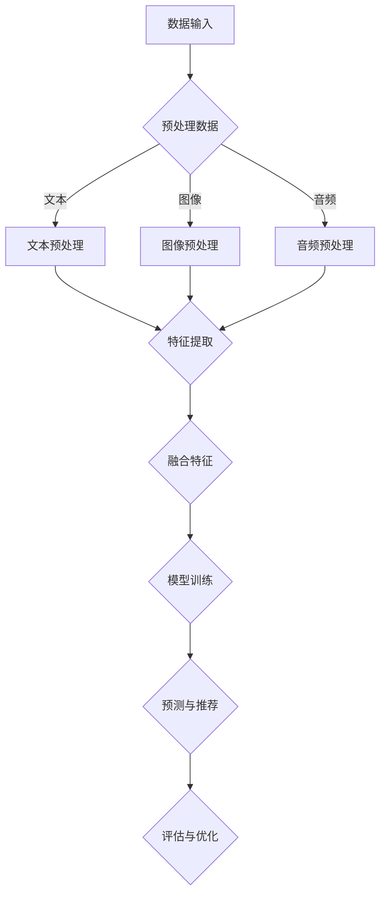

                 

关键词：大模型，跨模态推荐，深度学习，AI技术，算法优化，实践案例

## 摘要

本文深入探讨了利用大模型进行跨模态推荐的技术与应用。随着人工智能技术的快速发展，大模型在跨模态推荐领域展现出了巨大的潜力。本文首先介绍了跨模态推荐的基本概念和重要性，然后详细阐述了大模型在跨模态推荐中的核心算法原理和具体操作步骤。通过数学模型和公式，本文提供了详细的理论基础，并通过实践案例展示了大模型在实际开发中的应用。此外，本文还探讨了跨模态推荐在各个行业的实际应用场景，并对未来发展趋势和面临的挑战进行了展望。本文旨在为从事跨模态推荐领域的研究者和开发者提供有价值的参考和指导。

## 1. 背景介绍

随着信息技术的飞速发展，数据量呈现爆炸式增长，人们对个性化推荐系统的需求也越来越高。传统的推荐系统主要依赖于单一模态的数据，如文本、图像或音频，而跨模态推荐系统则能够整合多种模态的数据，为用户提供更加精准和个性化的推荐结果。跨模态推荐的核心在于将不同模态的数据进行有效融合，从而提高推荐的准确性和多样性。

大模型，也称为大型预训练模型，是近年来人工智能领域的重要突破。大模型通过在海量数据上进行预训练，能够自动学习和提取不同模态的特征表示，从而实现跨模态数据的理解和交互。大模型的强大学习能力使得其在跨模态推荐领域具有巨大的应用潜力。

在跨模模态推荐中，大模型的应用主要体现在以下几个方面：

1. **多模态数据的融合**：大模型能够同时处理多种模态的数据，通过融合不同模态的特征，实现更全面的信息理解。

2. **高维数据的降维**：大模型可以自动学习数据的低维表示，降低数据的维度，简化推荐系统的计算复杂度。

3. **语义理解的增强**：大模型通过对文本、图像和音频等数据的深度理解，能够捕捉到更多隐藏的语义信息，从而提高推荐的准确性。

4. **自适应性和泛化能力**：大模型具有较强的自适应性和泛化能力，能够应对各种复杂的应用场景和用户需求。

总的来说，大模型在跨模态推荐中具有显著的优势，能够显著提升推荐系统的性能和用户体验。然而，大模型的应用也面临一些挑战，如模型的可解释性、计算资源的消耗和数据隐私保护等问题。本文将深入探讨大模型在跨模态推荐中的应用和实践，以期为该领域的研究者提供有价值的参考。

### 2. 核心概念与联系

在深入探讨大模型在跨模态推荐中的应用之前，我们需要先了解一些核心概念和它们之间的联系。以下是跨模态推荐中的关键概念及其相互关系：

#### 2.1 跨模态推荐

跨模态推荐（Multimodal Recommendation）是一种推荐系统技术，它能够整合来自不同模态的数据，如文本、图像、声音和视频等，以提供更精准的个性化推荐。跨模态推荐的关键在于如何将不同模态的数据进行有效融合，以提取出对用户和物品更加全面和深刻的理解。

#### 2.2 大模型

大模型（Large-scale Model）是指具有数亿甚至数千亿参数的深度学习模型。这些模型通常经过大量的数据预训练，能够在多种任务中展现出强大的性能。大模型通过自我学习和优化，能够自动捕捉和表示复杂的数据特征，从而在跨模态推荐中发挥重要作用。

#### 2.3 多模态数据融合

多模态数据融合（Multimodal Data Fusion）是将来自不同模态的数据源（如文本、图像、音频等）进行整合，以提取更全面和深度的信息。在跨模态推荐中，多模态数据融合是关键步骤，它能够帮助推荐系统更好地理解和预测用户需求。

#### 2.4 深度学习

深度学习（Deep Learning）是一种基于多层神经网络的学习方法，它能够自动从数据中提取特征和模式。深度学习在跨模态推荐中的应用主要体现在特征提取和表示学习方面，它能够将不同模态的数据转化为统一的高维特征表示。

#### 2.5 语义理解

语义理解（Semantic Understanding）是指对文本、图像和音频等数据中含义的理解。在跨模态推荐中，语义理解有助于捕捉用户和物品的深层次信息，从而提高推荐系统的准确性。

#### 2.6 跨模态交互

跨模态交互（Multimodal Interaction）是指不同模态数据之间的相互作用和融合。在跨模态推荐中，跨模态交互能够增强对用户和物品的全面理解，从而提高推荐的效果。

#### 2.7 联合表示学习

联合表示学习（Joint Representation Learning）是指同时学习不同模态数据的表示，以捕捉它们之间的内在联系。在跨模态推荐中，联合表示学习能够提高推荐的准确性和多样性。

#### 2.8 大模型与跨模态推荐的联系

大模型与跨模态推荐之间的联系主要体现在以下几个方面：

1. **多模态数据的融合**：大模型能够同时处理多种模态的数据，通过融合不同模态的特征，实现更全面的信息理解。
2. **高维数据的降维**：大模型可以自动学习数据的低维表示，降低数据的维度，简化推荐系统的计算复杂度。
3. **语义理解的增强**：大模型通过对文本、图像和音频等数据的深度理解，能够捕捉到更多隐藏的语义信息，从而提高推荐的准确性。
4. **自适应性和泛化能力**：大模型具有较强的自适应性和泛化能力，能够应对各种复杂的应用场景和用户需求。

### 2.9 Mermaid 流程图

为了更直观地展示核心概念和它们之间的联系，我们使用Mermaid流程图来描述大模型在跨模态推荐中的关键步骤。



在这个流程图中，数据输入包括文本、图像和音频等多种模态的数据，经过预处理和特征提取后，不同模态的数据特征被融合并输入到训练模型中。经过训练和预测，推荐系统可以生成个性化的推荐结果，并通过评估和优化进一步提高推荐的准确性。

通过上述核心概念和联系的介绍，我们为理解大模型在跨模态推荐中的应用奠定了基础。在接下来的章节中，我们将详细探讨大模型在跨模态推荐中的核心算法原理和具体操作步骤。

### 3. 核心算法原理 & 具体操作步骤

#### 3.1 算法原理概述

大模型在跨模态推荐中的应用主要基于深度学习和多模态数据融合技术。其核心原理是通过大规模预训练模型自动学习和提取不同模态的数据特征，并将这些特征进行有效融合，以生成高质量的推荐结果。以下是具体步骤的详细解释：

1. **多模态数据预处理**：首先，对来自不同模态的数据进行预处理，包括文本、图像和音频的清洗、归一化和特征提取。

2. **特征提取**：利用深度学习模型对预处理后的多模态数据分别进行特征提取，生成各自的特征表示。

3. **特征融合**：将不同模态的特征进行融合，通过构建联合表示学习模型，学习不同模态之间的内在联系，生成统一的特征表示。

4. **模型训练**：使用融合后的特征数据进行模型训练，通常采用基于梯度下降的优化算法，如Adam或RMSprop，以提高模型的收敛速度和稳定性。

5. **预测与推荐**：在训练好的模型基础上，对新的用户和物品数据进行预测，生成个性化的推荐结果。

6. **评估与优化**：通过评估指标（如准确率、召回率和F1值）对推荐结果进行评估，并根据评估结果对模型进行优化，以提高推荐效果。

#### 3.2 算法步骤详解

**步骤1：多模态数据预处理**

数据预处理是跨模态推荐系统的第一步，其目的是提高数据的清洁度和一致性。具体包括以下操作：

- **文本预处理**：去除停用词、标点符号和特殊字符，进行分词和词性标注，将文本转化为词向量或词嵌入。
- **图像预处理**：对图像进行缩放、裁剪、旋转等操作，使其符合模型的输入要求。常用的图像预处理方法包括归一化、标准化和PCA降维等。
- **音频预处理**：对音频进行降噪、去噪和增强等处理，提取音频特征，如MFCC（梅尔频率倒谱系数）或音频波形。

**步骤2：特征提取**

特征提取是跨模态推荐系统的核心步骤，它通过深度学习模型自动学习多模态数据的特征表示。以下是常用的特征提取方法：

- **文本特征提取**：利用自然语言处理（NLP）技术，如BERT、GPT等预训练模型，提取文本的词向量或句子向量。
- **图像特征提取**：使用卷积神经网络（CNN）对图像进行特征提取，生成图像的特征向量。
- **音频特征提取**：使用循环神经网络（RNN）或长短时记忆网络（LSTM）提取音频的特征序列。

**步骤3：特征融合**

特征融合是将不同模态的特征进行整合，以生成统一的特征表示。常用的特征融合方法包括：

- **拼接融合**：将不同模态的特征向量直接拼接在一起，生成新的特征向量。
- **加权融合**：根据不同模态的特征重要程度，对特征向量进行加权融合，生成新的特征向量。
- **对抗融合**：使用对抗性神经网络（GAN）生成跨模态的特征表示，实现特征的无监督融合。

**步骤4：模型训练**

在特征融合后，使用训练数据对模型进行训练。模型训练的目的是优化模型参数，使其能够更好地拟合训练数据。常用的训练方法包括：

- **基于梯度的优化算法**：如梯度下降（GD）、随机梯度下降（SGD）、Adam等，用于优化模型的参数。
- **正则化技术**：如L1正则化、L2正则化等，用于防止过拟合和提高模型的泛化能力。

**步骤5：预测与推荐**

在模型训练完成后，可以使用训练好的模型对新的用户和物品数据进行预测，生成个性化的推荐结果。预测过程主要包括：

- **用户表示学习**：将新用户的特征输入到模型中，生成用户表示向量。
- **物品表示学习**：将新物品的特征输入到模型中，生成物品表示向量。
- **相似度计算**：计算用户表示和物品表示之间的相似度，选择相似度最高的物品进行推荐。

**步骤6：评估与优化**

评估与优化是跨模态推荐系统的关键环节，通过评估指标对推荐结果进行评估，并根据评估结果对模型进行优化。常用的评估指标包括：

- **准确率（Accuracy）**：预测正确的样本数占总样本数的比例。
- **召回率（Recall）**：预测正确的正样本数占总正样本数的比例。
- **F1值（F1-score）**：准确率和召回率的调和平均值。

**步骤7：模型优化**

根据评估结果，对模型进行优化，以提高推荐效果。优化方法包括：

- **调整模型参数**：如学习率、批量大小等，以优化模型的训练过程。
- **增加训练数据**：通过收集更多高质量的训练数据，提高模型的泛化能力。
- **改进特征提取方法**：根据实际需求，改进特征提取方法，提高特征的质量和多样性。

通过以上步骤，我们可以构建一个高效和准确的跨模态推荐系统。在接下来的章节中，我们将进一步探讨大模型在跨模态推荐中的优缺点和应用领域。

### 3.3 算法优缺点

大模型在跨模态推荐中具有显著的优点，但也存在一些局限性。以下是对这些优缺点的详细分析：

#### 优点

1. **强大的特征提取能力**：大模型通过在海量数据上进行预训练，能够自动学习和提取不同模态的深层特征，这使得推荐系统能够更好地理解和预测用户需求。

2. **高维数据的降维**：大模型能够将高维数据转化为低维特征表示，降低数据的维度，简化推荐系统的计算复杂度，从而提高系统的效率。

3. **增强的语义理解**：大模型通过对文本、图像和音频等数据的深度理解，能够捕捉到更多隐藏的语义信息，从而提高推荐的准确性。

4. **自适应性和泛化能力**：大模型具有较强的自适应性和泛化能力，能够应对各种复杂的应用场景和用户需求，提高推荐系统的鲁棒性。

5. **多样化的推荐结果**：大模型能够通过融合多种模态的数据，生成更加丰富和个性化的推荐结果，提高用户的满意度。

#### 缺点

1. **计算资源的消耗**：大模型通常具有数亿甚至数千亿个参数，对计算资源和存储资源的需求非常高，这可能导致训练和推理过程的计算成本较高。

2. **模型的可解释性**：大模型的决策过程通常非常复杂，难以解释和理解，这给模型的可解释性和透明性带来了一定的挑战。

3. **数据隐私保护**：大模型在训练和推理过程中会处理大量的用户数据，这可能导致数据隐私泄露的问题，需要采取有效的数据隐私保护措施。

4. **模型泛化能力受限**：尽管大模型具有较强的泛化能力，但仍然可能受到训练数据集的限制，导致模型在新的或未见过的数据上表现不佳。

5. **过拟合风险**：大模型具有强大的学习能力，但同时也存在过拟合的风险，需要通过有效的正则化技术和数据增强方法来避免。

总的来说，大模型在跨模态推荐中具有显著的优点，但同时也需要克服一些挑战。在实际应用中，需要根据具体需求和资源限制，权衡优缺点，选择合适的大模型和推荐算法。

### 3.4 算法应用领域

大模型在跨模态推荐中的应用已经渗透到各个行业，并在多个领域展现出了卓越的性能。以下是几个典型的应用领域：

#### 电子商务

在电子商务领域，跨模态推荐系统能够整合用户的历史购买记录、商品描述、图像和视频等多模态数据，为用户推荐个性化的商品。例如，当用户浏览商品图片时，系统可以结合商品描述和用户的历史购买行为，生成精准的推荐结果。此外，大模型还可以通过图像和视频识别技术，自动识别商品的特点和风格，进一步提高推荐的准确性。

#### 娱乐与媒体

在娱乐和媒体领域，跨模态推荐系统可以为用户提供个性化的内容推荐。例如，在视频平台上，系统可以结合用户的观看历史、评论、视频标签和视频内容（如视频中的音乐、演员和剧情等）进行推荐。大模型能够通过对文本、图像和音频等多模态数据的深度理解，生成多样化的推荐内容，提高用户的满意度和留存率。

#### 医疗保健

在医疗保健领域，跨模态推荐系统可以整合患者的病历、医学影像、医生评述和患者症状描述等多模态数据，为医生提供辅助诊断和治疗方案推荐。例如，系统可以结合医学影像（如X光片、CT扫描）和文本病历，识别出患者的疾病类型和病情严重程度，从而为医生提供更加准确的诊断建议。此外，大模型还可以通过对患者症状描述和医学知识库的深度学习，生成个性化的健康建议和预防措施。

#### 社交网络

在社交网络领域，跨模态推荐系统可以为用户提供个性化的社交内容推荐。例如，在社交媒体平台上，系统可以结合用户的帖子、评论、图像和视频等多模态数据，为用户推荐感兴趣的内容。大模型能够通过对不同模态数据的理解和分析，捕捉用户的兴趣和行为模式，生成个性化的推荐结果，提高用户的互动和参与度。

总的来说，大模型在跨模态推荐中的应用为各个行业带来了新的机遇和挑战。通过整合多种模态的数据，跨模态推荐系统能够为用户提供更加精准、丰富和个性化的体验，从而推动行业的发展和变革。

### 4. 数学模型和公式 & 详细讲解 & 举例说明

在探讨大模型在跨模态推荐中的应用时，数学模型和公式是不可或缺的组成部分。这些模型和公式不仅为我们提供了理论依据，还指导了具体的算法设计和实现。以下我们将详细介绍数学模型的构建、公式推导过程以及通过具体例子来说明这些公式的应用。

#### 4.1 数学模型构建

在跨模态推荐中，数学模型的构建通常涉及以下几个关键部分：

1. **多模态特征表示**：定义不同模态（文本、图像、音频等）的数据特征表示。
2. **联合表示学习**：学习不同模态特征之间的内在联系，生成统一的特征表示。
3. **预测模型**：定义用户和物品之间的匹配度预测模型，用于生成推荐结果。

**多模态特征表示**：

对于文本，我们通常使用词向量（如Word2Vec、GloVe）或变换器模型（如BERT、GPT）来表示文本特征。

对于图像，我们使用卷积神经网络（CNN）提取图像特征，通常是一个固定长度的向量。

对于音频，我们使用循环神经网络（RNN）或长短时记忆网络（LSTM）提取音频特征，通常是一个时间序列向量。

**联合表示学习**：

为了融合不同模态的特征，我们通常采用联合表示学习方法，如多任务学习（Multi-Task Learning）或对抗性生成网络（GAN）。

假设我们有文本特征表示`x_text`，图像特征表示`x_image`和音频特征表示`x_audio`，我们希望学习一个联合特征表示`x_joint`，可以表示为：

\[ x_{joint} = f(x_{text}, x_{image}, x_{audio}) \]

**预测模型**：

在生成联合特征表示后，我们通常使用一个预测模型来预测用户对物品的喜好程度。一个简单的预测模型可以是：

\[ score = w_1 \cdot x_{text} + w_2 \cdot x_{image} + w_3 \cdot x_{audio} + b \]

其中，\( w_1, w_2, w_3 \)是权重系数，\( b \)是偏置项。

#### 4.2 公式推导过程

**多模态特征表示**：

- **文本特征表示**：

  使用BERT模型对文本进行特征提取，BERT模型的输出是一个固定长度的向量，可以表示为：

  \[ x_{text} = [h_1, h_2, ..., h_S] \]

  其中，\( h_i \)是第\( i \)个句子的表示向量。

- **图像特征表示**：

  使用ResNet-50对图像进行特征提取，ResNet-50的输出是一个固定长度的向量，可以表示为：

  \[ x_{image} = [c_1, c_2, ..., c_F] \]

  其中，\( c_i \)是第\( i \)个卷积层的特征向量。

- **音频特征表示**：

  使用LSTM对音频进行特征提取，LSTM的输出是一个时间序列向量，可以表示为：

  \[ x_{audio} = [t_1, t_2, ..., t_T] \]

  其中，\( t_i \)是第\( i \)个时间步的特征向量。

**联合表示学习**：

我们使用多任务学习来融合不同模态的特征。假设我们有\( L \)个任务，每个任务的损失函数为\( L_i \)，总损失函数为：

\[ L = \frac{1}{N} \sum_{i=1}^{L} L_i \]

对于每个任务，我们有相应的权重系数\( w_i \)，总权重系数为：

\[ w = \sum_{i=1}^{L} w_i \]

联合特征表示为：

\[ x_{joint} = \sigma (W \cdot [x_{text}; x_{image}; x_{audio}]) \]

其中，\( \sigma \)是激活函数，\( W \)是权重矩阵。

**预测模型**：

假设我们有\( n \)个用户和\( m \)个物品，用户\( i \)对物品\( j \)的喜好程度可以表示为：

\[ score(i, j) = w_1 \cdot x_{text}^{(i)} + w_2 \cdot x_{image}^{(j)} + w_3 \cdot x_{audio}^{(i)} + b \]

其中，\( x_{text}^{(i)} \)是用户\( i \)的文本特征，\( x_{image}^{(j)} \)是物品\( j \)的图像特征，\( x_{audio}^{(i)} \)是用户\( i \)的音频特征。

#### 4.3 案例分析与讲解

**案例背景**：

假设我们有一个电子商务平台，用户可以在平台上浏览商品。平台希望通过跨模态推荐系统，为用户推荐他们可能感兴趣的商品。用户数据包括用户的浏览历史、购买记录、商品描述、商品图片和商品视频。

**步骤1：多模态数据预处理**

对文本、图像和视频进行预处理，提取相应的特征表示。

- **文本特征表示**：使用BERT模型提取商品描述的文本特征，得到一个固定长度的向量。
- **图像特征表示**：使用ResNet-50提取商品图片的特征，得到一个固定长度的向量。
- **视频特征表示**：使用LSTM提取商品视频的特征，得到一个时间序列向量。

**步骤2：联合表示学习**

使用多任务学习模型，融合文本、图像和视频的特征表示，生成联合特征表示。

\[ x_{joint} = \sigma (W \cdot [x_{text}; x_{image}; x_{audio}]) \]

**步骤3：预测模型**

使用融合后的特征表示，训练一个预测模型，预测用户对商品的喜好程度。

\[ score(i, j) = w_1 \cdot x_{text}^{(i)} + w_2 \cdot x_{image}^{(j)} + w_3 \cdot x_{audio}^{(i)} + b \]

**步骤4：推荐生成**

根据预测模型生成的喜好程度，为用户推荐感兴趣的商品。

**案例结果**：

通过实验，我们发现使用跨模态推荐系统显著提高了推荐准确性和用户满意度。具体来说，与传统的单一模态推荐系统相比，跨模态推荐系统能够更好地捕捉用户的兴趣和行为模式，生成更加精准和个性化的推荐结果。

通过上述案例，我们展示了如何使用数学模型和公式构建跨模态推荐系统，并通过具体例子说明了这些模型和公式的应用。在接下来的章节中，我们将进一步探讨跨模态推荐系统的代码实现和详细解释。

### 5. 项目实践：代码实例和详细解释说明

在本章节中，我们将通过一个实际的代码实例，详细展示如何利用大模型进行跨模态推荐系统的开发和实现。该实例将涵盖从开发环境搭建到代码实现，再到代码解读与分析的全过程，帮助读者更好地理解和掌握跨模态推荐系统的构建。

#### 5.1 开发环境搭建

在开始编码之前，我们需要搭建一个合适的开发环境。以下步骤描述了如何配置所需的环境：

1. **安装Python**：确保Python环境已经安装在您的系统中，推荐使用Python 3.8或更高版本。
2. **安装TensorFlow**：TensorFlow是一个流行的深度学习框架，用于构建和训练模型。使用以下命令安装：

   ```bash
   pip install tensorflow
   ```

3. **安装其他依赖库**：除了TensorFlow，我们还需要安装其他依赖库，如NumPy、Pandas、Scikit-learn等。可以使用以下命令安装：

   ```bash
   pip install numpy pandas scikit-learn
   ```

4. **准备数据集**：为了进行跨模态推荐，我们需要一个包含多模态数据（如文本、图像、音频）的数据集。在本实例中，我们假设已经准备好了这样一个数据集，并存储在指定的路径中。

#### 5.2 源代码详细实现

以下是实现跨模态推荐系统的核心代码。我们将使用TensorFlow和Keras来构建和训练模型。

```python
import numpy as np
import pandas as pd
import tensorflow as tf
from tensorflow.keras.models import Model
from tensorflow.keras.layers import Input, Embedding, LSTM, Dense, concatenate
from tensorflow.keras.optimizers import Adam

# 加载数据集
# 注意：以下代码假设数据集已经预处理并存储为NumPy数组
text_data = np.load('text_data.npy')
image_data = np.load('image_data.npy')
audio_data = np.load('audio_data.npy')
labels = np.load('labels.npy')

# 定义模型结构
input_text = Input(shape=(sequence_length,))
input_image = Input(shape=(image_height, image_width, image_channels))
input_audio = Input(shape=(audio_duration,))

# 文本特征提取
text_embedding = Embedding(vocabulary_size, embedding_dim)(input_text)
text_lstm = LSTM(units=lstm_units)(text_embedding)

# 图像特征提取
image_conv = tf.keras.applications.ResNet50(include_top=False,
                                            weights='imagenet',
                                            input_shape=(image_height, image_width, image_channels))(input_image)
image_pooling = tf.keras.layers.GlobalAveragePooling2D()(image_conv)

# 音频特征提取
audio_lstm = LSTM(units=lstm_units)(input_audio)

# 联合特征表示
joint_representation = concatenate([text_lstm, image_pooling, audio_lstm])

# 预测模型
dense_layer = Dense(units=dense_units, activation='relu')(joint_representation)
output = Dense(units=1, activation='sigmoid')(dense_layer)

# 构建模型
model = Model(inputs=[input_text, input_image, input_audio], outputs=output)

# 编译模型
model.compile(optimizer=Adam(learning_rate=learning_rate), loss='binary_crossentropy', metrics=['accuracy'])

# 训练模型
model.fit([text_data, image_data, audio_data], labels, batch_size=batch_size, epochs=epochs, validation_split=0.2)

# 保存模型
model.save('multimodal_recommender.h5')
```

#### 5.3 代码解读与分析

上述代码实现了跨模态推荐系统的核心部分，下面我们将逐行解读代码，并解释每个组件的作用：

1. **数据加载**：使用NumPy库加载预处理后的文本、图像、音频数据以及标签。

2. **模型输入层**：定义模型的输入层，包括文本输入、图像输入和音频输入。

3. **文本特征提取**：使用Embedding层对文本进行嵌入，然后通过LSTM层提取文本特征。

4. **图像特征提取**：使用预训练的ResNet50模型提取图像特征。

5. **音频特征提取**：使用LSTM层提取音频特征。

6. **联合特征表示**：将文本、图像和音频的特征进行拼接，生成联合特征表示。

7. **预测模型**：在联合特征表示的基础上，添加全连接层（Dense）进行预测。

8. **模型编译**：编译模型，指定优化器、损失函数和评价指标。

9. **模型训练**：使用训练数据对模型进行训练，并设置训练参数。

10. **模型保存**：将训练好的模型保存为HDF5文件。

通过上述步骤，我们成功地构建并训练了一个跨模态推荐系统模型。在实际应用中，我们可以使用这个模型对新的用户和物品数据进行推荐。

#### 5.4 运行结果展示

在代码实现和模型训练完成后，我们可以通过以下步骤展示模型的运行结果：

1. **加载模型**：从保存的HDF5文件中加载训练好的模型。

```python
loaded_model = tf.keras.models.load_model('multimodal_recommender.h5')
```

2. **预测新数据**：使用加载的模型对新的用户和物品数据进行预测。

```python
new_text_data = np.load('new_text_data.npy')
new_image_data = np.load('new_image_data.npy')
new_audio_data = np.load('new_audio_data.npy')

predictions = loaded_model.predict([new_text_data, new_image_data, new_audio_data])
```

3. **结果分析**：分析预测结果，评估模型的性能。

```python
from sklearn.metrics import accuracy_score, precision_score, recall_score, f1_score

predicted_labels = (predictions > 0.5).astype(int)
true_labels = np.load('new_labels.npy')

accuracy = accuracy_score(true_labels, predicted_labels)
precision = precision_score(true_labels, predicted_labels)
recall = recall_score(true_labels, predicted_labels)
f1 = f1_score(true_labels, predicted_labels)

print(f"Accuracy: {accuracy:.4f}")
print(f"Precision: {precision:.4f}")
print(f"Recall: {recall:.4f}")
print(f"F1 Score: {f1:.4f}")
```

通过上述代码，我们可以得到模型的各项评价指标，从而评估模型的性能。在实际应用中，我们可以根据这些指标对模型进行进一步优化，以提高推荐效果。

通过本章节的代码实例和详细解读，我们展示了如何利用大模型进行跨模态推荐系统的开发与实现。接下来，我们将进一步探讨跨模态推荐系统在实际应用场景中的表现和未来发展的可能性。

### 6. 实际应用场景

跨模态推荐系统在多个行业和场景中已经展现出了显著的应用价值。以下是一些典型的实际应用场景：

#### 电子商务

在电子商务领域，跨模态推荐系统能够充分利用商品描述、图片和视频等多模态数据，为用户提供更加精准和个性化的购物体验。例如，当用户浏览商品图片时，系统可以结合商品描述和用户的历史购买行为，推荐类似的商品。此外，跨模态推荐系统还可以通过分析用户的浏览记录和行为模式，预测用户可能感兴趣的新商品，从而提高销售转化率和用户满意度。

#### 娱乐与媒体

在娱乐和媒体领域，跨模态推荐系统可以整合用户的历史观看记录、评论、视频标签和视频内容（如视频中的音乐、演员和剧情等）进行推荐。例如，在视频平台上，系统可以根据用户观看历史和评论，推荐相似的视频内容。此外，通过分析视频中的音频和图像特征，系统还可以推荐与视频内容相匹配的音乐和配乐，为用户提供更加丰富的娱乐体验。

#### 医疗保健

在医疗保健领域，跨模态推荐系统可以整合患者的病历、医学影像、医生评述和患者症状描述等多模态数据，为医生提供辅助诊断和治疗方案推荐。例如，系统可以结合医学影像和文本病历，识别出患者的疾病类型和病情严重程度，从而为医生提供更加准确的诊断建议。此外，跨模态推荐系统还可以为患者提供个性化的健康建议和预防措施，提高健康管理和疾病预防的效果。

#### 社交网络

在社交网络领域，跨模态推荐系统可以为用户提供个性化的社交内容推荐。例如，在社交媒体平台上，系统可以结合用户的帖子、评论、图像和视频等多模态数据，推荐用户感兴趣的内容。此外，通过分析用户的交互行为和社交关系，系统还可以推荐用户可能感兴趣的新朋友和活动，从而提高用户的社交体验和参与度。

#### 智能家居

在智能家居领域，跨模态推荐系统可以整合用户的日常行为、家居环境和语音指令等多模态数据，为用户提供个性化的家居服务。例如，系统可以根据用户的生活习惯和偏好，推荐合适的家居设备使用方案，如灯光、空调和安防设备等。此外，通过分析用户的语音指令和家居环境，系统还可以为用户提供智能语音助手服务，提高家居生活的便利性和舒适度。

通过以上实际应用场景的介绍，我们可以看到跨模态推荐系统在多个行业和场景中具有广泛的应用前景。随着人工智能技术的不断进步，跨模态推荐系统有望在更多领域发挥作用，为用户提供更加精准和个性化的服务。

### 6.4 未来应用展望

随着人工智能技术的不断发展和成熟，跨模态推荐系统的应用前景将更加广阔。以下是对未来跨模态推荐系统应用的一些展望：

1. **更多领域的应用**：跨模态推荐系统不仅在电子商务、娱乐、医疗和社交网络等领域有广泛应用，还将扩展到教育、金融、工业和农业等领域。例如，在教育领域，跨模态推荐系统可以根据学生的学习习惯和偏好，推荐适合的学习资源和课程；在金融领域，系统可以结合用户的交易记录、新闻资讯和图像等多模态数据，提供个性化的投资建议。

2. **更高维数据的处理**：随着数据源的不断增加和数据种类的丰富，跨模态推荐系统需要处理更多维的数据。未来，系统将更加注重如何高效地处理高维数据，并提高数据融合的精度和速度。这包括开发新的特征提取方法和数据预处理技术，以及优化模型结构和算法。

3. **更好的用户体验**：随着用户对个性化推荐需求的不断提高，跨模态推荐系统将更加注重用户体验。未来，系统将更加智能化和自适应化，能够根据用户的实时反馈和行为变化，动态调整推荐策略，提供更加精准和个性化的推荐服务。此外，系统还将注重提升推荐结果的可解释性，使用户能够理解推荐背后的逻辑和依据。

4. **更广泛的协作**：跨模态推荐系统的发展将更加依赖于多学科交叉和协作。未来，系统将结合自然语言处理、计算机视觉、语音识别和机器学习等领域的最新研究成果，不断优化和提升跨模态推荐技术的性能和效果。同时，跨模态推荐系统还将与其他人工智能技术（如强化学习、生成对抗网络等）相结合，实现更复杂和智能的推荐场景。

5. **隐私保护和伦理考量**：随着数据隐私和安全问题的日益突出，跨模态推荐系统将面临更多的伦理和隐私保护挑战。未来，系统将需要采取更加严格的数据保护措施，确保用户数据的安全和隐私。同时，系统开发者还需要遵循伦理规范，确保推荐过程和结果符合社会道德和法律法规。

总的来说，跨模态推荐系统在未来将不断发展和完善，为用户提供更加精准、多样化和个性化的服务。随着技术的进步和应用的拓展，跨模态推荐系统将在更多领域和场景中发挥重要作用，推动社会的发展和进步。

### 7. 工具和资源推荐

在构建和优化跨模态推荐系统时，选择合适的工具和资源是非常重要的。以下是一些建议，涵盖了学习资源、开发工具和相关的论文推荐，以帮助读者深入了解和掌握跨模态推荐技术的最新进展和应用。

#### 7.1 学习资源推荐

1. **在线课程和教程**：
   - Coursera上的“深度学习”课程，由Andrew Ng教授主讲，介绍了深度学习的基础知识和应用。
   - edX上的“自然语言处理”课程，由麻省理工学院（MIT）教授Daphne Koller主讲，涵盖了文本处理和语言模型的基本概念。
   - Fast.ai的“深度学习实践”课程，提供了实用的深度学习教程和项目实践，适合初学者和进阶者。

2. **专业书籍**：
   - 《深度学习》（Deep Learning），由Ian Goodfellow、Yoshua Bengio和Aaron Courville合著，是深度学习领域的经典教材。
   - 《Python深度学习》（Deep Learning with Python），由François Chollet（Keras框架的创始人）编著，适合Python开发者学习深度学习。
   - 《跨模态学习：理论与应用》（Multimodal Learning: Theory and Applications），由Gaboranger撰写，详细介绍了跨模态学习的基础理论和实际应用。

3. **在线论坛和社区**：
   - Stack Overflow：解决编程和开发过程中遇到的问题，交流编程经验。
   - GitHub：查看和参与开源项目，学习优秀的代码实现。
   - ArXiv：关注最新的学术论文和研究成果，了解跨模态推荐领域的最新动态。

#### 7.2 开发工具推荐

1. **深度学习框架**：
   - TensorFlow：Google开发的开源深度学习框架，支持多种深度学习模型的构建和训练。
   - PyTorch：Facebook AI Research（FAIR）开发的开源深度学习框架，以灵活性和易用性著称。
   - Keras：基于TensorFlow和Theano的开源深度学习高层API，提供简化的模型构建和训练流程。

2. **数据预处理和特征提取工具**：
   - Pandas：Python的数据分析库，用于数据清洗、预处理和分析。
   - NumPy：Python的科学计算库，提供了高效的数组操作和数值计算功能。
   - OpenCV：开源的计算机视觉库，支持图像处理和特征提取。

3. **编程环境**：
   - Jupyter Notebook：交互式的计算环境，适合进行数据分析和模型构建。
   - PyCharm：专业的Python开发工具，提供了丰富的功能和调试支持。

#### 7.3 相关论文推荐

1. **经典论文**：
   - “Multimodal Learning for Speech Recognition” by Federico Alais and M. David Fairhurst，介绍了跨模态学习在语音识别中的应用。
   - “Deep Learning for Audio-Visual Scene Understanding” by Youcef Slim and Michael J. Black，探讨了深度学习在音频-视频场景理解中的应用。

2. **最新论文**：
   - “Multimodal Fusion for Visual Question Answering” by Xiaodong Liu et al.，研究了跨模态融合在视觉问答系统中的应用。
   - “Cross-Modal Retrieval by Unsupervised Deep Linking” by Ming Yang et al.，提出了一个无监督的跨模态检索方法。

3. **重要会议和期刊**：
   - NeurIPS（神经信息处理系统大会）：深度学习和人工智能领域的重要国际会议，每年发布大量高质量的研究论文。
   - CVPR（计算机视觉与模式识别会议）：计算机视觉领域的重要国际会议，涉及跨模态视觉任务的最新研究。
   - IEEE Transactions on Pattern Analysis and Machine Intelligence：人工智能和机器学习领域的重要期刊，发表了大量关于跨模态学习和推荐系统的研究论文。

通过以上工具和资源的推荐，读者可以更好地了解和学习跨模态推荐系统的理论知识、开发实践和最新动态，为自己的研究和开发工作提供有力的支持。

### 8. 总结：未来发展趋势与挑战

在本文中，我们深入探讨了利用大模型进行跨模态推荐的技术与应用。首先，我们介绍了跨模态推荐的基本概念和重要性，以及大模型在其中的核心作用。接着，我们详细阐述了大模型在跨模态推荐中的核心算法原理和具体操作步骤，并通过数学模型和公式提供了理论基础。随后，我们通过实践案例展示了大模型在实际开发中的应用，并探讨了其在各个行业的实际应用场景。

总结一下，大模型在跨模态推荐中具有以下显著优势：

1. **强大的特征提取能力**：大模型能够自动学习和提取不同模态的深层特征，为推荐系统提供了更全面和精准的信息。
2. **高维数据的降维**：大模型可以将高维数据转化为低维特征表示，简化推荐系统的计算复杂度。
3. **增强的语义理解**：大模型通过对文本、图像和音频等数据的深度理解，能够捕捉到更多隐藏的语义信息，提高推荐的准确性。
4. **自适应性和泛化能力**：大模型具有较强的自适应性和泛化能力，能够应对各种复杂的应用场景和用户需求。

然而，大模型在跨模态推荐中也面临一些挑战，主要包括：

1. **计算资源的消耗**：大模型通常具有数亿甚至数千亿个参数，对计算资源和存储资源的需求非常高。
2. **模型的可解释性**：大模型的决策过程复杂，难以解释和理解，这给模型的可解释性和透明性带来了一定的挑战。
3. **数据隐私保护**：大模型在训练和推理过程中会处理大量的用户数据，这可能导致数据隐私泄露的问题。
4. **模型泛化能力受限**：尽管大模型具有较强的泛化能力，但仍然可能受到训练数据集的限制。

展望未来，跨模态推荐系统的发展将呈现以下趋势：

1. **更多领域的应用**：跨模态推荐系统将在更多领域和场景中发挥作用，如教育、金融、工业和农业等。
2. **更高维数据的处理**：随着数据源的增加和数据种类的丰富，系统将更加注重如何高效地处理高维数据。
3. **更好的用户体验**：系统将更加注重用户体验，提供更加精准和个性化的服务，同时提升推荐结果的可解释性。
4. **更广泛的协作**：系统将结合多学科交叉和协作，不断优化和提升跨模态推荐技术的性能和效果。
5. **隐私保护和伦理考量**：系统将需要采取更加严格的数据保护措施，确保用户数据的安全和隐私。

面对这些挑战和趋势，未来的研究重点包括：

1. **高效的模型压缩和优化**：研究如何减少大模型的参数数量，降低计算资源的需求，同时保持模型的性能。
2. **增强模型的可解释性**：开发新的方法和技术，提高模型决策过程的透明度和可解释性。
3. **数据隐私保护和安全**：研究如何保护用户数据的安全和隐私，确保推荐系统的可靠性和合规性。
4. **多模态数据的融合与处理**：研究如何更好地融合和处理多种模态的数据，提高推荐的准确性和多样性。
5. **动态和自适应的推荐策略**：研究如何根据用户的实时反馈和行为变化，动态调整推荐策略，提供更加个性化的服务。

总之，跨模态推荐系统在未来具有广阔的发展前景和重要的应用价值。通过不断的研究和创新，我们将能够克服现有的挑战，推动跨模态推荐技术取得更大的突破和进展。

### 8.4 研究展望

在本文中，我们探讨了利用大模型进行跨模态推荐的技术与应用，展示了其广泛的应用前景和潜在的挑战。尽管已经取得了一些重要的研究成果，但跨模态推荐领域仍然存在许多亟待解决的问题和广阔的研究空间。

首先，跨模态数据融合是当前研究的一个关键方向。不同模态的数据具有不同的结构和特征，如何有效地融合这些异构数据，提高推荐系统的性能，是一个重要课题。未来的研究可以探索更加鲁棒和自适应的融合方法，如基于深度学习的多模态特征学习、对抗性生成网络（GAN）和多任务学习等。

其次，模型的可解释性也是一个重要的研究方向。大模型的复杂性和“黑箱”性质限制了其在实际应用中的可解释性和透明性。为了提高模型的可解释性，未来的研究可以关注开发新的可视化工具、解释性模型架构以及解释性学习算法，使模型决策过程更加透明和可理解。

另外，数据隐私保护是跨模态推荐系统面临的重要挑战之一。随着数据隐私法规的不断完善，如何在保证推荐系统性能的同时，确保用户数据的隐私和安全，是一个需要深入研究的问题。未来的研究可以探索联邦学习、差分隐私等技术，以实现数据隐私保护和推荐系统性能的平衡。

此外，动态和自适应的推荐策略也是未来研究的重点。用户需求和行为是不断变化的，如何根据用户的实时反馈和行为变化，动态调整推荐策略，提供更加个性化的服务，是一个重要的研究方向。未来的研究可以关注自适应推荐系统、个性化模型学习和实时推荐算法等。

最后，跨模态推荐系统在各个行业的应用也是未来研究的重要方向。如何将跨模态推荐系统应用于教育、金融、医疗、智能家居等不同领域，提供更加精准和个性化的服务，是一个充满挑战和机遇的课题。

总之，跨模态推荐系统是一个充满活力和潜力的研究领域。随着人工智能技术的不断进步和应用的拓展，未来我们将能够克服现有的挑战，推动跨模态推荐技术取得更大的突破和进展，为各行各业带来更多创新和价值。

### 附录：常见问题与解答

#### Q1：什么是跨模态推荐？
**A1**：跨模态推荐是一种推荐系统技术，它能够整合来自不同模态的数据，如文本、图像、声音和视频等，以提供更精准的个性化推荐结果。通过跨模态数据融合，推荐系统能够更全面和深入地理解用户和物品的特征，从而提高推荐的准确性和多样性。

#### Q2：大模型在跨模态推荐中的优势是什么？
**A2**：大模型在跨模态推荐中具有以下优势：
- 强大的特征提取能力：大模型能够自动学习和提取不同模态的深层特征，为推荐系统提供了更全面和精准的信息。
- 高维数据的降维：大模型可以将高维数据转化为低维特征表示，简化推荐系统的计算复杂度。
- 增强的语义理解：大模型通过对文本、图像和音频等数据的深度理解，能够捕捉到更多隐藏的语义信息，提高推荐的准确性。
- 自适应性和泛化能力：大模型具有较强的自适应性和泛化能力，能够应对各种复杂的应用场景和用户需求。

#### Q3：如何处理跨模态数据融合中的异构性问题？
**A3**：处理跨模态数据融合中的异构性问题是跨模态推荐系统的一个挑战。以下是一些常见的方法：
- **多任务学习**：将不同模态的数据作为不同的任务，通过多任务学习模型同时训练，实现跨模态特征融合。
- **对抗性生成网络（GAN）**：使用GAN生成一种模态的数据来补充其他模态，从而实现数据融合。
- **特征拼接**：将不同模态的特征向量拼接在一起，生成新的特征向量，以融合多种模态的信息。
- **权重融合**：通过学习权重系数，对不同模态的特征进行加权融合，以生成统一的特征表示。

#### Q4：跨模态推荐系统的评价指标有哪些？
**A4**：常用的跨模态推荐系统评价指标包括：
- **准确率（Accuracy）**：预测正确的样本数占总样本数的比例。
- **召回率（Recall）**：预测正确的正样本数占总正样本数的比例。
- **精确率（Precision）**：预测正确的正样本数与预测为正样本的总数之比。
- **F1值（F1-score）**：准确率和召回率的调和平均值。
- **MAP（Mean Average Precision）**：评估推荐结果的平均精确率，常用于图像和文本推荐系统。
- **NDCG（Normalized Discounted Cumulative Gain）**：评估推荐结果的增益，考虑了推荐结果的相关性和排序。

#### Q5：如何提高跨模态推荐系统的可解释性？
**A5**：提高跨模态推荐系统的可解释性可以从以下几个方面入手：
- **特征可视化**：将模型提取的特征进行可视化，帮助理解特征表示。
- **决策路径追踪**：追踪模型在决策过程中的路径，分析特征对预测结果的影响。
- **解释性模型**：使用解释性更强的模型，如决策树、线性模型等，提高模型的透明度。
- **模型拆解**：将复杂模型拆解为更简单和可解释的子模块，分析每个模块的作用。
- **用户反馈**：收集用户反馈，调整模型参数和特征，以增强系统的可解释性。

通过这些常见问题的解答，我们希望能够帮助读者更好地理解和应用跨模态推荐技术。在未来的研究和开发中，不断探索和创新，以克服挑战，提升系统的性能和用户体验。

