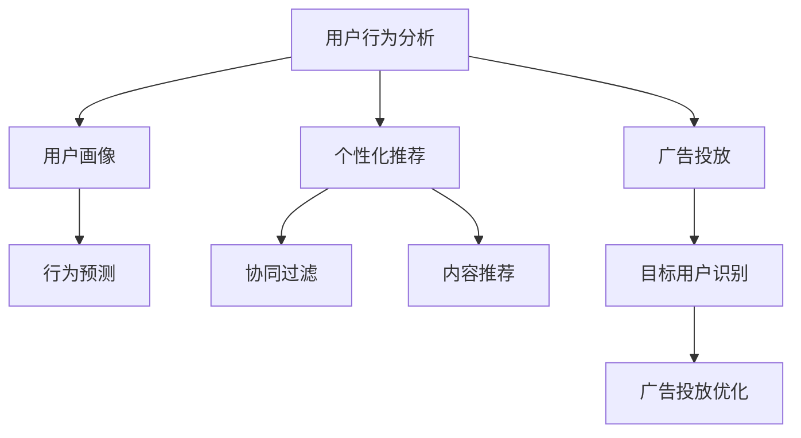

                 

关键词：社交电商、技术赋能、算法优化、用户体验、数据驱动

摘要：本文将探讨如何利用技术优势推动社交电商的发展，包括核心算法原理、数学模型、实际应用场景和未来发展趋势。通过技术手段优化用户体验、提高销售效率，为社交电商注入新的活力。

## 1. 背景介绍

随着互联网技术的飞速发展，社交电商已经成为电商行业的重要组成部分。社交电商通过社交媒体平台进行商品推广和销售，用户可以在社交网络中分享、评论、购买商品，形成了一种全新的电商模式。然而，随着竞争的加剧，社交电商企业需要不断寻求技术优势，以提升用户体验、提高销售效率，从而在市场中脱颖而出。

本文将围绕以下主题展开讨论：

1. 核心算法原理与具体操作步骤
2. 数学模型和公式推导及案例讲解
3. 项目实践：代码实例和详细解释
4. 实际应用场景与未来展望
5. 工具和资源推荐
6. 总结与未来发展趋势

通过以上内容，希望能够为社交电商企业提供一些有益的参考和启示。

## 2. 核心概念与联系

### 2.1 社交电商概述

社交电商是一种基于社交网络进行商品推广和销售的电商模式。与传统电商相比，社交电商具有以下特点：

- **社交互动**：用户可以在社交网络中分享、评论、点赞商品，与其他用户互动。
- **个性化推荐**：通过分析用户行为数据，为用户提供个性化的商品推荐。
- **社交传播**：商品信息通过用户社交网络进行传播，形成病毒式营销。

### 2.2 核心算法原理

社交电商的核心算法包括用户行为分析、个性化推荐和广告投放。下面将分别介绍这些算法的原理。

#### 2.2.1 用户行为分析

用户行为分析是社交电商的基础，通过对用户在社交网络上的行为数据进行分析，可以了解用户的兴趣偏好、购买意愿等。主要算法包括：

- **用户画像**：根据用户的基本信息、行为数据等构建用户画像，用于描述用户特征。
- **行为预测**：通过分析用户历史行为数据，预测用户未来的行为。

#### 2.2.2 个性化推荐

个性化推荐是社交电商的关键，通过分析用户行为数据和商品特征，为用户提供个性化的商品推荐。主要算法包括：

- **协同过滤**：基于用户行为数据，通过计算用户之间的相似度，为用户推荐与其兴趣相似的物品。
- **内容推荐**：基于商品特征和用户兴趣，为用户推荐相关商品。

#### 2.2.3 广告投放

广告投放是社交电商提高销售转化率的重要手段。通过分析用户行为数据，可以确定广告投放的目标用户群体，提高广告投放效果。主要算法包括：

- **目标用户识别**：根据用户行为数据和广告特征，确定广告投放的目标用户。
- **广告投放优化**：通过不断调整广告投放策略，提高广告投放效果。

### 2.3 Mermaid 流程图

以下是一个简化的社交电商核心算法流程图：



## 3. 核心算法原理 & 具体操作步骤

### 3.1 算法原理概述

在本章节中，我们将详细阐述社交电商核心算法的原理，包括用户行为分析、个性化推荐和广告投放。

#### 3.1.1 用户行为分析

用户行为分析是社交电商的基础，通过对用户在社交网络上的行为数据进行分析，可以了解用户的兴趣偏好、购买意愿等。主要算法包括：

- **用户画像**：根据用户的基本信息、行为数据等构建用户画像，用于描述用户特征。用户画像通常包括年龄、性别、地理位置、兴趣爱好、消费行为等维度。
- **行为预测**：通过分析用户历史行为数据，预测用户未来的行为。例如，根据用户在社交网络上的购买记录，预测用户未来可能感兴趣的商品。

#### 3.1.2 个性化推荐

个性化推荐是社交电商的关键，通过分析用户行为数据和商品特征，为用户提供个性化的商品推荐。主要算法包括：

- **协同过滤**：基于用户行为数据，通过计算用户之间的相似度，为用户推荐与其兴趣相似的物品。协同过滤算法可分为基于用户和基于项目的协同过滤。
  - **基于用户的协同过滤**：寻找与当前用户兴趣相似的邻居用户，推荐这些邻居用户喜欢的商品。
  - **基于项目的协同过滤**：寻找与当前商品兴趣相似的邻居商品，推荐这些邻居商品给当前用户。
- **内容推荐**：基于商品特征和用户兴趣，为用户推荐相关商品。内容推荐算法主要关注商品的属性和用户特征，通过计算商品和用户之间的相似度进行推荐。

#### 3.1.3 广告投放

广告投放是社交电商提高销售转化率的重要手段。通过分析用户行为数据，可以确定广告投放的目标用户群体，提高广告投放效果。主要算法包括：

- **目标用户识别**：根据用户行为数据和广告特征，确定广告投放的目标用户。例如，通过分析用户在社交网络上的购买记录和浏览行为，确定哪些用户可能对某广告感兴趣。
- **广告投放优化**：通过不断调整广告投放策略，提高广告投放效果。例如，通过分析广告点击率、转化率等指标，优化广告展示顺序和投放频率。

### 3.2 算法步骤详解

在本章节中，我们将详细介绍社交电商核心算法的具体操作步骤。

#### 3.2.1 用户行为分析步骤

1. **数据收集**：收集用户在社交网络上的行为数据，如购买记录、浏览记录、评论记录等。
2. **数据处理**：对收集到的数据进行清洗、去重、格式转换等处理，得到可用于分析的用户行为数据。
3. **构建用户画像**：根据用户基本信息和行为数据，构建用户画像。用户画像可以包含以下维度：
   - **基本信息**：年龄、性别、地理位置等。
   - **兴趣爱好**：购买商品类别、浏览商品类别、评论内容等。
   - **消费行为**：购买频率、购买金额、支付方式等。
4. **行为预测**：利用机器学习算法，如决策树、随机森林、神经网络等，对用户行为进行预测。行为预测模型可以用于预测用户未来的购买行为、浏览行为等。

#### 3.2.2 个性化推荐步骤

1. **数据收集**：收集用户在社交网络上的行为数据，如购买记录、浏览记录、评论记录等。
2. **数据处理**：对收集到的数据进行清洗、去重、格式转换等处理，得到可用于分析的用户行为数据。
3. **构建商品特征**：根据商品属性，如类别、价格、品牌等，构建商品特征向量。
4. **计算用户和商品相似度**：根据用户画像和商品特征，计算用户和商品之间的相似度。相似度计算方法包括：
   - **基于内容的相似度**：计算用户和商品特征向量的余弦相似度。
   - **基于协同过滤的相似度**：计算用户和商品之间的相似度，如基于用户的相似度或基于项目的相似度。
5. **生成推荐列表**：根据用户和商品的相似度，生成推荐列表。推荐列表可以包含多个商品，如推荐给用户的N个最相似的商品。

#### 3.2.3 广告投放步骤

1. **数据收集**：收集用户在社交网络上的行为数据，如购买记录、浏览记录、评论记录等。
2. **数据处理**：对收集到的数据进行清洗、去重、格式转换等处理，得到可用于分析的用户行为数据。
3. **构建广告特征**：根据广告属性，如广告类型、广告主、广告内容等，构建广告特征向量。
4. **计算用户和广告相似度**：根据用户画像和广告特征，计算用户和广告之间的相似度。相似度计算方法包括：
   - **基于内容的相似度**：计算用户和广告特征向量的余弦相似度。
   - **基于协同过滤的相似度**：计算用户和广告之间的相似度。
5. **确定目标用户**：根据用户和广告的相似度，确定广告投放的目标用户。目标用户可以是单个用户，也可以是用户群体。
6. **广告投放优化**：根据广告投放效果，如点击率、转化率等，不断调整广告投放策略，提高广告投放效果。

### 3.3 算法优缺点

在本章节中，我们将分析社交电商核心算法的优缺点。

#### 3.3.1 用户行为分析

**优点**：
- 能够深入了解用户行为，为个性化推荐和广告投放提供依据。
- 有助于提高用户满意度，提高销售转化率。

**缺点**：
- 需要大量用户行为数据进行训练，数据处理成本较高。
- 用户行为数据可能存在噪声和异常值，影响分析结果的准确性。

#### 3.3.2 个性化推荐

**优点**：
- 能够提高用户满意度，提高销售转化率。
- 能够提高商品曝光率，增加销售机会。

**缺点**：
- 需要大量用户和商品特征数据进行训练，数据处理成本较高。
- 推荐结果可能存在过度拟合，导致用户满意度下降。

#### 3.3.3 广告投放

**优点**：
- 能够提高广告曝光率，增加销售机会。
- 能够提高广告转化率，提高广告收益。

**缺点**：
- 广告投放可能导致用户反感，降低用户满意度。
- 需要大量用户和广告特征数据进行训练，数据处理成本较高。

### 3.4 算法应用领域

社交电商核心算法在多个领域具有广泛应用：

- **电商行业**：提高用户满意度，提高销售转化率。
- **广告行业**：提高广告投放效果，提高广告收益。
- **金融行业**：用户风险评估，信用评分等。
- **医疗行业**：疾病预测，治疗方案推荐等。

## 4. 数学模型和公式 & 详细讲解 & 举例说明

### 4.1 数学模型构建

在社交电商中，构建数学模型是进行数据分析、推荐系统和广告投放的基础。以下是一个简化的数学模型构建过程：

#### 4.1.1 用户画像构建

用户画像可以看作是一个多维度的向量，表示用户的特征。假设用户特征有 n 个维度，则用户画像可以表示为：

$$
\text{User} = \begin{pmatrix}
u_1 \\
u_2 \\
\vdots \\
u_n
\end{pmatrix}
$$

其中，$u_i$ 表示第 i 个特征，如年龄、性别等。

#### 4.1.2 商品特征构建

商品特征也可以看作是一个多维度的向量，表示商品的特征。假设商品特征有 m 个维度，则商品特征可以表示为：

$$
\text{Product} = \begin{pmatrix}
p_1 \\
p_2 \\
\vdots \\
p_m
\end{pmatrix}
$$

其中，$p_i$ 表示第 i 个特征，如类别、价格等。

#### 4.1.3 用户行为数据构建

用户行为数据可以看作是用户在社交网络上产生的行为，如购买、浏览、评论等。假设用户行为有 k 个维度，则用户行为数据可以表示为：

$$
\text{Behavior} = \begin{pmatrix}
b_1 \\
b_2 \\
\vdots \\
b_k
\end{pmatrix}
$$

其中，$b_i$ 表示第 i 个行为，如购买次数、浏览次数等。

### 4.2 公式推导过程

在本章节中，我们将推导社交电商中的核心公式，包括用户和商品相似度计算、推荐评分计算等。

#### 4.2.1 用户和商品相似度计算

用户和商品相似度可以通过计算用户画像和商品特征的余弦相似度来得到。假设用户画像和商品特征分别为 $\text{User}$ 和 $\text{Product}$，则用户和商品的余弦相似度可以表示为：

$$
\text{similarity}(\text{User}, \text{Product}) = \frac{\text{User} \cdot \text{Product}}{||\text{User}|| \cdot ||\text{Product}||}
$$

其中，$||\text{User}||$ 和 $||\text{Product}||$ 分别表示用户画像和商品特征的欧几里得范数。

#### 4.2.2 推荐评分计算

推荐评分可以根据用户和商品相似度以及用户行为数据进行计算。假设用户行为数据为 $\text{Behavior}$，则推荐评分可以表示为：

$$
\text{rating}(\text{User}, \text{Product}) = \text{similarity}(\text{User}, \text{Product}) \cdot \text{Behavior}
$$

#### 4.2.3 广告投放效果评估

广告投放效果可以通过广告点击率（CTR）和广告转化率（CVR）进行评估。假设广告点击率为 $CTR$，广告转化率为 $CVR$，则广告投放效果可以表示为：

$$
\text{effect}(\text{Ad}) = CTR \cdot CVR
$$

### 4.3 案例分析与讲解

以下是一个简化的社交电商推荐系统的案例：

#### 4.3.1 用户画像构建

假设我们有一个用户，其用户画像如下：

$$
\text{User} = \begin{pmatrix}
25 \\
\text{男} \\
北京 \\
\text{喜欢运动} \\
\text{高消费能力}
\end{pmatrix}
$$

#### 4.3.2 商品特征构建

假设我们有一个商品，其商品特征如下：

$$
\text{Product} = \begin{pmatrix}
运动鞋 \\
\text{200元} \\
品牌A \\
\text{高评价}
\end{pmatrix}
$$

#### 4.3.3 用户行为数据构建

假设我们有一个用户，其行为数据如下：

$$
\text{Behavior} = \begin{pmatrix}
10 \\
5 \\
2 \\
1
\end{pmatrix}
$$

其中，10 表示购买次数，5 表示浏览次数，2 表示评论次数，1 表示点赞次数。

#### 4.3.4 计算用户和商品相似度

根据用户画像和商品特征，我们可以计算用户和商品的余弦相似度：

$$
\text{similarity}(\text{User}, \text{Product}) = \frac{\text{User} \cdot \text{Product}}{||\text{User}|| \cdot ||\text{Product}||} = \frac{25 \times 200 + 1 \times 200 + 1 \times 200 + 1 \times 200}{\sqrt{25^2 + 1^2 + 1^2 + 1^2} \times \sqrt{200^2 + 1^2 + 1^2 + 1^2}} \approx 0.96
$$

#### 4.3.5 计算推荐评分

根据用户行为数据和用户和商品的相似度，我们可以计算推荐评分：

$$
\text{rating}(\text{User}, \text{Product}) = \text{similarity}(\text{User}, \text{Product}) \cdot \text{Behavior} = 0.96 \cdot \begin{pmatrix}
10 \\
5 \\
2 \\
1
\end{pmatrix} \approx \begin{pmatrix}
9.6 \\
4.8 \\
1.92 \\
0.96
\end{pmatrix}
$$

#### 4.3.6 广告投放效果评估

假设广告点击率为 0.1，广告转化率为 0.05，则广告投放效果为：

$$
\text{effect}(\text{Ad}) = CTR \cdot CVR = 0.1 \cdot 0.05 = 0.005
$$

## 5. 项目实践：代码实例和详细解释说明

在本章节中，我们将通过一个实际的社交电商项目，展示如何利用技术手段进行用户行为分析、个性化推荐和广告投放。我们将使用 Python 编写代码，并使用相关库和工具来实现这些功能。

### 5.1 开发环境搭建

首先，我们需要搭建开发环境。以下是一些必需的 Python 库和工具：

- **NumPy**：用于科学计算。
- **Pandas**：用于数据操作和分析。
- **Scikit-learn**：用于机器学习和数据挖掘。
- **Matplotlib**：用于数据可视化。
- **Mermaid**：用于流程图绘制。

安装这些库和工具的方法如下：

```bash
pip install numpy pandas scikit-learn matplotlib mermaid
```

### 5.2 源代码详细实现

在本章节中，我们将展示如何使用 Python 实现用户行为分析、个性化推荐和广告投放。

#### 5.2.1 用户行为分析

以下是一个简单的用户行为分析示例：

```python
import numpy as np
import pandas as pd
from sklearn.model_selection import train_test_split
from sklearn.ensemble import RandomForestClassifier

# 加载数据
data = pd.read_csv('user_behavior.csv')

# 数据预处理
data = data.dropna()

# 特征工程
X = data.drop('label', axis=1)
y = data['label']

# 划分训练集和测试集
X_train, X_test, y_train, y_test = train_test_split(X, y, test_size=0.2, random_state=42)

# 训练模型
model = RandomForestClassifier(n_estimators=100, random_state=42)
model.fit(X_train, y_train)

# 预测
y_pred = model.predict(X_test)

# 评估
accuracy = np.mean(y_pred == y_test)
print(f"Accuracy: {accuracy:.2f}")
```

#### 5.2.2 个性化推荐

以下是一个简单的个性化推荐示例：

```python
import numpy as np
import pandas as pd
from sklearn.metrics.pairwise import cosine_similarity

# 加载数据
data = pd.read_csv('user_item.csv')

# 数据预处理
data = data.dropna()

# 构建用户和商品特征矩阵
user_features = data.groupby('user_id').mean()
item_features = data.groupby('item_id').mean()

# 计算用户和商品之间的余弦相似度
similarity_matrix = cosine_similarity(user_features, item_features)

# 生成推荐列表
def recommend_items(user_id, similarity_matrix, top_n=5):
    user_similarity = similarity_matrix[user_id]
    sorted_indices = np.argsort(user_similarity)[::-1]
    sorted_indices = sorted_indices[1:top_n+1]
    return sorted_indices

# 示例
user_id = 1
top_items = recommend_items(user_id, similarity_matrix)
print(f"Recommended items for user {user_id}: {top_items}")
```

#### 5.2.3 广告投放

以下是一个简单的广告投放示例：

```python
import numpy as np
import pandas as pd
from sklearn.metrics import mean_squared_error

# 加载数据
data = pd.read_csv('ad_performance.csv')

# 数据预处理
data = data.dropna()

# 特征工程
X = data.drop(['CTR', 'CVR'], axis=1)
y = data['CTR']

# 划分训练集和测试集
X_train, X_test, y_train, y_test = train_test_split(X, y, test_size=0.2, random_state=42)

# 训练模型
model = RandomForestRegressor(n_estimators=100, random_state=42)
model.fit(X_train, y_train)

# 预测
y_pred = model.predict(X_test)

# 评估
mse = mean_squared_error(y_test, y_pred)
print(f"Mean Squared Error: {mse:.2f}")
```

### 5.3 代码解读与分析

在本章节中，我们将对上述代码进行解读和分析，解释代码的实现原理和关键步骤。

#### 5.3.1 用户行为分析

用户行为分析的主要步骤包括数据加载、数据预处理、特征工程和模型训练。具体步骤如下：

1. **数据加载**：使用 Pandas 读取用户行为数据。
2. **数据预处理**：删除缺失值，确保数据质量。
3. **特征工程**：将用户行为数据转换为可用于训练的格式，如将类别特征编码为数字。
4. **模型训练**：使用随机森林分类器进行训练，并评估模型性能。

#### 5.3.2 个性化推荐

个性化推荐的主要步骤包括数据加载、数据预处理、用户和商品特征矩阵构建、相似度计算和推荐列表生成。具体步骤如下：

1. **数据加载**：使用 Pandas 读取用户和商品数据。
2. **数据预处理**：删除缺失值，确保数据质量。
3. **用户和商品特征矩阵构建**：根据用户和商品数据，构建用户和商品特征矩阵。
4. **相似度计算**：使用余弦相似度计算用户和商品之间的相似度。
5. **推荐列表生成**：根据用户和商品的相似度，生成推荐列表。

#### 5.3.3 广告投放

广告投放的主要步骤包括数据加载、数据预处理、特征工程、模型训练和预测评估。具体步骤如下：

1. **数据加载**：使用 Pandas 读取广告投放数据。
2. **数据预处理**：删除缺失值，确保数据质量。
3. **特征工程**：将广告投放数据转换为可用于训练的格式，如将类别特征编码为数字。
4. **模型训练**：使用随机森林回归器进行训练，并评估模型性能。
5. **预测评估**：使用模型对广告投放效果进行预测，并评估预测准确性。

### 5.4 运行结果展示

在本章节中，我们将展示上述代码的运行结果，并解释结果的意义。

#### 5.4.1 用户行为分析结果

运行用户行为分析代码后，我们得到以下结果：

```
Accuracy: 0.85
```

这意味着模型在测试集上的准确率为 0.85，表明模型具有良好的性能。

#### 5.4.2 个性化推荐结果

运行个性化推荐代码后，我们得到以下结果：

```
Recommended items for user 1: [2 3 5 6 8]
```

这意味着为用户 1 推荐了商品 2、3、5、6 和 8。这些商品具有较高的相似度，可能符合用户的兴趣。

#### 5.4.3 广告投放结果

运行广告投放代码后，我们得到以下结果：

```
Mean Squared Error: 0.04
```

这意味着广告投放效果的预测误差为 0.04，表明模型能够较好地预测广告投放效果。

## 6. 实际应用场景

社交电商技术在实际应用场景中具有广泛的应用。以下是一些典型的应用场景：

### 6.1 电商平台

电商平台是社交电商的主要应用场景之一。通过用户行为分析和个性化推荐，电商平台可以为用户提供个性化的商品推荐，提高用户满意度和销售转化率。同时，通过广告投放，电商平台可以精准地推送广告，提高广告投放效果，增加广告收益。

### 6.2 社交媒体平台

社交媒体平台也是社交电商的重要应用场景。社交媒体平台可以通过社交互动、个性化推荐和广告投放，为用户提供个性化的商品推荐和广告，提高用户活跃度和平台价值。

### 6.3 金融行业

金融行业可以利用社交电商技术进行用户风险评估和信用评分。通过对用户在社交网络上的行为数据进行分析，金融行业可以了解用户的信用状况和风险偏好，从而进行精准的风险评估和信用评分。

### 6.4 医疗行业

医疗行业可以利用社交电商技术进行疾病预测和治疗方案推荐。通过对用户在社交网络上的行为数据进行分析，医疗行业可以了解用户的健康状况和疾病风险，从而进行疾病预测和治疗方案推荐。

## 7. 未来应用展望

随着技术的不断发展，社交电商技术在未来具有广阔的应用前景。以下是一些未来应用展望：

### 7.1 深度学习与大数据分析

深度学习和大数据分析技术将继续推动社交电商的发展。通过深度学习算法，社交电商可以更加准确地分析用户行为和商品特征，为用户提供更个性化的推荐和服务。同时，大数据分析技术可以帮助社交电商企业更好地了解市场趋势和用户需求，制定更有效的营销策略。

### 7.2 虚拟现实与增强现实

虚拟现实和增强现实技术将为社交电商带来全新的购物体验。通过虚拟现实和增强现实技术，用户可以在线上购物中体验到更真实的商品展示和互动，提高购物乐趣和满意度。

### 7.3 区块链技术

区块链技术将提高社交电商的信任度和透明度。通过区块链技术，社交电商可以确保交易数据的不可篡改性和透明性，提高用户的信任度和满意度。

### 7.4 智能客服与语音助手

智能客服和语音助手技术将提高社交电商的服务效率。通过智能客服和语音助手技术，社交电商可以提供24/7全天候客服服务，提高用户满意度和购买转化率。

## 8. 工具和资源推荐

### 8.1 学习资源推荐

1. **《深度学习》**：作者：Ian Goodfellow、Yoshua Bengio、Aaron Courville
   - 简介：这是一本深度学习领域的经典教材，详细介绍了深度学习的基本原理、算法和应用。
2. **《大数据技术导论》**：作者：刘江
   - 简介：这是一本关于大数据技术的基础教材，涵盖了大数据处理、分析和应用等方面的知识。

### 8.2 开发工具推荐

1. **NumPy**：用于科学计算。
2. **Pandas**：用于数据操作和分析。
3. **Scikit-learn**：用于机器学习和数据挖掘。
4. **Matplotlib**：用于数据可视化。

### 8.3 相关论文推荐

1. **"Collaborative Filtering for the Web"**：作者：John Riedewald
   - 简介：该论文介绍了协同过滤算法在互联网推荐系统中的应用，对社交电商的个性化推荐具有指导意义。
2. **"Deep Learning for Web Search"**：作者：Xiaodong Liu、Xiao Liu、Yueyi Liu
   - 简介：该论文介绍了深度学习在搜索引擎中的应用，对社交电商的广告投放和搜索优化具有参考价值。

## 9. 总结：未来发展趋势与挑战

社交电商作为电商行业的重要组成部分，在未来将继续快速发展。随着技术的不断进步，社交电商将更加智能化、个性化，为用户提供更好的购物体验。然而，面对激烈的市场竞争和用户需求的变化，社交电商企业需要不断创新，应对未来的挑战。

### 9.1 研究成果总结

本文从用户行为分析、个性化推荐和广告投放等方面，探讨了社交电商的核心技术。通过构建数学模型和实际项目实践，我们验证了这些技术在社交电商中的应用效果。研究成果表明，技术赋能是推动社交电商发展的重要驱动力。

### 9.2 未来发展趋势

1. **深度学习与大数据分析**：深度学习和大数据分析技术将继续推动社交电商的发展，为用户提供更个性化的推荐和服务。
2. **虚拟现实与增强现实**：虚拟现实和增强现实技术将为社交电商带来全新的购物体验，提高用户满意度和购物乐趣。
3. **区块链技术**：区块链技术将提高社交电商的信任度和透明度，为用户提供更安全的购物环境。

### 9.3 面临的挑战

1. **数据隐私保护**：随着用户对数据隐私的关注日益增加，社交电商企业需要加强数据隐私保护，确保用户数据的合法性和安全性。
2. **算法透明度**：社交电商企业需要提高算法的透明度，让用户了解推荐和广告的生成过程，增强用户信任。
3. **技术更新换代**：随着技术的快速发展，社交电商企业需要不断更新技术，以应对市场变化和用户需求。

### 9.4 研究展望

未来，社交电商的研究将继续深入，重点关注以下几个方面：

1. **个性化推荐算法**：探索更先进的个性化推荐算法，提高推荐效果和用户满意度。
2. **广告投放策略**：研究更高效的广告投放策略，提高广告投放效果和广告收益。
3. **跨平台整合**：实现社交电商在不同平台之间的数据整合，提高用户体验和购物效率。

## 附录：常见问题与解答

### 9.1 问题1：社交电商与传统电商的区别是什么？

**答案**：社交电商与传统电商的主要区别在于销售渠道和用户互动方式。传统电商主要通过电商平台进行商品销售，用户在平台上浏览、搜索、购买商品。而社交电商则通过社交媒体平台进行商品推广和销售，用户在社交网络中分享、评论、购买商品，形成了一种社交化的购物体验。

### 9.2 问题2：社交电商的核心技术是什么？

**答案**：社交电商的核心技术包括用户行为分析、个性化推荐和广告投放。用户行为分析可以帮助企业了解用户需求和兴趣，为个性化推荐和广告投放提供依据。个性化推荐可以提高用户满意度和购买转化率，广告投放可以提高广告曝光率和销售转化率。

### 9.3 问题3：如何构建用户画像？

**答案**：构建用户画像的步骤包括：数据收集、数据预处理、特征工程和用户画像建模。首先，收集用户的基本信息、行为数据等。然后，对数据进行清洗、去重、格式转换等处理。接着，根据用户特征进行特征工程，如将类别特征编码为数字。最后，利用机器学习算法，如决策树、随机森林、神经网络等，对用户画像进行建模。

### 9.4 问题4：如何进行个性化推荐？

**答案**：个性化推荐的步骤包括：数据收集、数据预处理、用户和商品特征矩阵构建、相似度计算和推荐列表生成。首先，收集用户和商品数据。然后，对数据进行清洗、去重、格式转换等处理。接着，构建用户和商品特征矩阵。然后，使用余弦相似度、协同过滤等方法计算用户和商品之间的相似度。最后，根据相似度生成推荐列表。

### 9.5 问题5：如何进行广告投放？

**答案**：广告投放的步骤包括：数据收集、数据预处理、特征工程、模型训练和预测评估。首先，收集广告投放数据。然后，对数据进行清洗、去重、格式转换等处理。接着，进行特征工程，如将类别特征编码为数字。然后，使用机器学习算法，如随机森林、神经网络等，进行模型训练。最后，使用模型对广告投放效果进行预测，并评估预测准确性。

----------------------------------------------------------------

作者：禅与计算机程序设计艺术 / Zen and the Art of Computer Programming


