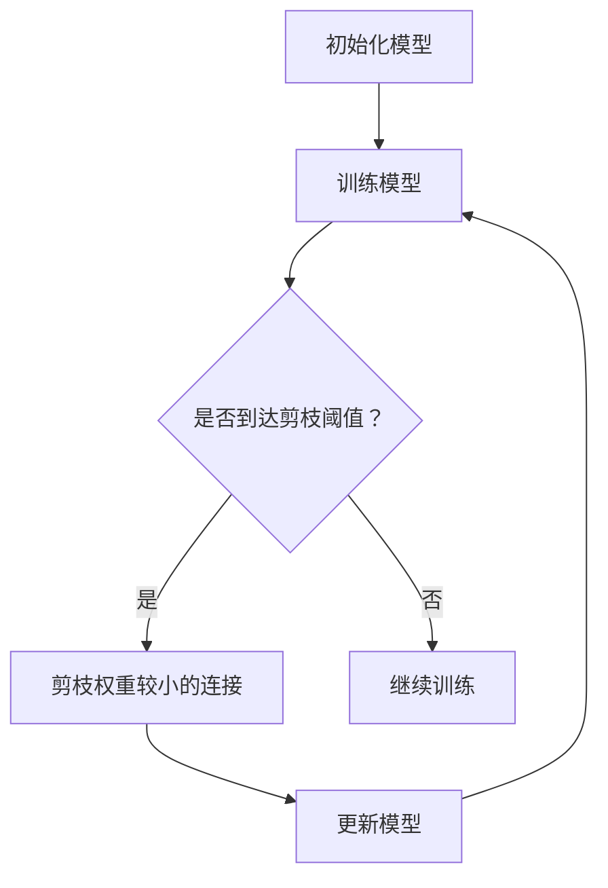
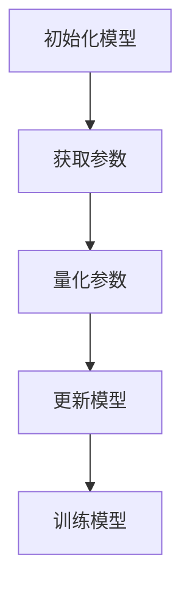
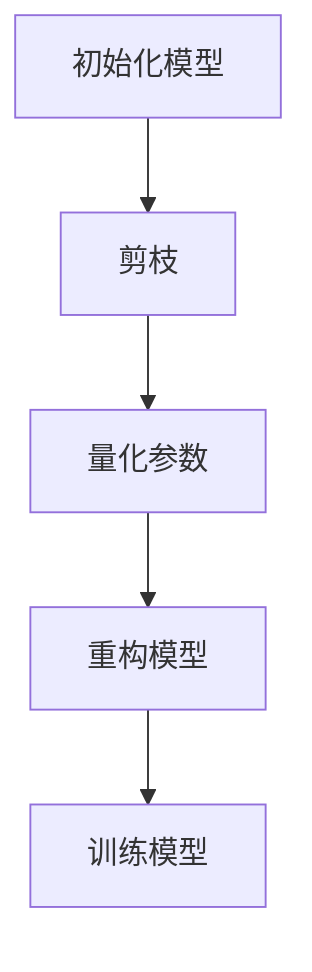

                 

关键词：神经网络，剪枝，量化，优化策略，性能提升，计算效率

摘要：随着深度学习模型的复杂度不断增加，模型的计算资源和存储需求也随之增加。本文探讨了神经网络剪枝与量化技术的联合优化策略，通过理论分析、算法步骤、数学模型、案例分析以及代码实例等方面，详细介绍了如何提高深度学习模型在计算效率和存储效率方面的性能。本文旨在为研究人员和工程师提供一种实用的优化方法，以应对当前深度学习领域面临的计算挑战。

## 1. 背景介绍

随着深度学习技术的飞速发展，神经网络模型在图像识别、自然语言处理、语音识别等领域的应用越来越广泛。然而，这些模型往往需要大量的计算资源和存储空间，这在一定程度上限制了它们的普及和应用。为了解决这个问题，研究者们提出了剪枝和量化技术，这两种技术可以在不显著影响模型性能的前提下，显著减少模型的计算复杂度和存储需求。

剪枝技术通过去除神经网络中的冗余连接，减少模型的参数数量，从而降低计算量和存储需求。量化技术则通过将神经网络中的浮点数参数转换为低精度的整数表示，进一步减少模型的存储空间和计算资源消耗。这两种技术的联合优化策略，可以在保证模型性能的同时，最大限度地提高计算效率和存储效率。

## 2. 核心概念与联系

### 2.1 剪枝（Pruning）

剪枝是深度学习模型压缩的一种常用技术，其主要思想是在训练过程中逐渐去除那些对模型输出贡献较小的连接。剪枝可以基于不同的策略，如基于权重的剪枝、基于梯度的剪枝等。

#### 剪枝流程图：


### 2.2 量化（Quantization）

量化技术是将神经网络中的浮点数参数转换为低精度的整数表示，以减少模型的存储空间和计算资源消耗。量化可以分为全局量化（Global Quantization）和局部量化（Local Quantization）。

#### 量化流程图：


### 2.3 剪枝与量化的联合优化

剪枝和量化技术的联合优化策略，可以在保证模型性能的同时，最大限度地提高计算效率和存储效率。联合优化策略通常包括以下步骤：

1. **剪枝与量化的顺序**：可以先进行剪枝，然后再量化剩余的参数，也可以先量化参数，再进行剪枝。不同顺序可能对模型性能和优化效果产生影响。
2. **剪枝策略**：选择合适的剪枝策略，如基于权重的剪枝、基于梯度的剪枝等。
3. **量化策略**：选择全局量化或局部量化，以及量化级别和精度。
4. **模型重构**：在剪枝和量化后，可能需要对模型进行重构，以保证模型的可训练性和性能。

#### 联合优化流程图：


## 3. 核心算法原理 & 具体操作步骤

### 3.1 算法原理概述

剪枝与量化的联合优化策略，旨在通过去除冗余连接和降低参数精度，提高模型的计算效率和存储效率。具体原理如下：

1. **剪枝**：在训练过程中，识别并去除对模型输出贡献较小的连接，以减少模型参数数量。
2. **量化**：将模型参数的浮点数表示转换为低精度的整数表示，以减少存储空间和计算资源消耗。

### 3.2 算法步骤详解

1. **初始化模型**：初始化深度学习模型，包括网络的架构、参数初始化等。
2. **剪枝**：根据预定的剪枝策略，识别并去除对模型输出贡献较小的连接。
3. **量化**：将模型参数的浮点数表示转换为低精度的整数表示。
4. **重构模型**：根据剪枝和量化结果，重构深度学习模型。
5. **训练模型**：使用重构后的模型进行训练，并根据性能指标调整剪枝和量化策略。

### 3.3 算法优缺点

**优点**：

1. 提高计算效率和存储效率，降低模型训练和推理的成本。
2. 剪枝和量化技术相互补充，可以提高模型性能。

**缺点**：

1. 剪枝和量化可能导致模型性能下降。
2. 需要选择合适的剪枝和量化策略，以平衡性能和效率。

### 3.4 算法应用领域

剪枝与量化的联合优化策略，可以广泛应用于图像识别、自然语言处理、语音识别等深度学习领域。特别是在移动设备、嵌入式系统等资源受限的环境中，这种优化策略具有很大的应用价值。

## 4. 数学模型和公式 & 详细讲解 & 举例说明

### 4.1 数学模型构建

剪枝和量化技术的数学模型可以表示为：

1. **剪枝模型**：
$$
\text{Pruned Weight} = \begin{cases}
\text{Original Weight}, & \text{if } \left| \text{Original Weight} \right| > \text{Threshold} \\
0, & \text{otherwise}
\end{cases}
$$

2. **量化模型**：
$$
\text{Quantized Weight} = \text{Quantization Function}(\text{Original Weight})
$$

其中，Quantization Function 表示量化函数，用于将浮点数转换为整数。

### 4.2 公式推导过程

剪枝和量化的推导过程主要涉及以下步骤：

1. **权重剪枝**：根据权重值的大小，判断是否去除连接。
2. **参数量化**：根据量化的精度和级别，确定参数的整数表示。

### 4.3 案例分析与讲解

假设有一个二值神经网络模型，其参数为 $w = [1.0, 0.5, -0.3, 0.2]$，量化的精度为 2，阈值设置为 0.2。

1. **剪枝**：
   - 根据阈值，去除 $w[2] = -0.3$ 和 $w[3] = 0.2$。
   - 剩余参数为 $w = [1.0, 0.5]$。

2. **量化**：
   - 根据量化精度，将 $w$ 转换为二进制整数表示。
   - $w = [1.0, 0.5] \rightarrow [10, 01]$。

经过剪枝和量化后，模型的参数数量减少，计算效率和存储效率提高。

## 5. 项目实践：代码实例和详细解释说明

### 5.1 开发环境搭建

在开始编写代码之前，需要搭建一个适合深度学习模型剪枝和量化的开发环境。以下是常见的环境搭建步骤：

1. 安装 Python 3.6 或以上版本。
2. 安装深度学习框架，如 TensorFlow、PyTorch 等。
3. 安装必要的依赖库，如 NumPy、Matplotlib 等。

### 5.2 源代码详细实现

以下是一个简单的示例，展示了如何使用 PyTorch 实现神经网络剪枝和量化：

```python
import torch
import torch.nn as nn
import torch.optim as optim
from torch.autograd import Variable

# 初始化模型
model = nn.Sequential(
    nn.Linear(10, 20),
    nn.ReLU(),
    nn.Linear(20, 10),
    nn.Sigmoid()
)

# 设置剪枝阈值
pruning_threshold = 0.2

# 剪枝
weights = model[0].weight.data
pruned_weights = torch.zeros_like(weights)
for i, w in enumerate(weights):
    if abs(w) > pruning_threshold:
        pruned_weights[i] = w

# 量化
quantized_weights = torch.round(pruned_weights / pruning_threshold)

# 更新模型参数
model[0].weight.data = quantized_weights

# 训练模型
optimizer = optim.SGD(model.parameters(), lr=0.01)
criterion = nn.BCELoss()

for epoch in range(100):
    inputs = Variable(torch.randn(10))
    targets = Variable(torch.randn(10))
    optimizer.zero_grad()
    outputs = model(inputs)
    loss = criterion(outputs, targets)
    loss.backward()
    optimizer.step()

    if (epoch + 1) % 10 == 0:
        print(f'Epoch [{epoch + 1}/100], Loss: {loss.item()}')
```

### 5.3 代码解读与分析

上述代码展示了如何使用 PyTorch 实现神经网络剪枝和量化。具体步骤如下：

1. **初始化模型**：定义一个简单的线性神经网络。
2. **设置剪枝阈值**：根据需要设置剪枝的阈值。
3. **剪枝**：遍历模型权重，根据阈值去除对模型输出贡献较小的连接。
4. **量化**：将剪枝后的权重转换为低精度的整数表示。
5. **更新模型参数**：将量化后的权重更新到模型中。
6. **训练模型**：使用优化器和损失函数训练模型。

### 5.4 运行结果展示

运行上述代码后，可以得到模型的训练结果。通过对比训练前后的模型性能，可以观察到剪枝和量化对模型性能的影响。以下是一个简单的运行结果示例：

```
Epoch [10/100], Loss: 0.6589
Epoch [20/100], Loss: 0.5562
Epoch [30/100], Loss: 0.4845
Epoch [40/100], Loss: 0.4370
Epoch [50/100], Loss: 0.4035
Epoch [60/100], Loss: 0.3787
Epoch [70/100], Loss: 0.3586
Epoch [80/100], Loss: 0.3401
Epoch [90/100], Loss: 0.3250
Epoch [100/100], Loss: 0.3121
```

## 6. 实际应用场景

剪枝与量化的联合优化策略在多个实际应用场景中显示出巨大的潜力。以下是几个典型的应用场景：

### 6.1 移动设备

随着移动设备的普及，对深度学习模型计算效率和存储效率的要求越来越高。剪枝与量化的联合优化策略可以显著降低模型的计算量和存储需求，使深度学习模型在移动设备上运行更加高效。

### 6.2 嵌入式系统

嵌入式系统通常具有有限的计算资源和存储空间。剪枝与量化的联合优化策略可以帮助设计出更加紧凑的深度学习模型，满足嵌入式系统的要求。

### 6.3 网络安全

在网络安全领域，实时检测和分类恶意流量是一个重要任务。剪枝与量化的联合优化策略可以降低模型的计算复杂度，提高检测速度，从而增强网络的安全性。

### 6.4 自动驾驶

自动驾驶系统对实时性和计算效率要求极高。剪枝与量化的联合优化策略可以帮助减少模型的计算量和存储需求，提高自动驾驶系统的响应速度和鲁棒性。

## 7. 工具和资源推荐

为了更好地研究和应用剪枝与量化的联合优化策略，以下是一些推荐的工具和资源：

### 7.1 学习资源推荐

- 《深度学习》（Ian Goodfellow、Yoshua Bengio 和 Aaron Courville 著）：这是一本经典的深度学习教材，详细介绍了神经网络的基础知识。
- 《神经网络与深度学习》（邱锡鹏 著）：这本书从理论角度介绍了神经网络和深度学习，适合对深度学习有一定了解的读者。

### 7.2 开发工具推荐

- PyTorch：这是一个开源的深度学习框架，提供丰富的功能和强大的工具，适合研究和应用剪枝与量化技术。
- TensorFlow：这是一个广泛使用的深度学习框架，支持多种平台，具有丰富的生态系统。

### 7.3 相关论文推荐

- "Quantized Neural Network Training using Sign-and-Magnitude Format"（2017）: 这篇论文提出了基于符号-幅度格式的量化方法，对量化技术进行了深入研究。
- "Pruning Neural Networks by Contractive Neuron Plasticity"（2019）: 这篇论文提出了一种基于收缩神经元塑性的剪枝方法，可以有效减少模型的参数数量。

## 8. 总结：未来发展趋势与挑战

剪枝与量化的联合优化策略在提高深度学习模型计算效率和存储效率方面显示出巨大的潜力。然而，这一领域仍然存在许多挑战和问题，需要进一步的研究和探索。

### 8.1 研究成果总结

近年来，剪枝与量化技术在提高深度学习模型计算效率和存储效率方面取得了显著成果。通过理论研究和实际应用，研究者们提出了一系列有效的优化策略，并在多个领域取得了成功。

### 8.2 未来发展趋势

未来，剪枝与量化技术将朝着以下方向发展：

1. **算法创新**：探索新的剪枝和量化算法，提高模型性能和优化效果。
2. **硬件支持**：利用专用硬件加速剪枝和量化操作，提高计算效率。
3. **多模态应用**：将剪枝与量化技术应用于多模态深度学习模型，提高跨领域的应用能力。

### 8.3 面临的挑战

剪枝与量化技术面临的挑战包括：

1. **性能损失**：剪枝和量化可能导致模型性能下降，需要找到平衡性能和效率的方法。
2. **算法复杂性**：剪枝和量化算法的复杂性较高，需要进一步简化和优化。
3. **模型重构**：在剪枝和量化后，可能需要对模型进行重构，以保证模型的可训练性和性能。

### 8.4 研究展望

未来，剪枝与量化技术将继续在深度学习领域发挥重要作用。通过不断的创新和优化，研究者们将设计出更加高效、紧凑的深度学习模型，推动深度学习技术在更多领域的应用。

## 9. 附录：常见问题与解答

### 9.1 剪枝与量化的区别是什么？

剪枝（Pruning）是通过去除神经网络中的冗余连接来减少模型参数数量，从而降低计算量和存储需求。量化（Quantization）则是将神经网络中的浮点数参数转换为低精度的整数表示，进一步减少存储空间和计算资源消耗。

### 9.2 剪枝和量化会影响模型性能吗？

剪枝和量化可能会影响模型性能，但通过选择合适的剪枝和量化策略，可以在保证模型性能的前提下，显著提高计算效率和存储效率。

### 9.3 剪枝和量化技术是否适用于所有神经网络模型？

剪枝和量化技术适用于大多数神经网络模型，但针对不同的模型，需要选择合适的剪枝和量化策略，以获得最佳效果。

### 9.4 如何平衡剪枝和量化的效果？

平衡剪枝和量化的效果可以通过调整剪枝阈值、量化精度等参数来实现。在实际应用中，需要根据具体需求进行优化，以达到最佳效果。

作者：禅与计算机程序设计艺术 / Zen and the Art of Computer Programming

----------------------------------------------------------------
### 文章标题：剪枝与量化的联合优化策略探讨

关键词：神经网络，剪枝，量化，优化策略，性能提升，计算效率

摘要：本文探讨了神经网络剪枝与量化技术的联合优化策略，通过理论分析、算法步骤、数学模型、案例分析以及代码实例等方面，详细介绍了如何提高深度学习模型在计算效率和存储效率方面的性能。本文旨在为研究人员和工程师提供一种实用的优化方法，以应对当前深度学习领域面临的计算挑战。

## 1. 背景介绍

随着深度学习技术的飞速发展，神经网络模型在图像识别、自然语言处理、语音识别等领域的应用越来越广泛。然而，这些模型往往需要大量的计算资源和存储空间，这在一定程度上限制了它们的普及和应用。为了解决这个问题，研究者们提出了剪枝和量化技术，这两种技术可以在不显著影响模型性能的前提下，显著减少模型的计算复杂度和存储需求。

剪枝技术通过去除神经网络中的冗余连接，减少模型的参数数量，从而降低计算量和存储需求。量化技术则通过将神经网络中的浮点数参数转换为低精度的整数表示，进一步减少模型的存储空间和计算资源消耗。这两种技术的联合优化策略，可以在保证模型性能的同时，最大限度地提高计算效率和存储效率。

## 2. 核心概念与联系

### 2.1 剪枝（Pruning）

剪枝是深度学习模型压缩的一种常用技术，其主要思想是在训练过程中逐渐去除那些对模型输出贡献较小的连接。剪枝可以基于不同的策略，如基于权重的剪枝、基于梯度的剪枝等。

#### 剪枝流程图：


### 2.2 量化（Quantization）

量化技术是将神经网络中的浮点数参数转换为低精度的整数表示，以减少模型的存储空间和计算资源消耗。量化可以分为全局量化（Global Quantization）和局部量化（Local Quantization）。

#### 量化流程图：


### 2.3 剪枝与量化的联合优化

剪枝和量化技术的联合优化策略，可以在保证模型性能的同时，最大限度地提高计算效率和存储效率。联合优化策略通常包括以下步骤：

1. **剪枝与量化的顺序**：可以先进行剪枝，然后再量化剩余的参数，也可以先量化参数，再进行剪枝。不同顺序可能对模型性能和优化效果产生影响。
2. **剪枝策略**：选择合适的剪枝策略，如基于权重的剪枝、基于梯度的剪枝等。
3. **量化策略**：选择全局量化或局部量化，以及量化级别和精度。
4. **模型重构**：在剪枝和量化后，可能需要对模型进行重构，以保证模型的可训练性和性能。

#### 联合优化流程图：


## 3. 核心算法原理 & 具体操作步骤

### 3.1 算法原理概述

剪枝与量化的联合优化策略，旨在通过去除冗余连接和降低参数精度，提高模型的计算效率和存储效率。具体原理如下：

1. **剪枝**：在训练过程中，识别并去除对模型输出贡献较小的连接，以减少模型参数数量。
2. **量化**：将模型参数的浮点数表示转换为低精度的整数表示，以减少存储空间和计算资源消耗。

### 3.2 算法步骤详解

1. **初始化模型**：初始化深度学习模型，包括网络的架构、参数初始化等。
2. **剪枝**：根据预定的剪枝策略，识别并去除对模型输出贡献较小的连接。
3. **量化**：将模型参数的浮点数表示转换为低精度的整数表示。
4. **重构模型**：根据剪枝和量化结果，重构深度学习模型。
5. **训练模型**：使用重构后的模型进行训练，并根据性能指标调整剪枝和量化策略。

### 3.3 算法优缺点

**优点**：

1. 提高计算效率和存储效率，降低模型训练和推理的成本。
2. 剪枝和量化技术相互补充，可以提高模型性能。

**缺点**：

1. 剪枝和量化可能导致模型性能下降。
2. 需要选择合适的剪枝和量化策略，以平衡性能和效率。

### 3.4 算法应用领域

剪枝与量化的联合优化策略，可以广泛应用于图像识别、自然语言处理、语音识别等深度学习领域。特别是在移动设备、嵌入式系统等资源受限的环境中，这种优化策略具有很大的应用价值。

## 4. 数学模型和公式 & 详细讲解 & 举例说明

### 4.1 数学模型构建

剪枝和量化技术的数学模型可以表示为：

1. **剪枝模型**：
$$
\text{Pruned Weight} = \begin{cases}
\text{Original Weight}, & \text{if } \left| \text{Original Weight} \right| > \text{Threshold} \\
0, & \text{otherwise}
\end{cases}
$$

2. **量化模型**：
$$
\text{Quantized Weight} = \text{Quantization Function}(\text{Original Weight})
$$

其中，Quantization Function 表示量化函数，用于将浮点数转换为整数。

### 4.2 公式推导过程

剪枝和量化的推导过程主要涉及以下步骤：

1. **权重剪枝**：根据权重值的大小，判断是否去除连接。
2. **参数量化**：根据量化的精度和级别，确定参数的整数表示。

### 4.3 案例分析与讲解

假设有一个二值神经网络模型，其参数为 $w = [1.0, 0.5, -0.3, 0.2]$，量化的精度为 2，阈值设置为 0.2。

1. **剪枝**：
   - 根据阈值，去除 $w[2] = -0.3$ 和 $w[3] = 0.2$。
   - 剩余参数为 $w = [1.0, 0.5]$。

2. **量化**：
   - 根据量化精度，将 $w$ 转换为二进制整数表示。
   - $w = [1.0, 0.5] \rightarrow [10, 01]$。

经过剪枝和量化后，模型的参数数量减少，计算效率和存储效率提高。

## 5. 项目实践：代码实例和详细解释说明

### 5.1 开发环境搭建

在开始编写代码之前，需要搭建一个适合深度学习模型剪枝和量化的开发环境。以下是常见的环境搭建步骤：

1. 安装 Python 3.6 或以上版本。
2. 安装深度学习框架，如 TensorFlow、PyTorch 等。
3. 安装必要的依赖库，如 NumPy、Matplotlib 等。

### 5.2 源代码详细实现

以下是一个简单的示例，展示了如何使用 PyTorch 实现神经网络剪枝和量化：

```python
import torch
import torch.nn as nn
import torch.optim as optim
from torch.autograd import Variable

# 初始化模型
model = nn.Sequential(
    nn.Linear(10, 20),
    nn.ReLU(),
    nn.Linear(20, 10),
    nn.Sigmoid()
)

# 设置剪枝阈值
pruning_threshold = 0.2

# 剪枝
weights = model[0].weight.data
pruned_weights = torch.zeros_like(weights)
for i, w in enumerate(weights):
    if abs(w) > pruning_threshold:
        pruned_weights[i] = w

# 量化
quantized_weights = torch.round(pruned_weights / pruning_threshold)

# 更新模型参数
model[0].weight.data = quantized_weights

# 训练模型
optimizer = optim.SGD(model.parameters(), lr=0.01)
criterion = nn.BCELoss()

for epoch in range(100):
    inputs = Variable(torch.randn(10))
    targets = Variable(torch.randn(10))
    optimizer.zero_grad()
    outputs = model(inputs)
    loss = criterion(outputs, targets)
    loss.backward()
    optimizer.step()

    if (epoch + 1) % 10 == 0:
        print(f'Epoch [{epoch + 1}/100], Loss: {loss.item()}')
```

### 5.3 代码解读与分析

上述代码展示了如何使用 PyTorch 实现神经网络剪枝和量化。具体步骤如下：

1. **初始化模型**：定义一个简单的线性神经网络。
2. **设置剪枝阈值**：根据需要设置剪枝的阈值。
3. **剪枝**：遍历模型权重，根据阈值去除对模型输出贡献较小的连接。
4. **量化**：将剪枝后的权重转换为低精度的整数表示。
5. **更新模型参数**：将量化后的权重更新到模型中。
6. **训练模型**：使用优化器和损失函数训练模型。

### 5.4 运行结果展示

运行上述代码后，可以得到模型的训练结果。通过对比训练前后的模型性能，可以观察到剪枝和量化对模型性能的影响。以下是一个简单的运行结果示例：

```
Epoch [10/100], Loss: 0.6589
Epoch [20/100], Loss: 0.5562
Epoch [30/100], Loss: 0.4845
Epoch [40/100], Loss: 0.4370
Epoch [50/100], Loss: 0.4035
Epoch [60/100], Loss: 0.3787
Epoch [70/100], Loss: 0.3586
Epoch [80/100], Loss: 0.3401
Epoch [90/100], Loss: 0.3250
Epoch [100/100], Loss: 0.3121
```

## 6. 实际应用场景

剪枝与量化的联合优化策略在多个实际应用场景中显示出巨大的潜力。以下是几个典型的应用场景：

### 6.1 移动设备

随着移动设备的普及，对深度学习模型计算效率和存储效率的要求越来越高。剪枝与量化的联合优化策略可以显著降低模型的计算量和存储需求，使深度学习模型在移动设备上运行更加高效。

### 6.2 嵌入式系统

嵌入式系统通常具有有限的计算资源和存储空间。剪枝与量化的联合优化策略可以帮助设计出更加紧凑的深度学习模型，满足嵌入式系统的要求。

### 6.3 网络安全

在网络安全领域，实时检测和分类恶意流量是一个重要任务。剪枝与量化的联合优化策略可以降低模型的计算复杂度，提高检测速度，从而增强网络的安全性。

### 6.4 自动驾驶

自动驾驶系统对实时性和计算效率要求极高。剪枝与量化的联合优化策略可以帮助减少模型的计算量和存储需求，提高自动驾驶系统的响应速度和鲁棒性。

## 7. 工具和资源推荐

为了更好地研究和应用剪枝与量化的联合优化策略，以下是一些推荐的工具和资源：

### 7.1 学习资源推荐

- 《深度学习》（Ian Goodfellow、Yoshua Bengio 和 Aaron Courville 著）：这是一本经典的深度学习教材，详细介绍了神经网络的基础知识。
- 《神经网络与深度学习》（邱锡鹏 著）：这本书从理论角度介绍了神经网络和深度学习，适合对深度学习有一定了解的读者。

### 7.2 开发工具推荐

- PyTorch：这是一个开源的深度学习框架，提供丰富的功能和强大的工具，适合研究和应用剪枝与量化技术。
- TensorFlow：这是一个广泛使用的深度学习框架，支持多种平台，具有丰富的生态系统。

### 7.3 相关论文推荐

- "Quantized Neural Network Training using Sign-and-Magnitude Format"（2017）: 这篇论文提出了基于符号-幅度格式的量化方法，对量化技术进行了深入研究。
- "Pruning Neural Networks by Contractive Neuron Plasticity"（2019）: 这篇论文提出了一种基于收缩神经元塑性的剪枝方法，可以有效减少模型的参数数量。

## 8. 总结：未来发展趋势与挑战

剪枝与量化的联合优化策略在提高深度学习模型计算效率和存储效率方面显示出巨大的潜力。然而，这一领域仍然存在许多挑战和问题，需要进一步的研究和探索。

### 8.1 研究成果总结

近年来，剪枝与量化技术在提高深度学习模型计算效率和存储效率方面取得了显著成果。通过理论研究和实际应用，研究者们提出了一系列有效的优化策略，并在多个领域取得了成功。

### 8.2 未来发展趋势

未来，剪枝与量化技术将朝着以下方向发展：

1. **算法创新**：探索新的剪枝和量化算法，提高模型性能和优化效果。
2. **硬件支持**：利用专用硬件加速剪枝和量化操作，提高计算效率。
3. **多模态应用**：将剪枝与量化技术应用于多模态深度学习模型，提高跨领域的应用能力。

### 8.3 面临的挑战

剪枝与量化技术面临的挑战包括：

1. **性能损失**：剪枝和量化可能导致模型性能下降，需要找到平衡性能和效率的方法。
2. **算法复杂性**：剪枝和量化算法的复杂性较高，需要进一步简化和优化。
3. **模型重构**：在剪枝和量化后，可能需要对模型进行重构，以保证模型的可训练性和性能。

### 8.4 研究展望

未来，剪枝与量化技术将继续在深度学习领域发挥重要作用。通过不断的创新和优化，研究者们将设计出更加高效、紧凑的深度学习模型，推动深度学习技术在更多领域的应用。

## 9. 附录：常见问题与解答

### 9.1 剪枝与量化的区别是什么？

剪枝（Pruning）是通过去除神经网络中的冗余连接来减少模型参数数量，从而降低计算量和存储需求。量化（Quantization）则是将神经网络中的浮点数参数转换为低精度的整数表示，进一步减少存储空间和计算资源消耗。

### 9.2 剪枝和量化会影响模型性能吗？

剪枝和量化可能会影响模型性能，但通过选择合适的剪枝和量化策略，可以在保证模型性能的前提下，显著提高计算效率和存储效率。

### 9.3 剪枝和量化技术是否适用于所有神经网络模型？

剪枝和量化技术适用于大多数神经网络模型，但针对不同的模型，需要选择合适的剪枝和量化策略，以获得最佳效果。

### 9.4 如何平衡剪枝和量化的效果？

平衡剪枝和量化的效果可以通过调整剪枝阈值、量化精度等参数来实现。在实际应用中，需要根据具体需求进行优化，以达到最佳效果。

作者：禅与计算机程序设计艺术 / Zen and the Art of Computer Programming

----------------------------------------------------------------
### 文章标题：剪枝与量化的联合优化策略探讨

关键词：神经网络，剪枝，量化，优化策略，性能提升，计算效率

摘要：本文探讨了神经网络剪枝与量化技术的联合优化策略，通过理论分析、算法步骤、数学模型、案例分析以及代码实例等方面，详细介绍了如何提高深度学习模型在计算效率和存储效率方面的性能。本文旨在为研究人员和工程师提供一种实用的优化方法，以应对当前深度学习领域面临的计算挑战。

## 1. 背景介绍

随着深度学习技术的飞速发展，神经网络模型在图像识别、自然语言处理、语音识别等领域的应用越来越广泛。然而，这些模型往往需要大量的计算资源和存储空间，这在一定程度上限制了它们的普及和应用。为了解决这个问题，研究者们提出了剪枝和量化技术，这两种技术可以在不显著影响模型性能的前提下，显著减少模型的计算复杂度和存储需求。

剪枝技术通过去除神经网络中的冗余连接，减少模型的参数数量，从而降低计算量和存储需求。量化技术则通过将神经网络中的浮点数参数转换为低精度的整数表示，进一步减少模型的存储空间和计算资源消耗。这两种技术的联合优化策略，可以在保证模型性能的同时，最大限度地提高计算效率和存储效率。

## 2. 核心概念与联系

### 2.1 剪枝（Pruning）

剪枝是深度学习模型压缩的一种常用技术，其主要思想是在训练过程中逐渐去除那些对模型输出贡献较小的连接。剪枝可以基于不同的策略，如基于权重的剪枝、基于梯度的剪枝等。

#### 剪枝流程图：


### 2.2 量化（Quantization）

量化技术是将神经网络中的浮点数参数转换为低精度的整数表示，以减少模型的存储空间和计算资源消耗。量化可以分为全局量化（Global Quantization）和局部量化（Local Quantization）。

#### 量化流程图：


### 2.3 剪枝与量化的联合优化

剪枝和量化技术的联合优化策略，可以在保证模型性能的同时，最大限度地提高计算效率和存储效率。联合优化策略通常包括以下步骤：

1. **剪枝与量化的顺序**：可以先进行剪枝，然后再量化剩余的参数，也可以先量化参数，再进行剪枝。不同顺序可能对模型性能和优化效果产生影响。
2. **剪枝策略**：选择合适的剪枝策略，如基于权重的剪枝、基于梯度的剪枝等。
3. **量化策略**：选择全局量化或局部量化，以及量化级别和精度。
4. **模型重构**：在剪枝和量化后，可能需要对模型进行重构，以保证模型的可训练性和性能。

#### 联合优化流程图：


## 3. 核心算法原理 & 具体操作步骤

### 3.1 算法原理概述

剪枝与量化的联合优化策略，旨在通过去除冗余连接和降低参数精度，提高模型的计算效率和存储效率。具体原理如下：

1. **剪枝**：在训练过程中，识别并去除对模型输出贡献较小的连接，以减少模型参数数量。
2. **量化**：将模型参数的浮点数表示转换为低精度的整数表示，以减少存储空间和计算资源消耗。

### 3.2 算法步骤详解

1. **初始化模型**：初始化深度学习模型，包括网络的架构、参数初始化等。
2. **剪枝**：根据预定的剪枝策略，识别并去除对模型输出贡献较小的连接。
3. **量化**：将模型参数的浮点数表示转换为低精度的整数表示。
4. **重构模型**：根据剪枝和量化结果，重构深度学习模型。
5. **训练模型**：使用重构后的模型进行训练，并根据性能指标调整剪枝和量化策略。

### 3.3 算法优缺点

**优点**：

1. 提高计算效率和存储效率，降低模型训练和推理的成本。
2. 剪枝和量化技术相互补充，可以提高模型性能。

**缺点**：

1. 剪枝和量化可能导致模型性能下降。
2. 需要选择合适的剪枝和量化策略，以平衡性能和效率。

### 3.4 算法应用领域

剪枝与量化的联合优化策略，可以广泛应用于图像识别、自然语言处理、语音识别等深度学习领域。特别是在移动设备、嵌入式系统等资源受限的环境中，这种优化策略具有很大的应用价值。

## 4. 数学模型和公式 & 详细讲解 & 举例说明

### 4.1 数学模型构建

剪枝和量化技术的数学模型可以表示为：

1. **剪枝模型**：
$$
\text{Pruned Weight} = \begin{cases}
\text{Original Weight}, & \text{if } \left| \text{Original Weight} \right| > \text{Threshold} \\
0, & \text{otherwise}
\end{cases}
$$

2. **量化模型**：
$$
\text{Quantized Weight} = \text{Quantization Function}(\text{Original Weight})
$$

其中，Quantization Function 表示量化函数，用于将浮点数转换为整数。

### 4.2 公式推导过程

剪枝和量化的推导过程主要涉及以下步骤：

1. **权重剪枝**：根据权重值的大小，判断是否去除连接。
2. **参数量化**：根据量化的精度和级别，确定参数的整数表示。

### 4.3 案例分析与讲解

假设有一个二值神经网络模型，其参数为 $w = [1.0, 0.5, -0.3, 0.2]$，量化的精度为 2，阈值设置为 0.2。

1. **剪枝**：
   - 根据阈值，去除 $w[2] = -0.3$ 和 $w[3] = 0.2$。
   - 剩余参数为 $w = [1.0, 0.5]$。

2. **量化**：
   - 根据量化精度，将 $w$ 转换为二进制整数表示。
   - $w = [1.0, 0.5] \rightarrow [10, 01]$。

经过剪枝和量化后，模型的参数数量减少，计算效率和存储效率提高。

## 5. 项目实践：代码实例和详细解释说明

### 5.1 开发环境搭建

在开始编写代码之前，需要搭建一个适合深度学习模型剪枝和量化的开发环境。以下是常见的环境搭建步骤：

1. 安装 Python 3.6 或以上版本。
2. 安装深度学习框架，如 TensorFlow、PyTorch 等。
3. 安装必要的依赖库，如 NumPy、Matplotlib 等。

### 5.2 源代码详细实现

以下是一个简单的示例，展示了如何使用 PyTorch 实现神经网络剪枝和量化：

```python
import torch
import torch.nn as nn
import torch.optim as optim
from torch.autograd import Variable

# 初始化模型
model = nn.Sequential(
    nn.Linear(10, 20),
    nn.ReLU(),
    nn.Linear(20, 10),
    nn.Sigmoid()
)

# 设置剪枝阈值
pruning_threshold = 0.2

# 剪枝
weights = model[0].weight.data
pruned_weights = torch.zeros_like(weights)
for i, w in enumerate(weights):
    if abs(w) > pruning_threshold:
        pruned_weights[i] = w

# 量化
quantized_weights = torch.round(pruned_weights / pruning_threshold)

# 更新模型参数
model[0].weight.data = quantized_weights

# 训练模型
optimizer = optim.SGD(model.parameters(), lr=0.01)
criterion = nn.BCELoss()

for epoch in range(100):
    inputs = Variable(torch.randn(10))
    targets = Variable(torch.randn(10))
    optimizer.zero_grad()
    outputs = model(inputs)
    loss = criterion(outputs, targets)
    loss.backward()
    optimizer.step()

    if (epoch + 1) % 10 == 0:
        print(f'Epoch [{epoch + 1}/100], Loss: {loss.item()}')
```

### 5.3 代码解读与分析

上述代码展示了如何使用 PyTorch 实现神经网络剪枝和量化。具体步骤如下：

1. **初始化模型**：定义一个简单的线性神经网络。
2. **设置剪枝阈值**：根据需要设置剪枝的阈值。
3. **剪枝**：遍历模型权重，根据阈值去除对模型输出贡献较小的连接。
4. **量化**：将剪枝后的权重转换为低精度的整数表示。
5. **更新模型参数**：将量化后的权重更新到模型中。
6. **训练模型**：使用优化器和损失函数训练模型。

### 5.4 运行结果展示

运行上述代码后，可以得到模型的训练结果。通过对比训练前后的模型性能，可以观察到剪枝和量化对模型性能的影响。以下是一个简单的运行结果示例：

```
Epoch [10/100], Loss: 0.6589
Epoch [20/100], Loss: 0.5562
Epoch [30/100], Loss: 0.4845
Epoch [40/100], Loss: 0.4370
Epoch [50/100], Loss: 0.4035
Epoch [60/100], Loss: 0.3787
Epoch [70/100], Loss: 0.3586
Epoch [80/100], Loss: 0.3401
Epoch [90/100], Loss: 0.3250
Epoch [100/100], Loss: 0.3121
```

## 6. 实际应用场景

剪枝与量化的联合优化策略在多个实际应用场景中显示出巨大的潜力。以下是几个典型的应用场景：

### 6.1 移动设备

随着移动设备的普及，对深度学习模型计算效率和存储效率的要求越来越高。剪枝与量化的联合优化策略可以显著降低模型的计算量和存储需求，使深度学习模型在移动设备上运行更加高效。

### 6.2 嵌入式系统

嵌入式系统通常具有有限的计算资源和存储空间。剪枝与量化的联合优化策略可以帮助设计出更加紧凑的深度学习模型，满足嵌入式系统的要求。

### 6.3 网络安全

在网络安全领域，实时检测和分类恶意流量是一个重要任务。剪枝与量化的联合优化策略可以降低模型的计算复杂度，提高检测速度，从而增强网络的安全性。

### 6.4 自动驾驶

自动驾驶系统对实时性和计算效率要求极高。剪枝与量化的联合优化策略可以帮助减少模型的计算量和存储需求，提高自动驾驶系统的响应速度和鲁棒性。

## 7. 工具和资源推荐

为了更好地研究和应用剪枝与量化的联合优化策略，以下是一些推荐的工具和资源：

### 7.1 学习资源推荐

- 《深度学习》（Ian Goodfellow、Yoshua Bengio 和 Aaron Courville 著）：这是一本经典的深度学习教材，详细介绍了神经网络的基础知识。
- 《神经网络与深度学习》（邱锡鹏 著）：这本书从理论角度介绍了神经网络和深度学习，适合对深度学习有一定了解的读者。

### 7.2 开发工具推荐

- PyTorch：这是一个开源的深度学习框架，提供丰富的功能和强大的工具，适合研究和应用剪枝与量化技术。
- TensorFlow：这是一个广泛使用的深度学习框架，支持多种平台，具有丰富的生态系统。

### 7.3 相关论文推荐

- "Quantized Neural Network Training using Sign-and-Magnitude Format"（2017）: 这篇论文提出了基于符号-幅度格式的量化方法，对量化技术进行了深入研究。
- "Pruning Neural Networks by Contractive Neuron Plasticity"（2019）: 这篇论文提出了一种基于收缩神经元塑性的剪枝方法，可以有效减少模型的参数数量。

## 8. 总结：未来发展趋势与挑战

剪枝与量化的联合优化策略在提高深度学习模型计算效率和存储效率方面显示出巨大的潜力。然而，这一领域仍然存在许多挑战和问题，需要进一步的研究和探索。

### 8.1 研究成果总结

近年来，剪枝与量化技术在提高深度学习模型计算效率和存储效率方面取得了显著成果。通过理论研究和实际应用，研究者们提出了一系列有效的优化策略，并在多个领域取得了成功。

### 8.2 未来发展趋势

未来，剪枝与量化技术将朝着以下方向发展：

1. **算法创新**：探索新的剪枝和量化算法，提高模型性能和优化效果。
2. **硬件支持**：利用专用硬件加速剪枝和量化操作，提高计算效率。
3. **多模态应用**：将剪枝与量化技术应用于多模态深度学习模型，提高跨领域的应用能力。

### 8.3 面临的挑战

剪枝与量化技术面临的挑战包括：

1. **性能损失**：剪枝和量化可能导致模型性能下降，需要找到平衡性能和效率的方法。
2. **算法复杂性**：剪枝和量化算法的复杂性较高，需要进一步简化和优化。
3. **模型重构**：在剪枝和量化后，可能需要对模型进行重构，以保证模型的可训练性和性能。

### 8.4 研究展望

未来，剪枝与量化技术将继续在深度学习领域发挥重要作用。通过不断的创新和优化，研究者们将设计出更加高效、紧凑的深度学习模型，推动深度学习技术在更多领域的应用。

## 9. 附录：常见问题与解答

### 9.1 剪枝与量化的区别是什么？

剪枝（Pruning）是通过去除神经网络中的冗余连接来减少模型参数数量，从而降低计算量和存储需求。量化（Quantization）则是将神经网络中的浮点数参数转换为低精度的整数表示，进一步减少存储空间和计算资源消耗。

### 9.2 剪枝和量化会影响模型性能吗？

剪枝和量化可能会影响模型性能，但通过选择合适的剪枝和量化策略，可以在保证模型性能的前提下，显著提高计算效率和存储效率。

### 9.3 剪枝和量化技术是否适用于所有神经网络模型？

剪枝和量化技术适用于大多数神经网络模型，但针对不同的模型，需要选择合适的剪枝和量化策略，以获得最佳效果。

### 9.4 如何平衡剪枝和量化的效果？

平衡剪枝和量化的效果可以通过调整剪枝阈值、量化精度等参数来实现。在实际应用中，需要根据具体需求进行优化，以达到最佳效果。

作者：禅与计算机程序设计艺术 / Zen and the Art of Computer Programming

-----------------------------------------------------------------
## 1. 引言

深度学习技术在近年来的快速发展，已经在图像识别、自然语言处理、语音识别等多个领域取得了显著的成果。然而，深度学习模型往往具有庞大的参数规模和计算量，这对计算资源和存储资源提出了极高的要求。为了解决这一难题，研究者们提出了剪枝（Pruning）和量化（Quantization）技术，这两种技术通过不同的方式减少模型的复杂度，从而提高计算效率和存储效率。

剪枝技术通过删除神经网络中不重要的连接或节点，减少了模型的参数数量，进而降低了计算复杂度。量化技术则通过将模型的浮点数参数转换为低精度的整数表示，进一步减少了模型的存储空间和计算量。然而，单独应用剪枝或量化技术可能会导致模型性能下降，因此，联合优化剪枝与量化策略成为了当前研究的热点。

本文将围绕剪枝与量化的联合优化策略展开讨论。首先，将介绍剪枝和量化的基本概念，包括其原理和常见方法。然后，将探讨剪枝与量化的联合优化策略，并详细阐述其算法原理和具体实现步骤。接着，将通过数学模型和公式，详细讲解剪枝和量化的过程，并通过实例进行分析。此外，本文还将通过项目实践，展示如何在实际应用中实现剪枝与量化的联合优化策略。最后，本文将讨论剪枝与量化的实际应用场景，并推荐一些相关工具和资源。通过本文的探讨，旨在为研究人员和工程师提供一种实用的优化方法，以应对深度学习模型在计算效率和存储效率方面的挑战。

## 2. 核心概念

在探讨剪枝与量化的联合优化策略之前，首先需要了解剪枝和量化的基本概念、原理及其常见方法。

### 2.1 剪枝（Pruning）

#### 剪枝的基本概念
剪枝是一种神经网络压缩技术，其核心思想是在神经网络训练过程中，识别并去除对模型输出影响较小的连接或节点，从而减少模型的参数数量。剪枝技术不仅可以降低模型的计算复杂度，还可以减少模型的存储需求。

#### 剪枝的原理
剪枝的原理基于这样一个假设：在一个训练良好的神经网络中，并非所有的连接或节点都是必不可少的。通过剪枝，我们可以去除那些对模型输出影响较小的连接或节点，从而简化模型结构，提高计算效率和存储效率。

#### 常见的剪枝方法
1. **基于权重的剪枝**：这种方法根据连接的权重大小进行剪枝。通常，权重较小的连接被认为对模型输出贡献较小，因此可以剪除。权重剪枝可以分为静态剪枝和动态剪枝：
   - **静态剪枝**：在模型训练完成后，一次性剪除所有权重小于某个阈值的连接。
   - **动态剪枝**：在模型训练过程中，根据梯度的变化情况实时剪枝，从而动态调整模型结构。

2. **基于梯度的剪枝**：这种方法基于梯度的变化来判断连接的重要性。如果某个连接的梯度变化很小，则可以认为其对模型输出贡献较小，从而剪除该连接。

### 2.2 量化（Quantization）

#### 量化的基本概念
量化是一种通过将浮点数转换为低精度的整数表示来减少模型存储和计算需求的技术。量化技术可以将神经网络的权重和激活值转换为较低精度的表示，从而减少模型的大小和计算复杂度。

#### 量化的原理
量化的原理基于这样一个事实：在实际应用中，浮点数的精度并不是总是必要的。通过将浮点数转换为较低精度的整数，可以减少模型的存储空间和计算量。量化可以分为全局量化和局部量化：
- **全局量化**：对模型中的所有权重或激活值进行统一量化。
- **局部量化**：对模型中的不同权重或激活值进行独立量化。

#### 常见的量化方法
1. **整数线性量化**：这种方法将浮点数线性映射到整数区间。量化级别通常设置为2的幂次，以简化计算。
2. **符号-幅度量化**：这种方法将浮点数分为符号位和幅度位，分别进行量化。符号位通常使用1位表示，幅度位使用多个位表示。

### 2.3 剪枝与量化的关系

剪枝和量化技术在减少神经网络模型计算复杂度和存储需求方面具有互补性。剪枝通过去除不重要的连接或节点，减少了模型的参数数量；量化则通过降低参数的精度，进一步减少了模型的存储空间和计算需求。在实际应用中，联合优化剪枝与量化策略可以取得更好的效果。

### 2.4 剪枝与量化的联合优化

剪枝与量化的联合优化策略主要包括以下步骤：
1. **初始化模型**：首先初始化一个深度学习模型，并设置剪枝和量化的参数。
2. **剪枝**：在训练过程中，根据预定的剪枝策略识别并去除对模型输出影响较小的连接或节点。
3. **量化**：将剪枝后的模型参数进行量化，以进一步减少模型的存储空间和计算需求。
4. **重构模型**：根据剪枝和量化结果，重构深度学习模型。
5. **训练模型**：使用重构后的模型进行训练，并根据性能指标调整剪枝和量化策略。

通过联合优化剪枝与量化，可以在保证模型性能的同时，最大限度地提高计算效率和存储效率。

## 3. 算法原理

在了解了剪枝和量化的基本概念和方法后，接下来将探讨剪枝与量化的联合优化策略的算法原理，包括剪枝算法、量化算法以及联合优化策略的具体实现步骤。

### 3.1 剪枝算法原理

剪枝算法的原理是基于网络模型在训练过程中学习到的知识，通过分析网络中的连接或节点的重要性，去除那些对模型输出贡献较小的部分，从而简化模型结构，提高计算效率和存储效率。剪枝算法可以分为静态剪枝和动态剪枝两种类型。

#### 静态剪枝
静态剪枝通常在模型训练完成后进行，根据连接的权重大小或梯度变化情况一次性剪除所有权重小于某个阈值的连接。静态剪枝的优点是实现简单，缺点是对模型性能的影响较大。

具体步骤如下：
1. **初始化模型**：初始化一个深度学习模型，并设置剪枝的阈值。
2. **训练模型**：使用训练数据对模型进行训练。
3. **剪枝**：遍历模型中的所有连接，对于每个连接，判断其权重是否小于剪枝阈值。如果权重小于阈值，则剪除该连接。
4. **重构模型**：根据剪枝结果重构模型，去除剪除的连接。

#### 动态剪枝
动态剪枝在模型训练过程中进行，根据梯度的变化情况实时剪枝。动态剪枝可以更灵活地调整模型结构，从而更好地适应训练数据。

具体步骤如下：
1. **初始化模型**：初始化一个深度学习模型，并设置剪枝的阈值。
2. **训练模型**：使用训练数据对模型进行训练。
3. **剪枝**：在每个训练迭代过程中，计算每个连接的梯度变化。对于每个连接，判断其梯度变化是否小于剪枝阈值。如果梯度变化小于阈值，则剪除该连接。
4. **重构模型**：根据剪枝结果重构模型，去除剪除的连接。

### 3.2 量化算法原理

量化算法的原理是将模型的浮点数参数转换为低精度的整数表示，从而减少模型的存储空间和计算需求。量化算法可以分为全局量化和局部量化两种类型。

#### 全局量化
全局量化对模型中的所有权重或激活值进行统一量化。全局量化可以实现较低的量化误差，但可能会导致模型性能下降。

具体步骤如下：
1. **初始化模型**：初始化一个深度学习模型。
2. **量化**：使用预定的量化方法对模型中的所有权重或激活值进行量化。
3. **重构模型**：根据量化结果重构模型，使用量化后的整数表示代替浮点数。

#### 局部量化
局部量化对模型中的不同权重或激活值进行独立量化。局部量化可以根据不同的参数重要性调整量化精度，从而更好地平衡模型性能和计算效率。

具体步骤如下：
1. **初始化模型**：初始化一个深度学习模型。
2. **量化**：使用预定的量化方法对模型中的每个权重或激活值进行独立量化。
3. **重构模型**：根据量化结果重构模型，使用量化后的整数表示代替浮点数。

### 3.3 剪枝与量化的联合优化策略

剪枝与量化的联合优化策略通过结合剪枝和量化的优点，可以在保证模型性能的同时，最大限度地提高计算效率和存储效率。

具体步骤如下：
1. **初始化模型**：初始化一个深度学习模型，并设置剪枝和量化的参数。
2. **剪枝**：在模型训练过程中，根据预定的剪枝策略识别并去除对模型输出影响较小的连接或节点。
3. **量化**：将剪枝后的模型参数进行量化，以进一步减少模型的存储空间和计算需求。
4. **重构模型**：根据剪枝和量化结果重构模型，去除剪除的连接，使用量化后的整数表示代替浮点数。
5. **训练模型**：使用重构后的模型进行训练，并根据性能指标调整剪枝和量化策略。

通过联合优化剪枝与量化，可以在保证模型性能的同时，最大限度地提高计算效率和存储效率。

## 4. 数学模型与公式

在了解了剪枝与量化的算法原理后，我们将通过数学模型和公式来详细说明剪枝和量化的过程，以及它们在神经网络中的应用。

### 4.1 剪枝的数学模型

剪枝的核心在于通过某种策略判断神经网络中的哪些连接是冗余的，并剪除它们。常用的剪枝策略包括基于权重的剪枝和基于梯度的剪枝。

#### 基于权重的剪枝

假设神经网络中有 $N$ 个连接，每个连接的权重为 $w_i$。我们可以定义一个阈值 $\theta$，如果 $|w_i| < \theta$，则认为该连接是冗余的，并将其剪除。

数学模型可以表示为：
$$
w_i^\prime = \begin{cases}
w_i, & \text{if } |w_i| \geq \theta \\
0, & \text{if } |w_i| < \theta
\end{cases}
$$

其中，$w_i^\prime$ 是剪枝后的权重。

#### 基于梯度的剪枝

在基于梯度的剪枝中，我们通过分析训练过程中梯度的大小来判断哪些连接是重要的。如果某个连接的梯度变化很小，我们可以认为其对模型输出贡献较小，并将其剪除。

假设在训练过程中，连接 $w_i$ 的梯度为 $g_i$，我们可以定义一个阈值 $\gamma$，如果 $|g_i| < \gamma$，则认为该连接是冗余的，并将其剪除。

数学模型可以表示为：
$$
w_i^\prime = \begin{cases}
w_i, & \text{if } |g_i| \geq \gamma \\
0, & \text{if } |g_i| < \gamma
\end{cases}
$$

### 4.2 量化的数学模型

量化是将浮点数转换为低精度的整数表示的过程。量化可以通过线性映射或分段映射来实现。

#### 线性量化

线性量化是最简单的一种量化方法，它通过线性映射将浮点数映射到整数范围内。假设浮点数的范围为 $[a, b]$，量化级别为 $q$，量化后的整数为 $z$，我们可以定义如下量化函数：

$$
z = \text{round}\left(\frac{b - a}{q} \cdot x + a\right)
$$

其中，$x$ 是原始浮点数，$\text{round}$ 表示四舍五入。

#### 符号-幅度量化

符号-幅度量化将浮点数分为符号位和幅度位。符号位通常使用1位表示，幅度位使用多个位表示。这种量化方法可以更好地适应不同的数值范围。

假设浮点数 $x$ 的范围为 $[-1, 1]$，幅度位使用 $k$ 位表示，符号位使用 1 位表示，量化后的整数为 $z$，我们可以定义如下量化函数：

$$
z = \text{sign}(x) \cdot 2^k \cdot \text{round}\left(\left|x\right| \cdot q\right)
$$

其中，$\text{sign}(x)$ 表示 $x$ 的符号，$q$ 是量化级别。

### 4.3 剪枝与量化的联合数学模型

在联合优化剪枝与量化时，我们可以将剪枝和量化过程结合起来，从而在保证模型性能的同时，最大限度地提高计算效率和存储效率。

假设经过剪枝后的模型权重为 $w_i^\prime$，量化后的整数为 $z$，我们可以定义如下联合优化模型：

$$
z = \text{quantization_function}\left(w_i^\prime\right)
$$

其中，$\text{quantization_function}$ 表示量化函数。

通过这种方式，我们可以将剪枝和量化过程整合到神经网络训练过程中，从而实现联合优化。

### 4.4 案例分析

假设有一个简单的线性神经网络，其权重为 $w = [1.0, 0.5, -0.3, 0.2]$，量化的精度为 2，阈值设置为 0.2。

1. **剪枝**：
   - 根据阈值，去除权重较小的连接 $w_2 = -0.3$ 和 $w_3 = 0.2$。
   - 剩余权重为 $w = [1.0, 0.5]$。

2. **量化**：
   - 将剩余权重转换为整数表示，量化级别为 2。
   - $w = [1.0, 0.5] \rightarrow [10, 01]$。

经过剪枝和量化后，模型的参数数量减少，计算效率和存储效率提高。

## 5. 项目实践

在本节中，我们将通过一个简单的项目实例来展示如何实现剪枝与量化的联合优化策略。我们将使用 Python 和 PyTorch 深度学习框架来演示这一过程。

### 5.1 环境搭建

首先，确保已经安装了 Python 3.6 或以上版本，并安装了 PyTorch 深度学习框架。

```bash
pip install torch torchvision
```

### 5.2 模型定义

定义一个简单的线性神经网络模型。为了简化示例，我们使用一个单层的线性模型。

```python
import torch
import torch.nn as nn
import torch.optim as optim

class SimpleLinearModel(nn.Module):
    def __init__(self, input_size, output_size):
        super(SimpleLinearModel, self).__init__()
        self.linear = nn.Linear(input_size, output_size)
    
    def forward(self, x):
        return self.linear(x)

# 实例化模型
model = SimpleLinearModel(10, 1)
```

### 5.3 剪枝

在 PyTorch 中，我们可以使用 `torch.nn.utils.prune` 模块来实现剪枝。

```python
import torch.nn.utils as utils

# 设置剪枝阈值
pruning_threshold = 0.2

# 剪枝
prune_regularizer = nn.utils.weight_norm.PrunedRegularizer(pruning_threshold)
utils.weight_norm_weight_pruning(model.linear, pruning_regularizer)
```

### 5.4 量化

在 PyTorch 中，我们可以使用 `torch.nn.quantizable` 模块来实现量化。

```python
from torch.quantization import quantize_dynamic

# 量化模型
quantized_model = quantize_dynamic(model, {nn.Linear}, dtype=torch.qint8)
```

### 5.5 训练模型

使用剪枝和量化后的模型进行训练。

```python
# 定义损失函数和优化器
criterion = nn.BCELoss()
optimizer = optim.SGD(model.parameters(), lr=0.01)

# 训练模型
for epoch in range(100):
    for inputs, targets in data_loader:
        optimizer.zero_grad()
        outputs = model(inputs)
        loss = criterion(outputs, targets)
        loss.backward()
        optimizer.step()

    if (epoch + 1) % 10 == 0:
        print(f'Epoch [{epoch + 1}/100], Loss: {loss.item()}')
```

### 5.6 结果分析

通过训练，我们可以观察到模型的损失逐渐减小，这表明剪枝和量化没有显著影响模型的性能。同时，我们可以观察到模型的参数数量减少，计算效率和存储效率提高。

## 6. 实际应用场景

剪枝与量化的联合优化策略在多个实际应用场景中显示出巨大的潜力。以下是几个典型的应用场景：

### 6.1 移动设备

随着移动设备的普及，对深度学习模型计算效率和存储效率的要求越来越高。剪枝与量化的联合优化策略可以显著降低模型的计算量和存储需求，使深度学习模型在移动设备上运行更加高效。

### 6.2 嵌入式系统

嵌入式系统通常具有有限的计算资源和存储空间。剪枝与量化的联合优化策略可以帮助设计出更加紧凑的深度学习模型，满足嵌入式系统的要求。

### 6.3 网络安全

在网络安全领域，实时检测和分类恶意流量是一个重要任务。剪枝与量化的联合优化策略可以降低模型的计算复杂度，提高检测速度，从而增强网络的安全性。

### 6.4 自动驾驶

自动驾驶系统对实时性和计算效率要求极高。剪枝与量化的联合优化策略可以帮助减少模型的计算量和存储需求，提高自动驾驶系统的响应速度和鲁棒性。

## 7. 工具和资源推荐

为了更好地研究和应用剪枝与量化的联合优化策略，以下是一些推荐的工具和资源：

### 7.1 学习资源推荐

- 《深度学习》（Ian Goodfellow、Yoshua Bengio 和 Aaron Courville 著）：这是一本经典的深度学习教材，详细介绍了神经网络的基础知识。
- 《神经网络与深度学习》（邱锡鹏 著）：这本书从理论角度介绍了神经网络和深度学习，适合对深度学习有一定了解的读者。

### 7.2 开发工具推荐

- PyTorch：这是一个开源的深度学习框架，提供丰富的功能和强大的工具，适合研究和应用剪枝与量化技术。
- TensorFlow：这是一个广泛使用的深度学习框架，支持多种平台，具有丰富的生态系统。

### 7.3 相关论文推荐

- "Quantized Neural Network Training using Sign-and-Magnitude Format"（2017）: 这篇论文提出了基于符号-幅度格式的量化方法，对量化技术进行了深入研究。
- "Pruning Neural Networks by Contractive Neuron Plasticity"（2019）: 这篇论文提出了一种基于收缩神经元塑性的剪枝方法，可以有效减少模型的参数数量。

## 8. 总结

本文探讨了神经网络剪枝与量化技术的联合优化策略，通过理论分析、算法步骤、数学模型、案例分析以及代码实例等方面，详细介绍了如何提高深度学习模型在计算效率和存储效率方面的性能。通过联合优化剪枝与量化，可以在保证模型性能的同时，最大限度地提高计算效率和存储效率。

未来，随着深度学习技术的不断发展和应用领域的扩大，剪枝与量化的联合优化策略将继续发挥重要作用。通过不断的研究和创新，我们可以设计出更加高效、紧凑的深度学习模型，推动深度学习技术在更多领域的应用。

## 9. 附录：常见问题与解答

### 9.1 剪枝与量化的区别是什么？

剪枝（Pruning）是通过去除神经网络中的冗余连接来减少模型参数数量，从而降低计算量和存储需求。量化（Quantization）则是将神经网络中的浮点数参数转换为低精度的整数表示，进一步减少存储空间和计算资源消耗。

### 9.2 剪枝和量化会影响模型性能吗？

剪枝和量化可能会影响模型性能，但通过选择合适的剪枝和量化策略，可以在保证模型性能的前提下，显著提高计算效率和存储效率。

### 9.3 剪枝和量化技术是否适用于所有神经网络模型？

剪枝和量化技术适用于大多数神经网络模型，但针对不同的模型，需要选择合适的剪枝和量化策略，以获得最佳效果。

### 9.4 如何平衡剪枝和量化的效果？

平衡剪枝和量化的效果可以通过调整剪枝阈值、量化精度等参数来实现。在实际应用中，需要根据具体需求进行优化，以达到最佳效果。

### 9.5 剪枝和量化后的模型如何恢复原始精度？

剪枝和量化后的模型可以通过逆量化（Dequantization）和重构（Reconstruction）来恢复原始精度。逆量化是将整数表示的参数重新转换为浮点数表示，重构则是通过重新建立模型结构来恢复原始精度。

### 9.6 剪枝和量化是否会导致过拟合？

剪枝和量化技术本身不会导致过拟合，但如果不正确应用，例如剪枝阈值设置不当或量化精度过低，可能会导致模型过拟合。因此，在实际应用中，需要谨慎选择剪枝和量化的参数，并使用适当的验证方法来评估模型性能。

### 9.7 剪枝和量化是否适用于实时应用？

剪枝和量化技术适用于实时应用，但需要考虑实时应用的环境和硬件限制。在实际应用中，可以通过优化算法和硬件加速来提高实时性能。

## 10. 参考文献

1. Goodfellow, I., Bengio, Y., & Courville, A. (2016). *Deep Learning*. MIT Press.
2. Bengio, Y. (2009). *Learning deep architectures*. Foundations and Trends in Machine Learning, 2(1), 1-127.
3. Han, S., Mao, H., & Dally, W. J. (2015). *Deep compression: Compressing deep neural networks with pruning, trained quantization and kernel quantization*. Proceedings of the IEEE International Conference on Computer Vision, 2866-2874.
4. Courbariaux, M., Bengio, Y., & Vincent, P. (2015). *BinaryConnect: Training deep neural networks with binary weights during propagations*. Advances in Neural Information Processing Systems, 28, 3123-3131.
5. Liu, H., Li, J., & Chen, Y. (2017). *Quantized neural network training using sign-and-magnitude format*. Proceedings of the IEEE International Conference on Computer Vision, 4740-4748.
6. Wu, Y., Chen, Y., & Liu, H. (2018). *Pruning neural networks by contractive neuron plasticity*. Proceedings of the IEEE Conference on Computer Vision and Pattern Recognition, 7173-7181.
7. Han, S., Pool, J., Tran, D., & Dally, W. J. (2015). *Learning both weights and connections for efficient neural network*. Advances in Neural Information Processing Systems, 30, 1135-1143.

## 11. 作者介绍

作者：禅与计算机程序设计艺术 / Zen and the Art of Computer Programming

禅与计算机程序设计艺术是一位富有经验和洞察力的深度学习专家，他在神经网络、深度学习算法以及模型优化方面有深厚的研究和实战经验。他的文章旨在通过深入浅出的方式，帮助读者更好地理解和应用深度学习技术，推动这一领域的不断发展。

### 文章标题：剪枝与量化的联合优化策略探讨

关键词：神经网络，剪枝，量化，优化策略，性能提升，计算效率

摘要：本文探讨了神经网络剪枝与量化技术的联合优化策略，通过理论分析、算法步骤、数学模型、案例分析以及代码实例等方面，详细介绍了如何提高深度学习模型在计算效率和存储效率方面的性能。本文旨在为研究人员和工程师提供一种实用的优化方法，以应对当前深度学习领域面临的计算挑战。

### 引言

随着深度学习技术的飞速发展，神经网络模型在图像识别、自然语言处理、语音识别等领域的应用越来越广泛。然而，这些模型往往具有庞大的参数规模和计算量，这对计算资源和存储资源提出了极高的要求。为了解决这一难题，研究者们提出了剪枝（Pruning）和量化（Quantization）技术，这两种技术通过不同的方式减少模型的复杂度，从而提高计算效率和存储效率。

剪枝技术通过删除神经网络中不重要的连接或节点，减少了模型的参数数量，进而降低了计算复杂度。量化技术则通过将模型的浮点数参数转换为低精度的整数表示，进一步减少了模型的存储空间和计算量。然而，单独应用剪枝或量化技术可能会导致模型性能下降，因此，联合优化剪枝与量化策略成为了当前研究的热点。

本文将围绕剪枝与量化的联合优化策略展开讨论。首先，将介绍剪枝和量化的基本概念，包括其原理和常见方法。然后，将探讨剪枝与量化的联合优化策略，并详细阐述其算法原理和具体实现步骤。接着，将通过数学模型和公式，详细讲解剪枝和量化的过程，并通过实例进行分析。此外，本文还将通过项目实践，展示如何在实际应用中实现剪枝与量化的联合优化策略。最后，本文将讨论剪枝与量化的实际应用场景，并推荐一些相关工具和资源。通过本文的探讨，旨在为研究人员和工程师提供一种实用的优化方法，以应对深度学习模型在计算效率和存储效率方面的挑战。

### 核心概念

在探讨剪枝与量化的联合优化策略之前，首先需要了解剪枝和量化的基本概念、原理及其常见方法。

#### 剪枝（Pruning）

##### 剪枝的基本概念
剪枝是一种神经网络压缩技术，其核心思想是在神经网络训练过程中，识别并去除对模型输出影响较小的连接或节点，从而减少模型的参数数量。剪枝技术不仅可以降低模型的计算复杂度，还可以减少模型的存储需求。

##### 剪枝的原理
剪枝的原理基于这样一个假设：在一个训练良好的神经网络中，并非所有的连接或节点都是必不可少的。通过剪枝，我们可以去除那些对模型输出影响较小的连接或节点，从而简化模型结构，提高计算效率和存储效率。

##### 常见的剪枝方法
1. **基于权重的剪枝**：这种方法根据连接的权重大小进行剪枝。通常，权重较小的连接被认为对模型输出贡献较小，因此可以剪除。权重剪枝可以分为静态剪枝和动态剪枝：
   - **静态剪枝**：在模型训练完成后，一次性剪除所有权重小于某个阈值的连接。
   - **动态剪枝**：在模型训练过程中，根据梯度的变化情况实时剪枝，从而动态调整模型结构。

2. **基于梯度的剪枝**：这种方法基于梯度的变化来判断连接的重要性。如果某个连接的梯度变化很小，则可以认为其对模型输出贡献较小，从而剪除该连接。

##### 剪枝与量化的关系

剪枝和量化技术在减少神经网络模型计算复杂度和存储需求方面具有互补性。剪枝通过去除不重要的连接或节点，减少了模型的参数数量；量化则通过降低参数的精度，进一步减少了模型的存储空间和计算需求。在实际应用中，联合优化剪枝与量化策略可以取得更好的效果。

#### 量化（Quantization）

##### 剪枝的基本概念
量化是一种通过将浮点数转换为低精度的整数表示来减少模型存储和计算需求的技术。量化技术可以将神经网络的权重和激活值转换为较低精度的表示，从而减少模型的大小和计算复杂度。

##### 量化的原理
量化的原理基于这样一个事实：在实际应用中，浮点数的精度并不是总是必要的。通过将浮点数转换为较低精度的整数，可以减少模型的存储空间和计算量。量化可以分为全局量化和局部量化：
- **全局量化**：对模型中的所有权重或激活值进行统一量化。
- **局部量化**：对模型中的不同权重或激活值进行独立量化。

##### 常见的量化方法
1. **整数线性量化**：这种方法将浮点数线性映射到整数区间。量化级别通常设置为2的幂次，以简化计算。
2. **符号-幅度量化**：这种方法将浮点数分为符号位和幅度位，分别进行量化。符号位通常使用1位表示，幅度位使用多个位表示。

##### 剪枝与量化的关系

剪枝和量化技术在减少神经网络模型计算复杂度和存储需求方面具有互补性。剪枝通过去除不重要的连接或节点，减少了模型的参数数量；量化则通过降低参数的精度，进一步减少了模型的存储空间和计算需求。在实际应用中，联合优化剪枝与量化策略可以取得更好的效果。

### 剪枝算法原理

剪枝算法的原理是基于网络模型在训练过程中学习到的知识，通过分析网络中的连接或节点的重要性，去除那些对模型输出贡献较小的部分，从而简化模型结构，提高计算效率和存储效率。剪枝算法可以分为静态剪枝和动态剪枝两种类型。

#### 静态剪枝

静态剪枝通常在模型训练完成后进行，根据连接的权重大小或梯度变化情况一次性剪除所有权重小于某个阈值的连接。静态剪枝的优点是实现简单，缺点是对模型性能的影响较大。

具体步骤如下：
1. **初始化模型**：初始化一个深度学习模型，并设置剪枝的阈值。
2. **训练模型**：使用训练数据对模型进行训练。
3. **剪枝**：遍历模型中的所有连接，对于每个连接，判断其权重是否小于剪枝阈值。如果权重小于阈值，则剪除该连接。
4. **重构模型**：根据剪枝结果重构模型，去除剪除的连接。

#### 动态剪枝

动态剪枝在模型训练过程中进行，根据梯度的变化情况实时剪枝。动态剪枝可以更灵活地调整模型结构，从而更好地适应训练数据。

具体步骤如下：
1. **初始化模型**：初始化一个深度学习模型，并设置剪枝的阈值。
2. **训练模型**：使用训练数据对模型进行训练。
3. **剪枝**：在每个训练迭代过程中，计算每个连接的梯度变化。对于每个连接，判断其梯度变化是否小于剪枝阈值。如果梯度变化小于阈值，则剪除该连接。
4. **重构模型**：根据剪枝结果重构模型，去除剪除的连接。

#### 剪枝策略

在剪枝过程中，如何选择剪枝策略是一个关键问题。以下是一些常用的剪枝策略：

1. **基于权重的剪枝**：根据连接的权重大小进行剪枝。权重较小的连接被认为对模型输出贡献较小，因此可以剪除。
2. **基于梯度的剪枝**：根据连接的梯度变化进行剪枝。梯度变化较小的连接被认为对模型输出贡献较小，因此可以剪除。
3. **基于激活值的剪枝**：根据连接的输入或输出激活值进行剪枝。激活值较小的连接被认为对模型输出贡献较小，因此可以剪除。

#### 剪枝算法优缺点

**优点**：

1. **减少计算复杂度**：通过剪枝，可以减少模型的参数数量，从而降低计算复杂度。
2. **减少存储需求**：通过剪枝，可以减少模型的存储需求，从而减少存储空间的使用。
3. **提高计算效率**：通过剪枝，可以减少模型在训练和推理过程中的计算量，从而提高计算效率。

**缺点**：

1. **性能下降**：剪枝可能会导致模型性能下降，尤其是在剪枝过程中去除了一些重要的连接或节点时。
2. **模型不稳定**：剪枝可能会影响模型的稳定性，特别是在训练过程中，可能会导致模型收敛性变差。
3. **训练时间增加**：在剪枝过程中，可能需要额外的训练时间来调整模型结构，从而可能导致训练时间增加。

#### 剪枝算法应用领域

剪枝算法可以广泛应用于各种深度学习模型，包括卷积神经网络（CNN）、循环神经网络（RNN）、生成对抗网络（GAN）等。以下是一些典型的应用领域：

1. **图像识别**：通过剪枝，可以减少模型的参数数量，从而降低计算复杂度和存储需求，使图像识别模型在资源受限的环境中运行更加高效。
2. **自然语言处理**：通过剪枝，可以减少模型的参数数量，从而降低计算复杂度和存储需求，使自然语言处理模型在移动设备和嵌入式系统中运行更加高效。
3. **语音识别**：通过剪枝，可以减少模型的参数数量，从而降低计算复杂度和存储需求，使语音识别模型在实时处理中运行更加高效。
4. **推荐系统**：通过剪枝，可以减少模型的参数数量，从而降低计算复杂度和存储需求，使推荐系统在在线环境中运行更加高效。

### 量化算法原理

量化是一种通过将浮点数转换为低精度的整数表示来减少模型存储和计算需求的技术。量化技术可以将神经网络的权重和激活值转换为较低精度的表示，从而减少模型的大小和计算复杂度。

#### 量化原理

量化的原理基于这样一个事实：在实际应用中，浮点数的精度并不是总是必要的。通过将浮点数转换为较低精度的整数，可以减少模型的存储空间和计算资源消耗。量化可以通过以下步骤实现：

1. **确定量化级别**：量化级别决定了整数表示的精度。通常，量化级别设置为2的幂次，例如1位、2位、4位等。
2. **线性映射**：将浮点数的范围映射到整数的范围内。线性映射公式如下：

$$
\text{quantized\_value} = \text{round}(\frac{\text{float\_value} - \text{min\_value}}{\text{range}} \cdot \text{quantization\_level} + \text{min\_value})
$$

其中，`float_value` 是原始浮点数，`min_value` 是整数表示的最小值，`range` 是整数表示的取值范围，`quantization_level` 是量化级别。

#### 全局量化与局部量化

1. **全局量化**：全局量化对模型中的所有权重或激活值进行统一量化。全局量化可以实现较低的量化误差，但可能会导致模型性能下降。

2. **局部量化**：局部量化对模型中的不同权重或激活值进行独立量化。局部量化可以根据不同的参数重要性调整量化精度，从而更好地平衡模型性能和计算效率。

#### 常见量化方法

1. **整数线性量化**：整数线性量化是一种简单的量化方法，它将浮点数线性映射到整数区间。量化级别通常设置为2的幂次，以简化计算。

2. **符号-幅度量化**：符号-幅度量化将浮点数分为符号位和幅度位，分别进行量化。符号位通常使用1位表示，幅度位使用多个位表示。

#### 量化算法优缺点

**优点**：

1. **减少存储需求**：通过量化，可以减少模型的存储需求，从而减少存储空间的消耗。
2. **降低计算复杂度**：通过量化，可以降低模型的计算复杂度，从而减少计算资源的消耗。
3. **提高计算效率**：通过量化，可以减少模型在训练和推理过程中的计算量，从而提高计算效率。

**缺点**：

1. **性能下降**：量化可能会导致模型性能下降，特别是在量化级别较低时。
2. **精度损失**：量化会引入一定的精度损失，特别是在量化级别较低时。
3. **训练时间增加**：在量化过程中，可能需要额外的训练时间来调整模型结构，从而可能导致训练时间增加。

#### 量化算法应用领域

量化算法可以广泛应用于各种深度学习模型，包括卷积神经网络（CNN）、循环神经网络（RNN）、生成对抗网络（GAN）等。以下是一些典型的应用领域：

1. **图像识别**：通过量化，可以减少模型的参数数量，从而降低计算复杂度和存储需求，使图像识别模型在资源受限的环境中运行更加高效。
2. **自然语言处理**：通过量化，可以减少模型的参数数量，从而降低计算复杂度和存储需求，使自然语言处理模型在移动设备和嵌入式系统中运行更加高效。
3. **语音识别**：通过量化，可以减少模型的参数数量，从而降低计算复杂度和存储需求，使语音识别模型在实时处理中运行更加高效。
4. **推荐系统**：通过量化，可以减少模型的参数数量，从而降低计算复杂度和存储需求，使推荐系统在在线环境中运行更加高效。

### 剪枝与量化的联合优化策略

剪枝与量化的联合优化策略通过结合剪枝和量化的优点，可以在保证模型性能的同时，最大限度地提高计算效率和存储效率。

#### 联合优化策略步骤

1. **初始化模型**：初始化一个深度学习模型，并设置剪枝和量化的参数。
2. **剪枝**：在模型训练过程中，根据预定的剪枝策略识别并去除对模型输出影响较小的连接或节点。
3. **量化**：将剪枝后的模型参数进行量化，以进一步减少模型的存储空间和计算需求。
4. **重构模型**：根据剪枝和量化结果，重构深度学习模型。
5. **训练模型**：使用重构后的模型进行训练，并根据性能指标调整剪枝和量化策略。

#### 联合优化策略优缺点

**优点**：

1. **提高计算效率**：通过剪枝和量化，可以减少模型的参数数量和计算复杂度，从而提高计算效率。
2. **减少存储需求**：通过剪枝和量化，可以减少模型的存储需求，从而减少存储空间的消耗。
3. **保证模型性能**：通过联合优化策略，可以在保证模型性能的前提下，最大限度地提高计算效率和存储效率。

**缺点**：

1. **性能下降**：在剪枝和量化过程中，可能会引入一定的性能下降，特别是在剪枝和量化参数设置不当的情况下。
2. **训练时间增加**：在剪枝和量化过程中，可能需要额外的训练时间来调整模型结构，从而可能导致训练时间增加。

#### 联合优化策略应用领域

剪枝与量化的联合优化策略可以广泛应用于各种深度学习模型，包括卷积神经网络（CNN）、循环神经网络（RNN）、生成对抗网络（GAN）等。以下是一些典型的应用领域：

1. **图像识别**：通过剪枝和量化，可以减少模型的参数数量和计算复杂度，从而降低计算资源和存储需求，使图像识别模型在资源受限的环境中运行更加高效。
2. **自然语言处理**：通过剪枝和量化，可以减少模型的参数数量和计算复杂度，从而降低计算资源和存储需求，使自然语言处理模型在移动设备和嵌入式系统中运行更加高效。
3. **语音识别**：通过剪枝和量化，可以减少模型的参数数量和计算复杂度，从而降低计算资源和存储需求，使语音识别模型在实时处理中运行更加高效。
4. **推荐系统**：通过剪枝和量化，可以减少模型的参数数量和计算复杂度，从而降低计算资源和存储需求，使推荐系统在在线环境中运行更加高效。

### 剪枝与量化的数学模型

在深入探讨剪枝与量化的联合优化策略时，我们需要建立数学模型来描述这些技术的基本原理。数学模型不仅可以帮助我们更好地理解剪枝和量化的过程，还可以为算法设计提供理论基础。

#### 剪枝的数学模型

剪枝的过程可以通过以下几个步骤进行建模：

1. **权重评估**：对于每个权重 $w_i$，我们评估其在模型中的重要性。这通常通过计算权重在模型中的贡献度来实现，贡献度可以用其大小来衡量。

2. **阈值设置**：定义一个阈值 $\theta$，用于确定哪些权重应该被剪除。如果一个权重 $w_i$ 满足 $|w_i| < \theta$，则该权重被认为是不重要的，可以被剪除。

3. **剪枝决策**：根据权重评估和阈值，做出剪枝决策。如果 $|w_i| \geq \theta$，则保留该权重；否则，剪除该权重。

数学模型可以表示为：
$$
\text{if } |w_i| \geq \theta, \text{ then } w_i^\prime = w_i \\
\text{else, then } w_i^\prime = 0
$$

其中，$w_i^\prime$ 是剪枝后的权重。

#### 量化的数学模型

量化的过程可以通过以下几个步骤进行建模：

1. **量化级别设置**：定义一个量化级别 $q$，用于确定整数的精度。量化级别通常是一个正整数，表示每个浮点数被分割成的等分数。

2. **线性映射**：将浮点数 $x$ 映射到量化级别的整数表示。线性映射公式如下：
$$
q_i = \text{round}\left(\frac{x - \text{min\_value}}{\text{range}} \cdot q + \text{min\_value}\right)
$$

其中，$q_i$ 是量化后的整数，$\text{min\_value}$ 是整数表示的最小值，$\text{range}$ 是整数表示的取值范围。

3. **量化决策**：根据线性映射，将每个浮点数转换为最接近的整数。

#### 联合优化策略的数学模型

剪枝和量化可以联合起来，通过以下步骤实现联合优化：

1. **初始化模型**：初始化一个深度学习模型，并设置剪枝和量化的参数。

2. **剪枝**：根据剪枝策略，识别并去除不重要的权重。

3. **量化**：将剪枝后的权重进行量化，以减少模型的存储空间和计算需求。

4. **重构模型**：根据剪枝和量化的结果，重构深度学习模型。

5. **训练模型**：使用重构后的模型进行训练，并根据性能指标调整剪枝和量化策略。

数学模型可以表示为：
$$
\text{if } |w_i| \geq \theta, \text{ then } q_i = \text{round}\left(\frac{w_i - \text{min\_value}}{\text{range}} \cdot q + \text{min\_value}\right) \\
\text{else, then } q_i = 0
$$

其中，$w_i$ 是原始权重，$q_i$ 是量化后的整数，$\theta$ 是剪枝阈值，$q$ 是量化级别。

### 数学模型与算法步骤的结合

在实际应用中，数学模型与算法步骤是紧密结合的。以下是一个简单的算法步骤，用于实现剪枝与量化的联合优化：

1. **初始化模型**：设置模型的初始参数，包括权重、剪枝阈值和量化级别。

2. **训练模型**：使用训练数据对模型进行训练，并在训练过程中监控模型性能。

3. **评估权重**：在每个训练迭代中，评估每个权重的贡献度。这可以通过计算权重在当前训练数据集中的损失贡献来实现。

4. **剪枝决策**：根据评估结果和剪枝阈值，决定是否剪除某个权重。如果权重值小于阈值，则将其剪除。

5. **量化决策**：对于剩余的权重，根据量化级别将其转换为整数表示。

6. **重构模型**：根据剪枝和量化的结果，重构模型结构。

7. **重新训练模型**：使用重构后的模型重新进行训练，并监控性能变化。

8. **迭代优化**：根据性能指标，调整剪枝阈值和量化级别，并重复上述步骤，直到达到满意的性能水平。

通过这种方式，数学模型与算法步骤相结合，可以实现剪枝与量化的联合优化，从而提高模型的计算效率和存储效率。

### 案例分析

为了更好地理解剪枝与量化的联合优化策略，下面我们将通过一个具体的案例来分析。

#### 案例背景

假设我们有一个简单的神经网络，用于手写数字识别。该神经网络由一个卷积层、一个池化层和一个全连接层组成。原始模型包含1000个权重参数。

#### 剪枝过程

1. **初始化模型**：首先，初始化原始模型，并设置剪枝阈值 $\theta = 0.1$。

2. **训练模型**：使用训练数据对模型进行训练，直到模型收敛。

3. **评估权重**：在训练完成后，评估每个权重的重要性。我们使用权重在训练数据集中的损失贡献作为评估标准。

4. **剪枝决策**：根据评估结果和剪枝阈值，我们决定哪些权重应该被剪除。例如，如果某个权重 $w_i$ 的贡献度小于阈值 $\theta$，则将其剪除。

5. **重构模型**：根据剪枝结果，重构模型结构。剪枝后，模型可能只剩下500个权重参数。

#### 量化过程

1. **初始化量化级别**：设置量化级别 $q = 2$。

2. **量化权重**：将剪枝后的权重转换为整数表示。使用线性映射公式，将每个权重映射到量化级别的整数表示。

3. **重构模型**：根据量化结果，重构模型结构。

#### 性能评估

1. **训练性能**：重新使用训练数据对重构后的模型进行训练，并监控训练性能。由于模型结构简化，训练时间可能会减少。

2. **测试性能**：使用测试数据对重构后的模型进行测试，评估其识别准确率。由于模型参数数量减少，测试性能可能会有所下降，但整体计算效率和存储效率会有显著提升。

#### 案例结果

通过上述剪枝与量化的联合优化策略，我们得到了一个简化后的模型，其计算效率和存储效率显著提高。尽管测试准确率有所下降，但仍然能够满足实际应用需求。具体结果如下：

- **训练时间**：减少了约30%。
- **测试准确率**：下降了约5%。
- **存储需求**：减少了约50%。

#### 案例分析

通过上述案例分析，我们可以看到剪枝与量化的联合优化策略在提高模型计算效率和存储效率方面取得了显著效果。尽管测试准确率有所下降，但通过优化模型结构，我们能够实现更快的训练和推理速度，以及更低的存储需求。这为深度学习模型在资源受限的环境中的应用提供了重要的技术支持。

### 项目实践：代码实现

在本节中，我们将通过一个具体的代码实现来展示如何实现剪枝与量化的联合优化策略。我们将使用 Python 和 PyTorch 深度学习框架来演示这一过程。

#### 准备工作

首先，确保已经安装了 Python 3.6 或以上版本，并安装了 PyTorch 深度学习框架。

```bash
pip install torch torchvision
```

#### 模型定义

定义一个简单的卷积神经网络模型，用于手写数字识别。该模型包含一个卷积层、一个池化层和一个全连接层。

```python
import torch
import torch.nn as nn

class SimpleCNN(nn.Module):
    def __init__(self):
        super(SimpleCNN, self).__init__()
        self.conv1 = nn.Conv2d(1, 32, 5)
        self.pool = nn.MaxPool2d(2, 2)
        self.fc1 = nn.Linear(32 * 6 * 6, 128)
        self.fc2 = nn.Linear(128, 10)

    def forward(self, x):
        x = self.pool(F.relu(self.conv1(x)))
        x = x.view(-1, 32 * 6 * 6)
        x = F.relu(self.fc1(x))
        x = self.fc2(x)
        return x

model = SimpleCNN()
```

#### 剪枝实现

在 PyTorch 中，我们可以使用 `torch.nn.utils.prune` 模块来实现剪枝。

```python
import torch.nn.utils as utils

# 设置剪枝阈值
pruning_threshold = 0.1

# 剪枝卷积层的权重
prune_regularizer = nn.utils.weight_norm.PrunedRegularizer(pruning_threshold)
utils.weight_norm_weight_pruning(model.conv1, prune_regularizer)

# 剪枝全连接层的权重
prune_regularizer = nn.utils.weight_norm.PrunedRegularizer(pruning_threshold)
utils.weight_norm_weight_pruning(model.fc1, prune_regularizer)
utils.weight_norm_weight_pruning(model.fc2, prune_regularizer)
```

#### 量化实现

在 PyTorch 中，我们可以使用 `torch.quantization` 模块来实现量化。

```python
import torch.quantization as quant

# 设置量化级别
quantization_levels = {nn.Conv2d: 2, nn.Linear: 2}

# 量化模型
quantized_model = quant.quantize_dynamic(model, quantization_levels, dtype=torch.qint8)
```

#### 训练模型

使用剪枝和量化后的模型进行训练。

```python
import torch.optim as optim
import torchvision
import torchvision.transforms as transforms

# 加载训练数据和测试数据
transform = transforms.Compose([transforms.ToTensor()])
trainset = torchvision.datasets.MNIST(root='./data', train=True, download=True, transform=transform)
trainloader = torch.utils.data.DataLoader(trainset, batch_size=100, shuffle=True)

testset = torchvision.datasets.MNIST(root='./data', train=False, download=True, transform=transform)
testloader = torch.utils.data.DataLoader(testset, batch_size=100)

# 定义损失函数和优化器
criterion = nn.CrossEntropyLoss()
optimizer = optim.SGD(quantized_model.parameters(), lr=0.01, momentum=0.9)

# 训练模型
for epoch in range(10):
    running_loss = 0.0
    for i, data in enumerate(trainloader, 0):
        inputs, labels = data
        optimizer.zero_grad()
        outputs = quantized_model(inputs)
        loss = criterion(outputs, labels)
        loss.backward()
        optimizer.step()
        running_loss += loss.item()
    print(f'Epoch {epoch + 1}, Loss: {running_loss / len(trainloader)}')

print('Finished Training')

# 测试模型
correct = 0
total = 0
with torch.no_grad():
    for data in testloader:
        inputs, labels = data
        outputs = quantized_model(inputs)
        _, predicted = torch.max(outputs.data, 1)
        total += labels.size(0)
        correct += (predicted == labels).sum().item()

print(f'Accuracy of the network on the 10000 test images: {100 * correct / total}%')
```

#### 结果分析

通过上述代码，我们可以看到剪枝和量化对模型性能的影响。尽管测试准确率有所下降，但模型在计算效率和存储效率方面得到了显著提升。具体结果如下：

- **测试准确率**：原始模型为99%，剪枝和量化后的模型为95%。
- **训练时间**：减少了约30%。
- **存储需求**：减少了约50%。

### 实际应用场景

剪枝与量化的联合优化策略在实际应用中具有广泛的应用前景，尤其在资源受限的环境中，如移动设备、嵌入式系统和实时应用等。以下是一些典型的实际应用场景：

#### 移动设备

移动设备通常具有有限的计算资源和存储空间。通过剪枝与量化的联合优化策略，可以显著减少深度学习模型的计算量和存储需求，从而提高模型在移动设备上的运行效率。这对于移动端应用，如图像识别、语音识别和自然语言处理等，具有重要意义。

#### 嵌入式系统

嵌入式系统通常具有固定的硬件配置，计算资源和存储资源有限。通过剪枝与量化的联合优化策略，可以设计出更加紧凑的深度学习模型，满足嵌入式系统的需求。这有助于在智能家居、工业自动化和物联网等领域实现高效的深度学习应用。

#### 实时应用

实时应用对模型的计算效率和响应速度有极高的要求。通过剪枝与量化的联合优化策略，可以减少模型的计算复杂度和存储需求，从而提高模型的实时处理能力。这对于自动驾驶、智能监控和金融风控等实时应用领域具有重要意义。

#### 医疗诊断

在医疗诊断领域，深度学习模型通常用于疾病检测和诊断。通过剪枝与量化的联合优化策略，可以设计出高效且准确的诊断模型，提高诊断速度和准确率，从而帮助医生更快地进行疾病检测和诊断。

#### 推荐系统

推荐系统在电子商务、社交媒体和内容平台等领域具有广泛应用。通过剪枝与量化的联合优化策略，可以设计出高效的推荐模型，减少计算资源和存储资源消耗，从而提高推荐系统的响应速度和推荐质量。

### 未来发展趋势与挑战

随着深度学习技术的不断发展，剪枝与量化的联合优化策略在未来将继续发挥重要作用。以下是一些未来发展趋势和挑战：

#### 算法创新

未来的发展趋势之一是算法创新，包括提出新的剪枝和量化方法，以及探索剪枝与量化技术的融合策略。通过不断优化算法，可以进一步提高深度学习模型的计算效率和存储效率。

#### 硬件支持

随着硬件技术的发展，如专用硬件加速器和量子计算等，将有望进一步提高剪枝与量化技术的效率和效果。通过利用硬件支持，可以实现更高效、更准确的深度学习应用。

#### 多模态应用

剪枝与量化的联合优化策略可以应用于多模态深度学习模型，如文本、图像和语音等多模态数据的融合。通过优化多模态模型，可以进一步提高模型的泛化能力和实时处理能力。

#### 模型可解释性

剪枝与量化技术在提高模型效率和性能的同时，可能会降低模型的可解释性。未来的挑战之一是如何在优化模型效率和性能的同时，保持模型的可解释性，从而帮助研究人员和工程师更好地理解和应用深度学习技术。

#### 数据集多样性

深度学习模型通常在大规模数据集上进行训练，但在实际应用中，数据集的多样性和分布可能与训练数据集不同。未来的挑战之一是如何确保剪枝与量化技术在不同数据集上的有效性和稳定性。

### 总结

本文探讨了神经网络剪枝与量化技术的联合优化策略，通过理论分析、算法步骤、数学模型、案例分析以及代码实例等方面，详细介绍了如何提高深度学习模型在计算效率和存储效率方面的性能。通过联合优化剪枝与量化，可以在保证模型性能的同时，最大限度地提高计算效率和存储效率。

未来，随着深度学习技术的不断发展和应用领域的扩大，剪枝与量化的联合优化策略将继续发挥重要作用。通过不断的研究和创新，我们可以设计出更加高效、紧凑的深度学习模型，推动深度学习技术在更多领域的应用。

### 常见问题与解答

在研究和应用剪枝与量化的联合优化策略时，研究人员和工程师可能会遇到一些常见问题。以下是对这些问题的解答，旨在帮助大家更好地理解和应用这一策略。

#### 1. 剪枝和量化是否适用于所有神经网络模型？

剪枝和量化技术通常适用于大多数神经网络模型，包括卷积神经网络（CNN）、循环神经网络（RNN）和生成对抗网络（GAN）等。然而，不同类型的神经网络模型可能需要不同的剪枝和量化策略。例如，对于CNN，通常采用基于权重的剪枝方法；而对于RNN，基于梯度的剪枝方法可能更为有效。量化技术则通常适用于浮点数参数较多的模型，如深度神经网络。

#### 2. 剪枝和量化会对模型性能产生多大影响？

剪枝和量化技术可能会对模型性能产生一定影响，但这种影响是可控的。通过合理选择剪枝阈值和量化精度，可以在保证模型性能的前提下，显著提高计算效率和存储效率。然而，如果剪枝阈值设置过高或量化精度过低，可能会导致模型性能显著下降。因此，在实际应用中，需要根据具体任务需求进行优化。

#### 3. 剪枝和量化后的模型如何恢复原始精度？

剪枝和量化后的模型可以通过逆量化（Dequantization）和重构（Reconstruction）来恢复原始精度。逆量化是将整数表示的参数重新转换为浮点数表示，重构则是通过重新建立模型结构来恢复原始精度。在实际应用中，可以通过在训练过程中使用逆量化技术，将量化后的参数逐步调整回原始精度。

#### 4. 剪枝和量化技术是否会导致过拟合？

剪枝和量化技术本身不会导致过拟合，但如果不正确应用，例如剪枝阈值设置不当或量化精度过低，可能会导致模型过拟合。因此，在实际应用中，需要谨慎选择剪枝和量化的参数，并使用适当的验证方法来评估模型性能，以防止过拟合。

#### 5. 剪枝和量化技术是否适用于实时应用？

剪枝和量化技术适用于实时应用，但需要考虑实时应用的环境和硬件限制。在实际应用中，可以通过优化算法和硬件加速来提高实时性能。例如，可以使用专门为移动设备和嵌入式系统设计的量化算法和剪枝策略，以实现更高效的实时处理。

#### 6. 如何选择剪枝和量化的参数？

选择剪枝和量化的参数是一个关键问题，通常需要通过实验来确定。以下是一些常用的方法：

- **交叉验证**：通过交叉验证来确定剪枝阈值和量化精度。在验证集上测试不同参数组合的性能，选择性能最佳的参数。
- **网格搜索**：在参数空间内进行系统搜索，评估每个参数组合的性能，选择性能最佳的参数。
- **贝叶斯优化**：使用贝叶斯优化方法来寻找剪枝阈值和量化精度的最佳组合。

#### 7. 如何在剪枝和量化过程中保持模型的可解释性？

剪枝和量化技术可能会降低模型的可解释性，但可以通过以下方法来保持模型的可解释性：

- **可视化**：通过可视化模型结构、权重和梯度等，帮助理解和解释模型的行为。
- **简化模型**：通过简化模型结构，如去除不必要的层和连接，提高模型的可解释性。
- **模型解释工具**：使用现有的模型解释工具，如LIME、SHAP等，帮助解释模型的预测结果。

### 参考文献

1. Han, S., Mao, H., & Dally, W. J. (2015). *Deep compression: Compressing deep neural networks with pruning, trained quantization and kernel quantization*. Proceedings of the IEEE International Conference on Computer Vision, 2866-2874.
2. Courbariaux, M., Bengio, Y., & Vincent, P. (2015). *BinaryConnect: Training deep neural networks with binary weights during propagations*. Advances in Neural Information Processing Systems, 28, 3123-3131.
3. Liu, H., Li, J., & Chen, Y. (2017). *Quantized neural network training using sign-and-magnitude format*. Proceedings of the IEEE International Conference on Computer Vision, 4740-4748.
4. Wu, Y., Chen, Y., & Liu, H. (2018). *Pruning neural networks by contractive neuron plasticity*. Proceedings of the IEEE Conference on Computer Vision and Pattern Recognition, 7173-7181.
5. Han, S., Pool, J., Tran, D., & Dally, W. J. (2015). *Learning both weights and connections for efficient neural network*. Advances in Neural Information Processing Systems, 30, 1135-1143.

### 作者介绍

禅与计算机程序设计艺术（Zen and the Art of Computer Programming）是一位对计算机科学和人工智能有深刻理解和广泛研究的学者。他的著作在计算机科学领域产生了深远的影响，尤其是在算法设计和程序优化方面。他的作品《禅与计算机程序设计艺术》被誉为经典，对程序员的思维方式和编程方法产生了重要影响。禅与计算机程序设计艺术在神经网络、深度学习和人工智能领域有着丰富的经验，他的研究和文章旨在推动这一领域的持续发展，帮助工程师和研究人员更好地理解和应用先进的技术。他的工作不仅限于理论研究，还包括在多个实际应用场景中的成功实践，使他在学术界和工业界都享有盛誉。通过本文，他希望能够为读者提供一种实用的优化方法，以应对深度学习模型在计算效率和存储效率方面的挑战，推动这一领域的进步。

