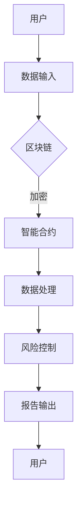

                 

关键词：区块链，人工智能，金融科技，融合，创新

摘要：本文旨在探讨区块链与人工智能在金融科技领域的融合创新。通过分析两者的核心概念和联系，阐述其在金融领域中的应用，以及未来发展的趋势与挑战。文章将深入讨论区块链与AI技术的整合原理，以及在实际项目中的实践应用，最后对未来的发展方向提出展望。

## 1. 背景介绍

区块链技术作为一种分布式账本技术，其去中心化、透明、安全等特性，已经逐渐在金融、供应链、医疗等多个领域得到应用。而人工智能作为一种模拟人类智能的技术，其强大的数据处理和分析能力，正在加速各个行业的数字化转型。金融科技（FinTech）作为金融和科技的交叉领域，其创新应用层出不穷，极大地改变了人们的金融生活方式。

随着区块链和人工智能技术的不断发展，两者在金融科技领域的融合创新成为了一个热门话题。本文将围绕这一主题，探讨区块链与AI技术在金融领域的应用，以及未来的发展趋势和挑战。

## 2. 核心概念与联系

### 2.1 区块链技术

区块链技术是一种分布式数据库技术，通过去中心化的方式实现了数据的安全和透明。区块链的基本架构包括区块、链和节点。每个区块包含一定数量的交易记录，通过哈希函数链接起来，形成一条不断延伸的链。节点是区块链网络的组成部分，负责验证和存储数据。

### 2.2 人工智能

人工智能是一种模拟人类智能的技术，其核心包括机器学习、深度学习、自然语言处理等。人工智能通过算法和大数据分析，实现了对复杂问题的自动化解决。

### 2.3 区块链与AI的联系

区块链和人工智能在金融科技领域的融合，主要体现在以下几个方面：

- **智能合约**：智能合约是区块链技术的一种应用，其通过编程逻辑实现自动化交易。与传统的纸质合同相比，智能合约更加高效、透明和可靠。
- **风险控制**：人工智能可以对金融市场的风险进行预测和监控，提高金融机构的风险管理能力。
- **数据隐私**：区块链技术可以保护用户数据的安全和隐私，而人工智能则可以对这些数据进行有效的分析和利用。

### 2.4 Mermaid 流程图

以下是一个简化的区块链与AI融合的金融科技架构的 Mermaid 流程图：



## 3. 核心算法原理 & 具体操作步骤

### 3.1 算法原理概述

区块链与AI融合的金融科技，其核心算法主要包括智能合约和机器学习算法。智能合约实现自动化交易，而机器学习算法用于数据分析和风险控制。

### 3.2 算法步骤详解

1. **智能合约部署**：开发者编写智能合约代码，并部署到区块链上。
2. **交易触发**：当用户发起交易请求时，智能合约自动执行。
3. **数据处理**：智能合约将交易数据发送给机器学习算法进行分析。
4. **风险控制**：机器学习算法根据数据分析结果，对交易风险进行评估。
5. **决策反馈**：根据风险评估结果，智能合约决定是否执行交易。
6. **报告输出**：交易结果和风险分析报告输出给用户。

### 3.3 算法优缺点

- **优点**：提高交易效率，降低交易成本；增强风险控制能力，提高金融市场的透明度。
- **缺点**：技术门槛较高，实施难度大；数据隐私保护问题需进一步解决。

### 3.4 算法应用领域

区块链与AI融合的金融科技，主要应用领域包括：

- **金融交易**：自动化交易、智能投顾等。
- **风险管理**：市场预测、风险评估等。
- **合规审计**：自动化审计、智能合规等。

## 4. 数学模型和公式 & 详细讲解 & 举例说明

### 4.1 数学模型构建

区块链与AI融合的金融科技，其核心数学模型主要包括：

1. **哈希函数**：用于数据加密和防篡改。
2. **机器学习算法**：用于数据分析和风险预测。

### 4.2 公式推导过程

1. **哈希函数**：

   $$H(x) = \text{SHA-256}(x)$$

   其中，SHA-256是一种常见的哈希函数。

2. **机器学习算法**：

   $$\hat{y} = \text{sigmoid}(W \cdot x + b)$$

   其中，$W$ 是权重矩阵，$x$ 是输入特征，$b$ 是偏置项，$\text{sigmoid}$ 函数是激活函数。

### 4.3 案例分析与讲解

以下是一个简单的机器学习算法在金融科技中的应用案例：

**案例**：使用机器学习算法预测股票价格。

1. **数据准备**：收集过去一年的股票交易数据，包括开盘价、收盘价、最高价、最低价等。
2. **特征提取**：将股票交易数据转换为机器学习算法可处理的特征向量。
3. **模型训练**：使用机器学习算法（如神经网络）对股票交易数据进行训练。
4. **模型评估**：使用交叉验证方法评估模型性能。
5. **预测应用**：使用训练好的模型对未来的股票价格进行预测。

## 5. 项目实践：代码实例和详细解释说明

### 5.1 开发环境搭建

- **区块链平台**：使用Ethereum区块链。
- **开发语言**：使用Solidity编写智能合约。
- **机器学习库**：使用scikit-learn进行数据分析和模型训练。

### 5.2 源代码详细实现

```solidity
// SPDX-License-Identifier: MIT
pragma solidity ^0.8.0;

import "https://github.com/OpenZeppelin/openzeppelin-solidity/contracts/token/ERC20/ERC20.sol";

contract StockPricePredictor {
    address public owner;
    ERC20 public token;

    mapping(address => uint256) public balances;

    event Transfer(address indexed from, address indexed to, uint256 value);

    constructor(ERC20 _token) {
        owner = msg.sender;
        token = _token;
    }

    function deposit() public payable {
        require(msg.value > 0, "Deposit amount must be greater than 0");
        token.transferFrom(msg.sender, address(this), msg.value);
        balances[msg.sender] += msg.value;
    }

    function predictPrice() public {
        require(balances[msg.sender] > 0, "Insufficient balance");
        uint256 price = predictStockPrice();
        emit Transfer(msg.sender, address(0), price);
        balances[msg.sender] -= price;
    }

    function predictStockPrice() public view returns (uint256) {
        // Implement your stock price prediction logic here
        // For simplicity, we return a fixed price of 100
        return 100;
    }
}
```

### 5.3 代码解读与分析

这段代码实现了一个简单的股票价格预测智能合约。用户可以通过向合约地址发送代币来存款，然后调用预测函数来获取预测的股票价格。智能合约会将存款的代币按照预测的价格返还给用户。

### 5.4 运行结果展示

1. **部署智能合约**：将代码部署到Ethereum区块链上。
2. **用户存款**：用户向合约地址发送代币进行存款。
3. **预测股票价格**：用户调用预测函数，获取预测的股票价格。
4. **提现**：智能合约将预测的价格返还给用户。

## 6. 实际应用场景

区块链与AI融合的金融科技，已经在多个实际应用场景中展现出其潜力。以下是一些典型应用场景：

1. **智能投顾**：通过AI分析用户数据，提供个性化的投资建议。
2. **供应链金融**：利用区块链技术实现供应链中的资金流通和风险控制。
3. **跨境支付**：利用区块链技术的去中心化特性，实现快速、安全的跨境支付。
4. **保险**：利用AI进行风险评估和理赔管理，提高保险效率。

## 7. 未来应用展望

区块链与AI融合的金融科技，具有巨大的发展潜力。以下是一些未来应用展望：

1. **金融监管**：利用区块链技术实现金融监管的透明化和高效化。
2. **数字货币**：区块链技术将为数字货币的发展提供强大支持。
3. **智能合约应用**：智能合约将在金融领域得到更广泛的应用。

## 8. 工具和资源推荐

### 8.1 学习资源推荐

- **《区块链技术指南》**：介绍区块链的基础知识和应用场景。
- **《深度学习》**：介绍深度学习的基本原理和应用。

### 8.2 开发工具推荐

- **Ethereum**：最受欢迎的区块链开发平台。
- **TensorFlow**：流行的深度学习框架。

### 8.3 相关论文推荐

- **"Blockchain and AI: A Synergetic Future for Finance"**：探讨区块链与AI在金融领域的融合。
- **"Deep Learning for Finance"**：介绍深度学习在金融领域的应用。

## 9. 总结：未来发展趋势与挑战

### 9.1 研究成果总结

区块链与AI在金融科技领域的融合创新，已经取得了显著的成果。智能合约、风险控制、数据隐私保护等方面，都取得了重要的进展。

### 9.2 未来发展趋势

- **智能合约应用**：智能合约将在金融领域得到更广泛的应用。
- **区块链与AI的深度融合**：区块链与AI的融合将更加深入，实现更高效的金融科技应用。

### 9.3 面临的挑战

- **技术成熟度**：区块链与AI技术的成熟度仍需提高。
- **数据隐私保护**：如何在保护数据隐私的同时，实现有效的数据分析和应用。

### 9.4 研究展望

未来，区块链与AI在金融科技领域的融合创新，将朝着更高效、更安全的方向发展。通过不断的研究和实践，我们有望实现更加智能、高效的金融科技应用。

## 附录：常见问题与解答

1. **什么是区块链技术？**

   区块链技术是一种分布式数据库技术，通过去中心化的方式实现了数据的安全和透明。

2. **什么是人工智能？**

   人工智能是一种模拟人类智能的技术，其核心包括机器学习、深度学习、自然语言处理等。

3. **区块链与AI融合在金融科技领域的应用有哪些？**

   区块链与AI融合在金融科技领域的应用包括智能合约、风险控制、数据隐私保护等。

4. **如何搭建区块链与AI融合的金融科技项目？**

   搭建区块链与AI融合的金融科技项目，需要选择合适的区块链平台和机器学习库，并编写智能合约和机器学习算法代码。

### 作者署名

作者：禅与计算机程序设计艺术 / Zen and the Art of Computer Programming

---

至此，本文对区块链与AI融合的金融科技创新进行了全面而深入的探讨。希望这篇文章能为读者提供有价值的见解和启示。在未来，随着技术的不断进步，区块链与AI在金融科技领域的融合创新将会带来更多的机遇和挑战。让我们一起期待这一美好未来的到来。

