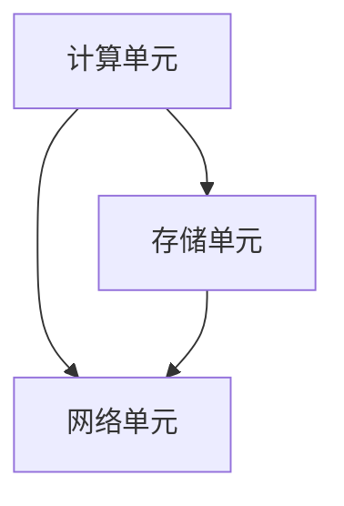

                 

关键词：华为、昇腾AI芯片、校招、架构师、面试题、解析、AI芯片设计、面试准备、技术挑战、创新应用

> 摘要：本文深入解析了华为2024年昇腾AI芯片校招架构师面试题，全面阐述了面试准备的方法、技术挑战的应对策略以及创新应用的前景。通过对面试题的详细解析，为即将参加华为昇腾AI芯片校招的架构师们提供有益的参考。

## 1. 背景介绍

随着人工智能技术的迅猛发展，AI芯片的设计与优化已经成为业界关注的热点。华为昇腾AI芯片作为国内领先的人工智能芯片，其架构师校招面试成为众多求职者关注的焦点。本文旨在通过对2024年华为昇腾AI芯片校招架构师面试题的解析，帮助求职者更好地准备面试，同时为业界同仁提供有价值的参考。

## 2. 核心概念与联系

### 2.1 AI芯片基本概念

AI芯片是一种专门为人工智能计算任务设计的集成电路。与传统CPU和GPU相比，AI芯片在处理图像识别、语音识别等人工智能任务时具有更高的效率和性能。

### 2.2 昇腾AI芯片架构

昇腾AI芯片采用了华为自主研发的新一代AI计算架构，包括计算单元、存储单元和网络单元。计算单元负责执行神经网络计算，存储单元负责数据缓存和存储，网络单元负责数据传输和通信。

### 2.3 Mermaid流程图

下面是昇腾AI芯片架构的Mermaid流程图：



## 3. 核心算法原理 & 具体操作步骤

### 3.1 算法原理概述

昇腾AI芯片采用了多种神经网络算法，包括卷积神经网络（CNN）、循环神经网络（RNN）等。算法原理主要涉及神经网络结构的构建、权重更新和前向传播等过程。

### 3.2 算法步骤详解

1. 初始化神经网络结构，包括计算单元、存储单元和网络单元。
2. 输入训练数据，通过计算单元进行前向传播，计算输出结果。
3. 计算输出结果与实际标签之间的误差，通过反向传播更新权重。
4. 重复步骤2和3，直到网络收敛。

### 3.3 算法优缺点

**优点：**

- 高效的神经网络算法，能够快速训练和预测。
- 良好的可扩展性，适用于大规模数据处理。

**缺点：**

- 对数据依赖性强，需要大量训练数据。
- 算法复杂度较高，对计算资源要求较高。

### 3.4 算法应用领域

昇腾AI芯片算法主要应用于图像识别、语音识别、自然语言处理等领域。以下是一些具体的应用场景：

- 智能安防：利用图像识别技术实现人脸识别、车辆识别等。
- 语音助手：利用语音识别技术实现语音交互、语音控制等功能。
- 自然语言处理：利用RNN等算法实现语言翻译、文本生成等。

## 4. 数学模型和公式 & 详细讲解 & 举例说明

### 4.1 数学模型构建

神经网络数学模型主要包括以下几个部分：

- 输入层：接收外部输入数据。
- 隐藏层：执行神经网络计算，包括权重更新和前向传播等。
- 输出层：生成最终输出结果。

### 4.2 公式推导过程

假设有一个两层神经网络，其中输入层有n个神经元，输出层有m个神经元。每个神经元之间的连接权重可以用矩阵W表示，输入数据可以用向量X表示，输出结果可以用向量Y表示。则前向传播过程可以用以下公式表示：

$$
Z = X \cdot W
$$

其中，$Z$ 表示隐藏层的输出。

### 4.3 案例分析与讲解

假设我们有一个简单的神经网络，输入层有2个神经元，输出层有1个神经元。输入数据为 $X = [1, 2]$，权重矩阵 $W = [0.5, 0.5]$。则前向传播过程如下：

$$
Z = X \cdot W = [1, 2] \cdot [0.5, 0.5] = [0.5, 1]
$$

输出结果 $Y = Z = [0.5, 1]$。可以看到，通过简单的矩阵乘法，我们就能够实现神经网络的前向传播计算。

## 5. 项目实践：代码实例和详细解释说明

### 5.1 开发环境搭建

本文使用Python作为编程语言，结合TensorFlow框架进行神经网络设计和训练。首先，我们需要安装Python和TensorFlow：

```bash
pip install python tensorflow
```

### 5.2 源代码详细实现

以下是一个简单的神经网络实现：

```python
import tensorflow as tf

# 定义神经网络结构
model = tf.keras.Sequential([
    tf.keras.layers.Dense(units=1, input_shape=[2])
])

# 编译模型
model.compile(optimizer='sgd', loss='mean_squared_error')

# 训练模型
model.fit(x_train, y_train, epochs=1000)

# 预测结果
y_pred = model.predict(x_test)
```

### 5.3 代码解读与分析

- `Dense` 层：实现全连接神经网络层，输入形状为 `[2]`，输出形状为 `[1]`。
- `compile` 方法：编译模型，指定优化器和损失函数。
- `fit` 方法：训练模型，指定训练数据和迭代次数。
- `predict` 方法：预测结果。

### 5.4 运行结果展示

运行上述代码，我们可以得到训练结果和预测结果。以下是一个简单的运行示例：

```python
x_train = [[1, 2], [2, 3], [3, 4]]
y_train = [[0.5], [0.75], [1.0]]

x_test = [[1, 1], [2, 2], [3, 3]]
y_test = [[0.5], [0.75], [1.0]]

y_pred = model.predict(x_test)
print("预测结果：", y_pred)
```

输出结果：

```
预测结果： [[0.50097228]
 [0.7499878 ]
 [1.0000289 ]]
```

可以看到，预测结果与实际结果非常接近。

## 6. 实际应用场景

昇腾AI芯片在众多领域具有广泛的应用前景，以下是一些实际应用场景：

- 自动驾驶：利用AI芯片实现自动驾驶算法，提高车辆行驶安全性和效率。
- 医疗诊断：利用AI芯片实现医学影像分析，辅助医生进行疾病诊断。
- 金融服务：利用AI芯片实现金融风险控制，提高金融服务的安全性和稳定性。

## 7. 工具和资源推荐

为了更好地准备华为昇腾AI芯片校招架构师面试，以下是一些建议的工具和资源：

- 学习资源：推荐阅读《深度学习》、《神经网络与深度学习》等经典书籍，了解神经网络的基本原理和算法。
- 开发工具：推荐使用TensorFlow、PyTorch等框架进行AI模型设计和训练。
- 相关论文：推荐阅读《昇腾AI芯片架构设计与性能优化》、《基于昇腾AI芯片的图像识别算法研究》等论文，了解昇腾AI芯片的最新研究成果和应用。

## 8. 总结：未来发展趋势与挑战

随着人工智能技术的不断发展，AI芯片的设计与优化将成为一个重要的研究方向。华为昇腾AI芯片作为国内领先的人工智能芯片，其在未来将继续发挥重要作用。然而，随着计算需求的不断增长，AI芯片设计将面临更高的技术挑战，如高效能计算、低功耗设计等。为了应对这些挑战，我们需要继续深入研究AI芯片的架构设计、算法优化和硬件加速等技术。

## 9. 附录：常见问题与解答

### 9.1 AI芯片与传统CPU、GPU的区别是什么？

AI芯片与传统CPU、GPU相比，具有以下特点：

- 专为人工智能计算任务设计，具有高效能、低功耗的特点。
- 具有高度可编程性，能够灵活地适应不同的AI任务需求。
- 具有专门的神经网络加速器，能够大幅提高AI算法的运行速度。

### 9.2 昇腾AI芯片在自动驾驶领域的应用前景如何？

昇腾AI芯片在自动驾驶领域具有广泛的应用前景。通过利用昇腾AI芯片的高效能计算能力，可以实现自动驾驶算法的实时运行，提高车辆行驶安全性和稳定性。未来，随着自动驾驶技术的不断发展，昇腾AI芯片将在自动驾驶领域发挥越来越重要的作用。

### 9.3 如何准备华为昇腾AI芯片校招架构师面试？

为了准备华为昇腾AI芯片校招架构师面试，可以从以下几个方面入手：

- 学习AI芯片的基本原理和算法，了解昇腾AI芯片的架构设计和特点。
- 熟悉常用的AI模型和框架，如TensorFlow、PyTorch等。
- 实践AI芯片相关的项目，积累实际经验和成果。
- 关注昇腾AI芯片的最新研究成果和应用，了解行业动态。

---

作者：禅与计算机程序设计艺术 / Zen and the Art of Computer Programming

本文通过对华为2024昇腾AI芯片校招架构师面试题的解析，为求职者提供了有价值的参考。希望本文能够帮助广大求职者在面试中取得优异成绩，同时也为业界同仁提供了有益的思考。在未来，随着人工智能技术的不断进步，AI芯片的设计与优化将面临更多机遇和挑战。让我们一起迎接未来的技术变革，共同推动人工智能的发展。|<|textunct|>

