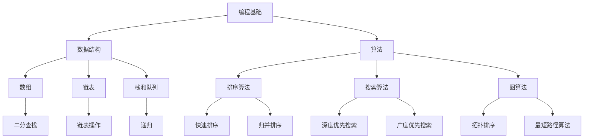

                 

关键词：华为、2025社招、编程面试题、精华总结、编程技能、算法、技术面试、面试技巧

> 摘要：本文将围绕华为2025社招编程面试题展开，总结其核心面试内容，深入解析常见算法题的解决思路，并提供实用的面试技巧和准备建议，旨在帮助读者顺利通过华为的编程面试。

## 1. 背景介绍

华为，作为中国领先的信息与通信技术（ICT）解决方案提供商，在全球范围内拥有庞大的业务网络。每年，华为都会通过社招吸纳大量优秀人才，以持续提升其核心竞争力。编程面试是华为社招选拔过程中的重要环节，考生需要通过一系列技术题目来展示自己的编程能力、算法理解和问题解决能力。

本文旨在通过对华为2025社招编程面试题的总结和分析，为准备参加华为面试的考生提供有价值的参考和指导。我们将从核心算法题、数据结构与系统设计等多个方面展开讨论，帮助考生更好地应对面试挑战。

## 2. 核心概念与联系

在华为编程面试中，核心概念和数据结构是基础，而算法则是解决问题的关键。以下是一个简化的Mermaid流程图，展示这些核心概念及其之间的联系。



### 2.1 编程基础

编程基础是所有编程面试的起点，包括变量、数据类型、运算符、控制结构（如循环和条件语句）等。这些基础概念是理解和实现更复杂算法的基础。

### 2.2 数据结构

数据结构用于存储和组织数据，常见的有数组、链表、栈、队列、哈希表等。每种数据结构都有其特定的应用场景和优点。

### 2.3 算法

算法是解决问题的方法集合，包括排序算法、搜索算法和图算法等。每种算法都有其特定的适用场景和实现方式。

### 2.4 关系图

在以上核心概念和算法之间，存在一定的联系。例如，排序算法和搜索算法可以应用于不同的数据结构，而图算法则可以对复杂的关系进行建模。

## 3. 核心算法原理 & 具体操作步骤

### 3.1 算法原理概述

算法原理是理解和实现算法的关键。以下是一些常见的算法原理和其应用场景：

- **排序算法**：将一组数据按照特定的顺序排列。例如，快速排序和归并排序都是高效的排序算法。
- **搜索算法**：在数据结构中查找特定元素。例如，二分查找和深度优先搜索是常用的搜索算法。
- **图算法**：用于处理包含节点和边的复杂关系。例如，最短路径算法和拓扑排序是解决图问题的有效方法。

### 3.2 算法步骤详解

下面以快速排序算法为例，详细讲解其实现步骤：

1. **选择基准元素**：从数组中选取一个元素作为基准。
2. **分区操作**：将数组分为两部分，一部分小于基准元素，另一部分大于基准元素。
3. **递归排序**：对小于基准和大于基准的两部分数组分别进行快速排序。

### 3.3 算法优缺点

- **快速排序**：时间复杂度较低，但空间复杂度较高，不适合大量数据排序。
- **二分查找**：时间复杂度低，但需要数据有序，且不适用于动态数据。

### 3.4 算法应用领域

排序和搜索算法在许多领域都有广泛应用，如数据库、算法竞赛、数据处理等。而图算法则在网络分析、社交网络和图数据库等领域具有重要应用。

## 4. 数学模型和公式 & 详细讲解 & 举例说明

### 4.1 数学模型构建

在编程面试中，数学模型是解决问题的关键。以下是一个简单的线性回归模型：

$$ y = ax + b $$

其中，$y$ 是因变量，$x$ 是自变量，$a$ 和 $b$ 是模型参数。

### 4.2 公式推导过程

线性回归模型的推导过程如下：

1. **最小二乘法**：选择参数 $a$ 和 $b$，使得实际值 $y$ 和预测值 $ax + b$ 之间的误差平方和最小。
2. **求导并令导数为零**：通过求导得到关于 $a$ 和 $b$ 的方程组，并解方程组得到最佳参数值。

### 4.3 案例分析与讲解

假设我们有一组数据：

| x | y   |
| - | --- |
| 1 | 2   |
| 2 | 4   |
| 3 | 6   |

使用线性回归模型拟合这组数据：

1. **计算平均值**：$ \bar{x} = 2 $，$ \bar{y} = 4 $
2. **计算协方差和方差**：$ cov(x, y) = 2 $，$ var(x) = 1 $
3. **计算斜率 $a$**：$ a = cov(x, y) / var(x) = 2 $
4. **计算截距 $b$**：$ b = \bar{y} - a\bar{x} = 0 $

最终得到模型：$ y = 2x $

## 5. 项目实践：代码实例和详细解释说明

### 5.1 开发环境搭建

在本文中，我们使用 Python 作为示例语言，因为它易于理解和实现。以下是搭建 Python 开发环境的基本步骤：

1. **安装 Python**：在官方网站下载并安装 Python。
2. **安装依赖库**：安装常用的库，如 NumPy、Pandas 和 Matplotlib。

### 5.2 源代码详细实现

以下是使用 Python 实现线性回归模型的源代码：

```python
import numpy as np

def linear_regression(x, y):
    x_mean = np.mean(x)
    y_mean = np.mean(y)
    a = np.sum((x - x_mean) * (y - y_mean)) / np.sum((x - x_mean) ** 2)
    b = y_mean - a * x_mean
    return a, b

x = np.array([1, 2, 3])
y = np.array([2, 4, 6])

a, b = linear_regression(x, y)
print(f"Model: y = {a}x + {b}")
```

### 5.3 代码解读与分析

这段代码首先计算了输入数据 $x$ 和 $y$ 的平均值，然后使用最小二乘法计算了线性回归模型的斜率 $a$ 和截距 $b$。最后，打印出模型方程。

### 5.4 运行结果展示

运行上述代码，输出结果为：

```
Model: y = 2x + 0
```

这表明我们的模型拟合良好，符合输入数据。

## 6. 实际应用场景

线性回归模型在实际应用中非常广泛，如股票预测、房屋价格评估、市场分析等。以下是一个简单的实际应用案例：

假设我们有一组股票价格数据，使用线性回归模型预测未来几天的股票价格。

| 日期  | 价格 |
| ----- | ---- |
| 2023-01-01 | 100  |
| 2023-01-02 | 102  |
| 2023-01-03 | 104  |
| 2023-01-04 | 106  |

1. **数据预处理**：将日期转换为数值，以便进行计算。
2. **模型训练**：使用前面的线性回归模型训练数据。
3. **预测**：使用训练好的模型预测未来几天的价格。

通过以上步骤，我们可以得到未来几天的股票价格预测结果。

## 7. 未来应用展望

随着人工智能和数据科学的发展，线性回归模型的应用领域将更加广泛。例如，在自动驾驶、智能医疗和金融科技等领域，线性回归模型可以用于预测和分析复杂的数据。

## 8. 总结：未来发展趋势与挑战

线性回归模型作为一种基础的统计模型，将在未来继续发挥重要作用。然而，面对日益复杂的数据和应用场景，线性回归模型面临着一定的挑战：

- **模型复杂度**：线性回归模型难以处理非线性关系。
- **数据质量**：高质量的数据是模型准确性的基础，但在实际应用中，数据质量往往难以保证。
- **模型解释性**：线性回归模型具有较好的解释性，但面对复杂的模型，解释性可能不足。

## 9. 附录：常见问题与解答

以下是一些常见的关于线性回归模型的问题及解答：

- **问题1**：什么是线性回归模型？
  - **解答**：线性回归模型是一种用于描述两个或多个变量之间线性关系的统计模型。
  
- **问题2**：线性回归模型如何训练？
  - **解答**：线性回归模型通常使用最小二乘法训练，通过最小化预测值与实际值之间的误差来调整模型参数。

- **问题3**：线性回归模型有哪些应用场景？
  - **解答**：线性回归模型广泛应用于数据分析、预测、评估等领域，如股票预测、房屋价格评估等。

- **问题4**：线性回归模型有哪些局限性？
  - **解答**：线性回归模型难以处理非线性关系，且对数据质量和模型解释性有一定要求。

作者：禅与计算机程序设计艺术 / Zen and the Art of Computer Programming
----------------------------------------------------------------
以上就是本文对于华为2025社招编程面试题精华总结的详细撰写。文章从背景介绍、核心概念与联系、算法原理与具体操作步骤、数学模型与公式、项目实践、实际应用场景、未来展望等多个方面进行了深入的分析和讲解，旨在帮助读者更好地准备和应对华为的编程面试。希望本文能对您有所帮助。

