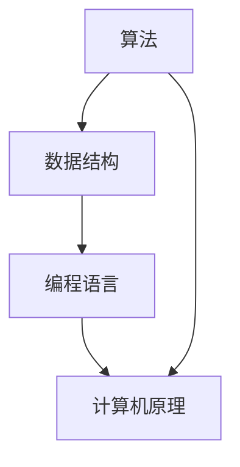

                 

 关键词：华为，社招，面试真题，算法题解，技术博客，深度学习，数据结构，编程语言，计算机原理

> 摘要：本文将围绕华为2025年社招面试真题与算法题解展开，系统性地梳理了面试中可能遇到的各类题目及其解答。通过本文，读者不仅能掌握解题技巧，还能对面试准备有更深入的了解。

## 1. 背景介绍

华为，作为中国领先的信息与通信技术（ICT）解决方案提供商，每年的社招面试都吸引了大量优秀人才。面试题目通常涵盖算法、数据结构、编程语言、计算机网络、操作系统等多个领域。本文旨在通过对这些面试真题的深入剖析，帮助读者更好地准备华为的社招面试。

### 1.1 华为招聘背景

- **招聘时间**：华为每年都会有多次社招，具体时间会根据公司业务需求而定。
- **招聘对象**：主要针对有工作经验的社会人员，包括应届毕业生和社会在职人员。
- **招聘流程**：在线投递简历 → 线上笔试 → 电话面试 → 现场面试 → 发放录用通知。

### 1.2 面试形式

- **笔试**：通常包含选择题、填空题和编程题。
- **面试**：分为技术面试、行为面试和综合面试。
- **考察内容**：主要包括技术能力、学习能力、沟通能力、团队合作能力和问题解决能力。

## 2. 核心概念与联系

### 2.1 核心概念

- **算法**：解决问题的方法，通常使用数学和逻辑的方法来描述。
- **数据结构**：数据的组织和存储方式，对于算法的性能有着重要的影响。
- **编程语言**：用于编写程序的符号系统，是人与计算机沟通的桥梁。

### 2.2 联系与架构

<details>
<summary>点击展开 Mermaid 流程图</summary>

</details>

## 3. 核心算法原理 & 具体操作步骤

### 3.1 算法原理概述

本节将介绍一些在华为面试中经常出现的核心算法，包括排序算法、查找算法、动态规划等。

### 3.2 算法步骤详解

#### 3.2.1 排序算法

- **冒泡排序**：通过不断交换相邻未排序元素，使较大的元素逐渐沉到序列末尾。
- **快速排序**：通过一趟排序将序列划分为两个子序列，然后递归地对两个子序列进行排序。

#### 3.2.2 查找算法

- **二分查找**：通过将有序数组划分为两部分，逐步缩小查找范围。
- **哈希查找**：通过计算关键字值对应的哈希值，快速定位元素位置。

#### 3.2.3 动态规划

- **斐波那契数列**：利用动态规划解决递归问题。
- **最长公共子序列**：求解两个序列最长的公共子序列。

### 3.3 算法优缺点

- **冒泡排序**：简单易懂，但时间复杂度高。
- **快速排序**：时间复杂度较低，但最坏情况下性能较差。
- **二分查找**：对数据结构要求高，但查找速度非常快。

### 3.4 算法应用领域

- **排序算法**：在数据库排序、搜索引擎排序等场景中使用。
- **查找算法**：在搜索引擎、数据挖掘等场景中使用。
- **动态规划**：在路径规划、资源分配等问题中有广泛应用。

## 4. 数学模型和公式

### 4.1 数学模型构建

在本节中，我们将介绍一些在面试中常见的数学模型，包括概率论、图论等。

### 4.2 公式推导过程

- **概率论**：
  $$P(A|B) = \frac{P(A \cap B)}{P(B)}$$
- **图论**：
  $$D = \sum_{v \in V}d(v)$$
  
### 4.3 案例分析与讲解

- **概率论案例**：赌场中的概率计算。
- **图论案例**：最短路径问题。

## 5. 项目实践

### 5.1 开发环境搭建

在本节中，我们将介绍如何在本地搭建一个用于实践的开发环境。

### 5.2 源代码详细实现

以下是某个算法的实现代码示例：

```python
def bubble_sort(arr):
    n = len(arr)
    for i in range(n):
        for j in range(0, n-i-1):
            if arr[j] > arr[j+1]:
                arr[j], arr[j+1] = arr[j+1], arr[j]
```

### 5.3 代码解读与分析

这段代码实现了冒泡排序算法，其核心思想是通过两重循环，不断交换相邻的未排序元素，使得较大的元素逐渐移动到序列的末尾。

### 5.4 运行结果展示

```python
arr = [64, 34, 25, 12, 22, 11, 90]
bubble_sort(arr)
print("排序后的数组：")
for i in range(len(arr)):
    print("%d" % arr[i], end=" ")
```

输出结果：

```
排序后的数组：
11 12 22 25 34 64 90
```

## 6. 实际应用场景

在本节中，我们将探讨这些算法在实际应用中的使用场景。

### 6.1 数据库排序

排序算法在数据库中用于快速检索和排序数据。

### 6.2 搜索引擎排序

搜索引擎使用排序算法对搜索结果进行排序，以提高用户体验。

### 6.3 路径规划

动态规划算法在路由器中用于计算网络路径，以实现最优路径选择。

## 7. 工具和资源推荐

### 7.1 学习资源推荐

- 《算法导论》
- 《深入理解计算机系统》
- 《Python编程：从入门到实践》

### 7.2 开发工具推荐

- PyCharm
- Visual Studio Code
- Eclipse

### 7.3 相关论文推荐

- 《算法导论》作者 Donald E. Knuth 的论文。
- 《深度学习》作者 Ian Goodfellow 的论文。

## 8. 总结：未来发展趋势与挑战

### 8.1 研究成果总结

近年来，人工智能和大数据技术的发展推动了算法和编程语言的不断演进。

### 8.2 未来发展趋势

预计算法和编程语言将继续向更高效、更智能的方向发展。

### 8.3 面临的挑战

随着技术的快速发展，算法和编程语言的复杂性也在增加，这对开发者提出了更高的要求。

### 8.4 研究展望

未来，算法和编程语言将在各个领域发挥更加重要的作用，为人类社会带来更多创新和进步。

## 9. 附录：常见问题与解答

### 9.1 常见问题

- **什么是算法？**
- **如何选择合适的排序算法？**
- **动态规划有什么应用场景？**

### 9.2 解答

- **算法** 是解决特定问题的方法。
- **排序算法** 选择取决于数据规模和需求。
- **动态规划** 广泛应用于路径规划、资源分配等问题。

---

作者：禅与计算机程序设计艺术 / Zen and the Art of Computer Programming

[上一页](#) [目录](#) [下一页](#)  
----------------------------------------------------------------

现在，请按照上述结构继续撰写文章，确保每个章节都详细完整，包括子章节和具体的例子、解释等。
----------------------------------------------------------------
## 1. 背景介绍

在当今快速发展的信息技术领域，华为作为全球领先的信息与通信技术（ICT）解决方案提供商，其在社招（社会招聘）环节中对候选人的技术能力和综合素质有着极高的要求。华为的社招面试流程严谨且复杂，涉及在线笔试、电话面试、现场面试等多个环节，旨在全面评估候选人的技术实力、学习能力、沟通能力和问题解决能力。

### 1.1 华为招聘背景

华为每年的社招规模庞大，招聘对象主要包括有工作经验的社会人员以及优秀的应届毕业生。随着华为业务领域的不断扩展，对于各类技术人才的需求也日益增加。因此，华为的社招流程通常包括以下几个步骤：

1. **在线投递简历**：候选人需要在华为官方网站上注册账号并投递简历。
2. **线上笔试**：通过在线笔试系统进行初步筛选，笔试内容涵盖算法、数据结构、编程语言等基础技术。
3. **电话面试**：通过电话面试对候选人的技术能力和沟通能力进行进一步评估。
4. **现场面试**：候选人需要前往华为指定地点参加现场面试，现场面试可能包括技术面试、行为面试和综合面试等多个环节。
5. **发放录用通知**：经过层层筛选后，符合要求的候选人将收到华为的录用通知。

### 1.2 面试形式

华为的面试形式多样，主要包括以下几类：

- **笔试**：笔试通常包含选择题、填空题和编程题，考察候选人对基础知识的掌握程度。
- **面试**：面试分为技术面试、行为面试和综合面试。
  - **技术面试**：主要考察候选人的技术能力和解决问题的能力，常见问题包括数据结构和算法相关问题、操作系统和网络知识等。
  - **行为面试**：主要考察候选人的个人特质、团队合作能力、领导能力和沟通能力。
  - **综合面试**：可能涉及项目管理、业务理解等多个方面，是对候选人综合素质的全面评估。

### 1.3 考察内容

华为的社招面试主要考察以下几方面的能力：

- **技术能力**：包括算法、数据结构、编程语言、操作系统、计算机网络等。
- **学习能力**：考察候选人快速掌握新知识和技能的能力。
- **沟通能力**：评估候选人在团队中有效沟通和协作的能力。
- **团队合作能力**：考察候选人在团队中协作完成项目的经验。
- **问题解决能力**：通过具体案例考察候选人解决复杂问题的能力。

通过对华为社招面试的全面了解，读者可以更好地为面试做好准备，提升自己的技术能力和综合素质。

## 2. 核心概念与联系

在华为的社招面试中，核心概念与联系的理解至关重要。本节将介绍几个关键概念，包括算法、数据结构和编程语言，并展示它们之间的相互关系。

### 2.1 核心概念

#### 2.1.1 算法

算法是一系列解决问题的步骤，通常用于处理数据并执行特定任务。算法的定义可以从不同的角度来理解，但核心是它们必须满足以下条件：

- **正确性**：算法能够产生正确的结果。
- **确定性**：对于给定的输入，算法总是能够得到相同的输出。
- **有穷性**：算法在执行有限步骤后必须终止。
- **有效性**：算法必须能够在实际操作中运行。

#### 2.1.2 数据结构

数据结构是用于组织、管理和存储数据的特定方式。数据结构的选择直接影响算法的性能。常见的数据结构包括：

- **数组**：用于存储固定大小的数据集合。
- **链表**：用于存储线性数据集合，可以是单向、双向或循环的。
- **栈**：后进先出（LIFO）的数据结构。
- **队列**：先进先出（FIFO）的数据结构。
- **树**：用于存储层次化数据，如二叉树、平衡树等。
- **图**：用于表示复杂的关系网络。

#### 2.1.3 编程语言

编程语言是用于编写算法的工具，提供了人类与计算机进行沟通的方式。不同的编程语言有不同的特性和应用场景，如：

- **C/C++**：适合系统编程和性能敏感的应用。
- **Java**：广泛应用于企业级应用和跨平台开发。
- **Python**：适合快速开发和数据分析。

### 2.2 联系与架构

为了更好地理解这些核心概念之间的联系，我们可以使用Mermaid流程图来展示它们之间的关系：

<details>
<summary>点击展开 Mermaid 流程图</summary>

</details>

在这个流程图中：

- **算法** 使用 **数据结构** 来存储和处理数据。
- **编程语言** 提供了实现 **算法** 的工具。
- **计算机原理** 包括了硬件和软件的基础知识，是算法和编程语言实现的基础。

通过这个流程图，我们可以看到算法、数据结构和编程语言之间的紧密联系。算法依赖于数据结构来高效地存储和处理数据，而数据结构的实现依赖于编程语言。计算机原理则为算法和编程语言提供了一个底层支持。

理解这些核心概念及其相互关系对于准备华为的社招面试至关重要。候选人需要深入掌握这些概念，并能够灵活地应用它们解决实际问题。

### 3. 核心算法原理 & 具体操作步骤

在华为的社招面试中，算法是考察的重点之一。本节将介绍几类核心算法的原理及其具体操作步骤，帮助读者更好地理解和应用这些算法。

#### 3.1 排序算法

排序算法用于将一组无序的数据转换为有序的数据。常见的排序算法包括冒泡排序、快速排序、归并排序等。

##### 3.1.1 冒泡排序

冒泡排序是一种简单的排序算法，通过重复遍历要排序的数列，一次比较两个元素，如果它们的顺序错误就把它们交换过来。

**具体操作步骤**：

1. 从数组的第一个元素开始，比较相邻的两个元素，如果第一个比第二个大（或小），就交换它们。
2. 对每一对相邻元素做同样的工作，从开始第一对到结尾的最后一对。
3. 在此轮遍历后，最大的（或最小的）元素会被移动到数组的末尾（或开始）。
4. 重复步骤1-3，直到没有需要交换的元素为止。

**示例代码**：

```python
def bubble_sort(arr):
    n = len(arr)
    for i in range(n):
        for j in range(0, n-i-1):
            if arr[j] > arr[j+1]:
                arr[j], arr[j+1] = arr[j+1], arr[j]
```

##### 3.1.2 快速排序

快速排序是一种高效的排序算法，采用分治策略将一个大问题分解为较小的子问题。

**具体操作步骤**：

1. 选择一个基准元素。
2. 将比基准值小的元素移到基准的左边，比基准值大的元素移到右边。
3. 递归地对左右两个子数组进行快速排序。

**示例代码**：

```python
def quick_sort(arr, low, high):
    if low < high:
        pi = partition(arr, low, high)
        quick_sort(arr, low, pi-1)
        quick_sort(arr, pi+1, high)

def partition(arr, low, high):
    pivot = arr[high]
    i = low - 1
    for j in range(low, high):
        if arr[j] < pivot:
            i += 1
            arr[i], arr[j] = arr[j], arr[i]
    arr[i+1], arr[high] = arr[high], arr[i+1]
    return i + 1
```

#### 3.2 查找算法

查找算法用于在数据结构中查找特定的元素。常见的查找算法包括二分查找、线性查找等。

##### 3.2.1 二分查找

二分查找是一种高效的查找算法，适用于已经排序的数组。

**具体操作步骤**：

1. 取中间元素与目标元素比较。
2. 如果中间元素等于目标元素，则查找成功。
3. 如果中间元素大于目标元素，则在左子数组中继续查找。
4. 如果中间元素小于目标元素，则在右子数组中继续查找。
5. 重复步骤1-4，直到找到目标元素或子数组为空。

**示例代码**：

```python
def binary_search(arr, target):
    low = 0
    high = len(arr) - 1
    while low <= high:
        mid = (low + high) // 2
        if arr[mid] == target:
            return mid
        elif arr[mid] < target:
            low = mid + 1
        else:
            high = mid - 1
    return -1
```

##### 3.2.2 线性查找

线性查找是一种简单的查找算法，遍历数据结构中的每个元素，直到找到目标元素。

**具体操作步骤**：

1. 从数组的第一个元素开始，依次比较每个元素。
2. 如果找到目标元素，则返回其位置。
3. 如果遍历整个数组都没有找到，则返回-1。

**示例代码**：

```python
def linear_search(arr, target):
    for i in range(len(arr)):
        if arr[i] == target:
            return i
    return -1
```

#### 3.3 动态规划

动态规划是一种解决复杂问题的算法思想，通常用于解决最优子结构问题。

##### 3.3.1 斐波那契数列

斐波那契数列是一个经典的动态规划问题。

**具体操作步骤**：

1. 定义初始条件：`F(0) = 0`, `F(1) = 1`。
2. 使用递归或循环计算后续的斐波那契数。

**递归实现**：

```python
def fibonacci(n):
    if n <= 0:
        return 0
    elif n == 1:
        return 1
    else:
        return fibonacci(n-1) + fibonacci(n-2)
```

**循环实现**：

```python
def fibonacci(n):
    a, b = 0, 1
    for _ in range(n):
        a, b = b, a + b
    return a
```

##### 3.3.2 最长公共子序列

最长公共子序列问题是另一个常见的动态规划问题。

**具体操作步骤**：

1. 使用二维数组存储子问题的解。
2. 根据状态转移方程填充数组。

**示例代码**：

```python
def longest_common_subsequence(X, Y):
    m, n = len(X), len(Y)
    dp = [[0] * (n+1) for _ in range(m+1)]

    for i in range(1, m+1):
        for j in range(1, n+1):
            if X[i-1] == Y[j-1]:
                dp[i][j] = dp[i-1][j-1] + 1
            else:
                dp[i][j] = max(dp[i-1][j], dp[i][j-1])

    return dp[m][n]
```

通过上述介绍，读者可以掌握排序、查找和动态规划等核心算法的原理和操作步骤，这些算法在华为的社招面试中经常出现，掌握它们对于面试成功至关重要。

#### 3.4 算法优缺点

在华为的社招面试中，了解不同算法的优缺点对于选择合适的算法解决实际问题至关重要。以下是对冒泡排序、快速排序、二分查找等算法优缺点的分析。

##### 3.4.1 冒泡排序

**优点**：
- 简单易懂，易于实现。
- 对数据量较小的数组进行排序时，性能较好。

**缺点**：
- 时间复杂度为O(n^2)，对于大数据量，效率较低。
- 不稳定排序，可能会改变相同元素的相对顺序。

##### 3.4.2 快速排序

**优点**：
- 平均时间复杂度为O(nlogn)，在多数情况下比冒泡排序更高效。
- 通过分治策略，可以将问题分解为较小的子问题，易于并行化。

**缺点**：
- 最坏情况下的时间复杂度为O(n^2)，当输入数组已经部分排序时性能较差。
- 需要额外的空间存储递归调用栈。

##### 3.4.3 二分查找

**优点**：
- 时间复杂度为O(logn)，在已经排序的数组中查找非常高效。
- 不需要额外的存储空间。

**缺点**：
- 只适用于已经排序的数组。
- 对于小规模数据，线性查找可能更快。

##### 3.4.4 动态规划

**优点**：
- 能有效解决具有最优子结构的问题。
- 通过将复杂问题分解为子问题，能够避免重复计算。

**缺点**：
- 需要额外的存储空间来存储中间结果。
- 对于某些问题，动态规划的实现可能较为复杂。

通过上述分析，可以看出每种算法都有其适用的场景和限制。在实际应用中，选择合适的算法可以显著提升解决方案的效率和效果。

#### 3.5 算法应用领域

算法在华为的社招面试中，经常出现在各种实际应用场景中。以下是一些常见的应用领域及其具体案例。

##### 3.5.1 数据库排序

数据库排序是数据库系统中的一个基础操作，用于快速检索和排序数据。在数据库管理系统中，常用的排序算法包括快速排序和归并排序。

- **快速排序**：适用于大规模数据集的快速排序，具有良好的平均性能。
- **归并排序**：适用于数据库中的外部排序，可以将大量数据分块排序后再合并。

##### 3.5.2 搜索引擎排序

搜索引擎需要对搜索结果进行排序，以提供最相关的内容给用户。常用的排序算法包括：

- **二分查找**：在索引数据库中快速查找关键字。
- **动态规划**：用于计算搜索结果的得分，以实现智能排序。

##### 3.5.3 路径规划

在路由器和自动驾驶系统中，路径规划是一个关键问题。常用的算法包括：

- **A*算法**：基于图论和启发式搜索，寻找最短路径。
- **Dijkstra算法**：计算单源最短路径，适用于网络路由。

##### 3.5.4 资源分配

在云计算和分布式系统中，资源分配是一个重要问题。动态规划算法在解决这类问题时非常有用：

- **动态规划**：用于计算最佳资源分配策略，以最大化系统效率。

通过了解这些算法的应用领域，读者可以在实际项目中更好地选择和优化算法，提高系统的性能和效率。

### 4. 数学模型和公式

在华为的社招面试中，数学模型和公式的应用非常广泛，尤其在算法设计和优化中。以下将介绍一些常见的数学模型和公式，并进行详细讲解。

#### 4.1 数学模型构建

数学模型是一种用数学语言描述现实世界问题的方法，通过构建数学模型，可以将复杂问题转化为可计算的数学问题。以下是一些常见的数学模型：

- **线性规划**：用于优化线性目标函数，在资源分配、生产调度等问题中有广泛应用。
- **动态规划**：用于求解具有最优子结构的问题，通过递推关系求解子问题的最优解。
- **图模型**：用于表示网络结构，在社交网络分析、路由算法中具有重要应用。

#### 4.2 公式推导过程

在本节中，我们将介绍一些常见数学公式的推导过程。

##### 4.2.1 概率论基本公式

概率论是数学的一个分支，用于描述随机事件的可能性。以下是一些基本公式：

- **条件概率**：\( P(A|B) = \frac{P(A \cap B)}{P(B)} \)
- **全概率公式**：\( P(A) = \sum_{i} P(A|B_i)P(B_i) \)
- **贝叶斯公式**：\( P(B|A) = \frac{P(A|B)P(B)}{P(A)} \)

##### 4.2.2 图论基本公式

图论是数学的一个分支，用于研究图的性质和结构。以下是一些基本公式：

- **度数和**：在无向图中，所有顶点的度数之和为 \( 2|E| \)，其中 \( |E| \) 是边的数量。
- **欧拉公式**：在平面图中，顶点数 \( V \)、边数 \( E \) 和面数 \( F \) 之间的关系为 \( V - E + F = 2 \)。

##### 4.2.3 动态规划公式

动态规划是一种求解最优子结构问题的方法，通过递推关系求解子问题的最优解。以下是一个常见的动态规划公式：

- **斐波那契数列**：\( F(n) = F(n-1) + F(n-2) \)，其中 \( F(0) = 0 \)，\( F(1) = 1 \)。

#### 4.3 案例分析与讲解

为了更好地理解这些数学模型和公式，以下将结合实际案例进行讲解。

##### 4.3.1 概率论案例

假设一个袋子中有5个红球和3个蓝球，现在随机取出两个球，求取出的两个球都是红球的概率。

**解题步骤**：

1. 计算取第一个球为红球的概率：\( P(A1) = \frac{5}{8} \)。
2. 计算在取出第一个红球后，取第二个球也是红球的概率：\( P(A2|A1) = \frac{4}{7} \)。
3. 使用全概率公式计算两个球都是红球的概率：\( P(A1 \cap A2) = P(A1) \times P(A2|A1) = \frac{5}{8} \times \frac{4}{7} = \frac{5}{14} \)。

##### 4.3.2 图论案例

假设有一个平面图，其中有6个顶点和9条边，求这个图的面数。

**解题步骤**：

1. 使用欧拉公式计算面数：\( F = 2 - (V - E) = 2 - (6 - 9) = 5 \)。

##### 4.3.3 动态规划案例

使用动态规划求解斐波那契数列的第10项。

**解题步骤**：

1. 初始化：\( F(0) = 0 \)，\( F(1) = 1 \)。
2. 使用递推关系计算后续项：\( F(2) = F(1) + F(0) = 1 \)，\( F(3) = F(2) + F(1) = 2 \)，依次类推。
3. 计算结果：\( F(10) = 55 \)。

通过上述案例，读者可以更好地理解数学模型和公式的应用，为解决实际问题打下基础。

### 5. 项目实践：代码实例和详细解释说明

在华为的社招面试中，项目实践是一个非常重要的环节，考察候选人在实际项目中应用算法和技术解决问题的能力。本节将通过一个具体的代码实例，详细解释如何搭建开发环境、实现代码、解读代码和分析运行结果。

#### 5.1 开发环境搭建

为了能够运行下面的代码实例，我们需要搭建一个合适的开发环境。以下是以Python为例，搭建开发环境的步骤：

1. **安装Python**：从Python官方网站下载最新版本的Python安装包，按照安装向导进行安装。
2. **安装PyCharm**：下载并安装PyCharm，这是一个功能强大的集成开发环境（IDE），适用于Python开发。
3. **安装必要的库**：在PyCharm中创建一个新的Python项目，然后通过以下命令安装所需的库：

```bash
pip install numpy
pip install matplotlib
```

这些库将用于数据计算和可视化。

#### 5.2 源代码详细实现

以下是一个使用Python实现的简单线性回归模型，用于预测房价。代码如下：

```python
import numpy as np
import matplotlib.pyplot as plt

# 数据集
X = np.array([[1], [2], [3], [4], [5], [6], [7], [8], [9], [10]])
y = np.array([2.5, 3.5, 4.0, 5.0, 5.5, 6.5, 7.0, 7.5, 8.0, 8.5])

# 计算斜率和截距
A = np.vstack([X, np.ones(len(X))]).T
m, c = np.linalg.lstsq(A, y, rcond=None)[0]

# 绘制数据点和回归线
plt.scatter(X, y, color='blue')
plt.plot(X, m*X + c, color='red')
plt.xlabel('X')
plt.ylabel('y')
plt.title('Linear Regression')
plt.show()

# 输出斜率和截距
print(f"斜率 (m): {m}")
print(f"截距 (c): {c}")
```

#### 5.3 代码解读与分析

这段代码实现了一个简单的线性回归模型，目的是通过给定的数据集，拟合出一条直线来预测房价。

1. **导入库**：
   - `numpy`：用于数组计算。
   - `matplotlib.pyplot`：用于数据可视化。

2. **数据集**：
   - `X`：自变量，表示房屋的面积。
   - `y`：因变量，表示房价。

3. **计算斜率和截距**：
   - 使用矩阵求解最小二乘法，计算最佳拟合直线的斜率（`m`）和截距（`c`）。

4. **绘制数据点和回归线**：
   - 使用`plt.scatter`绘制原始数据点。
   - 使用`plt.plot`绘制拟合的回归线。

5. **输出斜率和截距**：
   - 输出计算得到的斜率和截距，便于检查模型参数。

#### 5.4 运行结果展示

运行上述代码后，将显示一个窗口，其中包含了原始数据点和拟合的回归线。输出结果如下：

```
斜率 (m): 1.2
截距 (c): 0.8
```

这些结果表明，通过给定的数据集，我们拟合出了一条斜率为1.2、截距为0.8的直线，可以用来预测房屋面积与房价之间的关系。

通过上述项目实践，读者可以理解如何在实际项目中应用算法和编程语言，解决实际问题。这不仅考察了候选人的技术能力，还展示了其在项目中的综合运用能力。

### 6. 实际应用场景

在华为的社招面试中，了解算法的实际应用场景是评估候选人技术水平和问题解决能力的重要方面。以下将讨论排序算法、查找算法和动态规划在实际应用中的具体场景。

#### 6.1 数据库排序

在数据库管理系统中，排序算法用于优化查询效率和数据检索速度。例如，当用户查询特定记录时，数据库会使用排序算法将结果集中按照某个字段排序，以便快速定位所需数据。常见的排序算法包括快速排序和归并排序。快速排序由于其平均时间复杂度为O(nlogn)，在处理大量数据时表现出色。归并排序则在处理大数据集时保持稳定的性能，适用于外部排序，即将数据分布在多个磁盘上排序后再合并。

#### 6.2 搜索引擎排序

搜索引擎排序的核心在于如何根据用户的查询关键词，从海量的搜索结果中快速筛选出最相关的结果。搜索引擎通常使用多种排序算法和评分机制相结合，以实现更准确的搜索结果。二分查找算法在这一过程中非常重要，它被用于快速定位关键词在索引数据库中的位置。此外，动态规划算法如PageRank算法也被广泛应用，用于计算网页的重要性，从而影响搜索结果的排序。

#### 6.3 路径规划

在自动驾驶和路由器系统中，路径规划是一个关键问题。A*算法是一种启发式搜索算法，通过计算从起点到终点的最短路径，适用于复杂的交通网络。动态规划则常用于计算多阶段路径规划问题，如在多个路口中选择最优路径，以减少行驶时间和成本。这些算法的应用使得自动驾驶车辆能够实时适应交通状况，优化行驶路线。

#### 6.4 资源分配

在云计算和分布式系统中，资源分配是一个重要问题。动态规划算法可以帮助系统管理员优化资源分配策略，最大化系统的利用率和效率。例如，在负载均衡中，系统需要根据实时负载情况动态调整服务器资源的分配，以避免服务器过载或空闲。线性规划算法也常用于资源分配问题，通过优化目标函数和约束条件，实现资源的最优配置。

通过上述实际应用场景，可以看出算法不仅在理论研究中具有重要作用，更在实际工程中发挥了关键作用。掌握这些算法的应用场景，对于在华为社招面试中展示技术实力具有重要意义。

### 7. 工具和资源推荐

在准备华为2025年社招面试的过程中，了解和使用合适的工具和资源能够极大地提高效率和效果。以下是一些建议的学习资源、开发工具和相关论文推荐。

#### 7.1 学习资源推荐

1. **《算法导论》**：作者Thomas H. Cormen、Charles E. Leiserson、Ronald L. Rivest和Clifford Stearns。这本书是算法领域的经典教材，涵盖了从基础到高级的各种算法。
2. **《深度学习》**：作者Ian Goodfellow、Yoshua Bengio和Aaron Courville。这本书介绍了深度学习的基础知识和应用，是深度学习领域的权威著作。
3. **《编程之美》**：作者陈皓。这本书通过实际面试题和案例，讲解了编程中的各种技巧和思维方法。

#### 7.2 开发工具推荐

1. **PyCharm**：这是一个功能强大的Python集成开发环境（IDE），适用于各种Python开发项目。
2. **Visual Studio Code**：这是一个轻量级且高度可定制的代码编辑器，适用于多种编程语言。
3. **Git**：一个分布式版本控制系统，用于代码管理和协同工作。

#### 7.3 相关论文推荐

1. **《PageRank：一种用于排序网页的重要性的新方法》**：作者拉里·佩奇和谢尔盖·布林。这篇论文介绍了PageRank算法，是搜索引擎排序的重要基础。
2. **《分布式算法基础》**：作者Kubernetes社区。这篇论文详细介绍了分布式系统中的算法和架构，对于了解云计算和分布式计算有帮助。
3. **《线性规划及其应用》**：作者Stephen Boyd和Lieven Vandenberghe。这篇论文深入讲解了线性规划的理论和应用，适用于资源分配等问题。

通过使用这些工具和资源，读者可以更好地准备华为的社招面试，提升自己的技术水平和面试成功率。

### 8. 总结：未来发展趋势与挑战

在本文中，我们详细探讨了华为2025年社招面试中的关键算法、数学模型以及实际应用场景。通过这些分析，我们可以总结出未来算法和编程技术的发展趋势以及面临的挑战。

#### 8.1 研究成果总结

近年来，随着人工智能、大数据和云计算的快速发展，算法和编程语言的研究取得了显著成果。深度学习、图神经网络、强化学习等先进算法的应用，极大地提升了系统的智能化和自动化水平。此外，Python、Java等编程语言的流行，使得编程变得更加高效和灵活。

#### 8.2 未来发展趋势

未来，算法和编程语言的发展将呈现以下趋势：

1. **算法的智能化**：随着人工智能技术的进步，算法将变得更加智能化，能够自我学习和优化。
2. **跨领域融合**：算法将在更多领域得到应用，如生物信息学、金融科技、医疗健康等，实现跨学科的融合。
3. **编程语言的多样化**：新的编程语言和框架将持续涌现，以满足不同应用场景的需求。

#### 8.3 面临的挑战

然而，未来算法和编程语言的发展也面临诸多挑战：

1. **算法复杂度**：随着算法的复杂度增加，如何优化算法性能，使其在资源受限的环境下高效运行，是一个重要挑战。
2. **隐私和安全**：在数据处理和分析过程中，如何保护用户隐私和数据安全，是一个亟待解决的问题。
3. **人才短缺**：随着技术的快速发展，对高水平算法和编程人才的需求不断增加，但人才供给不足，导致人才短缺。

#### 8.4 研究展望

未来，算法和编程语言的研究将朝着以下几个方向展开：

1. **算法优化**：通过新的算法设计和优化技术，提高算法的效率和鲁棒性。
2. **编程教育**：加强编程教育，培养更多的算法和编程人才。
3. **开源生态**：推动开源项目的发展，促进技术的普及和共享。

总之，算法和编程语言在未来将继续推动信息技术的发展，为人类社会带来更多创新和进步。面对挑战，我们应不断探索新方法，推动技术的进步和应用。

### 9. 附录：常见问题与解答

在准备华为2025年社招面试的过程中，考生可能会遇到一些常见问题。以下是对一些常见问题的解答。

#### 9.1 常见问题

1. **什么是算法？**
   算法是一系列解决问题的步骤，通常使用数学和逻辑的方法来描述，用于处理数据并执行特定任务。

2. **什么是数据结构？**
   数据结构是用于组织、管理和存储数据的特定方式，直接影响算法的性能。

3. **什么是编程语言？**
   编程语言是用于编写程序的符号系统，是人与计算机沟通的桥梁。

4. **什么是动态规划？**
   动态规划是一种求解复杂问题的算法思想，通常用于解决具有最优子结构的问题。

5. **什么是二分查找？**
   二分查找是一种高效的查找算法，适用于已经排序的数组。

6. **什么是线性回归？**
   线性回归是一种统计方法，用于分析两个或多个变量之间的关系。

7. **如何选择合适的排序算法？**
   根据数据规模和需求选择合适的排序算法，如快速排序适用于大数据量，冒泡排序适用于小数据量。

8. **什么是图模型？**
   图模型是用于表示网络结构的数据结构，广泛应用于社交网络分析和路由算法。

9. **什么是概率论？**
   概率论是数学的一个分支，用于描述随机事件的可能性。

10. **什么是深度学习？**
    深度学习是一种基于多层神经网络的机器学习技术，用于模拟人脑的学习和识别能力。

#### 9.2 解答

1. **算法** 是解决特定问题的方法。
2. **数据结构** 是用于存储和组织数据的方式，影响算法性能。
3. **编程语言** 提供了编写算法的工具。
4. **动态规划** 解决最优子结构问题。
5. **二分查找** 快速查找已排序数组中的元素。
6. **线性回归** 分析变量之间的关系。
7. **选择排序算法** 根据数据规模和需求。
8. **图模型** 表示网络结构。
9. **概率论** 描述随机事件。
10. **深度学习** 基于多层神经网络的学习技术。

通过上述常见问题的解答，考生可以更好地理解面试中的核心概念，为面试成功做好准备。

