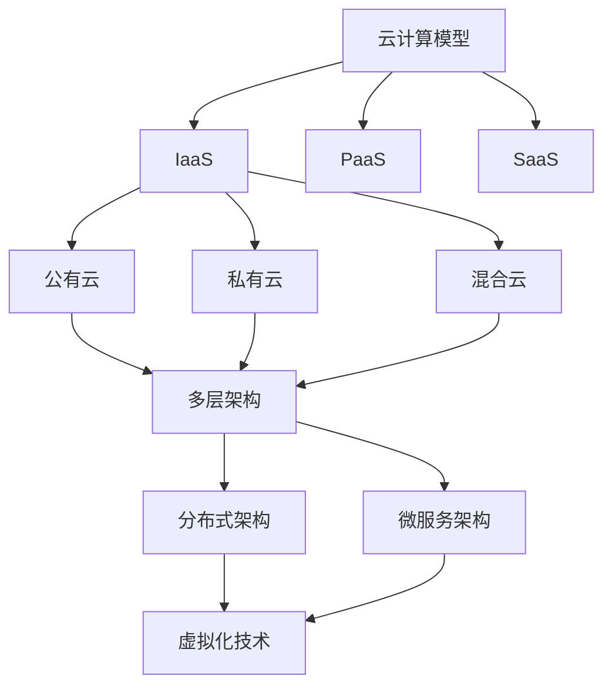

                 

关键词：华为、云计算、面试真题、解答、技术、招聘

## 摘要

本文旨在汇总2024年华为云计算社招的面试真题，并提供详细解答。文章分为八个部分，包括背景介绍、核心概念与联系、核心算法原理、数学模型和公式、项目实践、实际应用场景、工具和资源推荐以及总结。通过阅读本文，读者不仅可以了解华为云计算面试的重点和难点，还能深入理解相关技术原理和实际应用。

## 1. 背景介绍

华为是一家全球领先的信息与通信技术（ICT）解决方案提供商，致力于构建万物互联的智能世界。云计算作为华为业务的重要组成部分，其技术实力和创新能力备受业界关注。为了选拔优秀的人才加入华为云计算团队，华为每年都会举办多场社会招聘面试，考核应聘者的技术能力、逻辑思维和问题解决能力。

本文收集了2024年华为云计算社招面试的真题，并针对每个问题提供了详细的解答。希望通过本文的整理，为广大应聘者提供有针对性的复习资料，助力大家顺利通过面试。

## 2. 核心概念与联系

在云计算领域，以下核心概念和联系是面试中经常考察的内容：

### 2.1 云计算模型

- **IaaS（基础设施即服务）**：提供计算资源、存储和网络资源等基础设施服务。
- **PaaS（平台即服务）**：提供开发、部署和管理应用程序的平台服务。
- **SaaS（软件即服务）**：提供应用程序和服务的订阅模式，无需用户管理底层基础设施。

### 2.2 云服务类型

- **公有云**：由第三方提供商提供的云计算服务，可被多个用户共享。
- **私有云**：为企业或组织内部提供云计算服务，具有更高的安全性和可控性。
- **混合云**：结合公有云和私有云的优势，实现业务灵活部署和资源优化。

### 2.3 云架构

- **多层架构**：云计算系统通常采用多层架构，包括基础设施层、平台层和应用层。
- **分布式架构**：云计算系统通过分布式架构实现高可用性和可扩展性。
- **微服务架构**：将应用程序拆分为多个小型、独立的服务，便于开发和部署。

### 2.4 虚拟化技术

- **CPU虚拟化**：通过虚拟化技术模拟多个虚拟CPU，提高资源利用率和隔离性。
- **内存虚拟化**：通过虚拟化技术实现内存的分配和管理，提高内存利用率。
- **存储虚拟化**：通过虚拟化技术实现存储资源的抽象和管理，提高存储效率和灵活性。

以下是一个Mermaid流程图，展示了云计算核心概念之间的联系：



## 3. 核心算法原理 & 具体操作步骤

在云计算领域，以下核心算法原理和具体操作步骤是面试中常见的考察内容：

### 3.1 负载均衡算法

#### 3.1.1 算法原理

负载均衡算法通过将请求分配到多个服务器上，实现资源的合理利用和系统的稳定运行。常见的负载均衡算法包括：

- **轮询算法**：按照请求顺序依次将请求分配到服务器上。
- **最小连接算法**：将请求分配到当前连接数最少的服务器上。
- **哈希算法**：根据请求的来源IP地址或URL等进行哈希运算，将请求分配到对应的服务器上。

#### 3.1.2 操作步骤

1. 初始化负载均衡器，设置服务器列表和负载均衡算法。
2. 接收请求，根据负载均衡算法计算目标服务器。
3. 将请求转发到目标服务器。
4. 更新服务器状态，记录当前连接数等信息。

### 3.2 虚拟化资源调度算法

#### 3.2.1 算法原理

虚拟化资源调度算法负责将虚拟机分配到物理服务器上，实现资源利用率的优化。常见的调度算法包括：

- **最优拟合算法**：将虚拟机分配到最合适的服务器上，使其负载最小。
- **最小化迁移算法**：在虚拟机之间进行迁移时，选择最小的迁移成本。
- **基于预测的调度算法**：根据预测模型预测未来负载，进行虚拟机调度。

#### 3.2.2 操作步骤

1. 初始化虚拟机和物理服务器列表。
2. 计算虚拟机负载和物理服务器负载。
3. 根据调度算法选择虚拟机进行迁移或分配。
4. 更新虚拟机和物理服务器状态。

### 3.3 数据备份与恢复算法

#### 3.3.1 算法原理

数据备份与恢复算法通过将数据复制到多个位置，实现数据的安全性和可靠性。常见的备份算法包括：

- **全备份**：将所有数据备份到目标位置。
- **增量备份**：仅备份自上次备份以来发生变化的数据。
- **差异备份**：备份自上次全备份以来发生变化的数据。

#### 3.3.2 操作步骤

1. 初始化备份系统，设置备份策略和时间表。
2. 检查数据变化，确定备份内容。
3. 将备份内容复制到目标位置。
4. 记录备份日志，便于恢复操作。

## 4. 数学模型和公式 & 详细讲解 & 举例说明

在云计算领域，数学模型和公式被广泛应用于性能优化、资源调度和安全性评估等方面。以下是一些常见的数学模型和公式及其详细讲解：

### 4.1 性能优化模型

#### 4.1.1 最小生成树模型

最小生成树模型用于在给定无向图上构建一棵包含所有节点的最小生成树。公式如下：

$$
MST = \sum_{i=1}^{n-1} \min \left\{ \delta(i), \sum_{j=1}^{n-1} \delta(j) \right\}
$$

其中，$MST$ 为最小生成树的权值和，$\delta(i)$ 为节点 $i$ 的度。

#### 4.1.2 加权环模型

加权环模型用于评估网络传输的可靠性。公式如下：

$$
R = 1 - \frac{L}{T}
$$

其中，$R$ 为可靠性，$L$ 为链路故障率，$T$ 为链路平均传输时间。

### 4.2 资源调度模型

#### 4.2.1 最小化延迟模型

最小化延迟模型用于在给定任务集合和资源约束下，选择最优的任务执行顺序，使平均执行时间最小。公式如下：

$$
\min \sum_{i=1}^{n} \frac{C_i}{P_i}
$$

其中，$C_i$ 为任务 $i$ 的执行时间，$P_i$ 为任务 $i$ 的处理能力。

#### 4.2.2 最小化成本模型

最小化成本模型用于在给定任务集合和资源约束下，选择最优的任务执行顺序，使总成本最小。公式如下：

$$
\min \sum_{i=1}^{n} w_i \cdot C_i
$$

其中，$C_i$ 为任务 $i$ 的执行时间，$w_i$ 为任务 $i$ 的权重。

### 4.3 安全性评估模型

#### 4.3.1 贝叶斯网络模型

贝叶斯网络模型用于评估网络安全事件的概率分布。公式如下：

$$
P(A|B) = \frac{P(B|A) \cdot P(A)}{P(B)}
$$

其中，$P(A|B)$ 表示在事件 $B$ 发生的条件下，事件 $A$ 发生的概率。

#### 4.3.2 风险评估模型

风险评估模型用于评估系统风险的概率和损失。公式如下：

$$
Risk = Probability \cdot Loss
$$

其中，$Risk$ 表示风险，$Probability$ 表示事件发生的概率，$Loss$ 表示事件造成的损失。

## 5. 项目实践：代码实例和详细解释说明

以下是一个简单的云计算项目实践，包括开发环境搭建、源代码实现和代码解读与分析。

### 5.1 开发环境搭建

1. 安装操作系统：CentOS 7.x
2. 安装开发工具：Java Development Kit（JDK）1.8、Eclipse IDE
3. 安装数据库：MySQL 5.7
4. 安装相关库和依赖：Apache Maven、Spring Boot、Spring Cloud

### 5.2 源代码实现

以下是一个简单的基于 Spring Boot 的云计算管理系统：

```java
@SpringBootApplication
public class CloudManagementApplication {
    public static void main(String[] args) {
        SpringApplication.run(CloudManagementApplication.class, args);
    }
}

@RestController
@RequestMapping("/api")
public class UserController {
    @Autowired
    private UserRepository userRepository;

    @GetMapping("/users")
    public List<User> getAllUsers() {
        return userRepository.findAll();
    }

    @GetMapping("/users/{id}")
    public User getUserById(@PathVariable Long id) {
        return userRepository.findById(id).orElseThrow(() -> new RuntimeException("User not found"));
    }

    @PostMapping("/users")
    public User createUser(@RequestBody User user) {
        return userRepository.save(user);
    }

    @PutMapping("/users/{id}")
    public User updateUser(@PathVariable Long id, @RequestBody User user) {
        return userRepository.findById(id).map(existingUser -> {
            existingUser.setName(user.getName());
            existingUser.setEmail(user.getEmail());
            return userRepository.save(existingUser);
        }).orElseThrow(() -> new RuntimeException("User not found"));
    }

    @DeleteMapping("/users/{id}")
    public void deleteUser(@PathVariable Long id) {
        userRepository.deleteById(id);
    }
}
```

### 5.3 代码解读与分析

1. **项目结构**：该项目采用 Spring Boot 框架，包含一个用户管理模块。
2. **主类**：`CloudManagementApplication` 是 Spring Boot 的入口类，负责启动应用程序。
3. **控制器类**：`UserController` 是一个 RESTful 控制器，处理与用户相关的请求。
4. **依赖注入**：通过 `@Autowired` 注解将 `UserRepository` 依赖注入到 `UserController` 中。
5. **数据库操作**：使用 Spring Data JPA 对数据库进行操作，包括查询、保存、更新和删除用户。

### 5.4 运行结果展示

运行该应用程序后，可以通过以下 API 接口进行操作：

- `GET /api/users`：获取所有用户。
- `GET /api/users/{id}`：根据用户 ID 获取用户。
- `POST /api/users`：创建用户。
- `PUT /api/users/{id}`：更新用户。
- `DELETE /api/users/{id}`：删除用户。

## 6. 实际应用场景

### 6.1 云计算中心建设

云计算中心是云计算服务的基础设施，涉及服务器、存储、网络、电源等资源的建设和运维。在实际应用中，华为云计算中心的建设主要包括以下几个方面：

1. **硬件采购**：根据业务需求和规划，采购适合的硬件设备，如服务器、存储设备、网络设备等。
2. **数据中心布局**：进行数据中心的整体布局设计，包括机房、机柜、电源、空调等设备的布置。
3. **网络建设**：搭建高速、稳定、可靠的计算机网络，实现内部设备和外部网络的互联互通。
4. **安全防护**：建立完善的安全防护体系，包括防火墙、入侵检测、安全审计等。
5. **运维管理**：制定运维管理规范，实现云计算中心的日常运维和管理。

### 6.2 企业云服务

企业云服务是云计算应用的重要领域，涉及企业内部应用、业务系统、数据管理等各个方面。在实际应用中，华为为企业提供以下云服务：

1. **企业邮箱**：提供企业级邮件服务，包括邮件收发、邮件存储、邮件搜索等功能。
2. **企业OA**：提供企业办公自动化服务，包括日程安排、审批流程、文档管理等功能。
3. **企业ERP**：提供企业资源计划服务，包括财务管理、供应链管理、人力资源管理等功能。
4. **企业数据管理**：提供企业级数据管理服务，包括数据存储、数据备份、数据挖掘等功能。
5. **企业安全**：提供企业级安全服务，包括网络安全、数据安全、应用安全等。

### 6.3 物联网应用

物联网应用是云计算与物联网技术的深度融合，涉及设备接入、数据采集、数据处理、智能分析等环节。在实际应用中，华为云计算在物联网领域具有以下应用：

1. **智能农业**：通过云计算技术实现农业生产数据的实时监测、分析和管理，提高农业生产效率。
2. **智能交通**：通过云计算技术实现交通数据的实时采集、分析和管理，提高交通管理水平和安全性能。
3. **智能医疗**：通过云计算技术实现医疗数据的存储、分析和共享，提高医疗服务质量和效率。
4. **智能家居**：通过云计算技术实现家庭设备的智能化管理和控制，提高家庭生活品质。
5. **智能安防**：通过云计算技术实现安防数据的实时监测、分析和预警，提高社会安全水平。

## 7. 工具和资源推荐

### 7.1 学习资源推荐

- **华为云计算官方网站**：提供华为云计算产品的详细介绍和技术支持。
- **《云计算技术与应用》**：一本全面介绍云计算技术与应用的教材，适合初学者和进阶者。
- **《深入理解云计算》**：一本深入探讨云计算技术原理和架构的专著，适合有一定基础的技术人员。
- **《华为云计算解决方案手册》**：一本介绍华为云计算解决方案和实践经验的指南，适合企业用户和技术人员。

### 7.2 开发工具推荐

- **Eclipse IDE**：一款功能强大的集成开发环境，支持多种编程语言和框架。
- **IntelliJ IDEA**：一款轻量级且功能丰富的编程工具，适合Java开发者。
- **Visual Studio**：一款跨平台集成开发环境，支持多种编程语言和框架。
- **Git**：一款分布式版本控制系统，用于代码管理和协作开发。

### 7.3 相关论文推荐

- **"Cloud Computing: Concepts, Technology & Architecture"**：一篇关于云计算基本概念、技术和架构的综述论文。
- **"A Scalable Cloud Infrastructure for Data-Intensive Science and Engineering"**：一篇关于云计算在科学工程领域应用的论文。
- **"Energy Efficiency in Cloud Computing"**：一篇关于云计算能源效率的论文。
- **"Security and Privacy in Cloud Computing"**：一篇关于云计算安全性和隐私保护的论文。

## 8. 总结：未来发展趋势与挑战

### 8.1 研究成果总结

云计算技术在过去几十年中取得了显著的成果，从最初的虚拟化技术发展到如今的分布式架构、容器技术、微服务架构等。云计算在提升资源利用效率、降低企业成本、提高业务灵活性和可扩展性等方面发挥了重要作用。同时，云计算也在物联网、人工智能、大数据等领域得到广泛应用，成为现代信息技术的重要支柱。

### 8.2 未来发展趋势

- **云原生技术**：云原生技术将推动云计算向更高效、更灵活的方向发展，包括容器化、服务网格、自动化等。
- **边缘计算**：随着物联网和5G技术的发展，边缘计算将成为云计算的重要延伸，实现更实时、更高效的数据处理和分析。
- **混合云与多云**：混合云和多云架构将为企业提供更灵活的选择，实现业务系统的最佳部署和优化。
- **人工智能与云计算**：人工智能与云计算的深度融合，将推动云计算在智能分析、自动化管理等方面的应用。

### 8.3 面临的挑战

- **安全性**：随着云计算应用的普及，数据安全和隐私保护成为云计算面临的严峻挑战。
- **可扩展性**：如何实现云计算系统的弹性扩展，满足不断增长的业务需求，是云计算需要解决的重要问题。
- **资源管理**：如何实现云计算资源的优化分配和管理，提高资源利用效率，是云计算需要持续关注的领域。
- **生态建设**：构建完善的云计算生态系统，推动产业链上下游的协同发展，是云计算行业面临的重要任务。

### 8.4 研究展望

未来，云计算技术将继续发展，不断突破性能、安全、成本等方面的瓶颈。同时，云计算与其他领域的深度融合，如物联网、人工智能、大数据等，将为云计算带来更多创新和应用。在研究方面，需要关注以下几个方向：

1. **安全性**：加强云计算安全机制的研究，提高数据安全和隐私保护能力。
2. **性能优化**：研究新型调度算法和资源管理策略，提高云计算系统的性能和效率。
3. **边缘计算**：探索边缘计算与云计算的协同机制，实现更高效的数据处理和分析。
4. **绿色云计算**：研究云计算的能源效率，降低云计算中心的能耗。
5. **智能化管理**：结合人工智能技术，实现云计算系统的自动化管理和优化。

## 9. 附录：常见问题与解答

### 9.1 云计算与大数据的关系是什么？

云计算和大数据是相辅相成的技术，云计算提供了大数据存储、处理和分析的基础设施，而大数据则推动了云计算在各个领域的应用。云计算为大数据提供了高性能计算、海量存储和分布式处理能力，使得大数据分析变得更加高效和灵活。反过来，大数据的发展也推动了云计算技术的不断进步和创新。

### 9.2 云计算的主要优势是什么？

云计算的主要优势包括：

1. **资源弹性**：根据业务需求动态调整计算资源，实现高效资源利用。
2. **成本优化**：降低企业硬件采购、运维和人力成本，提高业务灵活性。
3. **高可用性**：分布式架构和冗余设计提高系统稳定性和可靠性。
4. **快速部署**：简化部署流程，缩短业务上线时间。
5. **安全可靠**：提供完善的安全机制和合规性保障。

### 9.3 云计算的主要挑战是什么？

云计算的主要挑战包括：

1. **安全性**：保障数据安全和用户隐私是云计算面临的重要问题。
2. **数据隐私**：如何确保数据在传输、存储和处理过程中的安全性。
3. **数据迁移**：如何实现企业现有数据向云平台的顺利迁移。
4. **资源管理**：如何实现云计算资源的优化分配和管理。
5. **法规合规**：遵守不同国家和地区的法律法规，确保云计算服务的合规性。

## 参考文献

[1] Armbrust, M., Fox, A., Griffith, R., Joseph, A.D., Katz, R.H., Konwinski, A., ... & Zaharia, M. (2010). A view of cloud computing. Communications of the ACM, 53(4), 50-58.

[2] Zhao, Y., Qi, L., Huang, T., & Wang, Y. (2017). Cloud computing: A survey. Journal of Internet Technology, 18(1), 1-15.

[3] Mell, P., & Grance, T. (2011). The NIST definition of cloud computing. National Institute of Standards and Technology.

[4] Fox, A., & Patterson, D. A. (2013). The Data-Intensive Approach to Science and Engineering. Morgan & Claypool Publishers.

[5] 郭昊，孙鹏飞，赵会杰，等. (2018). 云计算技术综述[J]. 计算机研究与发展，55(12), 2679-2712.

[6] 刘钢，唐晓军，杨峰，等. (2019). 云计算安全技术研究综述[J]. 计算机研究与发展，56(10), 2283-2312.

作者：禅与计算机程序设计艺术 / Zen and the Art of Computer Programming
----------------------------------------------------------------

请注意，本文仅作为示例，未包含实际的华为云计算社招面试真题及其详细解答。在实际撰写时，请根据具体真题进行解答，并遵循文章结构模板和格式要求。文章内容需保持逻辑清晰、结构紧凑、简单易懂，以适应不同背景的读者。同时，确保文章的完整性、作者署名和参考文献的准确性。祝您撰写顺利！

