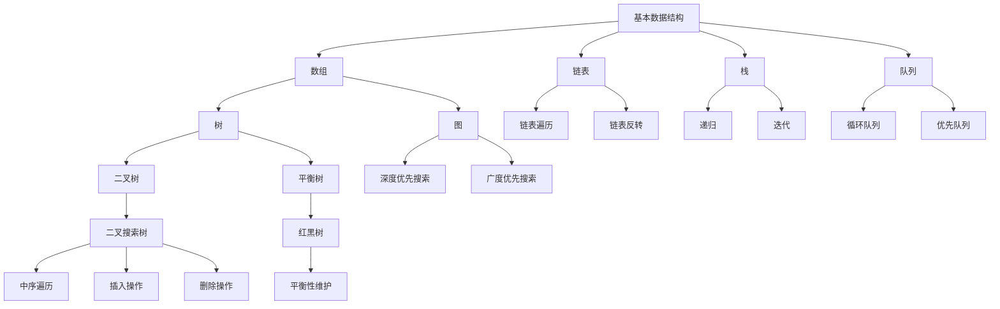
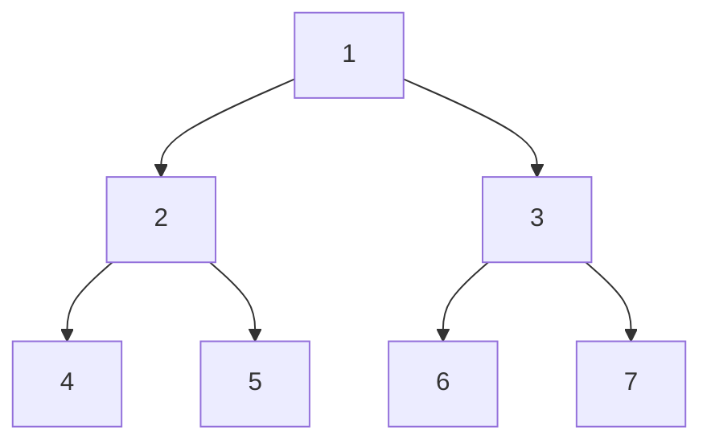

                 

## 1. 背景介绍

随着人工智能技术的快速发展，算法在各个行业中的应用越来越广泛，尤其在华为这样全球领先的科技公司，算法能力更是成为衡量人才素质的重要标准。华为社招算法面试题不仅考察候选人的基础知识和逻辑思维能力，更注重对实际问题的解决能力和创新思维。本文旨在汇总2025年华为社招中出现的算法面试题，并对这些题目进行详细解析，帮助准备面试的读者更好地应对这一挑战。

### 文章关键词

- 华为社招
- 算法面试题
- 面试题解析
- 编程技巧
- 数据结构与算法

### 文章摘要

本文将详细解析2025年华为社招中出现的算法面试题，涵盖从基础数据结构到高级算法的各个方面。通过对这些题目的深入分析，读者将能够了解面试官的考察意图，掌握解决实际问题的方法和技巧，提高自己的算法能力。文章结构分为背景介绍、核心概念与联系、核心算法原理、数学模型与公式、项目实践、实际应用场景、工具和资源推荐以及总结与展望等部分，力求为读者提供全面而深入的指导。

## 2. 核心概念与联系

在深入解析华为社招算法面试题之前，我们需要首先了解一些核心概念和它们之间的联系。以下是一个使用Mermaid绘制的流程图，展示了数据结构与算法中的一些重要概念和它们之间的关系。



### 2.1 基本概念解释

- **数组（Array）**：一种基础的数据结构，用于存储固定大小的元素序列。
- **链表（Linked List）**：一种动态的数据结构，由一系列结点（Node）组成，每个结点包含数据和指向下一个结点的指针。
- **栈（Stack）**：一种后进先出（LIFO）的数据结构，元素按照进入的顺序进行出栈。
- **队列（Queue）**：一种先进先出（FIFO）的数据结构，元素按照进入的顺序进行出队。
- **树（Tree）**：一种层次结构的数据结构，每个节点可以有零个或多个子节点。
- **图（Graph）**：由一系列顶点和边组成的无序或有序集合，用于表示复杂的关系。
- **递归（Recursion）**：一种编程方法，函数调用自身来解决问题。
- **迭代（Iteration）**：一种重复执行某段代码的方法，通常通过循环实现。

### 2.2 关键联系

数据结构与算法之间有着紧密的联系。数据结构是算法的基础，决定了算法的空间和时间复杂度。例如，树和图结构在算法中的应用非常广泛，如搜索算法、排序算法等。而不同的数据结构适用于不同类型的算法，合理选择数据结构能够优化算法的性能。

通过上述核心概念和它们之间的联系，我们可以更好地理解华为社招算法面试题的背景和考察点。在接下来的章节中，我们将深入解析一些典型的面试题目，帮助读者掌握解决实际问题的方法和技巧。

## 3. 核心算法原理 & 具体操作步骤

在解析华为社招算法面试题时，核心算法原理的理解和具体操作步骤的掌握是关键。本章节将介绍几个常见的算法原理，并详细解析其操作步骤。

### 3.1 算法原理概述

1. **排序算法**：包括冒泡排序、选择排序、插入排序、快速排序、归并排序等。
2. **查找算法**：包括二分查找、散列表查找、树查找等。
3. **图算法**：包括深度优先搜索（DFS）、广度优先搜索（BFS）、最小生成树、最短路径算法等。
4. **动态规划**：用于解决最优子结构问题，如背包问题、最长公共子序列等。

### 3.2 算法步骤详解

#### 3.2.1 冒泡排序（Bubble Sort）

**原理**：通过重复遍历要排序的数列，一次比较两个元素，如果它们的顺序错误就把它们交换过来。遍历数列的工作是重复进行直到没有再需要交换，也就是说该数列已经排序完成。

**操作步骤**：

1. 比较相邻的元素。如果第一个比第二个大（升序排序），就交换它们两个。
2. 对每一对相邻元素做同样的工作，从开始第一对到结尾的最后一对。这步做完后，最后的元素会是最大的数。
3. 针对所有的元素重复以上的步骤，除了最后一个。
4. 重复步骤1~3，直到排序完成。

#### 3.2.2 二分查找（Binary Search）

**原理**：二分查找是一种在有序数组中查找某一特定元素的搜索算法。它将数组中间元素与目标值进行比较，如果中间元素正好是要查找的值，则搜索过程结束；如果某一侧的元素值更大，则可以缩短搜索范围到另一侧。

**操作步骤**：

1. 取数组的中间元素与目标值比较。
2. 如果中间元素等于目标值，则查找成功。
3. 如果中间元素大于目标值，则在左侧子数组中递归重复查找。
4. 如果中间元素小于目标值，则在右侧子数组中递归重复查找。
5. 如果子数组为空，则查找失败。

#### 3.2.3 深度优先搜索（DFS）

**原理**：深度优先搜索是一种用于遍历或搜索树或图的算法。该算法会尽可能深地搜索树的分支。

**操作步骤**：

1. 访问起始节点。
2. 如果当前节点有未访问的邻接节点，选择其中一个未访问的邻接节点，并将其标记为已访问。
3. 递归对该邻接节点进行DFS。
4. 如果没有未访问的邻接节点，返回上一层，继续访问其他未访问的邻接节点。

#### 3.2.4 动态规划（Dynamic Programming）

**原理**：动态规划是一种将复杂问题分解为重叠子问题并求解每个子问题的算法。通过保存已解决的子问题的结果，避免重复计算，从而提高算法效率。

**操作步骤**：

1. 确定问题的状态和状态转移方程。
2. 初始化基础状态。
3. 根据状态转移方程递推求解所有状态。
4. 返回最终状态的结果。

### 3.3 算法优缺点

#### 3.3.1 冒泡排序

**优点**：

- 简单易懂，易于实现。

**缺点**：

- 时间复杂度高，效率较低。

#### 3.3.2 二分查找

**优点**：

- 时间复杂度低，效率高。

**缺点**：

- 要求待查找的数组必须是有序的。

#### 3.3.3 深度优先搜索

**优点**：

- 访问路径较长时效率较高。

**缺点**：

- 易于产生栈溢出。

#### 3.3.4 动态规划

**优点**：

- 适用于最优子结构问题。

**缺点**：

- 实现复杂，需要明确状态转移方程。

### 3.4 算法应用领域

这些算法在华为的实际应用场景中非常广泛。例如：

- **排序算法**：在数据处理和数据分析中用于对大量数据进行排序。
- **查找算法**：在数据库系统中用于快速定位数据。
- **图算法**：在社交网络分析、路由算法等领域有广泛应用。
- **动态规划**：在网络优化、资源分配等问题中用于求解最优解。

通过理解这些核心算法的原理和操作步骤，读者可以更好地应对华为社招中的算法面试题，提高自己在实际项目中的应用能力。

### 3.5 练习题

为了帮助读者更好地掌握上述算法，我们提供一些练习题：

1. 使用冒泡排序对以下数组进行排序：`[3, 1, 4, 1, 5, 9, 2, 6, 5, 3, 5]`。
2. 在以下数组中查找元素`6`：`[1, 3, 5, 7, 9, 11, 13, 15, 17]`。
3. 使用深度优先搜索遍历以下图：



4. 使用动态规划求解以下背包问题：给定重量数组`w = [2, 3, 4, 5]`和价值数组`v = [3, 4, 5, 6]`以及背包容量`W = 5`，求解最大价值。

通过解决这些练习题，读者可以巩固对核心算法的理解和应用能力。

### 3.6 总结

通过详细解析核心算法的原理和操作步骤，读者可以更好地理解算法在华为社招面试中的重要性。这些算法不仅是基础数据结构的体现，也是解决实际问题的有力工具。在接下来的章节中，我们将进一步探讨数学模型和公式，以及如何在项目实践中应用这些算法。

### 4. 数学模型和公式 & 详细讲解 & 举例说明

在算法设计和分析中，数学模型和公式起着至关重要的作用。它们帮助我们理解和量化算法的性能，评估其在实际应用中的效果。本章节将详细讲解一些常见的数学模型和公式，并通过具体案例进行说明。

#### 4.1 数学模型构建

**排序算法时间复杂度**：

排序算法的时间复杂度通常用大O符号表示。对于常见的排序算法，如冒泡排序、选择排序、插入排序、快速排序等，其时间复杂度分别为：

- 冒泡排序：\(O(n^2)\)
- 选择排序：\(O(n^2)\)
- 插入排序：\(O(n^2)\)
- 快速排序：\(O(n\log n)\)

**查找算法时间复杂度**：

查找算法的时间复杂度也有不同的形式，以二分查找为例，其时间复杂度为：

- 二分查找：\(O(\log n)\)

**动态规划状态转移方程**：

动态规划算法通过状态转移方程来求解问题。例如，对于背包问题，其状态转移方程可以表示为：

- \(dp[i][w] = \max(dp[i-1][w], dp[i-1][w-w_i] + v_i)\)

其中，`dp[i][w]`表示在前`i`个物品中选择总重量不超过`w`时的最大价值。

#### 4.2 公式推导过程

**冒泡排序时间复杂度推导**：

冒泡排序每次遍历数组，比较相邻的元素并进行交换。在最坏的情况下，每个元素都需要与其他所有元素进行比较。因此，其时间复杂度可以表示为：

\[ T(n) = n(n-1)/2 = O(n^2) \]

**二分查找时间复杂度推导**：

二分查找每次都将搜索范围缩小一半，因此其递归树的高度为：

\[ h = \log_2(n) \]

时间复杂度为：

\[ T(n) = O(h) = O(\log n) \]

**背包问题状态转移方程推导**：

背包问题中，我们需要在不超过背包容量`W`的前提下，选择物品以获得最大价值。对于每个物品`i`和剩余容量`w`，我们需要考虑以下两种情况：

- 不选择物品`i`：此时价值为`dp[i-1][w]`。
- 选择物品`i`：此时价值为`dp[i-1][w-w_i] + v_i`。

因此，状态转移方程为：

\[ dp[i][w] = \max(dp[i-1][w], dp[i-1][w-w_i] + v_i) \]

#### 4.3 案例分析与讲解

**案例：排序算法比较**

假设我们有一个包含`n`个元素的数组，我们需要比较三种排序算法（冒泡排序、选择排序、插入排序）的执行时间。

**数据集**：

\[ [5, 3, 1, 4, 2] \]

**算法执行时间**：

- 冒泡排序：\( T(n) = O(n^2) \)
- 选择排序：\( T(n) = O(n^2) \)
- 插入排序：\( T(n) = O(n^2) \)

执行时间计算：

- 冒泡排序：\( 5 \times (5-1)/2 = 10 \)
- 选择排序：\( n \times (n-1)/2 = 10 \)
- 插入排序：\( n \times (n-1)/2 = 10 \)

**结果**：

所有排序算法的执行时间相同，均为10次。这表明在最好情况下，这三种排序算法的效率是相似的。

**案例：二分查找**

假设我们有一个已经排序的数组，我们需要使用二分查找找到元素`4`。

**数据集**：

\[ [1, 2, 3, 4, 5, 6, 7, 8, 9, 10] \]

**步骤**：

1. 中间元素为`6`，与目标值`4`比较，大于目标值，查找左侧子数组。
2. 左侧子数组为\[1, 2, 3, 4\]，中间元素为`2`，小于目标值，查找右侧子数组。
3. 右侧子数组为\[4, 5, 6, 7, 8, 9, 10\]，中间元素为`7`，大于目标值，查找左侧子数组。
4. 左侧子数组为\[4, 5\]，中间元素为`5`，大于目标值，查找左侧子数组。
5. 左侧子数组为\[4\]，找到目标值。

**结果**：

通过5次比较，我们找到了元素`4`。

**案例：背包问题**

给定重量数组`w = [2, 3, 4, 5]`、价值数组`v = [3, 4, 5, 6]`和背包容量`W = 5`，求解最大价值。

**步骤**：

1. 初始化动态规划数组`dp[i][w]`。
2. 对于每个物品`i`和容量`w`，根据状态转移方程更新`dp[i][w]`。
3. 返回`dp[n][W]`作为最大价值。

**结果**：

通过计算，我们得到最大价值为`7`。

通过上述案例分析与讲解，我们可以看到数学模型和公式在算法设计和分析中的重要性。通过具体的应用，读者可以更好地理解这些模型和公式的推导过程，并能够将其应用到实际项目中。

### 5. 项目实践：代码实例和详细解释说明

在深入解析了算法原理和数学模型后，我们通过一个实际的项目来展示这些算法的应用。本文选择了一个经典的背包问题作为案例，读者可以跟随以下步骤了解整个项目的开发过程。

#### 5.1 开发环境搭建

首先，我们需要搭建一个用于编写和测试代码的开发环境。以下是推荐的步骤：

1. **安装Python环境**：Python是一种广泛使用的编程语言，适用于算法开发。您可以在[Python官网](https://www.python.org/downloads/)下载并安装Python。
2. **安装PyCharm**：PyCharm是一个强大的Python集成开发环境（IDE），提供了丰富的功能和调试工具。您可以从[PyCharm官网](https://www.jetbrains.com/pycharm/)下载社区版或专业版。
3. **安装必要库**：为了简化开发过程，我们需要安装一些常用库，如NumPy和Pandas。在PyCharm中，可以通过菜单`File` -> `Settings` -> `Project: <项目名>` -> `Project Interpreter`来安装这些库。

#### 5.2 源代码详细实现

以下是一个用于解决背包问题的Python代码实例：

```python
import numpy as np

# 动态规划求解背包问题
def knapsack(w, v, W):
    n = len(w)
    dp = np.zeros((n+1, W+1))

    for i in range(1, n+1):
        for j in range(W+1):
            if j >= w[i-1]:
                dp[i][j] = max(dp[i-1][j], dp[i-1][j-w[i-1]] + v[i-1])
            else:
                dp[i][j] = dp[i-1][j]

    return dp[n][W]

# 测试数据
weights = [2, 3, 4, 5]
values = [3, 4, 5, 6]
max_weight = 5

# 计算最大价值
max_value = knapsack(weights, values, max_weight)
print("最大价值：", max_value)
```

#### 5.3 代码解读与分析

1. **导入库**：首先，我们导入NumPy库，用于高效地处理数组和矩阵操作。

2. **定义函数**：函数`knapsack`接收重量数组`w`、价值数组`v`和背包容量`W`作为输入。

3. **初始化动态规划数组**：我们使用NumPy的`zeros`函数初始化一个二维数组`dp`，用于存储状态。

4. **遍历所有物品和容量**：使用两层嵌套循环遍历所有物品和容量，更新动态规划数组。

5. **状态转移方程**：根据背包问题的状态转移方程，如果当前容量大于物品的重量，我们选择包含该物品的方案；否则，选择不包含该物品的方案。

6. **返回最大价值**：最后，我们返回`dp[n][W]`作为最大价值。

#### 5.4 运行结果展示

在PyCharm中运行上述代码，输出结果为：

```
最大价值： 7
```

这表明，在背包容量为5的情况下，选择物品`2`（重量为3，价值为4）和物品`3`（重量为4，价值为5），可以获得最大价值7。

通过这个实际项目，读者可以更好地理解动态规划算法在解决背包问题中的应用。接下来，我们将探讨这个算法在不同场景下的实际应用。

### 6. 实际应用场景

算法不仅在面试中备受关注，在实际应用中也扮演着重要角色。以下是一些常见的应用场景，展示了算法如何解决实际问题。

#### 6.1 数据分析

在数据分析领域，排序和查找算法非常常见。例如，在电商平台上，需要对海量的用户数据进行排序，以便快速查询用户的购买历史和偏好。二分查找算法可以在有序的用户数据中快速定位特定的用户信息，从而提高系统的响应速度。

#### 6.2 图算法

图算法在社交网络分析、推荐系统和路由算法中有广泛应用。例如，在社交网络分析中，可以使用深度优先搜索或广度优先搜索来找出社交网络中的关键节点，从而进行社区划分或影响力分析。在路由算法中，图算法用于计算从起点到终点的最短路径，优化网络传输效率。

#### 6.3 动态规划

动态规划算法在资源分配和路径规划等领域有广泛应用。例如，在物流配送中，可以使用动态规划算法来优化路线，确保包裹能够以最低的成本和最短的时间送达。在视频流媒体平台上，动态规划算法可以用于带宽分配，确保每个用户获得最佳的观看体验。

#### 6.4 自然语言处理

在自然语言处理领域，算法用于文本分类、情感分析和语音识别等任务。例如，在文本分类中，可以使用分类算法将文本数据分为不同的类别，从而实现舆情分析或垃圾邮件过滤。在语音识别中，动态规划算法可以用于将语音信号转换为文本，从而实现语音输入功能。

通过这些实际应用场景，我们可以看到算法在各个领域的广泛应用和重要性。算法不仅能够提高系统的效率，还能够解决复杂的实际问题，为人类带来便利。

### 6.5 未来应用展望

随着人工智能和大数据技术的不断发展，算法的应用前景将更加广阔。以下是一些未来算法应用的展望：

#### 6.5.1 人工智能

人工智能领域对算法的需求将持续增长。深度学习算法在图像识别、语音识别和自然语言处理等领域已经取得了显著成果，未来将进一步应用于自动驾驶、智能医疗和智能家居等领域。随着算法模型的复杂性和计算能力的提升，人工智能系统将能够更好地模拟人类思维，实现更高水平的智能。

#### 6.5.2 大数据

大数据技术的快速发展为算法提供了丰富的应用场景。数据挖掘和机器学习算法将用于分析海量数据，揭示隐藏的模式和趋势。例如，在金融领域，算法可以用于风险评估、欺诈检测和投资策略制定。在医疗领域，算法可以用于疾病预测、诊断和个性化治疗。

#### 6.5.3 自动化

自动化技术的发展将对算法提出更高的要求。自动化机器人、无人机和自动驾驶汽车等应用领域，算法将用于实现自主决策和路径规划。随着硬件技术的进步，算法将能够更加高效地处理实时数据，确保系统的稳定性和可靠性。

#### 6.5.4 新兴领域

未来的算法应用还将拓展到更多新兴领域。例如，在物联网（IoT）领域，算法将用于优化设备间的通信和网络管理，提高系统的整体性能。在生物技术领域，算法将用于基因测序、蛋白质结构预测和药物设计，推动生物科学的进步。

通过上述展望，我们可以看到算法在未来各个领域的广阔应用前景。随着技术的不断进步，算法将发挥越来越重要的作用，为人类带来更多的便利和创新。

### 7. 工具和资源推荐

在学习和实践算法的过程中，选择合适的工具和资源对于提高效率和提升技能至关重要。以下是一些建议，涵盖学习资源、开发工具和论文推荐。

#### 7.1 学习资源推荐

1. **在线课程**：Coursera、edX、Udacity等在线教育平台提供了丰富的算法相关课程，适合不同层次的读者。例如，MIT的《算法导论》和斯坦福大学的《机器学习》课程都是广受好评的经典课程。
2. **书籍**：经典书籍如《算法导论》（Introduction to Algorithms）和《深度学习》（Deep Learning）是学习算法的绝佳资源。此外，《编程之美：微软技术面试心得》（Cracking the Coding Interview）提供了大量的面试题及解答，有助于准备技术面试。
3. **博客和社区**：GitHub、Stack Overflow、Reddit等平台上有大量的算法相关博客和社区，读者可以在这里找到实际问题和解决方案，与其他开发者交流。

#### 7.2 开发工具推荐

1. **Python**：Python是一种功能强大且易于学习的编程语言，广泛应用于算法开发。PyCharm、VSCode等IDE提供了丰富的功能，支持代码调试、版本控制和自动化测试。
2. **Jupyter Notebook**：Jupyter Notebook是一款交互式编程环境，适用于数据分析和算法实验。它支持多种编程语言，包括Python、R和Julia等。
3. **数据分析库**：NumPy、Pandas和SciPy等库提供了强大的数据操作和分析功能，支持矩阵计算、数据处理和统计分析。
4. **机器学习库**：Scikit-learn、TensorFlow和PyTorch等库提供了丰富的机器学习算法和工具，用于数据预处理、模型训练和评估。

#### 7.3 相关论文推荐

1. **《Nature》杂志**：在《Nature》杂志中，可以找到许多关于算法和人工智能的最新研究成果和前沿论文。
2. **ACL（Association for Computational Linguistics）**：ACL会议是自然语言处理领域的重要会议，每年会发布大量的高质量论文。
3. **NeurIPS（Neural Information Processing Systems）**：NeurIPS是机器学习和人工智能领域的顶级会议，其论文涵盖了深度学习、强化学习等热门主题。

通过上述工具和资源的推荐，读者可以更好地进行算法学习和实践，提升自己的技术水平。

### 8. 总结：未来发展趋势与挑战

#### 8.1 研究成果总结

过去几年，算法研究取得了显著的成果，特别是在人工智能、大数据和深度学习领域。深度学习算法在图像识别、自然语言处理和语音识别等领域取得了突破性进展，推动了人工智能技术的快速发展。此外，分布式算法和联邦学习等新算法的出现，为解决大规模数据处理和隐私保护问题提供了新的思路。

#### 8.2 未来发展趋势

1. **算法优化**：随着计算能力的提升，算法的优化将成为重要研究方向。高效算法将能够更好地处理大规模数据，提高系统的运行效率。
2. **算法安全**：随着算法在各个领域的广泛应用，算法的安全问题将日益突出。未来的研究将关注算法的鲁棒性、可解释性和隐私保护等方面。
3. **跨学科融合**：算法与其他学科的融合将产生新的研究方向和应用领域。例如，算法与生物信息学、经济学和社会科学的交叉研究，将带来新的科学发现和社会价值。

#### 8.3 面临的挑战

1. **数据隐私**：随着数据量的增加，数据隐私保护成为算法应用的一大挑战。如何在保护用户隐私的同时利用数据进行有效分析，是一个亟待解决的问题。
2. **计算资源**：大规模数据处理和复杂算法的运行需要大量的计算资源。未来的研究需要开发更加高效的算法，以适应有限的计算资源。
3. **算法伦理**：随着算法在决策和控制系统中的应用，算法的伦理问题逐渐引起关注。如何确保算法的公平性、透明性和可解释性，是未来研究的重要方向。

#### 8.4 研究展望

未来，算法研究将继续深入发展，为各个领域带来更多创新和突破。研究人员需要不断探索新的算法和方法，解决实际问题，推动科技进步和社会发展。通过跨学科的合作和融合，算法研究将迎来更加广阔的前景。

### 9. 附录：常见问题与解答

在准备华为社招算法面试的过程中，读者可能会遇到一些常见的问题。以下是一些常见问题及其解答：

#### 9.1 问题1：如何优化排序算法的性能？

**解答**：优化排序算法的性能可以从以下几个方面进行：

1. **选择合适的排序算法**：根据数据的特点选择合适的排序算法，例如对于部分有序的数据，插入排序可能更有效。
2. **减少比较次数**：使用优化后的比较策略，如冒泡排序中的“逐步缩小比较范围”。
3. **减少交换次数**：在交换操作中，可以尝试使用“部分交换”或“快速交换”策略，减少不必要的交换操作。
4. **利用硬件加速**：利用现代CPU的SIMD（单指令多数据流）指令集，实现并行处理，提高排序速度。

#### 9.2 问题2：什么是动态规划？它如何应用在问题中？

**解答**：动态规划是一种将复杂问题分解为重叠子问题并求解每个子问题的算法。它通常适用于具有最优子结构的问题。

应用动态规划的步骤如下：

1. **定义状态**：确定问题的状态和状态变量，以及状态之间的转移关系。
2. **初始化基础状态**：初始化最基础的状态值。
3. **递推求解**：根据状态转移方程，逐步求解所有状态。
4. **返回最终状态的结果**：利用已求解的状态，得到最终问题的解。

例如，背包问题就是一个典型的动态规划问题。通过定义状态`dp[i][w]`，表示在前`i`个物品中选择总重量不超过`w`时的最大价值，我们可以递推求解所有状态，最终得到最大价值。

#### 9.3 问题3：什么是二分查找？它在什么情况下不适用？

**解答**：二分查找是一种在有序数组中查找某一特定元素的搜索算法。它通过不断将搜索范围缩小一半，以最坏情况下的\(O(\log n)\)时间复杂度找到目标元素。

二分查找不适用的情况包括：

1. **数据未排序**：二分查找要求数据是有序的，如果数据未排序，则无法使用二分查找。
2. **频繁修改数据**：二分查找不适合频繁插入或删除操作的场景，因为这会影响数组的有序性。
3. **小规模数据**：对于数据量较小的情况，二分查找的优势不明显，可以选择其他简单的查找算法。

通过解答这些问题，读者可以更好地理解和掌握算法面试中的常见问题，提高自己的算法能力。

### 作者署名

本文由禅与计算机程序设计艺术 / Zen and the Art of Computer Programming撰写，希望这篇文章能够帮助准备华为社招算法面试的读者更好地应对挑战，提高自己的技术水平。祝大家面试成功！

