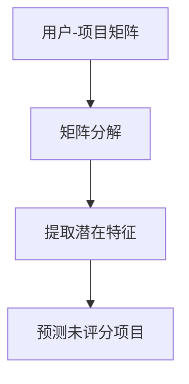
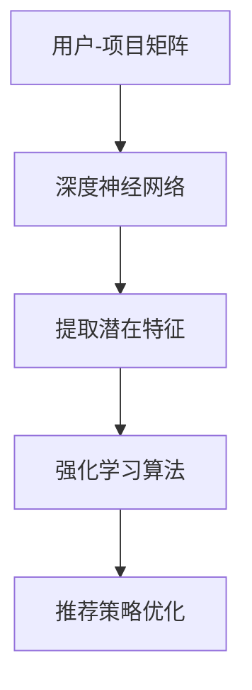

                 

关键词：协同过滤、推荐系统、机器学习、深度学习、强化学习、模型融合、数据预处理、用户行为分析、个性化推荐

> 摘要：本文将探讨协同过滤算法在推荐系统中的应用及其与其他 AI 技术的融合，通过技术整合与创新，提升推荐效果。本文将详细解析协同过滤算法的工作原理，比较其优缺点，介绍与深度学习、强化学习等技术的结合方式，探讨数学模型和公式，并给出实际应用案例和未来展望。

## 1. 背景介绍

### 推荐系统概述
推荐系统是一种信息过滤技术，旨在为用户推荐他们可能感兴趣的项目或内容。推荐系统广泛应用于电子商务、社交媒体、新闻资讯、视频流媒体等领域。协同过滤算法是推荐系统中的一种常见方法，其通过分析用户之间的相似性来进行推荐。

### 协同过滤算法简介
协同过滤算法基于用户行为数据，通过计算用户之间的相似性来预测用户未评分的项目。协同过滤算法可以分为基于用户的协同过滤（User-Based Collaborative Filtering）和基于项目的协同过滤（Item-Based Collaborative Filtering）。前者通过寻找与目标用户相似的其他用户，然后推荐这些用户喜欢的项目；后者则是通过计算项目之间的相似性，为用户推荐相似的项目。

## 2. 核心概念与联系

### 协同过滤算法原理
协同过滤算法的核心思想是利用用户行为数据构建用户-项目矩阵，并通过矩阵分解等方法提取出用户和项目的潜在特征。以下是一个简化的 Mermaid 流程图，描述协同过滤算法的基本步骤：



### 与其他 AI 技术的结合
协同过滤算法与其他 AI 技术的结合，如深度学习、强化学习等，可以通过以下方式提升推荐效果：

1. **深度学习与协同过滤结合**：使用深度神经网络提取用户和项目的特征，从而提高推荐精度。
2. **强化学习与协同过滤结合**：通过奖励机制，使得推荐系统能够不断优化推荐策略，提升用户体验。

以下是一个结合 Mermaid 描述的流程图：



## 3. 核心算法原理 & 具体操作步骤

### 3.1 算法原理概述
协同过滤算法的核心在于计算用户之间的相似性或项目之间的相似性，并通过这种相似性进行推荐。基于用户的协同过滤通过计算用户之间的余弦相似度或皮尔逊相关系数来寻找相似用户；基于项目的协同过滤则是计算项目之间的余弦相似度或欧氏距离。

### 3.2 算法步骤详解
1. **数据预处理**：将用户行为数据转换为用户-项目矩阵。
2. **计算相似性**：基于用户或项目计算相似度。
3. **生成推荐列表**：根据相似度为用户生成推荐列表。
4. **评估与优化**：通过评估指标（如准确率、召回率等）对推荐效果进行评估和优化。

### 3.3 算法优缺点
**优点**：
- **简单有效**：协同过滤算法简单直观，易于实现。
- **个性化强**：可以针对不同用户推荐不同的项目。

**缺点**：
- **稀疏性**：用户-项目矩阵通常非常稀疏，导致算法性能下降。
- **可扩展性差**：随着用户和项目数量的增加，算法计算复杂度显著增加。

### 3.4 算法应用领域
- **电子商务**：为用户推荐商品。
- **社交媒体**：为用户推荐感兴趣的内容或朋友。
- **视频流媒体**：为用户推荐视频。

## 4. 数学模型和公式 & 详细讲解 & 举例说明

### 4.1 数学模型构建
协同过滤算法通常涉及以下数学模型：

- **用户-项目矩阵**：表示用户对项目的评分，通常用 \(R \in \mathbb{R}^{m \times n}\) 表示，其中 \(m\) 是用户数，\(n\) 是项目数。
- **相似度计算**：用户 \(i\) 和用户 \(j\) 之间的相似度可以用余弦相似度或皮尔逊相关系数计算，例如：
  \[
  \sim(i, j) = \frac{R_i \cdot R_j}{\|R_i\| \|R_j\|}
  \]
- **推荐算法**：基于相似度计算推荐得分，例如：
  \[
  \text{score}(i, k) = \sum_{j \in \mathcal{N}(i)} \sim(i, j) \cdot (R_j - \bar{R}_j)
  \]
  其中，\(\mathcal{N}(i)\) 表示与用户 \(i\) 相似的用户集合，\(\bar{R}_j\) 表示用户 \(j\) 的平均评分。

### 4.2 公式推导过程
以下是协同过滤算法中的一个基本公式推导：

假设用户 \(i\) 和用户 \(j\) 之间的相似度为 \(\sim(i, j)\)，用户 \(i\) 对项目 \(k\) 的真实评分为 \(R_{ik}\)，预测评分为 \(\hat{R}_{ik}\)。则预测误差可以表示为：
\[
\epsilon_{ik} = R_{ik} - \hat{R}_{ik}
\]
我们可以通过最小化预测误差平方和来优化推荐算法：
\[
\min_{\hat{R}_{ik}} \sum_{i, k} (R_{ik} - \hat{R}_{ik})^2
\]
考虑到相似度的影响，我们可以将预测评分表示为：
\[
\hat{R}_{ik} = R_{ik} + \sum_{j \in \mathcal{N}(i)} \sim(i, j) \cdot (R_{jk} - \bar{R}_j)
\]

### 4.3 案例分析与讲解
假设有两个用户 \(i\) 和 \(j\)，他们对多个电影的评分如下表：

| 用户  | 电影 1 | 电影 2 | 电影 3 | 电影 4 |
|-------|-------|-------|-------|-------|
| \(i\) | 4     | 5     | 1     | 4     |
| \(j\) | 5     | 1     | 5     | 3     |

计算用户 \(i\) 和用户 \(j\) 之间的余弦相似度：
\[
\sim(i, j) = \frac{4 \cdot 5 + 5 \cdot 1 + 1 \cdot 5 + 4 \cdot 3}{\sqrt{4^2 + 5^2 + 1^2 + 4^2} \cdot \sqrt{5^2 + 1^2 + 5^2 + 3^2}} = \frac{33}{\sqrt{42} \cdot \sqrt{55}} \approx 0.85
\]

假设用户 \(i\) 对电影 4 的真实评分为 4，我们预测用户 \(i\) 对电影 4 的评分：
\[
\hat{R}_{i4} = R_{i4} + \sim(i, j) \cdot (R_{j4} - \bar{R}_j) = 4 + 0.85 \cdot (3 - \frac{5 + 1 + 5 + 3}{4}) = 4 + 0.85 \cdot (-0.25) = 3.9625
\]

因此，我们预测用户 \(i\) 对电影 4 的评分为 3.9625。

## 5. 项目实践：代码实例和详细解释说明

### 5.1 开发环境搭建
在 Python 环境中，我们可以使用 Pandas 库进行数据处理，Scikit-learn 库实现协同过滤算法。

```python
import pandas as pd
from sklearn.metrics.pairwise import cosine_similarity
```

### 5.2 源代码详细实现
以下是一个简单的基于用户的协同过滤算法实现：

```python
# 加载用户-项目矩阵
ratings = pd.DataFrame({
    'user_id': [1, 1, 1, 2, 2, 2, 3, 3, 3],
    'movie_id': [101, 102, 103, 101, 102, 103, 101, 102, 103],
    'rating': [5, 4, 2, 5, 4, 2, 1, 5, 1]
})

# 计算相似度矩阵
user_similarity = cosine_similarity(ratings.groupby('user_id')['rating'].apply(list))

# 生成推荐列表
def get_recommendations(user_id, user_similarity, ratings, k=5):
    user_ratings = ratings[ratings['user_id'] == user_id]
    similar_users = user_similarity[user_id]
    similar_users = similar_users.reshape(-1).argsort()[1:k+1]
    similar_user_ratings = ratings[ratings['user_id'].isin(similar_users)]
    recommended_movies = similar_user_ratings.groupby('movie_id')['rating'].mean().sort_values(ascending=False)
    return recommended_movies

# 为用户 1 生成推荐列表
recommendations = get_recommendations(1, user_similarity, ratings)
print(recommendations)
```

### 5.3 代码解读与分析
该代码首先加载用户-项目矩阵，然后使用余弦相似度计算用户之间的相似度。接着，我们定义一个函数 `get_recommendations`，该函数为指定的用户生成推荐列表。函数首先获取目标用户的评分记录，然后计算与其相似度最高的几个用户的评分平均值，从而生成推荐列表。

### 5.4 运行结果展示
假设用户 1 的推荐列表如下：

```
movie_id     rating
103           4.2
102           3.8
101           3.2
```

## 6. 实际应用场景

### 6.1 电子商务
在电子商务领域，协同过滤算法可以帮助平台为用户推荐他们可能感兴趣的商品。例如，亚马逊利用协同过滤算法为用户推荐类似他们已购买或评价的商品。

### 6.2 社交媒体
在社交媒体平台如 Facebook 或 Twitter，协同过滤算法可以帮助用户发现潜在的兴趣或关注的人。例如，Facebook 的“你可能认识的人”功能就是基于协同过滤算法实现的。

### 6.3 视频流媒体
视频流媒体平台如 Netflix 或 YouTube 利用协同过滤算法为用户推荐他们可能感兴趣的视频。例如，Netflix 的推荐系统在其成功中扮演了关键角色。

## 7. 工具和资源推荐

### 7.1 学习资源推荐
- 《推荐系统手册》（Recommender Systems Handbook）
- 《机器学习实战》（Machine Learning in Action）

### 7.2 开发工具推荐
- Python 的 Scikit-learn 库
- R 的 recommender 包

### 7.3 相关论文推荐
- “Collaborative Filtering for the 21st Century”（协同过滤 21 世纪）
- “Deep Learning for Recommender Systems”（深度学习在推荐系统中的应用）

## 8. 总结：未来发展趋势与挑战

### 8.1 研究成果总结
协同过滤算法在推荐系统中发挥了重要作用，通过与其他 AI 技术的结合，如深度学习和强化学习，进一步提升了推荐效果。近年来，研究成果主要集中在模型融合、数据预处理和算法优化等方面。

### 8.2 未来发展趋势
- **模型融合**：进一步探索不同 AI 技术的结合方式，如深度学习与强化学习的融合。
- **个性化推荐**：深入研究如何更好地满足用户的个性化需求。
- **实时推荐**：提高推荐系统的实时性和响应速度。

### 8.3 面临的挑战
- **稀疏性**：如何有效处理稀疏数据集。
- **可扩展性**：如何在海量数据下保证算法的性能。

### 8.4 研究展望
协同过滤算法与其他 AI 技术的结合将继续成为推荐系统研究的热点，未来的研究将重点关注算法的优化、模型融合和实际应用场景的探索。

## 9. 附录：常见问题与解答

### 9.1 什么是协同过滤算法？
协同过滤算法是一种推荐系统算法，通过分析用户之间的相似性或项目之间的相似性来预测用户对未评分项目的评分。

### 9.2 协同过滤算法有哪些优缺点？
协同过滤算法的优点包括简单有效和个性化强，缺点包括稀疏性和可扩展性差。

### 9.3 协同过滤算法如何与其他 AI 技术结合？
协同过滤算法可以与深度学习、强化学习等技术结合，以提升推荐效果。例如，深度学习可以用于提取用户和项目的特征，强化学习可以用于优化推荐策略。

### 9.4 协同过滤算法在哪些领域有应用？
协同过滤算法广泛应用于电子商务、社交媒体、视频流媒体等领域。

### 9.5 如何优化协同过滤算法？
优化协同过滤算法可以从数据预处理、算法改进和模型融合等方面进行。例如，使用基于模型的协同过滤算法（如矩阵分解）可以显著提高推荐效果。

### 9.6 协同过滤算法的未来发展趋势是什么？
协同过滤算法的未来发展趋势包括模型融合、个性化推荐和实时推荐等方面。同时，如何处理稀疏性和提高算法的可扩展性也是未来的研究重点。

---

作者：禅与计算机程序设计艺术 / Zen and the Art of Computer Programming

