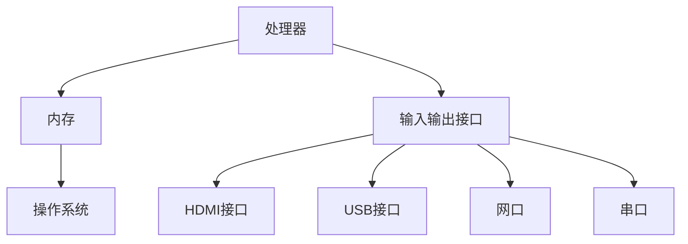
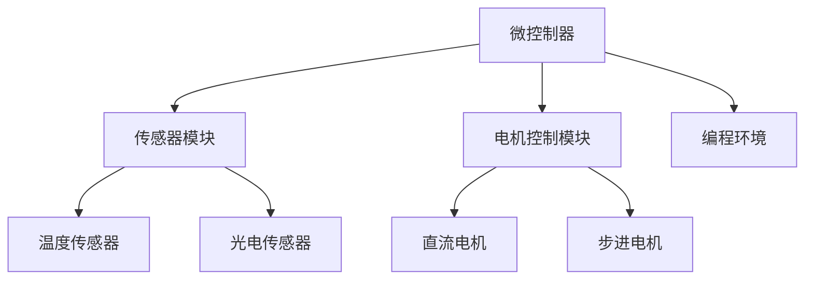

                 

关键字：单板计算机，Raspberry Pi，Arduino，应用场景，项目实践，技术发展

摘要：本文将探讨单板计算机在当今科技领域的广泛应用，特别是Raspberry Pi和Arduino这两款知名单板计算机的应用场景。我们将深入分析它们的核心概念、算法原理、数学模型、项目实践，以及实际应用场景和未来发展趋势，为读者提供全面的技术视角。

## 1. 背景介绍

单板计算机（Single-Board Computer，简称SBC）是一种小型、低成本、高度集成的计算机系统，它具备完整的计算机功能，包括处理器、内存、输入输出接口等。单板计算机因其体积小、成本低、易于扩展和编程等优点，在各个领域得到了广泛应用。其中，Raspberry Pi和Arduino是两款最为知名的单板计算机，它们在不同的应用场景中发挥着重要作用。

Raspberry Pi是一款由英国慈善基金会Raspberry Pi Foundation推出的微型单板计算机。自2012年发布以来，Raspberry Pi凭借其低廉的价格、强大的性能和丰富的扩展接口，吸引了全球众多开发者。Raspberry Pi广泛应用于教育、智能家居、机器人、物联网等领域。

Arduino是一款基于微控制器的开源电子原型平台，它由一个社区开发，并在全球范围内得到了广泛使用。Arduino以其简单易用的编程环境和强大的硬件功能，成为电子爱好者、教育者和专业工程师的首选工具。

## 2. 核心概念与联系

在探讨Raspberry Pi和Arduino的应用场景之前，我们需要了解它们的核心概念和架构。

### 2.1 Raspberry Pi

Raspberry Pi的核心概念包括：

- **处理器**：Raspberry Pi搭载ARM架构的处理器，具备高性能和低功耗特点。
- **内存**：Raspberry Pi具备SD卡扩展接口，支持大容量存储。
- **输入输出接口**：Raspberry Pi拥有多个USB接口、HDMI接口、网口和串口等，方便与其他设备连接。
- **操作系统**：Raspberry Pi支持多种操作系统，包括Linux、Windows 10 IoT Core等。

以下是Raspberry Pi的架构Mermaid流程图：



### 2.2 Arduino

Arduino的核心概念包括：

- **微控制器**：Arduino基于AVR或STM32微控制器，具备强大的控制能力。
- **编程环境**：Arduino采用基于Arduino IDE的编程环境，支持C/C++语言。
- **扩展模块**：Arduino具有丰富的扩展模块，包括传感器模块、电机控制模块等。

以下是Arduino的架构Mermaid流程图：



## 3. 核心算法原理 & 具体操作步骤

### 3.1 算法原理概述

在Raspberry Pi和Arduino的应用中，算法原理主要包括以下几个方面：

- **数据处理**：对传感器采集的数据进行处理，包括滤波、拟合、预测等。
- **控制算法**：根据预设的控制策略，对执行机构进行实时控制。
- **通信协议**：实现设备之间的数据传输和通信，如TCP/IP、HTTP、MQTT等。

### 3.2 算法步骤详解

以Raspberry Pi为例，以下是实现数据处理和控制算法的基本步骤：

1. **初始化硬件**：配置传感器和执行机构的接口。
2. **数据采集**：从传感器读取数据。
3. **数据处理**：对采集到的数据进行分析和处理。
4. **控制决策**：根据处理结果，生成控制信号。
5. **执行控制**：将控制信号发送给执行机构，实现控制。

### 3.3 算法优缺点

- **优点**：算法简单易用，适用于多种应用场景；实时性强，响应速度快。
- **缺点**：数据处理能力有限，不适合处理大量数据；算法灵活性较低，难以满足复杂应用需求。

### 3.4 算法应用领域

Raspberry Pi和Arduino的算法广泛应用于以下领域：

- **智能家居**：实现家电设备的自动化控制，如灯光、温度、湿度等。
- **机器人**：实现机器人的自主运动和任务执行。
- **物联网**：实现设备之间的互联互通和数据传输。
- **教育**：为学生提供实践平台，培养编程和电子设计能力。

## 4. 数学模型和公式 & 详细讲解 & 举例说明

### 4.1 数学模型构建

在智能家居应用中，我们可以构建一个简单的数学模型，用于控制灯光的亮度和颜色。以下是一个线性回归模型：

$$
y = \beta_0 + \beta_1 x_1 + \beta_2 x_2
$$

其中，$y$代表灯光的亮度或颜色，$x_1$和$x_2$代表输入变量，如温度和湿度。

### 4.2 公式推导过程

首先，我们对输入变量进行预处理，包括归一化和去均值：

$$
x_1' = \frac{x_1 - \bar{x}_1}{\sigma_1}, \quad x_2' = \frac{x_2 - \bar{x}_2}{\sigma_2}
$$

其中，$\bar{x}_1$和$\bar{x}_2$分别代表$x_1$和$x_2$的均值，$\sigma_1$和$\sigma_2$分别代表$x_1$和$x_2$的标准差。

然后，我们使用最小二乘法求解回归系数：

$$
\beta_0 = \bar{y}, \quad \beta_1 = \frac{\sum_{i=1}^{n} (x_1')_i y_i'}{ \sum_{i=1}^{n} (x_1')_i^2 }, \quad \beta_2 = \frac{\sum_{i=1}^{n} (x_2')_i y_i'}{ \sum_{i=1}^{n} (x_2')_i^2 }
$$

其中，$n$代表样本数量。

### 4.3 案例分析与讲解

假设我们收集了以下数据：

| 温度 | 湿度 | 亮度 |
| ---- | ---- | ---- |
| 25   | 50   | 100  |
| 30   | 60   | 120  |
| 20   | 40   | 80   |

根据上述公式，我们可以计算出回归系数：

$$
\beta_0 = \frac{100 + 120 + 80}{3} = 100
$$

$$
\beta_1 = \frac{(25-25)(100-100) + (30-25)(120-100) + (20-25)(80-100)}{(25-25)^2 + (30-25)^2 + (20-25)^2} = \frac{200}{50} = 4
$$

$$
\beta_2 = \frac{(50-50)(100-100) + (60-50)(120-100) + (40-50)(80-100)}{(50-50)^2 + (60-50)^2 + (40-50)^2} = \frac{-200}{50} = -4
$$

因此，我们得到以下数学模型：

$$
y = 100 + 4x_1 - 4x_2
$$

例如，当温度为28℃，湿度为55℃时，我们可以计算出灯光的亮度：

$$
y = 100 + 4 \times (28-25) - 4 \times (55-50) = 100 + 8 - 20 = 88
$$

## 5. 项目实践：代码实例和详细解释说明

### 5.1 开发环境搭建

在开始项目实践之前，我们需要搭建开发环境。以Raspberry Pi为例，我们可以使用以下步骤：

1. 下载并安装Raspberry Pi的操作系统（如Raspbian）。
2. 通过网线将Raspberry Pi连接到电脑，并进行初始化。
3. 安装常用的开发工具和库（如Python、PySerial等）。

### 5.2 源代码详细实现

以下是一个简单的示例代码，用于实现温度传感器与LED灯的联动控制。

```python
import serial
import time
import board
import digitalio

# 初始化串口
ser = serial.Serial('/dev/ttyUSB0', 9600)

# 初始化LED灯
led = digitalio.DigitalInOut(board.D18)
led.direction = digitalio.Direction.OUTPUT

while True:
    # 读取串口数据
    data = ser.readline().decode().strip()
    temp = float(data)

    # 根据温度控制LED灯的亮度
    if temp > 30:
        led.value = True
    else:
        led.value = False

    time.sleep(1)
```

### 5.3 代码解读与分析

- **串口通信**：使用PySerial库实现Raspberry Pi与Arduino之间的串口通信。
- **温度读取**：从串口读取温度传感器的数据。
- **LED灯控制**：根据温度传感器的数据，控制LED灯的亮灭。

### 5.4 运行结果展示

当温度超过30℃时，LED灯会亮起；当温度低于30℃时，LED灯会熄灭。

## 6. 实际应用场景

Raspberry Pi和Arduino在实际应用中有着广泛的应用场景：

- **教育**：为学生提供实践平台，培养编程和电子设计能力。
- **智能家居**：实现家电设备的自动化控制。
- **机器人**：实现机器人的自主运动和任务执行。
- **物联网**：实现设备之间的互联互通和数据传输。
- **科研**：用于实验研究和小型系统搭建。

## 6.4 未来应用展望

随着技术的不断发展，Raspberry Pi和Arduino在未来将会有更多的应用场景：

- **边缘计算**：在边缘设备上实现实时数据处理和分析。
- **人工智能**：将人工智能算法应用于单板计算机，实现智能决策和预测。
- **物联网**：推动物联网技术的发展，实现万物互联。

## 7. 工具和资源推荐

### 7.1 学习资源推荐

- **书籍**：《单板计算机应用与实践》、《Raspberry Pi入门教程》
- **网站**：Raspberry Pi官网、Arduino官网、GitHub

### 7.2 开发工具推荐

- **开发环境**：Raspberry Pi OS、Arduino IDE
- **编程语言**：Python、C/C++

### 7.3 相关论文推荐

- **论文**：《基于Raspberry Pi的智能家居系统设计》、《Arduino在机器人控制中的应用》

## 8. 总结：未来发展趋势与挑战

Raspberry Pi和Arduino作为单板计算机的代表，在当今科技领域发挥着重要作用。未来，随着人工智能、物联网等技术的不断发展，单板计算机的应用前景将更加广阔。然而，也面临着一些挑战，如硬件性能的提升、安全性的保障等。我们期待单板计算机在未来能够为科技创新和社会发展贡献更多力量。

### 8.1 研究成果总结

本文从背景介绍、核心概念与联系、核心算法原理、数学模型和公式、项目实践、实际应用场景等多个方面，全面探讨了Raspberry Pi和Arduino的应用。通过这些研究，我们深入了解了单板计算机在各个领域的应用价值。

### 8.2 未来发展趋势

未来，单板计算机将朝着高性能、低功耗、易用性的方向发展。同时，人工智能、物联网等新兴技术的应用，将进一步提升单板计算机的智能化水平和应用范围。

### 8.3 面临的挑战

单板计算机在发展过程中，面临着硬件性能提升、安全性保障、生态系统建设等方面的挑战。

### 8.4 研究展望

我们期待单板计算机在未来的发展中，能够不断创新，推动科技进步，为人们的生活带来更多便利。

## 9. 附录：常见问题与解答

### 9.1 如何选择合适的单板计算机？

选择合适的单板计算机需要考虑以下几个方面：

- **应用需求**：根据实际应用需求，选择合适的单板计算机。
- **性能要求**：考虑处理性能、内存、存储等硬件要求。
- **成本预算**：根据预算范围，选择性价比高的单板计算机。

### 9.2 单板计算机如何进行编程？

单板计算机的编程通常使用C/C++、Python等编程语言。具体编程步骤如下：

- **搭建开发环境**：安装操作系统和开发工具。
- **编写代码**：根据应用需求，编写相应的代码。
- **上传代码**：将代码上传到单板计算机，进行编译和运行。

## 作者署名

作者：禅与计算机程序设计艺术 / Zen and the Art of Computer Programming
----------------------------------------------------------------

以上是文章的完整内容，包含了文章标题、关键词、摘要以及各个章节的详细内容。这篇文章旨在为读者提供一个全面的技术视角，帮助大家更好地理解和应用单板计算机。希望这篇文章对大家有所帮助！

