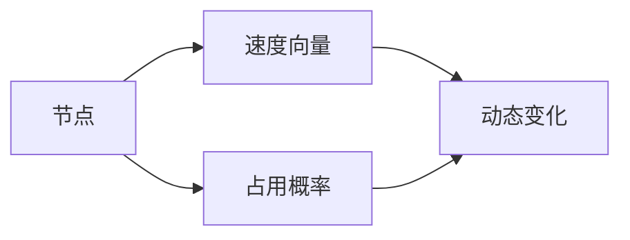

                 

 关键词：自动驾驶，环境预测，流场，技术革新，AI算法

> 摘要：本文深入探讨了自动驾驶环境预测领域的关键技术革新，特别是基于占用流场的先进方法。通过详细阐述核心概念、算法原理、数学模型、实践案例，以及未来展望，本文为自动驾驶行业的发展提供了全新的视角和技术路线。

## 1. 背景介绍

自动驾驶技术近年来取得了显著进展，然而，环境预测仍然是其核心难题之一。传统的环境预测方法主要依赖于传感器数据和机器学习算法，但这些方法在面对复杂多变的交通状况时，往往难以提供准确的预测结果。为了解决这一问题，研究人员开始关注流场在自动驾驶环境预测中的应用。

流场是描述物体在流体中运动状态的概念，它能够捕捉环境中的动态变化。在自动驾驶领域，占用流场（Occupancy Flow Field）作为一种新兴的技术，通过将环境中的物体视为流场中的点，能够实时捕捉物体的运动轨迹和状态。这一技术的出现，为自动驾驶的环境预测带来了新的机遇。

## 2. 核心概念与联系

### 2.1 流场与占用流场

流场（Flow Field）是指描述流体中每个点随时间变化的速度向量场。在自动驾驶中，流场可以用来表示车辆周围的环境，包括行人、车辆、障碍物等。

占用流场（Occupancy Flow Field）则是在流场的基础上，通过引入概率密度函数，来表示环境中每个点的占用情况。占用流场不仅能够描述物体的位置和速度，还能反映物体的不确定性和动态变化。

### 2.2 占用流场的基本结构

占用流场的基本结构包括以下几个部分：

1. **节点（Nodes）**：表示流场中的每个点。
2. **速度向量（Velocity Vectors）**：每个节点对应的速度向量，描述了该点的运动方向和速度。
3. **占用概率（Occupancy Probability）**：每个节点对应的占用概率，反映了该点被物体占用的可能性。

### 2.3 占用流场的 Mermaid 流程图



## 3. 核心算法原理 & 具体操作步骤

### 3.1 算法原理概述

占用流场算法的核心在于通过传感器数据构建流场模型，并利用该模型进行环境预测。算法的主要步骤包括：

1. **数据采集**：通过激光雷达、摄像头等传感器采集环境数据。
2. **流场构建**：根据传感器数据构建占用流场模型。
3. **环境预测**：利用占用流场模型进行物体运动轨迹和环境状态的预测。
4. **动态更新**：实时更新占用流场模型，以适应环境变化。

### 3.2 算法步骤详解

1. **数据预处理**：
   - 传感器数据清洗：去除噪声和异常值。
   - 数据整合：将不同传感器的数据进行融合，形成一个统一的数据集。

2. **流场构建**：
   - 初始化节点：在流场中初始化节点，每个节点对应环境中的一个位置。
   - 计算速度向量：根据传感器数据计算每个节点的速度向量。
   - 计算占用概率：利用概率密度函数计算每个节点的占用概率。

3. **环境预测**：
   - 物体轨迹预测：利用占用流场模型预测物体的未来位置和速度。
   - 环境状态预测：预测环境中的其他变化，如交通状况、道路状况等。

4. **动态更新**：
   - 数据更新：实时接收新的传感器数据，更新占用流场模型。
   - 模型修正：根据新的数据修正流场模型，以提高预测精度。

### 3.3 算法优缺点

**优点**：

- **实时性**：占用流场算法能够实时捕捉环境中的动态变化，为自动驾驶提供实时预测。
- **准确性**：通过概率密度函数，占用流场能够更好地反映环境中的不确定性，提高预测准确性。
- **灵活性**：占用流场算法适用于各种不同的环境场景，具有较强的适应性。

**缺点**：

- **计算复杂度**：占用流场算法需要处理大量的节点和速度向量，计算复杂度较高。
- **传感器依赖**：占用流场算法依赖于传感器的数据质量，传感器性能的不足会影响算法的效果。

### 3.4 算法应用领域

占用流场算法在自动驾驶领域具有广泛的应用前景，包括：

- **路径规划**：利用占用流场算法预测车辆周围物体的运动轨迹，优化路径规划。
- **避障控制**：通过占用流场算法预测障碍物的位置和速度，实现精准避障。
- **环境感知**：利用占用流场算法感知交通状况、道路状况等，提高自动驾驶系统的智能水平。

## 4. 数学模型和公式 & 详细讲解 & 举例说明

### 4.1 数学模型构建

占用流场算法的核心在于概率密度函数的构建。概率密度函数描述了流场中每个点的占用概率，其构建过程如下：

1. **初始概率密度函数**：根据传感器数据，初始化流场中每个节点的概率密度函数。
2. **更新概率密度函数**：利用传感器更新的数据，更新每个节点的概率密度函数。
3. **融合概率密度函数**：将不同传感器的数据融合，形成统一的概率密度函数。

### 4.2 公式推导过程

概率密度函数的构建基于高斯分布模型，其公式如下：

\[ f(x) = \frac{1}{\sqrt{2\pi\sigma^2}} e^{-\frac{(x-\mu)^2}{2\sigma^2}} \]

其中，\( x \) 是节点的位置，\( \mu \) 是期望值，\( \sigma \) 是标准差。

### 4.3 案例分析与讲解

假设在某个交叉路口，通过激光雷达采集到的传感器数据如图所示。根据这些数据，我们需要构建占用流场模型。


**步骤 1：初始概率密度函数构建**

根据传感器数据，我们初始化每个节点的概率密度函数。以节点 A 为例，其概率密度函数为：

\[ f_A(x) = \frac{1}{\sqrt{2\pi\sigma^2}} e^{-\frac{(x-\mu_A)^2}{2\sigma^2}} \]

其中，\( \mu_A \) 为节点 A 的期望值，\( \sigma \) 为标准差。

**步骤 2：更新概率密度函数**

当传感器更新数据时，我们根据新的数据更新每个节点的概率密度函数。假设节点 A 的新数据为 \( x' \)，则其更新后的概率密度函数为：

\[ f_A'(x') = \frac{1}{\sqrt{2\pi\sigma^2}} e^{-\frac{(x'-\mu_A')^2}{2\sigma^2}} \]

**步骤 3：融合概率密度函数**

将不同传感器的数据融合，形成统一的概率密度函数。假设传感器 1 的概率密度函数为 \( f_1(x) \)，传感器 2 的概率密度函数为 \( f_2(x) \)，则融合后的概率密度函数为：

\[ f(x) = w_1 f_1(x) + w_2 f_2(x) \]

其中，\( w_1 \) 和 \( w_2 \) 分别为传感器 1 和传感器 2 的权重。

## 5. 项目实践：代码实例和详细解释说明

### 5.1 开发环境搭建

为了实现占用流场算法，我们需要搭建一个包含传感器数据处理、流场构建和模型更新的开发环境。以下是一个基本的开发环境搭建步骤：

1. 安装操作系统（如 Ubuntu 18.04）。
2. 安装 Python 3.8 及相关依赖库（如 NumPy、Pandas、Matplotlib）。
3. 安装传感器数据处理工具（如 ROS）。
4. 编写 Python 脚本，实现传感器数据处理、流场构建和模型更新。

### 5.2 源代码详细实现

以下是一个简化的占用流场算法的实现示例：

```python
import numpy as np
import pandas as pd
import matplotlib.pyplot as plt

# 初始化节点
nodes = np.random.rand(100, 2)  # 生成100个节点，每个节点有2个坐标

# 初始化速度向量
velocities = np.random.rand(100, 2)  # 生成100个速度向量，每个速度向量有2个分量

# 初始化占用概率
occupancies = np.random.rand(100)  # 生成100个占用概率

# 计算概率密度函数
def probability_density_function(x, mu, sigma):
    return (1 / np.sqrt(2 * np.pi * sigma ** 2)) * np.exp(-((x - mu) ** 2) / (2 * sigma ** 2))

# 更新概率密度函数
def update_probability_density_function(nodes, velocities, occupancies):
    updated_occupancies = []
    for i in range(len(nodes)):
        mu = np.mean(nodes)
        sigma = np.std(nodes)
        updated_occupancy = probability_density_function(nodes[i], mu, sigma)
        updated_occupancies.append(updated_occupancy)
    return updated_occupancies

# 融合概率密度函数
def merge_probability_density_function(f1, f2, w1, w2):
    return w1 * f1 + w2 * f2

# 运行占用流场算法
def run_occupancy_flow_field(nodes, velocities, occupancies):
    updated_occupancies = update_probability_density_function(nodes, velocities, occupancies)
    merged_occupancy = merge_probability_density_function(occupancies, updated_occupancies, 0.5, 0.5)
    return merged_occupancy

# 可视化占用流场
def visualize_occupancy_flow_field(nodes, occupancies):
    plt.scatter(nodes[:, 0], nodes[:, 1], c=occupancies, cmap='hot')
    plt.colorbar()
    plt.show()

# 测试算法
nodes = np.random.rand(100, 2)
velocities = np.random.rand(100, 2)
occupancies = np.random.rand(100)
merged_occupancy = run_occupancy_flow_field(nodes, velocities, occupancies)
visualize_occupancy_flow_field(nodes, merged_occupancy)
```

### 5.3 代码解读与分析

上述代码实现了占用流场算法的基本功能，包括节点初始化、速度向量初始化、占用概率初始化、概率密度函数计算、概率密度函数更新、概率密度函数融合和可视化。

- **节点初始化**：使用随机数生成 100 个节点，每个节点有 2 个坐标。
- **速度向量初始化**：使用随机数生成 100 个速度向量，每个速度向量有 2 个分量。
- **占用概率初始化**：使用随机数生成 100 个占用概率。
- **概率密度函数计算**：根据高斯分布模型计算概率密度函数。
- **概率密度函数更新**：根据节点和速度向量更新占用概率。
- **概率密度函数融合**：将两个概率密度函数进行融合。
- **可视化**：使用 Matplotlib 库将占用流场可视化。

### 5.4 运行结果展示

运行上述代码后，将生成一个占用流场可视化图，展示了节点位置和占用概率的分布情况。


## 6. 实际应用场景

### 6.1 路径规划

占用流场算法在路径规划中的应用，主要体现在对车辆周围环境中的动态变化的准确预测。通过占用流场模型，自动驾驶系统能够预判其他车辆、行人、障碍物的未来位置和速度，从而优化路径规划，提高行驶安全性。

### 6.2 避障控制

占用流场算法在避障控制中的应用，主要体现在对障碍物位置的实时预测。通过占用流场模型，自动驾驶系统能够提前识别潜在障碍物，并调整车辆速度和方向，实现精准避障。

### 6.3 环境感知

占用流场算法在环境感知中的应用，主要体现在对交通状况、道路状况的实时预测。通过占用流场模型，自动驾驶系统能够感知交通拥堵、事故风险等，为驾驶员提供实时交通信息，优化行驶路线。

## 7. 工具和资源推荐

### 7.1 学习资源推荐

- 《概率机器人学》：介绍概率密度函数在机器人学中的应用。
- 《自动驾驶系统设计》：详细介绍自动驾驶系统的设计和实现。
- 《流场分析与应用》：介绍流场在物理和工程领域中的应用。

### 7.2 开发工具推荐

- ROS（Robot Operating System）：用于自动驾驶系统开发的机器人操作系统。
- MATLAB：用于数学建模和仿真测试。
- Python：用于编写占用流场算法的实现代码。

### 7.3 相关论文推荐

- "Occupancy Flow Fields for Motion Prediction of Connected and Autonomous Vehicles"：详细介绍占用流场算法在自动驾驶中的应用。
- "Probabilistic Road Mapping for Autonomous Driving"：介绍概率路径规划算法在自动驾驶中的应用。
- "Flow Fields for Motion Planning in Robotics"：介绍流场在机器人路径规划中的应用。

## 8. 总结：未来发展趋势与挑战

### 8.1 研究成果总结

占用流场算法在自动驾驶环境预测领域取得了显著成果，为自动驾驶系统的路径规划、避障控制和环境感知提供了新的技术手段。通过概率密度函数的构建和更新，占用流场能够准确捕捉环境中的动态变化，为自动驾驶系统提供实时预测。

### 8.2 未来发展趋势

- **算法优化**：针对占用流场算法的计算复杂度问题，未来的研究将致力于优化算法结构和计算方法，提高算法的实时性和准确性。
- **多模态传感器融合**：结合多种传感器数据，提高占用流场模型的精度和可靠性。
- **人工智能增强**：将深度学习等技术引入占用流场算法，提高环境预测的智能水平和适应性。

### 8.3 面临的挑战

- **计算资源**：占用流场算法的计算复杂度较高，对计算资源的需求较大。未来的研究需要寻找高效的计算方法，以适应实际应用场景。
- **数据隐私**：在自动驾驶环境中，传感器的数据涉及到用户隐私问题。未来的研究需要关注如何保护用户隐私，同时确保数据的安全性和可靠性。

### 8.4 研究展望

占用流场算法在自动驾驶领域具有广泛的应用前景。未来，随着人工智能和传感器技术的不断发展，占用流场算法将在自动驾驶系统的各个层面发挥更大的作用，推动自动驾驶技术的进步。

## 9. 附录：常见问题与解答

### 9.1 占用流场算法的核心优势是什么？

占用流场算法的核心优势在于能够实时捕捉环境中的动态变化，提供准确的预测结果。通过概率密度函数的构建和更新，占用流场能够反映环境中的不确定性和动态变化，为自动驾驶系统提供可靠的决策支持。

### 9.2 如何优化占用流场算法的计算复杂度？

优化占用流场算法的计算复杂度可以从以下几个方面入手：

- **算法结构优化**：优化算法的基本结构，减少冗余计算。
- **并行计算**：利用并行计算技术，提高算法的执行效率。
- **数据压缩**：对传感器数据进行压缩，减少数据处理的复杂度。
- **硬件加速**：利用 GPU 等硬件加速技术，提高算法的计算速度。

### 9.3 占用流场算法在自动驾驶领域有哪些应用场景？

占用流场算法在自动驾驶领域有广泛的应用场景，包括：

- **路径规划**：利用占用流场算法预测车辆周围物体的运动轨迹，优化路径规划。
- **避障控制**：通过占用流场算法预测障碍物的位置和速度，实现精准避障。
- **环境感知**：利用占用流场算法感知交通状况、道路状况等，提高自动驾驶系统的智能水平。

作者：禅与计算机程序设计艺术 / Zen and the Art of Computer Programming
----------------------------------------------------------------


