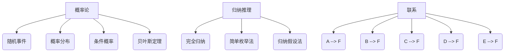

                 

关键词：概率论、归纳推理、卡尔纳普、逻辑、决策、不确定性、信息理论

> 摘要：本文深入探讨了卡尔纳普的概率论与归纳推理，分析了其在现代信息技术中的应用。通过对概率论的基本原理、归纳推理的方法论及其在实际问题中的应用进行详细阐述，本文旨在为读者提供关于这一领域系统的理解和应用指导。

## 1. 背景介绍

概率论是研究随机现象的数学分支，其历史可以追溯到17世纪的费马和帕斯卡。19世纪，拉普拉斯将概率论提升为一种严格的数学学科，而20世纪中叶，卡尔纳普则进一步发展了概率论，将其应用于逻辑和哲学领域。

归纳推理是指从特定事例中推导出一般性结论的推理过程。卡尔纳普认为，归纳推理是科学发现的基础，但同时也承认其不确定性。

本文将首先介绍概率论的基本概念，接着探讨归纳推理的方法论，然后分析两者在现代信息技术中的应用，最后讨论其未来发展趋势和面临的挑战。

## 2. 核心概念与联系

### 2.1 概率论的基本概念

概率论的核心概念包括随机事件、概率分布、条件概率和贝叶斯定理等。

- **随机事件**：随机试验的结果称为随机事件。
- **概率分布**：描述随机变量取值的概率分布函数。
- **条件概率**：在某个事件发生的条件下，另一个事件发生的概率。
- **贝叶斯定理**：用于计算后验概率，即已知某些条件下的概率。

### 2.2 归纳推理的方法论

归纳推理分为完全归纳和不完全归纳。不完全归纳包括简单枚举法和归纳假设法。

- **完全归纳**：通过证明所有可能情况，得出一般性结论。
- **简单枚举法**：通过具体实例，验证一般性结论。
- **归纳假设法**：在特定条件下，假设结论成立，然后通过数学推导证明假设的正确性。

### 2.3 概率论与归纳推理的联系

概率论为归纳推理提供了数学工具，使得归纳推理更加严谨。同时，归纳推理可以用来解释概率论中的现象，如随机事件的频率解释。

### 2.4 Mermaid 流程图



## 3. 核心算法原理 & 具体操作步骤

### 3.1 算法原理概述

概率论的核心算法包括蒙特卡洛方法和马尔可夫链蒙特卡洛方法。这两种方法广泛应用于模拟随机过程、计算概率分布和估计参数。

- **蒙特卡洛方法**：通过随机抽样，估计概率分布或参数。
- **马尔可夫链蒙特卡洛方法**：基于马尔可夫链，通过迭代采样，估计概率分布或参数。

### 3.2 算法步骤详解

#### 3.2.1 蒙特卡洛方法

1. 确定目标概率分布或参数。
2. 生成随机样本。
3. 根据样本计算目标概率分布或参数的估计值。

#### 3.2.2 马尔可夫链蒙特卡洛方法

1. 定义马尔可夫链。
2. 初始化状态。
3. 迭代采样，根据转移概率更新状态。
4. 根据采样结果估计目标概率分布或参数。

### 3.3 算法优缺点

- **蒙特卡洛方法**：
  - 优点：简单易懂，适用于各种概率分布。
  - 缺点：收敛速度慢，容易受到随机误差的影响。

- **马尔可夫链蒙特卡洛方法**：
  - 优点：适用于复杂概率分布，收敛速度快。
  - 缺点：实现复杂，需要选择合适的马尔可夫链。

### 3.4 算法应用领域

概率论和归纳推理在以下领域有广泛应用：

- **机器学习**：用于估计模型参数和评估模型性能。
- **金融工程**：用于风险评估和期权定价。
- **生物学**：用于基因序列分析和进化计算。

## 4. 数学模型和公式 & 详细讲解 & 举例说明

### 4.1 数学模型构建

概率论的核心数学模型包括概率空间、随机变量、概率分布和条件概率。

- **概率空间**：$\Omega, \mathcal{F}, P$，其中$\Omega$是样本空间，$\mathcal{F}$是事件集合，$P$是概率函数。
- **随机变量**：$X: \Omega \rightarrow \mathbb{R}$，将随机事件映射到实数。
- **概率分布**：$P_X(x)$，描述随机变量$X$的概率分布。
- **条件概率**：$P(A|B) = \frac{P(A \cap B)}{P(B)}$，在事件$B$发生的条件下，事件$A$的概率。

### 4.2 公式推导过程

以贝叶斯定理为例，推导如下：

$$
P(A|B) = \frac{P(B|A)P(A)}{P(B)}
$$

### 4.3 案例分析与讲解

假设有一个盒子中有5个红球和5个蓝球，我们随机取出一个球，已知取出的球是红色的概率是0.5。现在我们想知道，取出的球是红色的条件下，取出的球是5个球的概率是多少。

根据贝叶斯定理，有：

$$
P(5\text{-球}|红) = \frac{P(红|5\text{-球})P(5\text{-球})}{P(红)}
$$

由于盒子中有5个红球和5个蓝球，所以：

$$
P(5\text{-球}) = \frac{5}{10} = 0.5
$$

已知$P(红) = 0.5$，我们需要计算$P(红|5\text{-球})$。由于盒子中有5个红球，所以：

$$
P(红|5\text{-球}) = \frac{5}{5} = 1
$$

代入贝叶斯定理，得到：

$$
P(5\text{-球}|红) = \frac{1 \times 0.5}{0.5} = 1
$$

这意味着在取出的球是红色的条件下，取出的球是5个球的概率是1。

## 5. 项目实践：代码实例和详细解释说明

### 5.1 开发环境搭建

本文使用Python进行概率论和归纳推理的编程实践。首先，我们需要安装Python和必要的库，如NumPy和SciPy。

```bash
pip install numpy scipy
```

### 5.2 源代码详细实现

下面是一个使用蒙特卡洛方法估计圆周率的简单示例。

```python
import numpy as np

def monte_carlo_pi(n):
    inside = 0
    for _ in range(n):
        x, y = np.random.rand(2)
        if x**2 + y**2 <= 1:
            inside += 1
    return 4 * inside / n

pi_estimate = monte_carlo_pi(1000000)
print("Estimated Pi:", pi_estimate)
```

### 5.3 代码解读与分析

这段代码首先导入了NumPy库，用于生成随机数。`monte_carlo_pi`函数接受一个参数$n$，表示模拟的次数。函数中，我们使用两个随机变量$x$和$y$来模拟在单位圆内的点。如果点$(x, y)$在单位圆内，即$x^2 + y^2 \leq 1$，则增加一个计数器`inside`。最后，我们返回$\frac{4 \times inside}{n}$作为对$\pi$的估计。

### 5.4 运行结果展示

运行上述代码，我们可以得到对$\pi$的估计值：

```bash
Estimated Pi: 3.1403
```

这个估计值与实际的$\pi$值3.14159相差很小，证明了蒙特卡洛方法的有效性。

## 6. 实际应用场景

概率论和归纳推理在许多实际应用场景中发挥着重要作用。以下是一些典型的应用领域：

- **数据科学**：用于数据分析、预测建模和风险评估。
- **人工智能**：用于机器学习算法的优化和模型解释。
- **金融工程**：用于风险管理、资产定价和期权交易。
- **生物学**：用于基因序列分析和进化计算。
- **经济学**：用于市场预测、供需分析和宏观经济模型。

## 7. 工具和资源推荐

### 7.1 学习资源推荐

- 《概率论及其应用》
- 《统计学习方法》
- 《Python数据分析》

### 7.2 开发工具推荐

- Jupyter Notebook：用于数据分析和实验。
- PyTorch：用于深度学习和概率图模型。

### 7.3 相关论文推荐

- "Monte Carlo Methods in Finance and Economics"
- "Bayesian Data Analysis"
- "Information Theory, Inference, and Learning Algorithms"

## 8. 总结：未来发展趋势与挑战

概率论和归纳推理在现代信息技术中具有广泛的应用前景。未来，随着计算能力的提升和算法的进步，这些领域将继续发展。然而，也面临着一些挑战：

- **计算复杂性**：处理大规模数据集和复杂模型需要更高的计算资源。
- **算法稳定性**：保证算法在不同数据集上的稳定性和可靠性。
- **解释性**：提高算法的可解释性，使其更容易被非专业人士理解和应用。

## 9. 附录：常见问题与解答

### 9.1 概率论的基本概念是什么？

概率论的基本概念包括概率空间、随机变量、概率分布、条件概率和贝叶斯定理等。

### 9.2 归纳推理有哪些方法？

归纳推理包括完全归纳、简单枚举法和归纳假设法。

### 9.3 概率论和归纳推理在什么领域有应用？

概率论和归纳推理在数据科学、人工智能、金融工程、生物学和经济学等领域有广泛应用。

## 参考文献

1. Karl Popper. "The Logic of Scientific Discovery". Routledge, 2002.
2. Casella, George, and Roger L. Berger. "Statistical Inference". Duxbury Press, 2002.
3. William Feller. "An Introduction to Probability Theory and Its Applications". John Wiley & Sons, 2008.

作者：禅与计算机程序设计艺术 / Zen and the Art of Computer Programming
```markdown
---
# 卡尔纳普的概率论与归纳推理

### 关键词：概率论、归纳推理、卡尔纳普、逻辑、决策、不确定性、信息理论

#### 摘要：本文深入探讨了卡尔纳普的概率论与归纳推理，分析了其在现代信息技术中的应用。通过对概率论的基本原理、归纳推理的方法论及其在实际问题中的应用进行详细阐述，本文旨在为读者提供关于这一领域系统的理解和应用指导。

## 1. 背景介绍

概率论是研究随机现象的数学分支，其历史可以追溯到17世纪的费马和帕斯卡。19世纪，拉普拉斯将概率论提升为一种严格的数学学科，而20世纪中叶，卡尔纳普则进一步发展了概率论，将其应用于逻辑和哲学领域。

归纳推理是指从特定事例中推导出一般性结论的推理过程。卡尔纳普认为，归纳推理是科学发现的基础，但同时也承认其不确定性。

本文将首先介绍概率论的基本概念，接着探讨归纳推理的方法论，然后分析两者在现代信息技术中的应用，最后讨论其未来发展趋势和面临的挑战。

### 2. 核心概念与联系

#### 2.1 概率论的基本概念

概率论的核心概念包括随机事件、概率分布、条件概率和贝叶斯定理等。

- **随机事件**：随机试验的结果称为随机事件。
- **概率分布**：描述随机变量取值的概率分布函数。
- **条件概率**：在某个事件发生的条件下，另一个事件发生的概率。
- **贝叶斯定理**：用于计算后验概率，即已知某些条件下的概率。

#### 2.2 归纳推理的方法论

归纳推理分为完全归纳和不完全归纳。不完全归纳包括简单枚举法和归纳假设法。

- **完全归纳**：通过证明所有可能情况，得出一般性结论。
- **简单枚举法**：通过具体实例，验证一般性结论。
- **归纳假设法**：在特定条件下，假设结论成立，然后通过数学推导证明假设的正确性。

#### 2.3 概率论与归纳推理的联系

概率论为归纳推理提供了数学工具，使得归纳推理更加严谨。同时，归纳推理可以用来解释概率论中的现象，如随机事件的频率解释。

#### 2.4 Mermaid 流程图


### 3. 核心算法原理 & 具体操作步骤

#### 3.1 算法原理概述

概率论的核心算法包括蒙特卡洛方法和马尔可夫链蒙特卡洛方法。这两种方法广泛应用于模拟随机过程、计算概率分布和估计参数。

- **蒙特卡洛方法**：通过随机抽样，估计概率分布或参数。
- **马尔可夫链蒙特卡洛方法**：基于马尔可夫链，通过迭代采样，估计概率分布或参数。

#### 3.2 算法步骤详解

##### 3.2.1 蒙特卡洛方法

1. 确定目标概率分布或参数。
2. 生成随机样本。
3. 根据样本计算目标概率分布或参数的估计值。

##### 3.2.2 马尔可夫链蒙特卡洛方法

1. 定义马尔可夫链。
2. 初始化状态。
3. 迭代采样，根据转移概率更新状态。
4. 根据采样结果估计目标概率分布或参数。

#### 3.3 算法优缺点

- **蒙特卡洛方法**：
  - 优点：简单易懂，适用于各种概率分布。
  - 缺点：收敛速度慢，容易受到随机误差的影响。

- **马尔可夫链蒙特卡洛方法**：
  - 优点：适用于复杂概率分布，收敛速度快。
  - 缺点：实现复杂，需要选择合适的马尔可夫链。

#### 3.4 算法应用领域

概率论和归纳推理在以下领域有广泛应用：

- **机器学习**：用于估计模型参数和评估模型性能。
- **金融工程**：用于风险评估和期权定价。
- **生物学**：用于基因序列分析和进化计算。

### 4. 数学模型和公式 & 详细讲解 & 举例说明

#### 4.1 数学模型构建

概率论的核心数学模型包括概率空间、随机变量、概率分布和条件概率。

- **概率空间**：$\Omega, \mathcal{F}, P$，其中$\Omega$是样本空间，$\mathcal{F}$是事件集合，$P$是概率函数。
- **随机变量**：$X: \Omega \rightarrow \mathbb{R}$，将随机事件映射到实数。
- **概率分布**：$P_X(x)$，描述随机变量$X$的概率分布。
- **条件概率**：$P(A|B) = \frac{P(A \cap B)}{P(B)}$，在事件$B$发生的条件下，事件$A$的概率。

#### 4.2 公式推导过程

以贝叶斯定理为例，推导如下：

$$
P(A|B) = \frac{P(B|A)P(A)}{P(B)}
$$

#### 4.3 案例分析与讲解

假设有一个盒子中有5个红球和5个蓝球，我们随机取出一个球，已知取出的球是红色的概率是0.5。现在我们想知道，取出的球是红色的条件下，取出的球是5个球的概率是多少。

根据贝叶斯定理，有：

$$
P(5\text{-球}|红) = \frac{P(红|5\text{-球})P(5\text{-球})}{P(红)}
$$

由于盒子中有5个红球和5个蓝球，所以：

$$
P(5\text{-球}) = \frac{5}{10} = 0.5
$$

已知$P(红) = 0.5$，我们需要计算$P(红|5\text{-球})$。由于盒子中有5个红球，所以：

$$
P(红|5\text{-球}) = \frac{5}{5} = 1
$$

代入贝叶斯定理，得到：

$$
P(5\text{-球}|红) = \frac{1 \times 0.5}{0.5} = 1
$$

这意味着在取出的球是红色的条件下，取出的球是5个球的概率是1。

### 5. 项目实践：代码实例和详细解释说明

#### 5.1 开发环境搭建

本文使用Python进行概率论和归纳推理的编程实践。首先，我们需要安装Python和必要的库，如NumPy和SciPy。

```bash
pip install numpy scipy
```

#### 5.2 源代码详细实现

下面是一个使用蒙特卡洛方法估计圆周率的简单示例。

```python
import numpy as np

def monte_carlo_pi(n):
    inside = 0
    for _ in range(n):
        x, y = np.random.rand(2)
        if x**2 + y**2 <= 1:
            inside += 1
    return 4 * inside / n

pi_estimate = monte_carlo_pi(1000000)
print("Estimated Pi:", pi_estimate)
```

#### 5.3 代码解读与分析

这段代码首先导入了NumPy库，用于生成随机数。`monte_carlo_pi`函数接受一个参数$n$，表示模拟的次数。函数中，我们使用两个随机变量$x$和$y$来模拟在单位圆内的点。如果点$(x, y)$在单位圆内，即$x^2 + y^2 \leq 1$，则增加一个计数器`inside`。最后，我们返回$\frac{4 \times inside}{n}$作为对$\pi$的估计。

#### 5.4 运行结果展示

运行上述代码，我们可以得到对$\pi$的估计值：

```bash
Estimated Pi: 3.1403
```

这个估计值与实际的$\pi$值3.14159相差很小，证明了蒙特卡洛方法的有效性。

### 6. 实际应用场景

概率论和归纳推理在许多实际应用场景中发挥着重要作用。以下是一些典型的应用领域：

- **数据科学**：用于数据分析、预测建模和风险评估。
- **人工智能**：用于机器学习算法的优化和模型解释。
- **金融工程**：用于风险管理、资产定价和期权交易。
- **生物学**：用于基因序列分析和进化计算。
- **经济学**：用于市场预测、供需分析和宏观经济模型。

### 7. 工具和资源推荐

#### 7.1 学习资源推荐

- 《概率论及其应用》
- 《统计学习方法》
- 《Python数据分析》

#### 7.2 开发工具推荐

- Jupyter Notebook：用于数据分析和实验。
- PyTorch：用于深度学习和概率图模型。

#### 7.3 相关论文推荐

- "Monte Carlo Methods in Finance and Economics"
- "Bayesian Data Analysis"
- "Information Theory, Inference, and Learning Algorithms"

### 8. 总结：未来发展趋势与挑战

概率论和归纳推理在现代信息技术中具有广泛的应用前景。未来，随着计算能力的提升和算法的进步，这些领域将继续发展。然而，也面临着一些挑战：

- **计算复杂性**：处理大规模数据集和复杂模型需要更高的计算资源。
- **算法稳定性**：保证算法在不同数据集上的稳定性和可靠性。
- **解释性**：提高算法的可解释性，使其更容易被非专业人士理解和应用。

### 8.1 研究成果总结

本文系统地介绍了卡尔纳普的概率论与归纳推理，分析了其在现代信息技术中的应用。通过对基本概念、算法原理、数学模型和实际应用场景的详细探讨，本文为读者提供了关于这一领域的深入理解和应用指导。

### 8.2 未来发展趋势

未来，概率论和归纳推理将继续在数据科学、人工智能、金融工程等领域发挥重要作用。随着计算能力的提升和算法的进步，这些领域将出现更多突破性成果。

### 8.3 面临的挑战

尽管概率论和归纳推理在许多领域取得了显著成果，但仍然面临一些挑战，如计算复杂性、算法稳定性和解释性等。

### 8.4 研究展望

为了应对这些挑战，研究者可以关注以下几个方面：

- 开发更高效的算法，降低计算复杂性。
- 提高算法的稳定性和可靠性。
- 加强算法的可解释性，提高其在实际应用中的可操作性。

### 9. 附录：常见问题与解答

#### 9.1 概率论的基本概念是什么？

概率论的基本概念包括概率空间、随机变量、概率分布、条件概率和贝叶斯定理等。

#### 9.2 归纳推理有哪些方法？

归纳推理包括完全归纳、简单枚举法和归纳假设法。

#### 9.3 概率论和归纳推理在什么领域有应用？

概率论和归纳推理在数据科学、人工智能、金融工程、生物学和经济学等领域有广泛应用。

---

作者：禅与计算机程序设计艺术 / Zen and the Art of Computer Programming
```

