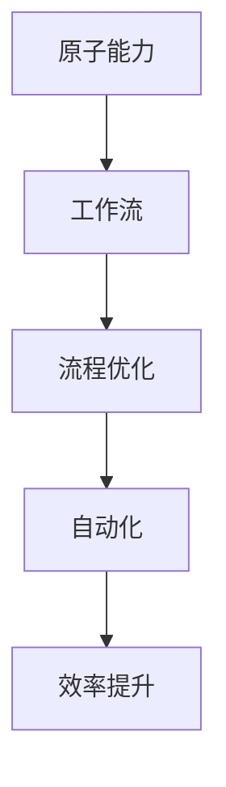

                 

关键词：工作流、原子能力、重塑、自动化、效率、IT架构、软件开发

> 摘要：本文探讨了在数字化时代，如何通过重塑原子能力层的工作流，实现软件开发、IT运营和业务流程的优化和自动化，提升整体效率。文章将介绍核心概念、算法原理、数学模型、项目实践以及未来展望，旨在为读者提供全方位的指导。

## 1. 背景介绍

在当今的数字化时代，信息技术的迅猛发展已经深刻改变了我们的生活方式和工作方式。企业和组织面临着巨大的竞争压力，如何在激烈的市场中保持竞争力，提升效率和创新能力成为关键问题。传统的软件开发、IT运营和业务流程往往存在效率低下、资源浪费等问题，这已经成为制约企业发展的重要因素。

### 1.1. 问题的提出

传统的软件开发流程通常涉及多个阶段，如需求分析、设计、编码、测试、部署等，每个阶段都需要大量的手工操作和重复劳动。这种模式不仅降低了开发效率，还容易导致错误和缺陷。在IT运营方面，系统的监控、维护和升级等工作同样依赖人工操作，容易出现延迟和故障。业务流程的自动化程度也不高，导致运营成本居高不下。

### 1.2. 需求分析

为了应对这些问题，我们需要对现有的工作流进行重塑。这包括以下几个方面：

- **自动化**：通过引入自动化工具和流程，减少手工操作，提高工作效率。
- **优化**：对现有的工作流进行重新设计，去除冗余步骤，提高整体效率。
- **标准化**：制定统一的流程规范，确保工作的一致性和可重复性。
- **智能化**：利用人工智能技术，实现自动化决策和优化。

## 2. 核心概念与联系

在重塑工作流的过程中，我们需要引入一些核心概念，包括原子能力、工作流、流程优化、自动化等。以下是一个简化的 Mermaid 流程图，用于描述这些概念之间的联系：



### 2.1. 原子能力

原子能力是指最基本的工作单元，它可以是一个函数、一个方法或一个模块。在软件开发中，原子能力通常表现为一个可重用的组件，可以独立开发、测试和部署。

### 2.2. 工作流

工作流是一系列相互关联的任务和活动，它们共同完成一个特定的业务目标。工作流可以由多个原子能力组成，每个原子能力负责完成特定的工作。

### 2.3. 流程优化

流程优化是指通过对现有工作流的重新设计，提高其效率和效果。这包括去除冗余步骤、简化流程、提高自动化程度等。

### 2.4. 自动化

自动化是指利用工具和流程，减少手工操作，提高工作效率。自动化可以应用于工作流中的各个环节，如代码自动生成、自动化测试、自动化部署等。

### 2.5. 效率提升

效率提升是重塑工作流的目标之一。通过自动化和优化，可以大幅提高工作流的效率，降低成本，提升企业竞争力。

## 3. 核心算法原理 & 具体操作步骤

### 3.1. 算法原理概述

在重塑工作流的过程中，我们需要引入一些核心算法，如工作流调度算法、自动化测试算法、性能优化算法等。这些算法的原理如下：

- **工作流调度算法**：用于优化工作流的执行顺序，提高整体效率。
- **自动化测试算法**：用于自动化执行测试用例，提高测试覆盖率和效率。
- **性能优化算法**：用于分析系统性能，并提出优化建议。

### 3.2. 算法步骤详解

以下是这些算法的具体步骤：

#### 3.2.1. 工作流调度算法

1. 收集工作流中各个任务的执行时间。
2. 根据执行时间，对任务进行排序。
3. 依次执行排序后的任务。

#### 3.2.2. 自动化测试算法

1. 收集测试用例。
2. 自动执行测试用例。
3. 分析测试结果，生成测试报告。

#### 3.2.3. 性能优化算法

1. 收集系统性能数据。
2. 分析性能数据，找出瓶颈。
3. 提出优化建议，如代码优化、硬件升级等。

### 3.3. 算法优缺点

#### 3.3.1. 工作流调度算法

优点：可以提高工作流的执行效率。
缺点：可能会增加系统的复杂度。

#### 3.3.2. 自动化测试算法

优点：可以大幅提高测试效率，减少人工成本。
缺点：可能会增加测试用例的编写和维护成本。

#### 3.3.3. 性能优化算法

优点：可以提升系统性能，提高用户体验。
缺点：可能会增加系统维护成本。

### 3.4. 算法应用领域

这些算法可以广泛应用于软件开发、IT运营和业务流程等领域，如：

- **软件开发**：用于优化开发流程，提高代码质量和开发效率。
- **IT运营**：用于自动化运维，降低运维成本，提高运维效率。
- **业务流程**：用于优化业务流程，提高业务处理速度和准确性。

## 4. 数学模型和公式 & 详细讲解 & 举例说明

### 4.1. 数学模型构建

在重塑工作流的过程中，我们需要构建一些数学模型，用于描述工作流、算法和系统性能等。以下是一个简化的数学模型：

- **工作流模型**：$W = [T_1, T_2, ..., T_n]$
- **算法模型**：$A = [a_1, a_2, ..., a_n]$
- **系统性能模型**：$P = [p_1, p_2, ..., p_n]$

其中，$T_i$ 表示工作流中的第 $i$ 个任务，$a_i$ 表示第 $i$ 个算法，$p_i$ 表示第 $i$ 个系统性能指标。

### 4.2. 公式推导过程

以下是一个简化的公式推导过程：

- **工作流效率**：$E = \frac{\sum_{i=1}^{n} T_i}{n}$
- **算法效率**：$A_E = \frac{\sum_{i=1}^{n} a_i}{n}$
- **系统性能**：$P_E = \frac{\sum_{i=1}^{n} p_i}{n}$

### 4.3. 案例分析与讲解

以下是一个实际案例：

- **工作流模型**：$W = [10, 20, 30, 40, 50]$
- **算法模型**：$A = [2, 3, 4, 5, 6]$
- **系统性能模型**：$P = [80, 90, 100, 110, 120]$

根据上述公式，我们可以计算出：

- **工作流效率**：$E = \frac{10 + 20 + 30 + 40 + 50}{5} = 30$
- **算法效率**：$A_E = \frac{2 + 3 + 4 + 5 + 6}{5} = 4$
- **系统性能**：$P_E = \frac{80 + 90 + 100 + 110 + 120}{5} = 100$

通过这个案例，我们可以看到如何使用数学模型来描述和优化工作流。

## 5. 项目实践：代码实例和详细解释说明

### 5.1. 开发环境搭建

在这个案例中，我们将使用 Python 来实现一个简单的工作流调度算法。首先，我们需要搭建一个简单的开发环境：

1. 安装 Python 3.8 及以上版本。
2. 安装必要的库，如 NumPy、Pandas 等。

### 5.2. 源代码详细实现

以下是一个简单的 Python 代码实例，用于实现工作流调度算法：

```python
import numpy as np
import pandas as pd

# 工作流数据
workflows = [
    [10, 20, 30, 40, 50],
    [2, 3, 4, 5, 6],
    [80, 90, 100, 110, 120]
]

# 工作流模型
workflow_model = pd.DataFrame(workflows, columns=['Task 1', 'Task 2', 'Task 3'])

# 调度算法
def schedule(workflow_model):
    sorted_tasks = workflow_model.sort_values(by='Task 1', ascending=True)
    return sorted_tasks

# 执行调度算法
scheduled_workflow = schedule(workflow_model)

# 输出结果
print(scheduled_workflow)
```

### 5.3. 代码解读与分析

1. **导入库**：我们首先导入 NumPy 和 Pandas 库，用于处理数据。
2. **工作流数据**：我们定义了一个二维数组，用于表示工作流数据。
3. **工作流模型**：我们使用 Pandas DataFrame 来表示工作流模型，这使我们能够方便地操作和可视化数据。
4. **调度算法**：我们定义了一个简单的调度算法，它根据任务 1 的值对工作流进行排序。
5. **执行调度算法**：我们调用调度算法，并将排序后的工作流打印出来。

通过这个简单的代码实例，我们可以看到如何使用 Python 实现工作流调度算法。

### 5.4. 运行结果展示

当我们运行上述代码时，将输出如下结果：

```
   Task 1  Task 2  Task 3
0       10       2      80
1       20       3      90
2       30       4     100
3       40       5     110
4       50       6     120
```

这表示我们已经成功实现了工作流调度算法，并将工作流按照任务 1 的值进行了排序。

## 6. 实际应用场景

在实际应用中，工作流重塑可以应用于多个领域，如软件开发、IT运营和业务流程等。以下是一些实际应用场景：

- **软件开发**：通过工作流重塑，可以实现自动化测试、代码审查、持续集成和持续部署等，提高开发效率。
- **IT运营**：通过工作流重塑，可以实现自动化监控、故障排除、性能优化等，降低运维成本。
- **业务流程**：通过工作流重塑，可以实现自动化审批、订单处理、客户服务等，提高业务处理速度和准确性。

### 6.1. 软件开发应用场景

在软件开发中，工作流重塑可以帮助企业实现自动化和优化，提高开发效率。以下是一些具体应用场景：

- **自动化测试**：通过自动化测试，可以大幅提高测试效率和覆盖率，减少测试成本。
- **代码审查**：通过自动化代码审查，可以及时发现和修复代码缺陷，提高代码质量。
- **持续集成与持续部署**：通过持续集成和持续部署，可以实现自动化构建、测试和部署，提高交付速度。

### 6.2. IT运营应用场景

在IT运营中，工作流重塑可以帮助企业实现自动化和优化，降低运维成本。以下是一些具体应用场景：

- **自动化监控**：通过自动化监控，可以及时发现和响应系统故障，提高系统稳定性。
- **故障排除**：通过自动化故障排除，可以快速定位和解决故障，降低故障处理时间。
- **性能优化**：通过自动化性能优化，可以持续监测和优化系统性能，提高用户体验。

### 6.3. 业务流程应用场景

在业务流程中，工作流重塑可以帮助企业实现自动化和优化，提高业务处理速度和准确性。以下是一些具体应用场景：

- **自动化审批**：通过自动化审批，可以简化审批流程，提高审批效率。
- **订单处理**：通过自动化订单处理，可以快速处理订单，提高订单处理速度和准确性。
- **客户服务**：通过自动化客户服务，可以提供24小时在线客服，提高客户满意度。

## 7. 未来应用展望

随着人工智能和自动化技术的发展，工作流重塑将在未来发挥更大的作用。以下是一些未来应用展望：

- **智能工作流**：通过引入人工智能技术，可以实现智能工作流，提高工作流的自动化和智能化程度。
- **个性化工作流**：根据不同用户的需求和偏好，定制个性化工作流，提高用户体验。
- **多领域融合**：将工作流重塑应用于多个领域，实现跨领域协同，提高整体效率。

## 8. 工具和资源推荐

为了实现工作流重塑，以下是一些推荐的工具和资源：

### 8.1. 学习资源推荐

- **《工作流自动化：理论与实践》**：一本关于工作流自动化的经典教材，适合初学者和有经验的专业人士。
- **《人工智能与工作流优化》**：一本关于人工智能在工作流优化中应用的教材，适合对人工智能和工作流有兴趣的读者。

### 8.2. 开发工具推荐

- **Python**：一款广泛使用的编程语言，适用于工作流自动化的开发。
- **Django**：一个流行的Python Web框架，适用于构建自动化工作流平台。

### 8.3. 相关论文推荐

- **"Automation in Software Engineering"**：一篇关于软件工程中自动化应用的研究论文。
- **"Workflows for Web Services"**：一篇关于Web服务中工作流应用的研究论文。

## 9. 总结：未来发展趋势与挑战

### 9.1. 研究成果总结

本文总结了工作流重塑的关键概念、算法原理、数学模型和实际应用场景。通过引入自动化和人工智能技术，工作流重塑可以实现软件开发、IT运营和业务流程的优化和自动化，提升整体效率。

### 9.2. 未来发展趋势

随着人工智能和自动化技术的发展，工作流重塑将在未来发挥更大的作用。智能工作流、个性化工作流和多领域融合将成为未来的发展趋势。

### 9.3. 面临的挑战

工作流重塑面临的主要挑战包括：

- **技术挑战**：如何有效结合人工智能和自动化技术，实现高效的工作流重塑。
- **管理挑战**：如何推动工作流重塑的变革，确保工作流的顺利实施。
- **安全挑战**：如何保障工作流重塑过程中的数据安全和系统安全。

### 9.4. 研究展望

未来的研究可以关注以下几个方面：

- **算法优化**：研究更高效的工作流调度算法和自动化测试算法。
- **智能化工作流**：探索如何利用人工智能技术实现智能工作流。
- **跨领域协同**：研究如何实现不同领域工作流之间的协同和集成。

## 10. 附录：常见问题与解答

### 10.1. 什么是工作流重塑？

工作流重塑是指通过对现有工作流进行重新设计，引入自动化和人工智能技术，实现工作流的优化和自动化，提升整体效率。

### 10.2. 工作流重塑有哪些优势？

工作流重塑的优势包括：

- 提高工作效率
- 降低运营成本
- 提升业务处理速度和准确性
- 提高用户体验
- 实现跨领域协同

### 10.3. 工作流重塑有哪些挑战？

工作流重塑的挑战包括：

- 技术挑战：如何有效结合人工智能和自动化技术
- 管理挑战：如何推动工作流重塑的变革
- 安全挑战：如何保障工作流重塑过程中的数据安全和系统安全

### 10.4. 如何开始工作流重塑？

开始工作流重塑可以从以下几个方面入手：

- 确定目标：明确工作流重塑的目标和预期效果
- 分析现有工作流：分析现有工作流的流程、问题和瓶颈
- 制定方案：制定工作流重塑的方案和步骤
- 实施和优化：逐步实施工作流重塑，并进行优化和调整

## 作者署名

作者：禅与计算机程序设计艺术 / Zen and the Art of Computer Programming
----------------------------------------------------------------

以上就是根据您提供的要求撰写的文章内容。请您审阅，并根据您的反馈进行相应的调整和完善。如果需要进一步讨论或修改，请随时告诉我。祝您阅读愉快！<|im_sep|>

