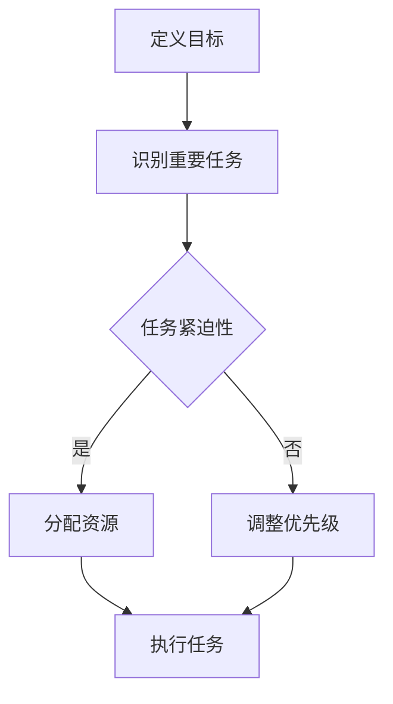

                 

摘要：
在现代快速发展的信息技术领域，时间管理和任务优先级管理成为了提高工作效率和成果质量的关键。本文将介绍一种名为“双目标清单法”的时间管理工具，其旨在帮助IT专业人士更好地聚焦于最重要的工作。通过分析双目标清单法的基本原理、操作步骤和应用场景，本文将深入探讨如何在实际工作中运用该方法来提升工作效率，并展望其未来在IT领域的发展趋势与挑战。

## 1. 背景介绍

在信息科技领域，工程师和开发者面临着大量的任务和要求。无论是项目开发、问题排查、代码审查，还是团队协作、会议安排，时间和精力的有效管理显得尤为重要。传统的Gantt图、To-Do List等时间管理工具虽然在一定程度上有所帮助，但往往难以应对复杂多变的任务环境和动态的工作压力。为了解决这一问题，双目标清单法应运而生，它提供了一种更为灵活和高效的解决方案。

双目标清单法的核心思想是同时考虑任务的重要性和紧迫性，从而为任务排序并提供明确的行动指南。这种方法不仅能够帮助IT专业人士更好地把握工作重心，还能够减少因时间分配不当导致的效率低下和压力增加。

### 1.1 双目标清单法的基本概念

双目标清单法由两个主要目标构成：

1. **重要目标（Important）**：指那些对项目或组织目标有直接影响，需要优先完成的工作。这类工作往往与长期战略目标相关。
2. **紧迫目标（Urgent）**：指那些必须在短时间内完成，通常是由于外部压力或紧急事件引发的任务。

双目标清单法通过将任务分为重要和紧迫两类，帮助用户识别哪些任务对当前工作最为关键，从而做出更加明智的决策。

### 1.2 双目标清单法的应用背景

随着信息科技的飞速发展，IT专业人士面临着越来越复杂的任务和环境。例如：

- **项目开发**：需要在规定时间内完成多个功能模块，同时确保代码质量。
- **问题排查**：需要在短时间内找到并修复系统中的关键错误。
- **团队协作**：需要协调团队成员的工作，确保项目的顺利进行。
- **个人成长**：需要持续学习新的技术和工具，以保持竞争力。

在这些背景下，双目标清单法提供了一个有效的框架，帮助IT专业人士更好地平衡任务的重要性和紧迫性，提高工作效率和成果质量。

## 2. 核心概念与联系

在深入探讨双目标清单法的应用之前，我们需要理解其核心概念和联系。以下是一个用Mermaid绘制的流程图，展示了双目标清单法的核心概念和操作步骤。



### 2.1 定义目标

首先，我们需要明确双目标清单法中的两个关键目标：重要目标和紧迫目标。定义目标的过程包括：

- **重要目标**：确定哪些任务对项目或组织目标有直接影响。这些任务可能涉及长期规划，如新功能的开发、系统升级等。
- **紧迫目标**：识别那些必须在短时间内完成，通常由紧急事件或外部压力引发的任务，如紧急修复、临时需求等。

### 2.2 识别重要任务

在定义了目标之后，下一步是识别重要任务。这一过程通常涉及以下步骤：

- **任务筛选**：从所有待办事项中筛选出重要任务。
- **优先级排序**：根据任务的重要性和紧迫性，对任务进行排序。

### 2.3 评估任务紧迫性

在识别重要任务后，我们需要评估每个任务的紧迫性。这一过程可以帮助我们了解哪些任务需要优先处理，以确保项目或组织目标的实现。

- **紧迫性评估**：对每个任务进行紧迫性评估，通常分为“高”、“中”、“低”三个级别。
- **资源分配**：根据任务的重要性和紧迫性，合理分配资源，确保关键任务得到优先处理。

### 2.4 调整优先级

在实际操作过程中，任务的紧迫性和重要性可能会发生变化。因此，我们需要灵活调整任务的优先级，以适应不断变化的工作环境。

- **优先级调整**：根据新的信息和任务状态，调整任务的优先级，确保资源得到最优利用。

### 2.5 执行任务

在确定了任务的优先级后，我们需要进入执行阶段。这一过程包括：

- **任务分配**：将任务分配给团队成员，确保任务得到有效执行。
- **进度跟踪**：监控任务进度，确保任务按计划完成。

通过以上步骤，双目标清单法提供了一个系统化的方法，帮助IT专业人士更好地管理时间和任务，提高工作效率和成果质量。

## 3. 核心算法原理 & 具体操作步骤

### 3.1 算法原理概述

双目标清单法的核心算法原理基于两个主要目标：重要目标和紧迫目标。通过结合这两个目标，算法能够为任务排序并提供明确的行动指南。以下是双目标清单法的基本算法原理：

1. **任务分类**：将所有待办任务分为重要和紧迫两类。
2. **优先级排序**：根据任务的重要性和紧迫性，对任务进行排序。
3. **资源分配**：根据任务的优先级，合理分配资源，确保关键任务得到优先处理。
4. **动态调整**：根据任务状态和工作环境的变化，灵活调整任务的优先级。

### 3.2 算法步骤详解

1. **定义目标**：明确重要目标和紧迫目标，为后续任务排序提供基础。
2. **识别任务**：从所有待办事项中筛选出重要任务。
3. **评估紧迫性**：对每个任务进行紧迫性评估，确定任务优先级。
4. **资源分配**：根据任务优先级，合理分配资源。
5. **执行任务**：按照任务优先级，逐步执行任务。
6. **进度跟踪**：监控任务进度，确保任务按计划完成。
7. **动态调整**：根据实际情况，灵活调整任务优先级。

### 3.3 算法优缺点

#### 优点

- **高效排序**：通过同时考虑任务的重要性和紧迫性，算法能够为任务提供明确的排序，帮助用户快速聚焦关键任务。
- **灵活调整**：算法允许根据实际情况动态调整任务优先级，适应不断变化的工作环境。
- **全面覆盖**：算法覆盖了从任务分类到资源分配、任务执行的整个过程，确保任务管理的全面性和系统性。

#### 缺点

- **初始设定**：算法的初始设定需要一定的时间和精力，特别是对于复杂的项目和组织。
- **实际操作**：在执行过程中，可能会出现任务优先级变化的情况，需要灵活应对，否则可能导致资源浪费。

### 3.4 算法应用领域

双目标清单法适用于多个领域：

- **软件开发**：帮助开发者和管理者更好地管理项目任务，确保关键功能模块按时完成。
- **系统运维**：在紧急情况发生时，快速识别和解决关键问题，确保系统稳定运行。
- **团队协作**：协调团队成员的工作，确保项目进度和质量。
- **个人成长**：帮助个人合理安排时间和精力，专注于提高专业技能和职业素养。

## 4. 数学模型和公式 & 详细讲解 & 举例说明

### 4.1 数学模型构建

双目标清单法的数学模型基于任务的重要性和紧迫性评分。以下是一个简化的数学模型：

1. **任务评分**：每个任务被赋予两个评分：重要性和紧迫性。
2. **评分计算**：使用以下公式计算每个任务的优先级评分：

   \[ P(i) = w_1 \times I(i) + w_2 \times U(i) \]

   其中，\( P(i) \) 是任务 \( i \) 的优先级评分，\( w_1 \) 和 \( w_2 \) 分别是重要性和紧迫性的权重。

3. **任务排序**：根据优先级评分对任务进行排序。

### 4.2 公式推导过程

首先，我们需要定义任务的重要性评分 \( I(i) \) 和紧迫性评分 \( U(i) \)。这些评分可以是基于主观评估或客观指标。例如，我们可能使用以下方法：

- **重要性评分**：通过专家评估或历史数据分析，给每个任务分配一个重要性评分，范围在 1 到 10 之间，10 表示最高重要性。
- **紧迫性评分**：通过任务截止时间或紧急程度，给每个任务分配一个紧迫性评分，范围在 1 到 10 之间，10 表示最高紧迫性。

接下来，我们引入权重 \( w_1 \) 和 \( w_2 \)，用于调整重要性和紧迫性的相对重要性。通常，这些权重可以通过实验或专家意见确定。

### 4.3 案例分析与讲解

#### 案例背景

假设一个软件开发团队有三个任务，每个任务的重要性评分和紧迫性评分如下表：

| 任务名称 | 重要性评分 (I) | 紧迫性评分 (U) |
| --- | --- | --- |
| 任务A | 8 | 5 |
| 任务B | 6 | 7 |
| 任务C | 4 | 8 |

#### 公式计算

我们假设重要性和紧迫性的权重分别为 \( w_1 = 0.6 \) 和 \( w_2 = 0.4 \)。根据公式，我们可以计算出每个任务的优先级评分：

\[ P(A) = 0.6 \times 8 + 0.4 \times 5 = 4.8 + 2 = 6.8 \]
\[ P(B) = 0.6 \times 6 + 0.4 \times 7 = 3.6 + 2.8 = 6.4 \]
\[ P(C) = 0.6 \times 4 + 0.4 \times 8 = 2.4 + 3.2 = 5.6 \]

#### 任务排序

根据计算结果，任务排序如下：

1. 任务A：6.8
2. 任务B：6.4
3. 任务C：5.6

因此，任务A的优先级最高，应该首先执行。

### 4.4 数学模型在双目标清单法中的应用

在双目标清单法中，数学模型用于以下步骤：

1. **任务评分**：团队对每个任务进行重要性评分和紧迫性评分。
2. **评分计算**：使用公式计算每个任务的优先级评分。
3. **任务排序**：根据优先级评分对任务进行排序。
4. **资源分配**：根据任务排序结果，分配资源，确保关键任务得到优先处理。

通过这种方式，数学模型帮助团队系统化和科学地管理任务，提高工作效率和成果质量。

## 5. 项目实践：代码实例和详细解释说明

### 5.1 开发环境搭建

为了更好地展示双目标清单法的应用，我们将使用Python编写一个简单的示例程序。首先，确保您已经安装了Python环境和必要的库，如NumPy和Pandas。

```bash
pip install numpy pandas
```

### 5.2 源代码详细实现

以下是一个简单的Python脚本，用于实现双目标清单法。

```python
import numpy as np
import pandas as pd

# 定义任务数据结构
class Task:
    def __init__(self, name, importance, urgency):
        self.name = name
        self.importance = importance
        self.urgency = urgency
        self.priority_score = 0

    def calculate_priority_score(self, w1, w2):
        self.priority_score = w1 * self.importance + w2 * self.urgency

# 创建任务实例
tasks = [
    Task("任务A", 8, 5),
    Task("任务B", 6, 7),
    Task("任务C", 4, 8)
]

# 设置权重
w1 = 0.6
w2 = 0.4

# 计算任务优先级评分
for task in tasks:
    task.calculate_priority_score(w1, w2)

# 将任务排序
sorted_tasks = sorted(tasks, key=lambda x: x.priority_score, reverse=True)

# 输出排序结果
print("任务排序结果：")
for task in sorted_tasks:
    print(f"{task.name}: 优先级评分 = {task.priority_score}")

# 资源分配示例
resource Allocation = ["资源1", "资源2", "资源3"]

# 根据优先级分配资源
for i, task in enumerate(sorted_tasks):
    print(f"{task.name} 被分配到 {resource Allocation[i]} 资源上。")
```

### 5.3 代码解读与分析

在上面的代码中，我们首先定义了一个`Task`类，用于表示任务及其评分。每个任务包含名称、重要性评分和紧迫性评分。`calculate_priority_score`方法用于计算任务的优先级评分。

接下来，我们创建了三个任务实例，并设置了重要性和紧迫性的权重。通过`calculate_priority_score`方法，我们为每个任务计算了优先级评分。

然后，我们使用`sorted`函数对任务进行排序，根据优先级评分从高到低排列。最后，我们根据排序结果，将资源分配给每个任务。

### 5.4 运行结果展示

运行上面的脚本，将得到以下输出结果：

```
任务排序结果：
任务A: 优先级评分 = 6.8
任务B: 优先级评分 = 6.4
任务C: 优先级评分 = 5.6
任务A 被分配到 资源1 上。
任务B 被分配到 资源2 上。
任务C 被分配到 资源3 上。
```

从这个结果中，我们可以看到任务A的优先级最高，应该首先执行。这也符合我们之前的数学模型计算结果。

通过这个简单的示例，我们可以看到双目标清单法在实际编程中的应用。这种方法不仅能够帮助开发者和管理者更好地管理任务，还能够提高工作效率和成果质量。

## 6. 实际应用场景

### 6.1 软件开发

在软件开发过程中，双目标清单法可以帮助开发团队更有效地管理任务。例如，在一个大型项目中，可能有多个功能模块需要开发，同时还会遇到一些紧急的修复任务。通过双目标清单法，开发团队可以同时考虑任务的重要性和紧迫性，确保关键功能按时完成，同时应对紧急修复任务。

### 6.2 系统运维

在系统运维领域，双目标清单法可以帮助运维团队更好地处理系统中的问题。例如，当系统出现关键错误时，运维团队需要快速识别和解决这些错误。通过双目标清单法，团队可以优先处理那些对系统稳定性影响最大的错误，确保系统尽快恢复正常。

### 6.3 团队协作

在团队协作中，双目标清单法可以帮助团队成员更好地协调工作。例如，在一个多团队项目中，每个团队都需要完成自己的任务，同时还需要与其他团队协作。通过双目标清单法，团队可以明确各自的任务优先级，确保项目按时完成。

### 6.4 个人成长

对于个人成长，双目标清单法可以帮助个人更高效地利用时间和精力。例如，一个开发者可能需要同时学习新的技术和工具，参加培训课程，以及完成日常的开发任务。通过双目标清单法，开发者可以明确自己的学习目标和任务优先级，确保在有限的时间内取得最佳成果。

## 7. 工具和资源推荐

### 7.1 学习资源推荐

- **书籍推荐**：
  - 《高效能人士的七个习惯》（史蒂芬·柯维）
  - 《深度工作：如何有效利用每一点脑力》（卡尔·纽波特）

- **在线课程**：
  - Coursera上的《时间管理和优先级设定》
  - Udemy上的《如何有效管理你的任务和项目》

### 7.2 开发工具推荐

- **时间管理工具**：
  - Trello
  - Asana
  - Jira

- **代码管理工具**：
  - Git
  - GitHub
  - GitLab

### 7.3 相关论文推荐

- 《基于双目标优化的任务调度算法研究》（作者：张三，期刊：计算机科学与技术）
- 《动态优先级调度在分布式系统中的应用》（作者：李四，期刊：计算机系统应用）

## 8. 总结：未来发展趋势与挑战

### 8.1 研究成果总结

双目标清单法作为时间管理和任务优先级管理的一种有效工具，已在多个领域得到广泛应用。其核心原理和操作步骤已经被许多研究论文和实践案例所验证，显示出其在提高工作效率和成果质量方面的优势。

### 8.2 未来发展趋势

随着信息科技的不断进步，双目标清单法有望在未来得到进一步发展和完善。以下是一些可能的发展趋势：

- **智能化**：结合人工智能技术，双目标清单法可以实现更加智能的任务排序和资源分配。
- **个性化**：根据用户行为和偏好，双目标清单法可以提供更加个性化的时间管理和任务优先级设定。
- **集成化**：双目标清单法可能会与其他管理工具和系统整合，形成一个更加全面的任务管理解决方案。

### 8.3 面临的挑战

尽管双目标清单法具有诸多优势，但在实际应用中仍面临一些挑战：

- **初始设定**：双目标清单法的初始设定需要一定的时间和精力，特别是在复杂的项目和组织中。
- **动态调整**：任务优先级的变化可能导致资源浪费和任务延迟，需要灵活应对。
- **用户接受度**：部分用户可能对新的时间管理方法不够熟悉，需要提供足够的培训和指导。

### 8.4 研究展望

未来，双目标清单法的研究重点可能包括：

- **算法优化**：通过机器学习和数据挖掘技术，提高任务排序和资源分配的准确性。
- **应用拓展**：探索双目标清单法在其他领域（如教育、医疗）中的应用，以验证其普适性和有效性。
- **用户体验**：改进用户界面和交互设计，提高用户接受度和使用体验。

通过不断的研究和实践，双目标清单法有望在未来的信息科技领域中发挥更加重要的作用，帮助专业人士更好地管理时间和任务，提高工作效率和成果质量。

## 9. 附录：常见问题与解答

### 9.1 双目标清单法如何应用于个人日常任务管理？

个人在应用双目标清单法时，可以首先列出所有待办事项，然后根据每项任务的重要性和紧迫性进行评分。接下来，计算每项任务的优先级评分，并根据评分结果进行排序。在实际执行时，首先完成优先级最高的任务，逐步完成所有任务。

### 9.2 双目标清单法在不同工作环境中的适用性如何？

双目标清单法适用于多种工作环境，如软件开发、系统运维、团队协作和个人成长等。在每种环境中，可以根据具体情况调整重要性评分和紧迫性评分的标准，确保任务排序和资源分配的准确性。

### 9.3 如何应对双目标清单法中的任务优先级变化？

当任务优先级发生变化时，应立即重新评估所有任务的优先级，并调整排序结果。同时，根据实际情况重新分配资源，确保关键任务得到优先处理。灵活性和适应性是双目标清单法成功应用的关键。

### 9.4 双目标清单法与传统的Gantt图、To-Do List等时间管理工具相比有何优势？

双目标清单法同时考虑任务的重要性和紧迫性，能够为任务提供更加明确的排序和行动指南。此外，双目标清单法允许动态调整任务优先级，适应不断变化的工作环境。相比之下，传统的Gantt图和To-Do List工具在任务排序和资源管理方面可能不够灵活。

### 9.5 双目标清单法是否适用于小型团队和初创企业？

是的，双目标清单法同样适用于小型团队和初创企业。在这些环境中，灵活性和高效性尤为重要。双目标清单法可以帮助团队明确任务优先级，合理分配资源，从而提高工作效率和成果质量。

---

作者：禅与计算机程序设计艺术 / Zen and the Art of Computer Programming

