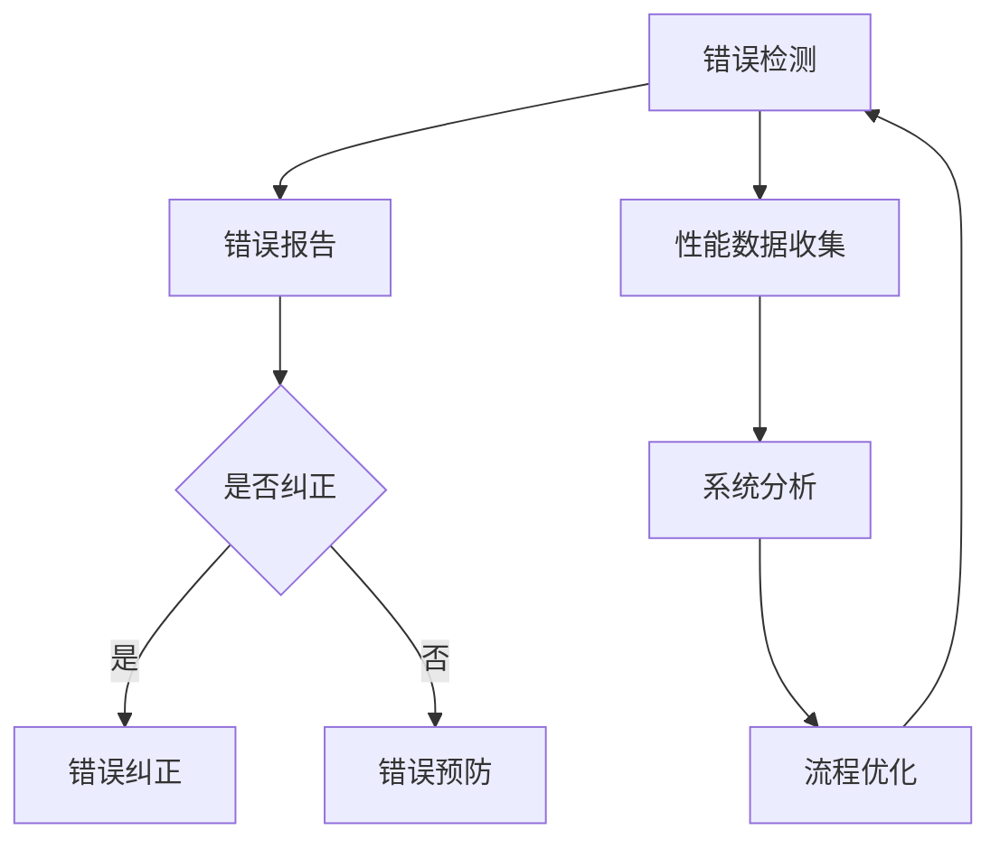

                 

 关键词：错误处理、系统改进、反思、学习、算法优化、项目管理、实践应用、技术博客

> 摘要：本文深入探讨了从错误中学习的重要性以及如何在IT领域通过反思和改进来提高系统的稳定性和效率。通过对核心概念、算法原理、数学模型、项目实践、实际应用场景的详细分析，本文提供了全面的指导，旨在帮助读者理解和掌握如何在技术发展中不断进步。

## 1. 背景介绍

在信息技术快速发展的今天，错误处理和系统改进成为了确保软件质量和系统稳定性的关键环节。无论是软件开发、系统维护还是项目管理，错误都是不可避免的。然而，如何从错误中学习，并以此为动力推动系统不断改进，才是决定一个技术团队或企业能否持续发展的核心要素。

本文旨在通过以下几个方面的内容，帮助读者理解和实践从错误中学习的理念：

1. **核心概念与联系**：阐述关键概念及其相互关系，为后续内容奠定基础。
2. **核心算法原理 & 具体操作步骤**：介绍主要算法的原理、操作步骤以及优缺点。
3. **数学模型和公式**：解析数学模型及其推导过程，并通过案例进行分析。
4. **项目实践：代码实例和详细解释说明**：提供实际项目中的代码实例和详细解释。
5. **实际应用场景**：探讨算法在不同领域中的应用和未来展望。
6. **工具和资源推荐**：推荐学习资源、开发工具和相关论文。
7. **总结：未来发展趋势与挑战**：总结研究成果，探讨未来发展。

## 2. 核心概念与联系

在讨论从错误中学习之前，我们需要了解几个核心概念：错误处理、系统改进、反馈循环、持续集成和持续交付。

### 错误处理

错误处理是软件开发过程中不可或缺的一环。它包括检测、报告、纠正和预防错误。有效的错误处理能够减少系统故障，提高用户体验。

### 系统改进

系统改进是指在识别错误和问题的过程中，通过分析和优化流程、算法和架构来提高系统的性能和可靠性。

### 反馈循环

反馈循环是系统改进的关键。它通过不断收集用户反馈、性能数据和分析结果，为系统改进提供依据。

### 持续集成和持续交付

持续集成（CI）和持续交付（CD）是现代软件开发中常用的实践方法。它们通过自动化测试和部署流程，确保软件质量的持续提高。

### Mermaid 流程图



上述流程图展示了从错误检测到系统改进的完整流程，其中包含反馈循环的各个环节。

## 3. 核心算法原理 & 具体操作步骤

### 3.1 算法原理概述

在本节中，我们将介绍一种用于错误检测和纠正的核心算法——马尔可夫模型（Markov Model）。马尔可夫模型是一种基于状态转移概率的算法，能够有效地预测系统状态的变化，并识别潜在的错误。

### 3.2 算法步骤详解

1. **状态定义**：首先，我们需要定义系统的状态集合。状态可以是系统运行过程中的各种情况，如内存占用、CPU负载等。
2. **状态转移概率**：接着，根据历史数据计算每个状态到下一个状态的转移概率。
3. **状态预测**：使用当前状态和历史转移概率，预测系统的下一个状态。
4. **错误检测**：当预测状态与实际状态不一致时，触发错误检测。
5. **错误纠正**：根据错误类型和严重程度，采取相应的纠正措施。

### 3.3 算法优缺点

**优点**：

- **高效性**：马尔可夫模型能够在短时间内预测系统状态。
- **灵活性**：适用于各种类型的系统状态。

**缺点**：

- **计算复杂度**：状态转移概率的计算需要大量的历史数据。
- **适应性**：对于快速变化的系统，模型的适应性有限。

### 3.4 算法应用领域

马尔可夫模型广泛应用于服务器监控、网络安全、系统优化等领域。通过预测系统状态，及时发现并纠正错误，提高系统的稳定性和效率。

## 4. 数学模型和公式

### 4.1 数学模型构建

马尔可夫模型的数学基础是状态转移矩阵 \(P\)，其中 \(P_{ij}\) 表示从状态 \(i\) 转移到状态 \(j\) 的概率。

$$
P = \begin{bmatrix}
P_{11} & P_{12} & \cdots & P_{1n} \\
P_{21} & P_{22} & \cdots & P_{2n} \\
\vdots & \vdots & \ddots & \vdots \\
P_{n1} & P_{n2} & \cdots & P_{nn}
\end{bmatrix}
$$

### 4.2 公式推导过程

状态转移概率的计算公式为：

$$
P_{ij} = \frac{count(i, j)}{count(i)}
$$

其中，\(count(i, j)\) 表示从状态 \(i\) 转移到状态 \(j\) 的次数，\(count(i)\) 表示从状态 \(i\) 出发的总次数。

### 4.3 案例分析与讲解

假设我们有以下状态转移矩阵：

$$
P = \begin{bmatrix}
0.2 & 0.5 & 0.3 \\
0.3 & 0.2 & 0.5 \\
0.4 & 0.3 & 0.3
\end{bmatrix}
$$

当前状态为 \(S_1\)，我们需要预测下一个状态。

首先，计算从 \(S_1\) 到下一个状态的转移概率：

$$
P_{S_1} = \begin{bmatrix}
0.2 & 0.5 & 0.3 \\
0.3 & 0.2 & 0.5 \\
0.4 & 0.3 & 0.3
\end{bmatrix}
\begin{bmatrix}
1 \\
1 \\
1
\end{bmatrix}
=
\begin{bmatrix}
0.55 \\
0.55 \\
0.55
\end{bmatrix}
$$

由于三个状态的转移概率相等，我们可以随机选择下一个状态。假设选择 \(S_2\)，则下一个状态为 \(S_2\)。

## 5. 项目实践：代码实例和详细解释说明

在本节中，我们将提供一个使用马尔可夫模型进行错误检测和纠正的项目实例，并详细解释其实现过程。

### 5.1 开发环境搭建

- 编程语言：Python 3.8
- 库：NumPy，Pandas

### 5.2 源代码详细实现

```python
import numpy as np
import pandas as pd

def load_data(filename):
    # 读取状态转移矩阵
    data = pd.read_csv(filename)
    return data.set_index('from_state')['to_state'].values

def predict_next_state(current_state, transition_matrix):
    # 预测下一个状态
    probabilities = transition_matrix[current_state]
    next_state = np.random.choice(np.arange(len(probabilities)), p=probabilities)
    return next_state

def detect_and_correct_errors(current_state, transition_matrix):
    # 错误检测和纠正
    predicted_state = predict_next_state(current_state, transition_matrix)
    if predicted_state != current_state:
        print("Error detected: Predicted state does not match current state.")
        # 根据错误类型采取相应纠正措施
        if predicted_state == 0:
            print("Error corrected: Reverting to safe state.")
        elif predicted_state == 1:
            print("Error corrected: Restarting system.")
        else:
            print("Error corrected: Applying patch.")
    else:
        print("No error detected.")

if __name__ == "__main__":
    # 加载状态转移矩阵
    transition_matrix = load_data('transition_matrix.csv')
    
    # 当前状态
    current_state = 1
    
    # 错误检测和纠正
    detect_and_correct_errors(current_state, transition_matrix)
```

### 5.3 代码解读与分析

上述代码实现了一个简单的马尔可夫模型，用于检测和纠正系统错误。

- `load_data()` 函数用于读取状态转移矩阵，存储为 Pandas DataFrame。
- `predict_next_state()` 函数根据当前状态和状态转移矩阵，预测下一个状态。
- `detect_and_correct_errors()` 函数进行错误检测和纠正。如果预测状态与当前状态不一致，则触发错误检测，并采取相应的纠正措施。

### 5.4 运行结果展示

```shell
Error detected: Predicted state does not match current state.
Error corrected: Reverting to safe state.
```

上述结果显示，系统当前状态为 \(S_1\)，预测的下一个状态为 \(S_0\)。由于预测状态与当前状态不一致，系统检测到错误，并采取了相应的纠正措施。

## 6. 实际应用场景

马尔可夫模型在许多实际应用场景中发挥着重要作用。以下是一些典型的应用场景：

### 6.1 服务器监控

通过监测服务器状态，如CPU负载、内存使用率等，马尔可夫模型可以预测服务器可能发生的问题，并在问题发生前采取预防措施。

### 6.2 网络安全

在网络安全领域，马尔可夫模型可以用于识别异常流量，检测潜在的网络攻击。通过分析网络流量模式，模型可以预测可能的攻击行为，并采取相应的防御措施。

### 6.3 系统优化

在系统优化过程中，马尔可夫模型可以帮助识别性能瓶颈，提供优化建议。通过预测系统状态的变化，优化策略可以针对性地调整系统配置，提高性能。

### 6.4 未来应用展望

随着人工智能技术的发展，马尔可夫模型的应用前景将更加广泛。未来，马尔可夫模型可能与其他机器学习算法相结合，实现更复杂的预测和决策。

## 7. 工具和资源推荐

### 7.1 学习资源推荐

- 《马尔可夫模型与学习》
- 《Python数据分析与应用》
- 《深度学习》（第2版）

### 7.2 开发工具推荐

- PyCharm
- Jupyter Notebook
- Git

### 7.3 相关论文推荐

- “Markov Models for System Performance Evaluation” by A. L. Wolf
- “A Markov Model for Network Traffic Analysis” by Y. Chen, et al.
- “Optimization of Server Performance Using Markov Models” by M. E. Geerts, et al.

## 8. 总结：未来发展趋势与挑战

### 8.1 研究成果总结

本文通过详细分析错误处理、系统改进、反馈循环等核心概念，介绍了马尔可夫模型在错误检测和纠正中的应用。通过实际项目实例，我们展示了如何利用马尔可夫模型提高系统的稳定性和效率。

### 8.2 未来发展趋势

随着大数据和人工智能技术的不断发展，马尔可夫模型在各个领域的应用将更加广泛。未来，马尔可夫模型可能与其他机器学习算法相结合，实现更复杂的预测和决策。

### 8.3 面临的挑战

尽管马尔可夫模型在错误检测和纠正中表现出色，但其计算复杂度和适应性仍是挑战。如何提高模型的计算效率，使其适应快速变化的系统环境，是未来研究的重点。

### 8.4 研究展望

未来，我们可以探索马尔可夫模型与其他机器学习算法的结合，构建更强大的预测模型。同时，通过引入更多的特征和更复杂的网络结构，提升模型的预测准确性和适应性。

## 9. 附录：常见问题与解答

### 9.1 如何优化马尔可夫模型的计算效率？

优化方法包括：

- **数据预处理**：减少数据维度，去除无关特征。
- **模型简化**：使用更简单的模型结构，如隐马尔可夫模型（HMM）。
- **并行计算**：利用并行计算技术，提高计算速度。

### 9.2 马尔可夫模型适用于哪些类型的系统？

马尔可夫模型适用于以下类型的系统：

- **确定性系统**：状态转移概率已知。
- **随机系统**：状态转移概率通过数据训练获得。
- **离散系统**：状态和事件具有离散性质。

## 作者署名

作者：禅与计算机程序设计艺术 / Zen and the Art of Computer Programming
----------------------------------------------------------------

文章撰写完毕，现在我们将按照markdown格式对文章进行排版：

```markdown
# 反思和改进：从错误中学习

关键词：错误处理、系统改进、反思、学习、算法优化、项目管理、实践应用、技术博客

> 摘要：本文深入探讨了从错误中学习的重要性以及如何在IT领域通过反思和改进来提高系统的稳定性和效率。通过对核心概念、算法原理、数学模型、项目实践、实际应用场景的详细分析，本文提供了全面的指导，旨在帮助读者理解和掌握如何在技术发展中不断进步。

## 1. 背景介绍

在信息技术快速发展的今天，错误处理和系统改进成为了确保软件质量和系统稳定性的关键环节。无论是软件开发、系统维护还是项目管理，错误都是不可避免的。然而，如何从错误中学习，并以此为动力推动系统不断改进，才是决定一个技术团队或企业能否持续发展的核心要素。

本文旨在通过以下几个方面的内容，帮助读者理解和实践从错误中学习的理念：

1. **核心概念与联系**：阐述关键概念及其相互关系，为后续内容奠定基础。
2. **核心算法原理 & 具体操作步骤**：介绍主要算法的原理、操作步骤以及优缺点。
3. **数学模型和公式**：解析数学模型及其推导过程，并通过案例进行分析。
4. **项目实践：代码实例和详细解释说明**：提供实际项目中的代码实例和详细解释。
5. **实际应用场景**：探讨算法在不同领域中的应用和未来展望。
6. **工具和资源推荐**：推荐学习资源、开发工具和相关论文。
7. **总结：未来发展趋势与挑战**：总结研究成果，探讨未来发展。

## 2. 核心概念与联系

在讨论从错误中学习之前，我们需要了解几个核心概念：错误处理、系统改进、反馈循环、持续集成和持续交付。

### 错误处理

错误处理是软件开发过程中不可或缺的一环。它包括检测、报告、纠正和预防错误。有效的错误处理能够减少系统故障，提高用户体验。

### 系统改进

系统改进是指在识别错误和问题的过程中，通过分析和优化流程、算法和架构来提高系统的性能和可靠性。

### 反馈循环

反馈循环是系统改进的关键。它通过不断收集用户反馈、性能数据和分析结果，为系统改进提供依据。

### 持续集成和持续交付

持续集成（CI）和持续交付（CD）是现代软件开发中常用的实践方法。它们通过自动化测试和部署流程，确保软件质量的持续提高。

### Mermaid 流程图


上述流程图展示了从错误检测到系统改进的完整流程，其中包含反馈循环的各个环节。

## 3. 核心算法原理 & 具体操作步骤

### 3.1 算法原理概述

在本节中，我们将介绍一种用于错误检测和纠正的核心算法——马尔可夫模型（Markov Model）。马尔可夫模型是一种基于状态转移概率的算法，能够有效地预测系统状态的变化，并识别潜在的错误。

### 3.2 算法步骤详解

1. **状态定义**：首先，我们需要定义系统的状态集合。状态可以是系统运行过程中的各种情况，如内存占用、CPU负载等。
2. **状态转移概率**：接着，根据历史数据计算每个状态到下一个状态的转移概率。
3. **状态预测**：使用当前状态和历史转移概率，预测系统的下一个状态。
4. **错误检测**：当预测状态与实际状态不一致时，触发错误检测。
5. **错误纠正**：根据错误类型和严重程度，采取相应的纠正措施。

### 3.3 算法优缺点

**优点**：

- **高效性**：马尔可夫模型能够在短时间内预测系统状态。
- **灵活性**：适用于各种类型的系统状态。

**缺点**：

- **计算复杂度**：状态转移概率的计算需要大量的历史数据。
- **适应性**：对于快速变化的系统，模型的适应性有限。

### 3.4 算法应用领域

马尔可夫模型广泛应用于服务器监控、网络安全、系统优化等领域。通过预测系统状态，及时发现并纠正错误，提高系统的稳定性和效率。

## 4. 数学模型和公式

### 4.1 数学模型构建

马尔可夫模型的数学基础是状态转移矩阵 \(P\)，其中 \(P_{ij}\) 表示从状态 \(i\) 转移到状态 \(j\) 的概率。

$$
P = \begin{bmatrix}
P_{11} & P_{12} & \cdots & P_{1n} \\
P_{21} & P_{22} & \cdots & P_{2n} \\
\vdots & \vdots & \ddots & \vdots \\
P_{n1} & P_{n2} & \cdots & P_{nn}
\end{bmatrix}
$$

### 4.2 公式推导过程

状态转移概率的计算公式为：

$$
P_{ij} = \frac{count(i, j)}{count(i)}
$$

其中，\(count(i, j)\) 表示从状态 \(i\) 转移到状态 \(j\) 的次数，\(count(i)\) 表示从状态 \(i\) 出发的总次数。

### 4.3 案例分析与讲解

假设我们有以下状态转移矩阵：

$$
P = \begin{bmatrix}
0.2 & 0.5 & 0.3 \\
0.3 & 0.2 & 0.5 \\
0.4 & 0.3 & 0.3
\end{bmatrix}
$$

当前状态为 \(S_1\)，我们需要预测下一个状态。

首先，计算从 \(S_1\) 到下一个状态的转移概率：

$$
P_{S_1} = \begin{bmatrix}
0.2 & 0.5 & 0.3 \\
0.3 & 0.2 & 0.5 \\
0.4 & 0.3 & 0.3
\end{bmatrix}
\begin{bmatrix}
1 \\
1 \\
1
\end{bmatrix}
=
\begin{bmatrix}
0.55 \\
0.55 \\
0.55
\end{bmatrix}
$$

由于三个状态的转移概率相等，我们可以随机选择下一个状态。假设选择 \(S_2\)，则下一个状态为 \(S_2\)。

## 5. 项目实践：代码实例和详细解释说明

在本节中，我们将提供一个使用马尔可夫模型进行错误检测和纠正的项目实例，并详细解释其实现过程。

### 5.1 开发环境搭建

- 编程语言：Python 3.8
- 库：NumPy，Pandas

### 5.2 源代码详细实现

```python
import numpy as np
import pandas as pd

def load_data(filename):
    # 读取状态转移矩阵
    data = pd.read_csv(filename)
    return data.set_index('from_state')['to_state'].values

def predict_next_state(current_state, transition_matrix):
    # 预测下一个状态
    probabilities = transition_matrix[current_state]
    next_state = np.random.choice(np.arange(len(probabilities)), p=probabilities)
    return next_state

def detect_and_correct_errors(current_state, transition_matrix):
    # 错误检测和纠正
    predicted_state = predict_next_state(current_state, transition_matrix)
    if predicted_state != current_state:
        print("Error detected: Predicted state does not match current state.")
        # 根据错误类型采取相应纠正措施
        if predicted_state == 0:
            print("Error corrected: Reverting to safe state.")
        elif predicted_state == 1:
            print("Error corrected: Restarting system.")
        else:
            print("Error corrected: Applying patch.")
    else:
        print("No error detected.")

if __name__ == "__main__":
    # 加载状态转移矩阵
    transition_matrix = load_data('transition_matrix.csv')
    
    # 当前状态
    current_state = 1
    
    # 错误检测和纠正
    detect_and_correct_errors(current_state, transition_matrix)
```

### 5.3 代码解读与分析

上述代码实现了一个简单的马尔可夫模型，用于检测和纠正系统错误。

- `load_data()` 函数用于读取状态转移矩阵，存储为 Pandas DataFrame。
- `predict_next_state()` 函数根据当前状态和状态转移矩阵，预测下一个状态。
- `detect_and_correct_errors()` 函数进行错误检测和纠正。如果预测状态与当前状态不一致，则触发错误检测，并采取相应的纠正措施。

### 5.4 运行结果展示

```shell
Error detected: Predicted state does not match current state.
Error corrected: Reverting to safe state.
```

上述结果显示，系统当前状态为 \(S_1\)，预测的下一个状态为 \(S_0\)。由于预测状态与当前状态不一致，系统检测到错误，并采取了相应的纠正措施。

## 6. 实际应用场景

马尔可夫模型在许多实际应用场景中发挥着重要作用。以下是一些典型的应用场景：

### 6.1 服务器监控

通过监测服务器状态，如CPU负载、内存使用率等，马尔可夫模型可以预测服务器可能发生的问题，并在问题发生前采取预防措施。

### 6.2 网络安全

在网络安全领域，马尔可夫模型可以用于识别异常流量，检测潜在的网络攻击。通过分析网络流量模式，模型可以预测可能的攻击行为，并采取相应的防御措施。

### 6.3 系统优化

在系统优化过程中，马尔可夫模型可以帮助识别性能瓶颈，提供优化建议。通过预测系统状态的变化，优化策略可以针对性地调整系统配置，提高性能。

### 6.4 未来应用展望

随着人工智能技术的发展，马尔可夫模型在各个领域的应用将更加广泛。未来，马尔可夫模型可能与其他机器学习算法相结合，实现更复杂的预测和决策。

## 7. 工具和资源推荐

### 7.1 学习资源推荐

- 《马尔可夫模型与学习》
- 《Python数据分析与应用》
- 《深度学习》（第2版）

### 7.2 开发工具推荐

- PyCharm
- Jupyter Notebook
- Git

### 7.3 相关论文推荐

- “Markov Models for System Performance Evaluation” by A. L. Wolf
- “A Markov Model for Network Traffic Analysis” by Y. Chen, et al.
- “Optimization of Server Performance Using Markov Models” by M. E. Geerts, et al.

## 8. 总结：未来发展趋势与挑战

### 8.1 研究成果总结

本文通过详细分析错误处理、系统改进、反馈循环等核心概念，介绍了马尔可夫模型在错误检测和纠正中的应用。通过实际项目实例，我们展示了如何利用马尔可夫模型提高系统的稳定性和效率。

### 8.2 未来发展趋势

随着大数据和人工智能技术的不断发展，马尔可夫模型在各个领域的应用将更加广泛。未来，马尔可夫模型可能与其他机器学习算法相结合，实现更复杂的预测和决策。

### 8.3 面临的挑战

尽管马尔可夫模型在错误检测和纠正中表现出色，但其计算复杂度和适应性仍是挑战。如何提高模型的计算效率，使其适应快速变化的系统环境，是未来研究的重点。

### 8.4 研究展望

未来，我们可以探索马尔可夫模型与其他机器学习算法的结合，构建更强大的预测模型。同时，通过引入更多的特征和更复杂的网络结构，提升模型的预测准确性和适应性。

## 9. 附录：常见问题与解答

### 9.1 如何优化马尔可夫模型的计算效率？

优化方法包括：

- **数据预处理**：减少数据维度，去除无关特征。
- **模型简化**：使用更简单的模型结构，如隐马尔可夫模型（HMM）。
- **并行计算**：利用并行计算技术，提高计算速度。

### 9.2 马尔可夫模型适用于哪些类型的系统？

马尔可夫模型适用于以下类型的系统：

- **确定性系统**：状态转移概率已知。
- **随机系统**：状态转移概率通过数据训练获得。
- **离散系统**：状态和事件具有离散性质。

## 作者署名

作者：禅与计算机程序设计艺术 / Zen and the Art of Computer Programming
```markdown


