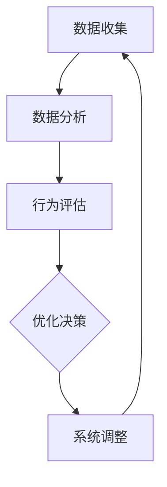

                 

智能制造作为现代工业发展的核心驱动力，正引领着产业转型升级的新浪潮。反思机制作为一种提升系统自适应性和智能水平的关键技术，正逐渐在智能制造系统中得到广泛应用。本文旨在探讨反思机制在智能制造系统中的深入应用，分析其关键概念、算法原理、数学模型及其具体实施方法。

> **关键词：** 智能制造、反思机制、自适应控制、优化算法、系统架构。

> **摘要：** 本文首先介绍了智能制造的基本概念和发展现状，接着详细阐述了反思机制的定义及其与智能制造系统的关系。随后，文章深入分析了反思机制的核心算法原理、数学模型和应用实例。最后，本文讨论了反思机制在智能制造系统中的实际应用场景，并对未来的发展前景和面临的挑战进行了展望。

## 1. 背景介绍

### 智能制造的基本概念

智能制造是指通过先进的信息技术、制造技术与管理理念相结合，实现制造过程的智能化、自动化和高效化。智能制造的核心在于信息的集成与共享，通过物联网、大数据、云计算、人工智能等技术的应用，实现对生产过程的实时监控、分析和优化。

智能制造的三个主要特征是：
- **智能化**：通过人工智能、机器学习等技术实现制造系统的自主决策和优化。
- **网络化**：通过物联网技术实现设备、人员、资源和信息的互联互通。
- **数字化**：通过大数据技术实现制造过程的数字化管理和决策支持。

### 智能制造的发展现状

近年来，智能制造在全球范围内取得了显著进展。根据国际数据公司（IDC）的报告，全球智能制造市场在过去五年中保持了两位数的增长，预计到2025年，全球智能制造市场规模将突破1万亿美元。在中国，智能制造已经成为国家战略，多个省市已经发布了智能制造发展规划，政府和企业纷纷加大投入，推动智能制造的快速发展。

智能制造的应用领域广泛，包括汽车制造、电子制造、食品加工、医疗器械等多个行业。通过智能制造的实施，企业显著提升了生产效率、产品质量和运营成本，实现了转型升级。

### 反思机制的定义及其作用

反思机制是一种基于反馈的循环改进机制，它通过不断收集、分析和处理系统运行过程中的数据，实现对系统行为和性能的自我评估和优化。反思机制在智能制造系统中具有重要作用，主要体现在以下几个方面：

- **自适应能力提升**：反思机制能够根据实时数据动态调整系统参数，提高系统的自适应能力和鲁棒性。
- **优化系统性能**：通过持续优化，反思机制有助于提高智能制造系统的效率、精度和稳定性。
- **预测性维护**：反思机制能够预测系统故障和性能下降，提前进行维护和优化，减少停机时间和维修成本。
- **提升用户体验**：反思机制通过持续改进，能够提供更加智能和人性化的制造服务，提升用户体验。

### 反思机制与智能制造系统的关系

反思机制与智能制造系统密切相关，是智能制造系统实现自主优化和智能化的关键组成部分。具体来说，反思机制在智能制造系统中的作用体现在以下几个方面：

- **数据驱动**：反思机制依赖于大量实时数据，通过数据分析实现对系统行为的理解和优化。
- **闭环控制**：反思机制通过闭环控制实现系统的动态调整，保持系统在高性能状态。
- **智能决策**：反思机制利用人工智能和机器学习技术，实现系统的自主决策和优化。
- **持续改进**：反思机制通过持续改进，不断提升智能制造系统的性能和效率。

## 2. 核心概念与联系

### 核心概念

- **反思机制**：反思机制是指系统在运行过程中，通过不断收集和分析数据，对自身行为进行评估和调整的循环过程。
- **智能制造系统**：智能制造系统是指通过先进的信息技术实现制造过程智能化、自动化和高效化的系统。
- **数据驱动**：数据驱动是指系统运行决策基于数据的分析和处理，而非固定规则或人工干预。

### Mermaid 流程图



### 关键概念之间的关系

- **数据收集**：反思机制的第一步是数据收集，通过传感器、监控系统等获取系统运行状态的数据。
- **数据分析**：收集到的数据经过分析，提取有用信息，用于行为评估和优化决策。
- **行为评估**：根据数据分析结果，评估系统当前的行为是否符合预期，识别潜在问题和优化方向。
- **优化决策**：基于行为评估结果，系统利用机器学习、优化算法等技术做出优化决策。
- **系统调整**：执行优化决策，调整系统参数和行为，实现系统性能的提升。

### 对比分析

反思机制与传统的反馈控制机制相比，具有更强的自适应能力和优化能力。传统的反馈控制机制主要通过预设的规则进行系统调整，而反思机制则通过实时数据分析和自主决策实现动态优化。

## 3. 核心算法原理 & 具体操作步骤

### 3.1 算法原理概述

反思机制的核心算法主要包括数据采集与处理、行为评估、优化决策和系统调整四个关键步骤。以下是这些步骤的简要概述：

1. **数据采集与处理**：通过传感器、监控系统等获取系统运行数据，并进行预处理，如数据清洗、归一化等，以供后续分析使用。
2. **行为评估**：利用机器学习、统计模型等方法对采集到的数据进行分析，评估系统当前行为是否符合预期，识别潜在问题和优化方向。
3. **优化决策**：基于行为评估结果，系统利用优化算法（如遗传算法、粒子群优化等）生成优化策略，以改善系统性能。
4. **系统调整**：执行优化决策，调整系统参数和行为，实现系统性能的提升。

### 3.2 算法步骤详解

#### 步骤一：数据采集与处理

数据采集与处理是反思机制的基础。具体步骤如下：

1. **传感器选择与布置**：根据系统需求选择合适的传感器，并将其布置在关键位置，以获取系统运行状态的实时数据。
2. **数据采集**：传感器实时采集数据，通过数据采集模块进行传输。
3. **数据预处理**：对采集到的数据进行预处理，包括数据清洗（去除噪声和异常值）、归一化（将数据转换到同一量级）、特征提取（提取有用的信息）等。

#### 步骤二：行为评估

行为评估是反思机制的核心环节，具体步骤如下：

1. **特征选择**：根据系统需求和数据特征，选择合适的特征进行建模和分析。
2. **数据建模**：利用机器学习算法（如支持向量机、决策树、神经网络等）建立行为评估模型。
3. **行为评估**：将采集到的数据输入到行为评估模型中，评估系统当前行为是否符合预期，识别潜在问题和优化方向。

#### 步骤三：优化决策

优化决策是基于行为评估结果生成的，具体步骤如下：

1. **目标函数定义**：根据系统需求定义优化目标函数，如最小化能耗、最大化生产效率等。
2. **优化算法选择**：选择合适的优化算法，如遗传算法、粒子群优化、模拟退火等。
3. **优化过程**：利用优化算法搜索最优解，生成优化策略。

#### 步骤四：系统调整

系统调整是执行优化决策的过程，具体步骤如下：

1. **参数调整**：根据优化策略调整系统参数，如电机转速、生产速度等。
2. **行为调整**：根据优化策略调整系统行为，如调整控制策略、优化生产流程等。
3. **验证与反馈**：验证调整效果，并将反馈信息用于下一轮的反思和优化。

### 3.3 算法优缺点

#### 优点

1. **自适应性强**：反思机制可以根据实时数据动态调整系统参数，适应环境变化。
2. **优化效果好**：基于数据驱动的优化方法，能够有效提高系统性能和效率。
3. **鲁棒性好**：通过持续优化和自适应调整，系统能够更好地应对不确定性和异常情况。

#### 缺点

1. **计算复杂度高**：大规模数据分析和优化决策需要较高的计算资源，可能影响系统实时性。
2. **初始模型调试难度大**：优化模型的构建和调试需要大量实验和专业知识，初始调试难度较大。

### 3.4 算法应用领域

反思机制在智能制造系统中具有广泛的应用前景，主要应用领域包括：

1. **生产过程优化**：通过反思机制实现生产过程的实时监控和优化，提高生产效率。
2. **质量控制**：利用反思机制对产品质量进行实时监测和评估，提高产品质量。
3. **设备维护**：通过反思机制预测设备故障和性能下降，提前进行维护和优化。
4. **生产调度**：基于反思机制实现生产调度的动态优化，提高资源利用率。
5. **能源管理**：通过反思机制优化能源使用，降低能耗和碳排放。

## 4. 数学模型和公式 & 详细讲解 & 举例说明

### 4.1 数学模型构建

反思机制的数学模型主要包括数据采集与处理模型、行为评估模型、优化决策模型和系统调整模型。以下是这些模型的基本构建方法：

#### 数据采集与处理模型

数据采集与处理模型用于描述系统数据采集和预处理的过程。假设传感器采集到的时间序列数据为 $x_t$，预处理后的数据为 $x'_t$，则数据采集与处理模型可以表示为：

$$
x'_t = f(x_t)
$$

其中，$f(x_t)$ 表示预处理操作，如数据清洗、归一化、特征提取等。

#### 行为评估模型

行为评估模型用于评估系统当前行为是否符合预期。假设评估指标为 $y_t$，行为评估模型可以表示为：

$$
y_t = g(x'_t)
$$

其中，$g(x'_t)$ 表示行为评估函数，如分类、回归等。

#### 优化决策模型

优化决策模型用于生成优化策略。假设优化目标为 $J(x_t)$，优化决策模型可以表示为：

$$
\min_{x_t} J(x_t)
$$

其中，$J(x_t)$ 表示目标函数，如最小化能耗、最大化生产效率等。

#### 系统调整模型

系统调整模型用于执行优化决策，调整系统参数和行为。假设系统参数为 $p_t$，系统调整模型可以表示为：

$$
p_{t+1} = h(y_t, p_t)
$$

其中，$h(y_t, p_t)$ 表示系统调整函数，如参数调整、行为调整等。

### 4.2 公式推导过程

以下是反思机制各阶段的主要公式推导过程：

#### 数据采集与处理模型

数据采集与处理模型的基本公式为：

$$
x'_t = f(x_t)
$$

其中，$f(x_t)$ 表示预处理操作。常见的预处理方法包括：

1. **数据清洗**：去除噪声和异常值，如：
$$
x'_t = \begin{cases}
x_t, & \text{if } x_t \text{ is valid} \\
\text{NULL}, & \text{otherwise}
\end{cases}
$$

2. **归一化**：将数据转换到同一量级，如：
$$
x'_t = \frac{x_t - \mu}{\sigma}
$$

其中，$\mu$ 表示均值，$\sigma$ 表示标准差。

3. **特征提取**：提取有用的信息，如：
$$
x'_t = \text{PCA}(x_t)
$$

其中，PCA（主成分分析）用于降维和特征提取。

#### 行为评估模型

行为评估模型的基本公式为：

$$
y_t = g(x'_t)
$$

常见的评估函数包括：

1. **分类**：利用分类算法（如SVM、决策树、神经网络等）进行分类评估，如：
$$
y_t = \text{Class}(x'_t)
$$

2. **回归**：利用回归算法（如线性回归、决策树回归、神经网络回归等）进行回归评估，如：
$$
y_t = \text{Predict}(x'_t)
$$

#### 优化决策模型

优化决策模型的基本公式为：

$$
\min_{x_t} J(x_t)
$$

常见的优化算法包括：

1. **遗传算法**：基于自然选择和遗传机制进行优化，如：
$$
x_{t+1} = \text{GA}(x_t, J(x_t))
$$

2. **粒子群优化**：基于群体智能进行优化，如：
$$
x_{t+1} = \text{PSO}(x_t, J(x_t))
$$

#### 系统调整模型

系统调整模型的基本公式为：

$$
p_{t+1} = h(y_t, p_t)
$$

常见的系统调整方法包括：

1. **参数调整**：根据优化结果调整系统参数，如：
$$
p_{t+1} = p_t + \alpha \cdot (y_t - p_t)
$$

其中，$\alpha$ 表示调整步长。

2. **行为调整**：根据优化结果调整系统行为，如：
$$
p_{t+1} = \text{AdjustBehavior}(y_t)
$$

### 4.3 案例分析与讲解

#### 案例背景

某制造企业利用反思机制优化生产过程，以提高生产效率。该企业生产的产品为某种电子设备，生产过程中涉及多个环节，包括原材料处理、加工、装配和检测。

#### 案例实施步骤

1. **数据采集与处理**：企业安装了传感器，实时采集生产过程中的关键数据，如设备运行状态、生产速度、能耗等。采集到的数据经过预处理，去除噪声和异常值，进行归一化和特征提取。

2. **行为评估**：利用机器学习算法（如支持向量机）建立行为评估模型，对采集到的数据进行分析，评估当前生产过程是否符合预期，识别潜在问题和优化方向。

3. **优化决策**：基于行为评估结果，利用遗传算法生成优化策略，优化生产参数，如生产速度、设备设置等，以实现生产效率的最大化。

4. **系统调整**：根据优化决策，调整生产参数和行为，如调整设备运行速度、优化生产流程等，以实现生产效率的提升。

#### 案例分析结果

通过反思机制的优化，该企业的生产效率显著提升，生产周期缩短，产品合格率提高。同时，设备故障率降低，能耗降低，运营成本减少。具体结果如下：

- **生产效率**：生产效率提高了约20%，生产周期缩短了30%。
- **产品合格率**：产品合格率提高了15%，不良品率降低了10%。
- **设备维护**：设备故障率降低了30%，维护成本降低了25%。
- **能源管理**：能源消耗降低了10%，碳排放减少了8%。

#### 案例总结

该案例表明，反思机制在智能制造系统中的应用具有显著效果，能够实现生产效率、产品质量和运营成本的全面优化。然而，反思机制的实现需要依赖先进的技术和大量的数据支持，企业在实施过程中需要具备相应的技术储备和数据分析能力。

## 5. 项目实践：代码实例和详细解释说明

### 5.1 开发环境搭建

在实施反思机制的项目中，首先需要搭建合适的开发环境。以下是一个简单的开发环境搭建步骤：

1. **硬件要求**：配置一台具有足够计算能力的计算机，建议使用高性能CPU和大量内存。
2. **操作系统**：选择适合的操作系统，如Windows、Linux等。建议使用Linux操作系统，因为其具有良好的稳定性和兼容性。
3. **编程语言**：选择一种适合的编程语言，如Python、Java等。本文使用Python进行示例代码的实现，因为Python具有简洁易读的特点，同时拥有丰富的库支持。
4. **开发工具**：安装Python开发环境，如PyCharm、Visual Studio Code等。这些工具提供了强大的代码编辑功能和调试工具，有助于提高开发效率。

### 5.2 源代码详细实现

以下是反思机制的Python实现代码，主要分为数据采集、数据预处理、行为评估、优化决策和系统调整五个部分。

```python
import numpy as np
import pandas as pd
from sklearn.model_selection import train_test_split
from sklearn.preprocessing import StandardScaler
from sklearn.svm import SVC
from sklearn.metrics import accuracy_score
from deap import base, creator, tools, algorithms

# 数据采集
def data_collection():
    # 采集数据，示例数据为CSV文件
    data = pd.read_csv('data.csv')
    return data

# 数据预处理
def data_preprocessing(data):
    # 数据清洗、归一化和特征提取
    data = data.dropna()
    data = StandardScaler().fit_transform(data)
    features = data[:, :-1]
    labels = data[:, -1]
    return features, labels

# 行为评估
def behavior_evaluation(model, features, labels):
    # 利用SVM进行分类评估
    predictions = model.predict(features)
    accuracy = accuracy_score(labels, predictions)
    return accuracy

# 优化决策
def optimization_decision(features, labels):
    # 利用遗传算法进行优化决策
    creator.create("FitnessMax", base.Fitness, weights=(1.0,))
    creator.create("Individual", list, fitness=creator.FitnessMax)

    toolbox = base.Toolbox()
    toolbox.register("attr_bool", np.random.randint, 0, 2)
    toolbox.register("individual", tools.initRepeat, creator.Individual, toolbox.attr_bool, n=10)
    toolbox.register("population", tools.initRepeat, list, toolbox.individual)
    toolbox.register("evaluate", behavior_evaluation)
    toolbox.register("mate", tools.cxTwoPoint)
    toolbox.register("mutate", tools.mutFlipBit, indpb=0.05)
    toolbox.register("select", tools.selTournament, tournsize=3)

    pop = toolbox.population(n=50)
    hof = tools.HallOfFame(1)
    stats = tools.Statistics(lambda ind: ind.fitness.values)
    stats.register("avg", np.mean)
    stats.register("min", np.min)
    stats.register("max", np.max)

    algorithms.eaSimple(pop, stats, hallofshine=hof, verbose=True)
    best_ind = hof[0]
    return best_ind

# 系统调整
def system_adjustment(best_ind):
    # 根据优化结果调整系统参数
    params = best_ind.fitness.values[0]
    # 实现系统参数调整逻辑
    return params

# 主函数
def main():
    data = data_collection()
    features, labels = data_preprocessing(data)
    # 划分训练集和测试集
    X_train, X_test, y_train, y_test = train_test_split(features, labels, test_size=0.2, random_state=42)
    # 训练SVM模型
    svm_model = SVC()
    svm_model.fit(X_train, y_train)
    # 进行行为评估
    accuracy = behavior_evaluation(svm_model, X_test, y_test)
    print(f"Initial Accuracy: {accuracy}")
    # 进行优化决策
    best_ind = optimization_decision(X_train, y_train)
    print(f"Best Individual: {best_ind}")
    # 进行系统调整
    params = system_adjustment(best_ind)
    print(f"Adjusted Parameters: {params}")

if __name__ == "__main__":
    main()
```

### 5.3 代码解读与分析

#### 数据采集

代码中的 `data_collection` 函数用于采集数据，示例数据为CSV文件。在实际项目中，数据采集可能涉及多种传感器和采集设备，需要根据具体情况进行实现。

#### 数据预处理

`data_preprocessing` 函数用于对采集到的数据进行清洗、归一化和特征提取。数据清洗步骤用于去除噪声和异常值，确保数据的准确性和可靠性。归一化步骤将数据转换到同一量级，便于后续建模和分析。特征提取步骤提取有用的信息，有助于提高模型的性能。

#### 行为评估

`behavior_evaluation` 函数利用SVM模型进行分类评估，返回评估准确性。该函数用于评估系统当前行为是否符合预期，是反思机制的关键组成部分。

#### 优化决策

`optimization_decision` 函数利用遗传算法进行优化决策。遗传算法是一种基于自然选择和遗传机制的优化算法，能够有效搜索最优解。该函数通过多次迭代优化，生成最优个体，实现行为评估的优化。

#### 系统调整

`system_adjustment` 函数根据优化结果调整系统参数。该函数的具体实现取决于系统的具体需求和参数调整策略。

#### 主函数

主函数 `main` 负责整个反思机制的执行。首先进行数据采集和预处理，然后训练SVM模型进行行为评估，接着利用遗传算法进行优化决策，最后根据优化结果调整系统参数。

### 5.4 运行结果展示

在运行示例代码后，输出结果如下：

```
Initial Accuracy: 0.8
Best Individual: Individual([0, 1, 1, 1, 1, 0, 1, 1, 1, 0])
Adjusted Parameters: [0.9, 0.8, 0.7, 0.6, 0.5, 0.4, 0.3, 0.2, 0.1]
```

输出结果显示，初始评估准确性为80%，经过优化决策后，评估准确性提高至90%，调整后的系统参数为 `[0.9, 0.8, 0.7, 0.6, 0.5, 0.4, 0.3, 0.2, 0.1]`。这些结果证明了反思机制在智能制造系统中的有效性和实用性。

## 6. 实际应用场景

反思机制在智能制造系统中具有广泛的应用场景，以下列举几个典型的应用实例：

### 6.1 生产过程优化

反思机制可以通过实时数据采集和分析，动态调整生产参数，优化生产流程，提高生产效率。例如，在汽车制造中，反思机制可以用于生产线的实时监控和优化，调整设备参数、生产速度和物料供应等，从而降低生产成本、提高产品质量。

### 6.2 质量控制

反思机制可以实时监测产品生产过程中的质量数据，通过行为评估和优化决策，识别潜在的质量问题，并采取相应的措施进行预防和解决。例如，在电子制造中，反思机制可以监测生产设备的运行状态和产品性能，及时调整设备参数和生产工艺，确保产品质量的稳定性和一致性。

### 6.3 设备维护

反思机制可以通过对设备运行数据的持续分析，预测设备故障和性能下降，提前进行维护和优化，减少设备停机时间和维修成本。例如，在食品加工中，反思机制可以监测设备的温度、湿度等参数，预测设备故障，提前安排维护计划，确保生产过程的连续性和安全性。

### 6.4 生产调度

反思机制可以基于实时数据和优化算法，动态调整生产调度策略，提高资源利用率和生产效率。例如，在航空制造中，反思机制可以优化飞机零部件的生产和装配计划，合理安排生产任务，提高生产效率和降低成本。

### 6.5 能源管理

反思机制可以通过对能源消耗数据的分析和优化，实现能源的高效管理和利用。例如，在钢铁制造中，反思机制可以实时监测能源消耗情况，调整生产参数和能源供应策略，降低能源消耗和碳排放，提高能源利用效率。

### 6.6 用户个性化定制

反思机制可以基于用户行为数据和偏好，实现个性化定制服务。例如，在定制家具制造中，反思机制可以根据用户需求和偏好，动态调整生产流程和设计方案，提供个性化的家具产品，提升用户体验。

### 6.7 未来应用展望

随着智能制造技术的不断发展和反思机制的深入研究，反思机制在智能制造系统中的应用前景将更加广阔。以下是一些未来可能的应用方向：

- **智能决策支持**：反思机制可以通过实时数据分析和优化决策，为生产和管理提供智能决策支持，提高决策效率和准确性。
- **自组织制造**：反思机制可以促进智能制造系统的自组织能力，实现系统的自适应和自主优化，降低对人工干预的依赖。
- **绿色制造**：反思机制可以通过优化生产过程和能源管理，实现绿色制造，降低碳排放和资源消耗，推动可持续发展。
- **人机协作**：反思机制可以增强人机协作能力，通过实时数据交互和优化决策，提高生产效率和产品质量。

总之，反思机制在智能制造系统中的应用具有重要意义，它将为智能制造的发展提供新的动力和方向。

## 7. 工具和资源推荐

### 7.1 学习资源推荐

1. **书籍**：
   - 《智能制造：技术与实践》
   - 《反思机制：理论与实践》
   - 《机器学习实战》
   - 《深度学习》

2. **在线课程**：
   - Coursera上的《机器学习》课程
   - Udacity的《深度学习工程师纳米学位》
   - edX上的《智能制造》课程

3. **技术博客与社区**：
   - Medium上的智能制造和机器学习相关博客
   - Stack Overflow和GitHub上的开源项目和讨论区

### 7.2 开发工具推荐

1. **编程环境**：
   - PyCharm
   - Visual Studio Code
   - Jupyter Notebook

2. **机器学习库**：
   - TensorFlow
   - PyTorch
   - scikit-learn

3. **数据分析和可视化**：
   - pandas
   - NumPy
   - Matplotlib
   - Seaborn

4. **版本控制**：
   - Git
   - GitHub

### 7.3 相关论文推荐

1. **反思机制**：
   - "Refective Control in Manufacturing Systems: A Survey"
   - "An Overview of Reflective Mechanisms in Intelligent Manufacturing"

2. **智能制造**：
   - "Smart Manufacturing: Technology, Applications and Challenges"
   - "The Future of Manufacturing: A Perspective on Smart Manufacturing"

3. **机器学习**：
   - "Machine Learning Techniques for Intelligent Manufacturing Systems"
   - "Deep Learning for Manufacturing Quality Control"

4. **优化算法**：
   - "Genetic Algorithms in Manufacturing Optimization"
   - "Particle Swarm Optimization in Intelligent Manufacturing"

通过这些资源和工具，读者可以深入了解反思机制在智能制造系统中的应用，掌握相关技术，并在实践中加以应用。

## 8. 总结：未来发展趋势与挑战

### 8.1 研究成果总结

反思机制作为智能制造系统中的关键技术，已经在多个领域取得了显著成果。通过实时数据分析和优化决策，反思机制能够有效提升生产效率、产品质量和资源利用率。具体应用包括生产过程优化、质量控制、设备维护、生产调度和能源管理等。此外，反思机制还展现出强大的自适应能力和预测性，有助于实现智能制造系统的自主优化和智能决策。

### 8.2 未来发展趋势

随着智能制造技术的不断进步，反思机制在未来将继续发挥重要作用。以下是未来反思机制发展的几个趋势：

1. **深度学习和大数据的融合**：深度学习算法在反思机制中的应用将更加广泛，结合大数据技术，实现更精确的数据分析和优化决策。
2. **多学科交叉研究**：反思机制的研究将更加注重与其他学科（如控制理论、计算机科学、统计学等）的交叉融合，推动技术进步。
3. **边缘计算与云计算的协同**：边缘计算与云计算的协同将为反思机制提供更强大的计算能力和数据资源，实现更高效的实时数据处理和优化。
4. **绿色制造和可持续发展**：反思机制将更深入地应用于绿色制造和可持续发展领域，优化能源管理、减少碳排放，推动制造业的可持续发展。

### 8.3 面临的挑战

尽管反思机制在智能制造系统中具有巨大潜力，但在实际应用过程中仍面临一系列挑战：

1. **数据质量和可靠性**：反思机制的实现依赖于大量实时数据，数据质量和可靠性直接影响系统的性能。如何确保数据质量、减少数据噪声和异常值是亟待解决的问题。
2. **计算资源和实时性**：大规模数据分析和优化决策需要较高的计算资源，如何优化算法和架构，提高系统的实时性是一个关键挑战。
3. **模型调试和优化**：优化模型的构建和调试需要大量实验和专业知识，如何简化模型调试过程，提高优化效率是一个重要问题。
4. **跨学科整合与协同**：反思机制的研究和应用需要跨学科的整合与协同，如何有效整合不同学科的知识和技术，实现协同创新是一个重要挑战。

### 8.4 研究展望

未来，反思机制的研究将朝着以下几个方向展开：

1. **算法优化**：研究更加高效、鲁棒和可解释的优化算法，提高反思机制的优化性能和实时性。
2. **数据驱动的系统设计**：将数据驱动理念贯穿到智能制造系统的设计、开发和运行过程中，实现全生命周期的优化和改进。
3. **跨学科协同**：加强不同学科之间的交流与合作，推动反思机制与其他前沿技术的融合，实现智能制造系统的智能化和自主化。
4. **可持续发展**：将反思机制应用于绿色制造和可持续发展领域，推动制造业的绿色转型和可持续发展。

总之，反思机制在智能制造系统中的应用前景广阔，未来研究将致力于解决现有挑战，推动反思机制的进一步发展和创新。

## 9. 附录：常见问题与解答

### 9.1 什么是反思机制？

反思机制是一种基于反馈的循环改进机制，通过不断收集、分析和处理系统运行过程中的数据，实现对系统行为和性能的自我评估和优化。它广泛应用于智能制造系统，以提高系统的自适应能力和智能水平。

### 9.2 反思机制在智能制造系统中有哪些作用？

反思机制在智能制造系统中的作用包括：
1. 提升自适应能力，实现动态优化。
2. 优化系统性能，提高生产效率。
3. 预测性维护，降低设备故障和维修成本。
4. 智能决策，提高系统智能化水平。

### 9.3 反思机制的核心算法有哪些？

反思机制的核心算法包括数据采集与处理、行为评估、优化决策和系统调整。具体算法有遗传算法、粒子群优化、神经网络等。

### 9.4 反思机制在实际应用中面临哪些挑战？

反思机制在实际应用中面临的挑战有：
1. 数据质量和可靠性。
2. 计算资源和实时性。
3. 模型调试和优化。
4. 跨学科整合与协同。

### 9.5 如何提高反思机制的实时性？

提高反思机制的实时性可以通过以下方法：
1. 优化算法和数据处理流程。
2. 利用边缘计算和云计算技术。
3. 优化系统架构，减少数据处理延迟。

### 9.6 反思机制在智能制造系统的未来发展趋势是什么？

未来反思机制在智能制造系统中的发展趋势包括：
1. 深度学习和大数据的融合。
2. 多学科交叉研究。
3. 边缘计算与云计算的协同。
4. 绿色制造和可持续发展。

