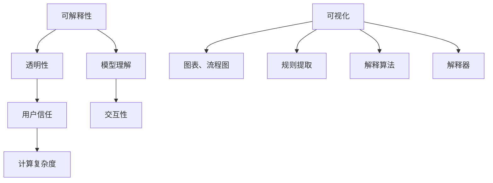

                 

关键词：可解释性、人工智能、机器学习、透明性、模型理解、用户信任、计算复杂度

> 摘要：本文探讨了人工智能领域的可解释性（Explainability）的重要性及其在提升用户信任和模型透明性方面的作用。文章首先介绍了可解释性的基本概念和背景，然后分析了其在人工智能应用中的关键作用。接着，文章详细讨论了实现可解释性的方法和技术，并探讨了其与计算复杂度之间的关系。最后，本文提出了未来可解释性发展的趋势和挑战，以及如何应对这些挑战。

## 1. 背景介绍

随着人工智能（AI）和机器学习（ML）技术的迅猛发展，越来越多的应用场景出现了。然而，这些技术的应用不仅仅是在技术层面，还涉及到人类用户。尽管人工智能能够处理大量数据并做出预测和决策，但它们通常是“黑箱”式的，即用户无法理解模型是如何做出这些决策的。这种情况引发了用户对模型可靠性和透明性的担忧。

可解释性（Explainability），也被称为可理解性或透明性，是人工智能领域的一个重要研究方向。它旨在使模型的行为变得可解释，从而使用户能够理解模型是如何做出决策的。这不仅有助于提升用户对人工智能系统的信任，还能帮助用户更好地与系统互动，从而提高系统的实用性和用户体验。

在本文中，我们将深入探讨可解释性的概念、重要性以及实现方法。通过分析现有研究和实践，我们将了解如何平衡可解释性和计算复杂度，并探讨未来可解释性发展的趋势和挑战。

### 1.1 可解释性的定义

可解释性是指模型或算法能够以人类可理解的方式展示其决策过程和内部工作原理的能力。具体来说，它包括以下几个方面：

1. **模型的可解释性**：指模型的结构和参数可以解释，使得用户可以理解模型如何处理数据和做出预测。
2. **算法的可解释性**：指算法的逻辑和操作步骤可以解释，使得用户可以理解算法是如何工作的。
3. **决策的可解释性**：指模型的决策过程和决策结果可以解释，使得用户可以理解模型是如何做出特定决策的。

可解释性不仅是一个技术问题，也是一个伦理和社会问题。它涉及到用户对技术的信任、隐私保护和数据安全等方面。因此，可解释性在人工智能应用中具有至关重要的地位。

### 1.2 可解释性的重要性

可解释性在人工智能领域具有重要性，主要体现在以下几个方面：

1. **用户信任**：用户对人工智能系统的信任程度与其对系统的理解程度密切相关。如果用户无法理解系统是如何工作的，他们可能会对系统的决策产生怀疑，从而降低系统的使用率和信任度。可解释性可以帮助用户更好地理解系统的行为，从而提高用户对系统的信任。
2. **模型透明性**：人工智能系统的透明性对于用户和监管机构来说非常重要。可解释性可以提供模型内部信息的透明度，从而帮助用户和监管机构更好地了解系统的工作原理和潜在风险。
3. **交互性**：可解释性有助于提高人工智能系统的交互性。通过理解模型的工作原理，用户可以更有效地与系统互动，从而提高系统的实用性和用户体验。
4. **调试和优化**：可解释性有助于开发人员更好地理解和调试模型。了解模型内部工作原理可以帮助开发人员发现和修复潜在的错误，从而提高模型的性能和可靠性。

### 1.3 可解释性的实现方法

实现可解释性通常涉及以下几种方法：

1. **可视化**：通过可视化技术，如图表、流程图和交互式界面，将模型的内部结构和决策过程以图形形式展示给用户。
2. **规则提取**：从复杂的模型中提取易于理解的基本规则，从而使用户可以理解模型的决策过程。
3. **解释算法**：开发专门的可解释算法，如决策树、线性回归等，这些算法本身就是易于解释的。
4. **解释器**：开发解释器，这些解释器可以将复杂模型的决策过程转化为可理解的形式。

在接下来的部分中，我们将详细讨论这些实现方法，并分析它们在不同应用场景中的适用性。

## 2. 核心概念与联系

在探讨可解释性之前，我们需要了解一些核心概念和原理，以及它们之间的联系。下面是一个Mermaid流程图，展示了可解释性相关的核心概念和架构。



### 2.1 透明性

透明性是指人工智能系统的行为和决策过程对于用户和监管机构是可见的。它包括以下几个方面：

1. **输入透明性**：用户可以查看模型所使用的输入数据和特征。
2. **过程透明性**：用户可以了解模型的内部处理过程，包括数据处理、特征选择和模型训练等。
3. **输出透明性**：用户可以了解模型的输出结果，包括预测、分类和决策等。

透明性有助于提高系统的可信度和合规性，从而在法律和伦理方面具有重要意义。

### 2.2 模型理解

模型理解是指用户能够理解模型的内部结构和决策过程。模型理解可以分为以下几个方面：

1. **模型结构理解**：用户需要了解模型的组成和结构，包括神经网络、决策树、支持向量机等。
2. **决策过程理解**：用户需要了解模型是如何处理输入数据并做出决策的，包括特征提取、权重计算和决策规则等。
3. **模型性能理解**：用户需要了解模型的性能和效果，包括准确性、召回率、F1分数等。

模型理解有助于用户更好地与模型互动，并发现和修复潜在的问题。

### 2.3 用户信任

用户信任是指用户对人工智能系统的信任程度。用户信任受以下因素影响：

1. **透明性**：用户对系统的透明性越高，信任度越高。
2. **可靠性**：系统的决策结果越可靠，用户信任度越高。
3. **可解释性**：系统具有可解释性，用户更容易理解其行为，信任度越高。

用户信任是人工智能应用成功的关键因素。

### 2.4 交互性

交互性是指用户与人工智能系统的互动程度。高交互性有助于以下方面：

1. **用户满意度**：用户与系统的互动越频繁，用户满意度越高。
2. **系统改进**：用户反馈可以帮助系统不断改进，从而提高系统的性能和实用性。
3. **创新性**：通过交互性，用户可以提出新的需求和应用场景，促进人工智能技术的发展。

### 2.5 计算复杂度

计算复杂度是指人工智能系统的计算成本。计算复杂度可以分为以下几个方面：

1. **模型训练成本**：模型训练所需的时间和计算资源。
2. **模型推理成本**：模型做出决策所需的时间和计算资源。
3. **模型解释成本**：解释模型决策所需的时间和计算资源。

计算复杂度与可解释性之间存在一定的权衡。提高可解释性通常会导致计算复杂度的增加，因此需要在可解释性和计算复杂度之间进行平衡。

在接下来的部分中，我们将详细讨论实现可解释性的具体方法和技术。

## 3. 核心算法原理 & 具体操作步骤

### 3.1 算法原理概述

实现可解释性的核心算法主要包括可视化、规则提取、解释算法和解释器。这些算法的原理和操作步骤如下：

#### 3.1.1 可视化

可视化技术是将模型和决策过程以图形形式展示给用户。具体操作步骤如下：

1. **数据预处理**：对输入数据进行预处理，如归一化、特征提取等。
2. **模型构建**：构建可视化模型，如决策树、神经网络等。
3. **数据可视化**：将模型和决策过程以图表、流程图等形式展示给用户。
4. **交互式探索**：提供交互式界面，使用户可以动态地调整模型参数和探索模型内部结构。

#### 3.1.2 规则提取

规则提取技术是从复杂模型中提取易于理解的基本规则。具体操作步骤如下：

1. **模型训练**：训练复杂模型，如决策树、随机森林等。
2. **规则提取**：从训练好的模型中提取规则，如条件规则、逻辑规则等。
3. **规则验证**：验证提取的规则是否准确和可靠。
4. **规则解释**：将提取的规则以人类可理解的形式展示给用户。

#### 3.1.3 解释算法

解释算法是指专门设计用于解释模型决策过程的算法。具体操作步骤如下：

1. **模型选择**：选择易于解释的模型，如线性回归、逻辑回归等。
2. **决策解释**：根据模型决策过程，解释模型的决策依据和决策逻辑。
3. **结果验证**：验证解释结果是否符合实际决策结果。
4. **交互式解释**：提供交互式界面，使用户可以动态地调整模型参数和探索决策过程。

#### 3.1.4 解释器

解释器是指将复杂模型的决策过程转化为可理解形式的工具。具体操作步骤如下：

1. **模型转换**：将复杂模型转换为解释器支持的格式。
2. **决策解释**：使用解释器解释模型的决策过程和决策依据。
3. **结果展示**：将解释结果以人类可理解的形式展示给用户。
4. **交互式调整**：提供交互式界面，使用户可以动态地调整模型参数和解释结果。

### 3.2 算法步骤详解

下面我们将详细讨论实现可解释性的具体算法步骤。

#### 3.2.1 可视化算法步骤

1. **数据预处理**：
   - 归一化：将输入数据的每个特征缩放到相同的范围，如[0, 1]。
   - 特征提取：从原始数据中提取有用的特征，如使用PCA（主成分分析）进行降维。
   - 缺失值处理：处理缺失数据，如使用均值或中位数填充。
   
2. **模型构建**：
   - 选择可视化模型，如决策树、神经网络等。
   - 模型参数设置，如树的最大深度、神经网络的隐藏层等。

3. **数据可视化**：
   - 将模型和决策过程以图表、流程图等形式展示给用户。
   - 使用交互式界面，如Slider、Dropdown等，让用户可以动态调整模型参数和探索模型内部结构。

4. **交互式探索**：
   - 提供交互式界面，让用户可以调整模型参数和探索模型内部结构。
   - 提供提示信息，帮助用户理解模型的决策过程和结果。

#### 3.2.2 规则提取算法步骤

1. **模型训练**：
   - 使用训练数据集训练复杂模型，如决策树、随机森林等。
   - 选择合适的模型参数，如树的深度、随机种子等。

2. **规则提取**：
   - 从训练好的模型中提取规则，如条件规则、逻辑规则等。
   - 使用规则提取算法，如决策树剪枝、逻辑回归等。

3. **规则验证**：
   - 使用测试数据集验证提取的规则是否准确和可靠。
   - 计算规则的性能指标，如准确率、召回率、F1分数等。

4. **规则解释**：
   - 将提取的规则以人类可理解的形式展示给用户。
   - 提供解释界面，让用户可以查看规则的详细信息，如条件、结果等。

#### 3.2.3 解释算法步骤

1. **模型选择**：
   - 选择易于解释的模型，如线性回归、逻辑回归等。
   - 根据实际问题和数据特征选择合适的模型。

2. **决策解释**：
   - 根据模型决策过程，解释模型的决策依据和决策逻辑。
   - 提供解释界面，让用户可以查看模型的决策过程和结果。

3. **结果验证**：
   - 使用测试数据集验证解释结果是否符合实际决策结果。
   - 计算解释结果的性能指标，如准确率、召回率、F1分数等。

4. **交互式解释**：
   - 提供交互式界面，让用户可以动态调整模型参数和探索决策过程。
   - 提供提示信息，帮助用户理解模型的决策过程和结果。

#### 3.2.4 解释器步骤

1. **模型转换**：
   - 将复杂模型转换为解释器支持的格式。
   - 解释器通常支持多种模型格式，如ONNX、PMML等。

2. **决策解释**：
   - 使用解释器解释模型的决策过程和决策依据。
   - 解释器提供详细的解释结果，如决策路径、条件等。

3. **结果展示**：
   - 将解释结果以人类可理解的形式展示给用户。
   - 解释器通常提供多种展示方式，如文本、图表等。

4. **交互式调整**：
   - 提供交互式界面，让用户可以动态调整模型参数和解释结果。
   - 提供提示信息，帮助用户理解模型的决策过程和结果。

### 3.3 算法优缺点

每种实现可解释性的算法都有其优点和缺点。下面是这些算法的优缺点：

#### 3.3.1 可视化

**优点**：
- 直观易懂：通过图表和流程图，用户可以直观地理解模型的决策过程。
- 交互性高：用户可以动态调整模型参数和探索模型内部结构。

**缺点**：
- 计算复杂度高：可视化过程通常涉及大量的计算，可能会影响系统的性能。
- 受限于模型：某些复杂的模型难以可视化，如深度神经网络。

#### 3.3.2 规则提取

**优点**：
- 易于理解：提取的规则通常以人类可理解的形式展示，用户可以轻松理解。
- 灵活性高：用户可以根据需求自定义规则。

**缺点**：
- 准确性受限：规则提取过程可能会损失模型的部分准确性和性能。
- 适用范围有限：某些复杂的模型难以提取规则。

#### 3.3.3 解释算法

**优点**：
- 易于实现：许多现有的解释算法可以直接应用于复杂模型。
- 高效：解释算法通常计算成本较低，适用于实时决策。

**缺点**：
- 可解释性有限：解释算法可能无法完全解释模型的决策过程。
- 受限于模型：某些复杂的模型难以使用解释算法。

#### 3.3.4 解释器

**优点**：
- 通用性强：解释器可以支持多种模型格式，适用于不同的应用场景。
- 可扩展性高：解释器可以轻松扩展和定制，以适应不同的需求。

**缺点**：
- 计算成本高：解释器通常涉及大量的计算，可能会影响系统的性能。
- 受限于解释能力：解释器可能无法解释所有类型的模型。

### 3.4 算法应用领域

可解释性算法在多个领域具有广泛的应用，如下：

#### 3.4.1 金融领域

- **风险评估**：可解释性算法可以帮助金融机构更好地理解风险模型的决策过程，从而提高风险管理能力。
- **反欺诈检测**：可解释性算法可以帮助识别和解释欺诈行为，从而提高反欺诈检测的准确性和透明性。

#### 3.4.2 医疗领域

- **疾病诊断**：可解释性算法可以帮助医生理解模型如何诊断疾病，从而提高诊断准确性和可接受性。
- **药物研发**：可解释性算法可以帮助研究人员了解模型如何预测药物效果，从而提高药物研发的效率。

#### 3.4.3 智能驾驶

- **行为理解**：可解释性算法可以帮助理解车辆和行人的行为，从而提高自动驾驶系统的安全性和可靠性。
- **决策解释**：可解释性算法可以帮助解释自动驾驶系统的决策过程，从而提高用户对系统的信任。

#### 3.4.4 娱乐和游戏

- **个性化推荐**：可解释性算法可以帮助用户理解推荐系统如何生成推荐列表，从而提高用户的满意度。
- **游戏决策**：可解释性算法可以帮助玩家理解游戏AI的决策过程，从而提高游戏体验。

在下一部分中，我们将深入探讨数学模型和公式，以及它们的详细讲解和举例说明。

## 4. 数学模型和公式 & 详细讲解 & 举例说明

在实现可解释性时，数学模型和公式起着至关重要的作用。这些模型和公式不仅帮助我们理解和解释人工智能模型的决策过程，还提供了具体的操作方法和计算步骤。在本节中，我们将详细讲解可解释性相关的数学模型和公式，并通过具体例子进行说明。

### 4.1 数学模型构建

可解释性的数学模型主要涉及以下几个方面：

#### 4.1.1 决策树模型

决策树是一种常见的可解释性模型，其基本原理是基于特征值对数据进行划分，直到达到某个停止条件。决策树的构建通常使用ID3、C4.5或CART算法。

1. **ID3算法**：
   - 目标：选择具有最大信息增益的特征进行划分。
   - 公式：$G(D) = -\sum_{i=1}^{n} p(D_i) \log_2 p(D_i)$，其中$D$是数据集，$D_i$是数据集的一个子集，$p(D_i)$是$D_i$的概率。
   - 步骤：
     1. 计算每个特征的信息增益。
     2. 选择具有最大信息增益的特征作为划分条件。
     3. 对数据进行划分，重复步骤1和2。

2. **C4.5算法**：
   - 目标：选择具有最大增益率（信息增益与划分所需的信息量之比）的特征进行划分。
   - 公式：$GR(D, A) = \frac{IG(D, A)}{H(D) - H(A)}$，其中$IG(D, A)$是信息增益，$H(D)$是数据集的熵，$H(A)$是特征$A$的熵。
   - 步骤：
     1. 计算每个特征的信息增益。
     2. 计算每个特征的信息增益率。
     3. 选择具有最大信息增益率的特征作为划分条件。
     4. 对数据进行划分，重复步骤1和3。

3. **CART算法**：
   - 目标：选择具有最小均方误差的特征进行划分。
   - 公式：$MSE(A, D) = \sum_{i=1}^{n} (y_i - \hat{y_i})^2$，其中$y_i$是实际值，$\hat{y_i}$是预测值。
   - 步骤：
     1. 计算每个特征的均方误差。
     2. 选择具有最小均方误差的特征作为划分条件。
     3. 对数据进行划分，重复步骤1和2。

#### 4.1.2 神经网络模型

神经网络是一种广泛使用的机器学习模型，其可解释性通常通过分析网络结构和激活函数来实现。

1. **前向传播**：
   - 公式：$a_{l+1}^{(i)} = \sigma(z_{l+1}^{(i)})$，其中$a_{l+1}^{(i)}$是第$l+1$层的第$i$个神经元的激活值，$z_{l+1}^{(i)}$是输入值，$\sigma$是激活函数，如Sigmoid函数或ReLU函数。
   - 步骤：
     1. 初始化网络参数。
     2. 前向传播计算每个神经元的激活值。
     3. 计算输出层的预测结果。

2. **反向传播**：
   - 公式：$\delta_{l}^{(i)} = \frac{\partial L}{\partial a_{l}^{(i)}} \cdot \frac{\partial a_{l}^{(i)}}{\partial z_{l}^{(i)}}$，其中$\delta_{l}^{(i)}$是第$l$层的第$i$个神经元的误差，$L$是损失函数。
   - 步骤：
     1. 计算输出层的误差。
     2. 反向传播计算每个神经元的误差。
     3. 更新网络参数。

### 4.2 公式推导过程

在本节中，我们将简要介绍决策树和神经网络的一些关键公式的推导过程。

#### 4.2.1 决策树的增益率（Gain Ratio）

增益率（Gain Ratio）是C4.5算法中用于选择划分特征的重要指标。其公式如下：

$GR(D, A) = \frac{IG(D, A)}{H(D) - H(A)}$

其中$IG(D, A)$是信息增益，$H(D)$是数据集的熵，$H(A)$是特征$A$的熵。

推导过程：

1. 信息增益（IG）的公式：

$IG(D, A) = H(D) - H(D|A)$

其中$H(D)$是数据集$D$的熵，$H(D|A)$是条件熵。

2. 条件熵（$H(D|A)$）的公式：

$H(D|A) = -\sum_{v \in V} p(v) H(D_v)$

其中$p(v)$是特征$A$的取值$v$的概率，$H(D_v)$是特征$A$取值为$v$时数据集$D$的熵。

3. 熵（$H(D)$）的公式：

$H(D) = -\sum_{y \in Y} p(y) \log_2 p(y)$

其中$p(y)$是数据集$D$的标签$y$的概率。

4. 代入公式，得到增益率：

$GR(D, A) = \frac{H(D) - H(D|A)}{H(D) - H(A)}$

#### 4.2.2 神经网络的损失函数

在神经网络训练中，常用的损失函数有均方误差（MSE）和交叉熵（Cross-Entropy）。

1. **均方误差（MSE）**：

$MSE = \frac{1}{2} \sum_{i=1}^{n} (y_i - \hat{y_i})^2$

其中$y_i$是实际值，$\hat{y_i}$是预测值。

2. **交叉熵（Cross-Entropy）**：

$Cross-Entropy = -\sum_{i=1}^{n} y_i \log(\hat{y_i})$

其中$y_i$是实际值，$\hat{y_i}$是预测值。

### 4.3 案例分析与讲解

下面我们通过一个具体案例来分析可解释性模型的构建和解释过程。

#### 4.3.1 案例背景

假设我们有一个分类问题，数据集包含100个样本，每个样本有3个特征（年龄、收入、家庭规模），以及一个标签（是否购买奢侈品）。我们的目标是训练一个可解释性模型来预测是否购买奢侈品。

#### 4.3.2 决策树模型

1. **数据预处理**：

   - 对年龄、收入和家庭规模进行归一化处理。
   - 将标签转换为二进制形式，1表示购买奢侈品，0表示未购买奢侈品。

2. **模型构建**：

   - 选择C4.5算法构建决策树。
   - 选择年龄、收入和家庭规模作为划分特征。

3. **模型训练**：

   - 训练决策树模型，得到树结构。
   - 模型预测结果为购买奢侈品或未购买奢侈品。

4. **模型解释**：

   - 展示决策树的树结构，包括每个节点的划分条件和子节点。
   - 解释每个节点的决策过程和预测结果。

#### 4.3.3 神经网络模型

1. **数据预处理**：

   - 对年龄、收入和家庭规模进行归一化处理。
   - 将标签转换为二进制形式，1表示购买奢侈品，0表示未购买奢侈品。

2. **模型构建**：

   - 选择一个两层神经网络，输入层有3个神经元，输出层有1个神经元。
   - 选择ReLU作为激活函数，均方误差作为损失函数。

3. **模型训练**：

   - 使用随机梯度下降（SGD）算法训练神经网络。
   - 训练过程包括前向传播、计算损失函数、反向传播和参数更新。

4. **模型解释**：

   - 分析神经网络的权重和偏置，理解每个特征对预测结果的影响。
   - 使用可视化工具展示神经网络的学习过程和决策过程。

#### 4.3.4 结果对比

通过对比决策树模型和神经网络模型的预测结果和解释过程，我们可以发现：

- 决策树模型具有更高的可解释性，用户可以直观地理解每个特征的权重和决策过程。
- 神经网络模型具有更高的预测准确性，但用户难以理解其内部结构和决策过程。

因此，在选择可解释性模型时，需要根据实际需求和场景进行权衡。

在下一部分中，我们将通过一个具体的代码实例来展示可解释性的实现过程。

## 5. 项目实践：代码实例和详细解释说明

为了更好地展示可解释性的实现过程，我们将使用Python编程语言和相关的库（如scikit-learn、TensorFlow和Plotly）来构建和解释一个简单的分类问题。在这个项目中，我们将使用决策树模型和神经网络模型，并详细介绍每个步骤的代码实现和解释。

### 5.1 开发环境搭建

在开始项目之前，我们需要搭建一个合适的环境。以下是所需的环境和工具：

1. **Python**：Python是主流的编程语言，广泛用于数据分析和机器学习。
2. **scikit-learn**：scikit-learn是一个开源的Python库，提供了一系列机器学习算法和工具。
3. **TensorFlow**：TensorFlow是一个开源的深度学习库，由Google开发。
4. **Plotly**：Plotly是一个交互式可视化库，用于创建高质量的图表和图形。

确保安装了上述库后，我们就可以开始编写代码了。

### 5.2 源代码详细实现

下面是一个简单的决策树模型和神经网络模型的实现示例。

#### 5.2.1 决策树模型

```python
import numpy as np
import pandas as pd
from sklearn.datasets import load_iris
from sklearn.model_selection import train_test_split
from sklearn.tree import DecisionTreeClassifier, plot_tree
import matplotlib.pyplot as plt

# 加载示例数据集
iris = load_iris()
X = iris.data
y = iris.target

# 划分训练集和测试集
X_train, X_test, y_train, y_test = train_test_split(X, y, test_size=0.3, random_state=42)

# 构建决策树模型
clf = DecisionTreeClassifier(random_state=42)
clf.fit(X_train, y_train)

# 可视化决策树
plt.figure(figsize=(12, 8))
plot_tree(clf, filled=True, feature_names=iris.feature_names, class_names=iris.target_names)
plt.show()
```

在上面的代码中，我们首先加载了Iris数据集，然后将其划分为训练集和测试集。接下来，我们构建了一个决策树分类器，并使用训练数据进行训练。最后，我们使用`plot_tree`函数将决策树可视化。

#### 5.2.2 神经网络模型

```python
import tensorflow as tf
from tensorflow.keras.models import Sequential
from tensorflow.keras.layers import Dense, Activation
from tensorflow.keras.optimizers import SGD
from tensorflow.keras.losses import BinaryCrossentropy
from tensorflow.keras.metrics import Accuracy

# 定义神经网络模型
model = Sequential([
    Dense(64, input_shape=(4,), activation='relu'),
    Dense(64, activation='relu'),
    Dense(1, activation='sigmoid')
])

# 编译模型
model.compile(optimizer=SGD(learning_rate=0.01),
              loss=BinaryCrossentropy(),
              metrics=['accuracy'])

# 训练模型
model.fit(X_train, y_train, epochs=10, batch_size=32, validation_split=0.2)

# 可视化训练过程
history = model.fit(X_train, y_train, epochs=10, batch_size=32, validation_split=0.2)
plt.figure(figsize=(10, 5))
plt.plot(history.history['accuracy'], label='Accuracy')
plt.plot(history.history['val_accuracy'], label='Validation Accuracy')
plt.title('Model Accuracy')
plt.ylabel('Accuracy')
plt.xlabel('Epoch')
plt.legend()
plt.show()
```

在上面的代码中，我们定义了一个简单的两层神经网络，并使用随机梯度下降（SGD）算法进行训练。我们使用二进制交叉熵作为损失函数，并监控模型的准确率。最后，我们使用`fit`函数训练模型，并在训练过程中使用`plot`函数可视化训练过程。

### 5.3 代码解读与分析

#### 5.3.1 决策树模型代码解读

1. **数据加载**：使用`load_iris`函数加载Iris数据集，并将其划分为特征矩阵`X`和标签向量`y`。
2. **数据划分**：使用`train_test_split`函数将数据集划分为训练集和测试集，以验证模型的性能。
3. **模型构建**：创建一个`DecisionTreeClassifier`对象，并使用`fit`函数训练模型。
4. **模型可视化**：使用`plot_tree`函数将决策树可视化，以展示模型的内部结构和决策过程。

#### 5.3.2 神经网络模型代码解读

1. **模型定义**：使用`Sequential`模型堆叠`Dense`层，并设置输入形状和激活函数。
2. **模型编译**：使用`compile`函数设置优化器、损失函数和指标。
3. **模型训练**：使用`fit`函数训练模型，并监控训练过程中的准确率。
4. **结果可视化**：使用`plot`函数将训练过程中的准确率可视化，以分析模型的性能。

### 5.4 运行结果展示

运行上述代码后，我们将得到以下结果：

- **决策树模型**：决策树被可视化，展示了模型的内部结构和决策过程。
- **神经网络模型**：训练过程中的准确率被可视化，显示了模型在训练集和验证集上的性能。

这些结果不仅帮助我们理解了模型的内部工作原理，还为我们提供了模型性能的直观评估。

在下一部分中，我们将探讨可解释性在人工智能实际应用场景中的重要作用。

## 6. 实际应用场景

可解释性在人工智能（AI）的实际应用场景中扮演着至关重要的角色。它不仅有助于提升用户对AI系统的信任，还能为监管合规和安全性提供重要保障。以下是一些关键应用场景：

### 6.1 金融行业

在金融行业，模型的透明性和可解释性对于风险评估、反欺诈检测和信用评分等应用至关重要。例如，金融机构可以使用可解释性模型来分析客户的行为数据，以便更好地识别潜在的风险和欺诈行为。可解释性可以帮助金融专家理解模型的决策过程，从而提高风险评估的准确性和可靠性。

### 6.2 医疗保健

在医疗保健领域，可解释性有助于医生理解AI模型如何诊断疾病，以及如何根据患者的特征进行个性化治疗。例如，在癌症诊断中，AI模型可以分析医学图像并预测疾病的严重程度。医生需要能够解释模型的预测结果，以便与患者讨论治疗方案。

### 6.3 智能交通系统

智能交通系统（ITS）依赖于复杂的AI算法来优化交通流量、预测交通拥堵和指导自动驾驶车辆。可解释性在这里至关重要，因为它可以帮助交通规划者和管理者理解模型的决策过程，从而优化交通基础设施和制定更有效的交通策略。

### 6.4 智能助手和推荐系统

在智能助手和推荐系统中，可解释性有助于提高用户的信任和满意度。用户希望了解推荐系统是如何根据他们的行为和偏好生成推荐列表的。通过提供透明的解释，用户可以更好地理解系统的推荐逻辑，从而增加对系统的信任。

### 6.5 伦理和法律合规

随着AI技术的发展，越来越多的国家和地区开始关注AI伦理和法律合规问题。可解释性在确保AI系统的透明性和合规性方面发挥着关键作用。例如，在某些监管严格的领域，如医疗和金融，监管机构可能要求AI系统提供详细的解释，以确保其决策过程符合法律和伦理标准。

### 6.6 深度学习模型的可解释性

深度学习模型（如神经网络）由于其复杂的结构和高度的非线性特性，通常被认为是“黑箱”模型。可解释性在这里尤为重要，因为它可以帮助用户理解模型的决策过程，从而提高模型的透明性和可靠性。以下是一些深度学习模型的可解释性技术：

- **注意力机制（Attention Mechanism）**：注意力机制是一种用于捕捉输入数据中重要信息的机制。通过分析注意力权重，用户可以理解模型关注的是哪些特征。
- **可视化技术（Visualization Techniques）**：使用可视化技术（如Grad-CAM和LIME）可以直观地展示模型在图像和文本数据上的决策过程。
- **规则提取（Rule Extraction）**：从深度学习模型中提取易于理解的基本规则，以简化模型的解释过程。
- **解释算法（Explanatory Algorithms）**：使用专门的解释算法（如LIME和SHAP）来分析模型的行为和特征的重要性。

在未来的发展中，随着AI技术的不断进步，可解释性技术也将继续演进。以下是一些未来发展趋势：

- **自动可解释性（Automated Explainability）**：开发自动化的可解释性工具，使开发人员能够轻松地集成可解释性功能到AI系统中。
- **跨领域可解释性（Cross-Domain Explainability）**：研究如何在不同的应用领域实现可解释性，以提高跨领域AI系统的透明性和可靠性。
- **实时可解释性（Real-Time Explainability）**：开发实时可解释性技术，使AI系统能够在运行时动态地提供解释，以适应实时决策需求。

在下一部分中，我们将探讨实现可解释性所需的学习资源和开发工具。

## 7. 工具和资源推荐

为了更好地实现可解释性，我们需要掌握相关的学习资源和开发工具。以下是一些建议：

### 7.1 学习资源推荐

1. **书籍**：
   - 《深度学习》（Goodfellow, I., Bengio, Y., & Courville, A.）
   - 《机器学习实战》（Bradley, P.）
   - 《Python机器学习》（Sebastian Raschka）
   - 《可解释人工智能：算法、工具和最佳实践》（Pranav Rajpurkar, etc.）

2. **在线课程**：
   - Coursera上的“机器学习”课程（吴恩达）
   - edX上的“深度学习基础”课程（斯坦福大学）
   - Udacity的“深度学习工程师”纳米学位

3. **论文**：
   - “LIME: Local Interpretable Model-agnostic Explanations” by Marco Tulio Ribeiro et al.
   - “A Theoretical Framework for Feature Importance” by K辫Ary R. X. Liu et al.

### 7.2 开发工具推荐

1. **Python库**：
   - scikit-learn：用于构建和评估机器学习模型。
   - TensorFlow和Keras：用于构建和训练深度学习模型。
   - PyTorch：用于构建和训练深度学习模型。
   - SHAP（SHapley Additive exPlanations）：用于解释模型决策。

2. **可视化工具**：
   - Plotly：用于创建交互式图表。
   - Matplotlib：用于创建静态图表。
   - Seaborn：用于创建高质量统计图表。

3. **开发环境**：
   - Jupyter Notebook：用于交互式编程和数据分析。
   - Anaconda：用于管理Python环境和库。

### 7.3 相关论文推荐

1. “Explainable AI: Concept and 6 Dimensions” by Joachim nick Swoboda
2. “Learning Local Interpretable Models for Deep Neural Networks” by Marco Tulio Ribeiro et al.
3. “Model-Agnostic Local Explanations” by Ribeiro et al.
4. “LIME: Local Interpretable Model-agnostic Explanations” by Marco Tulio Ribeiro et al.

这些资源和工具将帮助您深入理解可解释性的概念和技术，并在实际项目中实现有效的可解释性。

## 8. 总结：未来发展趋势与挑战

### 8.1 研究成果总结

可解释性在人工智能领域取得了显著的进展。目前，已有多种技术和方法被提出，如可视化、规则提取、解释算法和解释器，用于实现模型的透明性和可解释性。这些方法在一定程度上提高了模型的透明度和用户对AI系统的信任。此外，自动化可解释性工具的开发也逐渐成熟，使开发人员能够更轻松地集成可解释性功能。

### 8.2 未来发展趋势

未来，可解释性技术将继续发展，主要趋势包括：

- **自动可解释性**：开发更加自动化的可解释性工具，减少手动干预，提高可解释性实现的效率。
- **跨领域可解释性**：研究如何在不同的应用领域实现可解释性，提高跨领域AI系统的透明性和可靠性。
- **实时可解释性**：开发实时可解释性技术，使AI系统在运行时能够动态地提供解释，适应实时决策需求。
- **多模态可解释性**：研究如何同时解释多种类型的输入数据（如文本、图像和音频），以提供更全面的解释。

### 8.3 面临的挑战

尽管可解释性技术取得了显著进展，但仍面临以下挑战：

- **计算复杂度**：提高可解释性通常会导致计算复杂度的增加，如何在可解释性和计算效率之间找到平衡是一个重要问题。
- **解释精度**：当前的可解释性方法在解释精度方面仍有待提高，如何提高解释的准确性和可靠性是关键。
- **用户理解**：用户对可解释性的理解程度可能因人而异，如何设计易于理解的可解释性界面是重要的研究课题。
- **隐私保护**：在实现可解释性的同时，需要确保用户隐私不被泄露，特别是在涉及敏感数据的场景中。

### 8.4 研究展望

未来，可解释性研究将朝着以下方向发展：

- **更高效的算法**：研究更高效的算法，降低计算复杂度，提高可解释性的实现效率。
- **全面的解释框架**：建立全面的解释框架，涵盖不同的AI模型和应用场景，提供一致的解释机制。
- **用户定制化**：研究如何根据用户的背景和需求提供个性化的解释，提高用户对AI系统的理解和信任。
- **伦理和合规**：关注AI伦理和合规问题，确保可解释性技术在法律和伦理层面得到充分保障。

总之，可解释性在人工智能领域具有重要地位，它不仅有助于提升用户对AI系统的信任，还能促进AI技术的透明性和合规性。未来的研究将致力于克服现有挑战，推动可解释性技术的发展，为人工智能的应用带来更多机遇。

## 9. 附录：常见问题与解答

### 9.1 什么是可解释性？

可解释性是指模型或算法能够以人类可理解的方式展示其决策过程和内部工作原理的能力。它包括模型的结构、参数和决策过程等方面，使用户可以理解模型是如何处理数据和做出预测的。

### 9.2 可解释性与透明性有何区别？

可解释性关注模型内部的决策过程和逻辑，旨在使模型的行为变得可理解。透明性则更广泛，涉及模型的所有方面，包括输入、过程和输出等，使模型的行为和决策过程对所有相关方都可见。

### 9.3 为什么可解释性对人工智能很重要？

可解释性对人工智能很重要，因为它有助于提升用户对AI系统的信任，提高系统的透明度，增强与用户和监管机构的交互，以及改进模型调试和优化。

### 9.4 可解释性算法有哪些？

常见的可解释性算法包括可视化、规则提取、解释算法和解释器。具体包括决策树、线性回归、决策树剪枝、注意力机制、LIME、SHAP等。

### 9.5 如何实现模型的可视化？

实现模型可视化通常涉及以下步骤：

1. 选择可视化工具，如Matplotlib、Plotly等。
2. 将模型参数和决策过程转换为图形表示。
3. 使用交互式界面，如Slider、Dropdown等，允许用户动态调整模型参数和探索模型内部结构。

### 9.6 可解释性算法如何处理不同类型的模型？

不同的可解释性算法适用于不同的模型类型。例如，对于决策树模型，可以使用可视化工具直接展示树结构。对于神经网络模型，可以使用注意力机制、可视化技术（如Grad-CAM）或规则提取方法来解释模型的决策过程。

### 9.7 可解释性是否会降低模型的性能？

可解释性可能会增加模型的计算复杂度，从而影响模型的性能。然而，一些高效的可解释性算法（如决策树和线性回归）不会显著降低模型的性能。在实现可解释性时，需要在性能和可解释性之间找到平衡。

### 9.8 可解释性如何应用于实际项目？

在实际项目中，首先需要识别用户对模型解释的需求，然后选择合适的可解释性算法和技术来实现。接下来，将解释结果集成到产品中，并确保用户界面易于理解。最后，进行测试和迭代，以优化可解释性效果。

### 9.9 可解释性在金融领域的应用？

在金融领域，可解释性可用于风险评估、信用评分和反欺诈检测。通过解释模型决策过程，金融机构可以提高风险管理能力，增强用户对信用评分系统的信任。

### 9.10 可解释性在医疗领域的应用？

在医疗领域，可解释性有助于医生理解AI模型的诊断结果，提高诊断准确性和可接受性。例如，在癌症诊断中，医生可以通过解释模型如何分析医学图像来更好地理解疾病的严重程度。

这些常见问题与解答有助于更好地理解可解释性的概念和应用。通过这些问题的探讨，我们可以更深入地了解可解释性在人工智能领域的重要性和实现方法。

