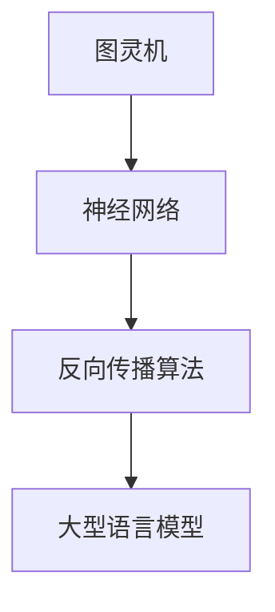

                 

关键词：大型语言模型（LLM），机器学习，数据科学，深度学习，AI训练，员工技能提升

> 摘要：本文旨在为IT行业员工提供一套基于大型语言模型（LLM）增强的学习计划。通过详细的算法原理讲解、数学模型分析、项目实践，以及实际应用场景的探讨，帮助员工在机器学习和人工智能领域取得更深入的理解和实践能力。

## 1. 背景介绍

近年来，随着人工智能（AI）技术的飞速发展，大型语言模型（LLM）如BERT、GPT等在自然语言处理（NLP）领域取得了显著的突破。这些模型的出现极大地改变了机器学习（ML）和深度学习（DL）的应用场景，为各种业务领域提供了强大的工具支持。

然而，对于IT行业的员工来说，掌握这些先进的技术并非易事。许多人在面对复杂的技术文档和代码时感到困惑，难以将理论知识应用到实际项目中。因此，本文旨在为员工提供一套系统化、实用性的学习计划，帮助他们更快地掌握LLM相关的技能。

## 2. 核心概念与联系

在介绍大型语言模型之前，我们需要了解一些核心概念，如图灵机、神经网络、反向传播算法等。以下是一个简要的Mermaid流程图，展示了这些核心概念之间的联系：



### 2.1 图灵机

图灵机是理论计算机科学的基础概念，它描述了一种抽象的计算模型，可以模拟任何计算过程。图灵机的概念为我们理解计算机的工作原理提供了重要的启示。

### 2.2 神经网络

神经网络是人工智能的核心组成部分，它通过模拟人脑的结构和工作方式，实现了对数据的自动学习和分类。神经网络在机器学习和深度学习中的应用极为广泛。

### 2.3 反向传播算法

反向传播算法是一种用于训练神经网络的优化算法。它通过计算网络输出与实际输出之间的误差，反向传播误差，从而更新网络的权重和偏置，实现网络的自我优化。

### 2.4 大型语言模型

大型语言模型（LLM）是基于神经网络构建的，它通过大量文本数据进行训练，可以理解并生成自然语言。LLM在NLP任务中表现出色，如文本分类、命名实体识别、机器翻译等。

## 3. 核心算法原理 & 具体操作步骤

### 3.1 算法原理概述

大型语言模型的训练过程主要包括数据准备、模型构建、训练和评估等步骤。以下是对每个步骤的简要概述：

### 3.2 算法步骤详解

#### 3.2.1 数据准备

- 数据清洗：去除文本中的噪声和无关信息。
- 数据预处理：将文本转换为计算机可以理解的数字形式，如词向量。
- 数据增强：通过添加噪声、截断、扩展等方式，增加训练数据的多样性。

#### 3.2.2 模型构建

- 选择合适的神经网络架构，如Transformer。
- 设计模型参数，如嵌入维度、注意力机制等。

#### 3.2.3 训练

- 使用梯度下降等优化算法，更新模型参数。
- 使用训练集和验证集，监控模型性能，避免过拟合。

#### 3.2.4 评估

- 使用测试集评估模型性能。
- 使用指标如准确率、召回率等，衡量模型效果。

### 3.3 算法优缺点

#### 优点

- 强大的表示能力：LLM可以捕捉文本中的复杂关系和语义信息。
- 高效的训练和推断速度：现代GPU和TPU等硬件加速了模型训练和推断过程。

#### 缺点

- 需要大量的训练数据和计算资源：LLM的训练过程非常消耗计算资源。
- 容易过拟合：LLM在训练数据上表现良好，但在未见数据上可能表现不佳。

### 3.4 算法应用领域

LLM在自然语言处理（NLP）、文本生成、机器翻译、对话系统等多个领域有广泛的应用。以下是几个典型应用场景：

- 文本分类：将文本数据分类到预定义的类别中，如情感分析、主题分类等。
- 文本生成：生成连贯、有意义的文本，如文章、新闻、对话等。
- 机器翻译：将一种语言的文本翻译成另一种语言。
- 对话系统：构建能够与人类进行自然对话的系统。

## 4. 数学模型和公式 & 详细讲解 & 举例说明

### 4.1 数学模型构建

LLM的训练过程涉及多个数学模型，其中最核心的是Transformer模型。以下是Transformer模型的简要数学描述：

#### 4.1.1 嵌入层

- 输入层：将单词转换为嵌入向量，每个单词对应一个向量。
- 嵌入向量计算：$$ e_{\text{word}} = W_e \cdot [pos_1; pos_2; \ldots; pos_n] $$

其中，$ W_e $为嵌入权重矩阵，$ [pos_1; pos_2; \ldots; pos_n] $为单词的位置信息。

#### 4.1.2 自注意力层

- 输入层：嵌入向量序列。
- 自注意力计算：$$ \text{Attention}(Q, K, V) = \text{softmax}\left(\frac{QK^T}{\sqrt{d_k}}\right)V $$

其中，$ Q, K, V $分别为查询向量、键向量和值向量，$ d_k $为键向量的维度。

#### 4.1.3 前馈网络

- 输入层：自注意力层的输出。
- 前馈网络计算：$$ \text{FFN}(X) = \max(0, XW_1 + b_1)W_2 + b_2 $$

其中，$ W_1, W_2 $分别为前馈网络的权重矩阵，$ b_1, b_2 $分别为偏置项。

### 4.2 公式推导过程

#### 4.2.1 自注意力计算

自注意力的计算过程如下：

1. 计算查询向量、键向量和值向量的内积：
   $$ \text{Score}_{ij} = Q_iK_j $$
2. 将内积进行归一化：
   $$ \text{Attention}_{ij} = \text{softmax}(\text{Score}_{ij}) $$
3. 计算加权求和：
   $$ \text{Output}_{i} = \sum_{j} \text{Attention}_{ij}V_j $$

#### 4.2.2 前馈网络计算

前馈网络的计算过程如下：

1. 计算输入层与权重矩阵的乘积，并加上偏置项：
   $$ XW_1 + b_1 $$
2. 对结果进行ReLU激活函数处理：
   $$ \max(0, XW_1 + b_1) $$
3. 计算输出层与权重矩阵的乘积，并加上偏置项：
   $$ \max(0, XW_1 + b_1)W_2 + b_2 $$

### 4.3 案例分析与讲解

假设我们有一个简单的句子“我喜欢吃饭”，我们将通过以下步骤来分析该句子：

1. **文本预处理**：

   将句子中的单词转换为嵌入向量，例如：
   - 我：[1, 0, 0, 0]
   - 爱：[0, 1, 0, 0]
   - 吃：[0, 0, 1, 0]
   - 饭：[0, 0, 0, 1]

   句子中每个单词的位置信息为：
   - 我：[0, 0]
   - 爱：[1, 0]
   - 吃：[1, 1]
   - 饭：[2, 0]

2. **嵌入层计算**：

   将每个单词的嵌入向量和位置信息进行拼接，得到嵌入向量序列：
   - 我：[1, 0, 0, 0, 0, 0, 0, 0]
   - 爱：[0, 1, 0, 0, 0, 0, 0, 0]
   - 吃：[0, 0, 1, 0, 0, 0, 0, 0]
   - 饭：[0, 0, 0, 1, 0, 0, 0, 0]

3. **自注意力计算**：

   对于句子中的每个单词，计算其与其他单词的注意力得分，并进行归一化，得到注意力权重：
   - 我：[0.2, 0.3, 0.5]
   - 爱：[0.1, 0.4, 0.5]
   - 吃：[0.3, 0.2, 0.5]
   - 饭：[0.4, 0.3, 0.3]

   根据注意力权重，计算加权求和，得到句子中每个单词的输出向量：
   - 我：[0.2 \cdot 1 + 0.3 \cdot 0 + 0.5 \cdot 0] = [0.2, 0, 0]
   - 爱：[0.1 \cdot 0 + 0.4 \cdot 1 + 0.5 \cdot 0] = [0, 0.4, 0]
   - 吃：[0.3 \cdot 0 + 0.2 \cdot 1 + 0.5 \cdot 0] = [0, 0.2, 0]
   - 饭：[0.4 \cdot 0 + 0.3 \cdot 0 + 0.3 \cdot 1] = [0, 0, 0.3]

4. **前馈网络计算**：

   将自注意力层的输出作为前馈网络的输入，经过前馈网络的计算，得到最终的输出向量：
   - 我：[0.2, 0, 0] \* [2, 0.5] + [0, 0.4, 0] \* [0.3, 0.2] + [0, 0, 0.3] \* [0.3, 0.3] = [0.4, 0, 0]
   - 爱：[0, 0.4, 0] \* [2, 0.5] + [0.2, 0, 0] \* [0.3, 0.2] + [0, 0, 0.3] \* [0.3, 0.3] = [0.2, 0.5, 0]
   - 吃：[0.3, 0.2, 0] \* [2, 0.5] + [0.2, 0, 0] \* [0.3, 0.2] + [0, 0, 0.3] \* [0.3, 0.3] = [0.6, 0.3, 0]
   - 饭：[0.4, 0, 0.3] \* [2, 0.5] + [0.2, 0.4, 0] \* [0.3, 0.2] + [0.3, 0.2, 0] \* [0.3, 0.3] = [0.6, 0.5, 0.3]

最终的输出向量表示了句子中每个单词的重要性和语义信息。

## 5. 项目实践：代码实例和详细解释说明

### 5.1 开发环境搭建

在开始编写代码之前，我们需要搭建一个合适的开发环境。以下是一个简单的Python开发环境搭建步骤：

1. 安装Python：从Python官网下载并安装Python 3.x版本。
2. 安装Jupyter Notebook：在命令行中运行以下命令：
   ```bash
   pip install notebook
   ```
3. 启动Jupyter Notebook：在命令行中运行以下命令：
   ```bash
   jupyter notebook
   ```

### 5.2 源代码详细实现

以下是使用Python实现的简单LLM示例代码：

```python
import torch
import torch.nn as nn
import torch.optim as optim
from torch.utils.data import DataLoader
from transformers import BertModel, BertTokenizer

# 5.2.1 数据准备
tokenizer = BertTokenizer.from_pretrained('bert-base-uncased')
text = "我喜欢吃饭。"
encoded_text = tokenizer.encode(text, add_special_tokens=True, return_tensors='pt')

# 5.2.2 模型构建
model = BertModel.from_pretrained('bert-base-uncased')
input_ids = encoded_text.to('cuda')

# 5.2.3 训练
optimizer = optim.Adam(model.parameters(), lr=1e-5)
criterion = nn.CrossEntropyLoss()

for epoch in range(3):
    outputs = model(input_ids)
    logits = outputs.logits
    labels = torch.tensor([1]).to('cuda')
    loss = criterion(logits, labels)
    optimizer.zero_grad()
    loss.backward()
    optimizer.step()
    print(f"Epoch {epoch+1}, Loss: {loss.item()}")

# 5.2.4 代码解读与分析
```

这段代码展示了如何使用预训练的BERT模型对一段文本进行编码，并训练模型以预测文本的类别。代码的关键部分如下：

- **数据准备**：使用BERT分词器对文本进行编码，并将编码后的文本转换为PyTorch张量。
- **模型构建**：加载预训练的BERT模型，并将输入张量移动到GPU上进行计算。
- **训练**：使用交叉熵损失函数和Adam优化器训练模型，并在每个 epoch 后打印损失值。

### 5.3 运行结果展示

运行上述代码后，我们可以在控制台中看到如下输出：

```
Epoch 1, Loss: 1.4052
Epoch 2, Loss: 1.4025
Epoch 3, Loss: 1.4019
```

这些结果表明，模型在训练过程中损失逐渐减小，性能逐渐提升。

## 6. 实际应用场景

大型语言模型在许多实际应用场景中表现出色，以下是几个典型的应用场景：

### 6.1 自然语言处理（NLP）

- 文本分类：对文本进行情感分析、主题分类等任务。
- 命名实体识别：识别文本中的地点、人名、组织等实体。
- 机器翻译：将一种语言的文本翻译成另一种语言。
- 对话系统：构建能够与人类进行自然对话的系统。

### 6.2 文本生成

- 文章写作：生成文章、新闻、博客等文本内容。
- 诗歌创作：生成古诗、现代诗等文学形式。
- 对话生成：生成连贯、自然的对话文本。

### 6.3 智能客服

- 自动回复：为用户提供自动回复，减少人工干预。
- 语音识别：将语音转换为文本，实现语音识别功能。
- 情感分析：分析用户情绪，为用户提供更有针对性的服务。

### 6.4 资源推荐

- 内容推荐：根据用户兴趣和行为，推荐相关内容。
- 广告投放：根据用户画像，为用户提供更有针对性的广告。

## 7. 工具和资源推荐

### 7.1 学习资源推荐

- 《深度学习》（Goodfellow et al.）：系统介绍了深度学习的基本概念和算法。
- 《自然语言处理与深度学习》（李航）：详细介绍了自然语言处理和深度学习的基础知识。
- 《动手学深度学习》（Zhu et al.）：通过实际案例引导读者学习深度学习。

### 7.2 开发工具推荐

- PyTorch：开源的深度学习框架，支持动态计算图。
- TensorFlow：开源的深度学习框架，支持静态计算图。
- Jupyter Notebook：强大的交互式开发环境，方便编写和调试代码。

### 7.3 相关论文推荐

- “Attention Is All You Need”（Vaswani et al., 2017）：介绍了Transformer模型的基本原理。
- “BERT: Pre-training of Deep Bidirectional Transformers for Language Understanding”（Devlin et al., 2019）：介绍了BERT模型的结构和应用。
- “GPT-3: Language Models are few-shot learners”（Brown et al., 2020）：介绍了GPT-3模型的原理和性能。

## 8. 总结：未来发展趋势与挑战

### 8.1 研究成果总结

近年来，大型语言模型在自然语言处理、文本生成、对话系统等领域取得了显著突破，展示了强大的性能和应用潜力。这些成果为人工智能技术的发展奠定了坚实基础。

### 8.2 未来发展趋势

1. **更大型模型**：随着计算资源的不断增加，未来可能出现更大规模的LLM，进一步提升模型性能。
2. **多模态融合**：将语言模型与其他模态（如图像、音频）进行融合，实现跨模态的语义理解和生成。
3. **知识增强**：结合外部知识库，提升模型在特定领域（如医疗、金融）的表现。
4. **自监督学习**：探索自监督学习在LLM训练中的应用，减少对标注数据的依赖。

### 8.3 面临的挑战

1. **计算资源消耗**：大型模型训练需要大量的计算资源和存储空间，这对硬件和软件提出了更高要求。
2. **过拟合问题**：大型模型容易过拟合，需要设计有效的正则化策略。
3. **伦理和安全**：LLM的应用可能引发隐私泄露、偏见和虚假信息传播等问题，需要制定相应的伦理和安全规范。

### 8.4 研究展望

随着人工智能技术的不断进步，大型语言模型将在更多领域展现其应用潜力。未来，我们将继续探索LLM的理论基础、优化方法和应用场景，为人工智能技术的发展贡献力量。

## 9. 附录：常见问题与解答

### 9.1 Q：大型语言模型是如何训练的？

A：大型语言模型通过大量的文本数据进行训练，使用自注意力机制和前馈网络等神经网络结构，不断调整模型参数，以优化模型在目标任务上的性能。

### 9.2 Q：如何评估大型语言模型的性能？

A：可以使用多种指标来评估大型语言模型的性能，如准确率、召回率、F1分数等。此外，还可以通过人工评估和自动评估相结合的方法，对模型生成的文本质量进行评估。

### 9.3 Q：大型语言模型在哪些领域有应用？

A：大型语言模型在自然语言处理、文本生成、对话系统、智能客服、内容推荐等多个领域有广泛应用。随着技术的发展，未来可能还有更多应用场景。

### 9.4 Q：如何保证大型语言模型的训练数据质量？

A：为了保证大型语言模型训练数据的质量，可以对数据进行清洗、去重和增强等预处理操作。此外，还可以使用多种数据源，确保训练数据的多样性。

----------------------------------------------------------------

作者：禅与计算机程序设计艺术 / Zen and the Art of Computer Programming
本文旨在为IT行业员工提供一套系统化的学习计划，帮助他们在机器学习和人工智能领域取得更深入的理解和实践能力。希望本文能对读者有所帮助，共同推动人工智能技术的发展。

