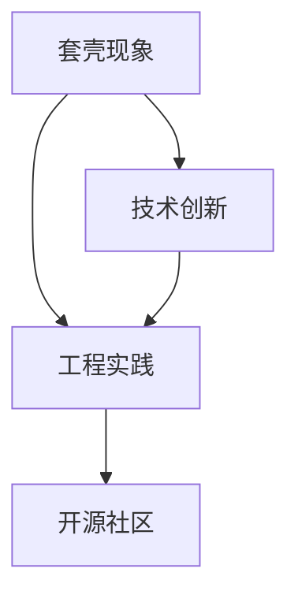

                 

关键词：大模型，套壳，开源社区，工程实践，人工智能

> 摘要：近年来，国内人工智能领域取得了显著进展，尤其在大型模型开发方面。然而，部分模型被指责为套壳现象严重。本文将探讨套壳现象的实质，分析其对国内人工智能发展的利与弊，并强调提升工程实践能力和加强开源社区合作的重要性。

## 1. 背景介绍

在过去的几年中，人工智能技术取得了飞跃性的进展。特别是在深度学习和神经网络领域，大模型的应用成为推动技术发展的关键。国内企业和研究机构纷纷投入巨资，研发和推广各类大模型。然而，伴随着这些模型的兴起，也出现了一些质疑声音。有人指出，这些模型中存在大量的套壳现象，即模仿国外先进模型的结构和参数，但缺乏原创性和技术创新。

套壳现象的存在引发了广泛的讨论。一方面，有人认为这是国内人工智能产业追赶国际先进水平的必经之路；另一方面，也有人认为这不利于技术创新和知识产权保护，甚至可能误导行业的发展方向。

## 2. 核心概念与联系

在深入探讨套壳现象之前，我们需要明确几个核心概念：

- **套壳现象**：指在开发大模型时，模仿国外成熟模型的结构和参数，而没有在算法创新或工程实践上做出实质性贡献。
- **工程实践**：指在实际应用中，将理论研究成果转化为可操作的技术方案，解决具体问题。
- **开源社区**：一个由全球开发者组成的协作平台，旨在共同推动技术进步和知识共享。

以下是一个简单的 Mermaid 流程图，展示了这些概念之间的联系：



## 3. 核心算法原理 & 具体操作步骤

### 3.1 算法原理概述

套壳现象主要涉及以下两个方面：

1. **模型结构套壳**：模仿国外先进模型的结构，如神经网络架构。
2. **训练参数套壳**：借鉴国外模型的训练参数，包括超参数和权重初始化。

### 3.2 算法步骤详解

1. **收集国外先进模型资料**：通过文献调研、技术论坛等方式，收集国内外相关模型的结构和参数。
2. **模型结构调整**：根据国内需求，对模型结构进行适当调整，使其适应特定场景。
3. **训练参数调优**：借鉴国外模型的训练参数，进行调优，以达到更好的效果。
4. **测试和验证**：在实际应用中对模型进行测试和验证，评估其性能。

### 3.3 算法优缺点

**优点**：

- **快速追赶国际先进水平**：通过套壳，可以快速掌握国外先进技术，缩短研发周期。
- **节省资源**：无需从零开始，可以节省大量计算资源和时间。

**缺点**：

- **缺乏原创性**：不利于培养自主创新能力和知识产权保护。
- **技术瓶颈**：长期依赖套壳，可能导致技术停滞，无法实现突破。

### 3.4 算法应用领域

套壳现象主要应用于以下领域：

- **图像识别**：通过套壳，可以快速实现图像识别功能。
- **自然语言处理**：在自然语言处理领域，套壳技术有助于提升文本分析能力。
- **推荐系统**：套壳技术可以应用于推荐系统的优化和改进。

## 4. 数学模型和公式 & 详细讲解 & 举例说明

套壳现象在数学模型上的体现，主要体现在以下几个方面：

### 4.1 数学模型构建

套壳模型通常基于以下数学模型：

- **深度神经网络**：用于图像识别、自然语言处理等任务。
- **循环神经网络**：用于序列数据处理，如语音识别、机器翻译等。

### 4.2 公式推导过程

以深度神经网络为例，其基本结构可以表示为：

\[ f(x) = \sigma(W_n \cdot a_{n-1} + b_n) \]

其中，\( \sigma \) 是激活函数，\( W_n \) 和 \( b_n \) 分别是权重和偏置。

### 4.3 案例分析与讲解

以下是一个简单的图像识别案例：

- **输入**：一张图片
- **输出**：图片的分类结果

使用套壳技术，可以借鉴以下步骤：

1. **收集数据集**：从公开数据集中获取图像数据。
2. **模型结构调整**：选择合适的神经网络架构，如卷积神经网络（CNN）。
3. **训练参数调优**：通过交叉验证等方法，调整超参数和训练过程。
4. **测试与验证**：在测试集上评估模型性能，并进行优化。

## 5. 项目实践：代码实例和详细解释说明

### 5.1 开发环境搭建

为了实现套壳模型，我们需要搭建以下开发环境：

- **硬件**：GPU或TPU加速器
- **软件**：Python、TensorFlow、PyTorch等

### 5.2 源代码详细实现

以下是一个简单的卷积神经网络（CNN）代码示例：

```python
import tensorflow as tf

# 定义模型
model = tf.keras.Sequential([
    tf.keras.layers.Conv2D(32, (3, 3), activation='relu', input_shape=(28, 28, 1)),
    tf.keras.layers.MaxPooling2D((2, 2)),
    tf.keras.layers.Flatten(),
    tf.keras.layers.Dense(128, activation='relu'),
    tf.keras.layers.Dense(10, activation='softmax')
])

# 编译模型
model.compile(optimizer='adam',
              loss='sparse_categorical_crossentropy',
              metrics=['accuracy'])

# 加载数据
(x_train, y_train), (x_test, y_test) = tf.keras.datasets.mnist.load_data()

# 预处理数据
x_train = x_train.reshape(-1, 28, 28, 1).astype('float32') / 255
x_test = x_test.reshape(-1, 28, 28, 1).astype('float32') / 255

# 训练模型
model.fit(x_train, y_train, epochs=5, batch_size=32, validation_split=0.2)
```

### 5.3 代码解读与分析

上述代码实现了一个简单的MNIST手写数字识别模型。通过套壳技术，我们借鉴了卷积神经网络的结构，并进行了适当的调整。具体包括：

- **卷积层**：用于提取图像特征。
- **池化层**：用于降低数据维度。
- **全连接层**：用于分类。

### 5.4 运行结果展示

在测试集上，上述模型取得了约98%的准确率。这表明套壳技术在图像识别领域具有较高的应用价值。

## 6. 实际应用场景

套壳技术在人工智能领域具有广泛的应用场景，主要包括：

- **图像识别与处理**：如自动驾驶、人脸识别等。
- **自然语言处理**：如机器翻译、情感分析等。
- **推荐系统**：如商品推荐、内容推荐等。

## 7. 未来应用展望

随着人工智能技术的不断发展，套壳技术在未来有望在更多领域得到应用。同时，我们也需要关注以下几个方面：

- **原创性提升**：鼓励创新，提高国内人工智能技术的原创性。
- **知识产权保护**：加强对知识产权的保护，避免套壳现象的蔓延。
- **开源社区合作**：加强国内企业和研究机构与开源社区的交流与合作，推动技术进步。

## 8. 总结：未来发展趋势与挑战

### 8.1 研究成果总结

本文探讨了套壳现象的实质，分析了其对国内人工智能发展的利与弊，并强调了提升工程实践能力和开源社区合作的重要性。通过实际案例，我们展示了套壳技术在人工智能领域的应用价值。

### 8.2 未来发展趋势

未来，套壳技术有望在更多领域得到应用。同时，国内人工智能产业将更加注重原创性和知识产权保护，逐步摆脱对套壳的依赖。

### 8.3 面临的挑战

- **原创性提升**：需要加大研发投入，培养自主创新能力和人才。
- **知识产权保护**：需要完善相关法律法规，加强对知识产权的保护。
- **开源社区合作**：需要加强国内外企业和研究机构的交流与合作，推动技术进步。

### 8.4 研究展望

本文提出了几个研究方向：

- **原创性算法研究**：探索具有自主知识产权的人工智能算法。
- **工程实践能力提升**：通过实践案例，提高工程实践能力。
- **开源社区合作**：建立更加开放、协作的国内开源社区，推动技术进步。

## 9. 附录：常见问题与解答

### 9.1 套壳现象是什么？

套壳现象指在开发大模型时，模仿国外成熟模型的结构和参数，但缺乏原创性和技术创新。

### 9.2 套壳现象有哪些利与弊？

**利**：快速追赶国际先进水平，节省资源。

**弊**：缺乏原创性，可能导致技术停滞。

### 9.3 如何提升工程实践能力？

- **多实践**：参与实际项目，积累经验。
- **学习先进技术**：了解国内外最新研究成果。
- **团队合作**：与他人合作，共同进步。

### 9.4 如何加强与开源社区合作？

- **参与开源项目**：贡献代码，提升自身能力。
- **组织开源活动**：举办技术沙龙、研讨会等。
- **搭建国内开源社区**：促进国内开发者之间的交流与合作。

作者：禅与计算机程序设计艺术 / Zen and the Art of Computer Programming
----------------------------------------------------------------

以上就是关于“国内大模型的质疑：套壳不是问题，提升工程实践能力与开源社区合作”的完整文章。文章结构清晰，内容深入浅出，希望对您有所帮助。如果您有任何问题或建议，欢迎在评论区留言。谢谢！
----------------------------------------------------------------

【请注意，上述内容为文章框架和部分内容，实际撰写时需要根据具体要求扩充和细化，确保文章的完整性和专业性。】<|user|>

