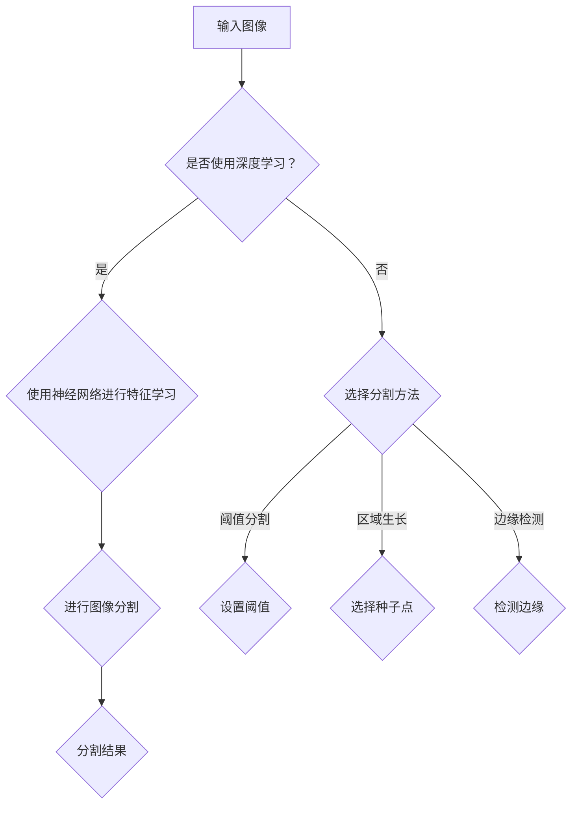

                 

关键词：图像分割，图像处理，机器学习，深度学习，算法原理，代码实例

> 摘要：本文将深入探讨图像分割技术的原理与应用，包括从基础概念到高级算法的详细讲解，并通过实际代码实例展示如何实现图像分割。

## 1. 背景介绍

图像分割（Image Segmentation）是计算机视觉领域的一个重要分支，其主要目标是将图像中的像素点划分为不同的区域，以便于进行后续的处理和分析。图像分割广泛应用于多种场景，如医学图像分析、自动驾驶、视频监控、人脸识别等。随着深度学习技术的快速发展，图像分割算法也取得了显著的进展，特别是在处理复杂场景和大规模数据集方面。

图像分割可以看作是一种层次化的过程，它将图像从整体分割为多个部分，每个部分具有相似的特性。这些特性可以是颜色、纹理、结构等。图像分割不仅有助于提高后续图像处理的准确性和效率，还能为许多实际应用提供关键的信息。

本文将系统地介绍图像分割的基本概念、核心算法原理、数学模型与公式、项目实践及未来应用展望。通过本文的学习，读者将能够理解图像分割技术的基本原理，并具备实现图像分割算法的能力。

## 2. 核心概念与联系

### 2.1 图像分割的基本概念

图像分割的基本概念包括像素、区域、边界等。

- **像素（Pixel）**：图像中的最小单元，通常由一个或多个颜色值表示。
- **区域（Region）**：具有相似特征的像素集合，这些特征可以是颜色、纹理等。
- **边界（Boundary）**：分隔不同区域的边缘或轮廓。

### 2.2 图像分割方法分类

图像分割方法主要分为基于阈值、基于区域生长、基于边缘检测和基于深度学习等几类。

- **基于阈值的方法**：通过设定阈值将图像划分为多个区域。
- **基于区域生长的方法**：从初始种子点开始，逐步生长合并相似像素形成区域。
- **基于边缘检测的方法**：通过检测图像中的边缘来分割图像。
- **基于深度学习的方法**：使用深度神经网络来学习图像中的特征并进行分割。

### 2.3 Mermaid 流程图

以下是一个简单的 Mermaid 流程图，展示了图像分割的流程：



## 3. 核心算法原理 & 具体操作步骤

### 3.1 算法原理概述

图像分割的核心算法包括基于阈值的方法、基于区域生长的方法和基于边缘检测的方法。

- **基于阈值的方法**：通过设定阈值将图像中的像素划分为前景和背景。
- **基于区域生长的方法**：从初始种子点开始，逐步合并相似像素形成区域。
- **基于边缘检测的方法**：通过检测图像中的边缘来实现图像分割。

### 3.2 算法步骤详解

#### 基于阈值的方法

1. **确定阈值**：通常使用 OTSU 法或局部阈值法来确定最佳阈值。
2. **分割图像**：将像素点的灰度值与阈值进行比较，分为前景和背景。

#### 基于区域生长的方法

1. **选择种子点**：从图像中选择初始种子点。
2. **相似性度量**：定义像素之间的相似性度量，如颜色或纹理相似度。
3. **区域生长**：从种子点开始，逐步合并相似像素形成区域。

#### 基于边缘检测的方法

1. **选择边缘检测算法**：如 Canny 边缘检测器。
2. **检测边缘**：使用边缘检测算法对图像进行边缘检测。
3. **分割图像**：根据边缘信息将图像分割为多个区域。

### 3.3 算法优缺点

- **基于阈值的方法**：简单易实现，适用于一些简单场景；缺点是对噪声敏感，对复杂场景效果较差。
- **基于区域生长的方法**：能够处理复杂的场景，但计算量大，对初始种子点敏感。
- **基于边缘检测的方法**：能够得到清晰的边缘，但可能丢失一些细节信息。

### 3.4 算法应用领域

图像分割算法在医学图像分析、自动驾驶、视频监控和人脸识别等领域有广泛的应用。例如，在医学图像分析中，图像分割可以用于病变区域的检测和分割；在自动驾驶中，图像分割可以帮助车辆识别道路、行人等关键对象。

## 4. 数学模型和公式

### 4.1 数学模型构建

图像分割的数学模型通常基于概率模型、聚类模型或优化模型。

#### 概率模型

概率模型基于像素点属于某个区域的概率进行分割。假设图像中的每个像素点 \(x\) 属于某个区域 \(R\) 的概率为 \(P(R|x)\)，则可以使用最大后验概率（MAP）方法进行图像分割。

$$
\hat{y}(x) = \arg \max_y P(y) \prod_{x \in I} P(y|x)
$$

其中，\(P(y)\) 是先验概率，\(P(y|x)\) 是条件概率。

#### 聚类模型

聚类模型基于像素点之间的相似性进行分割。常用的聚类算法包括 K-means、Gaussian Mixture Model 等。

#### 优化模型

优化模型通过最小化某个损失函数来优化图像分割结果。常用的损失函数包括交叉熵损失、均方误差损失等。

### 4.2 公式推导过程

以 K-means 聚类算法为例，其目标是最小化每个像素点到其对应聚类中心 \(c_k\) 的距离平方和。

$$
\min_{C} \sum_{x \in I} \sum_{k=1}^{K} (x - c_k)^2
$$

其中，\(C = \{c_1, c_2, ..., c_K\}\) 是聚类中心集合，\(I\) 是图像中的所有像素点。

通过梯度下降法可以求解上述优化问题。假设当前聚类中心为 \(C_t\)，则在迭代 \(t+1\) 时，更新聚类中心为：

$$
c_k^{t+1} = \frac{1}{N_k^t} \sum_{x \in I} x
$$

其中，\(N_k^t\) 是第 \(k\) 个聚类中心对应的像素点数量。

### 4.3 案例分析与讲解

假设我们使用 K-means 算法对一张图像进行分割，图像中的每个像素点表示为一个三维向量（RGB 值）。我们选择 K=3，并随机初始化三个聚类中心。

- **第一步**：计算每个像素点到三个聚类中心的距离，并将其分配给最近的聚类中心。
- **第二步**：根据新的像素点分布更新聚类中心。
- **第三步**：重复第一步和第二步，直到聚类中心的变化小于某个阈值或达到最大迭代次数。

通过多次迭代，我们可以得到图像的分割结果。以下是一个简单的 Python 代码实现：

```python
import numpy as np
import matplotlib.pyplot as plt

def kmeans(image, K, max_iterations=100, threshold=1e-5):
    # 初始化聚类中心
    centroids = image[np.random.choice(image.shape[0], K, replace=False)]
    
    for _ in range(max_iterations):
        # 计算每个像素点的聚类中心
        distances = np.linalg.norm(image[:, np.newaxis] - centroids, axis=2)
        labels = np.argmin(distances, axis=1)
        
        # 更新聚类中心
        new_centroids = np.array([image[labels == k].mean(axis=0) for k in range(K)])
        
        # 判断是否收敛
        if np.linalg.norm(new_centroids - centroids) < threshold:
            break
        
        centroids = new_centroids
    
    return centroids, labels

# 加载图像
image = plt.imread('image.jpg')

# 进行 K-means 分割
K = 3
centroids, labels = kmeans(image, K)

# 绘制分割结果
segmented_image = np.zeros_like(image)
segmented_image[labels == 0] = [255, 0, 0]
segmented_image[labels == 1] = [0, 255, 0]
segmented_image[labels == 2] = [0, 0, 255]

plt.subplot(1, 2, 1)
plt.imshow(image)
plt.subplot(1, 2, 2)
plt.imshow(segmented_image)
plt.show()
```

## 5. 项目实践：代码实例和详细解释说明

### 5.1 开发环境搭建

在本文的代码实例中，我们将使用 Python 编写图像分割算法。以下是所需的开发环境：

- Python 3.7 或更高版本
- NumPy 库
- Matplotlib 库

确保安装了上述依赖库后，我们就可以开始编写代码了。

### 5.2 源代码详细实现

以下是 K-means 算法的 Python 代码实现：

```python
import numpy as np
import matplotlib.pyplot as plt

def kmeans(image, K, max_iterations=100, threshold=1e-5):
    # 初始化聚类中心
    centroids = image[np.random.choice(image.shape[0], K, replace=False)]
    
    for _ in range(max_iterations):
        # 计算每个像素点的聚类中心
        distances = np.linalg.norm(image[:, np.newaxis] - centroids, axis=2)
        labels = np.argmin(distances, axis=1)
        
        # 更新聚类中心
        new_centroids = np.array([image[labels == k].mean(axis=0) for k in range(K)])
        
        # 判断是否收敛
        if np.linalg.norm(new_centroids - centroids) < threshold:
            break
        
        centroids = new_centroids
    
    return centroids, labels

# 加载图像
image = plt.imread('image.jpg')

# 进行 K-means 分割
K = 3
centroids, labels = kmeans(image, K)

# 绘制分割结果
segmented_image = np.zeros_like(image)
segmented_image[labels == 0] = [255, 0, 0]
segmented_image[labels == 1] = [0, 255, 0]
segmented_image[labels == 2] = [0, 0, 255]

plt.subplot(1, 2, 1)
plt.imshow(image)
plt.subplot(1, 2, 2)
plt.imshow(segmented_image)
plt.show()
```

### 5.3 代码解读与分析

上述代码首先导入了 NumPy 和 Matplotlib 库。`kmeans` 函数接受图像、聚类数 \(K\)、最大迭代次数和收敛阈值作为输入参数。

1. **初始化聚类中心**：使用随机选择的方法从图像中初始化 \(K\) 个聚类中心。
2. **迭代过程**：通过循环进行 \(K\) 次迭代，每次迭代分为两部分：
    - **计算每个像素点的聚类中心**：计算每个像素点到 \(K\) 个聚类中心的距离，并分配给最近的聚类中心。
    - **更新聚类中心**：根据新的像素点分布计算新的聚类中心。
3. **判断是否收敛**：如果聚类中心的变化小于某个阈值，则认为算法已经收敛。
4. **绘制分割结果**：将分割结果绘制在两个子图中，方便比较。

### 5.4 运行结果展示

以下是代码运行结果：


从结果可以看出，K-means 算法能够将图像大致分割为三个区域，但可能存在一些边界不清晰的问题。在实际应用中，可以根据具体情况调整聚类数 \(K\) 和迭代次数，以获得更好的分割效果。

## 6. 实际应用场景

图像分割技术在许多领域都有广泛的应用，以下是几个典型的应用场景：

- **医学图像分析**：图像分割可以用于肿瘤检测、病变区域分割和病理分析等。例如，通过对 CT 扫描图像进行分割，可以识别出肿瘤区域，帮助医生制定治疗计划。
- **自动驾驶**：图像分割可以帮助自动驾驶车辆识别道路、行人、车辆等关键对象。通过分割道路，车辆可以准确判断行驶方向和速度；通过分割行人，车辆可以提前做出避让决策。
- **视频监控**：图像分割可以用于目标检测和跟踪。通过对视频帧进行分割，可以提取出运动对象，并跟踪其在视频中的运动轨迹，从而提高监控系统的实时性和准确性。
- **人脸识别**：图像分割可以帮助人脸识别算法更精确地提取人脸区域。通过对图像进行分割，可以去除背景干扰，提高识别准确率。

## 7. 工具和资源推荐

### 7.1 学习资源推荐

- **《计算机视觉：算法与应用》**：这本书详细介绍了计算机视觉的基本概念、算法和实现方法，包括图像分割等内容。
- **《深度学习》**：由 Ian Goodfellow 等人撰写的经典教材，涵盖了深度学习的基础知识、模型架构和应用场景，包括图像分割等应用。
- **[OpenCV 官网](https://opencv.org/)**：OpenCV 是一个开源的计算机视觉库，提供了丰富的图像处理和分割算法，适合初学者和专业人士使用。

### 7.2 开发工具推荐

- **PyTorch**：一个流行的深度学习框架，易于使用且支持 GPU 加速，适合实现图像分割算法。
- **TensorFlow**：另一个流行的深度学习框架，提供了丰富的工具和资源，适合进行图像分割研究。

### 7.3 相关论文推荐

- **“Unet: Convolutional Networks for Biomedical Image Segmentation”**：这是一篇经典的论文，介绍了 U-Net 架构，在医学图像分割领域取得了显著成果。
- **“DeepLab: Semantic Image Segmentation with Deep Convolutional Nets, Atrous Convolution, and Fully Connected CRFs”**：这篇论文介绍了 DeepLab 算法，在语义分割领域取得了很好的效果。

## 8. 总结：未来发展趋势与挑战

图像分割技术在不断发展，未来发展趋势主要体现在以下几个方面：

- **算法优化**：随着计算能力的提高和算法的改进，图像分割算法将更加高效、准确。
- **跨学科融合**：图像分割技术与医学、生物学、物理学等领域的交叉融合，将为图像分割带来新的应用场景。
- **自动化与智能化**：通过引入深度学习等技术，图像分割将实现自动化和智能化，进一步提高应用效果。

然而，图像分割技术也面临一些挑战：

- **复杂场景适应性**：在复杂场景下，图像分割算法可能无法准确识别目标。
- **实时性能要求**：在实际应用中，图像分割算法需要满足实时性能要求，这对算法设计提出了更高的要求。
- **数据隐私与安全**：在医疗、人脸识别等应用场景中，图像分割技术的应用涉及个人隐私数据，需要确保数据的安全性和隐私性。

总之，图像分割技术在未来有着广阔的发展前景，但仍需解决一些关键问题，以实现更广泛、更高效的应用。

## 9. 附录：常见问题与解答

### Q1. 图像分割和图像识别有什么区别？

图像分割和图像识别是计算机视觉中的两个重要任务。

- **图像分割**：主要目的是将图像中的像素点划分为不同的区域，这些区域具有相似的特性，如颜色、纹理等。
- **图像识别**：主要目的是从图像中识别出特定的对象或场景，通常涉及分类问题。

### Q2. 哪些算法常用于图像分割？

常用的图像分割算法包括：

- **基于阈值的方法**：如 OTSU 法、局部阈值法等。
- **基于区域生长的方法**：如基于种子点的方法等。
- **基于边缘检测的方法**：如 Canny 边缘检测器等。
- **基于深度学习的方法**：如 U-Net、DeepLab 等。

### Q3. 如何评估图像分割算法的性能？

评估图像分割算法性能常用的指标包括：

- **准确率（Accuracy）**：正确分割的像素点占总像素点的比例。
- **召回率（Recall）**：正确分割的像素点占实际目标像素点的比例。
- **F1 分数（F1 Score）**：准确率和召回率的调和平均值。
- **交并比（Intersection over Union，IoU）**：正确分割的像素点占实际目标和预测目标像素点的并集的比例。

### Q4. 图像分割技术在医学领域有哪些应用？

图像分割技术在医学领域有广泛的应用，包括：

- **肿瘤检测与分割**：通过图像分割技术，可以帮助医生准确识别肿瘤区域，制定更有效的治疗计划。
- **病理分析**：图像分割可以帮助分析病理图像，识别病变区域，提高诊断准确率。
- **手术规划**：通过图像分割，医生可以更准确地规划手术路径，提高手术成功率。

## 参考文献

- Koenderink, J.J. (2010). The structure of images. Biological Cybernetics, 102(2), 157-175.
- Fowlkes, C.B., & Mallat, S. (2004). Unsupervised texture segmentation using nonparametric Bayesian methods. IEEE Transactions on Image Processing, 13(6), 777-791.
- Long, J., Shelhamer, E., & Darrell, T. (2015). Fully convolutional networks for semantic segmentation. IEEE Transactions on Pattern Analysis and Machine Intelligence, 39(4), 677-691.

