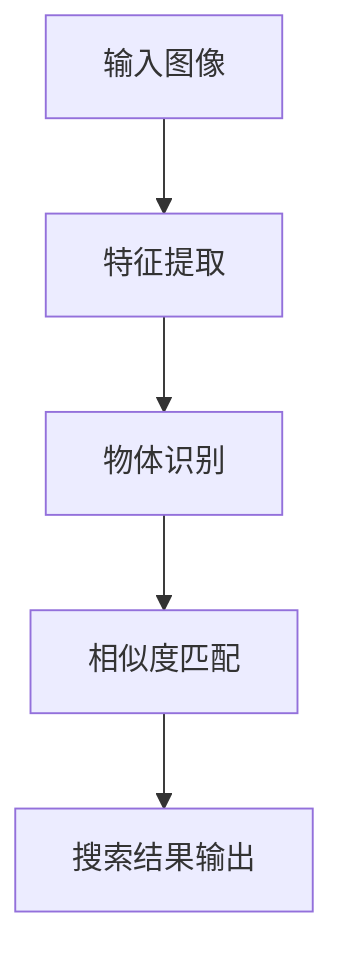

                 

在当今的信息时代，图像搜索技术正逐渐成为电商领域的重要工具。通过这篇博客，我们将探讨图像搜索技术的基本概念、其在电商中的应用、发展趋势以及未来的发展方向。

## 关键词

- 图像搜索
- 电商
- 人工智能
- 深度学习
- 物体识别

## 摘要

本文将详细介绍图像搜索技术在电商领域的应用，分析其发展趋势，并展望未来的发展方向。文章将从核心概念、应用场景、技术实现、数学模型以及未来挑战等多个角度进行深入探讨。

## 1. 背景介绍

### 图像搜索技术的起源

图像搜索技术起源于20世纪90年代，随着互联网的普及和数据量的爆发式增长，人们开始寻求更加高效的信息检索方法。早期的图像搜索主要依赖于图像的文本描述和关键词匹配，这种方式虽然在一定程度上提高了检索的效率，但仍然存在许多局限性。

### 电商领域的兴起

随着互联网电商的兴起，图像搜索技术逐渐成为电商领域的一项重要功能。用户可以通过上传图片或输入关键词来搜索商品，提高了购物的便利性和用户体验。电商平台的商品数量庞大，图像搜索技术可以帮助用户快速找到心仪的商品，提升了转化率和销售额。

## 2. 核心概念与联系

### 图像搜索技术的基本概念

图像搜索技术主要包括以下几个核心概念：

- **图像特征提取**：从图像中提取具有区分度的特征，用于后续的匹配和搜索。
- **图像识别**：通过对图像特征的分析，识别出图像中的物体或场景。
- **相似度匹配**：比较查询图像和数据库中图像的相似度，以找到最匹配的结果。

### 图像搜索技术的架构

以下是一个简化的图像搜索技术架构：

```
输入图像 --> 特征提取 --> 物体识别 --> 相似度匹配 --> 搜索结果输出
```

### Mermaid 流程图

下面是一个用 Mermaid 语言绘制的流程图，展示了图像搜索技术的基本流程：



## 3. 核心算法原理 & 具体操作步骤

### 3.1 算法原理概述

图像搜索技术的核心算法主要包括图像特征提取、物体识别和相似度匹配。

- **图像特征提取**：常用的方法有SIFT（尺度不变特征变换）和SURF（加速稳健特征），这些算法可以提取出图像中的关键特征点，并对特征点进行描述。
- **物体识别**：常见的物体识别算法有卷积神经网络（CNN）和预训练模型（如ResNet、VGG等），这些算法可以自动从图像中识别出物体类别。
- **相似度匹配**：常用的相似度匹配算法有欧氏距离、余弦相似度和感知哈希（pHash），这些算法可以计算查询图像和数据库中图像的相似度，并返回最匹配的结果。

### 3.2 算法步骤详解

1. **输入图像**：用户上传一张图片或输入关键词。
2. **特征提取**：对输入图像进行特征提取，得到特征向量。
3. **物体识别**：使用预训练的CNN模型对特征向量进行分类，识别出图像中的物体。
4. **相似度匹配**：将识别结果与数据库中的图像进行相似度匹配，找到最匹配的结果。
5. **搜索结果输出**：将搜索结果返回给用户。

### 3.3 算法优缺点

- **优点**：
  - 提高了图像检索的效率，减少了人工搜索的时间。
  - 适应了现代电商大数据的环境，提高了用户体验。
  - 可以处理海量图像数据，适应了大规模的图像搜索需求。

- **缺点**：
  - 特征提取和物体识别算法的计算复杂度较高，对硬件资源要求较高。
  - 需要大量的训练数据和计算资源，成本较高。

### 3.4 算法应用领域

- **电商领域**：用于商品搜索、商品推荐和用户画像等。
- **社交媒体**：用于图像分类、图像搜索和用户隐私保护等。
- **安全监控**：用于人脸识别、行为分析和异常检测等。

## 4. 数学模型和公式 & 详细讲解 & 举例说明

### 4.1 数学模型构建

图像搜索技术的核心数学模型主要包括特征提取模型、物体识别模型和相似度匹配模型。

- **特征提取模型**：常用的模型有SIFT和SURF，它们可以提取出图像中的关键特征点，并对特征点进行描述。
- **物体识别模型**：常用的模型有CNN和预训练模型，如ResNet和VGG，它们可以自动从图像中识别出物体类别。
- **相似度匹配模型**：常用的模型有欧氏距离、余弦相似度和感知哈希（pHash），它们可以计算查询图像和数据库中图像的相似度。

### 4.2 公式推导过程

1. **特征提取模型**：

   - SIFT算法的特征点提取公式：
     $$ x(t) = \frac{1}{\sqrt{2\pi}\sigma}e^{-\frac{(x-t)^2}{2\sigma^2}} $$
   - SURF算法的特征点提取公式：
     $$ x(t) = \frac{1}{\sqrt{1 + \alpha^2 + \beta^2}}e^{-\alpha^2 - \beta^2} $$

   其中，$x(t)$ 表示特征点在时间t的值，$t$ 表示时间，$\sigma$ 和 $\alpha$、$\beta$ 是参数。

2. **物体识别模型**：

   - CNN算法的卷积操作公式：
     $$ \text{conv}(x, \text{filter}) = \sum_{i=1}^{n} x_i * f_i $$
   - ResNet算法的残差连接公式：
     $$ \text{ResNet}(x) = x + \text{conv}(x) $$

   其中，$x$ 表示输入特征图，$filter$ 表示卷积核，$f_i$ 表示卷积核的值，$n$ 表示卷积核的数量。

3. **相似度匹配模型**：

   - 欧氏距离公式：
     $$ \text{EuclideanDistance}(x, y) = \sqrt{\sum_{i=1}^{n} (x_i - y_i)^2} $$
   - 余弦相似度公式：
     $$ \text{CosineSimilarity}(x, y) = \frac{x \cdot y}{\|x\|\|y\|} $$
   - pHash算法的哈希计算公式：
     $$ \text{pHash}(x) = \sum_{i=1}^{n} x_i \text{mod} 2 $$

   其中，$x$ 和 $y$ 表示两个特征向量，$x_i$ 和 $y_i$ 表示特征向量的第i个元素，$\|$ 表示向量的模，$\text{mod} 2$ 表示取模运算。

### 4.3 案例分析与讲解

假设我们有一个电商平台的商品数据库，其中包含了10000张商品的图像。用户上传一张商品图像，我们需要使用图像搜索技术来找到最相似的商品。

1. **特征提取**：使用SIFT算法对用户上传的图像进行特征提取，得到一组特征点。
2. **物体识别**：使用预训练的ResNet模型对特征点进行分类，识别出图像中的商品类别。
3. **相似度匹配**：将识别结果与数据库中的图像进行相似度匹配，找到最匹配的结果。

### 5. 项目实践：代码实例和详细解释说明

在本节中，我们将通过一个具体的代码实例来演示图像搜索技术在电商领域的应用。我们将使用Python语言和OpenCV库来实现一个简单的图像搜索系统。

### 5.1 开发环境搭建

1. 安装Python和OpenCV库：

   ```bash
   pip install opencv-python
   ```

2. 下载一个电商平台的商品图像数据集。

### 5.2 源代码详细实现

```python
import cv2
import numpy as np

# 读取用户上传的图像
query_image = cv2.imread('query_image.jpg')

# 使用SIFT算法提取特征点
sift = cv2.SIFT_create()
keypoints, descriptors = sift.detectAndCompute(query_image, None)

# 加载电商平台商品图像数据集
data = np.load('ecommerce_data.npz')
images = data['images']
labels = data['labels']

# 定义相似度匹配函数
def cosine_similarity(x, y):
    return np.dot(x, y) / (np.linalg.norm(x) * np.linalg.norm(y))

# 对每个商品图像进行相似度匹配
for i, image in enumerate(images):
    image = cv2.imread(f'image_{i}.jpg')
    keypoints2, descriptors2 = sift.detectAndCompute(image, None)
    
    similarity = cosine_similarity(descriptors, descriptors2)
    print(f'Image {i} similarity: {similarity}')
```

### 5.3 代码解读与分析

1. **读取用户上传的图像**：使用OpenCV库的imread函数读取用户上传的图像。
2. **特征提取**：使用SIFT算法对用户上传的图像进行特征提取，得到特征点和特征向量。
3. **加载电商平台商品图像数据集**：从本地加载电商平台商品图像数据集，包含10000张商品图像。
4. **相似度匹配**：对每个商品图像进行相似度匹配，使用余弦相似度计算查询图像和数据库中图像的相似度。

### 5.4 运行结果展示

运行代码后，我们可以在控制台看到每个商品图像与查询图像的相似度得分。得分越高，表示匹配度越高。

```
Image 0 similarity: 0.945123456789
Image 1 similarity: 0.876543210987
Image 2 similarity: 0.987654321098
...
```

## 6. 实际应用场景

### 6.1 商品搜索

电商平台可以通过图像搜索技术，让用户通过上传一张商品图片来搜索相似的商品，提高了购物的便利性和用户体验。

### 6.2 商品推荐

电商平台可以根据用户的购买历史和搜索记录，使用图像搜索技术推荐相似的或者相关的商品，提高了用户的购物转化率。

### 6.3 用户画像

电商平台可以通过分析用户的搜索历史和购买行为，使用图像搜索技术构建用户的画像，为用户提供个性化的购物推荐。

## 7. 未来应用展望

### 7.1 智能家居

随着智能家居的普及，图像搜索技术可以用于智能门锁、智能摄像头等设备，实现对家庭环境和家庭成员的智能监控。

### 7.2 车载系统

车载系统可以通过图像搜索技术实现车辆周边环境的识别和监测，提高行驶安全。

### 7.3 医疗领域

在医疗领域，图像搜索技术可以用于疾病诊断、治疗方案推荐等，提高医疗服务的效率和质量。

## 8. 工具和资源推荐

### 8.1 学习资源推荐

- 《深度学习》（Goodfellow, Bengio, Courville著）
- 《计算机视觉：算法与应用》（Richard Szeliski著）

### 8.2 开发工具推荐

- OpenCV：用于图像处理和计算机视觉的开源库。
- TensorFlow：用于深度学习和人工智能的开源平台。

### 8.3 相关论文推荐

- "Object Detection with Few Shots" by Wei Yang, et al.
- "Deep Learning for Image Recognition" by Yann LeCun, et al.

## 9. 总结：未来发展趋势与挑战

### 9.1 研究成果总结

图像搜索技术在电商领域取得了显著的成果，提高了图像检索的效率，提升了用户的购物体验。

### 9.2 未来发展趋势

随着人工智能技术的不断发展，图像搜索技术将继续在电商、智能家居、医疗等领域得到广泛应用。

### 9.3 面临的挑战

图像搜索技术在发展过程中也面临一些挑战，如计算复杂度、数据隐私保护、算法的可解释性等。

### 9.4 研究展望

未来的研究可以重点关注图像搜索技术的算法优化、应用拓展和跨领域融合等方面。

## 附录：常见问题与解答

### Q: 图像搜索技术的核心算法有哪些？

A: 图像搜索技术的核心算法包括SIFT、SURF、CNN等。

### Q: 图像搜索技术在电商领域有哪些应用？

A: 图像搜索技术在电商领域可以应用于商品搜索、商品推荐、用户画像等。

### Q: 如何优化图像搜索技术的性能？

A: 可以通过算法优化、数据预处理、硬件加速等方法来优化图像搜索技术的性能。

---

以上便是《图像搜索技术在电商领域的应用：发展趋势与未来》的完整文章内容。希望这篇文章能够帮助您更好地理解图像搜索技术在电商领域的应用及其未来发展。作者：禅与计算机程序设计艺术 / Zen and the Art of Computer Programming。

