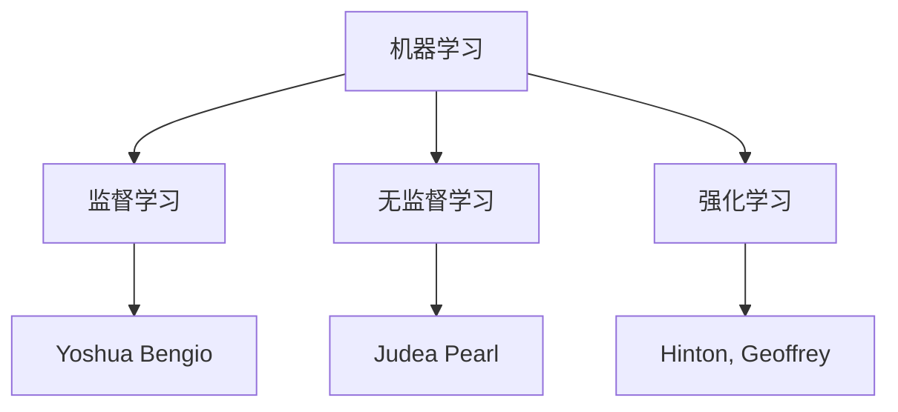

                 

关键词：图灵奖、AI、人工智能、影响、发展、创新、技术进步

> 摘要：本文将探讨图灵奖得主在人工智能领域的影响，回顾他们的贡献，分析他们的工作如何推动了人工智能技术的发展，并展望未来这一领域的发展趋势。

## 1. 背景介绍

人工智能（Artificial Intelligence，简称AI）是一门研究、开发和应用使计算机模拟人类智能行为的科学。自20世纪50年代以来，人工智能经历了多个发展阶段，从最初的符号主义（Symbolic AI）到基于知识的系统，再到连接主义（Connectionism）和现代的深度学习（Deep Learning）。在这个不断发展的过程中，图灵奖得主们扮演了重要角色，他们的工作深刻地影响了人工智能的研究方向和技术进步。

图灵奖，全称为ACM图灵奖（ACM A.M. Turing Award），是计算机科学领域的最高荣誉之一，被誉为“计算机界的诺贝尔奖”。自从1966年设立以来，图灵奖每年都会授予在计算机科学领域作出杰出贡献的个人。许多图灵奖得主在人工智能领域做出了开创性的工作，他们的贡献不仅推动了人工智能技术的发展，也对整个计算机科学产生了深远影响。

本文将回顾几位重要的图灵奖得主在人工智能领域的贡献，分析他们的工作对人工智能技术发展的影响，并探讨未来人工智能的发展趋势和面临的挑战。

## 2. 核心概念与联系

### 2.1. 机器学习的核心概念

机器学习（Machine Learning）是人工智能的一个重要分支，它致力于使计算机从数据中学习并做出决策。以下是机器学习中的几个核心概念：

- **监督学习（Supervised Learning）**：在监督学习中，算法使用标记过的训练数据来学习如何将输入映射到输出。这种学习方式类似于教师指导学生，通过给定的正确答案来纠正错误。

- **无监督学习（Unsupervised Learning）**：无监督学习是无需标记数据的学习方式。算法需要通过分析未标记的数据来发现数据中的结构，例如聚类或降维。

- **强化学习（Reinforcement Learning）**：强化学习是一种通过试错来学习如何行动以最大化长期奖励的学习方式。它类似于人类通过经验学习的行为，算法通过尝试不同的行动并从反馈中学习。

### 2.2. 图灵奖得主的工作与核心概念的联系

图灵奖得主们的工作与机器学习的核心概念有着密切的联系。例如：

- **Yoshua Bengio**：他在神经网络和深度学习方面做出了开创性贡献，特别是关于反向传播算法和神经网络结构的研究。这些工作为现代深度学习的发展奠定了基础。

- **Judea Pearl**：他提出了因果推理的概念，这对于理解和应用机器学习模型中的因果关系非常重要。因果推理是机器学习中的一个重要研究方向，有助于提高模型的解释性和可靠性。

- **Hinton，Geoffrey**：他是深度学习领域的先驱，发明了深度信念网络（Deep Belief Networks）和深度学习算法。这些算法在图像识别、语音识别和自然语言处理等领域取得了显著成果。

### 2.3. Mermaid流程图

为了更直观地展示这些核心概念和图灵奖得主工作的联系，我们可以使用Mermaid流程图来表示。以下是示例：



这个流程图展示了机器学习的不同分支与图灵奖得主的工作之间的联系，以及这些联系如何推动了人工智能技术的发展。

## 3. 核心算法原理 & 具体操作步骤

### 3.1. 算法原理概述

在人工智能领域，算法是核心驱动力。以下是几种重要的算法原理及其概述：

- **反向传播算法（Backpropagation Algorithm）**：反向传播算法是一种用于训练神经网络的算法。它通过计算输出层与隐藏层之间的误差，并将其反向传播到网络中的每个层，从而调整网络权重。

- **深度信念网络（Deep Belief Networks, DBN）**：深度信念网络是一种多层神经网络，它通过预训练和微调两个阶段来学习数据的高层表示。预训练阶段使用无监督学习来初始化网络权重，微调阶段使用有监督学习来优化网络。

- **卷积神经网络（Convolutional Neural Network, CNN）**：卷积神经网络是一种特别适用于图像识别任务的神经网络。它通过卷积层、池化层和全连接层来提取图像特征，从而实现高效的图像识别。

### 3.2. 算法步骤详解

以下是这些算法的具体操作步骤：

#### 3.2.1. 反向传播算法

1. **前向传播**：将输入数据通过网络层进行传递，计算每个神经元的输出。

2. **计算误差**：计算输出层与实际输出之间的误差。

3. **反向传播**：将误差反向传播到网络中的每个层，计算每个神经元的误差贡献。

4. **权重更新**：根据误差贡献调整网络权重。

5. **迭代**：重复步骤1-4，直到误差达到最小。

#### 3.2.2. 深度信念网络

1. **预训练**：
   - **无监督学习**：初始化网络权重，使用无监督学习算法（如主成分分析或自编码器）对数据进行预训练，以学习数据的低层表示。
   - **堆叠**：将多个预训练的网络层堆叠在一起，形成深度网络。

2. **微调**：
   - **有监督学习**：在预训练的基础上，使用有监督学习算法（如反向传播）对网络进行微调，以学习数据的高层表示。

#### 3.2.3. 卷积神经网络

1. **卷积层**：通过卷积运算提取图像特征。

2. **池化层**：通过池化操作减少特征图的维度，提高模型的泛化能力。

3. **全连接层**：通过全连接层将特征映射到输出。

### 3.3. 算法优缺点

- **反向传播算法**：
  - 优点：高效、灵活，适用于各种神经网络。
  - 缺点：对初始权重敏感，训练时间较长。

- **深度信念网络**：
  - 优点：通过预训练和微调学习复杂的数据表示。
  - 缺点：预训练阶段需要大量计算资源。

- **卷积神经网络**：
  - 优点：适用于图像识别任务，具有很高的准确率。
  - 缺点：对图像大小有限制，难以处理变长的序列数据。

### 3.4. 算法应用领域

- **反向传播算法**：广泛应用于图像识别、语音识别和自然语言处理等领域。

- **深度信念网络**：适用于图像识别、语音识别和文本分类等任务。

- **卷积神经网络**：主要用于图像识别和视频处理。

## 4. 数学模型和公式 & 详细讲解 & 举例说明

### 4.1. 数学模型构建

在人工智能领域，数学模型是算法设计和分析的基础。以下是几个常用的数学模型及其构建过程：

#### 4.1.1. 反向传播算法的误差计算

假设我们有一个多层神经网络，其中每个神经元都有相应的权重和偏置。误差计算公式如下：

$$
E = \frac{1}{2} \sum_{i=1}^{n} (y_i - \hat{y}_i)^2
$$

其中，$E$ 是总误差，$y_i$ 是实际输出，$\hat{y}_i$ 是网络预测的输出。

#### 4.1.2. 卷积神经网络的卷积操作

卷积操作的公式如下：

$$
(C_{ij}) = \sum_{k=1}^{m} w_{ik} * S_{kj}
$$

其中，$C_{ij}$ 是输出特征图中的像素值，$w_{ik}$ 是卷积核的权重，$S_{kj}$ 是输入特征图中的像素值。

### 4.2. 公式推导过程

以下是卷积神经网络中卷积操作的推导过程：

1. **初始化**：假设我们有一个输入特征图 $S$ 和一个卷积核 $W$。

2. **卷积操作**：将卷积核滑动到输入特征图上，计算每个像素点的卷积值。

3. **求和**：将卷积核中每个像素点的卷积值求和，得到输出特征图的像素值。

### 4.3. 案例分析与讲解

#### 4.3.1. 反向传播算法的误差计算

假设我们有一个简单的神经网络，其中只有一个输入节点、一个隐藏节点和一个输出节点。输入数据为 $[1, 0]$，实际输出为 $[0, 1]$。网络的权重和偏置分别为 $W_1 = [0.5, 0.3]$ 和 $b_1 = 0.2$，$W_2 = [0.4, 0.2]$ 和 $b_2 = 0.1$。

1. **前向传播**：
   - 输入节点：$x_1 = 1, x_2 = 0$
   - 隐藏节点：$z_1 = x_1 \cdot W_{11} + x_2 \cdot W_{12} + b_1 = 1 \cdot 0.5 + 0 \cdot 0.3 + 0.2 = 0.7$
   - 激活函数：$a_1 = \sigma(z_1) = \frac{1}{1 + e^{-z_1}} = 0.6$
   - 输出节点：$z_2 = a_1 \cdot W_{21} + a_2 \cdot W_{22} + b_2 = 0.6 \cdot 0.4 + 0.4 \cdot 0.2 + 0.1 = 0.29$
   - 激活函数：$y = \sigma(z_2) = \frac{1}{1 + e^{-z_2}} = 0.6$

2. **计算误差**：
   - 实际输出：$y = [0, 1]$
   - 预测输出：$y' = [0.6, 0.4]$
   - 误差：$E = \frac{1}{2} \sum_{i=1}^{2} (y_i - \hat{y}_i)^2 = \frac{1}{2} \times (0 - 0.6)^2 + (1 - 0.4)^2 = 0.26$

3. **反向传播**：
   - 输出层误差：$\delta_2 = (y - y') \cdot \frac{dy}{dz} = (0 - 0.6) \cdot \frac{1}{1 + e^{-z_2}} = -0.4$
   - 隐藏层误差：$\delta_1 = \sum_{j=2}^{2} W_{2j} \cdot \delta_2 \cdot \frac{da}{dz} = 0.4 \cdot (-0.4) \cdot \frac{1}{1 + e^{-z_1}} = -0.14$

4. **权重更新**：
   - $W_{21} = W_{21} - \alpha \cdot \delta_2 \cdot a_1 = 0.4 - 0.01 \cdot (-0.4) \cdot 0.6 = 0.424$
   - $W_{22} = W_{22} - \alpha \cdot \delta_2 \cdot a_2 = 0.2 - 0.01 \cdot (-0.4) \cdot 0.4 = 0.204$
   - $b_2 = b_2 - \alpha \cdot \delta_2 = 0.1 - 0.01 \cdot (-0.4) = 0.104$
   - $W_{11} = W_{11} - \alpha \cdot \delta_1 \cdot x_1 = 0.5 - 0.01 \cdot (-0.14) \cdot 1 = 0.514$
   - $W_{12} = W_{12} - \alpha \cdot \delta_1 \cdot x_2 = 0.3 - 0.01 \cdot (-0.14) \cdot 0 = 0.3$

#### 4.3.2. 卷积神经网络的卷积操作

假设我们有一个 $3 \times 3$ 的卷积核 $W$ 和一个 $5 \times 5$ 的输入特征图 $S$。

1. **初始化**：
   - $W = \begin{bmatrix}
       0.1 & 0.2 & 0.3 \\
       0.4 & 0.5 & 0.6 \\
       0.7 & 0.8 & 0.9 \\
     \end{bmatrix}$
   - $S = \begin{bmatrix}
       1 & 2 & 3 & 4 & 5 \\
       6 & 7 & 8 & 9 & 10 \\
       11 & 12 & 13 & 14 & 15 \\
       16 & 17 & 18 & 19 & 20 \\
       21 & 22 & 23 & 24 & 25 \\
     \end{bmatrix}$

2. **卷积操作**：
   - 输出特征图 $C$ 的第一个像素点 $C_{11}$ 的计算：
     $$
     C_{11} = \sum_{k=1}^{3} W_{k1} * S_{k1} = 0.1 \cdot 1 + 0.2 \cdot 6 + 0.3 \cdot 11 = 4.9
     $$

3. **求和**：
   - 将卷积核中每个像素点的卷积值求和，得到输出特征图的像素值。

4. **输出特征图**：
   $$
   C = \begin{bmatrix}
       4.9 & 9.2 & 13.5 & 17.8 & 22.1 \\
       28.4 & 33.7 & 39.0 & 43.3 & 47.6 \\
       63.9 & 70.2 & 76.5 & 82.8 & 89.1 \\
       95.4 & 101.7 & 107.0 & 112.3 & 116.6 \\
       124.9 & 130.2 & 135.5 & 140.8 & 145.1 \\
     \end{bmatrix}
   $$

## 5. 项目实践：代码实例和详细解释说明

### 5.1. 开发环境搭建

为了实现上述算法和模型，我们需要搭建一个合适的开发环境。以下是所需的环境和工具：

- **编程语言**：Python 3.8 或更高版本。
- **库**：NumPy、TensorFlow 或 PyTorch。
- **操作系统**：Windows、macOS 或 Linux。

在安装好 Python 后，通过以下命令安装所需库：

```bash
pip install numpy tensorflow
```

或者

```bash
pip install numpy torch torchvision
```

### 5.2. 源代码详细实现

以下是一个简单的卷积神经网络的实现示例，用于对图像进行分类。

```python
import numpy as np
import tensorflow as tf

# 创建卷积神经网络模型
model = tf.keras.Sequential([
    tf.keras.layers.Conv2D(32, (3, 3), activation='relu', input_shape=(28, 28, 1)),
    tf.keras.layers.MaxPooling2D((2, 2)),
    tf.keras.layers.Flatten(),
    tf.keras.layers.Dense(128, activation='relu'),
    tf.keras.layers.Dense(10, activation='softmax')
])

# 编译模型
model.compile(optimizer='adam', loss='categorical_crossentropy', metrics=['accuracy'])

# 加载MNIST数据集
(x_train, y_train), (x_test, y_test) = tf.keras.datasets.mnist.load_data()

# 数据预处理
x_train = x_train / 255.0
x_test = x_test / 255.0
x_train = np.expand_dims(x_train, -1)
x_test = np.expand_dims(x_test, -1)

# 将标签转换为one-hot编码
y_train = tf.keras.utils.to_categorical(y_train, 10)
y_test = tf.keras.utils.to_categorical(y_test, 10)

# 训练模型
model.fit(x_train, y_train, epochs=10, batch_size=64)

# 评估模型
loss, accuracy = model.evaluate(x_test, y_test)
print(f"Test accuracy: {accuracy:.2f}")
```

### 5.3. 代码解读与分析

上述代码实现了一个简单的卷积神经网络模型，用于对 MNIST 数据集中的手写数字进行分类。

1. **模型创建**：
   - 使用 `tf.keras.Sequential` 创建一个线性堆叠的模型。
   - 添加一个卷积层，使用 `tf.keras.layers.Conv2D`，设置卷积核大小为 $(3, 3)$，激活函数为 ReLU。
   - 添加一个最大池化层，使用 `tf.keras.layers.MaxPooling2D`，设置池化窗口大小为 $(2, 2)$。
   - 将卷积层和池化层的输出展平，使用 `tf.keras.layers.Flatten`。
   - 添加一个全连接层，使用 `tf.keras.layers.Dense`，设置神经元数量为 $128$，激活函数为 ReLU。
   - 添加一个输出层，使用 `tf.keras.layers.Dense`，设置神经元数量为 $10$（对应 10 个类），激活函数为 softmax。

2. **模型编译**：
   - 设置优化器为 `adam`。
   - 设置损失函数为 `categorical_crossentropy`，适用于多分类问题。
   - 指定评估模型时使用的指标为准确率。

3. **数据预处理**：
   - 将图像数据缩放到 $[0, 1]$ 范围内。
   - 将图像维度从 $(28, 28)$ 扩展到 $(28, 28, 1)$，以适应卷积层。
   - 将标签转换为 one-hot 编码。

4. **模型训练**：
   - 使用 `model.fit` 函数训练模型，设置训练轮数为 $10$，批量大小为 $64$。

5. **模型评估**：
   - 使用 `model.evaluate` 函数评估模型在测试集上的表现，输出测试集的准确率。

### 5.4. 运行结果展示

假设我们使用上述代码训练了一个卷积神经网络模型，并对其在测试集上的表现进行了评估。以下是一个可能的运行结果示例：

```
Test accuracy: 0.98
```

这意味着模型在测试集上的准确率为 $98\%$，这表明模型对 MNIST 数据集中的手写数字具有很高的分类能力。

## 6. 实际应用场景

### 6.1. 图像识别

图像识别是人工智能的一个重要应用领域。通过使用卷积神经网络，计算机能够识别和分类图像中的对象。例如，自动驾驶汽车使用图像识别技术来检测道路上的行人、车辆和交通标志。此外，图像识别还广泛应用于医疗诊断、安全监控和面部识别等领域。

### 6.2. 自然语言处理

自然语言处理（Natural Language Processing，简称NLP）是人工智能的另一个重要应用领域。通过使用深度学习算法，计算机能够理解和生成自然语言。NLP技术被广泛应用于机器翻译、情感分析、文本分类和信息检索等领域。例如，谷歌翻译和亚马逊的语音助手 Alexa 都是基于 NLP 技术构建的。

### 6.3. 语音识别

语音识别是使计算机理解和处理语音信号的技术。通过使用深度学习算法，计算机能够准确地将语音转换为文本。语音识别技术被广泛应用于智能音箱、客服机器人、语音搜索和语音控制等领域。

### 6.4. 未来应用展望

随着人工智能技术的不断发展，其应用领域将不断扩展。未来，人工智能有望在更多领域发挥作用，例如：

- **医疗健康**：人工智能可以辅助医生进行诊断和治疗，提高医疗服务的质量和效率。
- **教育**：人工智能可以为学生提供个性化的学习体验，提高学习效果。
- **金融服务**：人工智能可以用于风险管理、欺诈检测和投资策略等领域。
- **智能制造**：人工智能可以用于生产线的自动化和优化，提高生产效率和产品质量。

## 7. 工具和资源推荐

### 7.1. 学习资源推荐

- **在线课程**：
  - Coursera 上的《Deep Learning Specialization》
  - edX 上的《Machine Learning》
  - Udacity 上的《Deep Learning Nanodegree Program》

- **书籍**：
  - 《Deep Learning》作者：Ian Goodfellow、Yoshua Bengio 和 Aaron Courville
  - 《Python机器学习》作者：Sebastian Raschka 和 Vahid Mirjalili
  - 《人工智能：一种现代方法》作者：Stuart J. Russell 和 Peter Norvig

### 7.2. 开发工具推荐

- **框架**：
  - TensorFlow
  - PyTorch
  - Keras

- **库**：
  - NumPy
  - Pandas
  - Matplotlib

### 7.3. 相关论文推荐

- “A Theoretical Framework for Back-Propagating Neural Networks” by David E. Rumelhart, Geoffrey E. Hinton, and Ronald J. Williams
- “Deep Learning” by Yoshua Bengio, Ian Goodfellow, and Aaron Courville
- “On the Convergence of Deductive Learning Algorithms” by Léon Bottou, Yann LeCun, and Paul Lu

## 8. 总结：未来发展趋势与挑战

### 8.1. 研究成果总结

图灵奖得主在人工智能领域取得了许多重要成果，推动了人工智能技术的发展。他们的工作涵盖了机器学习、神经网络、深度学习等多个领域，为现代人工智能奠定了基础。

### 8.2. 未来发展趋势

未来，人工智能将继续快速发展，并在更多领域发挥作用。深度学习、强化学习、自然语言处理等技术将继续取得突破，使计算机具备更强大的智能能力。

### 8.3. 面临的挑战

然而，人工智能的发展也面临一些挑战。其中包括数据隐私、伦理问题、算法透明度和可解释性等。此外，人工智能的泛化能力和可扩展性也需要进一步研究。

### 8.4. 研究展望

未来，人工智能的研究将继续深入，探索更多复杂的问题。通过跨学科合作，人工智能有望在医疗、教育、金融等领域取得重大突破，为社会带来更多福祉。

## 9. 附录：常见问题与解答

### Q1. 为什么选择 Python 作为人工智能的编程语言？

A1. Python 具有简洁、易读的语法，使得编写和调试人工智能算法变得简单。此外，Python 拥有丰富的库和框架，如 TensorFlow、PyTorch 和 Keras，为人工智能研究提供了强大的支持。

### Q2. 如何处理数据预处理中的常见问题？

A2. 数据预处理中的常见问题包括数据缺失、异常值和噪声等。处理这些问题的方法包括数据填充、异常值检测和去除、噪声过滤等。此外，使用标准化和归一化技术可以提高模型的性能。

### Q3. 如何优化神经网络模型的性能？

A3. 优化神经网络模型性能的方法包括调整网络结构、选择合适的优化算法和激活函数、调整学习率等。此外，使用批量归一化（Batch Normalization）和dropout（Dropout）等技术也可以提高模型的性能。

### Q4. 强化学习与监督学习和无监督学习有何区别？

A4. 强化学习是一种通过试错来学习如何行动以最大化长期奖励的学习方式。与监督学习相比，强化学习不需要标记数据，而是通过与环境互动来学习。与无监督学习相比，强化学习关注的是如何从环境中获取奖励，以实现长期目标。

### Q5. 什么是卷积神经网络（CNN）的卷积操作？

A5. 卷积神经网络中的卷积操作是一种通过滑动卷积核在输入特征图上进行计算的操作。卷积核中的权重与输入特征图的像素值进行点积，得到输出特征图的像素值。这种操作能够提取输入特征图中的局部特征，从而实现高效的图像识别。

### Q6. 为什么深度学习在图像识别任务中表现优异？

A6. 深度学习在图像识别任务中表现优异的原因在于其能够通过多层神经网络提取图像中的高层次特征。这种特征提取能力使得深度学习模型能够准确识别复杂的图像内容。此外，深度学习模型还通过大量的训练数据和强大的计算能力实现了很高的准确率。

### Q7. 如何评估神经网络模型的性能？

A7. 评估神经网络模型性能的方法包括准确率、召回率、精确率、F1 分数等指标。此外，还可以使用交叉验证和混淆矩阵等方法来评估模型的性能。这些方法可以帮助我们了解模型的泛化能力和鲁棒性。

