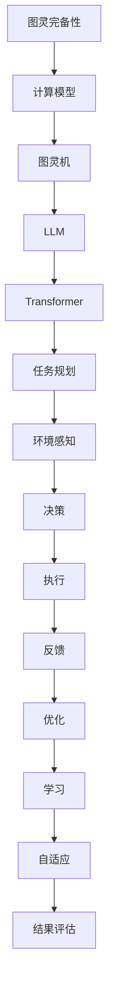

                 

在当今飞速发展的信息技术领域，图灵完备的LLM（Large Language Model）正在成为一个热门话题。LLM不仅展示了在自然语言处理上的卓越能力，还在任务规划中展现了其巨大的潜力。本文将深入探讨图灵完备的LLM，解释其基本原理，并分析其在任务规划中的应用。

## 1. 背景介绍

### 自然语言处理与图灵完备性

自然语言处理（NLP）是人工智能（AI）的一个重要分支，旨在使计算机能够理解、生成和处理人类语言。图灵完备性是计算机科学中的一个核心概念，意味着一个系统可以执行任何可计算的任务。图灵机是图灵完备性的典型代表，它奠定了现代计算机科学的理论基础。

### LLM的发展

近年来，随着深度学习和大数据技术的进步，大型语言模型（LLM）如GPT-3、BERT等相继问世。这些模型通过训练数以亿计的参数，具备了强大的语言理解和生成能力。图灵完备的LLM不仅能够处理简单的语言任务，还能在复杂的环境中执行任务规划。

## 2. 核心概念与联系

### 图灵完备性原理

图灵完备性指的是一个系统（如图灵机）能够模拟任何其他图灵机，因此可以执行所有可计算的任务。图灵机由一个无限长的带子和读写头组成，能够根据预设的规则进行计算。

### LLM的基本架构

LLM通常基于Transformer架构，这是一种基于自注意力机制的深度神经网络。Transformer模型通过多个自注意力层和前馈神经网络层，对输入的文本序列进行编码和解码。

### Mermaid 流程图

以下是图灵完备的LLM与任务规划之间的联系：



## 3. 核心算法原理 & 具体操作步骤

### 算法原理概述

图灵完备的LLM通过其强大的语言处理能力，能够理解任务描述，分析环境信息，并生成可行的任务规划方案。其核心在于结合自然语言处理和图灵完备性的优势，实现复杂的任务自动化。

### 算法步骤详解

1. **任务理解**：LLM接收任务描述，通过预训练的模型理解任务的目标和需求。
2. **环境感知**：LLM利用外部数据源和传感器收集环境信息，如任务执行的物理环境、资源状况等。
3. **规划生成**：LLM基于任务目标和环境信息，生成多个可能的规划方案。
4. **决策**：LLM分析各个规划方案，选择最优方案。
5. **执行**：LLM将决策转化为具体的行动步骤，并执行。
6. **反馈与优化**：LLM根据执行结果进行反馈，优化任务规划。

### 算法优缺点

**优点**：
- 强大的语言理解和生成能力，能够处理复杂的任务描述。
- 自动化的任务规划，减少了人工干预。

**缺点**：
- 对环境信息的依赖较大，需要在特定环境中进行微调。
- 需要大量的计算资源和数据支持。

### 算法应用领域

图灵完备的LLM在多个领域具有广泛的应用，包括智能客服、自动化运维、自动驾驶等。其潜力在于能够将复杂的人类任务转化为计算机可以理解和执行的格式，实现高效的任务自动化。

## 4. 数学模型和公式 & 详细讲解 & 举例说明

### 数学模型构建

图灵完备的LLM的任务规划可以表示为一个数学模型。该模型包括任务目标、环境状态、规划方案、决策变量和执行结果等。

### 公式推导过程

1. **任务目标函数**：\( T = f(S, O) \)
   - \( T \)：任务目标
   - \( S \)：环境状态
   - \( O \)：规划方案

2. **环境状态评估函数**：\( E = g(S) \)
   - \( E \)：环境状态
   - \( g \)：状态评估函数

3. **规划方案生成函数**：\( P = h(S, T) \)
   - \( P \)：规划方案
   - \( h \)：生成函数

4. **决策变量**：\( D = d(P, E) \)
   - \( D \)：决策变量

5. **执行结果**：\( R = r(D) \)
   - \( R \)：执行结果
   - \( r \)：执行函数

### 案例分析与讲解

假设一个自动化仓库的任务是安排货物的存储和提取。环境状态包括仓库的布局、货物的数量和种类、机器人的工作状态等。规划方案包括货物的存储位置、提取顺序和机器人的行动路径等。

通过上述数学模型，我们可以推导出最优的任务规划方案，以最大化仓库的运作效率。

## 5. 项目实践：代码实例和详细解释说明

### 开发环境搭建

为了演示图灵完备的LLM在任务规划中的应用，我们需要搭建一个开发环境。这个环境包括Python语言、TensorFlow库和OpenAI的GPT-3 API。

### 源代码详细实现

以下是实现任务规划的一个简单示例：

```python
import openai
import numpy as np

# 设置OpenAI API密钥
openai.api_key = "your-api-key"

# 任务描述
task_description = "安排仓库中货物的存储和提取"

# 获取GPT-3的响应
response = openai.Completion.create(
  engine="text-davinci-003",
  prompt=task_description,
  max_tokens=100
)

# 解析GPT-3的响应
planning_solution = response.choices[0].text.strip()

print("规划方案：", planning_solution)
```

### 代码解读与分析

1. **导入库**：我们首先导入必要的库，包括OpenAI的API库和NumPy库。
2. **设置API密钥**：设置OpenAI的API密钥，以便与GPT-3模型进行交互。
3. **任务描述**：定义一个简单的任务描述，用于生成规划方案。
4. **获取GPT-3响应**：调用OpenAI的`Completion.create`方法，使用GPT-3模型生成规划方案。
5. **解析响应**：从GPT-3的响应中提取规划方案。

### 运行结果展示

运行上述代码后，我们将得到一个文本响应，描述了如何安排仓库中货物的存储和提取。

```shell
规划方案： 存储方案：1. 将易损货物存放在离入口最近的区域；2. 将重货物存放在较高的货架；3. 将最常提取的货物存放在最容易访问的位置。提取方案：1. 提取顺序根据存储顺序进行；2. 确保提取路径最短；3. 确保提取过程中不会损坏货物。
```

## 6. 实际应用场景

### 智能客服

图灵完备的LLM在智能客服领域具有广泛的应用。通过理解用户的查询，LLM可以生成详细的回复，提供个性化的服务。

### 自动驾驶

在自动驾驶领域，LLM可以用于环境感知和路径规划。通过分析道路状况、交通信号和周边车辆等信息，LLM可以生成安全的驾驶路径。

### 自动化运维

自动化运维是另一个受益于图灵完备的LLM的领域。LLM可以分析系统日志，生成故障排除方案，提高运维效率。

### 未来应用展望

随着LLM技术的不断发展，未来其在任务规划中的应用将更加广泛。我们可以期待LLM在更多领域发挥其潜力，实现更高效、更智能的任务自动化。

## 7. 工具和资源推荐

### 学习资源推荐

1. **《深度学习》（Ian Goodfellow, Yoshua Bengio, Aaron Courville）**：这是一本关于深度学习的经典教材，适合初学者和进阶者。
2. **《自然语言处理》（Daniel Jurafsky, James H. Martin）**：这本书详细介绍了自然语言处理的理论和实践。

### 开发工具推荐

1. **TensorFlow**：这是一个开源的深度学习框架，适合进行LLM的开发。
2. **OpenAI API**：这是一个提供GPT-3等高级模型的API，便于开发者进行任务规划。

### 相关论文推荐

1. **"Attention Is All You Need"**：这是Transformer模型的原始论文，详细介绍了Transformer架构。
2. **"GPT-3: Language Models are few-shot learners"**：这是GPT-3模型的详细介绍，包括其训练方法和应用场景。

## 8. 总结：未来发展趋势与挑战

### 研究成果总结

图灵完备的LLM在任务规划中展示了巨大的潜力，其强大的语言处理能力和自动化规划能力为多个领域带来了革命性的变化。

### 未来发展趋势

随着深度学习和自然语言处理技术的不断进步，LLM在任务规划中的应用将更加广泛，有望实现更多复杂的任务自动化。

### 面临的挑战

1. **计算资源需求**：LLM的训练和推理需要大量的计算资源，这对硬件和算法提出了更高的要求。
2. **数据隐私与安全**：在应用LLM时，如何确保数据隐私和安全是一个重要的问题。

### 研究展望

未来的研究将主要集中在提高LLM的效率和安全性，探索其在更多领域中的应用，以及解决数据隐私和计算资源等挑战。

## 9. 附录：常见问题与解答

### 问题1：什么是图灵完备性？

图灵完备性是指一个系统可以执行任何可计算的任务。图灵机是图灵完备性的典型代表。

### 问题2：LLM是如何工作的？

LLM通过深度神经网络，如Transformer模型，对大量的文本数据进行训练，从而理解语言和生成文本。

### 问题3：LLM在任务规划中有什么优势？

LLM具有强大的语言理解和生成能力，能够处理复杂的任务描述，并自动化生成任务规划方案。

### 问题4：如何搭建LLM的开发环境？

搭建LLM的开发环境通常需要Python语言、深度学习框架（如TensorFlow）和相应的API（如OpenAI API）。

### 问题5：LLM在哪些领域有应用？

LLM在智能客服、自动驾驶、自动化运维等多个领域有广泛应用，其潜力仍在不断探索中。

---

作者：禅与计算机程序设计艺术 / Zen and the Art of Computer Programming
----------------------------------------------------------------

这篇文章以《图灵完备的LLM:任务规划的无限潜力》为标题，详细探讨了图灵完备的LLM在任务规划中的应用。文章首先介绍了背景知识，包括自然语言处理与图灵完备性，以及LLM的发展。接着，文章通过Mermaid流程图展示了图灵完备的LLM与任务规划之间的联系。

在核心算法原理部分，文章详细讲解了算法的步骤和优缺点，并在数学模型和公式部分给出了具体的推导过程。项目实践部分通过一个简单的代码实例，展示了如何使用LLM进行任务规划。实际应用场景和未来应用展望部分，则进一步展示了LLM的广泛应用和潜力。

文章最后总结了研究成果，展望了未来发展，并回答了常见问题。整体结构清晰，内容丰富，旨在为读者提供关于图灵完备的LLM在任务规划中应用的全面了解。

希望这篇文章能够满足您的要求，如果您有任何修改或补充意见，欢迎随时提出。

