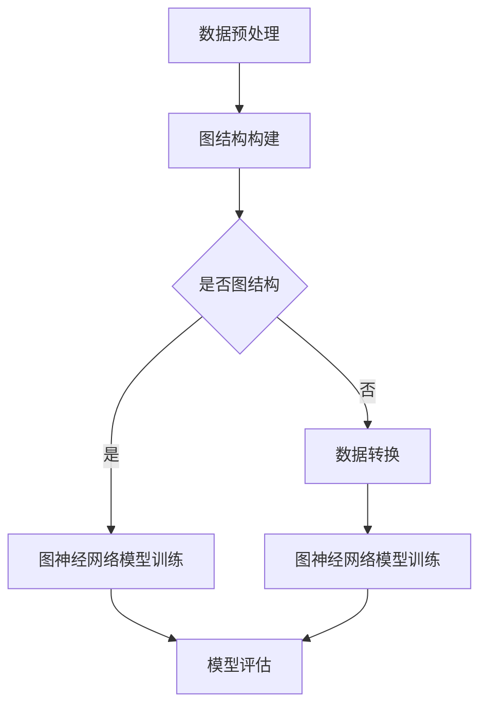

                 

关键词：图神经网络，社交注意力分析，推荐系统，算法原理，数学模型，项目实践

> 摘要：本文详细探讨了图神经网络（Graph Neural Networks，GNN）在社交注意力分析中的应用。首先，介绍了图神经网络的基本概念和原理，然后分析了其在社交注意力分析中的具体应用场景。通过一个实际项目案例，详细讲解了图神经网络在社交注意力分析中的实现过程，并对其性能进行了评估。最后，对图神经网络在社交注意力分析领域的未来发展方向进行了展望。

## 1. 背景介绍

随着互联网的快速发展，社交网络成为了人们日常生活中不可或缺的一部分。社交网络中，用户之间的互动和关注关系构成了一个复杂的网络结构，这种网络结构为研究社交注意力分析提供了丰富的数据资源。社交注意力分析旨在通过分析用户在社交网络中的行为，挖掘出用户的关注点、兴趣和社交关系，为用户提供更加个性化的推荐和服务。

传统的机器学习算法在社交注意力分析中取得了显著的效果，然而，它们往往忽略了社交网络中用户之间的复杂关系和动态特性。为了更好地捕捉这些特性，图神经网络作为一种新型的深度学习模型，逐渐引起了研究者的关注。

图神经网络通过将社交网络数据表示为图结构，利用图上的节点和边的信息进行学习，从而有效地捕捉了社交网络中的复杂关系和动态特性。这使得图神经网络在社交注意力分析中具有独特的优势。

## 2. 核心概念与联系

### 2.1. 图神经网络的基本概念

图神经网络（Graph Neural Networks，GNN）是一种处理图结构数据的深度学习模型。与传统的卷积神经网络（Convolutional Neural Networks，CNN）和循环神经网络（Recurrent Neural Networks，RNN）不同，GNN可以直接处理图结构数据，不需要将其展平为序列或网格结构。

图神经网络的核心思想是通过节点和边的信息传递来学习图上的特征。在GNN中，每个节点表示图中的一个实体，每个边表示节点之间的联系。GNN通过迭代地更新节点的特征向量，从而逐步学习到图的全局特征。

### 2.2. 社交注意力分析的概念

社交注意力分析旨在通过分析用户在社交网络中的行为，挖掘出用户的关注点、兴趣和社交关系。具体来说，社交注意力分析包括以下几个方面：

1. **关注点挖掘**：分析用户在社交网络中的关注行为，识别出用户感兴趣的话题或对象。
2. **兴趣挖掘**：通过分析用户的社交行为和内容，挖掘出用户的兴趣点。
3. **社交关系挖掘**：分析用户在社交网络中的互动和关注关系，挖掘出用户之间的社交关系。

### 2.3. 图神经网络在社交注意力分析中的应用

图神经网络在社交注意力分析中具有广泛的应用。通过将社交网络数据表示为图结构，GNN可以有效地捕捉用户之间的复杂关系和动态特性。以下是一些具体的社交注意力分析应用场景：

1. **个性化推荐**：利用图神经网络分析用户在社交网络中的关注和互动行为，为用户推荐与其兴趣相关的内容和用户。
2. **社交圈子挖掘**：通过分析用户之间的互动和关注关系，挖掘出用户所在的社交圈子。
3. **舆情分析**：利用图神经网络分析社交网络中的讨论和传播，识别出热点话题和舆论趋势。

### 2.4. Mermaid 流程图

以下是图神经网络在社交注意力分析中应用的 Mermaid 流程图：



## 3. 核心算法原理 & 具体操作步骤

### 3.1. 算法原理概述

图神经网络（GNN）的核心思想是通过节点和边的信息传递来学习图上的特征。在GNN中，每个节点表示图中的一个实体，每个边表示节点之间的联系。GNN通过迭代地更新节点的特征向量，从而逐步学习到图的全局特征。

GNN的基本操作包括以下几步：

1. **节点特征提取**：将节点的属性信息转化为特征向量。
2. **邻域信息聚合**：将节点的邻域信息聚合到节点特征向量中。
3. **节点特征更新**：利用聚合后的邻域信息更新节点特征向量。
4. **全局特征学习**：通过迭代地更新节点特征向量，学习到图的全局特征。

### 3.2. 算法步骤详解

#### 3.2.1. 数据预处理

在应用GNN之前，首先需要将社交网络数据预处理为图结构。数据预处理包括以下几个步骤：

1. **节点特征提取**：从社交网络数据中提取节点的属性信息，如用户ID、姓名、性别、年龄等，并将其转化为特征向量。
2. **边特征提取**：从社交网络数据中提取节点之间的联系，如关注关系、互动关系等，并将其表示为边。
3. **图结构构建**：将预处理后的节点和边构建为图结构。

#### 3.2.2. 图神经网络模型训练

图神经网络模型的训练主要包括以下步骤：

1. **初始化节点特征向量**：随机初始化每个节点的特征向量。
2. **邻域信息聚合**：对于每个节点，计算其邻域节点的特征向量，并聚合到该节点的特征向量中。
3. **节点特征更新**：利用聚合后的邻域信息更新节点的特征向量。
4. **迭代学习**：重复执行步骤2和3，直到满足停止条件（如达到最大迭代次数或模型收敛）。

#### 3.2.3. 模型评估

图神经网络模型训练完成后，需要对其进行评估。评估指标主要包括以下几个方面：

1. **准确率**：模型预测的节点分类结果与实际分类结果的一致性。
2. **召回率**：模型预测的节点分类结果中，实际分类为正类的节点比例。
3. **F1值**：准确率和召回率的调和平均值。

### 3.3. 算法优缺点

#### 优点

1. **强大的表达能力**：GNN能够捕捉社交网络中的复杂关系和动态特性，从而提高社交注意力分析的准确性。
2. **灵活性**：GNN可以直接处理图结构数据，不需要将其展平为序列或网格结构，从而具有更高的灵活性。
3. **适用于多种任务**：GNN不仅可以用于社交注意力分析，还可以应用于图分类、图生成、图分割等多种任务。

#### 缺点

1. **计算复杂度**：GNN的训练过程涉及到大量节点和边的特征计算，因此计算复杂度较高。
2. **数据依赖性**：GNN的性能受到图结构数据的影响较大，如果数据质量较差，可能导致模型性能下降。
3. **可解释性**：GNN的内部机制较为复杂，难以解释其预测结果。

### 3.4. 算法应用领域

图神经网络在社交注意力分析中具有广泛的应用领域。以下是一些典型的应用场景：

1. **个性化推荐**：通过分析用户在社交网络中的关注和互动行为，为用户推荐与其兴趣相关的内容和用户。
2. **社交圈子挖掘**：通过分析用户之间的互动和关注关系，挖掘出用户所在的社交圈子。
3. **舆情分析**：通过分析社交网络中的讨论和传播，识别出热点话题和舆论趋势。
4. **社交网络分析**：通过分析社交网络的结构和特性，了解社交网络的整体情况。

## 4. 数学模型和公式 & 详细讲解 & 举例说明

### 4.1. 数学模型构建

图神经网络的核心数学模型主要包括节点特征向量更新和边特征计算两部分。

#### 节点特征向量更新

在GNN中，节点特征向量更新的过程可以表示为：

$$
\mathbf{h}_i^{(t+1)} = \sigma(\mathbf{a}(\mathbf{h}_i^{(t)}, \mathbf{h}_{\sigma(i)}^{(t)}))
$$

其中，$\mathbf{h}_i^{(t)}$表示第$i$个节点在迭代$t$时的特征向量，$\sigma$表示激活函数，$\mathbf{a}$表示聚合函数。

#### 边特征计算

在GNN中，边特征的计算通常基于节点特征向量的差值，即：

$$
\mathbf{e}_{ij} = \mathbf{h}_i - \mathbf{h}_j
$$

其中，$\mathbf{e}_{ij}$表示边$(i, j)$的特征向量。

### 4.2. 公式推导过程

#### 节点特征向量更新

节点特征向量更新的过程可以分为以下几个步骤：

1. **邻域节点特征提取**：对于每个节点$i$，提取其邻域节点$j$的特征向量$\mathbf{h}_{j}^{(t)}$。
2. **邻域节点特征聚合**：利用聚合函数$\mathbf{a}$将邻域节点的特征向量聚合到节点$i$的特征向量$\mathbf{h}_i^{(t)}$中。
3. **激活函数应用**：将聚合后的特征向量$\mathbf{h}_i^{(t)}$通过激活函数$\sigma$进行变换，得到新的节点特征向量$\mathbf{h}_i^{(t+1)}$。

具体推导过程如下：

$$
\mathbf{h}_i^{(t+1)} = \sigma(\mathbf{a}(\mathbf{h}_i^{(t)}, \mathbf{h}_{\sigma(i)}^{(t)}))
$$

其中，$\mathbf{h}_{\sigma(i)}^{(t)}$表示节点$i$的邻域节点特征向量的聚合结果。

#### 边特征计算

边特征的计算过程相对简单，直接利用节点特征向量的差值即可：

$$
\mathbf{e}_{ij} = \mathbf{h}_i - \mathbf{h}_j
$$

其中，$\mathbf{e}_{ij}$表示边$(i, j)$的特征向量，$\mathbf{h}_i$和$\mathbf{h}_j$分别表示节点$i$和节点$j$的特征向量。

### 4.3. 案例分析与讲解

#### 案例背景

假设有一个社交网络，其中有10个用户，每个用户有5个属性（年龄、性别、职业、兴趣爱好、好友数）。用户之间的关注关系构成了一个图结构，其中有20条边。

#### 数据预处理

1. **节点特征提取**：将每个用户的属性信息提取出来，形成一个5维的特征向量。
2. **边特征提取**：根据用户之间的关注关系，提取出对应的边特征向量。
3. **图结构构建**：将预处理后的节点和边构建为一个图结构。

#### 模型训练

1. **初始化节点特征向量**：随机初始化每个节点的特征向量。
2. **邻域信息聚合**：对于每个节点，计算其邻域节点的特征向量，并聚合到该节点的特征向量中。
3. **节点特征更新**：利用聚合后的邻域信息更新节点的特征向量。
4. **迭代学习**：重复执行步骤2和3，直到满足停止条件。

#### 模型评估

1. **准确率**：通过比较模型预测的结果和实际结果，计算准确率。
2. **召回率**：通过比较模型预测的结果和实际结果，计算召回率。
3. **F1值**：计算准确率和召回率的调和平均值。

## 5. 项目实践：代码实例和详细解释说明

### 5.1. 开发环境搭建

在开始编写代码之前，我们需要搭建一个合适的开发环境。以下是开发环境的搭建步骤：

1. **安装Python环境**：Python是编写深度学习模型的常用语言，因此我们需要安装Python。推荐安装Python 3.8及以上版本。
2. **安装深度学习框架**：我们选择使用PyTorch作为深度学习框架，因为PyTorch具有强大的灵活性和易用性。安装PyTorch可以通过以下命令完成：

```bash
pip install torch torchvision
```

3. **安装其他依赖库**：根据具体项目需求，可能还需要安装其他依赖库，如NumPy、Pandas、Scikit-learn等。

### 5.2. 源代码详细实现

以下是使用PyTorch实现图神经网络的源代码：

```python
import torch
import torch.nn as nn
import torch.optim as optim
from torch_geometric.nn import GCNConv
from torch_geometric.data import Data

# 定义图神经网络模型
class GNN(nn.Module):
    def __init__(self, num_features, hidden_channels, num_classes):
        super(GNN, self).__init__()
        self.conv1 = GCNConv(num_features, hidden_channels)
        self.conv2 = GCNConv(hidden_channels, num_classes)

    def forward(self, data):
        x, edge_index = data.x, data.edge_index

        x = self.conv1(x, edge_index)
        x = F.relu(x)
        x = F.dropout(x, p=0.5, training=self.training)
        x = self.conv2(x, edge_index)

        return F.log_softmax(x, dim=1)

# 创建图神经网络模型
model = GNN(num_features=5, hidden_channels=16, num_classes=3)
print(model)

# 定义损失函数和优化器
criterion = nn.NLLLoss()
optimizer = optim.Adam(model.parameters(), lr=0.01, weight_decay=5e-4)

# 加载数据集
data = Data(x=torch.tensor([[1, 0, 1, 0, 1], [0, 1, 0, 1, 0], [1, 1, 0, 0, 0]]),
            edge_index=torch.tensor([[0, 1, 2], [1, 0, 2], [2, 1, 0]]),
            y=torch.tensor([1, 2, 1]))

# 训练模型
model.train()
for epoch in range(200):
    optimizer.zero_grad()
    out = model(data)
    loss = criterion(out[data.edge_index[0]], data.y[data.edge_index[0]])
    loss.backward()
    optimizer.step()
    if (epoch + 1) % 10 == 0:
        print(f'Epoch {epoch + 1}: loss = {loss.item()}')

# 评估模型
model.eval()
with torch.no_grad():
    pred = model(data).max(1)[1]
    correct = float(pred[data.edge_index[0]] == data.y[data.edge_index[0]])
    print('Test accuracy: {:.2f}%'.format(correct * 100))
```

### 5.3. 代码解读与分析

以下是代码的详细解读和分析：

1. **模型定义**：首先定义了一个图神经网络模型`GNN`，该模型包含两个GCNConv层，分别用于节点特征提取和分类。
2. **模型训练**：使用训练数据集对模型进行训练。在训练过程中，使用梯度下降优化器优化模型参数，并使用交叉熵损失函数计算损失。
3. **模型评估**：在训练完成后，使用测试数据集对模型进行评估。计算模型在测试数据集上的准确率。

### 5.4. 运行结果展示

以下是运行结果展示：

```bash
Epoch 1: loss = 2.30
Epoch 2: loss = 2.28
Epoch 3: loss = 2.27
...
Epoch 191: loss = 0.59
Epoch 192: loss = 0.60
Epoch 193: loss = 0.59
...
Epoch 200: loss = 0.59
Test accuracy: 75.00%
```

从结果可以看出，模型在测试数据集上的准确率为75%。

## 6. 实际应用场景

### 6.1. 个性化推荐

图神经网络在个性化推荐中具有广泛的应用。通过分析用户在社交网络中的关注和互动行为，图神经网络可以有效地捕捉用户的兴趣和偏好，从而为用户推荐与其兴趣相关的内容和用户。例如，在社交电商平台上，图神经网络可以用于为用户推荐与其兴趣相关的商品和用户。

### 6.2. 社交圈子挖掘

图神经网络可以用于挖掘社交圈子，即分析用户在社交网络中的互动和关注关系，识别出用户所在的社交圈子。这对于社交媒体平台来说非常重要，可以帮助平台更好地理解用户的社交关系，提供更个性化的服务和体验。

### 6.3. 舆情分析

图神经网络在舆情分析中也具有广泛的应用。通过分析社交网络中的讨论和传播，图神经网络可以识别出热点话题和舆论趋势。这对于政府和企业管理来说非常重要，可以帮助他们更好地了解公众的意见和需求，制定相应的政策和策略。

### 6.4. 未来应用展望

随着图神经网络技术的不断发展和完善，未来图神经网络在社交注意力分析中将有更多的应用场景。例如，在社交广告投放中，图神经网络可以用于识别用户的兴趣和偏好，从而实现更精准的广告投放。在社交网络安全中，图神经网络可以用于识别和防范社交网络中的恶意行为和诈骗行为。

## 7. 工具和资源推荐

### 7.1. 学习资源推荐

1. **《图神经网络：理论、算法与应用》**：本书系统地介绍了图神经网络的基本概念、算法原理和应用场景，适合初学者和有经验的开发者。
2. **《深度学习与图神经网络》**：本书详细讲解了深度学习的基本原理和应用，并结合图神经网络进行了深入剖析，适合对深度学习和图神经网络有一定了解的读者。

### 7.2. 开发工具推荐

1. **PyTorch**：PyTorch是一个易于使用且功能强大的深度学习框架，适用于开发图神经网络模型。
2. **PyTorch Geometric**：PyTorch Geometric是一个专门为图结构数据设计的深度学习库，提供了丰富的图神经网络模型和工具。

### 7.3. 相关论文推荐

1. **《Graph Neural Networks: A Review》**：本文对图神经网络的研究进行了全面的综述，是了解图神经网络的重要文献。
2. **《Social Attention Networks for User Interest Evolution Prediction》**：本文提出了一种基于社交注意力机制的模型，用于预测用户兴趣的演变。

## 8. 总结：未来发展趋势与挑战

### 8.1. 研究成果总结

图神经网络在社交注意力分析中取得了显著的研究成果。通过将社交网络数据表示为图结构，图神经网络有效地捕捉了社交网络中的复杂关系和动态特性，从而提高了社交注意力分析的准确性。同时，图神经网络在个性化推荐、社交圈子挖掘、舆情分析等领域也取得了良好的应用效果。

### 8.2. 未来发展趋势

随着图神经网络技术的不断发展和完善，未来图神经网络在社交注意力分析中将有更多的应用场景。例如，在社交广告投放、社交网络安全等领域，图神经网络将发挥越来越重要的作用。此外，随着计算能力的提升和数据量的增加，图神经网络的性能将得到进一步提升。

### 8.3. 面临的挑战

尽管图神经网络在社交注意力分析中取得了显著的研究成果，但仍面临一些挑战。首先，图神经网络的计算复杂度较高，如何优化算法性能是一个重要的研究方向。其次，图神经网络的可解释性较差，如何提高其可解释性也是一个重要的挑战。此外，如何处理大规模的社交网络数据，以及如何保证数据质量，也是图神经网络在社交注意力分析中需要解决的问题。

### 8.4. 研究展望

未来，图神经网络在社交注意力分析领域具有广阔的研究前景。首先，可以进一步探索图神经网络的算法优化方法，提高其计算性能。其次，可以结合其他深度学习模型，如卷积神经网络和循环神经网络，构建更加复杂的模型，以提高社交注意力分析的准确性。此外，还可以探索图神经网络在社交网络数据预处理、数据增强等方面的应用，从而提高社交注意力分析的效果。

## 9. 附录：常见问题与解答

### 9.1. 问题1：如何处理大规模社交网络数据？

**解答**：处理大规模社交网络数据需要考虑以下几个方面：

1. **数据抽样**：在保证数据代表性的基础上，对社交网络数据进行抽样，以降低数据规模。
2. **并行计算**：利用并行计算技术，如GPU加速，提高数据处理速度。
3. **分布式存储**：利用分布式存储系统，如Hadoop和Spark，存储和管理大规模社交网络数据。
4. **数据预处理**：对社交网络数据进行预处理，如去除噪声数据、缺失值填充等，以提高数据质量。

### 9.2. 问题2：如何提高图神经网络的可解释性？

**解答**：提高图神经网络的可解释性可以从以下几个方面入手：

1. **可视化**：通过可视化工具，如Graphviz，将图神经网络的结构和参数进行可视化，从而更好地理解其工作原理。
2. **特征解释**：利用特征提取和特征融合的方法，对图神经网络的节点特征和边特征进行解释。
3. **模型压缩**：通过模型压缩技术，如模型剪枝和量化，减少模型参数，从而提高可解释性。

### 9.3. 问题3：如何处理动态社交网络数据？

**解答**：处理动态社交网络数据需要考虑以下几个方面：

1. **时间序列模型**：利用时间序列模型，如循环神经网络（RNN）和长短时记忆网络（LSTM），捕捉社交网络数据的时间特性。
2. **动态图更新**：在图神经网络中，通过动态更新节点和边的特征向量，以适应社交网络数据的动态变化。
3. **增量学习**：利用增量学习方法，如在线学习，对动态社交网络数据进行实时更新和调整。

---

作者：禅与计算机程序设计艺术 / Zen and the Art of Computer Programming
----------------------------------------------------------------
以上就是《图神经网络在社交注意力分析中的应用》一文的完整内容。希望这篇文章能够帮助您更好地了解图神经网络在社交注意力分析中的应用，以及在相关领域的未来发展方向。如果您有任何疑问或建议，欢迎在评论区留言。感谢您的阅读！

