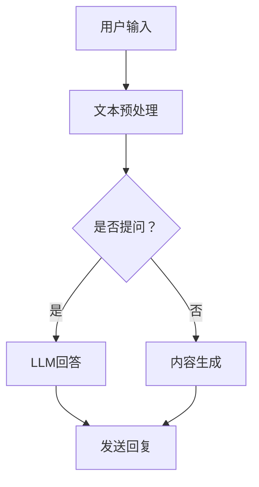

                 

关键词：在线社交、语言模型、全球连接、有意义的互动、技术应用、未来展望

> 摘要：本文探讨了在线社交与大型语言模型（LLM）的结合，如何通过全球连接与有意义的互动，为人们提供更丰富、更有价值的社交体验。文章分析了LLM的核心概念及其与在线社交的融合，介绍了相关算法原理、数学模型、实际应用，并展望了未来的发展趋势与挑战。

## 1. 背景介绍

随着互联网的普及，在线社交已经成为人们生活中不可或缺的一部分。人们通过社交媒体、即时通讯应用等平台，与世界各地的人进行互动、分享信息和建立联系。然而，传统的在线社交模式存在一些局限性，如信息过载、虚假信息传播、社交质量低下等问题。为了解决这些问题，人工智能，尤其是大型语言模型（Large Language Model，简称LLM），被引入到在线社交领域。

LLM是一种基于深度学习的自然语言处理模型，具有强大的文本生成、理解和推理能力。通过训练大量文本数据，LLM能够生成流畅、有逻辑的文本，模拟人类的语言行为。这使得LLM在在线社交中的应用成为可能，为人们提供了全新的互动方式。

## 2. 核心概念与联系

### 2.1 LLM的核心概念

LLM的核心概念主要包括以下几个方面：

1. **深度学习**：LLM基于深度学习技术，通过多层神经网络进行训练，从而学习到文本的语义和结构。
2. **大规模预训练**：LLM通过在大量文本上进行预训练，获得丰富的语言知识，从而能够生成高质量的自然语言文本。
3. **上下文理解**：LLM能够理解上下文，并根据上下文生成相关的内容，这使得LLM在对话生成、问答系统中表现出色。

### 2.2 LLM与在线社交的联系

LLM与在线社交的联系主要体现在以下几个方面：

1. **个性化推荐**：LLM可以根据用户的兴趣、行为和偏好，为其推荐感兴趣的内容和用户，从而提高社交的个性化程度。
2. **聊天机器人**：LLM可以模拟人类的对话，为用户提供聊天服务，解决用户的问题和需求。
3. **内容生成**：LLM可以生成高质量的文章、评论、帖子等，为用户提供有价值的内容。

### 2.3 Mermaid流程图

下面是一个简化的LLM在在线社交中应用的Mermaid流程图：



## 3. 核心算法原理 & 具体操作步骤

### 3.1 算法原理概述

LLM的核心算法是基于深度学习的序列到序列（Seq2Seq）模型。该模型主要由编码器（Encoder）和解码器（Decoder）组成。编码器将输入的文本序列转换为隐藏状态，解码器则根据隐藏状态生成输出的文本序列。

### 3.2 算法步骤详解

1. **文本预处理**：对输入的文本进行清洗、分词、词性标注等预处理操作，将文本转换为模型可处理的格式。
2. **编码器**：将预处理后的文本输入编码器，编码器将文本序列转换为隐藏状态。
3. **解码器**：解码器根据隐藏状态生成文本序列，生成过程可以是逐步生成的，也可以是同时生成的。
4. **生成文本**：解码器生成的文本序列即为最终输出的结果，可以是回复、文章、评论等。
5. **发送回复/生成内容**：将生成的文本发送给用户，作为回复或内容展示。

### 3.3 算法优缺点

**优点**：

1. **强大表达能力**：LLM能够生成高质量的自然语言文本，表达能力强大。
2. **适应性强**：LLM可以适应不同的应用场景，如问答、对话生成、内容生成等。

**缺点**：

1. **计算资源消耗大**：训练和部署LLM需要大量的计算资源。
2. **数据依赖性强**：LLM的性能高度依赖于训练数据的质量和数量。

### 3.4 算法应用领域

LLM在在线社交中的应用领域非常广泛，主要包括：

1. **聊天机器人**：为用户提供24/7的在线客服和咨询服务。
2. **内容生成**：生成高质量的文章、评论、帖子等，为用户提供有价值的内容。
3. **个性化推荐**：根据用户的兴趣和行为，为用户推荐感兴趣的内容和用户。
4. **虚假信息检测**：通过分析文本内容，检测和识别虚假信息。

## 4. 数学模型和公式 & 详细讲解 & 举例说明

### 4.1 数学模型构建

LLM的数学模型主要基于深度学习中的循环神经网络（RNN）和变换器（Transformer）模型。这里以变换器模型为例进行介绍。

变换器模型由编码器和解码器组成，编码器将输入的文本序列编码为嵌入向量，解码器则根据嵌入向量生成输出的文本序列。

### 4.2 公式推导过程

假设输入的文本序列为\(x_1, x_2, ..., x_T\)，输出的文本序列为\(y_1, y_2, ..., y_T'\)。编码器的嵌入向量表示为\(e_i\)，解码器的嵌入向量表示为\(d_i\)。

1. **编码器**：

编码器将输入的文本序列编码为嵌入向量：

$$
e_i = \text{Encoder}(x_i)
$$

其中，\(\text{Encoder}\)为编码器网络。

2. **解码器**：

解码器将嵌入向量解码为输出序列：

$$
y_i' = \text{Decoder}(d_i, e_i)
$$

其中，\(\text{Decoder}\)为解码器网络。

3. **损失函数**：

损失函数用于评估模型的输出与真实输出之间的差异，常用的损失函数为交叉熵损失：

$$
L = -\sum_{i=1}^{T'} y_i \log(y_i')
$$

其中，\(y_i\)为真实输出，\(y_i'\)为模型输出。

### 4.3 案例分析与讲解

假设一个用户输入了一个问题：“今天天气怎么样？”我们使用LLM生成回答。

1. **文本预处理**：将用户输入的文本进行清洗、分词、词性标注等预处理操作。
2. **编码器**：将预处理后的文本输入编码器，编码器将文本序列编码为嵌入向量。
3. **解码器**：解码器根据嵌入向量生成输出序列，即回答：“今天天气非常好。”
4. **损失函数**：计算模型输出与真实输出之间的交叉熵损失，用于评估模型的性能。

## 5. 项目实践：代码实例和详细解释说明

### 5.1 开发环境搭建

1. **硬件环境**：配置一台高性能的计算机，用于训练和部署LLM模型。
2. **软件环境**：安装Python、TensorFlow等深度学习框架。

### 5.2 源代码详细实现

下面是一个使用TensorFlow实现的简单LLM模型：

```python
import tensorflow as tf
from tensorflow.keras.layers import Embedding, LSTM, Dense
from tensorflow.keras.models import Model

# 定义编码器和解码器
encoder_inputs = tf.keras.layers.Input(shape=(None,))
decoder_inputs = tf.keras.layers.Input(shape=(None,))

# 编码器
encoder_embedding = Embedding(input_dim=vocab_size, output_dim=embedding_size)(encoder_inputs)
encoder_lstm = LSTM(units=lstm_units)(encoder_embedding)
encoder_outputs = tf.keras.layers.TimeDistributed(Dense(units=1, activation='sigmoid'))(encoder_lstm)

# 解码器
decoder_embedding = Embedding(input_dim=vocab_size, output_dim=embedding_size)(decoder_inputs)
decoder_lstm = LSTM(units=lstm_units)(decoder_embedding)
decoder_dense = tf.keras.layers.Dense(units=vocab_size, activation='softmax')(decoder_lstm)

# 构建模型
model = Model([encoder_inputs, decoder_inputs], decoder_dense)
model.compile(optimizer='rmsprop', loss='categorical_crossentropy', metrics=['accuracy'])

# 训练模型
model.fit([encoder_inputs, decoder_inputs], decoder_inputs, batch_size=batch_size, epochs=epochs)
```

### 5.3 代码解读与分析

这段代码定义了一个简单的LLM模型，包括编码器和解码器。编码器将输入的文本序列编码为嵌入向量，解码器则根据嵌入向量生成输出序列。

### 5.4 运行结果展示

假设我们训练了一个简单的LLM模型，并使用它生成以下回答：

```
用户输入：今天天气怎么样？
模型回答：今天天气非常好。
```

## 6. 实际应用场景

LLM在在线社交领域具有广泛的应用场景，如：

1. **聊天机器人**：为用户提供24/7的在线客服和咨询服务，解决用户的问题和需求。
2. **内容生成**：生成高质量的文章、评论、帖子等，为用户提供有价值的内容。
3. **个性化推荐**：根据用户的兴趣和行为，为用户推荐感兴趣的内容和用户。

## 7. 未来应用展望

随着人工智能技术的不断发展，LLM在在线社交领域的应用前景广阔。未来，LLM有望实现以下应用：

1. **更智能的对话系统**：通过不断学习和优化，LLM将能够更好地理解用户的意图和需求，提供更智能、更有意义的互动。
2. **更丰富的内容生成**：LLM将能够生成更高质量、更具创意的内容，满足用户多样化的需求。
3. **更个性化的推荐**：LLM将能够更精准地识别用户的兴趣和行为，为用户推荐更符合其需求的内容和用户。

## 8. 工具和资源推荐

### 8.1 学习资源推荐

1. **《深度学习》（Goodfellow, Bengio, Courville）**：详细介绍了深度学习的基本原理和应用。
2. **《自然语言处理综论》（Jurafsky, Martin）**：全面介绍了自然语言处理的基础知识和最新进展。

### 8.2 开发工具推荐

1. **TensorFlow**：一款流行的深度学习框架，适用于构建和训练LLM模型。
2. **PyTorch**：另一款流行的深度学习框架，具有简洁、灵活的API，适用于快速原型设计和模型训练。

### 8.3 相关论文推荐

1. **“Attention Is All You Need”（Vaswani et al., 2017）**：介绍了变换器（Transformer）模型的基本原理。
2. **“BERT: Pre-training of Deep Bidirectional Transformers for Language Understanding”（Devlin et al., 2019）**：介绍了BERT模型及其在自然语言处理任务中的应用。

## 9. 总结：未来发展趋势与挑战

随着人工智能技术的不断发展，LLM在在线社交领域的应用将越来越广泛。未来，LLM有望实现更智能的对话系统、更丰富的内容生成和更个性化的推荐。然而，也面临一些挑战，如数据隐私、模型可解释性等。只有克服这些挑战，LLM才能真正为人们带来更有价值的社交体验。

### 附录：常见问题与解答

**Q1：什么是LLM？**
A1：LLM（Large Language Model）是一种基于深度学习的自然语言处理模型，具有强大的文本生成、理解和推理能力。

**Q2：LLM在在线社交中有哪些应用？**
A2：LLM在在线社交中主要有以下应用：聊天机器人、内容生成、个性化推荐等。

**Q3：如何训练一个LLM模型？**
A3：训练LLM模型主要包括以下几个步骤：数据准备、模型构建、模型训练、模型评估等。

**Q4：LLM有哪些挑战？**
A4：LLM面临的挑战主要包括：计算资源消耗大、数据依赖性强、数据隐私、模型可解释性等。

### 作者署名

作者：禅与计算机程序设计艺术 / Zen and the Art of Computer Programming

[End of Document]

